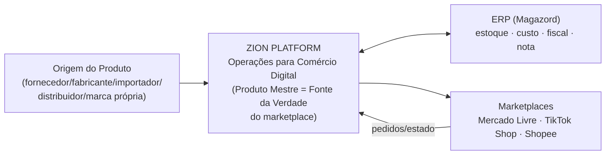
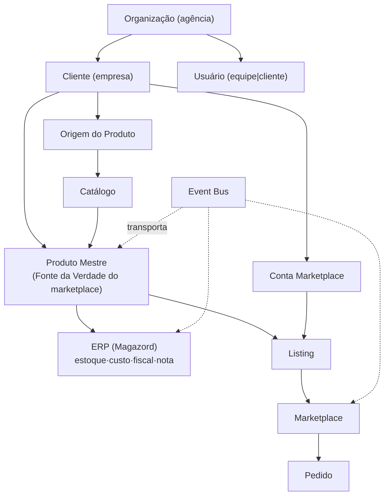
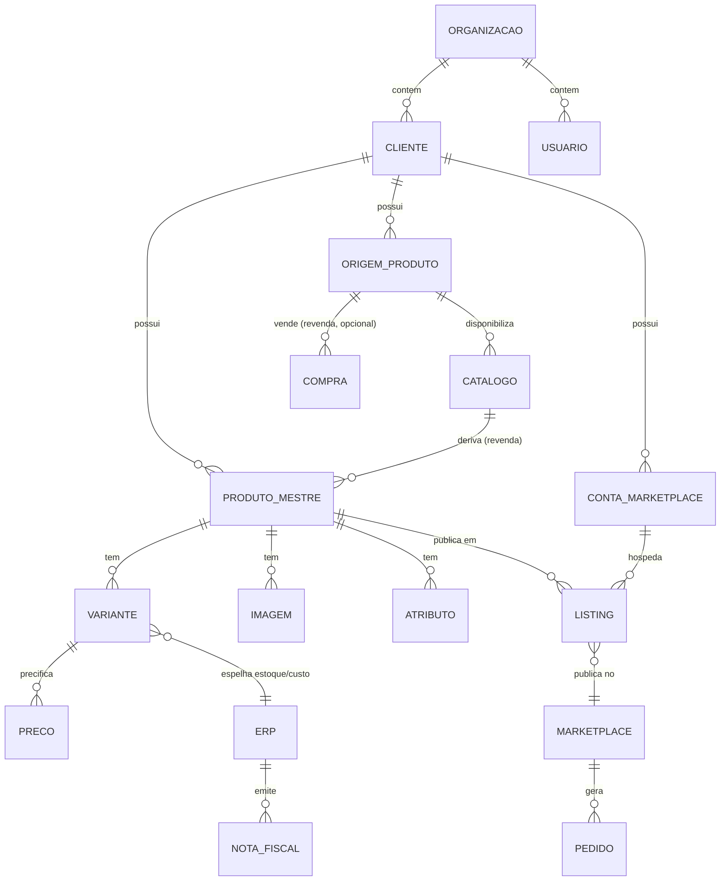
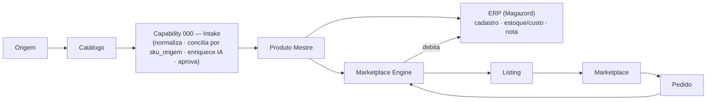
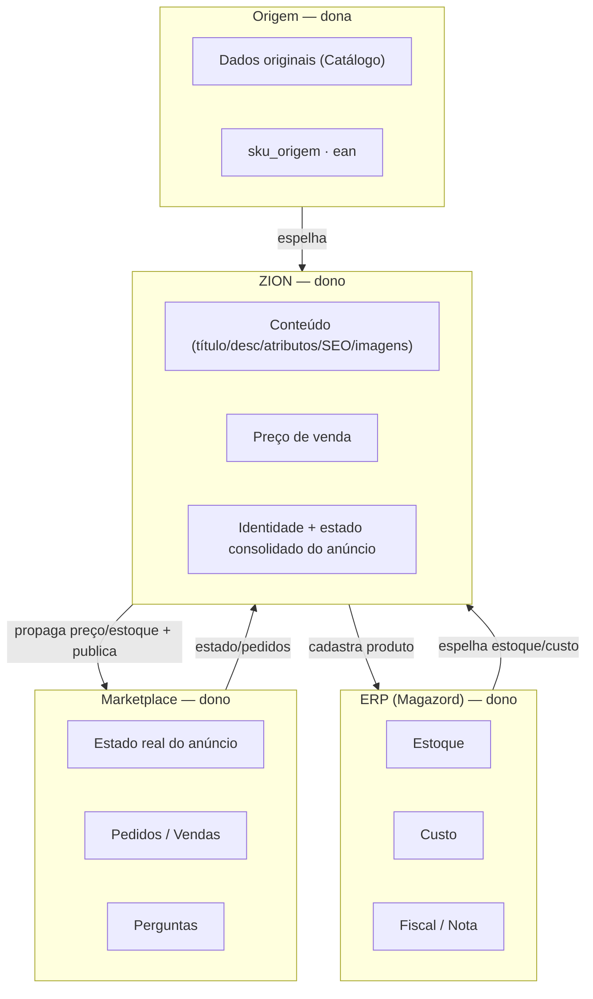

# 000 — Business Domain

> **Constituição da Zion Platform.** Define a **linguagem oficial do domínio** (ubiquitous language) usada por toda a arquitetura e por todos os desenvolvedores. Onde houver dois nomes possíveis para o mesmo conceito, **este documento escolhe um** — e ele prevalece. Documento de arquitetura — **sem implementação**.

> **Precedência:** em caso de divergência de nomenclatura entre documentos, **000 prevalece**. Ajustes de nome nos demais docs (ex.: `supplier_sku` → `sku_origem`, `aquisicao` → `compra`) são follow-ups de alinhamento — não invalidam este vocabulário.

## Objetivo

Definir **oficialmente todas as entidades de negócio** da Zion Platform, com dono da informação, quem altera, quem consulta e os eventos que cada uma emite/consome. O objetivo é **impedir ambiguidade**: um único vocabulário, uma única Fonte da Verdade por informação, e princípios arquiteturais que todo documento e todo desenvolvedor seguem.

## Visão Geral — posicionamento da Zion

A Zion é uma **Plataforma de Operações para Comércio Digital**.

- **Não é um ERP.** Não é dona de estoque, custo, fiscal nem nota — isso é do ERP (Magazord).
- **Não é apenas uma ferramenta de Marketplace.** Não é um "publicador de anúncios"; é a operação inteira do produto no digital.
- **Atua no meio**, orquestrando três mundos: **Origem do Produto → ERP → Marketplaces**.
- É a **Fonte da Verdade da operação de marketplace**: conteúdo, preço de venda, identidade e estado do anúncio.

---

## Entidades de negócio

**Atores/donos referenciados abaixo:** `Zion` (a plataforma/Produto Mestre), `Equipe` (operadores da agência), `Cliente` (empresa-cliente via Portal), `ERP` (Magazord), `Marketplace` (ML/TikTok/Shopee), `Origem` (externa), `Agente IA`, `Plataforma` (serviços internos: Intake, Engine, Event Bus).

### Organização
- **Definição:** o tenant raiz da plataforma — a **agência** (ex.: Zion Company) que opera para várias empresas-cliente.
- **Objetivo:** isolar dados, usuários e operação por tenant.
- **Responsabilidades:** conter Clientes, Usuários (equipe), configurações e credenciais de plataforma.
- **Relacionamentos:** 1 Organização → N Clientes, N Usuários (equipe).
- **Dono da informação:** Zion (administração da plataforma).
- **Pode alterar:** Equipe (admin).
- **Apenas consulta:** demais Usuários da organização.
- **Eventos emitidos:** `organizacao.criada`, `organizacao.atualizada`.
- **Eventos consumidos:** —.

### Cliente
- **Definição:** a **empresa-cliente** operada pela agência (ex.: "Chinelaria Leilane Neves"). Unidade de isolamento multiempresa.
- **Objetivo:** agrupar todos os dados operacionais de uma empresa (produtos, listings, contas, vendas).
- **Responsabilidades:** ser o escopo de `cliente_id` em todas as entidades operacionais.
- **Relacionamentos:** pertence a 1 Organização; tem N Usuários (cliente), N Produtos Mestre, N Contas Marketplace, N Origens.
- **Dono da informação:** Zion (cadastro) + o próprio Cliente (dados de operação, via Portal).
- **Pode alterar:** Equipe; Cliente (campos permitidos).
- **Apenas consulta:** Usuários sem vínculo com o Cliente (bloqueados por RLS).
- **Eventos emitidos:** `cliente.criado`, `cliente.atualizado`, `cliente.inativado`.
- **Eventos consumidos:** —.

### Usuário
- **Definição:** pessoa autenticada, com **papel** `equipe` ou `cliente`, vinculada a uma Organização e (se cliente) a um Cliente.
- **Objetivo:** identidade e autorização.
- **Responsabilidades:** operar a plataforma conforme o papel; nunca decidir privilégio pelo navegador.
- **Relacionamentos:** pertence a 1 Organização; papel `cliente` → 1 Cliente.
- **Dono da informação:** Zion (Auth) + perfil (`perfis`).
- **Pode alterar:** Equipe (cria/gerencia usuários — via fluxo único server-side); o próprio Usuário (senha/perfil próprio).
- **Apenas consulta:** ninguém acessa perfis de outro tenant.
- **Eventos emitidos:** `usuario.convidado`, `usuario.criado`, `usuario.inativado`.
- **Eventos consumidos:** —.

### Origem do Produto  *(termo oficial; "Fornecedor" é um tipo)*
- **Definição:** **de onde o produto vem**. Abrange 5 tipos: **Fornecedor, Fabricante, Importador, Distribuidor, Marca Própria**. A `interna=true` marca fabricação/marca própria.
- **Objetivo:** dar identidade à procedência e ancorar o **SKU de origem** (chave de conciliação).
- **Responsabilidades:** ser dona dos **dados originais** do produto (via Catálogo) e do `sku_origem`.
- **Relacionamentos:** pertence a 1 Cliente; disponibiliza N Catálogos; origina N Produtos Mestre; (revenda) tem N Compras.
- **Dono da informação:** a Origem (dado externo); a Zion **espelha**.
- **Pode alterar:** Equipe/Cliente (cadastro da origem); os **dados de produto** vêm do Catálogo, não são inventados.
- **Apenas consulta:** demais.
- **Eventos emitidos:** `origem.registrada`, `origem.atualizada`.
- **Eventos consumidos:** —.

  **Tipos de Origem (subconceitos, mesmo modelo de posse):**
  - **Fornecedor** — revende produtos de terceiros que abastece o Cliente.
  - **Fabricante** — produz o produto (origem `interna` quando é o próprio Cliente).
  - **Importador** — traz produtos de fora; procedência com particularidades fiscais (tratadas no ERP).
  - **Distribuidor** — intermediário de grandes volumes.
  - **Marca Própria** — a marca é do próprio Cliente (origem `interna`).

### Catálogo
- **Definição:** o **lote recebido** de uma Origem (Excel, CSV, PDF, XML, API, Drive, Site B2B). **Não é** o Produto Mestre — é o insumo bruto.
- **Objetivo:** registrar imutavelmente **o que chegou**, para rastreio e reprocessamento.
- **Responsabilidades:** guardar formato, referência e quantidade; ser processado pelo Intake.
- **Relacionamentos:** pertence a 1 Origem; gera N Produtos Mestre (revenda); referenciado por Compra.
- **Dono da informação:** a Origem (conteúdo) / a Zion (registro do recebimento).
- **Pode alterar:** ninguém edita o conteúdo bruto (imutável); status é atualizado pela Plataforma (Intake).
- **Apenas consulta:** Equipe/Cliente.
- **Eventos emitidos:** `catalogo.registrado`, `catalogo.processado`.
- **Eventos consumidos:** `fornecedor.catalogo.recebido` (do SupplierConnector).

### Produto
- **Definição:** conceito **genérico** de um item comercializável. Na Zion, todo Produto operável é um **Produto Mestre** — "Produto" sozinho é o termo coloquial; a entidade canônica é o Produto Mestre.
- **Objetivo:** dar nome ao conceito antes de virar canônico (ex.: no Catálogo/Pré-Produto).
- **Responsabilidades:** —(abstração).
- **Relacionamentos:** vira 1 Produto Mestre após conciliação/curadoria.
- **Dono/altera/consulta:** ver Produto Mestre.
- **Eventos:** ver Produto Mestre.

### Produto Mestre  *(entidade canônica — ver 001)*
- **Definição:** a **representação única e canônica** de um produto na Zion, independente de origem, ERP e marketplace. **É a Fonte da Verdade do marketplace.**
- **Objetivo:** 1 verdade que abastece N canais, conciliada por `sku_origem`.
- **Responsabilidades:** dono de conteúdo (título/descrição/atributos/SEO/categoria/imagens), **preço de venda**, identidade e estado consolidado do anúncio; versionamento/histórico.
- **Relacionamentos:** pertence a 1 Cliente; referencia 1 Origem e (revenda) 1 Catálogo; tem N Variantes, N Imagens, N Atributos, N Listings, N Versões.
- **Dono da informação:** **Zion** (conteúdo e preço de venda).
- **Pode alterar:** Equipe, Cliente (via Portal), Agente IA (enriquecimento) — sempre gerando Versão.
- **Apenas consulta:** ERP e Marketplace (não escrevem conteúdo/preço de venda).
- **Eventos emitidos:** `produto_mestre.criado`, `produto_mestre.atualizado`, `variante.atualizada`, `preco.definido`.
- **Eventos consumidos:** `intake.pre_produto.pronto`, `erp.estoque.mudou`, `marketplace.listing.estado`.

### Variante
- **Definição:** cada **derivação vendável** do Produto Mestre (cor, tamanho, voltagem…).
- **Objetivo:** representar a unidade real de venda e de estoque.
- **Responsabilidades:** carregar SKU, EAN, preço de venda, e o espelho de estoque/custo do ERP.
- **Relacionamentos:** pertence a 1 Produto Mestre; mapeada em N Listing Variante (1 por canal).
- **Dono da informação:** Zion (preço de venda/identidade) + ERP (estoque/custo, espelho).
- **Pode alterar:** Equipe/Cliente/Agente IA (conteúdo/preço); ERP (estoque/custo via evento).
- **Apenas consulta:** Marketplace.
- **Eventos emitidos:** `variante.atualizada`.
- **Eventos consumidos:** `erp.estoque.mudou`, `erp.custo.mudou`.

### SKU
- **Definição:** o **código único** que identifica uma unidade vendável. Dois papéis: **SKU de origem** (`sku_origem`, chave 1ª de conciliação) e **SKU Zion** (`sku_zion`, identidade interna da Variante). O `erp_sku` é o código no Magazord.
- **Objetivo:** ser a **chave transversal** Origem ↔ Zion ↔ ERP ↔ Marketplace.
- **Responsabilidades:** conciliar e vincular a mesma unidade em todos os sistemas.
- **Relacionamentos:** 1 Variante ↔ 1 SKU Zion; casado a `sku_origem` e `erp_sku`.
- **Dono da informação:** Origem (`sku_origem`) / Zion (`sku_zion`) / ERP (`erp_sku`).
- **Pode alterar:** quem é dono de cada um; conciliação é da Plataforma (Intake).
- **Apenas consulta:** os demais.
- **Eventos emitidos:** — (parte de eventos de Variante/Produto).
- **Eventos consumidos:** —.

### EAN
- **Definição:** código de barras (GTIN) do produto. **Complementar** ao SKU — desempata conciliação, nunca a substitui.
- **Objetivo:** conciliar/validar quando o SKU falha.
- **Dono:** Origem/fabricante; espelhado pela Zion.
- **Pode alterar:** ninguém inventa EAN (regra IA); vem da Origem.
- **Apenas consulta:** todos.
- **Eventos:** — (atributo de Produto/Variante).

### Preço
- **Definição:** o **preço de venda** de uma Variante em um canal. Fonte da verdade = **Zion**.
- **Objetivo:** governar a política comercial (margem, piso, promoções) por canal.
- **Responsabilidades:** garantir margem mínima (piso) antes de publicar.
- **Relacionamentos:** N Preços por Variante (1 por canal: `zion|mercado_livre|tiktok|shopee`).
- **Dono da informação:** **Zion**.
- **Pode alterar:** Equipe/Cliente/Agente (precificação).
- **Apenas consulta:** ERP, Marketplace.
- **Eventos emitidos:** `preco.definido`.
- **Eventos consumidos:** `erp.custo.mudou` (para recalcular margem).

### Custo
- **Definição:** o **custo do produto**. Fonte da verdade = **ERP (Magazord)**. Espelhado na Variante (`custo_erp`, read-only).
- **Objetivo:** base do cálculo de margem/lucro.
- **Dono da informação:** **ERP**.
- **Pode alterar:** ERP (a Zion **nunca** inventa custo).
- **Apenas consulta:** Zion.
- **Eventos emitidos:** `erp.custo.mudou` (origem: ERP).
- **Eventos consumidos:** — (a Zion consome).

### Estoque
- **Definição:** a **quantidade disponível**. Fonte da verdade = **ERP (Magazord)**. Espelhado na Variante (`estoque_erp`, read-only) e propagado aos Listings.
- **Objetivo:** evitar overselling; alimentar publicação/sincronização.
- **Dono da informação:** **ERP**.
- **Pode alterar:** ERP; a Zion apenas **propaga** o número aos marketplaces (nunca inventa).
- **Apenas consulta:** Zion/Marketplace.
- **Eventos emitidos:** `erp.estoque.mudou` (origem ERP), `estoque.espelhado`.
- **Eventos consumidos:** `venda.recebida` (para reconciliar).

### Imagem
- **Definição:** ativo visual do Produto/Variante (`capa|secundaria|detalhe|medidas|humanizada`), de origem `origem|ia|upload`.
- **Objetivo:** conteúdo visual do anúncio, no padrão do marketplace.
- **Responsabilidades:** fidelidade ao produto real (imagem IA nunca descaracteriza).
- **Dono da informação:** **Zion**.
- **Pode alterar:** Equipe/Cliente/Agente (Estúdio IA).
- **Apenas consulta:** Marketplace (recebe as URLs).
- **Eventos emitidos:** `imagem.atualizada`.
- **Eventos consumidos:** —.

### SEO
- **Definição:** a inteligência de busca do anúncio (keyword principal, secundárias, título otimizado, termos a evitar).
- **Objetivo:** relevância/ranqueamento no marketplace.
- **Dono da informação:** **Zion** (agentes A2/A3).
- **Pode alterar:** Equipe/Cliente/Agente.
- **Apenas consulta:** Marketplace.
- **Eventos emitidos:** — (parte de `produto_mestre.atualizado`).
- **Eventos consumidos:** —.

### Categoria
- **Definição:** a classificação do produto. Tem duas faces: **Categoria Zion** (canônica) e **Categoria de Canal** (`category_id` do marketplace, mapeada por canal).
- **Objetivo:** publicar na categoria correta (determina atributos obrigatórios e modelo — ex.: clássico × User Products).
- **Responsabilidades:** manter o **de-para** Zion → canal; a fonte de atributos é a API do próprio marketplace.
- **Dono da informação:** Zion (categoria Zion) / Marketplace (categoria/atributos oficiais).
- **Pode alterar:** Equipe (de-para); atributos obrigatórios vêm do marketplace.
- **Apenas consulta:** demais.
- **Eventos emitidos:** — (parte de Produto/Listing).
- **Eventos consumidos:** —.

### Atributo
- **Definição:** par nome→valor da ficha técnica (marca, material, gênero, tipo…), obrigatório ou não, de origem `origem|ia|manual`.
- **Objetivo:** os atributos são os **filtros de busca** do marketplace — quanto mais completos, melhor.
- **Responsabilidades:** não inventar valor (falta = "⚠️ informação necessária").
- **Dono da informação:** **Zion**.
- **Pode alterar:** Equipe/Cliente/Agente (A6).
- **Apenas consulta:** Marketplace.
- **Eventos emitidos:** — (parte de `produto_mestre.atualizado`).
- **Eventos consumidos:** —.

### ERP  *(Magazord)*
- **Definição:** sistema externo de gestão — **Fonte da Verdade de estoque, custo, fiscal e nota**.
- **Objetivo:** manter estoque/custo oficiais e emitir nota; receber o cadastro do produto.
- **Responsabilidades:** ser dono de estoque/custo/fiscal; devolver `erp_sku`.
- **Relacionamentos:** integrado via **ErpConnector** (Connector SDK 003); espelhado no Produto Mestre.
- **Dono da informação:** **ERP** (estoque/custo/fiscal/nota).
- **Pode alterar:** o próprio ERP; a Zion **propaga** cadastro/preço, não escreve estoque/custo.
- **Apenas consulta:** Zion (lê estoque/custo).
- **Eventos emitidos:** `erp.produto.propagado`, `erp.estoque.mudou`, `erp.custo.mudou`, `erp.nota.emitida`.
- **Eventos consumidos:** `produto_mestre.criado`/`.atualizado` (para cadastrar/atualizar).

### Marketplace
- **Definição:** a **plataforma de venda** (Mercado Livre, TikTok Shop, Shopee). Termo oficial: **Marketplace** ("Canal" é sinônimo informal).
- **Objetivo:** onde o Produto Mestre é publicado e vendido.
- **Responsabilidades:** ser **Fonte da Verdade do estado real do anúncio** e dos **pedidos**.
- **Relacionamentos:** acessado via **Marketplace Adapter** (002); publica **Listings** por **Conta Marketplace**.
- **Dono da informação:** **Marketplace** (estado do anúncio, pedidos, perguntas).
- **Pode alterar:** o próprio Marketplace; a Zion publica/atualiza via Adapter.
- **Apenas consulta:** —.
- **Eventos emitidos (via Adapter):** `marketplace.listing.estado`, `venda.recebida`, `pergunta.recebida`.
- **Eventos consumidos:** `listing.publicar.solicitado`, `listing.atualizar.solicitado`.

### Conta Marketplace  *(canal por Cliente)*
- **Definição:** a **conta/loja conectada** de um Cliente em um Marketplace (OAuth). Guarda o vínculo (refresh_token) **server-side**.
- **Objetivo:** operar em nome do Cliente (publicar/importar/vender).
- **Responsabilidades:** manter credencial segura (nunca no navegador); 1 ou mais por (Cliente, Marketplace).
- **Relacionamentos:** pertence a 1 Cliente; tem N Listings.
- **Dono da informação:** o Cliente (a conta é dele) / a Zion (guarda o vínculo).
- **Pode alterar:** Cliente (conectar/desconectar); Equipe.
- **Apenas consulta:** —. **Segredos:** nunca expostos ao navegador nem a APIs.
- **Eventos emitidos:** `conector.conectado`, `conector.desconectado`.
- **Eventos consumidos:** —.

### Listing  *(oficial; UI diz "Anúncio")*
- **Definição:** a **publicação** de um Produto Mestre em uma Conta Marketplace. Termo oficial: **Listing** (o termo de negócio/UI "Anúncio" refere-se a Listing).
- **Objetivo:** representar o produto no canal, com seu estado real.
- **Responsabilidades:** guardar `marketplace_item_id`, permalink, `modelo_publicacao`, status; mapear Variantes ↔ `marketplace_variation_id`.
- **Relacionamentos:** deriva de 1 Produto Mestre; pertence a 1 Conta Marketplace; tem N Listing Variante.
- **Dono da informação:** **Zion** (o que publica) + **Marketplace** (estado real).
- **Pode alterar:** o **Marketplace Engine** (publica/atualiza/pausa); estado real vem do Marketplace.
- **Apenas consulta:** Equipe/Cliente.
- **Eventos emitidos:** `marketplace.listing.publicado`, `.atualizado`, `.pausado`, `.estado`.
- **Eventos consumidos:** `listing.publicar.solicitado`, `listing.atualizar.solicitado`.

### Pedido  *(oficial; "Venda"/"Order" são sinônimos)*
- **Definição:** uma **venda** realizada num Marketplace (itens, valor, taxas, status).
- **Objetivo:** apurar faturamento/lucro e debitar estoque.
- **Responsabilidades:** ser lido do Marketplace; cruzar custo por SKU para lucro.
- **Relacionamentos:** pertence a 1 Conta Marketplace; referencia Listings/Variantes vendidas.
- **Dono da informação:** **Marketplace**.
- **Pode alterar:** o Marketplace (a Zion só lê).
- **Apenas consulta:** Zion.
- **Eventos emitidos:** `venda.recebida` (via Adapter/webhook).
- **Eventos consumidos:** — (Engine consome para reconciliar estoque).

### Compra  *(oficial; dado em 001 = `aquisicao`)*
- **Definição:** o registro de **aquisição** de produtos de uma Origem (revenda) — pedido/custo/quantidade para rastreio. **Opcional** e **só para revenda**.
- **Objetivo:** rastrear procedência e custo de aquisição; conciliar com o Catálogo.
- **Responsabilidades:** **não** é a Nota Fiscal (essa é do ERP); é rastreio operacional.
- **Relacionamentos:** pertence a 1 Origem; referencia 0..1 Catálogo. **Ausente** para fabricante/marca própria.
- **Dono da informação:** a Zion (registro) / o ERP (o fiscal correspondente).
- **Pode alterar:** Equipe/Cliente.
- **Apenas consulta:** demais.
- **Eventos emitidos:** `compra.registrada`.
- **Eventos consumidos:** —.

### Nota Fiscal
- **Definição:** documento **fiscal** oficial. **Fonte da Verdade = ERP (Magazord).**
- **Objetivo:** cumprir a obrigação fiscal; a Zion **não** emite nota.
- **Dono da informação:** **ERP**.
- **Pode alterar:** ERP.
- **Apenas consulta:** Zion (referência).
- **Eventos emitidos:** `erp.nota.emitida` (origem ERP).
- **Eventos consumidos:** —.

### Operação
- **Definição:** uma **unidade de trabalho assíncrona** executada pela plataforma (publicar, atualizar preço/estoque, importar, sincronizar) — com fila, idempotência, retry.
- **Objetivo:** executar intenções contra sistemas externos com confiabilidade e escala.
- **Responsabilidades:** idempotência, retry/backoff, rate-limit, dead-letter (ver Marketplace Engine 005).
- **Relacionamentos:** referencia Produto Mestre/Listing/Conta; consome/emite eventos.
- **Dono da informação:** **Plataforma** (Marketplace Engine / jobs).
- **Pode alterar:** a própria Plataforma.
- **Apenas consulta:** Equipe/Cliente (status).
- **Eventos emitidos:** `operacao.concluida`, `operacao.dead_letter`.
- **Eventos consumidos:** `*.solicitado`.

### Evento
- **Definição:** o **fato imutável** que aconteceu no domínio, transportado pelo **Event Bus** (004). É a espinha dorsal de desacoplamento, auditoria e idempotência.
- **Objetivo:** comunicar mudanças sem acoplamento síncrono.
- **Responsabilidades:** envelope canônico (`id`, `tipo`, `idempotency_key`, `organizacao_id`, `cliente_id`, `chave_particao`, `payload`, `occurred_at`); **sem segredo** no payload.
- **Relacionamentos:** produzido/consumido por qualquer entidade/capability.
- **Dono da informação:** **Plataforma** (Event Bus).
- **Pode alterar:** ninguém (imutável); correções são novos eventos.
- **Apenas consulta:** todos (auditoria).
- **Eventos emitidos/consumidos:** todos os do catálogo (ver 004).

### Agente IA
- **Definição:** um dos **agentes especializados A0–A12** que enriquecem o produto (diagnóstico, SEO, título, descrição, ficha, medidas, variações, imagens, benchmark, revisão A10).
- **Objetivo:** transformar dado bruto em anúncio completo, com trava de qualidade (A10) e sem inventar dado.
- **Responsabilidades:** gerar conteúdo; registrar custo/modelo/versão; nunca decidir publicação sozinho (A10 + aprovação).
- **Relacionamentos:** opera sobre Pré-Produto/Produto Mestre; roda dentro de Workflows/Capability 000.
- **Dono da informação:** **Zion** (os prompts são fonte única — catálogo de agentes).
- **Pode alterar:** produz Versões do Produto Mestre.
- **Apenas consulta:** —.
- **Eventos emitidos:** `intake.enriquecimento.concluido`.
- **Eventos consumidos:** comando de enriquecimento (Intake).

### Capability
- **Definição:** uma **capacidade de negócio** ponta a ponta, numerada (ex.: **Capability 000 — Zion Intake**). Compõe entidades, conectores, agentes e o engine.
- **Objetivo:** entregar valor completo (ex.: transformar catálogo em produto publicável).
- **Responsabilidades:** orquestrar um fluxo de negócio inteiro, governado e auditável.
- **Relacionamentos:** usa Connector SDK (003), Product Master (001), Event Bus (004), Marketplace Engine (005).
- **Dono da informação:** **Plataforma**.
- **Pode alterar:** —(é orquestração).
- **Apenas consulta:** —.
- **Eventos emitidos/consumidos:** os do seu domínio (ex.: `intake.*`).

### Workflow
- **Definição:** a **sequência orquestrada de passos** dentro de uma Capability (ex.: ingestão → normalização → conciliação → enriquecimento → aprovação → promoção).
- **Objetivo:** tornar o fluxo explícito, observável e reexecutável.
- **Responsabilidades:** estado por passo, retomada, idempotência.
- **Relacionamentos:** pertence a 1 Capability; aciona Agentes/Conectores/Operações.
- **Dono da informação:** **Plataforma**.
- **Pode alterar:** —.
- **Apenas consulta:** Equipe/Cliente (status).
- **Eventos emitidos:** `workflow.passo.concluido`, `workflow.concluido`.
- **Eventos consumidos:** eventos de gatilho.

---

## Diagramas

### Business Domain

### Entity Relationship

### Fluxo operacional

### Fluxo de informações (quem é dono do quê)

---

## Fonte da Verdade (oficial)

| Informação | Fonte da Verdade | Quem espelha/consome |
|------------|------------------|----------------------|
| **Conteúdo** (título, descrição, atributos, SEO, categoria Zion, imagens) | **Produto Mestre (Zion)** | Marketplace (recebe) |
| **Preço de venda** | **Produto Mestre (Zion)** | Marketplace (recebe), ERP (referência) |
| **Identidade do produto** (`sku_origem`, vínculos) | **Produto Mestre (Zion)**, ancorada na **Origem** (`sku_origem`) | ERP, Marketplace |
| **Estado consolidado do anúncio** | **Produto Mestre (Zion)** — consolidado a partir do Marketplace | Equipe/Cliente |
| **Estoque** | **ERP (Magazord)** | Zion (espelha) → Marketplace (propaga) |
| **Custo** | **ERP (Magazord)** | Zion (espelha) |
| **Fiscal / Nota Fiscal** | **ERP (Magazord)** | Zion (referência) |
| **Estado real do anúncio, Pedidos, Perguntas** | **Marketplace** | Zion (lê/reconcilia) |
| **Dados originais do produto** | **Origem do Produto** (via Catálogo) | Zion (espelha/cura) |

**Regra suprema:** cada informação tem **exatamente uma** Fonte da Verdade. Ninguém sobrescreve dado de que não é dono.

---

## Glossário Oficial

*(Quando há dois nomes possíveis, o oficial está em **negrito**; o outro é sinônimo a evitar em código/docs.)*

| Oficial | Sinônimos a evitar | Observação |
|---------|--------------------|-----------|
| **Origem do Produto** | Fornecedor (genérico) | "Fornecedor" é um **tipo** de Origem. |
| **SKU de origem** (`sku_origem`) | supplier_sku | Chave 1ª de conciliação (alinhar 002–006). |
| **Produto Mestre** | Produto canônico, Master Product | Entidade canônica (001). |
| **Variante** | Variação | Derivação vendável. |
| **Listing** | Anúncio | "Anúncio" = termo de UI para Listing. |
| **Conta Marketplace** | Canal (conta) | "Canal" ≈ Marketplace (plataforma), não a conta. |
| **Marketplace** | Canal | Plataforma de venda. |
| **Pedido** | Venda, Order | Uma venda no Marketplace. |
| **Compra** | Aquisição | Dado em 001 = `aquisicao` (alinhar). |
| **Nota Fiscal** | NF, Nota | Fonte da verdade = ERP. |
| **Estoque / Custo** | — | Fonte da verdade = ERP. |
| **Preço** | Preço de venda | Fonte da verdade = Zion. |
| **Evento** | Mensagem | Fato imutável no Event Bus. |
| **Operação** | Job, Task | Unidade de trabalho assíncrona (Engine). |
| **Capability** | Módulo, Feature | Capacidade de negócio numerada. |
| **Workflow** | Pipeline, Fluxo | Sequência de passos de uma Capability. |
| **Agente IA** | Bot, IA | A0–A12, prompts em fonte única. |
| **Organização / Cliente / Usuário** | Tenant / Empresa / Conta | Hierarquia de tenant. |

---

## Dicionário de Negócio

- **Comércio Digital:** a operação de vender produtos em marketplaces de forma escalável e governada.
- **Fonte da Verdade:** o sistema **único** dono de uma informação; os demais espelham/consomem, nunca sobrescrevem.
- **Conciliação:** casar a mesma unidade entre sistemas pela chave (`sku_origem` → `ean` como desempate).
- **Enriquecimento:** transformar dado bruto em anúncio completo via Agentes IA (A0–A12), sem inventar dado.
- **Espelho (read model):** cópia local, somente-leitura, de um dado cujo dono é externo (ex.: estoque/custo do ERP).
- **Propagação:** empurrar um número da Fonte da Verdade para outro sistema (ex.: estoque Zion→Marketplace).
- **Idempotência:** repetir a mesma operação/evento não gera efeito duplicado.
- **Fan-out:** a partir de 1 Produto Mestre, publicar/sincronizar em N Marketplaces/Contas.
- **Board / Aprovação:** etapa obrigatória onde humano aprova antes de publicar (trava A10).
- **Trava A10:** revisão final que só libera o anúncio sem pendências.
- **Modelo de publicação:** formato exigido por categoria (ex.: ML clássico × User Products).
- **Pré-Produto:** produto em staging (Intake) antes de virar Produto Mestre.
- **Revenda × Fabricação própria:** produto adquirido de terceiros × produto criado internamente (marca própria).
- **Dead-letter:** operação/evento que falhou N vezes e aguarda intervenção/replay.
- **Multiempresa (multi-tenant):** isolamento por Organização/Cliente, garantido por RLS.

---

## Princípios Arquiteturais

1. **A Zion nunca duplica a Fonte da Verdade.** Cada informação tem um único dono; os demais espelham.
2. **Toda integração implementa o Connector SDK (003).** Fornecedor, ERP e Marketplace falam o mesmo contrato.
3. **Todo Marketplace implementa o Marketplace Adapter (002).** ML/TikTok/Shopee, mesmo contrato.
4. **Toda alteração gera Evento** (Event Bus 004) — nada muda em silêncio.
5. **Toda alteração relevante gera Histórico** (versão com diff/autor/agente) — auditável e reversível.
6. **Todo Produto possui identidade única** — `sku_origem` (1ª), `ean` (complementar).
7. **Toda Variante pertence a um Produto Mestre** — não existe SKU órfão.
8. **Toda publicação deriva do Produto Mestre** — o marketplace nunca é a origem do conteúdo.
9. **ERP é dono de estoque/custo/fiscal; Zion é dona de conteúdo/preço/marketplace.** Fronteira inviolável.
10. **Segredos vivem só no servidor.** Token/secret/service_role nunca no navegador, em resposta de API ou em log.
11. **Assíncrono, idempotente e resiliente.** Operações via fila, com retry/backoff/dead-letter.
12. **Aprovação antes de publicar.** Nada vai ao ar sem a trava A10 + Board.
13. **Multiempresa por padrão.** Todo dado escopado por Organização/Cliente e protegido por RLS (deny-by-default).
14. **A IA nunca inventa dado de produto.** Falta = "⚠️ informação necessária".
15. **Um vocabulário só.** Este documento (000) é a autoridade de nomenclatura.

---

## Arquitetura v1.0

Este documento é a **Constituição da Zion Platform** e a base de toda a plataforma:

- **Vocabulário único:** todos os documentos (001–006 e futuros) e todo o código usam **exatamente** os termos oficiais definidos aqui. Divergências são erros a corrigir, não escolhas.
- **Fonte da Verdade fixada:** Produto Mestre (conteúdo/preço/marketplace), ERP (estoque/custo/fiscal), Marketplace (estado/pedido), Origem (dados originais). Nenhuma feature pode violar essa divisão.
- **Contratos obrigatórios:** Connector SDK (003) e Marketplace Adapter (002) são a única forma de integrar; o Event Bus (004) é a única forma de comunicar mudança; o Marketplace Engine (005) é a única forma de operar canais em escala.
- **Base das Capabilities:** a Capability 000 (Zion Intake) e todas as futuras se apoiam neste domínio; novas entidades só entram na plataforma se forem **definidas aqui primeiro**.
- **Governança de evolução:** mudar o domínio = **emendar esta Constituição** (000), com atualização em cascata dos documentos afetados. Nenhuma entidade nova "nasce solta".
- **Critério de conformidade (v1.0):** um documento/serviço está conforme quando (a) usa os termos oficiais, (b) respeita a Fonte da Verdade, (c) integra via Connector/Adapter, (d) comunica por Evento, (e) versiona alterações relevantes, e (f) mantém segredos server-side.

> **Status:** 000 — Business Domain **v1.0**. A partir daqui, todo desenho, documento e implementação da Zion Platform deriva desta linguagem. Emendas futuras versionam este documento (v1.1, v2.0…).
