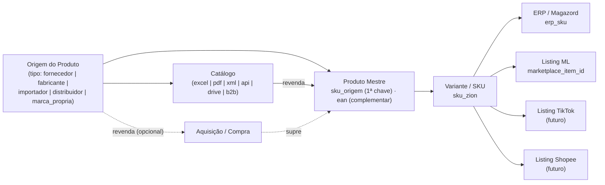
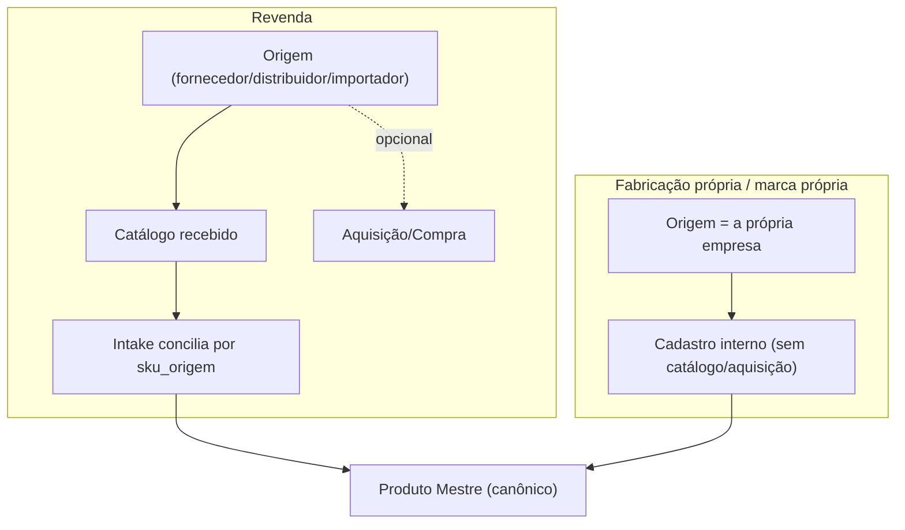
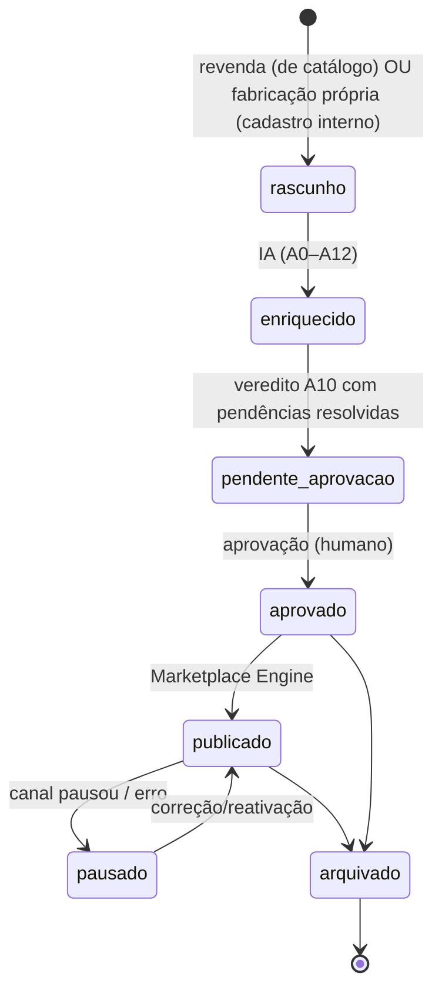
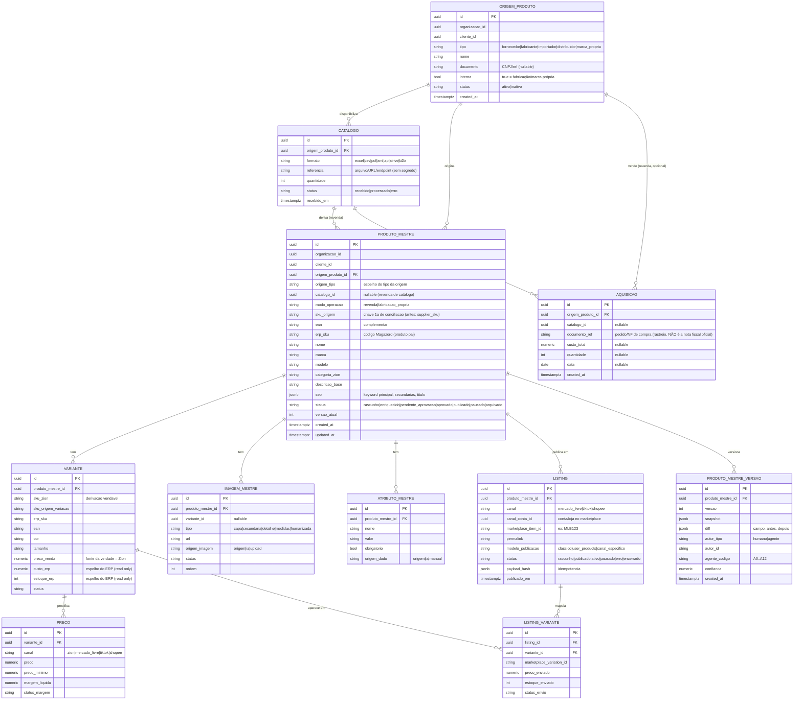

# 001 — Product Master (Produto Mestre)

> Modelo **canônico** e **universal** da Zion Platform. É a **Fonte da Verdade da operação de marketplace**. Documento de arquitetura — sem implementação.

> **Nota de nomenclatura (universalização):** o conceito antes chamado de "Fornecedor" foi generalizado para **Origem do Produto** (fornecedor, fabricante, importador, distribuidor, marca própria). A chave de conciliação, antes `supplier_sku`, passa a ser **`sku_origem`** neste documento canônico. Os documentos 002–006 ainda referenciam `supplier_sku` — é a **mesma chave**; o alinhamento de nomenclatura nesses docs é um follow-up (não alterado aqui).

## Objetivo

Definir o **Produto Mestre**: a representação única e canônica de um produto na Zion, **independente da origem (quem o disponibiliza), do ERP e do marketplace**. Todo conteúdo, preço de venda, imagem, SEO, categoria e estado de anúncio derivam dele. O Produto Mestre resolve o problema central: **o mesmo produto chega em N formatos, de N tipos de origem, e precisa virar 1 verdade que abastece N canais**, conciliado pelo **SKU de origem** (`ean` complementar). O modelo suporta igualmente **revenda** (produto adquirido de terceiros) e **fabricação própria / marca própria** (produto criado internamente).

## Responsabilidades

- Ser a **fonte da verdade** de: título/descrição/atributos (conteúdo), preço de venda, imagens, categoria por canal, SEO, e o **estado consolidado** do produto em cada marketplace.
- Manter os **vínculos de identidade**: `sku_origem` (chave 1ª), `ean` (complementar), `erp_sku` (Magazord), `marketplace_item_id`/`marketplace_variation_id` (por canal).
- Referenciar a **Origem do Produto** (quem disponibiliza) e o **Catálogo** de onde veio (quando revenda), sem confundir Catálogo com Produto Mestre.
- Registrar, **quando aplicável**, a **Aquisição/Compra** (revenda) — sem exigi-la para fabricante/marca própria.
- Modelar **variações/SKUs** (cor, tamanho, etc.) como entidades vendáveis distintas.
- Guardar **histórico e versionamento** de cada mudança (quem/qual agente/quando/antes→depois).
- **Não** ser fonte da verdade de **estoque/fiscal/nota** — isso é do ERP (Magazord); o Produto Mestre **espelha** o estoque para decisão, mas o número oficial vem do ERP.

## Escopo

- Entidades canônicas: `origem_produto`, `catalogo`, `aquisicao` (opcional), `produto_mestre`, `variante`, `imagem_mestre`, `atributo_mestre`, `preco`, `listing` (por canal), `produto_mestre_versao`.
- Ciclo de vida e versionamento cobrindo **revenda** e **fabricação própria**.
- Regras de conciliação de identidade (SKU de origem / EAN).
- Separação explícita **Catálogo × Produto Mestre**.
- Espelho de estoque/custo vindo do ERP (read model) e o preço de venda (write model, do Zion).
- Compatibilidade com Magazord, Mercado Livre, TikTok Shop e Shopee.

## Fora do escopo

- **Estoque/fiscal/nota** como fonte da verdade (é do Magazord — ver 003 ErpConnector).
- **Ingestão/processamento** de catálogo em pré-produtos (é a Capability 000 — ver 006). O Catálogo aqui é o **registro canônico** do lote recebido; o processamento é do Intake.
- **Publicação/sincronização** com marketplaces (é o Marketplace Engine + Adapter — 005/002).
- **Transporte de eventos** (é o Event Bus — 004).

## Fluxos

**F1 — Nascimento por revenda (a partir de um Catálogo):** uma **Origem** (fornecedor/distribuidor/importador) envia um **Catálogo** → o Intake (006) processa e concilia → entrega um Pré-Produto → cria-se o `produto_mestre` (`modo_operacao = revenda`, com `origem_id` e `catalogo_id`) → emite `produto_mestre.criado`.

**F2 — Nascimento por fabricação própria / marca própria:** a **Origem** é a própria empresa (tipo `fabricante`/`marca_propria`) → o produto é cadastrado internamente (**sem Catálogo nem Aquisição obrigatórios**) → cria-se o `produto_mestre` (`modo_operacao = fabricacao_propria`, `catalogo_id = null`) → emite `produto_mestre.criado`.

**F3 — Aquisição/Compra (quando aplicável, revenda):** registra-se uma `aquisicao` ligada à Origem (e ao Catálogo, se houver) para rastreio/conciliação de custo — **opcional**; não existe para fabricante/marca própria. Não substitui a nota fiscal (essa é do ERP).

**F4 — Alteração de conteúdo/preço:** edição (humana ou agente IA) → grava `produto_mestre_versao` (diff) → status pode voltar para `pendente_aprovacao` → emite `produto_mestre.atualizado`.

**F5 — Espelho de estoque/custo do ERP:** o ERP notifica mudança → atualiza o **read model** (`variante.estoque_erp`, `variante.custo_erp`) → emite `estoque.espelhado`. O Zion **não** sobrescreve o número do ERP.

**F6 — Consolidação de estado do anúncio:** o Marketplace Engine reporta o estado real (ativo/pausado/erro/vendido) por canal → atualiza `listing.status` → emite `listing.estado_mudou`.

## Diagramas (Mermaid)

Modelo de identidade e origem (as chaves que conciliam tudo):

Dois modos de operação convergindo no mesmo Produto Mestre:

Ciclo de vida do Produto Mestre (comum aos dois modos):

## Modelo de dados

**Identidade (regras de chave):**
- `sku_origem` — **chave primária de conciliação** entre Origem ↔ Zion ↔ ERP ↔ marketplace. Único por (organizacao, origem). *(Antes `supplier_sku`; mesma chave nos docs 002–006.)*
- `ean` — **complementar**: usado para desambiguar/casar quando o SKU falha; nunca substitui o SKU.
- `erp_sku` — código do Magazord (pai no produto, derivação na variante).
- `marketplace_item_id` / `marketplace_variation_id` — por canal/conta, guardados no `listing`/`listing_variante`.

**Catálogo × Produto Mestre (separação explícita):** o **Catálogo** é o *lote recebido de uma Origem* (documento/arquivo/endpoint), imutável como registro do que chegou. O **Produto Mestre** é a *verdade derivada e curada* — pode nascer de 1 catálogo (revenda) ou de cadastro interno (fabricação própria). Um catálogo pode gerar N produtos mestres; um produto mestre referencia no máximo 1 catálogo de origem (ou nenhum).

**Estado atual × alvo:** o Zion OS hoje tem `produtos` → `produto_variantes` → `anuncios_gerados` (com `ml_item_id`/`ml_permalink`) e `imagens_produto`, sem noção de Origem/Catálogo/Aquisição nem versionamento. O Produto Mestre **generaliza**: adiciona `origem_produto`/`catalogo`/`aquisicao`, `anuncios_gerados` vira `listing` (multi-canal), o vínculo variante↔item vira `listing_variante`, e adiciona `produto_mestre_versao`.

## Compatibilidade (Magazord, Mercado Livre, TikTok Shop, Shopee)

O modelo canônico permanece **agnóstico de canal/ERP** e mapeia para todos:
- **Magazord (ERP):** `erp_sku` (pai e variante) é a ponte; estoque/custo entram como **read model** (`estoque_erp`/`custo_erp`) via evento; nota/fiscal ficam no ERP.
- **Mercado Livre:** `listing` (por conta) guarda `marketplace_item_id`/permalink e `modelo_publicacao` (clássico/User Products); variantes ↔ `marketplace_variation_id` em `listing_variante`.
- **TikTok Shop / Shopee:** o mesmo `listing`/`listing_variante` acomoda os ids/variações desses canais; `modelo_publicacao` admite `canal_especifico`. Nenhuma coluna é ML-only.
- **Origem universal:** por a identidade partir de `sku_origem` + `origem_produto`, o mesmo produto pode vir de fornecedor, importador, distribuidor **ou** ser de fabricação própria/marca própria, sem mudança de esquema.

## Eventos

Emite (ver envelope no 004):
- `origem.registrada`
- `catalogo.registrado`
- `aquisicao.registrada` (quando aplicável)
- `produto_mestre.criado`
- `produto_mestre.atualizado` (inclui o `versao` e o `diff`)
- `variante.atualizada`
- `preco.definido`
- `estoque.espelhado` (do ERP)
- `listing.estado_mudou`

Consome:
- `intake.pre_produto.pronto` → cria o Produto Mestre (F1/F2)
- `erp.estoque.mudou` / `erp.custo.mudou` → espelho (F5)
- `marketplace.listing.estado` → consolida (F6)

## Regras de negócio

1. **SKU de origem manda.** Conciliação sempre tenta `sku_origem` primeiro; `ean` só como desempate. Sem SKU válido, o produto fica em Pré-Produto (não vira Mestre).
2. **Toda origem tem tipo.** `fornecedor|fabricante|importador|distribuidor|marca_propria`. `interna = true` marca fabricação/marca própria.
3. **Catálogo ≠ Produto Mestre.** O Produto Mestre nunca é o catálogo bruto; é a verdade curada derivada dele (ou de cadastro interno).
4. **Aquisição é opcional e só para revenda.** Fabricante/marca própria **não** exige `aquisicao`. A aquisição serve a rastreio/custo — **não** é a nota fiscal (essa é do ERP).
5. **Modo de operação explícito.** `revenda` (tem origem terceira + catálogo/aquisição opcional) × `fabricacao_propria` (origem interna, sem catálogo/aquisição obrigatórios). O ciclo de vida é o mesmo a partir do `rascunho`.
6. **Zion é dono do preço de venda e do conteúdo.** O ERP não sobrescreve `preco_venda` nem título/descrição.
7. **ERP é dono de estoque/custo.** `estoque_erp`/`custo_erp` são **read model** — o Zion nunca inventa esses números.
8. **Toda mudança material versiona.** Título, descrição, atributos, preço, imagem → nova `produto_mestre_versao` com autor (humano/agente) e diff. Permite auditoria e **desfazer**.
9. **Preço abaixo do piso não publica.** Regra Zion (margem mínima) barra a publicação (herda A8/A10).
10. **Um Produto Mestre → N listings** (1 por canal/conta), estados independentes.
11. **Aprovação obrigatória** antes de publicar (trava A10 + Board).

## Critérios de aceite

- [ ] Uma Origem pode ser criada em qualquer um dos 5 tipos (fornecedor/fabricante/importador/distribuidor/marca_propria).
- [ ] Um Produto Mestre de **revenda** referencia `origem_produto` + `catalogo`; um de **fabricação própria** referencia `origem_produto` interna e tem `catalogo_id = null`.
- [ ] `aquisicao` pode existir para revenda e **não é exigida** para fabricante/marca própria.
- [ ] Catálogo e Produto Mestre são entidades distintas: 1 catálogo pode gerar N produtos mestres; nenhum produto mestre "é" um catálogo.
- [ ] Dado um Pré-Produto com `sku_origem` válido, cria-se exatamente 1 Produto Mestre e suas variantes, sem duplicar.
- [ ] Conciliação por EAN só ocorre quando o SKU não casa, e fica registrada.
- [ ] Toda edição gera uma `produto_mestre_versao` com diff e autor; qualquer versão anterior é reconstruível.
- [ ] `estoque_erp`/`custo_erp` só mudam via evento do ERP; `preco_venda` só muda por ação do Zion.
- [ ] O mesmo esquema publica em Magazord (erp_sku), ML, TikTok e Shopee sem coluna canal-específica no núcleo.

## Dependências

- **Connector SDK (003)** — para receber dados de Origem/ERP/marketplace de forma padronizada (`SupplierConnector` cobre qualquer tipo de origem externa).
- **Event Bus (004)** — para publicar/consumir os eventos acima.
- **Capability 000 (006)** — processa Catálogos em pré-produtos e promove a Produto Mestre.
- **Marketplace Engine (005)** — consumidor do Produto Mestre para publicar/sincronizar.
- **Follow-up de nomenclatura:** alinhar `supplier_sku` → `sku_origem` nos docs 002–006 (mesma chave; alinhamento futuro).

## Riscos

| Risco | Mitigação |
|-------|-----------|
| SKU de origem sujo/duplicado/ausente | Normalização + conciliação por EAN como desempate + fila "pré-produto sem SKU". |
| Confundir Catálogo com Produto Mestre | Entidades distintas + regra explícita (Catálogo é lote recebido, imutável; Mestre é verdade curada). |
| Modelar Aquisição como obrigatória | Aquisição opcional e só para revenda; nunca exigida para fabricante/marca própria. |
| Divergência estoque/custo Zion↔ERP | Espelho por evento + reconciliação; ERP vence em estoque/custo, Zion vence em preço/conteúdo. |
| Inconsistência de nomenclatura (`supplier_sku` vs `sku_origem`) | Nota de equivalência + follow-up de alinhamento nos docs 002–006. |
| Vínculo variante↔marketplace_variation_id perdido | Normalizar em `listing_variante` (hoje mora em jsonb — dívida a pagar). |

## Roadmap

1. **v1 — Núcleo canônico universal:** `origem_produto`, `catalogo`, `produto_mestre`, `variante`, `imagem_mestre`, `atributo_mestre`, `listing` + versionamento básico + `modo_operacao`. Migração incremental sobre `produtos`/`produto_variantes`/`anuncios_gerados`.
2. **v2 — Identidade + rastreio:** `aquisicao` (opcional), `listing_variante` normalizado (variante↔marketplace_variation_id), espelho de estoque/custo do ERP por evento.
3. **v3 — Preço por canal + regras:** `preco` por canal, piso/margem, promoções.
4. **v4 — Histórico rico + undo:** diff navegável, reverter versão, trilha por agente/confiança.
5. **v5 — Alinhamento de nomenclatura** `sku_origem` nos docs/serviços 002–006.
