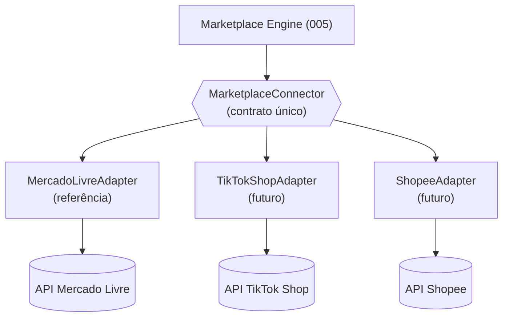
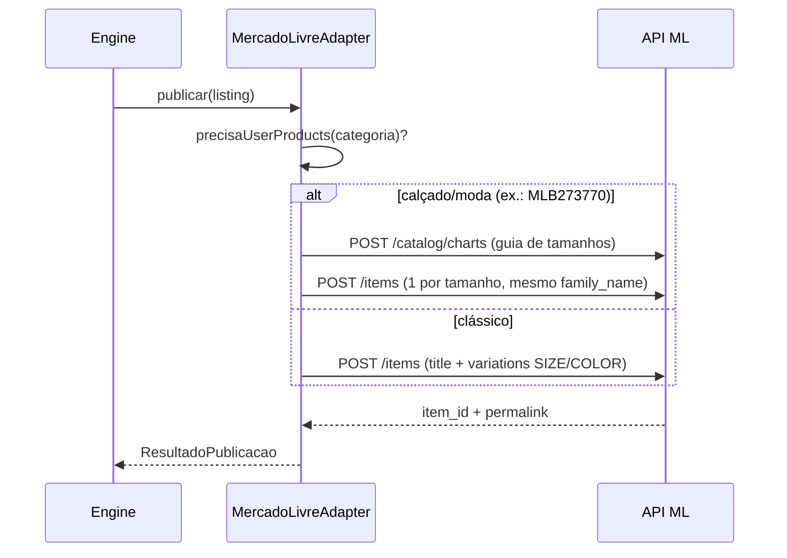
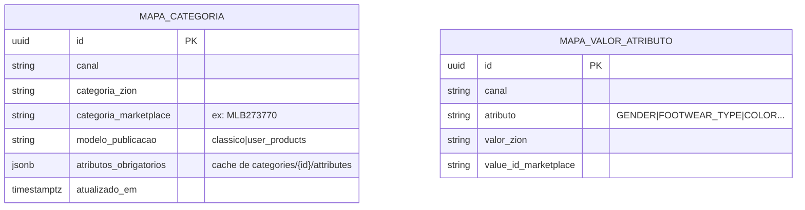

# 002 — Marketplace Adapter

> Contrato de **adaptador de marketplace**: uma especialização do Connector SDK (003) para canais de venda. **Mercado Livre é a implementação de referência**; TikTok Shop e Shopee implementam **o mesmo contrato**. Documento de arquitetura — sem implementação.

## Objetivo

Isolar as **regras específicas de cada marketplace** atrás de uma interface única, de forma que o Marketplace Engine (005) publique/sincronize a partir do Produto Mestre (001) **sem conhecer** ML/TikTok/Shopee. Hoje, a integração ML é um **fluxo direto** (auditoria: regras espalhadas em `mlPayload.ts`/rotas, sem contrato); o Adapter transforma isso em **peça plugável**.

## Responsabilidades

- Traduzir Produto Mestre ↔ formato do marketplace (payload de item, atributos, variações, imagens, frete, garantia).
- **Publicar**, **atualizar preço/estoque**, **pausar/reativar/encerrar**, **importar anúncios** e **processar webhooks**.
- **Mapear categoria e atributos** do canal (fonte da verdade = API do próprio marketplace).
- Gerir o **modelo de publicação** por categoria (ex.: ML **clássico × User Products**).
- Reportar o **estado real** do anúncio (ativo/pausado/erro/vendido) de volta ao Produto Mestre.

## Escopo

- Interface `MarketplaceConnector` (do 003) refinada com os métodos de marketplace.
- Sub-contratos: **CategoryMapper**, **PayloadBuilder** (por modelo de publicação), **WebhookHandler**.
- Referência ML: mapa dos endpoints reais já auditados.

## Fora do escopo

- Orquestração/fila/idempotência/rate-limit — é o Marketplace Engine (005) que usa o adapter.
- Modelo canônico (001) e transporte de eventos (004).
- Estoque oficial (é do ERP — 003 ErpConnector); o adapter só **empurra** o número que o Engine mandar.

## Fluxos

**M1 — Publicar:** Engine chama `publicar(listing)` → o adapter escolhe o **modelo** (`precisaUserProducts(categoria)`), monta o payload (clássico ou User Products, criando a guia de tamanhos quando exigido) → `POST` no marketplace → devolve `marketplace_item_id`/permalink → emite `marketplace.listing.publicado`.

**M2 — Atualizar preço/estoque:** Engine chama `atualizarPrecoEstoque(listing)` → `PUT`/update no marketplace (por item e por variação) → emite `marketplace.listing.atualizado`. *(Hoje AUSENTE no ML — auditoria R-ML3.)*

**M3 — Importar anúncios:** `importarAnuncios(filtro)` → lista + multiget → mapeia para o formato canônico (agrupando família/User Products) → emite `marketplace.anuncio.importado`.

**M4 — Webhook:** `processarWebhook(evt)` recebe notificação (venda/pausa/pergunta) → normaliza → emite evento canônico (`marketplace.listing.estado`, `venda.recebida`, `pergunta.recebida`). *(Hoje AUSENTE — R-ML4.)*

## Diagramas (Mermaid)

Um contrato, três implementações:

Publicação com escolha de modelo (referência ML):

## Modelo de dados

O adapter **não possui** tabelas próprias de negócio — escreve no Produto Mestre (001): `listing`, `listing_variante` (com `marketplace_item_id`/`marketplace_variation_id`, `modelo_publicacao`, `status`, `payload_hash`). Mantém apenas caches de mapeamento:

**Referência ML (endpoints reais, da auditoria):** OAuth `oauth/token`; publicar `POST /items`; guia `POST /catalog/charts`; categoria `GET /sites/MLB/domain_discovery/search` e `GET /categories/{id}/attributes`; importar `GET /users/{id}/items/search` + multiget `GET /items?ids=`; vendas `GET /orders/search`. **A construir:** `PUT /items` (preço/estoque), pausar/encerrar, e recepção de **webhooks** (`orders_v2`, `items`, `questions`).

## Eventos

Emite: `marketplace.listing.publicado`, `.atualizado`, `.pausado`, `.erro`, `marketplace.anuncio.importado`, `marketplace.listing.estado`, `venda.recebida`, `pergunta.recebida`.
Consome (do Engine): `listing.publicar.solicitado`, `listing.atualizar.solicitado`, `listing.pausar.solicitado`, `marketplace.webhook.recebido`.

## Regras de negócio

1. **Modelo por categoria.** O adapter decide clássico × User Products (ML) e o equivalente em cada canal; a fonte da verdade dos atributos é a API do marketplace (`categories/{id}/attributes`), não uma lista fixa.
2. **Idempotência de publicação.** Antes de criar, verifica se já existe `marketplace_item_id` para `(cliente, produto, canal, conta)`; usa `payload_hash`/idempotency key. *(Fecha R-ML2.)*
3. **Estoque vem do Engine (que reflete o ERP).** O adapter nunca inventa estoque; só empurra o número recebido.
4. **Sem segredo ao cliente.** Token do canal lido/rotacionado server-side (princípio do 003).
5. **Estado reportado de volta.** Todo webhook/consulta que muda o estado do anúncio atualiza o `listing.status` do Produto Mestre.
6. **Fidelidade de imagem** (regra ML): imagem gerada por IA nunca descaracteriza o produto real.

## Critérios de aceite

- [ ] Publicar um calçado (categoria User Products) funciona ponta a ponta pelo `MercadoLivreAdapter` (fecha R-ML1).
- [ ] `atualizarPrecoEstoque` propaga preço/estoque ao ML (item e variação).
- [ ] Reenvio de publicação não duplica anúncio (idempotência).
- [ ] Webhook de venda gera `venda.recebida` e reduz o estoque a propagar.
- [ ] Um segundo adapter (TikTok/Shopee) publica um item de teste **sem** alterar o Engine.
- [ ] Nenhum segredo do canal aparece no navegador/resposta/log.

## Dependências

- **Connector SDK (003)** — contrato base.
- **Marketplace Engine (005)** — quem chama o adapter em fila/escala.
- **Product Master (001)** — dado de entrada/saída.
- **Event Bus (004)** — eventos.

## Riscos

| Risco | Mitigação |
|-------|-----------|
| Regras do ML espalhadas (dívida atual) | Encapsular tudo no `MercadoLivreAdapter`; núcleo não conhece o ML. |
| User Products não ligado (R-ML1) | Método `publicar` decide o modelo por categoria e cria a guia. |
| Divergência de estoque (R-ML3) | `atualizarPrecoEstoque` + webhook de venda + reconciliação. |
| Diferenças grandes entre canais (TikTok/Shopee) | Contrato com **capacidades opcionais**; o Engine só chama o que o adapter declara. |

## Roadmap

1. **v1 — `MercadoLivreAdapter`** encapsulando o código atual (clássico) **+ ligando User Products** e `PUT` de preço/estoque + webhooks. Núcleo passa a falar só o contrato.
2. **v2 — CategoryMapper persistido** (de-para + cache de atributos) e pausar/reativar/encerrar.
3. **v3 — `TikTokShopAdapter`** (2º canal, valida o contrato).
4. **v4 — `ShopeeAdapter`** + paridade de capacidades.
