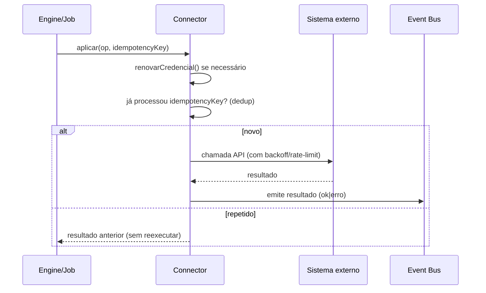
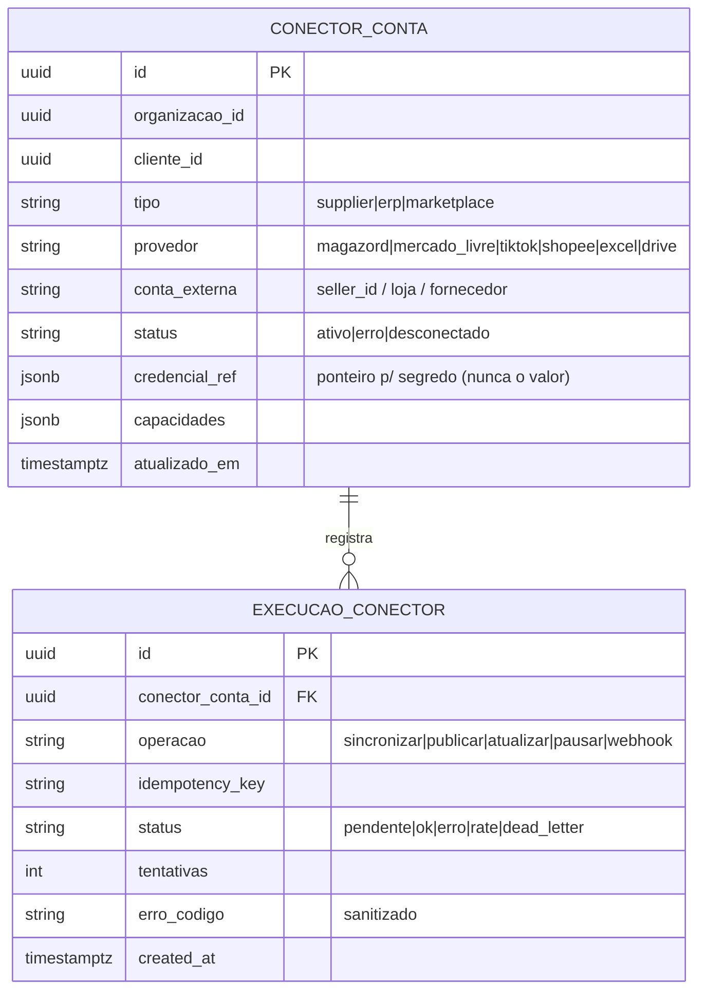

# 003 — Connector SDK

> Interface **padrão** que **qualquer** integração externa da Zion implementa: fornecedor, ERP (Magazord), marketplace (ML/TikTok/Shopee) e futuras. Documento de arquitetura — sem implementação.

## Objetivo

Definir **um único contrato** para todas as integrações, de modo que fornecedor, ERP e marketplace se conectem à Zion pelas mesmas primitivas (autenticação, sincronização, capacidades, erros, limites, idempotência, emissão de eventos). Assim, adicionar um canal/ERP/fornecedor novo é **implementar uma interface conhecida** — não reescrever o sistema.

## Responsabilidades

- Padronizar **autenticação e credenciais** (OAuth, API key, arquivo, etc.) sempre **server-side**.
- Padronizar **sincronização** (pull/push, incremental, full) e **capacidades declaradas** (o que o conector sabe fazer).
- Padronizar o **modelo de erro** (recuperável × permanente × config × auth), **retry/backoff** e **rate limit**.
- Padronizar **idempotência** e a **emissão de eventos** para o Event Bus.
- **Isolar segredos** do domínio: o núcleo Zion nunca vê token/secret; o conector guarda/rotaciona server-side.

## Escopo

- A interface `Connector` (base) e suas três especializações: `SupplierConnector`, `ErpConnector`, `MarketplaceConnector` (esta é refinada no 002).
- Tipos comuns: `Credenciais`, `Capacidades`, `ResultadoSync`, `ErroConector`, `Limites`, `ContextoConector`.
- Contrato de **health-check** e **teste de conexão**.

## Fora do escopo

- Implementações concretas de cada canal (ficam nos adapters específicos).
- O **runtime** que chama os conectores em fila/escala (é o Marketplace Engine — 005 — para marketplaces; jobs equivalentes para ERP/fornecedor).
- O modelo canônico de dados (001) e o transporte de eventos (004).

## Fluxos

**C1 — Conectar:** o operador autoriza (OAuth/API key/arquivo) → `conectar()` valida e persiste as credenciais server-side → `testarConexao()` confirma → emite `conector.conectado`.

**C2 — Sincronizar (pull):** o Engine/job chama `sincronizar({ modo, desde })` → o conector busca o delta na fonte externa → mapeia para o formato canônico → emite eventos (`*.importado`) → devolve `ResultadoSync`.

**C3 — Aplicar (push):** o Engine chama `aplicar(operacao)` (ex.: publicar, atualizar preço/estoque) com **chave de idempotência** → o conector traduz para a API externa → emite resultado.

**C4 — Renovar credencial:** antes de qualquer chamada, o conector garante a credencial válida (ex.: refresh de OAuth), rotaciona e persiste — sem expor ao chamador.

## Diagramas (Mermaid)

Hierarquia do contrato:

```mermaid
classDiagram
  class Connector {
    <<interface>>
    +tipo() TipoConector
    +capacidades() Capacidades
    +conectar(cred) Promise
    +testarConexao() Promise~Health~
    +renovarCredencial() Promise
    +sincronizar(opts) Promise~ResultadoSync~
    +aplicar(op, idempotencyKey) Promise~Resultado~
    +limites() Limites
  }
  class SupplierConnector {
    +ingerir(fonte) Promise~PreProdutos~
  }
  class ErpConnector {
    +lerEstoque(sku) Promise
    +propagar(produtoMestre) Promise
    +lerCusto(sku) Promise
  }
  class MarketplaceConnector {
    +publicar(listing) Promise
    +atualizarPrecoEstoque(listing) Promise
    +pausar(itemId) Promise
    +importarAnuncios(filtro) Promise
    +processarWebhook(evt) Promise
    +mapearCategoria(produto) Promise
  }
  Connector <|-- SupplierConnector
  Connector <|-- ErpConnector
  Connector <|-- MarketplaceConnector
```

Sequência de uma operação idempotente:

## Modelo de dados

O SDK trabalha sobre entidades de **conexão** e **execução** (o dado de negócio é o Produto Mestre — 001):

**Segredos:** `credencial_ref` aponta para o cofre/coluna server-only; o **valor** (token, secret, service_role) **nunca** trafega para o navegador nem é retornado por nenhuma API (princípio já aplicado no Zion OS — R3 corrigido).

## Eventos

Todo conector emite, com o envelope do 004:
- `conector.conectado` / `conector.desconectado` / `conector.erro`
- `conector.sync.iniciado` / `conector.sync.concluido` (com contagens)
- Eventos de domínio por tipo: `fornecedor.catalogo.recebido`, `erp.estoque.mudou`, `marketplace.listing.publicado`, etc.

## Regras de negócio

1. **Capacidades declaradas.** Cada conector publica o que sabe fazer (`capacidades()`); o Engine só chama o que existe (ex.: um marketplace sem `atualizarPrecoEstoque` não recebe essa operação).
2. **Idempotência obrigatória** em toda operação de escrita (`aplicar`): mesma `idempotency_key` ⇒ mesmo efeito, sem duplicar.
3. **Erros classificados:** `auth` (renova/reautoriza), `config` (falha segura, não executa), `rate` (backoff, re-tenta), `recuperavel` (retry até N), `permanente` (dead-letter). Mensagens públicas genéricas; detalhe só em log server-side sanitizado.
4. **Rate limit respeitado** por `limites()` (req/s, tamanho de lote) — o Engine agenda conforme.
5. **Credenciais server-side** sempre; renovação transparente; nunca no cliente.
6. **Sync incremental por padrão** (`desde`), full sob demanda.

## Critérios de aceite

- [ ] Um conector novo (ex.: Shopee) é adicionado implementando `MarketplaceConnector` sem tocar no núcleo Zion.
- [ ] Repetir `aplicar` com a mesma `idempotency_key` não duplica efeito.
- [ ] Falha de `config` (ex.: URL/credencial ausente) **não** executa a operação e retorna erro claro (padrão já adotado — ver APP_URL do convite).
- [ ] 429 do provedor gera backoff e re-tentativa, não falha imediata.
- [ ] Nenhum segredo aparece em resposta de API, log ou no navegador.
- [ ] `capacidades()` reflete corretamente o que o conector suporta.

## Dependências

- **Event Bus (004)** — emissão/consumo.
- **Product Master (001)** — formato canônico de entrada/saída.
- Cofre de segredos (Supabase server-side / env / vault).

## Riscos

| Risco | Mitigação |
|-------|-----------|
| Conectores divergirem do contrato | Suite de conformidade (contract tests) que todo conector passa. |
| Vazamento de segredo por um conector mal-feito | `credencial_ref` + revisão obrigatória + proibição de retornar segredo (lint/policy). |
| Rate limit heterogêneo entre provedores | `limites()` por conector + agendamento central no Engine. |
| Idempotência mal implementada | Chave canônica + tabela `execucao_conector` como registro de dedup. |

## Roadmap

1. **v1 — Contrato base + `MarketplaceConnector`** (ML como referência), com idempotência e classificação de erro.
2. **v2 — `ErpConnector` (Magazord)**: leitura de estoque/custo + propagação de preço.
3. **v3 — `SupplierConnector`**: ingestão de Excel/CSV/XML/PDF/Drive.
4. **v4 — Contract tests + observabilidade** (métricas por conector, dead-letter, replay).
