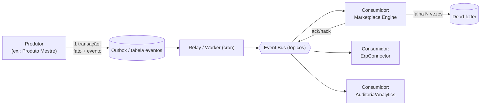
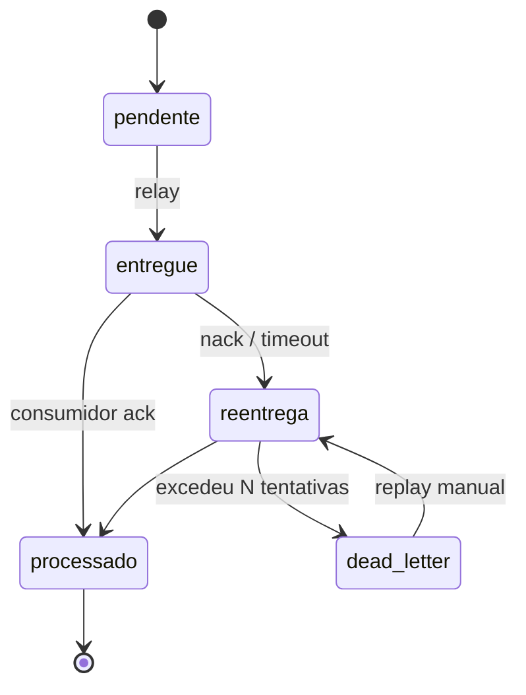
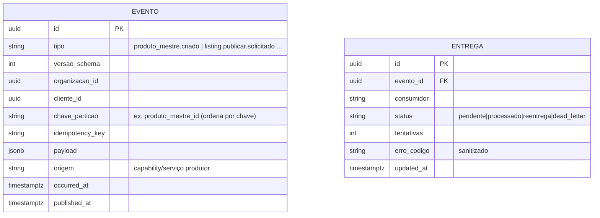

# 004 — Event Bus

> Backbone de **eventos assíncronos, idempotentes e auditáveis** que conecta Intake, Produto Mestre, ERP e Marketplace Engine. Documento de arquitetura — sem implementação.

## Objetivo

Desacoplar as capabilities: em vez de chamadas síncronas encadeadas (frágeis, não escalam — a auditoria mostra publicação síncrona 1-a-1 no ML), tudo se comunica por **eventos**. Isso dá **escala** (fan-out para N canais), **resiliência** (retry/dead-letter), **auditoria** (todo fato fica registrado) e **idempotência** (reprocessar sem duplicar).

## Responsabilidades

- Entregar eventos de **produtores** para **consumidores** com garantia **at-least-once**.
- Garantir **idempotência** por chave e **ordenação por chave de partição** (ex.: por `produto_mestre_id`).
- Prover **dead-letter**, **retry com backoff** e **replay**.
- Ser a **trilha de auditoria** imutável (todo evento fica gravado).
- Escopar eventos por **tenant** (`organizacao_id`/`cliente_id`).

## Escopo

- **Envelope** canônico do evento e o **catálogo** de eventos.
- Semântica de entrega, idempotência, ordenação, retry, dead-letter, replay.
- Padrão de implementação recomendado para o stack atual (Supabase/Postgres): **transactional outbox + tabela de eventos + workers (cron)**, evoluível para um broker dedicado.

## Fora do escopo

- A lógica de negócio de cada produtor/consumidor (nas capabilities).
- O modelo canônico (001) e os contratos de conector (003).

## Fluxos

**E1 — Publicar evento (outbox):** o produtor grava o fato de negócio **e** o evento na **mesma transação** (outbox) → um relay entrega ao bus → marca como entregue. Garante que nenhum evento se perde nem é emitido sem o fato existir.

**E2 — Consumir:** o consumidor recebe o evento → verifica a `idempotency_key` (já processei?) → processa → confirma (ack). Falha → retry com backoff → após N, vai para **dead-letter**.

**E3 — Replay:** operador reprocessa um intervalo/tipo de evento (ex.: depois de corrigir um bug) a partir do log imutável.

## Diagramas (Mermaid)

Fluxo outbox → bus → consumidores:

Ciclo de vida de um evento:

## Modelo de dados

**Envelope (contrato):** `{ id, tipo, versao_schema, organizacao_id, cliente_id, chave_particao, idempotency_key, payload, origem, occurred_at }`. O `payload` referencia entidades por **id** (não duplica dados); nunca contém segredo.

## Eventos (catálogo canônico)

Namespaces por capability (nome no passado — fatos que aconteceram — ou `.solicitado` para comandos assíncronos):

| Domínio | Eventos |
|---------|---------|
| **Intake** | `fornecedor.catalogo.recebido` · `intake.pre_produto.criado` · `intake.conciliacao.resolvida` · `intake.pre_produto.pronto` |
| **Produto Mestre** | `produto_mestre.criado` · `produto_mestre.atualizado` · `variante.atualizada` · `preco.definido` · `estoque.espelhado` |
| **ERP (Magazord)** | `erp.produto.propagado` · `erp.estoque.mudou` · `erp.custo.mudou` · `erp.nota.emitida` |
| **Marketplace** | `listing.publicar.solicitado` · `listing.atualizar.solicitado` · `listing.pausar.solicitado` · `marketplace.listing.publicado` · `.atualizado` · `.estado` · `venda.recebida` · `pergunta.recebida` |
| **Plataforma** | `conector.conectado` · `conector.erro` · `auditoria.registrada` |

## Regras de negócio

1. **At-least-once + idempotência.** O bus pode entregar o mesmo evento mais de uma vez; o consumidor **deve** ser idempotente pela `idempotency_key`.
2. **Ordenação por chave de partição.** Eventos do mesmo `produto_mestre_id` são processados em ordem; entre produtos diferentes, em paralelo.
3. **Transactional outbox.** Fato de negócio e evento na mesma transação — sem evento órfão nem fato sem evento.
4. **Imutabilidade.** Evento nunca é editado/apagado; correções são novos eventos.
5. **Sem segredo no payload.** Referências por id; credenciais ficam nos conectores.
6. **Dead-letter observável.** Falhas persistentes vão para DLQ com código de erro sanitizado e são replayáveis.
7. **Versão de schema.** Todo tipo de evento tem `versao_schema`; mudanças são retrocompatíveis ou geram novo tipo.

## Critérios de aceite

- [ ] Reprocessar um evento (mesma `idempotency_key`) não gera efeito duplicado no consumidor.
- [ ] Nenhum fato de negócio é gravado sem seu evento (outbox na mesma transação).
- [ ] Eventos do mesmo produto são processados em ordem.
- [ ] Falha repetida move o evento para dead-letter; o replay o reprocessa.
- [ ] Nenhum payload contém token/secret/service_role.
- [ ] Todo evento é auditável (quem produziu, quando, o quê).

## Dependências

- **Postgres/Supabase** (outbox + tabela de eventos + workers via cron) — reaproveita o padrão `fila_otimizacao_produto` + Vercel Cron já existente.
- **Connector SDK (003)** e **Product Master (001)** como produtores/consumidores.

## Riscos

| Risco | Mitigação |
|-------|-----------|
| Consumidor não-idempotente duplica efeito | Idempotência obrigatória + tabela `entrega` como registro de dedup. |
| Broker/relay atrasar (latência) | Cron frequente + métricas de lag; evoluir para broker dedicado se o volume exigir. |
| Explosão de eventos/retenção | Política de retenção/arquivamento do log; compactação. |
| Ordenação quebrada em paralelismo | Partição por `produto_mestre_id`; nunca paralelizar dentro da mesma chave. |

## Roadmap

1. **v1 — Outbox + tabela `evento`/`entrega` + workers (cron)** sobre Supabase; catálogo mínimo (Intake→Produto Mestre→Engine).
2. **v2 — Dead-letter + replay + métricas de lag/erro.**
3. **v3 — Versionamento de schema + contratos de evento** documentados por tipo.
4. **v4 — Broker dedicado** (se o volume justificar) mantendo o mesmo envelope/contrato.
