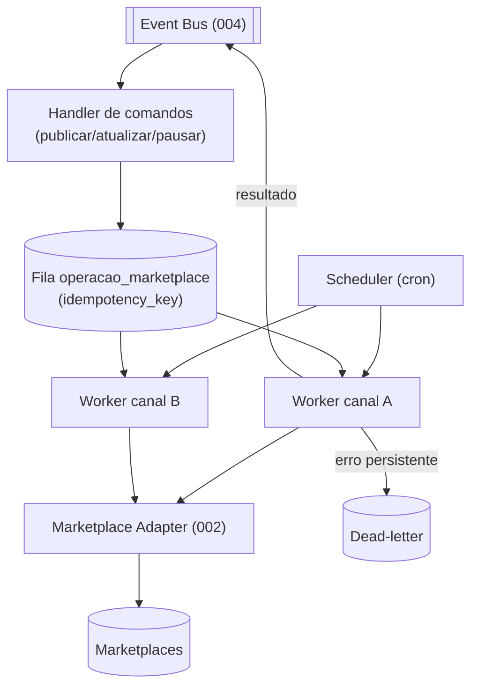
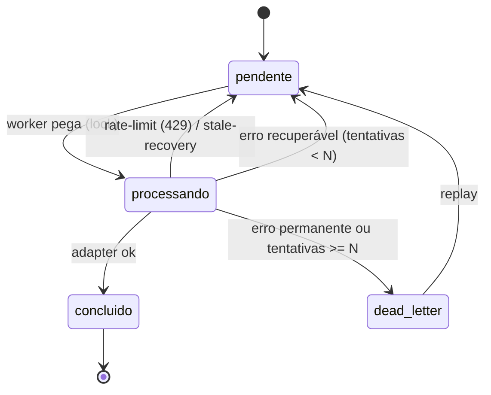
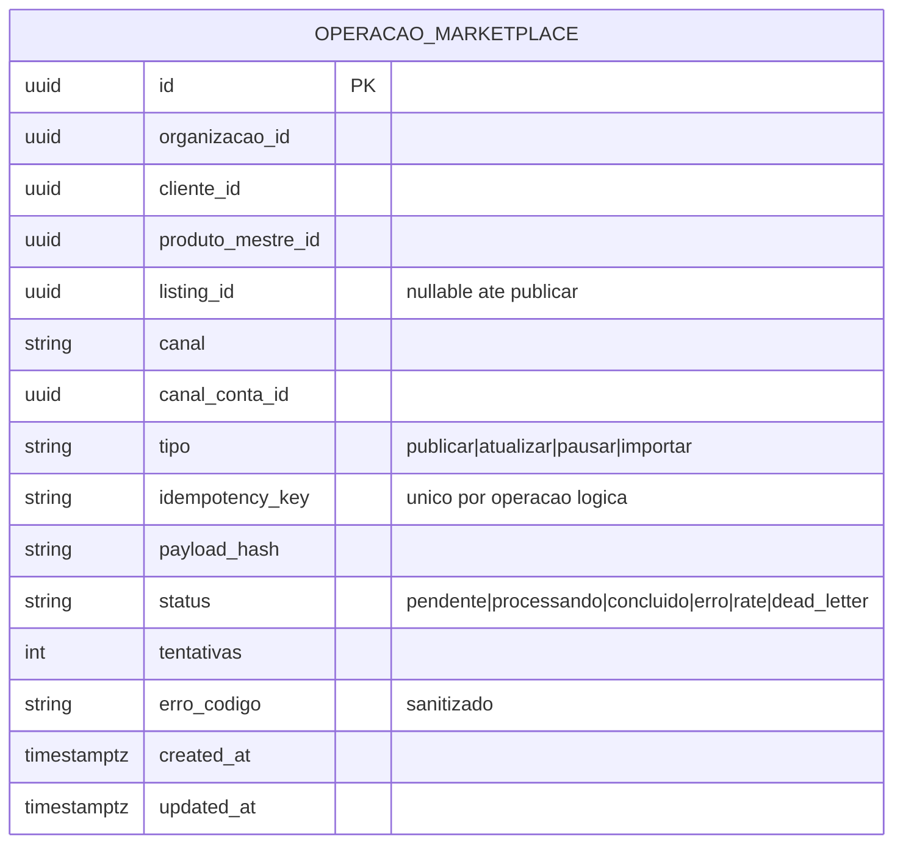

# 005 — Marketplace Engine

> **Runtime** que orquestra os Marketplace Adapters (002) sobre o Produto Mestre (001), dirigido por eventos (004). Documento de arquitetura — sem implementação.

## Objetivo

Ser o **motor de operação multicanal**: transformar intenções ("publicar", "atualizar preço", "sincronizar") em execuções **confiáveis e em escala** contra os marketplaces, via adapters. Resolve exatamente as lacunas da auditoria ML: **fila, idempotência, retry/backoff, rate-limit, fan-out para N canais e reconciliação de estado** — coisas que hoje não existem (publicação síncrona 1-a-1).

## Responsabilidades

- **Enfileirar e executar** operações de marketplace (publicar/atualizar/pausar/importar) com **idempotência** e **retry/backoff**.
- **Fan-out**: a partir de 1 Produto Mestre, publicar/sincronizar em N canais/contas.
- **Rate-limit por canal/conta** (respeitando `limites()` do adapter).
- **Propagar preço/estoque** do Produto Mestre → canais (estoque refletindo o ERP).
- **Reconciliar o estado real** dos anúncios (via webhook/consulta) de volta ao Produto Mestre.
- **Dead-letter + replay** de operações que falham.
- Nunca conter regra específica de canal (isso é do Adapter) nem de negócio de produto (é do Produto Mestre).

## Escopo

- Fila de operações (`operacao_marketplace`), scheduler, workers.
- Política de idempotência, retry, backoff, rate-limit, concorrência por canal/conta.
- Reconciliação de estado e propagação de preço/estoque.

## Fora do escopo

- Tradução de payload/regra de canal (Adapter — 002).
- Modelo canônico (001), transporte de eventos (004), contrato de conector (003).
- Estoque/fiscal (ERP — 003 ErpConnector); o Engine só empurra o número que reflete o ERP.

## Fluxos

**G1 — Publicar (fan-out):** recebe `listing.publicar.solicitado` → cria N operações (1 por canal/conta alvo) na fila com `idempotency_key = hash(produto, variante, canal, conta)` → workers consomem respeitando o rate-limit → chamam `adapter.publicar()` → gravam `listing`/`marketplace_item_id` → emitem `marketplace.listing.publicado`.

**G2 — Atualizar preço/estoque:** recebe `produto_mestre.atualizado`/`estoque.espelhado` → gera operações de update para cada `listing` ativo → `adapter.atualizarPrecoEstoque()` → emite `.atualizado`. Idempotente por `payload_hash`.

**G3 — Reconciliar estado:** consome `venda.recebida`/`marketplace.listing.estado` (do webhook) → atualiza `listing.status` e o estoque a propagar → emite `listing.estado_mudou`.

**G4 — Recuperação:** operação em `processando` presa (worker caiu) volta para `pendente` após TTL; 429 → backoff sem gastar tentativa; erro permanente → dead-letter.

## Diagramas (Mermaid)

Arquitetura do Engine:

Máquina de estados de uma operação:

## Modelo de dados

**Idempotência:** `unique(idempotency_key)` impede duplicar a mesma intenção; antes de `publicar`, o Engine também checa se já existe `marketplace_item_id` para o alvo (defesa em profundidade — fecha R-ML2). **Reaproveita e generaliza** o padrão atual `fila_otimizacao_produto` + worker + Vercel Cron.

## Eventos

Consome: `listing.publicar.solicitado`, `listing.atualizar.solicitado`, `listing.pausar.solicitado`, `produto_mestre.atualizado`, `estoque.espelhado`, `venda.recebida`, `marketplace.listing.estado`.
Emite: `marketplace.listing.publicado`, `.atualizado`, `.pausado`, `.erro`, `operacao.dead_letter`, `listing.estado_mudou`.

## Regras de negócio

1. **Idempotência sempre.** Nenhuma publicação/atualização duplica; reenvio é no-op se já feito.
2. **Concorrência e rate-limit por canal/conta.** O Engine agenda conforme `adapter.limites()`; nunca estoura o marketplace.
3. **Fan-out a partir do Mestre.** 1 Produto Mestre → N operações (canais/contas), independentes.
4. **Estoque reflete o ERP.** O Engine só propaga o número que veio do ERP (via `estoque.espelhado`); não inventa.
5. **Recuperação segura.** 429 → backoff sem gastar tentativa; item preso → volta à fila; erro permanente → dead-letter (nunca perde silenciosamente).
6. **Aprovação antes de publicar.** Só entra na fila de publicação o que está `aprovado` no Produto Mestre (mantém a trava A10/Board).
7. **Reconciliação contínua.** Estado real do canal sempre volta ao `listing`.

## Critérios de aceite

- [ ] Publicar 500 itens sem a aba aberta, sem duplicar (idempotência + fila).
- [ ] Mudança de preço/estoque no Produto Mestre propaga a todos os `listing` ativos.
- [ ] Venda (webhook) reduz o estoque a propagar e atualiza o `listing`.
- [ ] 429 do canal gera backoff; item preso volta à fila; erro permanente vai a dead-letter e é replayável.
- [ ] Fan-out publica o mesmo produto em 2 canais com estados independentes.
- [ ] O Engine não contém nenhuma regra específica de ML/TikTok/Shopee.

## Dependências

- **Marketplace Adapter (002)** — executa as chamadas de canal.
- **Connector SDK (003)** — contrato/limites/erros.
- **Event Bus (004)** — comandos e resultados.
- **Product Master (001)** — o que publicar/sincronizar.
- **Scheduler** (Vercel Cron / worker) — já existente.

## Riscos

| Risco | Mitigação |
|-------|-----------|
| Duplicar anúncio (R-ML2) | `unique(idempotency_key)` + checagem de `marketplace_item_id`. |
| Overselling (R-ML3) | Propagação de estoque + reconciliação por webhook. |
| Rate limit do canal (R-ML5) | Concorrência/backoff por `limites()`; teto por conta. |
| Worker cair no meio | Stale-recovery (TTL) devolve operações presas à fila. |
| Volume alto além do cron | Concorrência configurável por tipo/canal; evoluir para broker/worker dedicado. |

## Roadmap

1. **v1 — Engine de publicação com fila + idempotência** (generaliza `fila_otimizacao_produto`), 1 canal (ML), fan-out 1→1.
2. **v2 — Propagação de preço/estoque + reconciliação por webhook.**
3. **v3 — Fan-out multicanal** (ML + TikTok) + rate-limit por conta.
4. **v4 — Dead-letter/replay/observabilidade** completos + multi-conta por cliente.
