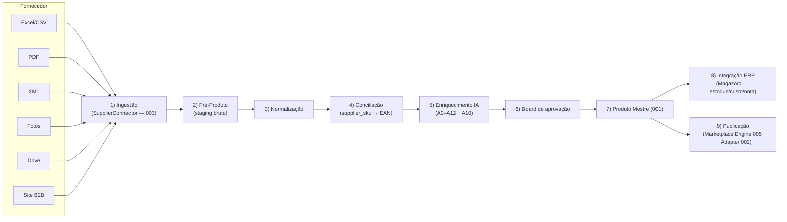
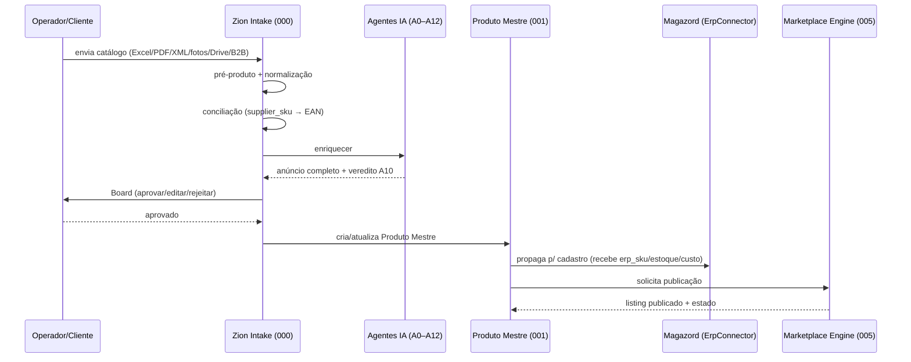
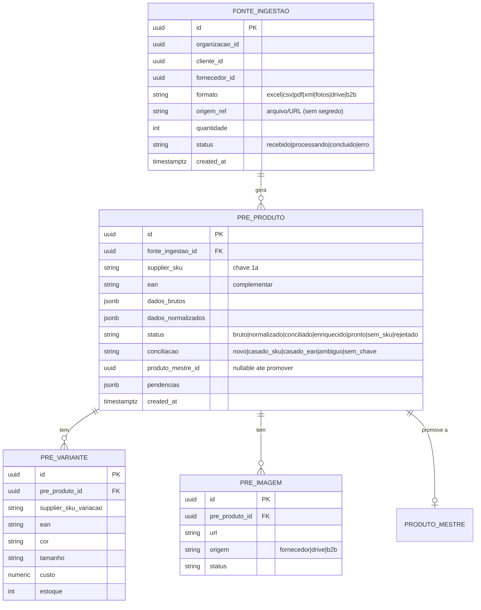

# 006 — Capability 000: Zion Intake

> A capability fundadora da Zion Platform: transforma o **caos do fornecedor** em um **Produto Mestre pronto para operar** em marketplaces. Compõe todas as peças (001–005). Documento de arquitetura — sem implementação.

## Objetivo

Receber o produto **onde ele nasce — no fornecedor** (Excel, PDF, XML, fotos, Drive, site B2B) e conduzi-lo, de forma governada, até estar **publicável**: pré-produto → conciliação por SKU → Produto Mestre → enriquecimento por IA → integração com o ERP (Magazord) → publicação no marketplace. É a "esteira industrial" da Zion, com a **Zion como Fonte da Verdade** do marketplace e o **ERP como fonte de estoque/fiscal/nota**.

## Responsabilidades

- **Ingerir** catálogos heterogêneos do fornecedor por qualquer formato/canal.
- Criar o **Pré-Produto** (staging bruto), normalizá-lo e **conciliar por `supplier_sku`** (EAN complementar).
- **Enriquecer** com IA (agentes A0–A12): título, descrição, ficha, medidas, variações, imagens, FAQ, com trava de qualidade (A10).
- Promover o Pré-Produto a **Produto Mestre** (001) e disparar a **integração ERP** e a **publicação** (via Engine 005).
- Manter tudo **assíncrono, idempotente e auditável** (Event Bus 004).

## Escopo

- Pipeline de ingestão → pré-produto → conciliação → enriquecimento → produto mestre → ERP → publicação.
- Modelos de staging (`fonte_ingestao`, `pre_produto`, `pre_variante`, `pre_imagem`) e o motor de conciliação.
- Orquestração dos agentes de IA e do Board de aprovação.

## Fora do escopo

- O modelo canônico em si (001), os contratos (002/003), o transporte (004) e o runtime de publicação (005) — o Intake **os usa**, não os redefine.
- Estoque/fiscal/nota — do ERP (Magazord).

## Fluxos

**Pipeline (visão macro):**

**Estágios (detalhe):**
1. **Recebimento do catálogo.** O `SupplierConnector` aceita o formato como está (planilha, PDF, XML, imagens, link B2B). Cada carga vira uma `fonte_ingestao` e emite `fornecedor.catalogo.recebido`.
2. **Pré-Produto.** Cada linha/produto extraído vira um `pre_produto` (dados brutos + `supplier_sku` + `ean`), sem virar Mestre ainda. Emite `intake.pre_produto.criado`.
3. **Normalização.** Padroniza SKU, EAN, tamanhos ("38 BR", "33-34" → grade limpa), unidades, marca/modelo. Sinaliza campos faltantes como pendência.
4. **Conciliação.** Chave **`supplier_sku`** primeiro; **EAN** só como desempate; casa com Produto Mestre existente (atualiza) ou marca como novo. Sem SKU válido → fila "pré-produto sem SKU" para revisão humana. Emite `intake.conciliacao.resolvida`.
5. **Enriquecimento IA.** Roda a esteira A0–A12 (A0 enriquece dados; A1–A9 inteligência; A3/A5/A6/A7/A8/A12 constroem; A4 monta; **A10 trava**). Gera título/descrição/ficha/medidas/variações/imagens/FAQ. Registra custo/modelo (ledger) e versiona.
6. **Board de aprovação.** O resultado vai para aprovação (humano/cliente): aprovar/editar/rejeitar, individual ou em massa. **Nada** avança sem aprovação (trava A10). Emite `intake.pre_produto.pronto`.
7. **Produto Mestre.** Cria/atualiza o `produto_mestre` (001) + variantes + imagens. Emite `produto_mestre.criado`.
8. **Integração ERP.** `ErpConnector` (Magazord) recebe o produto para **cadastro/atualização**; o ERP devolve `erp_sku`, estoque e custo (espelhados no Mestre). Emite `erp.produto.propagado` / `erp.estoque.mudou`.
9. **Publicação.** O Engine (005) publica via Adapter (002) no(s) marketplace(s); estado real reconciliado de volta.

**Sequência ponta a ponta:**

## Modelo de dados (staging do Intake)

## Eventos

Emite: `fornecedor.catalogo.recebido`, `intake.pre_produto.criado`, `intake.pre_produto.normalizado`, `intake.conciliacao.resolvida`, `intake.enriquecimento.concluido`, `intake.pre_produto.pronto`.
Consome: `produto_mestre.criado` (confirma promoção), `erp.produto.propagado` (fecha o loop ERP), `marketplace.listing.publicado` (fecha o loop publicação).

## Regras de negócio

1. **O produto nasce no fornecedor.** Toda origem é uma `fonte_ingestao`; nada entra "solto".
2. **SKU do fornecedor é a chave.** Conciliação por `supplier_sku`; `ean` só desempata; **sem chave válida não vira Mestre** (vai para `sem_sku`).
3. **Zion é dono do conteúdo e do preço de venda; ERP é dono de estoque/custo/nota.** O Intake respeita essa fronteira.
4. **IA não inventa dado de produto.** Falta → "⚠️ informação necessária" (pendência), nunca valor fictício (regra-mãe A0–A12).
5. **Aprovação obrigatória (A10 + Board).** Nada é promovido a Mestre/publicado sem aprovação.
6. **Idempotência ponta a ponta.** Reingerir o mesmo catálogo/SKU não duplica Pré-Produto nem Mestre.
7. **Tudo auditável.** Cada estágio emite evento; enriquecimento registra custo/modelo/versão.
8. **Multiempresa.** Todo dado escopado por `organizacao_id`/`cliente_id` (RLS).

## Critérios de aceite

- [ ] Um Excel de fornecedor com 800 SKUs gera 800 pré-produtos, concilia por SKU e promove os válidos a Produto Mestre sem duplicar.
- [ ] Produto sem SKU válido não vira Mestre e aparece na fila "sem_sku".
- [ ] O enriquecimento produz anúncio completo com veredito A10; itens com pendência não avançam.
- [ ] Promoção a Mestre dispara a propagação ao Magazord (recebe `erp_sku`/estoque/custo) e a publicação.
- [ ] Reingestão do mesmo catálogo é idempotente.
- [ ] Nenhuma etapa expõe segredo; todas emitem eventos auditáveis.
- [ ] EAN só é usado para conciliar quando o SKU falha, e fica registrado.

## Dependências

- **001 Product Master** (destino da promoção), **002 Marketplace Adapter** e **005 Marketplace Engine** (publicação), **003 Connector SDK** (SupplierConnector + ErpConnector Magazord), **004 Event Bus** (orquestração).
- **Agentes A0–A12** (esteira de enriquecimento — já existente no Zion OS).
- **Estúdio IA** (imagens — já existente).

## Riscos

| Risco | Mitigação |
|-------|-----------|
| Catálogos sujos/heterogêneos (PDF/B2B) | Ingestão tolerante + normalização + fila de revisão; começar por Excel/CSV/XML e evoluir para PDF/B2B. |
| SKU ausente/duplicado do fornecedor | Conciliação por EAN como desempate + fila `sem_sku`; nunca promove sem chave. |
| Custo de IA no enriquecimento em massa | Ledger de custo/uso + cota; processar em fila com orçamento. |
| Divergência com o Magazord | ERP é a fonte de estoque/custo; espelho por evento + reconciliação. |
| Fronteira de responsabilidade borrada (Zion×ERP) | Contrato explícito: Zion = conteúdo/preço/marketplace; ERP = estoque/fiscal/nota. |

## Roadmap

1. **v1 — Intake por planilha (Excel/CSV/XML)** → pré-produto → conciliação por SKU → enriquecimento (esteira atual) → Board → Produto Mestre. (Aproveita `importacaoProdutos`/`esteira` existentes.)
2. **v2 — Integração Magazord** (ErpConnector): cadastro/atualização + espelho de estoque/custo.
3. **v3 — Publicação via Engine** (ML com User Products + fila) direto do Produto Mestre.
4. **v4 — Ingestão avançada** (PDF, fotos, Drive, site B2B) + conciliação assistida por IA.
5. **v5 — Multicanal** (TikTok/Shopee) reusando Adapter/Engine, sem retrabalho de Intake.
