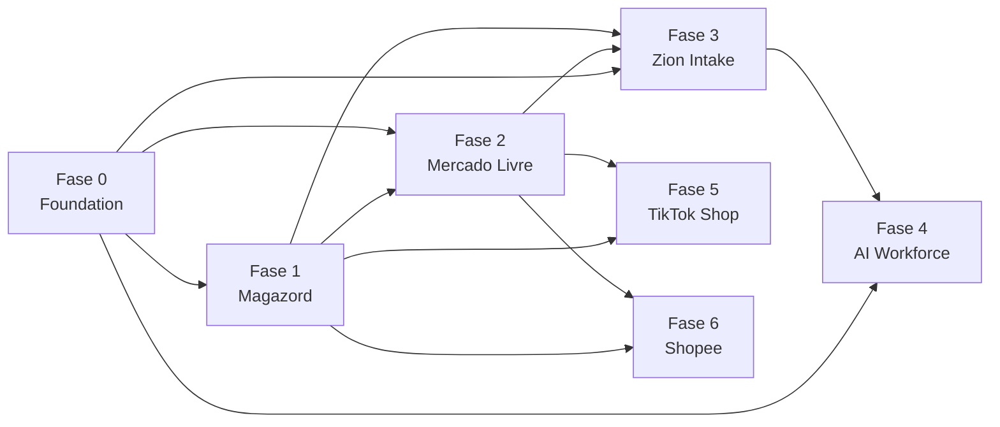

# 007 — Execution Roadmap

> **Plano Oficial de Execução da Zion Platform.** Transforma a arquitetura (000–006) em um roadmap técnico executável: fases → capabilities → épicos → user stories → tarefas, com dependências, Definition of Done, testes, critérios de aceite, riscos e rollback. Documento de planejamento — **sem implementação**.

> **Autoridade:** este documento **não altera** 000–006; ele os **sequencia**. Em divergência de nomenclatura, **000 (Business Domain)** prevalece. Em divergência de escopo técnico, prevalece o documento da capability (001–006).

---

## Objetivo

Organizar toda a implementação da Zion Platform em **fases numeradas**, cada uma decomposta em **Capabilities → Épicos → User Stories → Tarefas técnicas**, de modo que:

- Nenhuma funcionalidade seja construída **sem dependências claramente definidas**.
- Cada fase tenha **Definition of Done**, **plano de testes**, **critérios de aceite**, **riscos** e **rollback** explícitos.
- A ordem de construção respeite a **fronteira de Fonte da Verdade** (000): Zion = conteúdo/preço/marketplace; ERP = estoque/custo/fiscal; Marketplace = estado/pedido.
- O que **já existe** no Zion OS (OAuth ML, esteira A0–A12, fila `fila_otimizacao_produto` + Vercel Cron, RLS por papel, gateway de IA) seja **reaproveitado**, não reescrito.

---

## Estratégia de Implementação

**Por que incremental (e não big-bang):**

1. **Risco de fronteira.** A regra suprema de 000 é "cada informação tem uma única Fonte da Verdade". Construir os alicerces (Produto Mestre, Event Bus, contratos) **antes** de qualquer integração garante que estoque/custo/fiscal nasçam já do lado certo (ERP), sem retrabalho de migração de dados depois.
2. **Fundação antes de features.** Event Bus, Connector SDK e Marketplace Adapter são **contratos**. Se as integrações forem escritas antes dos contratos, cada canal vira código ML-específico acoplado (o problema que a auditoria ML já apontou: publicação síncrona 1-a-1, sem fila/idempotência). A Fase 0 fixa os contratos primeiro; ML/TikTok/Shopee viram implementações do mesmo contrato.
3. **Idempotência e escala desde a base.** Publicar 500+ anúncios exige fila + idempotência + retry (005). Isso é **infra transversal**: construir uma vez na Fase 0/2 e reusar em todos os canais é mais barato e seguro que reimplementar por canal.
4. **Aproveitamento do legado.** Já existem OAuth ML, esteira de agentes, worker de fila e RLS. O incremental permite **envelopar** o legado nos novos contratos (ex.: o worker atual generaliza para o Marketplace Engine) sem parar a operação do cliente atual (Chinelaria).
5. **Valor entregável por fase.** Cada fase fecha um loop de negócio verificável (Magazord dá estoque real; ML publica em escala; Intake ingere catálogo; IA enriquece; novos canais reusam tudo), permitindo liberar para produção fase a fase com critério objetivo.
6. **Ordem por dependência de dado, não por vontade.** Magazord (Fase 1) vem antes de publicação em escala (Fase 2) porque **estoque/custo são do ERP** — publicar sem o número real do ERP gera overselling. Intake (Fase 3) vem depois porque promove Pré-Produto → Produto Mestre já com ERP e publicação prontos. IA (Fase 4) enriquece o que o Intake ingere. TikTok/Shopee (5/6) só reusam Adapter/Engine — retrabalho zero.

**Sequência oficial:** `Fase 0 (Foundation) → Fase 1 (Magazord) → Fase 2 (Mercado Livre) → Fase 3 (Zion Intake) → Fase 4 (AI Workforce) → Fase 5 (TikTok Shop) → Fase 6 (Shopee)`.

**Princípios de execução (herdados de 000):** toda integração implementa o Connector SDK; todo marketplace implementa o Adapter; toda alteração gera Evento e Histórico; segredos só server-side; nada publica sem aprovação (A10/Board); multiempresa por RLS deny-by-default.

---

## FASE 0 — Foundation

> **Alicerce.** Somente as fundações canônicas. **Sem telas, sem IA, sem integração completa** — apenas os contratos, o transporte e a governança sobre os quais todas as fases seguintes assentam.

**Escopo permitido:** Product Master (001) · Event Bus (004) · Connector SDK (003) · Marketplace Adapter (002, contrato/base) · Logs · Auditoria · Versionamento.
**Fora de escopo nesta fase:** nenhuma tela de operação, nenhum agente de IA, nenhuma integração ponta a ponta com Magazord/ML.

### Objetivo
Estabelecer o modelo canônico e o backbone de eventos/contratos/auditoria, de forma que qualquer capability futura apenas **os use**, nunca os redefina.

### Capabilities
- **CAP-PM** — Produto Mestre (001): modelo canônico + versionamento + histórico.
- **CAP-BUS** — Event Bus (004): outbox + tabela de eventos + entrega + dead-letter + replay.
- **CAP-SDK** — Connector SDK (003): contratos `SupplierConnector`/`ErpConnector`/`MarketplaceConnector`, `limites()`, erros sanitizados.
- **CAP-ADP** — Marketplace Adapter (002): contrato base (sem canal concreto ainda).
- **CAP-OBS** — Observabilidade: Logs estruturados, Auditoria (old→new + autor/agente), Versionamento.

### Épicos
- **E0.1** Esquema canônico do Produto Mestre + Variante + Preço + espelhos de estoque/custo (read-only).
- **E0.2** Versionamento/Histórico de Produto Mestre (diff, autor, agente, timestamp, undo).
- **E0.3** Event Bus: envelope canônico, tabelas `evento`/`entrega`, relay via cron, idempotência por chave.
- **E0.4** Dead-letter + replay + métricas de lag.
- **E0.5** Connector SDK: interfaces + registro de conectores + política de erro/limite.
- **E0.6** Marketplace Adapter: contrato base + fábrica de adapters (stub).
- **E0.7** Observabilidade: `AuditLog`, logging estruturado sem segredo, correlação por `evento_id`.

### User Stories
- Como **plataforma**, gravo o fato de negócio e seu evento na **mesma transação** (outbox), para nunca ter evento órfão.
- Como **operador**, vejo o **histórico** de um Produto Mestre (o que mudou, quem mudou, quando) e posso **reverter**.
- Como **plataforma**, ao reprocessar um evento com a mesma `idempotency_key`, **não** duplico efeito.
- Como **desenvolvedor**, implemento um novo conector apenas satisfazendo a interface do SDK, sem tocar no núcleo.
- Como **auditoria**, consulto qualquer alteração relevante com valor anterior→novo.

### Dependências
- **Nenhuma capability anterior** (é a base). Depende apenas do stack: Supabase/Postgres + Vercel Cron (já existentes).

### Definition of Done
- [ ] Produto Mestre persiste com variantes, preço por canal e espelhos read-only de estoque/custo.
- [ ] Toda escrita relevante gera **evento** (outbox) e **entrada de histórico**.
- [ ] Event Bus entrega **at-least-once**, é **idempotente** por chave e **ordena por `produto_mestre_id`**.
- [ ] Dead-letter recebe falhas persistentes; **replay** reprocessa.
- [ ] Connector SDK e Marketplace Adapter existem como **contratos** com testes de contrato (sem canal concreto).
- [ ] `AuditLog` registra old→new; nenhum log/payload contém segredo.

### Plano de testes
- **Unitário:** envelope de evento; cálculo de `idempotency_key`; diff de versionamento; validação de contrato do SDK/Adapter.
- **Integração:** outbox (fato+evento na mesma transação); consumidor idempotente; dead-letter→replay; ordenação por chave de partição.
- **E2E (interno):** ciclo produtor→relay→consumidor→ack sem tela.
- **Performance/Carga:** relay processando N eventos/min sem lag crescente; 10k eventos sem perder ordenação por chave.

### Critérios de aceite (de 004/001)
- [ ] Reprocessar mesmo evento não gera efeito duplicado.
- [ ] Nenhum fato gravado sem evento (outbox).
- [ ] Eventos do mesmo produto processados em ordem.
- [ ] Falha repetida → dead-letter; replay reprocessa.
- [ ] Nenhum payload contém token/secret/service_role.

### Riscos
| Risco | Mitigação |
|-------|-----------|
| Contrato mal desenhado trava fases seguintes | Testes de contrato + revisão de arquitetura antes de fechar a fase. |
| Latência do relay via cron | Cron frequente + métrica de lag; evoluir para broker se exigir. |
| Consumidor não-idempotente | Idempotência obrigatória + tabela `entrega` como dedup. |

### Rollback
- Fundação nova é **aditiva** (novas tabelas/serviços, sem tocar no legado operacional). Rollback = **desabilitar o relay** (nada consome) e **feature-flag** o novo modelo; o legado atual (fila `fila_otimizacao_produto`) continua operando. Reverter migrações aditivas por *down migration* isolada.

---

## FASE 1 — Magazord (ERP)

> **Fonte da Verdade de estoque, custo, fiscal e nota.** Antes de publicar em escala, o número real precisa vir do ERP.

### Objetivo
Integrar o Magazord via `ErpConnector` (003): cadastrar/atualizar o Produto Mestre no ERP, e **espelhar** (read-only) estoque e custo de volta ao Produto Mestre, respeitando a fronteira de 000 (a Zion **nunca** inventa estoque/custo/nota).

### Capabilities
- **CAP-ERP** — `ErpConnector` Magazord (003): cadastro, leitura de estoque/custo, eventos ERP.

### Épicos
- **E1.1** Autenticação/credenciais Magazord (server-side, nunca no browser).
- **E1.2** Cadastro/atualização de produto no ERP a partir de `produto_mestre.criado`/`.atualizado`; recebe `erp_sku`.
- **E1.3** Espelho de estoque/custo (read model) na Variante; eventos `erp.estoque.mudou`/`erp.custo.mudou`.
- **E1.4** Reconciliação periódica ERP↔Zion + tratamento de divergência.
- **E1.5** Emissão de nota é **do ERP**; a Zion apenas referencia (`erp.nota.emitida`).

### User Stories
- Como **plataforma**, ao criar/atualizar um Produto Mestre, propago o cadastro ao Magazord e recebo o `erp_sku`.
- Como **operador**, vejo estoque e custo **reais** (do ERP) espelhados no produto, sem editá-los na Zion.
- Como **plataforma**, quando o estoque muda no ERP, emito `erp.estoque.mudou` para propagação posterior aos canais.

### Dependências
- **Fase 0** completa: Connector SDK (003), Event Bus (004), Produto Mestre (001).

### Definition of Done
- [ ] `ErpConnector` implementa o contrato do SDK (incl. `limites()` e erros sanitizados).
- [ ] Cadastro no Magazord funciona e retorna `erp_sku` persistido na Variante.
- [ ] Estoque/custo do ERP espelhados read-only; a Zion não escreve esses campos.
- [ ] Mudança no ERP gera evento; reconciliação detecta e registra divergências.
- [ ] Credenciais Magazord só server-side; nenhum segredo em log/evento.

### Plano de testes
- **Unitário:** mapeamento Produto Mestre → payload Magazord; parser de estoque/custo; sanitização de erro.
- **Integração:** cadastro (mock/sandbox Magazord) devolve `erp_sku`; evento `erp.estoque.mudou` dispara; reconciliação marca divergência.
- **E2E:** criar Produto Mestre → propagar ao ERP → espelhar estoque/custo → ver no produto.
- **Performance/Carga:** propagar N produtos respeitando `limites()` do ERP sem estourar rate-limit.

### Critérios de aceite
- [ ] Um Produto Mestre novo aparece cadastrado no Magazord com `erp_sku` válido.
- [ ] Estoque/custo exibidos são os do ERP; edição na Zion é bloqueada.
- [ ] Divergência ERP↔Zion é detectada e logada, não silenciada.

### Riscos
| Risco | Mitigação |
|-------|-----------|
| API Magazord instável/limites | `limites()` + retry/backoff via Engine/worker; fila de propagação. |
| Divergência de estoque | ERP é dono; reconciliação por evento + alerta. |
| Mapeamento de SKU ERP↔Zion | Conciliação por `sku_origem`/`sku_zion`↔`erp_sku`; fila de exceção. |

### Rollback
- `ErpConnector` atrás de feature-flag por cliente. Rollback = **desligar a propagação** (Produto Mestre continua existindo na Zion sem espelho ERP) e reverter a *down migration* dos campos de espelho. Nenhuma escrita destrutiva no ERP no rollback (a Zion nunca apaga dado do ERP).

---

## FASE 2 — Mercado Livre

> **Baseia-se obrigatoriamente na `MERCADO LIVRE INTEGRATION AUDIT.MD`.** **Não recriar** a integração existente; **envelopá-la** no Adapter/Engine e fechar as lacunas apontadas.

### Ponto de partida (o que JÁ existe — reaproveitar)
- OAuth ML server-side + refresh token (`src/lib/marketplaces/mercadolivre.ts`): `trocarCodigoPorToken`, `renovarToken`.
- Publicação de item (`criarItem` → POST /items), previsão de categoria (`preverCategoria`), guia de tamanhos (`criarGuiaTamanhos` → /catalog/charts).
- Importação (`buscarAnunciosDoVendedor`, multiget) e vendas (`buscarPedidosML`, /orders/search paid).
- Builder de **User Products** (`src/lib/marketplaces/mlUserProducts.ts`: `montarItensUserProducts`, `precisaUserProducts`) — **existe mas NÃO está ligado** ao publish.
- Fila `fila_otimizacao_produto` + worker Vercel Cron — **padrão a generalizar** para o Engine.

### Lacunas da auditoria a fechar (o que falta)
- Publicação é **síncrona 1-a-1 disparada do browser** → migrar para **assíncrona via Engine** (005).
- **Sem idempotência** → risco de anúncio duplicado (R-ML2).
- User Products **não conectado** ao fluxo de publish.
- **Sem PUT de preço** e **sem PUT de estoque** (nenhum update /items) → overselling/desatualização.
- **Sem webhooks** ML → estado real do anúncio e vendas não reconciliados.
- **Sem logs persistidos** das operações de canal.

### Objetivo
Implementar o **Marketplace Adapter do ML** (002) e ligá-lo ao **Marketplace Engine** (005), fechando as lacunas: User Products no publish, PUT preço, PUT estoque, webhooks, publicação assíncrona e idempotência — reusando todo o código ML já existente.

### Capabilities
- **CAP-ML-ADP** — Marketplace Adapter ML (002): traduz Produto Mestre ↔ payload ML (clássico e User Products).
- **CAP-ENG** — Marketplace Engine (005): fila `operacao_marketplace`, idempotência, retry/backoff, rate-limit, fan-out, reconciliação (generaliza o worker atual).

### Épicos
- **E2.1** Adapter ML: envelopar `criarItem`/`preverCategoria`/`criarGuiaTamanhos` sob o contrato 002.
- **E2.2** Ligar **User Products** no publish (`precisaUserProducts` decide clássico × User Products; SIZE_GRID via /catalog/charts).
- **E2.3** Engine: fila `operacao_marketplace` + `unique(idempotency_key)` + checagem de `marketplace_item_id` (fecha R-ML2).
- **E2.4** **PUT preço** (`adapter.atualizarPrecoEstoque` → PUT /items) disparado por `produto_mestre.atualizado`/`preco.definido`.
- **E2.5** **PUT estoque** propagando o número **do ERP** (`estoque.espelhado`) → PUT /items.
- **E2.6** **Webhooks ML** (notifications) → `marketplace.listing.estado` / `venda.recebida` → reconciliação.
- **E2.7** Publicação **assíncrona** e **fan-out** a partir do Produto Mestre (remove disparo do browser).
- **E2.8** Logs persistidos por operação (status, tentativas, erro sanitizado).

### User Stories
- Como **operador**, publico **500 anúncios sem manter a aba aberta**, sem duplicar.
- Como **plataforma**, quando o preço muda no Produto Mestre, **atualizo o anúncio no ML** automaticamente.
- Como **plataforma**, quando o estoque do ERP muda, **propago ao ML** para evitar overselling.
- Como **plataforma**, ao receber webhook de venda, **reduzo o estoque a propagar** e atualizo o `listing`.
- Como **operador**, publico em categoria que exige **User Products/SIZE_GRID** sem erro.

### Dependências
- **Fase 0** (Adapter base 002, Engine base 005, Event Bus 004, Produto Mestre 001).
- **Fase 1** (Magazord) para que **estoque/custo propagados sejam os reais** do ERP.
- Auditoria ML (`MERCADO LIVRE INTEGRATION AUDIT.MD`) como base factual.

### Definition of Done
- [ ] Publicação **assíncrona** via Engine; nada dispara do browser.
- [ ] `unique(idempotency_key)` + checagem de `marketplace_item_id` impedem duplicação.
- [ ] User Products conectado; categorias que exigem SIZE_GRID publicam corretamente.
- [ ] PUT preço e PUT estoque funcionando; estoque reflete o ERP.
- [ ] Webhooks ML reconciliam estado/venda de volta ao `listing`.
- [ ] Operações logadas; erros sanitizados; nenhum `refresh_token` no browser.

### Plano de testes
- **Unitário:** decisão clássico × User Products; montagem de payload; `idempotency_key`; parser de webhook.
- **Integração:** publish idempotente (reenvio = no-op); PUT preço/estoque; webhook de venda reduz estoque a propagar.
- **E2E:** Produto Mestre → publicar (fila) → item no ML → mudar preço → refletir no ML → vender (webhook) → reconciliar.
- **Performance:** 500 itens na fila com rate-limit por conta; sem 429 fora de controle.
- **Carga:** fan-out 1 Produto → N contas/itens; worker recupera item "processando" preso.

### Critérios de aceite (de 005)
- [ ] Publicar 500 itens sem a aba aberta, sem duplicar.
- [ ] Preço/estoque do Produto Mestre propaga a todos os `listing` ativos.
- [ ] Venda (webhook) reduz estoque a propagar e atualiza `listing`.
- [ ] 429 → backoff; item preso volta à fila; erro permanente → dead-letter replayável.
- [ ] O Engine não contém regra específica de ML (fica no Adapter).

### Riscos
| Risco | Mitigação |
|-------|-----------|
| Duplicar anúncio (R-ML2) | `unique(idempotency_key)` + checagem de `marketplace_item_id`. |
| Overselling (R-ML3) | PUT estoque + reconciliação por webhook. |
| Rate limit ML (R-ML5) | `limites()` + concorrência/backoff por conta. |
| SIZE_GRID/tamanhos "sujos" | Normalização de tamanhos no Intake/Adapter antes do publish. |
| Regressão do fluxo atual | Envelopar o legado atrás do Adapter com feature-flag; testes de paridade. |

### Rollback
- Adapter/Engine ML atrás de feature-flag por cliente. Rollback = **voltar ao publish atual** (legado ainda presente) enquanto se corrige; operações em fila pausadas, não perdidas (dead-letter/replay). Webhooks desregistráveis sem afetar dados.

---

## FASE 3 — Zion Intake (Capability 000)

> A esteira industrial (006): do **catálogo do fornecedor** ao **Produto Mestre** pronto para operar.

### Objetivo
Ingerir catálogos heterogêneos da **Origem do Produto**, criar **Pré-Produto**, normalizar, **conciliar por `sku_origem`** (EAN complementar) e **promover a Produto Mestre**, disparando ERP (Fase 1) e publicação (Fase 2).

### Capabilities
- **CAP-INTAKE** — Zion Intake (006): ingestão → pré-produto → normalização → conciliação → promoção.
- **CAP-ORIGEM** — Origem do Produto + Catálogo (000/001): cadastro de origens e lotes recebidos.

### Épicos
- **E3.1** `SupplierConnector` (003) para ingestão (v1: Excel/CSV/XML) → `fonte_ingestao` + `fornecedor.catalogo.recebido`.
- **E3.2** Pré-Produto (staging: `pre_produto`/`pre_variante`/`pre_imagem`) + normalização (SKU/EAN/tamanhos/marca).
- **E3.3** Motor de **conciliação** por `sku_origem` → EAN desempate → fila `sem_sku` para revisão.
- **E3.4** Promoção Pré-Produto → Produto Mestre (idempotente) + disparo ERP + publicação.
- **E3.5** Origem do Produto (5 tipos) + Catálogo + Compra (revenda, opcional) conforme 000/001.

### User Stories
- Como **operador**, subo um Excel de 800 SKUs e obtenho 800 pré-produtos conciliados por SKU.
- Como **operador**, produtos **sem SKU válido** caem em fila `sem_sku`, não viram Mestre.
- Como **plataforma**, reingerir o mesmo catálogo **não duplica** pré-produto nem Mestre.
- Como **operador**, aprovo no Board e o produto é promovido a Mestre, cadastrado no ERP e publicado.

### Dependências
- **Fase 0** (Produto Mestre, SDK, Event Bus).
- **Fase 1** (ERP) — a promoção propaga ao Magazord.
- **Fase 2** (ML) — a promoção pode publicar.
- **Fase 4** (IA) para o **enriquecimento**; sem a Fase 4, o Intake opera com o **enriquecimento legado (esteira atual)** como ponte.

### Definition of Done
- [ ] Ingestão v1 (Excel/CSV/XML) cria `fonte_ingestao` e pré-produtos.
- [ ] Normalização padroniza SKU/EAN/tamanhos e sinaliza pendências.
- [ ] Conciliação por `sku_origem` (EAN desempate); `sem_sku` para exceções.
- [ ] Promoção a Produto Mestre é idempotente e dispara ERP + publicação.
- [ ] Multiempresa por RLS; tudo auditável por evento.

### Plano de testes
- **Unitário:** parser de planilha; normalizador de tamanho/SKU; regra de conciliação SKU→EAN.
- **Integração:** Excel 800 SKUs → 800 pré-produtos; reingestão idempotente; `sem_sku` roteado.
- **E2E:** catálogo → pré-produto → conciliação → Board → Produto Mestre → ERP → publicação.
- **Performance/Carga:** ingestão de 1.000+ linhas com upsert em lote (chunk+retry) sem estourar memória.

### Critérios de aceite (de 006)
- [ ] Excel com 800 SKUs gera 800 pré-produtos, concilia e promove os válidos sem duplicar.
- [ ] Produto sem SKU válido não vira Mestre e aparece em `sem_sku`.
- [ ] Reingestão do mesmo catálogo é idempotente.
- [ ] EAN só concilia quando o SKU falha, e fica registrado.

### Riscos
| Risco | Mitigação |
|-------|-----------|
| Catálogos sujos (PDF/B2B) | Começar por Excel/CSV/XML; PDF/fotos/Drive/B2B em fase posterior (006 v4). |
| SKU ausente/duplicado | Conciliação por EAN + fila `sem_sku`; nunca promove sem chave. |
| Duplicação na reingestão | Idempotência por `sku_origem` + `fonte_ingestao`. |

### Rollback
- Intake atrás de feature-flag. Rollback = **desligar a promoção automática** (pré-produtos ficam em staging, não afetam o catálogo operacional) e reverter migrações de staging. O caminho legado de importação continua disponível.

---

## FASE 4 — AI Workforce (A0–A12)

> A força de trabalho de enriquecimento: transforma dado bruto em **anúncio completo**, com trava de qualidade (A10), **sem inventar dado**.

### Objetivo
Orquestrar os agentes A0–A12 dentro do Intake (Workflow de enriquecimento), com gateway de provedor (Gemini/Claude), ledger de custo/uso, versionamento e Board de aprovação — reaproveitando a esteira e o gateway de IA já existentes.

### Capabilities
- **CAP-AI** — AI Workforce: esteira A0–A12 + gateway + ledger + qualidade (A10).
- **CAP-STUDIO** — Estúdio IA (imagens) — já existente; integrado ao enriquecimento.

### Épicos
- **E4.1** Orquestração da esteira A0–A12 como Workflow (000) dentro do Intake.
- **E4.2** Gateway de provedor com **fallback** (Gemini↔Claude) e saída estruturada por JSON Schema.
- **E4.3** **Ledger de custo/uso** (modelo, tokens, custo) por execução (`AIExecution`/`UsageRecord`).
- **E4.4** Trava de qualidade **A10** + Board (aprovar/editar/rejeitar, individual/massa).
- **E4.5** Regra-mãe: falta de dado → "⚠️ informação necessária" (nunca valor fictício).

### User Stories
- Como **operador**, ao enriquecer, recebo título/descrição/ficha/medidas/variações/imagens/FAQ completos.
- Como **plataforma**, se o Gemini falha, **caio para Claude** sem perder a execução.
- Como **gestor**, vejo **custo e modelo** de cada execução (ledger) e minha cota.
- Como **plataforma**, itens com pendência **não avançam** (trava A10).

### Dependências
- **Fase 3** (Intake) — a IA enriquece o Pré-Produto.
- **Fase 0** (Event Bus/versionamento/auditoria) — registra custo/modelo/versão.

### Definition of Done
- [ ] Esteira A0–A12 roda como Workflow e produz anúncio completo com veredito A10.
- [ ] Fallback entre provedores funciona; JSON grande não trunca (limites tratados).
- [ ] Ledger registra modelo/tokens/custo por execução; cota aplicável.
- [ ] Nada é promovido/publicado sem aprovação (A10 + Board).
- [ ] IA nunca inventa dado; pendências explícitas.

### Plano de testes
- **Unitário:** cada agente (entrada→saída estruturada); regra "⚠️ informação necessária"; cálculo de custo.
- **Integração:** esteira completa A0→A10→Board; fallback Gemini→Claude; ledger persistido.
- **E2E:** Pré-Produto → enriquecimento → A10 → Board → Produto Mestre enriquecido.
- **Performance/Carga:** enriquecimento em massa via fila com orçamento/cota; sem estourar rate-limit dos provedores.

### Critérios de aceite
- [ ] Enriquecimento produz anúncio completo com veredito A10; pendências bloqueiam avanço.
- [ ] Falha de um provedor cai para o outro sem perder a execução.
- [ ] Custo/modelo de cada execução ficam registrados e auditáveis.

### Riscos
| Risco | Mitigação |
|-------|-----------|
| Custo de IA em massa | Ledger + cota + fila com orçamento. |
| Truncamento de JSON grande | Limites por agente + retry de parse (padrão do worker atual). |
| IA inventando dado | Regra-mãe A0–A12 + trava A10 + Board humano. |

### Rollback
- Enriquecimento IA atrás de feature-flag. Rollback = **usar enriquecimento legado / edição manual** no Board; o Intake continua promovendo produtos, apenas sem a esteira nova. Nenhuma escrita destrutiva (versões preservam o estado anterior).

---

## FASE 5 — TikTok Shop

> **Reuso puro.** Novo canal = novo **Adapter** (002) sobre o **mesmo** Engine/Event Bus/Produto Mestre. Retrabalho de Intake/IA = zero.

### Objetivo
Adicionar o Marketplace Adapter do TikTok Shop, habilitando fan-out multicanal (ML + TikTok) sem tocar em núcleo, Intake ou IA.

### Capabilities
- **CAP-TT-ADP** — Marketplace Adapter TikTok Shop (002).

### Épicos
- **E5.1** OAuth/credenciais TikTok Shop (server-side).
- **E5.2** Adapter: Produto Mestre ↔ payload TikTok (categorias/atributos/variações).
- **E5.3** Webhooks TikTok → `marketplace.listing.estado`/`venda.recebida`.
- **E5.4** Fan-out ML + TikTok com rate-limit por conta.

### User Stories
- Como **operador**, publico o **mesmo** Produto Mestre no ML **e** no TikTok, com estados independentes.
- Como **plataforma**, reconcilio vendas/estado do TikTok via webhook, como no ML.

### Dependências
- **Fase 2** (Engine + Adapter base validados no ML). **Fase 1** (estoque real do ERP). **Fase 0** (contratos).

### Definition of Done
- [ ] Adapter TikTok implementa o contrato 002 (publicar/atualizar/pausar/reconciliar).
- [ ] Fan-out ML + TikTok independente e idempotente.
- [ ] Webhooks TikTok reconciliam estado/venda.
- [ ] **Nenhuma** alteração em Engine/Intake/IA (só o novo Adapter).

### Plano de testes
- **Unitário:** payload TikTok; parser de webhook; mapeamento de variações.
- **Integração:** publish idempotente; PUT preço/estoque; webhook de venda.
- **E2E:** Produto Mestre → publicar em ML + TikTok → estados independentes.
- **Performance/Carga:** fan-out N contas/canais respeitando `limites()`.

### Critérios de aceite
- [ ] Mesmo produto publicado em 2 canais com estados independentes.
- [ ] Engine permanece livre de regra específica de TikTok (fica no Adapter).

### Riscos
| Risco | Mitigação |
|-------|-----------|
| Especificidades TikTok (categorias/atributos) | Toda regra no Adapter; núcleo intacto. |
| Rate limit TikTok | `limites()` + backoff por conta. |

### Rollback
- Adapter TikTok atrás de feature-flag por cliente/canal. Rollback = desabilitar o canal; ML e demais seguem operando. Sem impacto no Produto Mestre.

---

## FASE 6 — Shopee

> Segundo canal de reuso. **Idêntico em forma à Fase 5** — só muda o Adapter.

### Objetivo
Adicionar o Marketplace Adapter da Shopee, completando o fan-out multicanal (ML + TikTok + Shopee) sem retrabalho de núcleo/Intake/IA.

### Capabilities
- **CAP-SP-ADP** — Marketplace Adapter Shopee (002).

### Épicos
- **E6.1** OAuth/credenciais Shopee (server-side).
- **E6.2** Adapter: Produto Mestre ↔ payload Shopee.
- **E6.3** Webhooks Shopee → reconciliação de estado/venda.
- **E6.4** Fan-out ML + TikTok + Shopee com rate-limit por conta.

### User Stories
- Como **operador**, publico o mesmo Produto Mestre em ML, TikTok **e** Shopee.
- Como **plataforma**, reconcilio Shopee via webhook como nos demais canais.

### Dependências
- **Fase 2** (Engine/Adapter base). **Fase 1** (ERP). **Fase 0** (contratos). Independe das Fases 3/4/5 em runtime (mas herda o padrão validado nelas).

### Definition of Done
- [ ] Adapter Shopee implementa o contrato 002.
- [ ] Fan-out ML + TikTok + Shopee independente e idempotente.
- [ ] Webhooks Shopee reconciliam estado/venda.
- [ ] **Nenhuma** alteração em Engine/Intake/IA.

### Plano de testes
- **Unitário/Integração/E2E/Carga:** espelham a Fase 5, trocando o canal por Shopee.

### Critérios de aceite
- [ ] Mesmo produto em 3 canais com estados independentes.
- [ ] Engine sem regra específica de Shopee.

### Riscos
| Risco | Mitigação |
|-------|-----------|
| Especificidades Shopee | Regra isolada no Adapter. |
| Rate limit Shopee | `limites()` + backoff por conta. |

### Rollback
- Feature-flag por canal. Rollback = desabilitar Shopee; demais canais intactos.

---

## Matriz de Dependências

**Capabilities × do que dependem:**

| Capability | Fase | Depende de |
|-----------|------|-----------|
| CAP-PM (Produto Mestre) | 0 | — (base) |
| CAP-BUS (Event Bus) | 0 | — (base) |
| CAP-SDK (Connector SDK) | 0 | — (base) |
| CAP-ADP (Adapter base) | 0 | CAP-SDK |
| CAP-OBS (Logs/Auditoria/Versão) | 0 | CAP-PM, CAP-BUS |
| CAP-ERP (Magazord) | 1 | CAP-SDK, CAP-BUS, CAP-PM |
| CAP-ML-ADP (Adapter ML) | 2 | CAP-ADP, CAP-PM |
| CAP-ENG (Marketplace Engine) | 2 | CAP-ADP, CAP-BUS, CAP-PM, CAP-ERP* |
| CAP-INTAKE (Zion Intake) | 3 | CAP-PM, CAP-SDK, CAP-BUS, CAP-ERP, CAP-ENG |
| CAP-ORIGEM (Origem/Catálogo) | 3 | CAP-PM |
| CAP-AI (AI Workforce) | 4 | CAP-INTAKE, CAP-BUS, CAP-OBS |
| CAP-STUDIO (Estúdio IA) | 4 | CAP-AI |
| CAP-TT-ADP (Adapter TikTok) | 5 | CAP-ENG, CAP-ADP, CAP-ERP |
| CAP-SP-ADP (Adapter Shopee) | 6 | CAP-ENG, CAP-ADP, CAP-ERP |

\* CAP-ENG depende de CAP-ERP para **propagar o estoque real**; pode ser construído em paralelo, mas só **libera para produção** de estoque após a Fase 1.

**Grafo de dependências (fases):**

**Regra de dependência:** nenhuma capability inicia sem que **todas as suas dependências** estejam com Definition of Done cumprida. Nenhuma funcionalidade fica "solta".

---

## Plano de Pull Requests

> Cada PR é **pequeno, revisável e reversível**, com testes próprios e atrás de feature-flag quando toca runtime. Um PR nunca mistura duas capabilities.

| PR | Fase | Título | Depende de | Entrega |
|----|------|--------|-----------|---------|
| **PR-001** | 0 | Foundation — esquema Produto Mestre + Variante + Preço | — | Modelo canônico (001) |
| **PR-002** | 0 | Versionamento/Histórico do Produto Mestre | PR-001 | Diff/autor/undo |
| **PR-003** | 0 | Event Bus — outbox + tabelas `evento`/`entrega` + relay | — | Transporte (004) |
| **PR-004** | 0 | Event Bus — dead-letter + replay + métricas de lag | PR-003 | Resiliência |
| **PR-005** | 0 | Connector SDK — contratos + registro + erros/limites | — | Contrato (003) |
| **PR-006** | 0 | Marketplace Adapter — contrato base + fábrica (stub) | PR-005 | Contrato (002) |
| **PR-007** | 0 | Observabilidade — AuditLog + logging estruturado | PR-001, PR-003 | Auditoria/Logs |
| **PR-008** | 1 | ErpConnector Magazord — auth + cadastro (erp_sku) | PR-005, PR-003, PR-001 | Cadastro ERP |
| **PR-009** | 1 | ERP — espelho estoque/custo + eventos + reconciliação | PR-008 | Fonte da verdade estoque/custo |
| **PR-010** | 2 | Marketplace Engine — fila `operacao_marketplace` + idempotência | PR-006, PR-003 | Runtime de operações |
| **PR-011** | 2 | Adapter ML — envelopar publish/categoria/size-grid existentes | PR-006, PR-010 | ML sob contrato |
| **PR-012** | 2 | ML — ligar User Products no publish | PR-011 | SIZE_GRID/User Products |
| **PR-013** | 2 | ML — PUT preço | PR-011 | Update preço |
| **PR-014** | 2 | ML — PUT estoque (reflete ERP) | PR-011, PR-009 | Antioverselling |
| **PR-015** | 2 | ML — Webhooks + reconciliação de estado/venda | PR-010 | Estado real |
| **PR-016** | 2 | ML — publicação assíncrona + fan-out (remove disparo do browser) | PR-010, PR-011 | Escala |
| **PR-017** | 3 | SupplierConnector — ingestão Excel/CSV/XML | PR-005, PR-003 | Ingestão |
| **PR-018** | 3 | Intake — Pré-Produto + normalização | PR-017 | Staging |
| **PR-019** | 3 | Intake — motor de conciliação (sku_origem→EAN) + fila sem_sku | PR-018 | Conciliação |
| **PR-020** | 3 | Intake — promoção a Produto Mestre + disparo ERP/publicação | PR-019, PR-008, PR-010 | Promoção |
| **PR-021** | 3 | Origem do Produto + Catálogo + Compra (revenda) | PR-001 | Origem/Catálogo |
| **PR-022** | 4 | AI — orquestração esteira A0–A12 (Workflow) | PR-020, PR-003 | Enriquecimento |
| **PR-023** | 4 | AI — gateway com fallback Gemini↔Claude | PR-022 | Resiliência IA |
| **PR-024** | 4 | AI — ledger de custo/uso (AIExecution/UsageRecord) | PR-022, PR-007 | Custo/cota |
| **PR-025** | 4 | AI — trava A10 + Board (aprovar/editar/rejeitar) | PR-022 | Qualidade |
| **PR-026** | 5 | Adapter TikTok Shop + webhooks | PR-010, PR-006 | Canal TikTok |
| **PR-027** | 5 | Fan-out ML + TikTok (rate-limit por conta) | PR-016, PR-026 | Multicanal |
| **PR-028** | 6 | Adapter Shopee + webhooks | PR-010, PR-006 | Canal Shopee |
| **PR-029** | 6 | Fan-out ML + TikTok + Shopee | PR-027, PR-028 | Multicanal completo |

**Regras de PR:** (1) verde no CI (lint + typecheck + build + testes) obrigatório; (2) toda mudança de runtime atrás de feature-flag; (3) migrações sempre com *down*; (4) nenhum segredo em código/log; (5) um PR = uma responsabilidade.

---

## Plano de Testes (global)

| Nível | O que cobre | Onde | Gate |
|-------|-------------|------|------|
| **Unitários** | Funções puras: envelope de evento, `idempotency_key`, diff de versão, mapeamento Produto↔payload (ML/ERP/TikTok/Shopee), normalizador de SKU/tamanho, regras de conciliação, cálculo de custo/margem. | `node --test` em `*.test.ts`; `npx tsc --noEmit`; `npm run lint`. | Todo PR. |
| **Integração** | Contratos entre peças: outbox (fato+evento), consumidor idempotente, dead-letter→replay, ErpConnector (sandbox/mock), Adapter ML publish/PUT, webhook→reconciliação, conciliação Intake, esteira IA+ledger. | Ambiente de integração com mocks/sandbox das APIs externas. | Todo PR que toca a peça. |
| **E2E** | Jornadas ponta a ponta: catálogo→Pré-Produto→conciliação→Board→Produto Mestre→ERP→publicação→venda→reconciliação; multicanal fan-out. | Staging com Supabase de teste + sandbox ML/ERP. | Antes de liberar cada fase. |
| **Performance** | Latência do relay/worker; PUT preço/estoque em volume; enriquecimento por fila com orçamento. | Staging, cargas sintéticas. | Antes de liberar Fases 2/4. |
| **Carga** | 500–1.000+ itens: publicação sem duplicar, upsert em lote (chunk+retry), fan-out N contas, recuperação de item preso, sem estourar rate-limit. | Staging, dataset de 1k SKUs. | Antes de liberar Fases 2/3/5/6. |

**Princípios de teste:** idempotência sempre testada (reenvio = no-op); nenhum teste depende de segredo real; toda fila testada para dead-letter/replay; toda propagação de estoque testada contra overselling.

---

## Critério de Liberação (para produção)

Uma **Capability** só vai para produção quando **todos** os itens abaixo estão satisfeitos:

1. **Definition of Done** da capability 100% cumprida.
2. **Dependências** (matriz) todas já liberadas em produção — nenhuma dependência em flag.
3. **Testes:** unitários + integração verdes; E2E da jornada da capability verde; carga/performance dentro da meta quando aplicável (Fases 2/3/4/5/6).
4. **Fronteira de Fonte da Verdade (000) respeitada:** a capability não escreve dado de que não é dona (verificado por teste e revisão).
5. **Idempotência e resiliência:** operações idempotentes; falhas vão a dead-letter e são replayáveis; nada se perde silenciosamente.
6. **Segurança:** nenhum segredo em browser/log/evento; RLS deny-by-default cobrindo as novas tabelas; credenciais só server-side.
7. **Auditoria/Versionamento:** toda alteração relevante gera evento + histórico; AuditLog cobre a capability.
8. **Aprovação (quando publica):** trava A10/Board ativa; nada vai ao ar sem aprovação.
9. **Observabilidade:** logs estruturados + métricas (lag de eventos, taxa de erro, dead-letter) com alerta.
10. **Rollback ensaiado:** feature-flag de desligamento validado; *down migration* testada; plano de rollback documentado no PR.
11. **Revisão de arquitetura:** conformidade com 000–006 assinada (Principal Architect).

**Gate de saída por fase:** a fase é declarada "em produção" apenas quando **todas as suas capabilities** cumprem o Critério de Liberação acima. Só então a fase seguinte que dependia dela pode liberar.

---

> **Status:** 007 — Execution Roadmap **v1.0**. Este é o plano oficial de desenvolvimento da Zion Platform. Alterações de escopo/ordem versionam este documento (v1.1, v2.0…) e nunca contrariam a fronteira de Fonte da Verdade definida em 000.
