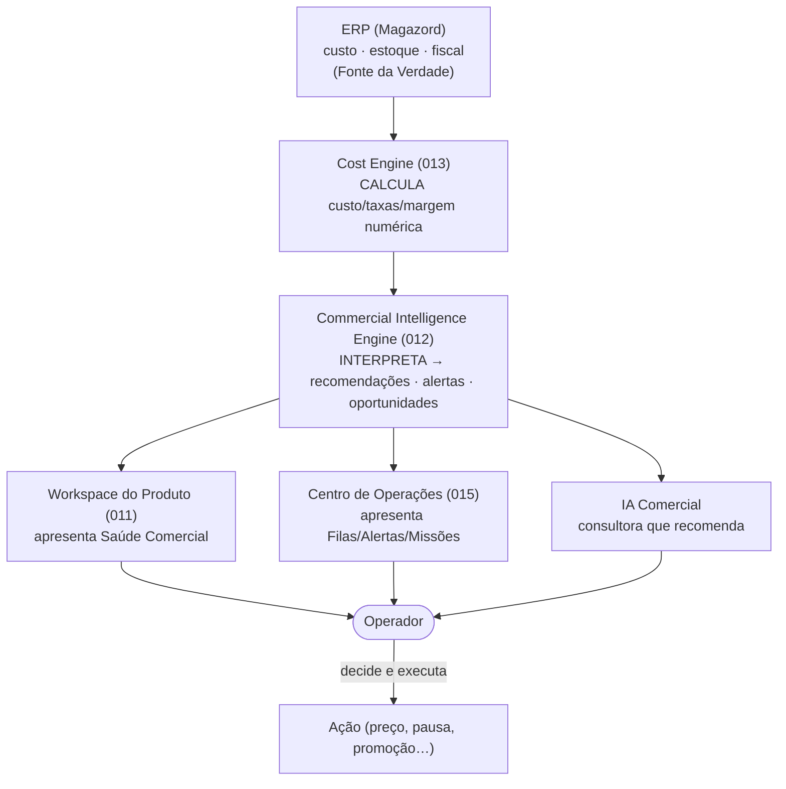

# 012 — Commercial Intelligence Engine

> **Arquitetura funcional da Zion Platform — Épico 2: Inteligência Comercial.** Define o motor que **transforma dados operacionais em decisões comerciais**. É um documento de **arquitetura funcional** — **sem implementação**. Não descreve classes, banco, API, interfaces nem **fórmulas matemáticas**; descreve **o que o motor interpreta**, **que decisões produz** e **quais princípios** o governam.

> [!important] Separação de responsabilidades — regra fundadora deste documento
> **O Commercial Intelligence Engine INTERPRETA dados. O [Cost Engine](./013-cost-engine.md) CALCULA custos.** Essas duas responsabilidades **nunca** devem ser misturadas. Este documento **não define nenhuma fórmula**: as fórmulas (custo, taxas, rateios, margem numérica) pertencem ao **Cost Engine (013, planejado)**. O Commercial Intelligence **consome o resultado** do Cost Engine e o transforma em **recomendações, alertas e oportunidades**.

> **Autoridade e escopo.** Este documento **não altera** os documentos `000`–`011`, o `015` nem o roadmap. Ele os **consome**. Em divergência de nomenclatura, **[000 — Business Domain](./000-business-domain.md) prevalece**. A Zion **não é um ERP**, **não substitui o Financeiro** e **não substitui um módulo de custos** — ela transforma dado em inteligência para decisão.

> **Referências:** [000 Business Domain](./000-business-domain.md) · [001 Product Master](./001-product-master.md) · [006 Zion Intake](./006-capability-000-zion-intake.md) · [007 Execution Roadmap](./007-execution-roadmap.md) · [010 Database Compliance](./010-database-compliance.md) · [011 Product Master Workspace](./011-product-master-workspace.md) · [015 Operation Center](./015-operation-center.md).

---

## 1. Objetivo

O **Commercial Intelligence Engine** é o motor que **transforma dados operacionais em decisões comerciais**. Ele responde às perguntas que definem se a operação está ganhando ou perdendo dinheiro:

- Vale a pena vender este produto?
- Qual marketplace gera maior lucro?
- Minha margem caiu?
- Qual produto está dando prejuízo?
- Quais produtos precisam aumentar preço?
- Quais produtos devem ser pausados?
- Quais produtos representam maior oportunidade?

**Propósito em uma frase:** pegar os números que já existem (custo do [ERP](./000-business-domain.md) via [Cost Engine](./013-cost-engine.md), preço de venda da Zion, taxas do canal, desempenho de venda) e convertê-los em **recomendações explicáveis** que o operador executa no [Workspace](./011-product-master-workspace.md) e no [Centro de Operações](./015-operation-center.md).

> [!important] Registro oficial — o que o Commercial Intelligence NÃO é
> - **Não é um ERP.** Não é dono de estoque, custo, fiscal ou nota.
> - **Não substitui o Financeiro.** Não fecha caixa, não concilia banco, não emite relatório contábil.
> - **Não substitui o módulo de custos.** Não calcula custo detalhado — isso é do [Cost Engine (013)](./013-cost-engine.md).
> - **Não altera dados do ERP** nem **muda preços automaticamente.** Ele **recomenda**; a decisão é humana.

---

## 2. Filosofia

1. **Inteligência operacional.** O motor existe para **apoiar a operação diária** — não para produzir relatórios contábeis. Ele fala a língua do operador: "faça isto agora, por este motivo".
2. **Tomada de decisão.** Cada saída é uma **decisão candidata** ("aumentar preço", "pausar anúncio"), não um dado bruto.
3. **Recomendação, nunca execução automática.** O motor **sugere**; humano/[Board A10](./006-capability-000-zion-intake.md) decide. Nada de mudança de preço ou pausa de anúncio sem confirmação.
4. **Previsibilidade.** As recomendações são **estáveis e explicáveis** — a mesma situação gera a mesma recomendação, com a mesma justificativa.
5. **Nunca alterar dados do ERP.** Custo/estoque/fiscal são Fonte da Verdade do [ERP](./000-business-domain.md); o motor apenas **lê**.
6. **Nunca alterar preços automaticamente.** Preço de venda é da Zion, mas mudança de preço é **ação do operador** (ou de uma automação explicitamente autorizada), nunca efeito colateral do motor.
7. **Separação de cálculo e interpretação.** O motor **não calcula custo** — ele **interpreta** o que o [Cost Engine](./013-cost-engine.md) calculou.
8. **Explicabilidade e auditoria.** Toda recomendação carrega **justificativa** e **origem do dado**; toda decisão é **auditável** ([Event Bus](./004-event-bus.md)).

---

## 3. Arquitetura Conceitual

O Commercial Intelligence ocupa uma posição precisa na cadeia: **depois** do cálculo de custo, **antes** da apresentação e da ação humana.

Leitura da cadeia: **ERP → Cost Engine → Commercial Intelligence → Workspace / Centro de Operações / IA → Operador**. O motor **lê** do Cost Engine e **entrega** para as camadas de apresentação e para a IA consultora; o **operador decide**. O motor nunca fecha o ciclo sozinho.

> [!note] Fronteira dupla
> À **esquerda** do motor está o **cálculo** (Cost Engine, que por sua vez lê o ERP). À **direita** está a **apresentação e a ação** (Workspace, Centro de Operações, IA, operador). O Commercial Intelligence é a **ponte interpretativa** entre os dois — e só isso.

---

## 4. Fontes de Dados

O motor **consome** (nunca é dono de) as seguintes entradas:

| Fonte | O que fornece | Dono |
|-------|---------------|------|
| **ERP ([Magazord](./000-business-domain.md))** | Custo, estoque, fiscal — via espelho read-only. | ERP |
| **Cost Engine (013)** | Custo consolidado, taxas, margem **numérica** já calculada. | Cost Engine |
| **Marketplace** | Estado do anúncio, preço praticado, posição/competitividade. | Marketplace |
| **Pedidos** | Vendas reais (`venda.recebida`), volume, ticket. | Marketplace |
| **[Produto Mestre](./001-product-master.md)** | Preço de venda, conteúdo, categoria, status. | Zion |
| **Ads** | Investimento em anúncios pagos por produto/canal. | Marketplace/Zion |
| **Gateway** | Taxas de meio de pagamento. | Cost Engine (insumo) |
| **Frete** | Custo/subsídio de frete por canal. | Cost Engine (insumo) |
| **Políticas Comerciais** | Piso de margem, regras de preço, metas do cliente. | Zion (Cliente/Equipe) |

> [!important] O motor lê, não inventa
> Se uma fonte estiver ausente (ex.: custo não preenchido, taxa desconhecida), o motor **sinaliza a lacuna** ("⚠️ informação necessária") e **não estima** o número faltante. Recomendações sobre dados incompletos vêm marcadas como **parciais**.

---

## 5. Indicadores

O motor formaliza **indicadores comerciais** como **conceitos** — este documento **não define fórmulas** (elas são do [Cost Engine](./013-cost-engine.md) e das políticas). Cada indicador é uma **leitura interpretável**, não um cálculo.

| Indicador | Conceito (o que significa) |
|-----------|----------------------------|
| **Lucro** | O ganho por venda depois de custo e taxas (número vem do Cost Engine; aqui é leitura). |
| **Margem** | A proporção do preço que é lucro — saudável, no piso ou negativa. |
| **Markup** | Quanto o preço está acima do custo. |
| **Rentabilidade** | Leitura consolidada de quanto o produto "vale a pena" ao longo do tempo. |
| **ROI** | Retorno sobre o investido (especialmente relevante quando há Ads). |
| **Competitividade** | Como o preço/oferta se posiciona frente ao mercado do canal. |
| **Health Comercial** | O Health Score comercial do produto (ver [§9](#9-health-comercial)). |
| **Potencial** | Quanto o produto pode render se otimizado (preço, SEO, canal). |
| **Risco** | Exposição a prejuízo/ruptura de política. |

> [!important] Conceitos, não matemática
> Nenhum indicador aqui traz fórmula. "Margem" é o **conceito** de proporção lucro/preço; **como** ela é calculada (com quais taxas, rateios e arredondamentos) é responsabilidade exclusiva do [Cost Engine (013)](./013-cost-engine.md). O Commercial Intelligence **classifica** o resultado (saudável / atenção / crítico) e **decide** o que recomendar.

---

## 6. Recomendações

A saída primária do motor. Cada recomendação é uma **ação candidata**, com justificativa e origem do dado, pronta para virar [Missão](./015-operation-center.md).

| Recomendação | Quando surge (exemplo) |
|--------------|------------------------|
| **Aumentar preço** | Margem alta + alta competitividade + demanda forte (oportunidade). |
| **Reduzir preço** | Produto parado + margem folgada + preço acima do mercado. |
| **Pausar anúncio** | Produto em prejuízo persistente sem correção viável. |
| **Trocar marketplace** | Outro canal oferece lucro líquido maior para o mesmo produto. |
| **Criar promoção** | Estoque alto + margem permite + janela de demanda. |
| **Executar IA** | Conteúdo fraco limitando conversão (aciona a [IA do Workspace](./011-product-master-workspace.md)). |
| **Atualizar conteúdo** | Descrição/bullets incompletos derrubando desempenho. |
| **Melhorar SEO** | Baixa visibilidade por keyword/título fracos. |
| **Substituir imagens** | Capa/infográfico abaixo do padrão do canal. |
| **Revisar categoria** | Categoria errada limitando alcance/atributos. |

Princípios das recomendações:
- **Sempre com justificativa** ("por que isto?") e **origem do dado** ("baseado no custo do ERP de {data} + taxa do canal").
- **Nunca executadas automaticamente** — viram Missão/ação para o operador.
- **Priorizáveis** por impacto (herdam o modelo do [015](./015-operation-center.md)).

---

## 7. Alertas

Sinais de que algo saiu do esperado e exige atenção. Alertas são **estados**, não ações — mas cada alerta **aponta para** uma recomendação/Missão.

| Alerta | Significado |
|--------|-------------|
| **Margem abaixo da política** | O produto vende abaixo do piso definido nas Políticas Comerciais. |
| **Produto em prejuízo** | Preço de venda < custo + taxas (leitura do Cost Engine). |
| **Custo aumentou** | O ERP informou novo custo (`erp.custo.mudou`) que pressiona a margem. |
| **Marketplace deixou de ser competitivo** | O canal perdeu vantagem de lucro/posição para o produto. |
| **Produto parado** | Sem vendas por período relevante apesar de ativo. |
| **Preço acima do mercado** | Preço destoa para cima, arriscando conversão. |
| **Preço abaixo da política** | Preço destoa para baixo, arriscando margem/valor. |

Princípio: **todo alerta é acionável** — clicar leva à recomendação/Missão que o resolve (regra de ouro do [015](./015-operation-center.md)).

---

## 8. Oportunidades

O lado positivo do motor: onde há **dinheiro a ganhar** com um ajuste. Oportunidades são recomendações de **crescimento**, não de correção.

| Oportunidade | Exemplo |
|--------------|---------|
| **Alto potencial** | Produto com demanda e margem para escalar. |
| **Pouco anunciado** | Bom produto com baixa exposição/canais. |
| **Sem IA** | Produto que nunca passou por enriquecimento — ganho fácil de qualidade. |
| **Sem SEO** | Produto sem keyword/título otimizados — ganho de visibilidade. |
| **Competitivo** | Preço/oferta melhores que o mercado — vale empurrar. |
| **Margem alta** | Folga para promoção ou para priorizar exposição. |

Princípio: oportunidades também viram **Missões** (ex.: "Avaliar aumento de preço de {produto}") e alimentam a fila **Inteligência Comercial** do [015](./015-operation-center.md).

---

## 9. Health Comercial

O motor define um **Health Score exclusivamente comercial** do produto — **distinto** do Health do Produto ([011](./011-product-master-workspace.md)) e do Health da Operação ([015](./015-operation-center.md)).

> [!note] Três Health Scores, três escopos
> - **Health do Produto ([011](./011-product-master-workspace.md))** — quão *completo e pronto* o produto está (identidade, conteúdo, SEO, publicação…).
> - **Health da Operação ([015](./015-operation-center.md))** — quão *saudável está a operação* do cliente (ERP, marketplaces, automações, equipe…).
> - **Health Comercial (012, este)** — quão *rentável e competitivo* o produto é.

**Dimensões do Health Comercial:**

| Dimensão | Mede |
|----------|------|
| **Margem** | Distância do piso; saudável × no piso × negativa. |
| **Rentabilidade** | Ganho consistente ao longo do tempo. |
| **Competitividade** | Posição de preço/oferta frente ao mercado. |
| **Desempenho de venda** | Giro real (vendas vs. exposição). |
| **Eficiência de Ads** | Retorno do investimento em anúncios (se houver). |
| **Aderência à política** | Respeito às Políticas Comerciais do cliente. |

Princípio: cada dimensão fraca é **clicável** e leva à recomendação que a melhora.

---

## 10. IA Comercial

A [IA](./006-capability-000-zion-intake.md) atua aqui como **consultora comercial**: interpreta os indicadores e **recomenda decisões**, sempre com justificativa e **nunca alterando dados automaticamente**.

Exemplos de recomendações da IA Comercial:
- *"Este produto está 4% abaixo do piso após o custo subir no ERP — recomendo **aumentar o preço** para {faixa} ou **pausar** até revisar."*
- *"No Mercado Livre o lucro líquido é menor que no {outro canal} para este item — recomendo **priorizar o outro canal**."*
- *"Produto parado há 21 dias com margem folgada — recomendo **criar promoção** ou **reduzir preço** dentro da política."*
- *"Alta demanda e preço abaixo da mediana do canal — **oportunidade de aumento** sem perder competitividade."*
- *"Conteúdo fraco está limitando conversão — recomendo **executar IA** de enriquecimento (Workspace)."*

Princípios: **sempre sugere, nunca executa**; **sempre explica** (origem do dado + justificativa); **subordinada à decisão humana** ([Board A10](./006-capability-000-zion-intake.md)).

---

## 11. Missões

As recomendações e alertas do motor **viram [Missões](./015-operation-center.md)** no Centro de Operações — é assim que a inteligência comercial entra no fluxo de trabalho.

| Sinal do motor | Missão gerada |
|----------------|---------------|
| Alerta "produto em prejuízo" | *"Corrigir precificação de {produto}"* (urgente) |
| Recomendação "aumentar preço" | *"Avaliar aumento de preço de {produto}"* |
| Alerta "custo aumentou" | *"Reavaliar margem de {produto} após mudança de custo"* |
| Oportunidade "sem SEO" | *"Otimizar SEO de {produto}"* |
| Recomendação "trocar marketplace" | *"Reavaliar canal de venda de {produto}"* |

Princípio: a Missão carrega **impacto, prioridade, tempo estimado e justificativa** herdados da recomendação — o operador executa sem recalcular nada.

---

## 12. Centro de Operações

No [Centro de Operações (015)](./015-operation-center.md), os resultados do motor aparecem como **apresentação e ação** — **nenhum cálculo** acontece ali.

- **Fila "Inteligência Comercial"** — recomendações/alertas priorizados.
- **Widget "Abaixo da Margem"** — produtos que romperam o piso.
- **Alertas** — prejuízo, custo subiu, canal não competitivo.
- **Health da Operação** — a dimensão **Custos** consome o Health Comercial agregado.

Princípio: o Centro de Operações **mostra o veredito** e **oferece a ação**; ele nunca recalcula margem/custo.

---

## 13. Workspace

No [Workspace do Produto (011)](./011-product-master-workspace.md), o motor alimenta as seções **Inteligência Comercial** e **Saúde Comercial** — **somente apresentação**.

- **Lucro, Margem, Markup, Rentabilidade** exibidos como leitura (número do Cost Engine).
- **Alertas e Oportunidades** do produto, com ação recomendada.
- **Health Comercial** do produto (dimensões do [§9](#9-health-comercial)).

Princípio: o Workspace **apresenta e dispara ação** (ex.: "Revisar preço"); ele nunca recalcula. A fronteira já registrada em [011 §8](./011-product-master-workspace.md) é reafirmada aqui.

---

## 14. Eventos

O motor participa do [Event Bus](./004-event-bus.md) **consumindo** fatos e **produzindo** sinais comerciais.

**Eventos consumidos:**

| Origem | Exemplos |
|--------|----------|
| **Do ERP** | `erp.custo.mudou`, `erp.estoque.mudou` |
| **Do Cost Engine (013)** | `cost.calculated`, `cost.updated` *(nomes definidos pelo 013)* |
| **Dos Marketplaces** | `marketplace.listing.estado`, `venda.recebida`, sinais de preço/posição |
| **Do Produto Mestre** | `produto_mestre.atualizado`, `preco.definido` |

**Eventos produzidos:**

| Evento | Significado |
|--------|-------------|
| `commercial.margin_changed` | A margem interpretada de um produto mudou de faixa. |
| `commercial.health_changed` | O Health Comercial de um produto mudou. |
| `commercial.recommendation_created` | Uma nova recomendação foi gerada. |
| `commercial.policy_violation` | Uma Política Comercial foi violada (piso, preço). |
| `commercial.product_unprofitable` | Um produto foi classificado como em prejuízo. |
| `commercial.marketplace_recommended` | Um canal foi recomendado como mais lucrativo para um produto. |

Princípio: todo evento produzido é **auditável**, carrega **origem do dado** e **não contém segredo** ([008](./008-architecture-compliance.md)/[004](./004-event-bus.md)).

---

## 15. Princípios

Princípios **oficiais** do Commercial Intelligence Engine:

1. **Toda recomendação precisa ser explicável.** Sempre há um "por quê" legível.
2. **Nunca inventar custos.** Custo vem do [Cost Engine](./013-cost-engine.md)/ERP; faltou, sinaliza pendência.
3. **Nunca inventar taxas.** Taxas de canal/gateway/frete são insumos, nunca estimativas fabricadas.
4. **Sempre indicar a origem da informação.** Cada número aponta sua fonte e data.
5. **Toda decisão deve ser auditável.** Recomendações, alertas e mudanças de estado geram evento.
6. **Toda recomendação deve possuir justificativa.** Sem justificativa, não é recomendação — é ruído.
7. **Interpretar, não calcular.** O motor classifica e decide; **cálculo é do Cost Engine**.
8. **Recomendar, não executar.** Nenhuma mudança de preço/pausa acontece sem decisão humana.
9. **Respeitar a Fonte da Verdade.** Nunca escreve no ERP; nunca altera preço automaticamente.

---

## 16. Critérios de Aceite

O Commercial Intelligence Engine está conforme esta visão quando **todos** os critérios abaixo são verdadeiros:

- [ ] **Interpreta, não calcula:** o motor não contém nenhuma fórmula de custo/taxa — consome o resultado do [Cost Engine (013)](./013-cost-engine.md).
- [ ] **Separação de responsabilidades explícita:** cálculo (Cost Engine) e interpretação (Commercial Intelligence) nunca se misturam.
- [ ] **Não altera dados do ERP** e **não muda preços automaticamente.**
- [ ] **Fontes declaradas:** toda saída aponta origem do dado e data; lacunas são sinalizadas, nunca estimadas.
- [ ] **Indicadores como conceito:** Lucro, Margem, Markup, Rentabilidade, ROI, Competitividade, Health Comercial, Potencial e Risco existem como leituras, sem fórmula no documento.
- [ ] **Recomendações acionáveis e justificadas:** cada recomendação tem justificativa, origem e vira Missão.
- [ ] **Alertas e Oportunidades acionáveis:** cada sinal leva a uma recomendação/Missão.
- [ ] **Health Comercial distinto:** separado do Health do Produto (011) e da Operação (015), com dimensões próprias.
- [ ] **IA Comercial consultora:** recomenda com justificativa, nunca executa nem inventa dado.
- [ ] **Apresentação sem cálculo:** no [Centro de Operações (015)](./015-operation-center.md) e no [Workspace (011)](./011-product-master-workspace.md) os resultados só aparecem — nada é recalculado ali.
- [ ] **Eventos corretos:** consome ERP/Cost Engine/Marketplaces/Produto Mestre e produz os 6 eventos `commercial.*`; todos auditáveis e sem segredo.
- [ ] **Multiempresa seguro:** toda inteligência é escopada por tenant ([RLS deny-by-default](./010-database-compliance.md)); nenhum vazamento entre clientes.
- [ ] **Explicabilidade e auditoria:** nenhuma recomendação sem "por quê"; toda decisão é auditável.

---

> **Status:** `012` — Commercial Intelligence Engine **v1.0 (arquitetura funcional)**. Documento **sem implementação e sem fórmulas**. **Interpreta** o que o [Cost Engine (013)](./013-cost-engine.md) **calcula**; alimenta o [Workspace (011)](./011-product-master-workspace.md) e o [Centro de Operações (015)](./015-operation-center.md) apenas com apresentação e recomendação. Alterações de escopo versionam este documento (v1.1, v2.0…) e nunca contrariam a fronteira de Fonte da Verdade de [000](./000-business-domain.md). **Próximo documento sugerido:** `013 — Cost Engine` (o motor que **calcula** custo, taxas, rateios e a margem numérica que este documento apenas interpreta).
