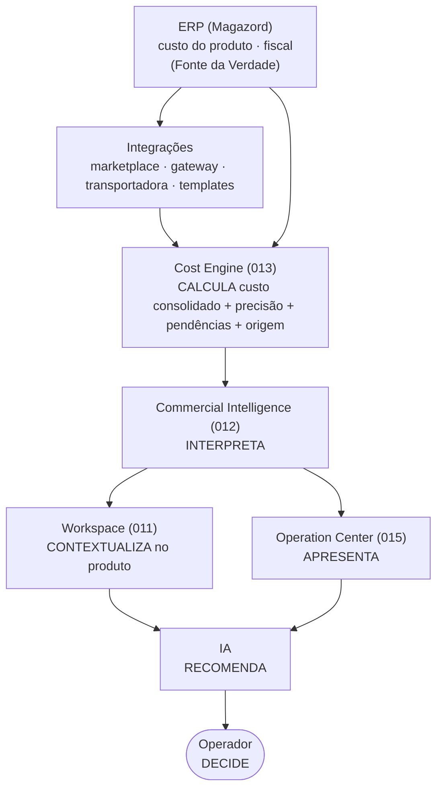

# 013 — Cost Engine (Business Cost Engine)

> **Arquitetura funcional da Zion Platform — Épico 2: Inteligência Comercial.** Define o **Capability independente** que **calcula o custo operacional de comercialização** de um produto em um contexto. É um documento de **arquitetura funcional** — **sem implementação**. Não descreve classes, código, banco, API, interfaces, componentes nem **fórmulas concretas**; descreve **o que o motor calcula**, **de onde vêm os números**, **com que precisão** e **quais princípios** o governam.

> [!important] Registro oficial — as seis responsabilidades que nunca se misturam
> - **O Cost Engine (013) CALCULA** o custo de comercialização.
> - **O [Commercial Intelligence (012)](./012-commercial-intelligence-engine.md) INTERPRETA** esse custo em decisões.
> - **O [Workspace (011)](./011-product-master-workspace.md) CONTEXTUALIZA** tudo dentro de um produto.
> - **O [Operation Center (015)](./015-operation-center.md) APRESENTA** os resultados como trabalho e ação.
> - **A IA RECOMENDA** com base nos números.
> - **O Operador DECIDE** e executa.
>
> Essas responsabilidades **nunca** devem ser misturadas. Este documento cobre **exclusivamente o cálculo**.

> [!important] A pergunta que o Cost Engine responde
> O Cost Engine **nunca** responde apenas *"quanto custa este produto?"*. Ele responde *"quanto custa **operar/comercializar** este produto **neste cenário**"* — em qual canal, com qual frete, gateway, embalagem, imposto, política e data. **Custo é contextual.**

> **Autoridade e escopo.** A Zion **não é um ERP**, **não substitui um sistema financeiro** e **não substitui um software contábil**. O Cost Engine é um **Capability independente** cuja **única** responsabilidade é calcular o custo operacional de comercialização. Em divergência de nomenclatura, **[000 — Business Domain](./000-business-domain.md) prevalece**. Não altera `000`–`012`, o `015` nem o roadmap.

> **Referências:** [000 Business Domain](./000-business-domain.md) · [001 Product Master](./001-product-master.md) · [006 Zion Intake](./006-capability-000-zion-intake.md) · [007 Execution Roadmap](./007-execution-roadmap.md) · [010 Database Compliance](./010-database-compliance.md) · [011 Product Master Workspace](./011-product-master-workspace.md) · [012 Commercial Intelligence Engine](./012-commercial-intelligence-engine.md) · [015 Operation Center](./015-operation-center.md).

---

## 1. Objetivo

O **Cost Engine** é o Capability responsável por **calcular o custo operacional de comercialização** de um produto em um dado contexto. Ele responde:

- Quanto custa **comercializar** este produto **neste contexto operacional**?
- Quais custos são **conhecidos**?
- Quais são **estimados**?
- Quais são **configurados** (por política)?
- Quais ainda estão **ausentes**?
- Qual a **precisão** do cálculo?
- **Quem** forneceu cada custo?
- Qual a **origem** de cada valor?

**Propósito em uma frase:** consolidar todos os custos que incidem sobre a comercialização de um produto — do custo do [ERP](./000-business-domain.md) às taxas de canal, frete, gateway, embalagem, impostos e rateios — em um **custo consolidado por contexto**, sempre acompanhado de **precisão, pendências e origem**.

> [!important] Registro oficial — os limites do Cost Engine
> - **Nunca toma decisões comerciais** (não recomenda preço, não pausa anúncio, não escolhe canal).
> - **Nunca altera dados** (não escreve no ERP, não muda preço).
> - **Nunca substitui o ERP** nem o Financeiro.
> - Ele **calcula e expõe números**; a decisão é do [Commercial Intelligence (012)](./012-commercial-intelligence-engine.md) e do operador.

---

## 2. Filosofia

1. **Custo é contextual.** O mesmo produto tem custos diferentes por canal, frete, embalagem e data. Não existe "o custo"; existe "o custo de operar **neste cenário**".
2. **Custo muda ao longo do tempo.** Custo do ERP muda, taxas mudam, frete muda. O cálculo é uma **fotografia datada**.
3. **Custo pertence à operação.** É um dado operacional que apoia a decisão do dia — não um demonstrativo contábil.
4. **Nunca inventar valores.** Custo desconhecido é **pendência**; custo aproximado é **marcado como estimado**.
5. **Sempre informar a origem.** Todo componente aponta de onde veio (ver [§10](#10-origem-dos-custos)).
6. **Cálculo auditável.** Toda consolidação registra entradas, origens, precisão e data.
7. **Cálculo reproduzível.** Com as mesmas entradas e a mesma política, o resultado é o mesmo — é possível **refazer** e chegar ao mesmo número.
8. **Transparência total.** O consolidado nunca é uma "caixa-preta": o operador vê **de que camadas e origens** o custo é feito.

---

## 3. Arquitetura Conceitual

O Cost Engine fica **entre** as fontes de custo e a interpretação comercial. Ele lê custos brutos + política, consolida e **entrega números** — nunca decisões.

Leitura da cadeia: **ERP → Integrações → Cost Engine → Commercial Intelligence → Workspace → Operation Center → IA → Operador**. O Cost Engine é a **primeira** etapa numérica; tudo à sua direita **lê** o que ele produziu, até a **decisão humana**.

---

## 4. Fontes da Verdade

Todo número que o Cost Engine consolida vem de uma **fonte** com responsabilidade clara. O motor **lê**; nunca é dono do dado original.

| Fonte | Do que é dona | Responsabilidade |
|-------|---------------|------------------|
| **ERP ([Magazord](./000-business-domain.md))** | Custo do produto, dados fiscais. | Fonte da Verdade do custo de aquisição/fabricação. |
| **Marketplace** | Comissões, tarifas por canal. | Fonte das taxas do canal. |
| **Gateway** | Taxas de pagamento, antecipação. | Fonte das taxas financeiras. |
| **Transportadora** | Custo/subsídio de frete. | Fonte do custo logístico. |
| **Operador** | Custos informados manualmente. | Fonte de valores conhecidos não integrados. |
| **Templates** | Custos padrão reutilizáveis. | Fonte de padrões pré-configurados. |
| **Integrações** | Custos vindos de sistemas externos. | Fonte automatizada. |
| **IA** | Sugestões de valores ausentes. | Fonte de **sugestão** (nunca de verdade), sempre confirmada por humano. |
| **Estimativas** | Aproximações quando nada mais existe. | Fonte explicitamente marcada como **estimada**. |

> [!important] Hierarquia de confiança
> Fonte **integrada/medida** (ERP, gateway, transportadora, integrações) > **informada por operador** > **template** > **sugestão de IA (confirmada)** > **estimativa**. Quanto mais abaixo, menor a **precisão** (ver [§9](#9-precisão-do-cálculo)).

---

## 5. Camadas de Custo

O Cost Engine separa o custo em **camadas** rastreáveis e incorporáveis **quando existirem**. Nenhuma é obrigatória; sem dado, vira **pendência** (nunca zero silencioso). **Sem fórmulas** — apenas o significado de cada camada.

| Camada | O que abrange |
|--------|---------------|
| **Custo ERP** | Custo de aquisição/fabricação (Fonte da Verdade: [ERP](./000-business-domain.md)). |
| **Custos Marketplace** | Comissões e tarifas do canal de venda. |
| **Custos Financeiros** | Gateway, antecipação, taxas bancárias. |
| **Custos Tributários** | Impostos de referência incidentes na venda (do ERP). |
| **Custos Logísticos** | Frete, subsídio, logística reversa. |
| **Custos Operacionais** | Manuseio, separação, operação diária do produto. |
| **Custos Administrativos** | Rateio de estrutura ([Centro de Custos](#7-centro-de-custos)). |
| **Custos Comerciais** | Comissões de venda, cashback, fidelidade, incentivos comerciais. |
| **Custos de Marketing** | Ads, mídia, promoções. |
| **Custos de Embalagem** | Caixa, plástico, preenchimento, etiqueta. |
| **Custos Documentais** | NF-e, NFC-e, emissão fiscal. |
| **Custos Variáveis** | Custos que variam por unidade/venda. |
| **Custos Fixos** | Custos independentes do volume (rateados por período). |

Princípio: as camadas são **aditivas e transparentes** — o consolidado mostra **de que é feito**, nunca um número opaco.

---

## 6. Política de Custos

Formaliza-se oficialmente a **Política de Custos**: **cada empresa decide quais custos participam do cálculo**. O Cost Engine **executa** a política; **nunca a define**.

Exemplos de itens que a política liga/desliga e configura:

| Item | Exemplo de decisão do cliente |
|------|-------------------------------|
| **Embalagem** | "Incluir R$ padrão por pedido." |
| **Comissão** | "Incluir a comissão do canal." |
| **Gateway** | "Incluir a taxa do meio de pagamento." |
| **Ads** | "Incluir/ratear o investimento em mídia." |
| **Frete** | "Incluir o custo de frete não subsidiado." |
| **Seguro** | "Incluir seguro de envio." |
| **Rateio** | "Ratear custos fixos por faturamento." |
| **Equipe / Energia / Internet / Sistema** | "Incluir via [Centro de Custos](#7-centro-de-custos)." |
| **Impostos de referência** | "Incluir a carga tributária de referência do ERP." |

> [!important] Executa a política, nunca a define
> A Política de Custos é **configuração do cliente** (Equipe/Cliente). O Cost Engine apenas **obedece**: liga os custos habilitados, aplica os rateios configurados e ignora os desabilitados — sempre registrando **qual política** produziu **qual resultado** (reprodutibilidade). Mudança de política é rastreável e **não altera** cálculos passados retroativamente sem registro.

---

## 7. Centro de Custos

Formaliza-se o conceito de **Centro de Custos**: agrupamentos de custos **fixos/estruturais** do cliente que **não pertencem a um produto específico**, mas podem ser **rateados** sobre a operação.

Exemplos:

| Centro de Custos | Natureza |
|------------------|----------|
| **Equipe** | Custo de pessoas. |
| **Aluguel** | Estrutura física. |
| **Internet** | Estrutura. |
| **Sistema** | Ferramentas/software. |
| **Energia** | Estrutura física. |
| **Contabilidade** | Serviço recorrente. |
| **Licenças** | Software/certificações. |
| **Serviços** | Terceiros recorrentes. |

Princípio: um Centro de Custos **poderá ser rateado** sobre produtos/vendas conforme uma estratégia configurável (ver [§8](#8-rateios)). O rateio é **opcional e explícito**; sem configuração, esses custos **não entram** por produto (e isso é **pendência**, não zero).

---

## 8. Rateios

O **Rateio** é o conceito de **distribuir** um custo não diretamente atribuível a um produto (tipicamente um [Centro de Custos](#7-centro-de-custos) ou custo fixo) sobre produtos/vendas.

> [!important] Conceito, nunca fórmula
> Este documento **não implementa nenhuma fórmula de rateio**. Registra apenas que **diferentes estratégias poderão existir**:

| Estratégia | Distribui o custo… |
|-----------|--------------------|
| **por pedido** | igualmente entre pedidos. |
| **por faturamento** | proporcional à receita. |
| **por quantidade** | proporcional a itens vendidos. |
| **por categoria** | conforme a categoria do produto. |
| **por canal** | conforme o canal de venda. |
| **por marketplace** | conforme o marketplace. |

Princípios do rateio: **explícito** (o operador sabe que é rateado e por qual estratégia), **auditável** (fica registrado na origem do custo) e **opcional** (sem configuração, não há rateio inventado).

---

## 9. Precisão do Cálculo

Cria-se oficialmente o conceito de **Precisão do Cálculo**: a **confiança** no custo consolidado, derivada da **qualidade das informações disponíveis**.

**Comportamento:**
- Mais custo de fontes **integradas/medidas** → **maior** precisão.
- Mais dependência de **estimativas** ou camadas **ausentes** → **menor** precisão.
- Camada **pendente** rebaixa a precisão e aparece como pendência explícita.

**Exemplos (ilustrativos, sem fórmula):**

| Situação | Precisão | Leitura |
|----------|:-------:|---------|
| ERP + comissão + gateway + frete, todos integrados | 🟢 Alta | "Custo confiável para decidir preço." |
| ERP integrado, embalagem estimada, frete por template | 🟡 Média | "Bom, com ressalvas." |
| ERP ausente e várias camadas estimadas | 🔴 Baixa | "Não decidir preço; preencher pendências." |

> [!important] Nunca inventar custos ausentes
> Quando faltar informação, o motor **registra pendência** (`cost.missing_input`) e **rebaixa a precisão**. Ele **jamais** preenche um número inventado só para "fechar a conta". Precisão nunca é maquiada.

---

## 10. Origem dos Custos

**Princípio oficial: todo custo obrigatoriamente possui origem.** Nenhum componente entra no consolidado sem declarar de onde veio.

| Origem | Significado |
|--------|-------------|
| **ERP** | Medido no [Magazord](./000-business-domain.md). |
| **Marketplace** | Taxa/comissão do canal. |
| **Gateway** | Taxa de pagamento/antecipação. |
| **Operador** | Informado manualmente por um humano. |
| **IA** | Sugerido pela IA e **confirmado** por humano. |
| **Template** | Padrão pré-configurado. |
| **Estimativa** | Aproximação explicitamente marcada. |
| **Integração** | Vindo de sistema externo conectado. |

Princípio: a origem viaja **junto** do valor até a apresentação ([011](./011-product-master-workspace.md)/[012](./012-commercial-intelligence-engine.md)); o operador sempre pode abrir "de onde vem este número".

---

## 11. Custos Inteligentes

A [IA](./006-capability-000-zion-intake.md) pode **sugerir** valores para acelerar o preenchimento — sempre como **sugestão**, nunca como verdade automática.

A IA poderá sugerir:
- **Embalagem padrão** (por tipo/tamanho do produto).
- **Custo médio** (por produtos semelhantes do cliente).
- **Rateios** (propor estratégia de distribuição).
- **Valores ausentes** (apontar o que provavelmente falta).
- **Centros de Custos** (sugerir estrutura de custos fixos).

> [!important] Sugerir, nunca preencher automaticamente
> A IA **nunca** grava um custo por conta própria. Toda sugestão **exige confirmação do operador**; ao ser aceita, o custo passa a ter origem **IA (confirmada)**. Sugestão não confirmada **não entra** no consolidado — permanece como pendência.

---

## 12. Simulações

Cria-se oficialmente o conceito de **Simulação**: um cálculo **hipotético e isolado** que responde "e se…?" **sem alterar nenhum dado real**.

Exemplos:

| Simulação | Pergunta |
|-----------|----------|
| **Preço** | E se o preço aumentar? |
| **Custo** | E se o custo mudar? |
| **Canal** | E se trocar de marketplace? |
| **Fornecedor** | E se mudar o fornecedor? |
| **Embalagem** | E se alterar a embalagem? |
| **Ads** | E se o investimento em Ads dobrar? |

> [!important] Simulação nunca altera dados reais
> Toda simulação é **isolada**: roda sobre uma cópia hipotética das entradas, produz um resultado marcado como **simulado** e **não escreve** no custo real, no preço, no ERP nem em lugar algum. Serve para **decidir**, não para efetivar. A efetivação (se houver) é uma **ação separada do operador**.

---

## 13. Entradas

Tudo que o Cost Engine **consome** para calcular:

| Entrada | O que fornece |
|---------|---------------|
| **[Produto Mestre](./001-product-master.md)** | Identidade, categoria, atributos (peso/dimensão). |
| **ERP** | Custo do produto, dados fiscais. |
| **Pedidos** | Vendas reais (contexto de canal/frete). |
| **Marketplace** | Comissões/tarifas do canal. |
| **Gateway** | Taxas financeiras. |
| **Transportadora** | Custo de frete. |
| **Ads** | Investimento em mídia por produto/canal. |
| **Centro de Custos** | Custos fixos/estruturais para rateio. |
| **Operador** | Custos informados manualmente. |
| **Templates** | Custos padrão reutilizáveis. |

---

## 14. Saídas

Tudo que o Cost Engine **produz** — números e metadados, nunca decisões:

| Saída | O que é |
|-------|---------|
| **Custo Consolidado** | O custo total de comercializar o produto **no contexto**, por camada. |
| **Precisão** | A confiança do cálculo ([§9](#9-precisão-do-cálculo)). |
| **Pendências** | O que falta informar para elevar a precisão. |
| **Custos Ausentes** | As camadas sem dado (explícitas, não zeradas em silêncio). |
| **Origem dos Custos** | A fonte de cada componente ([§10](#10-origem-dos-custos)). |
| **Indicadores** | Componentes numéricos que o [Commercial Intelligence (012)](./012-commercial-intelligence-engine.md) interpreta. |
| **Eventos** | Sinais para o resto da plataforma ([§15](#15-eventos)). |
| **Simulações** | Resultados hipotéticos, marcados como simulados ([§12](#12-simulações)). |

Princípio: a saída é **transparente** — sempre acompanha precisão, pendências e origem.

---

## 15. Eventos

O Cost Engine participa do [Event Bus](./004-event-bus.md).

**Eventos consumidos:**

| Origem | Exemplos |
|--------|----------|
| **ERP** | `erp.custo.mudou`, `erp.produto.propagado` |
| **Marketplace** | mudança de comissão/tarifa, `marketplace.listing.estado` |
| **Pedidos** | `venda.recebida` |
| **Gateway** | mudança de taxa/antecipação |
| **Transportadora** | mudança de tabela de frete |

**Eventos produzidos:**

| Evento | Significado |
|--------|-------------|
| `cost.calculated` | Um custo consolidado foi calculado para um produto/contexto. |
| `cost.updated` | Um custo consolidado mudou (nova fonte, novo valor). |
| `cost.source_changed` | A origem de um componente de custo mudou. |
| `cost.missing_input` | Falta uma entrada; há pendência que rebaixa a precisão. |
| `cost.precision_changed` | A precisão do cálculo mudou de faixa. |

Princípio: o [Commercial Intelligence (012)](./012-commercial-intelligence-engine.md) **consome** esses eventos; todos são **auditáveis** e **sem segredo** ([008](./008-architecture-compliance.md)).

---

## 16. Integrações

O Cost Engine **alimenta com números** as demais capacidades — e **nunca toma decisões** por elas:

| Consumidor | O que recebe |
|-----------|--------------|
| **[Commercial Intelligence (012)](./012-commercial-intelligence-engine.md)** | Custo + precisão + origem → vira margem/recomendação. |
| **[Workspace (011)](./011-product-master-workspace.md)** | Custo por produto → seções Inteligência/Saúde Comercial. |
| **[Operation Center (015)](./015-operation-center.md)** | Sinais de custo → filas/alertas/Missões. |
| **Analytics** | Custo histórico → relatórios/tendências. |
| **IA** | Base numérica para sugestões e consultoria. |
| **[Missões](./015-operation-center.md)** | `cost.missing_input` → Missão "informar custo de {produto}". |

> [!important] Fornece número, não veredito
> Em todas as integrações, o Cost Engine entrega **valor + precisão + origem**. A **decisão** é sempre de outra camada (Commercial Intelligence interpreta, IA recomenda, operador decide).

---

## 17. Custos normalmente esquecidos

O grande valor do Cost Engine é **não deixar custo de fora**. Estes custos somem das contas informais e corroem a margem em silêncio. A Zion deve **permitir incorporá-los ao cálculo quando existirem** (e sinalizá-los como pendência quando faltarem, conforme a [Política de Custos](#6-política-de-custos)):

| Custo esquecido | Por que importa |
|-----------------|-----------------|
| **NF-e** | Emissão de nota fiscal eletrônica. |
| **NFC-e** | Nota fiscal de consumidor. |
| **Etiquetas** | Impressão/logística de etiqueta. |
| **Embalagens** | Caixa, plástico, preenchimento. |
| **Brindes** | Itens agregados à venda. |
| **Avarias** | Produto danificado. |
| **Trocas** | Custo logístico/operacional de troca. |
| **Garantias** | Cobertura pós-venda. |
| **Reembalagens** | Reprocessamento de embalagem. |
| **Antecipação** | Custo de antecipar recebíveis. |
| **Gateway** | Taxa de meio de pagamento. |
| **Ads** | Mídia paga por produto/canal. |
| **Comissões** | Comissões de canal/vendedor. |
| **Cashback** | Devolução de valor ao comprador. |
| **Programas de fidelidade** | Pontos/benefícios recorrentes. |

> [!important] Incorporar quando existir, sinalizar quando faltar
> Nenhum desses custos é obrigatório, mas **todos são incorporáveis**. Quando informados/integrados, entram no consolidado (com origem e precisão); quando ausentes no contexto, são omitidos; quando **deveriam existir mas faltam**, viram **pendência** (`cost.missing_input`) — nunca são tratados como zero em silêncio.

---

## 18. Princípios

Princípios **oficiais** do Cost Engine:

1. **Todo custo possui origem.**
2. **Todo cálculo é auditável.**
3. **Todo cálculo é reproduzível** (mesmas entradas + mesma política → mesmo resultado).
4. **Nunca inventar valores.**
5. **Nunca sobrescrever o ERP.**
6. **Sempre informar a precisão.**
7. **Sempre informar as pendências.**
8. **Toda alteração deve ser rastreável.**
9. **Toda simulação é isolada** (nunca altera dados reais).
10. **Calcular, nunca decidir** (decisão é de outra camada).

---

## 19. Critérios de Aceite

O Cost Engine está conforme esta visão quando **todos** os critérios abaixo são verdadeiros:

- [ ] **Capability independente que só calcula:** produz números (custo/precisão/pendências/origem) e nunca recomenda/decide/executa ações comerciais.
- [ ] **Separação das 6 responsabilidades:** calcular (013), interpretar (012), contextualizar (011), apresentar (015), recomendar (IA), decidir (operador) — nunca se misturam.
- [ ] **Custo contextual:** responde "quanto custa operar este produto neste cenário", nunca só "quanto custa o produto".
- [ ] **Toda origem declarada:** todo componente aponta sua fonte; nenhum valor sem origem.
- [ ] **Nunca inventa:** custo desconhecido é pendência; estimado é marcado; a precisão nunca é maquiada.
- [ ] **Nunca sobrescreve o ERP:** custo/fiscal do ERP são somente leitura.
- [ ] **Camadas transparentes:** as 13 camadas são rastreáveis; custos ausentes aparecem explícitos.
- [ ] **Política de Custos respeitada:** a empresa decide o que participa; o motor executa, nunca define; a política usada é registrada (reprodutibilidade).
- [ ] **Centro de Custos e Rateios como conceito:** existem, são opcionais, explícitos e sem fórmula.
- [ ] **Precisão sempre presente:** todo consolidado vem com confiança e pendências.
- [ ] **Simulações isoladas:** cálculos "e se…?" nunca alteram dados reais; resultado marcado como simulado.
- [ ] **Custos esquecidos incorporáveis:** NF-e, etiquetas, embalagens, avarias, trocas, gateway, Ads, comissões, cashback, fidelidade etc. entram quando existirem.
- [ ] **IA sugere, humano confirma:** nenhum custo é preenchido automaticamente pela IA.
- [ ] **Eventos corretos:** consome ERP/Marketplace/Pedidos/Gateway/Transportadora e produz `cost.calculated`, `cost.updated`, `cost.source_changed`, `cost.missing_input`, `cost.precision_changed`.
- [ ] **Alimenta sem decidir:** entrega número+precisão+origem ao 012/011/015/Analytics/IA/Missões.
- [ ] **Reprodutível e auditável:** o mesmo cálculo pode ser refeito e chega ao mesmo resultado; toda alteração é rastreável.
- [ ] **Multiempresa seguro:** todo cálculo é escopado por tenant ([RLS deny-by-default](./010-database-compliance.md)).

---

> **Status:** `013` — Cost Engine **v1.0 (arquitetura funcional)**. Documento **sem implementação e sem fórmulas concretas**. **Calcula** o custo que o [Commercial Intelligence (012)](./012-commercial-intelligence-engine.md) **interpreta**, o [Workspace (011)](./011-product-master-workspace.md) **contextualiza**, o [Operation Center (015)](./015-operation-center.md) **apresenta**, a **IA recomenda** e o **operador decide**. Alterações de escopo versionam este documento (v1.1, v2.0…) e nunca contrariam a fronteira de Fonte da Verdade de [000](./000-business-domain.md). **Próximo documento sugerido:** `014 — Operational Maturity Engine`.
