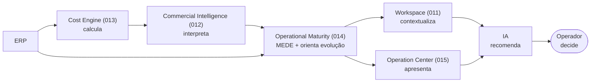

# 014 — Operational Maturity Engine

> **Arquitetura funcional da Zion Platform — Épico 2: Inteligência Comercial (fechamento).** Define o Capability que **mede a qualidade operacional** de uma empresa e **conduz a sua evolução**. É um documento de **arquitetura funcional** — **sem implementação**. Não descreve classes, código, banco, API, interfaces, componentes nem fórmulas; descreve **o que o motor mede**, **como orienta a evolução** e **quais princípios** o governam.

> [!important] Registro oficial — as sete responsabilidades que nunca se misturam
> - **O [Cost Engine (013)](./013-cost-engine.md) CALCULA** o custo.
> - **O [Commercial Intelligence (012)](./012-commercial-intelligence-engine.md) INTERPRETA** o custo em decisões.
> - **O Operational Maturity Engine (014) MEDE** a qualidade operacional e orienta a evolução.
> - **O [Workspace (011)](./011-product-master-workspace.md) CONTEXTUALIZA** dentro de um produto.
> - **O [Operation Center (015)](./015-operation-center.md) APRESENTA** o trabalho e a ação.
> - **A IA RECOMENDA** com base nas medições.
> - **O Operador DECIDE** e executa.
>
> Essas responsabilidades **nunca** devem ser misturadas. Este documento cobre **exclusivamente a medição e a orientação da evolução**.

> [!important] O que o Operational Maturity Engine faz e não faz
> **Faz:** medir · avaliar · identificar lacunas · definir prioridades · **calcular os Health Scores** · **consolidar a Precisão** · criar Missões de evolução · orientar o próximo passo. **Não faz:** nunca calcula custos (é do [013](./013-cost-engine.md)), nunca interpreta margem (é do [012](./012-commercial-intelligence-engine.md)), nunca altera dados. Ele **mede a qualidade operacional e recomenda os próximos passos** — nada além.

> **Autoridade e escopo.** Em divergência de nomenclatura, **[000 — Business Domain](./000-business-domain.md) prevalece**. Este documento **assume oficialmente** a titularidade do modelo de Health Score e da consolidação de Precisão — fechando as lacunas R3/R4 da [Architecture Review 013a](./013a-architecture-review-epic2.md). Não altera `000`–`013`, o `015` nem o roadmap.

> **Referências:** [000 Business Domain](./000-business-domain.md) · [001 Product Master](./001-product-master.md) · [011 Product Master Workspace](./011-product-master-workspace.md) · [012 Commercial Intelligence Engine](./012-commercial-intelligence-engine.md) · [013 Cost Engine](./013-cost-engine.md) · [013a Architecture Review Épico 2](./013a-architecture-review-epic2.md) · [015 Operation Center](./015-operation-center.md).

---

## 1. Objetivo

O **Operational Maturity Engine** é o Capability responsável por **medir a maturidade operacional** de uma empresa e **conduzir a sua evolução**. Ele não mede apenas — ele **guia** o próximo passo.

**Propósito em uma frase:** transformar tudo que a plataforma sabe sobre a operação (produtos, ERP, marketplaces, custos, IA, automações, equipe) em uma **medida de maturidade por dimensão** e em um **caminho de evolução** — priorizado, explicável e sempre acionável via [Missões](./015-operation-center.md).

**Ele responde:**
- Quão **madura** está minha operação, por dimensão?
- Onde estão as **lacunas** que mais limitam meus resultados?
- Qual é o **próximo passo** de maior impacto?
- Quanto eu **ganho** ao dar esse passo?

> [!important] Registro oficial — os limites do Operational Maturity Engine
> - **Nunca calcula custos** — consome o custo/precisão do [Cost Engine (013)](./013-cost-engine.md).
> - **Nunca interpreta indicadores comerciais** — consome as leituras do [Commercial Intelligence (012)](./012-commercial-intelligence-engine.md).
> - **Nunca altera dados** — mede, pontua e recomenda; a mudança é ação do operador.
> - **Mede a qualidade operacional e recomenda os próximos passos.**

---

## 2. Filosofia

1. **Evolução contínua.** Maturidade não é um selo, é um **movimento**. O motor sempre aponta o próximo passo.
2. **Melhoria incremental.** Ganhos pequenos e frequentes valem mais que grandes reformas — cada Missão é um degrau.
3. **Operação guiada.** A empresa é **conduzida**, não deixada sozinha diante de menus.
4. **Nenhuma configuração é obrigatória.** A operação funciona no dia 1; configurar é **evoluir**, não pré-requisito.
5. **Valor imediato.** Cada recomendação vem com o **ganho esperado** — o operador vê por que vale a pena.
6. **Maturidade baseada em evidências.** A pontuação vem de **fatos** (eventos, dados reais, precisão), nunca de opinião ou checklist decorado.
7. **Recomendações explicáveis.** Toda recomendação diz **por quê**, **quanto ganha** e **de onde veio a medição**.

---

## 3. Arquitetura Conceitual

O Operational Maturity fica **depois** da interpretação comercial e **antes** da apresentação — ele **mede** o estado consolidado e devolve **evolução**.

Leitura da cadeia: **ERP → Cost Engine → Commercial Intelligence → Operational Maturity → Workspace → Operation Center → IA → Operador**. O motor **lê** os números já calculados/interpretados, **mede** a maturidade e **entrega** evolução às camadas de apresentação e à decisão humana.

---

## 4. Operational DNA

Cria-se oficialmente o conceito de **Operational DNA**: **toda empresa possui um DNA operacional** — uma assinatura de **níveis por dimensão** que descreve *como* aquela operação está estruturada. Duas empresas com o mesmo faturamento podem ter DNAs muito diferentes.

Dimensões do DNA (cada uma com **nível próprio**):

| Dimensão | O que descreve |
|----------|----------------|
| **Produtos** | Completude e qualidade do catálogo. |
| **ERP** | Integração e sincronização com o [Magazord](./000-business-domain.md). |
| **Marketplaces** | Presença e saúde dos canais. |
| **Custos** | Completude e precisão dos custos ([013](./013-cost-engine.md)). |
| **IA** | Uso do enriquecimento e da consultoria. |
| **Analytics** | Cobertura de dados de desempenho. |
| **Automações** | Grau de automação dos fluxos. |
| **Equipe** | Capacidade e vazão operacional. |
| **Processos** | Maturidade dos fluxos de trabalho. |

> [!note] DNA, não nota única
> O Operational DNA **não** é um número só. É o **perfil** de níveis — o que permite dizer "esta empresa é forte em Produtos e ERP, mas fraca em Custos e Automações" e **orientar exatamente onde evoluir**.

---

## 5. Health Scores

O Operational Maturity Engine é, oficialmente, o **dono do modelo de Health Score** — fechando a lacuna apontada na [Review 013a](./013a-architecture-review-epic2.md) (Health do Produto e da Operação não tinham dono de cálculo).

| Health | Responsabilidade | Quem **calcula** | Quem **apresenta** | Quem **consome** | Quem **depende** |
|--------|------------------|------------------|--------------------|-------------------|-------------------|
| **Health do Produto** | Completude/prontidão do produto. | **Operational Maturity (014)** | Workspace ([011](./011-product-master-workspace.md)) | Operador, Missões | Publicação, evolução do catálogo |
| **Health Comercial** | Rentabilidade/competitividade. | **Operational Maturity (014)**, usando as leituras do [012](./012-commercial-intelligence-engine.md) | Workspace / Operation Center | Operador, Missões | Precisão de Custos ([013](./013-cost-engine.md)) |
| **Health da Operação** | Saúde geral da operação. | **Operational Maturity (014)** | Operation Center ([015](./015-operation-center.md)) | Gestor, Missões | Todas as dimensões do DNA |

> [!important] Um modelo, três instâncias
> O modelo de Health Score é **único** (mesmas faixas 0–100, mesma regra "dimensão fraca → ação"); as três instâncias diferem apenas no **escopo**. O **cálculo** dos três é do 014. As telas ([011](./011-product-master-workspace.md)/[015](./015-operation-center.md)) **apenas apresentam** — nenhuma tela calcula (respeitando "apresentação ≠ cálculo"). O Health Comercial **interpreta** insumos do [012](./012-commercial-intelligence-engine.md); o 014 não recalcula margem, apenas a **pontua** como saúde.

---

## 6. Precisão

O Operational Maturity **consolida** o conceito de [Precisão](./013-cost-engine.md) para além do custo — a Precisão passa a ser um atributo de **qualquer** medição.

| Precisão | O que mede | Origem |
|----------|------------|--------|
| **Precisão do Produto** | Confiança de que os dados do produto estão completos/corretos. | Completude do [Produto Mestre](./001-product-master.md). |
| **Precisão dos Custos** | Confiança do custo consolidado. | **[Cost Engine (013)](./013-cost-engine.md)** (dono). |
| **Precisão Comercial** | Confiança das leituras comerciais (dependem do custo). | Deriva da Precisão dos Custos + dados de venda. |
| **Precisão da Operação** | Confiança do retrato geral da operação. | Agregação de todas as precisões acima. |

**Relação entre elas (encadeamento):** a **Precisão dos Custos** limita a **Precisão Comercial** (não se confia na margem se o custo é frágil), e ambas, com a **Precisão do Produto**, compõem a **Precisão da Operação**. Baixa precisão em uma camada **rebaixa** as que dependem dela.

> [!important] Maturidade honesta
> Uma operação só é "madura" se seus números são **confiáveis**. O 014 trata Precisão como **insumo de maturidade**: dados de alta precisão elevam a maturidade; pendências e estimativas a rebaixam. Nunca se maquia precisão para inflar maturidade.

---

## 7. Maturidade

Níveis **oficiais** de maturidade operacional. Uma empresa (ou uma dimensão) está em um nível; o motor orienta o **avanço** para o próximo.

| Nível | Nome | Descrição |
|:----:|------|-----------|
| 1 | **Inicial** | Operação existe, mas dados incompletos, custos ausentes, pouca integração. Muitas pendências. |
| 2 | **Operacional** | O básico funciona: ERP conectado, produtos publicando, vendas entrando. |
| 3 | **Organizada** | Custos configurados, políticas definidas, catálogo enriquecido, precisão média/alta. |
| 4 | **Otimizada** | Decisões guiadas por margem/competitividade; ajustes de preço e canal informados. |
| 5 | **Inteligente** | IA em uso pleno (enriquecimento + consultoria), recomendações incorporadas ao fluxo. |
| 6 | **Autônoma** | Automações conduzem a operação; humano supervisiona exceções e decisões estratégicas. |

> [!note] Nível por dimensão, não só global
> Cada **dimensão do DNA** ([§4](#4-operational-dna)) tem seu próprio nível. Uma empresa pode ser "Inteligente" em Produtos e "Inicial" em Custos. O nível global é uma **leitura consolidada**, mas a ação acontece **por dimensão**.

---

## 8. Dimensões da Maturidade

As dimensões sobre as quais a maturidade é medida (alinhadas ao Operational DNA):

| Dimensão | Maturidade mede |
|----------|-----------------|
| **Produtos** | Catálogo completo, enriquecido, com boa Precisão do Produto. |
| **ERP** | Integração real, estoque/custo sincronizados, divergências baixas. |
| **Marketplaces** | Canais ativos, anúncios saudáveis, poucos problemas. |
| **Custos** | Política de custos configurada, alta Precisão dos Custos. |
| **Analytics** | Dados de desempenho cobrindo vendas/custos. |
| **IA** | Enriquecimento e consultoria em uso. |
| **Equipe** | Filas com responsáveis, vazão saudável. |
| **Automações** | Fluxos automatizados (publicação, sincronização, reprocessamento). |
| **Operação** | Fluidez ponta a ponta (catálogo → publicação → venda → reconciliação). |

---

## 9. Missões

O Operational Maturity usa a **[Missão](./015-operation-center.md)** como **mecanismo oficial de evolução**: cada lacuna de maturidade vira uma Missão priorizada no [Centro de Operações](./015-operation-center.md).

Cada Missão de evolução possui:

| Campo | Significado |
|-------|-------------|
| **Impacto** | Quanto a maturidade/resultado melhora ao concluí-la. |
| **Tempo estimado** | Esforço para executar. |
| **Ganho esperado** | O delta concreto (ex.: "+7% de maturidade", "+R$ de margem confiável"). |
| **Dependências** | O que precisa estar pronto antes. |
| **Categoria** | Dimensão do DNA afetada (Custos, ERP, IA…). |
| **Responsável** | Quem executa (sugerido). |

> [!note] Evolução é trabalho, não relatório
> O 014 **não** entrega um PDF de diagnóstico — ele **cria Missões**. A empresa evolui **fazendo** o próximo passo, no mesmo cockpit onde já opera ([015](./015-operation-center.md)).

---

## 10. Roadmap Inteligente

O motor monta **automaticamente o próximo passo da empresa** — um **Roadmap Inteligente**, dinâmico e personalizado.

- **Nunca usa checklist fixo.** Não existe "lista de 20 passos igual para todos".
- **Sempre baseado na maturidade atual.** O próximo passo é o de **maior impacto** para *esta* operação, *neste* nível.
- **Recalcula ao evoluir.** Concluída uma Missão, o roadmap se atualiza — o próximo degrau muda.
- **Prioriza por impacto × esforço.** Ganho grande e barato vem primeiro.

> [!important] Dinâmico, não prescritivo
> Duas empresas nunca recebem o mesmo roadmap. O caminho emerge do **Operational DNA** + **precisão** + **lacunas** — não de um roteiro pré-fabricado.

---

## 11. Recomendações

O motor produz recomendações de **evolução** (distintas das recomendações **comerciais** do [012](./012-commercial-intelligence-engine.md), que são sobre preço/canal). Exemplos:

| Recomendação | Dimensão | Ganho típico |
|--------------|----------|--------------|
| **Conectar ERP** | ERP | Estoque/custo reais → precisão sobe. |
| **Cadastrar política** | Custos | Cálculo de custo passa a incluir o que importa. |
| **Configurar embalagem** | Custos | Fecha uma camada de custo esquecida. |
| **Executar IA** | Produtos/IA | Catálogo enriquecido, conteúdo mais forte. |
| **Criar anúncios** | Marketplaces | Produtos prontos passam a vender. |
| **Melhorar SEO** | Produtos | Mais visibilidade/conversão. |
| **Automatizar fluxo** | Automações | Menos trabalho manual, mais vazão. |

Princípio: toda recomendação vira **Missão** com **ganho esperado** e **justificativa**.

---

## 12. Capability Graph

Cria-se oficialmente o conceito de **Capability Graph**: um **mapa das Capabilities** da operação, cada uma com **seu próprio nível de maturidade**, e as **dependências** entre elas.

| Capability | Nível (exemplo) |
|-----------|-----------------|
| **Produto Mestre** | Organizada |
| **ERP** | Operacional |
| **Marketplace** | Otimizada |
| **Custos** | Inicial |
| **Analytics** | Inicial |
| **IA** | Organizada |
| **Automações** | Operacional |

> [!note] O grafo revela o gargalo
> O Capability Graph mostra **onde a corrente é mais fraca**. Se "Custos" está em *Inicial*, toda decisão de margem sofre — o motor prioriza evoluir Custos antes de otimizar preço. As dependências entre Capabilities (ex.: margem confiável **depende** de Custos maduros) guiam a ordem da evolução.

---

## 13. Operational Health

Descrição **conceitual** de como a saúde da operação é medida — **sem fórmulas**, apenas o modelo.

O modelo, em conceito:
1. **Cada dimensão** ([§8](#8-dimensões-da-maturidade)) recebe uma leitura de saúde a partir de **evidências** (eventos, completude, precisão, problemas).
2. **A precisão pondera** a leitura — uma dimensão com dados frágeis não pode reportar saúde alta com confiança.
3. **As dimensões compõem** o Operational Health consolidado, preservando a visão **por dimensão** (nunca só um número).
4. **Toda dimensão fraca é acionável** — leva a uma Missão de evolução (regra de ouro herdada de [015](./015-operation-center.md)).

> [!important] Sem fórmula neste documento
> O **como** exato de ponderar/agregar é responsabilidade interna do motor, fora do escopo desta arquitetura funcional. Aqui registra-se o **modelo**: evidências → leitura por dimensão → ponderação por precisão → consolidação acionável.

---

## 14. Eventos

O Operational Maturity participa do [Event Bus](./004-event-bus.md).

**Eventos consumidos:**

| Família | Exemplos |
|---------|----------|
| `cost.*` | `cost.calculated`, `cost.precision_changed`, `cost.missing_input` |
| `commercial.*` | `commercial.margin_changed`, `commercial.health_changed` |
| `produto.*` | `produto_mestre.criado`, `produto_mestre.atualizado` |
| `marketplace.*` | `marketplace.listing.estado`, `venda.recebida` |
| `erp.*` | `erp.estoque.mudou`, `erp.custo.mudou` |

**Eventos produzidos:**

| Evento | Significado |
|--------|-------------|
| `maturity.score_changed` | Um Health Score mudou. |
| `maturity.health_changed` | A saúde de uma dimensão/operação mudou. |
| `maturity.mission_created` | Uma Missão de evolução foi criada. |
| `maturity.level_changed` | O nível de maturidade (global ou de dimensão) mudou. |
| `maturity.recommendation_created` | Uma recomendação de evolução foi gerada. |

Princípio: todo evento é **auditável** e **sem segredo** ([008](./008-architecture-compliance.md)/[004](./004-event-bus.md)).

---

## 15. Integrações

O motor **alimenta** as demais capacidades — e **nunca altera diretamente** nenhum outro módulo:

| Consumidor | O que recebe |
|-----------|--------------|
| **[Workspace (011)](./011-product-master-workspace.md)** | Health do Produto + precisão → seção de saúde do produto. |
| **[Operation Center (015)](./015-operation-center.md)** | Health da Operação + Missões de evolução → Dashboard/Filas. |
| **Analytics** | Histórico de maturidade/health → tendências. |
| **IA** | Base de medição para recomendar evolução. |
| **Workflow Engine** | Gatilhos de evolução → automações (quando o cliente autoriza). |

> [!important] Mede e sinaliza, nunca escreve no outro
> O 014 **entrega medições e Missões**; ele **não** publica anúncio, não muda custo, não altera produto. Cada módulo age por conta própria a partir do sinal — a mudança real é sempre de quem é dono do dado (e, no fim, do operador).

---

## 16. Princípios

Princípios **oficiais** do Operational Maturity Engine:

1. **Toda evolução deve ser mensurável.** Sem métrica, não é evolução.
2. **Toda recomendação deve ser explicável.** Sempre há um "por quê" e um "quanto ganha".
3. **Toda maturidade deve ser baseada em evidências.** Fatos e precisão, nunca opinião ou checklist.
4. **Toda melhoria deve gerar valor.** Cada Missão traz ganho esperado.
5. **Nenhuma configuração é obrigatória.** A operação funciona no dia 1; evoluir é escolha guiada.
6. **Mede, nunca calcula custo nem interpreta margem.** Consome 013 e 012; não os refaz.
7. **Nunca altera dados.** Mede, pontua, recomenda — a mudança é de outra camada.
8. **Precisão pondera maturidade.** Número frágil não vira maturidade alta.

---

## 17. Critérios de Aceite

O Operational Maturity Engine está conforme esta visão quando **todos** os critérios abaixo são verdadeiros:

- [ ] **Mede, não calcula nem interpreta:** consome custo (013) e leituras comerciais (012); nunca recalcula custo nem margem.
- [ ] **Separação das 7 responsabilidades:** calcular (013), interpretar (012), medir (014), contextualizar (011), apresentar (015), recomendar (IA), decidir (operador) — nunca se misturam.
- [ ] **Dono do modelo de Health Score:** o 014 calcula os três Health Scores; as telas apenas apresentam (nenhuma tela calcula).
- [ ] **Operational DNA:** a maturidade é um **perfil por dimensão**, não um número único.
- [ ] **Precisão consolidada:** Produto/Custos/Comercial/Operação encadeadas; baixa precisão rebaixa as dependentes; nunca maquiada.
- [ ] **Níveis de maturidade oficiais:** Inicial → Operacional → Organizada → Otimizada → Inteligente → Autônoma, por dimensão e global.
- [ ] **Missões como mecanismo de evolução:** cada lacuna vira Missão com impacto, tempo, ganho esperado, dependências, categoria e responsável.
- [ ] **Roadmap Inteligente:** próximo passo dinâmico, baseado na maturidade atual, sem checklist fixo; recalcula ao evoluir.
- [ ] **Capability Graph:** cada Capability tem nível e dependências; o gargalo é priorizado.
- [ ] **Operational Health conceitual:** modelo de evidências → leitura por dimensão → ponderação por precisão → consolidação acionável, sem fórmula no documento.
- [ ] **Eventos corretos:** consome `cost.*`/`commercial.*`/`produto.*`/`marketplace.*`/`erp.*` e produz `maturity.score_changed`, `maturity.health_changed`, `maturity.mission_created`, `maturity.level_changed`, `maturity.recommendation_created`.
- [ ] **Alimenta sem alterar:** entrega medições/Missões ao 011/015/Analytics/IA/Workflow Engine; nunca escreve no domínio de outro módulo.
- [ ] **Valor imediato e config opcional:** opera sem configuração; cada recomendação traz ganho esperado.
- [ ] **Multiempresa seguro:** toda medição é escopada por tenant ([RLS deny-by-default](./010-database-compliance.md)).

---

## Seção especial — Evolução Guiada

O produto do Operational Maturity é a **Evolução Guiada**: a empresa vê **onde está**, **onde pode chegar** e **o que fazer para chegar lá**, com ganho estimado.

**Exemplo de painel de Evolução Guiada:**

> **Sua maturidade hoje: 63%.**
> Para chegar a **72%**, recomendamos:
>
> | Próximo passo | Dimensão | Ganho estimado | Esforço |
> |---------------|----------|:--------------:|:-------:|
> | Cadastrar embalagem | Custos | +3% | ~15 min |
> | Conectar gateway | Custos | +2% | ~20 min |
> | Configurar política comercial | Custos/Comercial | +2% | ~30 min |
> | Executar IA em 120 produtos | Produtos/IA | +2% | ~1 h (fila) |
>
> **Impacto esperado:** maturidade 63% → **72%**; Precisão dos Custos de 🟡 média → 🟢 alta; margem passa a ser confiável para decisão de preço.

Princípios da Evolução Guiada:
- **Sempre mostra o ganho** (nunca "faça isto" sem "para quê").
- **Cada passo é uma Missão** clicável no [Centro de Operações](./015-operation-center.md).
- **O alvo é realista** (próximo degrau, não a perfeição).

---

## Seção especial — Capability Evolution

Cada **Capability evolui independentemente** — a operação não precisa amadurecer tudo de uma vez. O motor acompanha e orienta cada uma no seu ritmo:

| Capability | Como evolui (Inicial → … → Autônoma) |
|-----------|--------------------------------------|
| **Produto Mestre** | Dados incompletos → catálogo enriquecido → conteúdo otimizado por IA → melhoria contínua automática. |
| **ERP** | Sem integração → conectado → sincronizado em tempo real → reconciliação automática. |
| **Marketplace** | Sem canais → 1 canal → multicanal saudável → publicação/ajuste automáticos. |
| **Custos** | Só custo do produto → política + camadas → alta precisão → custo sempre atualizado. |
| **Analytics** | Sem dados → cobertura básica → tendências → insight preditivo. |
| **IA** | Não usada → enriquecimento → consultoria → copiloto pleno. |
| **Automações** | Tudo manual → fluxos-chave automatizados → operação majoritariamente automática → autônoma com exceções. |

> [!important] Evolução por peça, visão do todo
> O [Capability Graph](#12-capability-graph) mostra os níveis lado a lado; a **Capability Evolution** descreve o **caminho** de cada uma. Juntos, permitem evoluir a peça que mais destrava a operação **primeiro** — sem esperar o resto.

---

> **Status:** `014` — Operational Maturity Engine **v1.0 (arquitetura funcional)**. Documento **sem implementação e sem fórmulas**. **Mede** a qualidade operacional e conduz a evolução; é o **dono oficial** do modelo de Health Score e da consolidação de Precisão (fecha R3/R4 da [Review 013a](./013a-architecture-review-epic2.md)). **Calcula** custo é do [013](./013-cost-engine.md); **interpretar** margem é do [012](./012-commercial-intelligence-engine.md); **apresentar** é do [015](./015-operation-center.md); **contextualizar** é do [011](./011-product-master-workspace.md); **recomendar** é da IA; **decidir** é do operador. Alterações de escopo versionam este documento (v1.1, v2.0…) e nunca contrariam a fronteira de Fonte da Verdade de [000](./000-business-domain.md). **Próximo documento sugerido:** `016 — Implantation Journey` (a jornada de implantação de um novo cliente: como sair do nível *Inicial* até *Operacional/Organizada*, usando o Roadmap Inteligente e a Evolução Guiada deste motor como trilho de onboarding).
