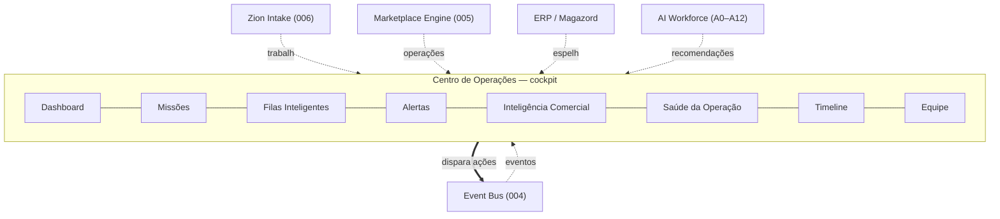
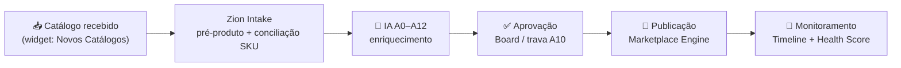
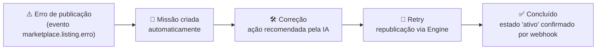

# 015 — Centro de Operações (Operation Center)

> **Visão de Produto da Zion Platform.** Define a **experiência principal** da plataforma: o ambiente onde toda a operação diária acontece. É um documento de **produto e UX** — **sem implementação**. Não descreve telas em pixel, componentes, banco, API ou código; descreve **o que a experiência deve fazer**, **por quê** e **quais princípios** a governam.

> **Autoridade e escopo.** Este documento **não altera** os documentos `000`–`010` nem os conceitos planejados `011`–`014`. Ele os **consome**. Em divergência de nomenclatura, **[000 — Business Domain](./000-business-domain.md) prevalece**. Em divergência de escopo técnico, prevalece o documento da capability correspondente. O Centro de Operações é a **camada humana** sobre a maquinaria assíncrona já definida ([Event Bus](./004-event-bus.md), [Marketplace Engine](./005-marketplace-engine.md), [Zion Intake](./006-capability-000-zion-intake.md)).

> **Referências:** [000 Business Domain](./000-business-domain.md) · [001 Product Master](./001-product-master.md) · [003 Connector SDK](./003-connector-sdk.md) · [006 Zion Intake](./006-capability-000-zion-intake.md) · [007 Execution Roadmap](./007-execution-roadmap.md) · [008 Architecture Compliance](./008-architecture-compliance.md) · [010 Database Compliance](./010-database-compliance.md), e toda a arquitetura construída até o **PR-007** (Fundação).

---

## 1. Objetivo

O **Centro de Operações** é o **ambiente principal da Zion Platform**. Fica registrado oficialmente aqui: **toda utilização diária da plataforma começa e termina no Centro de Operações.**

Ele **não é um Dashboard**. Um dashboard mostra números; o Centro de Operações mostra **trabalho** e **conduz à ação**. É o **cockpit operacional** da empresa — o lugar de onde a Equipe (operadores da agência) e o Cliente (empresa-cliente, via Portal) enxergam o estado real da operação, decidem o que fazer a seguir e executam, sem sair do ambiente.

**Propósito em uma frase:** transformar o fluxo assíncrono da plataforma (catálogos chegando, IA enriquecendo, produtos aguardando aprovação, anúncios publicando, pedidos entrando, custos mudando) em uma **sequência clara de ações priorizadas** que qualquer operador consegue conduzir do início ao fim.

**O que o Centro de Operações é:**
- O **ponto de entrada** da operação diária (o operador abre a Zion e cai aqui).
- O **ponto de saída** (ao fim do dia, o que ficou pendente está visível e priorizado aqui).
- A **fonte única de "o que precisa da minha atenção agora"**.

**O que ele não é:**
- Não é um relatório (relatórios são consequência, não o centro).
- Não é uma tela de configuração.
- Não é um lugar de "olhar gráficos" — é um lugar de **agir**.

> [!important] Registro oficial
> O Centro de Operações é declarado o **ambiente primário** da Zion Platform. Todo novo recurso operacional deve responder à pergunta: **"como isso aparece e se resolve no Centro de Operações?"**

---

## 2. Filosofia

O Centro de Operações segue uma filosofia operacional explícita. Estes princípios governam **toda** decisão de produto sobre ele:

1. **Mostrar trabalho, não números.** A tela abre exibindo *o que há para fazer*, não indicadores decorativos. Um número só existe se levar a uma ação.
2. **Mostrar ações, sempre.** Cada elemento visível responde "qual é o próximo passo?". Nada é um beco sem saída.
3. **Reduzir a tomada de decisão.** A plataforma **pré-decide** o máximo possível (prioridade, ordem, responsável sugerido, ação recomendada). O operador **confirma**, não calcula.
4. **IA como copiloto, nunca escondida.** A [IA](./006-capability-000-zion-intake.md) (Workforce A0–A12) está presente e **recomenda ações** o tempo todo — de forma visível, explicável e sempre subordinada à aprovação humana ([trava A10](./006-capability-000-zion-intake.md)).
5. **Organização por Filas.** O trabalho homogêneo é agrupado em **Filas Inteligentes** (catálogos, IA, aprovação, publicação, problemas, pedidos, inteligência comercial).
6. **Organização por Missões.** O trabalho com objetivo e fim claros vira **Missão** — a unidade que substitui a lista de tarefas tradicional.
7. **Foco operacional.** Tudo o que não gera ação é secundário. Complexidade fica escondida; o essencial fica na frente.
8. **Respeito à Fonte da Verdade ([000](./000-business-domain.md)).** O Centro apenas **apresenta e dispara**; ele nunca inventa dado de que não é dono (estoque/custo são do [ERP](./000-business-domain.md); estado do anúncio é do Marketplace).
9. **Multiempresa por padrão.** Tudo é escopado por `organizacao_id`/`cliente_id` ([RLS deny-by-default](./010-database-compliance.md)); um operador só vê o trabalho do tenant a que tem acesso.

---

## 3. Estrutura Geral

O Centro de Operações é composto por **módulos**. Cada módulo tem uma responsabilidade única e todos convergem para a mesma pergunta: *"o que precisa de ação agora?"*.

| Módulo | Responsabilidade | Origem dos dados |
|--------|------------------|------------------|
| **Dashboard** | A visão de abertura: o trabalho do dia, priorizado. | Agregação de Filas + Missões + Timeline |
| **Missões** | Unidades de trabalho com objetivo e fim; substituem tarefas. | Geradas por eventos ([Event Bus](./004-event-bus.md)) |
| **Filas** | Trabalho homogêneo agrupado (catálogos, IA, aprovação…). | [Zion Intake](./006-capability-000-zion-intake.md), IA, [Marketplace Engine](./005-marketplace-engine.md) |
| **Alertas** | O que está fora do esperado e exige atenção. | Eventos de erro/divergência/limite |
| **Inteligência Comercial** | Margem, prejuízo, oportunidades, mudanças de custo. | Commercial Intelligence Engine *(012, planejado)* |
| **Saúde da Operação** | O **Health Score** e suas dimensões. | Agregação transversal |
| **Timeline** | O histórico vivo de tudo que aconteceu na operação. | [Event Bus](./004-event-bus.md) / Auditoria |
| **Equipe** | Quem está fazendo o quê; carga e responsáveis. | Missões + Filas por responsável |
| **Widgets** | Blocos configuráveis que cada empresa organiza. | Qualquer módulo |
| **Atalhos** | Acesso rápido às ações mais frequentes. | Configurável |
| **Notificações** | O canal de "algo mudou e talvez exija você". | [Event Bus](./004-event-bus.md) |

---

## 4. Dashboard

O Dashboard é a **tela de abertura**. Ele responde, em segundos: *"o que aconteceu, o que está pendente e o que devo fazer primeiro?"*.

Ele é composto por **widgets de trabalho**. Exemplos de widgets padrão:

| Widget | O que mostra | Ação que dispara |
|--------|--------------|------------------|
| **Novos Catálogos** | Catálogos recebidos aguardando processamento. | "Iniciar Intake" → [Zion Intake](./006-capability-000-zion-intake.md) |
| **IA** | Produtos na esteira de enriquecimento e o que ela recomenda. | "Revisar recomendações" / "Aprovar em massa" |
| **Aguardando Aprovação** | Produtos enriquecidos parados na [trava A10](./006-capability-000-zion-intake.md). | "Aprovar / Editar / Rejeitar" |
| **Publicações** | Itens na fila de publicação e seus estados. | "Publicar" / "Ver falha" |
| **Problemas** | Erros de canal, divergências ERP↔Zion, dead-letter. | "Abrir Missão de correção" |
| **Pedidos** | Vendas recebidas que exigem ação (estoque, fiscal). | "Reconciliar" / "Ver pedido" |
| **Abaixo da Margem** | Produtos vendendo abaixo do piso de margem. | "Revisar preço" |
| **Saúde Operacional** | O Health Score consolidado. | "Ver dimensão fraca" |

> [!important] Regra de ouro do Dashboard — **nunca mostrar indicador sem ação**
> Todo widget **precisa levar a uma atividade**. Um número que não leva a lugar nenhum é proibido. Se um dado não pode gerar ação, ele não pertence ao Dashboard (pertence, no máximo, a um relatório).

Princípios do Dashboard:
- **Priorizado, não cronológico.** O que tem maior impacto/urgência aparece primeiro (ver [§6](#6-filas-inteligentes)).
- **Vazio é bom.** Quando não há trabalho pendente, o Dashboard diz "operação em dia" — não inventa ruído.
- **Um clique até a ação.** Do widget para a execução, o caminho é o mais curto possível (ver [§13](#13-princípios-de-ux)).

---

## 5. Missões

A **Missão** é a unidade central de trabalho do Centro de Operações. Ela **substitui a lista de tarefas tradicional**: em vez de "to-dos" soltos e manuais, a plataforma gera Missões a partir do que **realmente aconteceu** na operação.

**Definição.** Uma Missão é uma unidade de trabalho com **objetivo claro, começo, fim e critério de conclusão**, associada a um ou mais fatos operacionais.

**Como surgem.** Missões nascem de **eventos** ([Event Bus](./004-event-bus.md)) — nunca de digitação manual como regra (embora o operador possa criar uma Missão avulsa). Exemplos de gatilhos:
- `catalogo.registrado` → Missão *"Processar catálogo de {origem}"*.
- `intake.pre_produto.pronto` → Missão *"Revisar e aprovar {n} produtos enriquecidos"*.
- `marketplace.listing.erro` → Missão *"Corrigir publicação de {produto} no {canal}"*.
- Sinal do Commercial Intelligence *(012)* → Missão *"Revisar {n} produtos abaixo da margem"*.
- `erp.custo.mudou` → Missão *"Reavaliar preço de {produto} após mudança de custo"*.

**Como terminam.** Uma Missão tem **critério de conclusão explícito** (ex.: "todos os produtos aprovados ou rejeitados"; "publicação com estado *ativo* confirmado por webhook"). Ela se encerra quando o critério é satisfeito — idealmente confirmado por um **evento de volta** (ex.: `marketplace.listing.estado = ativo`), não por marcação manual otimista.

**Como medem impacto.** Cada Missão carrega uma estimativa de **impacto** (ex.: receita destravada, risco evitado, produtos publicados). Impacto ordena o que importa.

**Como medem prioridade.** Prioridade = combinação de **impacto × urgência × esforço**. A plataforma calcula e o operador vê o resultado, não a fórmula.

**Como estimam tempo.** Cada Missão traz um **tempo estimado** para conclusão (baseado no tipo de trabalho e no volume), para o operador planejar o dia.

**Estados de uma Missão:** `aberta → em andamento → (bloqueada) → concluída` (ou `descartada`, com motivo).

**Anatomia de uma Missão (exemplo):**

| Campo | Exemplo |
|-------|---------|
| Título | Corrigir publicação de "Chinelo Slim" no Mercado Livre |
| Origem | Evento `marketplace.listing.erro` (SIZE_GRID inválido) |
| Objetivo | Publicar o produto com sucesso no canal |
| Impacto | Alto — produto sem anúncio ativo = venda perdida |
| Prioridade | 🔴 Alta |
| Tempo estimado | ~10 min |
| Responsável | Sugerido: operador do cliente Chinelaria |
| Ação recomendada (IA) | "Normalizar os tamanhos e republicar via User Products" |
| Conclusão | `marketplace.listing.estado = ativo` |

> [!note] Missão ≠ tarefa
> A tarefa é digitada por alguém e pode ficar desatualizada. A Missão **reflete a operação real** e se fecha quando a operação real muda. É trabalho **derivado de fato**, não de opinião.

---

## 6. Filas Inteligentes

Enquanto a Missão organiza o trabalho **por objetivo**, a **Fila** organiza o trabalho **por natureza** — agrupando itens homogêneos para execução em lote e com ritmo.

**Filas oficiais:**

| Fila | O que agrupa | Fonte |
|------|--------------|-------|
| **Catálogos** | Lotes recebidos aguardando Intake. | [006 Zion Intake](./006-capability-000-zion-intake.md) |
| **IA** | Produtos na esteira de enriquecimento (A0–A12). | AI Workforce |
| **Aprovação** | Produtos enriquecidos parados na [trava A10](./006-capability-000-zion-intake.md). | Board de qualidade |
| **Publicação** | Operações de publicação/atualização de anúncio. | [005 Marketplace Engine](./005-marketplace-engine.md) |
| **Problemas** | Erros, divergências, dead-letter, retries. | [004 Event Bus](./004-event-bus.md) |
| **Pedidos** | Vendas recebidas exigindo ação. | Webhooks de venda |
| **Inteligência Comercial** | Sinais de margem/custo/oportunidade. | Commercial Intelligence *(012)* |

**Cada item de fila carrega os mesmos atributos** (para que a fila se ordene sozinha e o operador não precise pensar):

| Atributo | Significado |
|----------|-------------|
| **Prioridade** | Posição relativa (calculada por impacto × urgência × esforço). |
| **Impacto** | O que se ganha/evita ao concluir (receita, risco, qualidade). |
| **Urgência** | Quão sensível ao tempo é o item (ex.: overselling iminente). |
| **Tempo estimado** | Quanto tempo para resolver. |
| **Quantidade** | Volume de itens agrupados (ex.: "42 produtos aguardando aprovação"). |
| **Responsável** | Quem está com a fila (ou sugestão de quem deveria). |

Princípios das Filas:
- **Ordenam-se sozinhas** por prioridade — o topo é sempre "o que fazer agora".
- **Permitem ação em lote** (aprovar 42 de uma vez, republicar 10 de uma vez), respeitando as travas de qualidade.
- **São escopadas por tenant** ([RLS](./010-database-compliance.md)).
- **Nunca escondem o total** — se há limite/corte (top-N), isso é dito explicitamente.

---

## 7. Inteligência Comercial

O Centro de Operações **apresenta** inteligência comercial — ele **não calcula**. Todo cálculo é responsabilidade do futuro **Commercial Intelligence Engine** *(012, planejado)* e do **Cost Engine** *(013, planejado)*. Aqui, apenas **exibição e disparo de ação**.

O que este módulo apresenta:

| Sinal | O que mostra | Ação |
|-------|--------------|------|
| **Produtos abaixo da margem** | Itens vendendo abaixo do piso definido. | Missão *"Revisar preço"* |
| **Produtos com prejuízo** | Itens com preço de venda < custo ([ERP](./000-business-domain.md)) + taxas. | Missão *"Corrigir precificação"* (urgente) |
| **Oportunidades** | Itens com espaço para subir preço / demanda alta. | Missão *"Avaliar aumento de preço"* |
| **Alterações de custo** | Produtos cujo custo mudou no ERP (`erp.custo.mudou`). | Missão *"Reavaliar margem"* |
| **Alertas** | Rupturas de piso, quedas de margem, distorções. | Alerta + Missão |

> [!important] Fronteira de responsabilidade
> Este módulo é **somente apresentação**. A fonte da verdade do **custo** é o [ERP](./000-business-domain.md); a do **preço de venda** é a Zion (Produto Mestre). Os **cálculos** (margem, piso, prejuízo) vêm do Commercial Intelligence/Cost Engine *(012/013)*. O Centro de Operações nunca recalcula por conta própria — ele **mostra o veredito** e **oferece a ação**.

---

## 8. Saúde Operacional

Formaliza-se o conceito de **Health Score**: uma medida consolidada (0–100) da saúde da operação de um cliente, decomposta em **dimensões**. O Health Score responde: *"a operação está saudável? se não, onde dói?"*.

**Dimensões oficiais:**

| Dimensão | Mede | Exemplo de queda |
|----------|------|------------------|
| **Produtos** | Completude/qualidade do catálogo (dados, imagens, atributos). | Muitos produtos com "⚠️ informação necessária". |
| **ERP** | Sincronização com o [Magazord](./000-business-domain.md) (estoque/custo/nota). | Divergências ERP↔Zion não reconciliadas. |
| **Marketplaces** | Saúde dos anúncios (ativos, pausados, reprovados). | Anúncios com erro de publicação acumulando. |
| **IA** | Fluidez da esteira A0–A12 e taxa de aprovação. | Fila de aprovação crescendo sem vazão. |
| **Custos** | Saúde de margem (itens no piso, prejuízo). | % alto de produtos abaixo da margem. |
| **Analytics** | Cobertura de dados de venda/desempenho. | Vendas sem custo preenchido (lucro impreciso). |
| **Automações** | Saúde das filas/worker (lag, dead-letter, retry). | Dead-letter crescente / lag de eventos. |
| **Equipe** | Carga e vazão dos operadores. | Filas sem responsável / sobrecarga. |

**Exemplo de leitura (cliente Chinelaria):**

| Dimensão | Score | Leitura |
|----------|:----:|---------|
| Produtos | 92 | 🟢 Catálogo completo |
| ERP | 78 | 🟡 3 divergências de estoque |
| Marketplaces | 64 | 🟠 8 anúncios com erro de SIZE_GRID |
| IA | 88 | 🟢 Esteira fluindo |
| Custos | 55 | 🔴 12 produtos abaixo da margem |
| Automações | 95 | 🟢 Sem dead-letter |
| **Consolidado** | **77** | 🟡 Atenção em Marketplaces e Custos |

Princípios do Health Score:
- **Cada dimensão fraca é clicável** e leva à Fila/Missão que a resolve — saúde ruim **sempre** aponta para a ação corretiva.
- **Nunca é um número decorativo** (respeita a regra de ouro do [§4](#4-dashboard)).
- **Escopado por cliente**; a Equipe pode ver o consolidado de vários clientes da Organização.

---

## 9. Timeline

A **Timeline** é o histórico vivo da operação — o registro cronológico de **tudo que aconteceu**, alimentado pelo [Event Bus](./004-event-bus.md) e pela auditoria. Serve para responder *"o que aconteceu com este produto/cliente/operação?"* sem sair do cockpit.

**Eventos operacionais registrados (exemplos):**

| Evento | Exemplo |
|--------|---------|
| Catálogo recebido | "Catálogo Excel (312 SKUs) recebido de {origem}" |
| Intake iniciado | "Intake iniciado para o lote {id}" |
| Intake concluído | "312 pré-produtos criados, 298 conciliados por SKU" |
| IA iniciada | "Enriquecimento A0–A12 iniciado (298 produtos)" |
| IA concluída | "Enriquecimento concluído; 12 com pendência (⚠️)" |
| Aprovação | "Operador aprovou 286 produtos (Board A10)" |
| Publicação | "42 anúncios publicados no Mercado Livre" |
| Erro | "Falha de SIZE_GRID em {produto}" |
| Retry | "Reprocessamento automático da operação {id}" |
| Atualização ERP | "Estoque espelhado do Magazord (`erp.estoque.mudou`)" |
| Alteração de preço | "Preço de {produto} ajustado após `erp.custo.mudou`" |

Princípios da Timeline:
- **Imutável e auditável** — reflete os eventos reais ([000](./000-business-domain.md)/[004](./004-event-bus.md)); não é editável.
- **Filtrável** por produto, cliente, canal, tipo de evento, período.
- **Correlacionada** — de um evento de erro, o operador salta para a Missão que o corrige.
- **Sem segredo** — nenhum token/credencial aparece na Timeline ([008](./008-architecture-compliance.md)).

---

## 10. Widgets

O Dashboard é **montado por widgets configuráveis**. Cada empresa (e, quando permitido, cada operador) **monta seu próprio painel**, escolhendo quais blocos vê e em que ordem. A Zion entrega um **layout padrão sensato**; a partir dele, cada operação se adapta.

**Exemplos de widgets configuráveis:**
- Novos Catálogos · Fila de IA · Aguardando Aprovação · Publicações em andamento
- Problemas abertos · Pedidos do dia · Produtos abaixo da margem
- Health Score (consolidado ou por dimensão) · Timeline recente
- Missões prioritárias · Carga da Equipe · Atalhos favoritos

Princípios dos Widgets:
- **Todos são configuráveis** (ativar/desativar, reordenar, redimensionar).
- **Todo widget respeita a regra de ouro** — leva a uma ação ([§4](#4-dashboard)).
- **Escopo por tenant** — um widget nunca mostra dado de outro cliente.
- **Padrão útil no dia 1** — a empresa opera sem configurar nada; a configuração é refinamento, não pré-requisito.

---

## 11. IA — Analista Operacional

A [IA](./006-capability-000-zion-intake.md) no Centro de Operações assume o papel de **Analista Operacional**. Ela é **explícita e presente** (nunca escondida), e sua função primária é **recomendar ações** — não apenas responder perguntas.

**Princípio central:** a IA **sempre propõe o próximo passo**. Onde há trabalho, há uma recomendação da IA ao lado, explicável e acionável com um clique — sempre subordinada à aprovação humana ([trava A10](./006-capability-000-zion-intake.md), regra-mãe "nunca inventar dado").

**Exemplos de atuação como Analista Operacional:**
- *"42 produtos estão prontos e sem pendências — recomendo **aprovar em massa**."*
- *"8 anúncios falharam por SIZE_GRID. A causa é tamanho não normalizado — recomendo **normalizar e republicar via User Products**."*
- *"O custo de 5 produtos subiu no ERP; 3 caíram abaixo da margem — recomendo **revisar preço** agora."*
- *"A fila de aprovação cresceu 30% hoje e não tem responsável — recomendo **atribuir à {operador}**."*
- *"O produto {X} tem demanda alta e preço abaixo da mediana do canal — **oportunidade de aumento**."*
- *"3 divergências de estoque ERP↔Zion há 2 dias — recomendo **reconciliar** para evitar overselling."*

**O que a IA nunca faz aqui:**
- Nunca publica/aprova/altera **sem confirmação humana**.
- Nunca **inventa** dado ausente (falta → "⚠️ informação necessária").
- Nunca esconde o raciocínio — toda recomendação é **explicável** ("por que isto?").

> [!note] Copiloto, não piloto automático
> A IA reduz a carga de decisão (ela pré-analisa e recomenda), mas o **comando é humano**. O operador aprova, edita ou rejeita — a IA acelera, não substitui, a responsabilidade.

---

## 12. Centro de Missões

Formaliza-se o **Centro de Missões** como princípio oficial da Zion: **um operador consegue conduzir toda a operação apenas pelas Missões.**

O Centro de Missões é a visão que lista, prioriza e conduz todas as Missões abertas do tenant. É possível operar o dia inteiro sem navegar por menus: **abrir a Missão do topo → executar a ação recomendada → concluir → a próxima já está lá.**

**Por que isto é um princípio, não só uma tela:**
- Garante que **nenhum trabalho relevante fique invisível** (tudo que importa vira Missão).
- Garante um **fluxo linear de produtividade** ("faça o topo da pilha"), eliminando a paralisia de decidir por onde começar.
- Torna a operação **auditável e transferível** — qualquer operador assume o Centro de Missões e sabe exatamente o estado.

> [!important] Registro oficial
> **É princípio da Zion que a operação completa possa ser conduzida exclusivamente pelo Centro de Missões.** Todo recurso operacional novo deve poder se expressar como Missão. Se um trabalho não cabe em uma Missão nem em uma Fila, ele provavelmente não deveria exigir atenção humana.

---

## 13. Princípios de UX

Conjunto **oficial** de princípios de experiência do Centro de Operações. Toda decisão de design deve poder ser justificada por um destes:

1. **Nunca mostrar complexidade.** A maquinaria (filas, eventos, idempotência, retries) fica **escondida**; o operador vê trabalho e ações, não engrenagens.
2. **Sempre indicar o próximo passo.** Nenhuma tela é um beco sem saída — há sempre uma ação sugerida.
3. **Toda informação leva a uma ação.** Regra de ouro (ver [§4](#4-dashboard)): número sem ação não existe.
4. **IA como copiloto.** A recomendação está sempre ao alcance, explicável, subordinada à aprovação humana.
5. **Foco em produtividade.** O sucesso é medido por trabalho concluído, não por telas visitadas.
6. **Reduzir cliques.** Do "ver o problema" ao "resolver o problema", o caminho é o mais curto possível; ação em lote quando fizer sentido.
7. **Reduzir troca de contexto.** O operador resolve dentro do cockpit; não pula entre dez telas nem entre a Zion e ferramentas externas.
8. **Vazio comunica calma.** Sem trabalho pendente, a tela diz "em dia" — não fabrica ruído.
9. **Explicabilidade.** Prioridade, impacto e recomendação sempre podem ser abertos ("por quê?").
10. **Confiança por padrão seguro.** Ações irreversíveis (publicar, rejeitar em massa) pedem confirmação; nada destrutivo acontece por acidente.

---

## 14. Exemplos de Fluxos

### Fluxo A — Chegada de Catálogo até a publicação

**Narrativa operacional:** o operador vê *"312 SKUs em Novos Catálogos"* → clica **Iniciar Intake** → a IA enriquece e recomenda *"aprovar 286, revisar 12"* → o operador **aprova em massa** os prontos e resolve as 12 pendências → a fila de **Publicação** processa os anúncios → a **Timeline** registra cada etapa e o **Health Score** de Marketplaces sobe. Tudo sem sair do cockpit.

### Fluxo B — Problema de Marketplace até a resolução

**Narrativa operacional:** um anúncio falha → o Centro **cria a Missão** *"Corrigir publicação de {produto}"* com impacto **Alto** → a IA recomenda *"normalizar tamanhos e republicar via User Products"* → o operador confirma → o **Engine** reprocessa (Retry) → o webhook confirma *estado ativo* → a Missão **se fecha sozinha**. O operador nunca precisou entender a mecânica da fila.

---

## 15. Critérios de Aceite

O Centro de Operações está conforme esta visão quando **todos** os critérios abaixo são verdadeiros:

- [ ] **Ponto de entrada único:** ao abrir a Zion, a Equipe/Cliente cai no Centro de Operações, vendo o trabalho do dia priorizado.
- [ ] **Regra de ouro respeitada:** nenhum widget/indicador existe sem uma ação associada.
- [ ] **Missões derivadas de fato:** toda Missão nasce de um evento real e tem objetivo, impacto, prioridade, tempo estimado, responsável e critério de conclusão.
- [ ] **Missão fecha por realidade:** o encerramento é confirmado pelo estado real (evento de volta), não por marcação otimista.
- [ ] **Filas completas:** existem as 7 filas oficiais, cada item com prioridade, impacto, urgência, tempo estimado, quantidade e responsável; ordenam-se sozinhas.
- [ ] **Operação só por Missões:** é possível conduzir o dia inteiro exclusivamente pelo Centro de Missões.
- [ ] **IA visível e propositiva:** há recomendação de ação onde há trabalho; a IA nunca age sem confirmação e nunca inventa dado.
- [ ] **Inteligência Comercial só apresenta:** margem/prejuízo/oportunidade/custo aparecem como sinais acionáveis, sem recálculo local.
- [ ] **Health Score acionável:** as 8 dimensões existem e cada dimensão fraca leva à correção.
- [ ] **Timeline fiel:** registra os eventos operacionais, é imutável, filtrável e sem segredos.
- [ ] **Widgets configuráveis:** cada empresa monta seu painel; há um padrão útil no dia 1.
- [ ] **Fronteira de Fonte da Verdade preservada:** o Centro apenas apresenta e dispara; nunca escreve dado de que não é dono ([000](./000-business-domain.md)).
- [ ] **Multiempresa seguro:** todo dado é escopado por tenant ([RLS deny-by-default](./010-database-compliance.md)); nenhum vazamento entre clientes.
- [ ] **UX conforme princípios:** complexidade escondida, próximo passo sempre indicado, poucos cliques, pouca troca de contexto.

---

> **Status:** `015` — Centro de Operações **v1.0 (visão de produto)**. Documento de **produto/UX**, sem implementação. Consome a Fundação (até PR-007) e os engines conceituais `011`–`014`. Alterações de escopo versionam este documento (v1.1, v2.0…) e nunca contrariam a fronteira de Fonte da Verdade de [000](./000-business-domain.md). **Próximo documento sugerido:** `016 — Implantation Journey` (jornada de implantação/onboarding de um novo cliente na operação).
