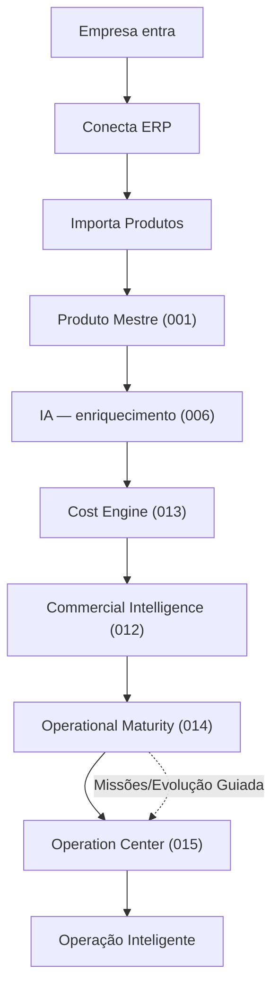

# 016 — Implantation Journey (Business Transformation Journey)

> **Arquitetura funcional da Zion Platform.** Define a **jornada de transformação operacional** de uma empresa dentro da Zion. É um documento de **produto/arquitetura funcional** — **sem implementação**. Não descreve classes, código, banco, API, interfaces nem componentes; descreve **como uma empresa evolui** de uma operação comum para uma **operação inteligente**, e **como a plataforma conduz** essa evolução.

> [!important] Registro oficial — implantação ≠ onboarding
> A implantação da Zion **não é um onboarding**. Onboarding ensina a usar um sistema; a **Business Transformation Journey** transforma uma empresa comum em uma **operação inteligente**. O objetivo nunca é "aprender a plataforma" — é **evoluir a operação**. A jornada é conduzida por **[Missões](./015-operation-center.md)**, **nunca por checklists fixos**, e **cada empresa possui um caminho diferente**.

> [!important] A implantação não termina
> A Business Transformation Journey **acompanha toda a vida da empresa** dentro da plataforma. Existe um marco de "implantada" (operação estável), mas a **evolução é contínua** — a jornada segue medindo, orientando e propondo o próximo passo enquanto a empresa existir na Zion.

> **Autoridade e escopo.** Em divergência de nomenclatura, **[000 — Business Domain](./000-business-domain.md) prevalece**. Esta jornada **não redefine** nenhum Capability; ela os **orquestra** para conduzir a evolução, apoiada no [Operational Maturity Engine (014)](./014-operational-maturity-engine.md) como trilho. Não altera `000`–`015` nem o roadmap.

> **Referências:** [000 Business Domain](./000-business-domain.md) · [001 Product Master](./001-product-master.md) · [006 Zion Intake](./006-capability-000-zion-intake.md) · [011 Product Master Workspace](./011-product-master-workspace.md) · [012 Commercial Intelligence Engine](./012-commercial-intelligence-engine.md) · [013 Cost Engine](./013-cost-engine.md) · [013a Architecture Review Épico 2](./013a-architecture-review-epic2.md) · [014 Operational Maturity Engine](./014-operational-maturity-engine.md) · [015 Operation Center](./015-operation-center.md).

---

## 1. Objetivo

A **Business Transformation Journey** é o processo pelo qual uma empresa **evolui operacionalmente** dentro da Zion — de onde ela entra (qualquer nível de maturidade) até uma **operação inteligente**, e além.

Ela responde:
- Como uma empresa **entra** na Zion?
- Como **conecta** seus sistemas ([ERP](./000-business-domain.md), marketplaces)?
- Como nasce o **primeiro Produto Mestre**?
- Como nasce a **primeira Missão**?
- Como nasce a **primeira publicação**?
- Como nasce a **primeira venda**?
- Como nasce uma **operação madura**?
- Como a Zion **conduz** essa evolução?

> [!important] Registro oficial — a implantação é evolução
> A implantação é um **processo de evolução operacional**, **nunca** um simples onboarding. Ela usa **todos os Capabilities já definidos** ([001](./001-product-master.md)/[006](./006-capability-000-zion-intake.md)/[011](./011-product-master-workspace.md)–[015](./015-operation-center.md)) e é medida pelo [Operational Maturity Engine (014)](./014-operational-maturity-engine.md).

---

## 2. Filosofia

1. **Valor desde o primeiro dia.** A empresa colhe resultado antes de "terminar de configurar" — o primeiro Quick Win vem cedo.
2. **Evolução contínua.** Não há linha de chegada; há sempre um próximo degrau.
3. **Nenhuma configuração é obrigatória.** A operação anda no dia 1; configurar é evoluir, não pré-requisito.
4. **Progresso baseado em evidências.** O avanço é medido por **fatos** (marcos atingidos, health, precisão), nunca por opinião ou checklist decorado.
5. **IA como guia.** O [Zion Coach](#8-zion-coach) conduz a jornada como mentor operacional, não como manual.
6. **Missões como mecanismo oficial.** Toda etapa da implantação é uma [Missão](./015-operation-center.md) priorizada — a empresa evolui **fazendo**.

---

## 3. Arquitetura Conceitual

A jornada **atravessa** todos os Capabilities, do primeiro login à operação inteligente:

Leitura: a empresa **entra**, **conecta** e **importa**; nasce o **Produto Mestre**; a **IA** enriquece; o **Cost Engine** calcula; o **Commercial Intelligence** interpreta; o **Operational Maturity** mede e orienta; o **Operation Center** apresenta o trabalho — e o ciclo repete, subindo a maturidade até a **operação inteligente**.

---

## 4. Diagnóstico Inicial

Ao entrar, a Zion faz um **Diagnóstico Inicial** — entende **quem é** aquela empresa para personalizar a jornada (nunca aplica um roteiro genérico).

| O que a Zion identifica | Como usa |
|-------------------------|----------|
| **Segmento** | Nicho (calçado, vestuário…) → templates e prioridades. |
| **Porte** | Tamanho da operação → ritmo e escala das Missões. |
| **ERP** | Qual ERP e se está conectável → primeiro marco de integração. |
| **Marketplaces** | Canais atuais/desejados → estratégia de publicação. |
| **Catálogo** | Volume e formato dos produtos → plano de ingestão ([006](./006-capability-000-zion-intake.md)). |
| **Equipe** | Quantas pessoas operam → distribuição de Missões. |
| **Nível de maturidade** | O ponto de partida (via [014](./014-operational-maturity-engine.md)). |
| **Integrações** | O que já existe conectável (gateway, transportadora). |
| **Custos** | O que a empresa conhece dos próprios custos. |

O Diagnóstico Inicial alimenta o **Operational DNA Inicial** ([§5](#5-operational-dna-inicial)).

---

## 5. Operational DNA Inicial

Do Diagnóstico nasce o **[Operational DNA](./014-operational-maturity-engine.md) Inicial** — o perfil de níveis por dimensão que descreve **o ponto de partida** da empresa.

- **Dimensões avaliadas** (do [014](./014-operational-maturity-engine.md)): Produtos, ERP, Marketplaces, Custos, Analytics, IA, Equipe, Automações, Operação/Processos.
- **Cada dimensão recebe um nível inicial** (tipicamente *Inicial*/*Operacional* no começo).
- **O DNA influencia a implantação:** a jornada **prioriza a dimensão que mais destrava resultado** — não segue uma ordem fixa. Uma empresa com ERP já conectado pula direto para catálogo; outra sem custos foca em fechá-los.

> [!note] O DNA define o caminho, não um checklist
> Duas empresas nunca recebem a mesma sequência. O DNA Inicial + o Diagnóstico determinam **qual marco vem primeiro** para *aquela* operação.

---

## 6. Marcos da Jornada

Os **Marcos** oficiais da jornada — pontos de virada verificáveis. A **ordem** pode variar por empresa (guiada pelo DNA); os marcos, não.

| Marco | Nome | Significado |
|:----:|------|-------------|
| 1 | **Conta criada** | A empresa entra; Diagnóstico + DNA Inicial. |
| 2 | **ERP conectado** | Estoque/custo reais passam a espelhar ([013](./013-cost-engine.md) ganha insumo). |
| 3 | **Primeiro Catálogo** | Um lote real ingerido ([006](./006-capability-000-zion-intake.md)). |
| 4 | **Primeiro Produto Mestre** | Nasce a Fonte da Verdade de um produto ([001](./001-product-master.md)). |
| 5 | **Primeira IA** | Primeiro enriquecimento (Quick Win de qualidade). |
| 6 | **Primeira Publicação** | Primeiro anúncio no ar ([015](./015-operation-center.md)). |
| 7 | **Primeira Venda** | O ciclo comercial fecha (`venda.recebida`). |
| 8 | **Centro de Operações** | A empresa opera pelo cockpit ([015](./015-operation-center.md)) — Missões/Filas ativas. |
| 9 | **Operação Estável** | Fluxo ponta a ponta consistente; "implantada". |
| 10 | **Operação Inteligente** | Decisões guiadas por margem/maturidade; IA como copiloto pleno. |

> [!note] "Implantada" ≠ fim
> O Marco 9 declara a empresa **implantada**; o Marco 10 e além são **evolução contínua** — a jornada não encerra.

---

## 7. Missões

**Toda a implantação acontece através de [Missões](./015-operation-center.md)** — **nunca por checklist**. Cada passo da jornada é uma Missão priorizada no [Centro de Operações](./015-operation-center.md), gerada pelo [Operational Maturity Engine (014)](./014-operational-maturity-engine.md).

Cada Missão de implantação possui:

| Campo | Exemplo |
|-------|---------|
| **Objetivo** | "Conectar o ERP Magazord." |
| **Impacto** | Alto — destrava estoque/custo reais. |
| **Ganho esperado** | "+ precisão de custos; margem passa a ser confiável." |
| **Dependências** | Conta criada (Marco 1). |
| **Tempo estimado** | ~20 min. |

Princípio: a empresa **não vê um checklist** — vê **a próxima Missão de maior impacto**, com o porquê e o ganho.

---

## 8. Zion Coach

Cria-se oficialmente o conceito de **Zion Coach**: a [IA](./006-capability-000-zion-intake.md) que **acompanha toda a implantação** como **mentor operacional** — não como chatbot.

Exemplos da voz do Zion Coach:
- *"Hoje vamos importar seu primeiro catálogo — é o passo que mais destrava sua operação agora."*
- *"Agora vamos conectar seu ERP, para que estoque e custo sejam os reais."*
- *"Publique seu primeiro produto — ele já está pronto e sem pendências."*
- *"Excelente. Sua operação já possui Health 68% — o próximo passo é configurar seus custos de embalagem."*

Princípios do Zion Coach:
- **Mentor, não chatbot** — conduz proativamente para o próximo passo; não espera perguntas.
- **Contextual** — fala sobre *esta* empresa, *neste* marco, *com este* DNA.
- **Sempre com ganho** — toda orientação diz o "para quê".
- **Subordinado à decisão humana** — orienta e recomenda; quem executa é o operador ([trava A10](./006-capability-000-zion-intake.md), regra "nunca inventar dado").

---

## 9. Evolução Guiada

A jornada usa a **[Evolução Guiada](./014-operational-maturity-engine.md)** do Operational Maturity: a plataforma **cria automaticamente o próximo passo**.

- **Nunca igual para todos** — o próximo passo emerge do DNA + maturidade + lacunas.
- **Sempre baseada na maturidade atual** — o alvo é o **próximo degrau** realista, não a perfeição.
- **Recalcula a cada marco** — concluída uma Missão, o próximo passo muda.

Ver o modelo completo de Evolução Guiada em [014 §Evolução Guiada](./014-operational-maturity-engine.md).

---

## 10. Quick Wins

Formalizam-se os **Quick Wins** — ganhos rápidos e visíveis que provam valor cedo e mantêm o ritmo da jornada:

| Quick Win | Prova de valor |
|-----------|----------------|
| **Primeira IA** | Um produto enriquecido em minutos — qualidade instantânea. |
| **Primeiro anúncio** | Um produto no ar — presença imediata. |
| **Primeira automação** | Um fluxo que roda sozinho — menos trabalho manual. |
| **Primeiro cálculo de margem** | A primeira leitura de lucro real — clareza comercial. |
| **Primeira Missão concluída** | O primeiro degrau de maturidade — sensação de progresso. |

Princípio: os Quick Wins são **priorizados no início** para gerar **valor desde o primeiro dia** (filosofia [§2](#2-filosofia)).

---

## 11. Certificações

Criam-se oficialmente **níveis de evolução** — Certificações que **representam maturidade operacional real**, mapeadas aos níveis do [014](./014-operational-maturity-engine.md). **Nunca gamificação vazia**: só se obtém por **evidência**.

| Certificação | Nível de maturidade ([014](./014-operational-maturity-engine.md)) | Significado |
|--------------|------------------------------------|-------------|
| **Bronze** | Operacional | O básico funciona: ERP conectado, publicando, vendendo. |
| **Prata** | Organizada | Custos configurados, políticas definidas, catálogo enriquecido. |
| **Ouro** | Otimizada | Decisões guiadas por margem/competitividade. |
| **Platina** | Inteligente | IA em uso pleno; recomendações incorporadas ao fluxo. |
| **Elite** | Autônoma | Automações conduzem; humano supervisiona exceções. |

> [!important] Certificação é evidência, não medalha
> Uma Certificação só é concedida quando a **maturidade medida** ([014](./014-operational-maturity-engine.md)) e a **precisão** sustentam o nível. Não há como "comprar" ou "clicar" para subir — sobe-se **evoluindo a operação**.

---

## 12. Health da Implantação

A jornada tem seu próprio painel de acompanhamento — o **Health da Implantação** — que mostra **onde a empresa está** e **o que falta**:

| Dimensão acompanhada | O que mostra |
|----------------------|--------------|
| **Progresso** | % da jornada / marcos atingidos. |
| **Health** | Os Health Scores atuais ([014](./014-operational-maturity-engine.md)): Produto, Comercial, Operação. |
| **Precisão** | A confiança dos números (Custos → Comercial → Operação). |
| **Missões** | Missões de implantação abertas/concluídas. |
| **Marcos** | Quais dos 10 marcos foram cruzados. |
| **Dependências** | O que bloqueia o próximo marco. |

Princípio: o Health da Implantação é **acionável** — cada lacuna leva à Missão que a resolve (regra de ouro de [015](./015-operation-center.md)).

---

## 13. Eventos

A jornada participa do [Event Bus](./004-event-bus.md).

**Eventos consumidos:**

| Família | Uso |
|---------|-----|
| `erp.*` | Detecta conexão/sincronização do ERP (Marco 2). |
| `produto.*` | Detecta primeiro Produto Mestre (Marco 4). |
| `cost.*` | Acompanha completude/precisão de custos. |
| `commercial.*` | Detecta primeira leitura de margem. |
| `maturity.*` | Acompanha níveis, health e Missões de evolução. |

**Eventos produzidos:**

| Evento | Significado |
|--------|-------------|
| `journey.started` | A jornada de uma empresa começou. |
| `journey.milestone_completed` | Um marco foi atingido. |
| `journey.health_changed` | O Health da Implantação mudou. |
| `journey.completed` | A empresa atingiu "implantada" (Marco 9) — a evolução continua. |
| `journey.regression_detected` | Houve regressão (ex.: ERP desconectou, precisão caiu) — gera Missão corretiva. |

Princípio: todo evento é **auditável** e **sem segredo** ([008](./008-architecture-compliance.md)/[004](./004-event-bus.md)).

---

## 14. Integrações

A Jornada **orquestra** (não substitui) os Capabilities, conversando com cada um:

| Capability | Papel na jornada |
|-----------|------------------|
| **[Workspace (011)](./011-product-master-workspace.md)** | Onde nasce e amadurece cada Produto Mestre. |
| **[Operation Center (015)](./015-operation-center.md)** | Onde as Missões de implantação são executadas. |
| **[Commercial Intelligence (012)](./012-commercial-intelligence-engine.md)** | Primeira leitura de margem (Quick Win). |
| **[Cost Engine (013)](./013-cost-engine.md)** | Completude/precisão de custos ao longo da jornada. |
| **[Operational Maturity (014)](./014-operational-maturity-engine.md)** | O **trilho**: mede maturidade e gera as Missões de evolução. |
| **Workflow** | Automações que a empresa liga ao amadurecer. |
| **Analytics** | Histórico da transformação (tendência de maturidade/health). |
| **IA** | O [Zion Coach](#8-zion-coach) que guia tudo. |

> [!important] Orquestra, nunca reescreve
> A Jornada **coordena** os Capabilities e **mede** o progresso; ela **não** calcula custo, não interpreta margem, não publica anúncio por conta própria. Cada Capability faz o seu papel; a Jornada dá o **sentido de evolução**.

---

## 15. Princípios

Princípios **oficiais** da Business Transformation Journey:

1. **Toda empresa evolui em ritmos diferentes.**
2. **Nenhuma implantação é igual.**
3. **Toda recomendação deve gerar valor.**
4. **Toda Missão deve possuir impacto.**
5. **Toda evolução deve ser mensurável.**
6. **Toda implantação deve ser explicável** (o "por quê" de cada passo é sempre visível).
7. **Valor desde o primeiro dia.**
8. **A implantação não termina** — evolui continuamente.

---

## 16. Critérios de Aceite

A Business Transformation Journey está conforme esta visão quando **todos** os critérios abaixo são verdadeiros:

- [ ] **Transformação, não onboarding:** a jornada evolui a operação, não ensina telas.
- [ ] **Baseada em Missões:** toda etapa é uma Missão priorizada; **nunca** um checklist fixo.
- [ ] **Caminho personalizado:** Diagnóstico Inicial + Operational DNA definem a ordem; duas empresas não recebem a mesma sequência.
- [ ] **Marcos oficiais:** os 10 marcos existem e são detectados por evidência (eventos), não por marcação manual.
- [ ] **Zion Coach como mentor:** a IA conduz proativamente com ganho e contexto; nunca é um chatbot passivo.
- [ ] **Evolução Guiada:** o próximo passo é dinâmico, baseado na maturidade, recalculado a cada marco ([014](./014-operational-maturity-engine.md)).
- [ ] **Quick Wins cedo:** valor visível desde os primeiros dias.
- [ ] **Certificações por evidência:** Bronze→Elite refletem maturidade real ([014](./014-operational-maturity-engine.md)); nunca gamificação vazia.
- [ ] **Health da Implantação acionável:** progresso/health/precisão/missões/marcos/dependências, com cada lacuna levando a ação.
- [ ] **Eventos corretos:** consome `erp.*`/`produto.*`/`cost.*`/`commercial.*`/`maturity.*` e produz `journey.started`, `journey.milestone_completed`, `journey.health_changed`, `journey.completed`, `journey.regression_detected`.
- [ ] **Orquestra sem reescrever:** coordena os Capabilities e mede; nunca calcula/interpreta/publica por conta própria.
- [ ] **Regressão tratada:** queda (ERP off, precisão caiu) gera Missão corretiva (`journey.regression_detected`).
- [ ] **Nunca termina:** após "implantada", a jornada segue medindo e orientando a evolução.
- [ ] **Multiempresa seguro:** cada jornada é escopada por tenant ([RLS deny-by-default](./010-database-compliance.md)).

---

## Seção especial — A Jornada do Alex (Chinelaria)

Exemplo real da evolução de um cliente: **Alex**, operador da **Chinelaria Leilane Neves**. Mostra como **cada Capability participa** da transformação.

| Dia | Marco | O que acontece | Capabilities em ação |
|:---:|-------|----------------|----------------------|
| **1** | Conecta ERP | Alex conecta o Magazord; estoque/custo reais começam a espelhar. Diagnóstico + DNA Inicial (tudo *Inicial*, ERP *Operacional*). | [ERP](./000-business-domain.md), [014](./014-operational-maturity-engine.md), [013](./013-cost-engine.md) |
| **2** | Importa catálogo | Sobe a planilha da Chinelaria; centenas de pré-produtos conciliados por SKU. | [006 Intake](./006-capability-000-zion-intake.md) |
| **3** | Primeiro Produto Mestre | Um chinelo vira Produto Mestre canônico, com variantes de tamanho. | [001](./001-product-master.md), [011 Workspace](./011-product-master-workspace.md) |
| **5** | Primeira publicação | O Zion Coach diz "publique este — está pronto". Primeiro anúncio no Mercado Livre. **Quick Win.** | [015](./015-operation-center.md), Marketplace |
| **10** | Primeiras Missões | O Centro de Operações mostra Missões: "aprovar 42 produtos", "corrigir 8 com SIZE_GRID". Alex opera pelo cockpit. | [015](./015-operation-center.md), [014](./014-operational-maturity-engine.md) |
| **20** | Primeira melhoria de margem | Cost Engine calcula custo real; Commercial Intelligence aponta 5 chinelos abaixo do piso. Alex ajusta preço. **Health Comercial sobe.** | [013](./013-cost-engine.md), [012](./012-commercial-intelligence-engine.md) |
| **45** | Operação organizada | Custos configurados, política definida, catálogo enriquecido por IA. **Certificação Prata.** | [013](./013-cost-engine.md), [012](./012-commercial-intelligence-engine.md), IA |
| **90** | Operação inteligente | Decisões guiadas por maturidade; IA como copiloto; automações rodando. **Rumo a Ouro/Platina.** | [014](./014-operational-maturity-engine.md), todos |

> [!note] Cada dia, um degrau
> Alex nunca viu um "checklist de implantação". Ele viu, a cada dia, **a próxima Missão de maior impacto** — e a operação da Chinelaria evoluiu de *Inicial* a *inteligente* fazendo o próximo passo.

---

## Seção especial — Primeiros 90 Dias

Visão **executiva** da transformação — não uma lista de funcionalidades, mas a **evolução operacional** da empresa.

| Fase | Janela | Estado operacional | Resultado de negócio |
|------|:------:|--------------------|----------------------|
| **Ativação** | Dias 1–7 | ERP conectado, catálogo importado, primeiros produtos e a primeira publicação. | A empresa **sai do papel/planilha** e passa a ter uma Fonte da Verdade digital. Primeiros Quick Wins. |
| **Operação** | Dias 8–30 | Publicações em escala, primeiras vendas, operação pelo Centro de Operações via Missões. | A empresa **vende com consistência** e **enxerga o trabalho** priorizado. **Bronze.** |
| **Organização** | Dias 31–60 | Custos configurados, margem confiável, catálogo enriquecido por IA, políticas definidas. | A empresa **para de vender no escuro**: sabe o lucro real e corrige prejuízos. **Prata.** |
| **Inteligência** | Dias 61–90 | Decisões guiadas por maturidade/margem, automações ativas, IA como copiloto. | A empresa **opera com inteligência**: prioriza o que dá resultado e automatiza o repetitivo. **Rumo a Ouro.** |

> [!important] O que muda em 90 dias
> Não é "a empresa aprendeu um software". É "a empresa **trocou de patamar operacional**": de reativa e cega em margem para **guiada por evidências**, com custos confiáveis, catálogo forte e decisões apoiadas por IA. E, no dia 91, a jornada **continua** — o próximo degrau já está proposto.

---

> **Status:** `016` — Implantation Journey **v1.0 (arquitetura funcional)**. Documento **sem implementação**. Orquestra todos os Capabilities e usa o [Operational Maturity Engine (014)](./014-operational-maturity-engine.md) como **trilho** da evolução; conduzida pelo **Zion Coach** (IA) e executada por **Missões** no [Operation Center (015)](./015-operation-center.md). A jornada **não termina** — acompanha toda a vida da empresa na plataforma. Alterações de escopo versionam este documento (v1.1, v2.0…) e nunca contrariam a fronteira de Fonte da Verdade de [000](./000-business-domain.md). **Próximo documento sugerido:** `017 — AI Operating System` (a camada em que a IA deixa de ser um recurso e passa a ser o **sistema operacional** da Zion: como o Zion Coach, os agentes A0–A12 e a consultoria comercial se unificam em uma inteligência que permeia toda a plataforma — governança, limites, autonomia supervisionada e a fronteira entre recomendar e executar).
