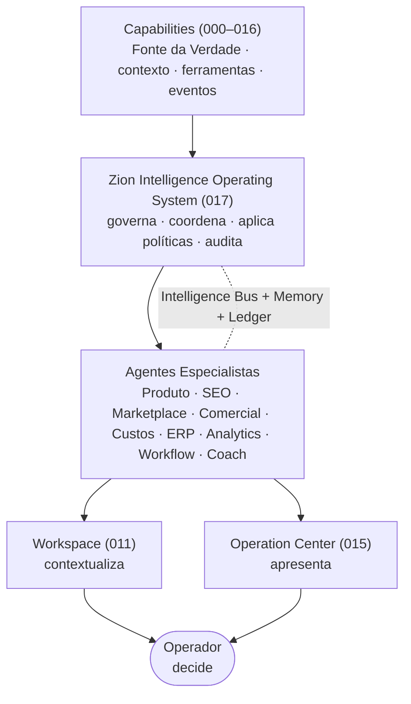
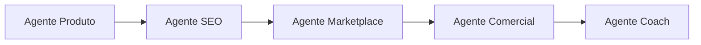

# 017 — Zion Intelligence Operating System (ZIOS)

> **Arquitetura funcional da Zion Platform.** Define o **Sistema Operacional de Inteligência** da Zion: a camada que **governa e coordena toda a inteligência** da plataforma. É um documento de **arquitetura funcional** — **sem implementação**. Não descreve classes, código, banco, API, interfaces nem componentes; descreve **como a Zion pensa**, **como coordena seus agentes** e **quais princípios** governam a autonomia da IA.

> [!important] Registro oficial — uma única inteligência
> - **A inteligência da Zion é única.** Para o usuário, existe **apenas uma** inteligência: *a Zion*. Ele nunca percebe agentes diferentes.
> - **Os agentes são especializados.** Por trás da inteligência única há agentes-especialistas que **compartilham contexto, regras, políticas, memória** e produzem **eventos auditáveis**.
> - **Os Capabilities permanecem como Fonte da Verdade.** A IA **nunca substitui o domínio** ([000](./000-business-domain.md)–[016](./016-implantation-journey.md)); ela o **consome**.
> - **A IA nunca substitui o Operador.** Ela **amplia** a capacidade operacional da empresa — não a comanda.

> [!important] A IA não é um chatbot
> A IA da Zion **não é um chatbot** e **não é um recurso isolado**. É um **Sistema Operacional de Inteligência** (ZIOS) que permeia toda a plataforma. O ZIOS **não substitui os Capabilities** e **não substitui o Operador** — ele **orquestra a inteligência** que atua sobre eles.

> **Autoridade e escopo.** Em divergência de nomenclatura, **[000 — Business Domain](./000-business-domain.md) prevalece**. O ZIOS unifica as manifestações de IA já definidas — a esteira A0–A12 ([006](./006-capability-000-zion-intake.md)), a IA especialista do produto ([011](./011-product-master-workspace.md)), a IA Comercial consultora ([012](./012-commercial-intelligence-engine.md)) e o Zion Coach ([016](./016-implantation-journey.md)) — sob uma governança única. Não altera `000`–`016` nem o roadmap.

> **Referências:** [000 Business Domain](./000-business-domain.md) · [001 Product Master](./001-product-master.md) · [006 Zion Intake](./006-capability-000-zion-intake.md) · [011 Product Master Workspace](./011-product-master-workspace.md) · [012 Commercial Intelligence Engine](./012-commercial-intelligence-engine.md) · [013 Cost Engine](./013-cost-engine.md) · [014 Operational Maturity Engine](./014-operational-maturity-engine.md) · [015 Operation Center](./015-operation-center.md) · [016 Implantation Journey](./016-implantation-journey.md).

---

## 1. Objetivo

O **Zion Intelligence Operating System (ZIOS)** é o Capability que **governa toda a inteligência da plataforma**: coordena os agentes especialistas, compartilha o contexto, aplica as políticas, controla a autonomia e registra as decisões.

Ele responde:
- Como a Zion **pensa**?
- Como **compartilha contexto** entre agentes?
- Como **coordena** os agentes sem conflito?
- Como **controla a autonomia** da IA?
- Como **registra** as decisões?
- Como **evolui** continuamente?

> [!important] Registro oficial — os limites do ZIOS
> - **Governa a inteligência**, não os dados — os Capabilities seguem donos da Fonte da Verdade.
> - **Nunca substitui os Capabilities** — consome contexto/ferramentas/eventos deles.
> - **Nunca substitui o Operador** — a decisão final é sempre humana (exceto autonomia explicitamente autorizada, [§8](#8-autonomia)).
> - **Amplia** a capacidade operacional; não a comanda.

---

## 2. Filosofia

1. **Uma única inteligência.** O usuário conversa com *a Zion*, nunca com "o agente X".
2. **Contexto compartilhado.** Todos os agentes veem o mesmo estado — nada de versões divergentes da verdade.
3. **Memória persistente.** A inteligência lembra (produto, cliente, histórico) — não recomeça do zero a cada interação.
4. **Decisões explicáveis.** Toda saída diz **por quê**, **de onde veio** e **com que confiança**.
5. **Autonomia progressiva.** A IA ganha autonomia **conforme a maturidade** ([014](./014-operational-maturity-engine.md)) — nunca de uma vez.
6. **Segurança antes da automação.** Automatiza-se só o que é seguro, auditável e reversível.
7. **Humano no controle.** O operador pode **intervir, pausar e reverter** a qualquer momento.

---

## 3. Arquitetura Conceitual

O ZIOS fica **entre** os Capabilities (que fornecem contexto/ferramentas) e os agentes especialistas (que atuam), entregando inteligência às camadas de trabalho humano.

Leitura: os **Capabilities** fornecem verdade e ferramentas; o **ZIOS** governa; os **agentes especialistas** atuam sob essa governança; o resultado chega ao **Workspace** e ao **Operation Center**; o **operador decide**.

---

## 4. Intelligence Bus

Cria-se oficialmente o **Intelligence Bus**: o canal pelo qual **todos os agentes compartilham contexto**.

Princípios do Intelligence Bus:
- **Todos os agentes compartilham contexto através dele** — o estado (produto, custo, maturidade, jornada) é comum.
- **Nenhum agente acessa diretamente outro agente.** A cooperação acontece **pelo barramento**, não por chamadas ponto a ponto — evitando acoplamento e conflito.
- **Nenhum agente duplica informação.** A verdade vive nos Capabilities; o barramento apenas a **distribui** — não cria cópias divergentes.

> [!note] Barramento, não teia
> Sem o Intelligence Bus, N agentes formariam uma teia de dependências (cada um chamando os outros). Com ele, cada agente **publica e consome contexto** de um ponto único — a inteligência escala sem virar espaguete.

---

## 5. Memory Layers

Formalizam-se as **camadas de memória** — o que a inteligência lembra e por quanto tempo. Cada camada tem escopo e ciclo de vida próprios.

| Camada | O que guarda | Quando é usada |
|--------|--------------|----------------|
| **Sessão** | Contexto da interação atual (o que o operador está fazendo agora). | Durante uma tarefa/conversa; efêmera. |
| **Produto** | O que se sabe de um [Produto Mestre](./001-product-master.md) específico. | Ao trabalhar aquele produto (Workspace). |
| **Cliente** | Padrões, políticas e histórico de uma empresa-cliente. | Em toda operação daquele cliente. |
| **Organização** | Conhecimento da agência (tenant raiz). | Entre clientes da mesma organização. |
| **Histórico** | Fatos passados (o que aconteceu, decisões tomadas). | Para explicar, comparar e aprender. |
| **Global** | Conhecimento transversal da plataforma (padrões de nicho, boas práticas). | Como base comum a todos. |

> [!important] Memória escopada por tenant
> As camadas Produto/Cliente/Organização/Histórico são **isoladas por tenant** ([RLS deny-by-default](./010-database-compliance.md)) — a memória de um cliente **nunca** vaza para outro. A camada Global é conhecimento **não-sensível** e compartilhável.

---

## 6. Agentes Especialistas

Define-se oficialmente que a inteligência única é composta por **agentes especializados** — cada um mestre em um domínio, **todos sob a mesma governança**.

| Agente | Especialidade | Capability-base |
|--------|---------------|-----------------|
| **Produto** | Organizar/estruturar o Produto Mestre. | [001](./001-product-master.md)/[011](./011-product-master-workspace.md) |
| **SEO** | Keyword, título, visibilidade. | [011](./011-product-master-workspace.md) |
| **Marketplace** | Categoria, atributos, publicação por canal. | [015](./015-operation-center.md) |
| **Comercial** | Margem, preço, oportunidade. | [012](./012-commercial-intelligence-engine.md) |
| **Custos** | Completude/precisão de custos. | [013](./013-cost-engine.md) |
| **ERP** | Sincronização, divergências. | ERP/[000](./000-business-domain.md) |
| **Analytics** | Tendências, desempenho. | Analytics *(018, planejado)* |
| **Workflow** | Automação de fluxos. | Workflow |
| **Coach** | Guia a evolução/implantação. | [016](./016-implantation-journey.md) |

> [!important] Especialistas, mesma lei
> Todos os agentes seguem a **mesma governança**: mesmas regras, mesmas políticas, mesma memória, mesma auditoria ([Intelligence Ledger](#9-intelligence-ledger)), mesma regra-mãe "**nunca inventar dado**" e mesma subordinação à decisão humana. Especialização é de **domínio**, não de **regras**.

---

## 7. Capability Intelligence

Cada Capability **fornece à inteligência** o que ela precisa para atuar sobre aquele domínio — sem que nenhum agente toque no banco.

Cada Capability oferece:

| Oferta | O que é |
|--------|---------|
| **Contexto** | O estado atual do domínio (ex.: o Produto Mestre, o custo, a maturidade). |
| **Ferramentas** | As ações permitidas (ex.: "gerar SEO", "solicitar publicação"). |
| **Eventos** | Os fatos que o agente pode consumir/produzir ([Event Bus](./004-event-bus.md)). |
| **Conhecimento** | Regras de domínio e boas práticas daquele Capability. |
| **Regras** | Os limites (o que é permitido, o que é proibido). |

> [!important] Nenhum agente acessa banco diretamente
> A inteligência **nunca** lê/escreve o banco por conta própria. Ela atua **através das ferramentas** que cada Capability expõe — preservando a Fonte da Verdade, a auditoria e o [RLS](./010-database-compliance.md). Isto mantém a IA **dentro dos trilhos** do domínio.

---

## 8. Autonomia

Criam-se **níveis oficiais de autonomia** da IA. A autonomia **cresce com a maturidade** medida pelo [Operational Maturity Engine (014)](./014-operational-maturity-engine.md) — nunca é concedida de forma abrupta.

| Nível | Nome | O que a IA pode fazer | Maturidade típica ([014](./014-operational-maturity-engine.md)) |
|:----:|------|-----------------------|-------------------|
| **N0** | Somente responder | Responde perguntas; não age. | Inicial |
| **N1** | Recomendar | Sugere ações com justificativa (não prepara nada). | Operacional |
| **N2** | Preparar ações | Monta a ação pronta para o operador revisar/confirmar. | Organizada |
| **N3** | Executar mediante confirmação | Executa **após** o operador confirmar. | Otimizada / Inteligente |
| **N4** | Executar automaticamente dentro das políticas | Age sozinha **dentro dos limites** definidos; humano supervisiona exceções. | Autônoma |

> [!important] Autonomia é conquistada, não ligada
> Um agente só opera em N3/N4 quando a **maturidade e a precisão** ([014](./014-operational-maturity-engine.md)) do domínio sustentam a autonomia, e **sempre dentro de políticas explícitas**. O operador pode **rebaixar** o nível a qualquer momento. **Segurança antes da automação** ([§2](#2-filosofia)).

---

## 9. Intelligence Ledger

Formaliza-se o **Intelligence Ledger**: o registro auditável de **toda decisão** da inteligência (generaliza o ledger de custo/uso de IA previsto em [007/PR-024](./007-execution-roadmap.md)).

Toda decisão registra:

| Campo | Significado |
|-------|-------------|
| **Quem sugeriu** | Qual agente. |
| **Por quê** | A justificativa. |
| **Contexto utilizado** | Quais camadas de memória/dados. |
| **Fontes consultadas** | Origem da informação ([013a §Origem da Informação](./013a-architecture-review-epic2.md)). |
| **Confiança** | A precisão/confiança da recomendação. |
| **Resultado** | O que foi feito (aceito/editado/rejeitado/executado). |

> [!important] Auditoria obrigatória
> Nenhuma decisão da IA existe **fora** do Ledger. Além da governança, o Ledger também registra **modelo e custo** por execução (cota/orçamento), como já previsto no roadmap. Nada em segredo ([008](./008-architecture-compliance.md)).

---

## 10. Explicabilidade

**Toda resposta da IA precisa ser explicável.** Toda recomendação indica:

| Elemento | O que responde |
|----------|----------------|
| **Motivo** | Por que esta recomendação? |
| **Origem** | De onde vêm os dados que a sustentam? |
| **Impacto** | O que se ganha ao segui-la? |
| **Limitações** | O que ela **não** sabe / onde a confiança é baixa? |

> [!important] Nunca ocultar incerteza
> A explicabilidade inclui **dizer o que não se sabe**. Uma recomendação sobre dados de baixa precisão vem **marcada como parcial** — a IA jamais finge certeza.

---

## 11. Coordenação

Múltiplos agentes trabalham **juntos, sem conflito**, coordenados pelo ZIOS via [Intelligence Bus](#4-intelligence-bus). Cada um contribui na sua especialidade, em sequência ou em paralelo, sobre o **mesmo contexto compartilhado**.

Como o conflito é evitado:
- **Contexto único** — todos leem o mesmo estado (sem versões divergentes).
- **Ferramentas com dono** — cada ação pertence a um Capability; dois agentes não escrevem o mesmo dado.
- **Ordem por dependência** — SEO depois de Produto; Comercial depois de Custos; Coach ao final para propor a Missão.
- **Arbitragem do ZIOS** — se dois agentes recomendam ações incompatíveis, o ZIOS prioriza (impacto/precisão) e **registra** a escolha.

---

## 12. Segurança

Princípios **oficiais** de segurança da inteligência:

1. **Nunca inventar dados** (regra-mãe herdada de [006](./006-capability-000-zion-intake.md)) — falta vira "⚠️ informação necessária".
2. **Nunca ocultar incertezas** — confiança/limitações sempre visíveis.
3. **Nunca alterar o ERP** — custo/estoque/fiscal são Fonte da Verdade do [Magazord](./000-business-domain.md).
4. **Nunca ultrapassar políticas** — Política Comercial ([012](./012-commercial-intelligence-engine.md)) e de Custos ([013](./013-cost-engine.md)) são limites rígidos.
5. **Sempre registrar decisões** — tudo no [Intelligence Ledger](#9-intelligence-ledger).
6. **Sempre reversível** — o humano pode pausar/reverter; nada destrutivo sem confirmação.
7. **Sempre escopado por tenant** — memória e ações isoladas por [RLS](./010-database-compliance.md).

---

## 13. Eventos

O ZIOS participa do [Event Bus](./004-event-bus.md).

**Eventos consumidos:**

| Família | Uso |
|---------|-----|
| `produto.*` | Contexto de produto para os agentes. |
| `commercial.*` | Sinais comerciais ([012](./012-commercial-intelligence-engine.md)). |
| `cost.*` | Custo/precisão ([013](./013-cost-engine.md)). |
| `maturity.*` | Nível de maturidade → autonomia permitida ([014](./014-operational-maturity-engine.md)). |
| `workflow.*` | Estado das automações. |
| `erp.*` | Sincronização/divergências do ERP. |

**Eventos produzidos:**

| Evento | Significado |
|--------|-------------|
| `ai.recommendation.created` | Um agente gerou uma recomendação. |
| `ai.task.prepared` | Uma ação foi preparada para confirmação (N2). |
| `ai.execution.requested` | Execução solicitada (N3/N4). |
| `ai.execution.completed` | Execução concluída. |
| `ai.context.updated` | O contexto compartilhado mudou. |

Princípio: todo evento é **auditável** e **sem segredo**.

---

## 14. Integrações

O ZIOS integra-se com os Capabilities como **camada de inteligência** — sempre pelas ferramentas de cada um, nunca por acesso direto ao dado:

| Capability | Integração |
|-----------|------------|
| **[Workspace (011)](./011-product-master-workspace.md)** | Agentes Produto/SEO/Marketplace atuam sobre o produto. |
| **[Operation Center (015)](./015-operation-center.md)** | Recomendações viram Missões; a IA aparece no cockpit. |
| **Workflow Engine** | Executa ações preparadas (N3/N4) dentro das políticas. |
| **Analytics** | Fornece tendências ao agente Analytics *(018, planejado)*. |
| **[Commercial Intelligence (012)](./012-commercial-intelligence-engine.md)** | Base do agente Comercial. |
| **[Cost Engine (013)](./013-cost-engine.md)** | Base do agente Custos. |
| **[Operational Maturity (014)](./014-operational-maturity-engine.md)** | Define a autonomia permitida e recebe medições. |

---

## 15. Evolução

O ZIOS foi concebido para **crescer sem reescrever a arquitetura**. Novos agentes especialistas podem ser **adicionados** desde que:

- **Registrem-se no ZIOS** e consumam contexto pelo [Intelligence Bus](#4-intelligence-bus) (nunca por acesso direto).
- **Sigam a governança** (regras, políticas, memória, [Ledger](#9-intelligence-ledger), explicabilidade, autonomia por maturidade).
- **Baseiem-se em um Capability** que forneça contexto/ferramentas/eventos.
- **Respeitem a Fonte da Verdade** e o [RLS](./010-database-compliance.md).

> [!note] Plugar, não remendar
> Adicionar um agente é **plugar** um especialista no barramento — não mexer no núcleo. A inteligência da Zion **escala por composição**.

---

## 16. Princípios

Princípios **oficiais** do Zion Intelligence Operating System:

1. **Uma única inteligência** (o usuário vê só *a Zion*).
2. **Especialização por Capability.**
3. **Contexto compartilhado** (via Intelligence Bus).
4. **Memória persistente** (e escopada por tenant).
5. **Auditoria obrigatória** (Intelligence Ledger).
6. **Autonomia progressiva** (atrelada à maturidade).
7. **Humano sempre pode intervir** (pausar/reverter).
8. **Nunca inventar dado; nunca ocultar incerteza.**
9. **Capabilities permanecem Fonte da Verdade** — a IA amplia, não substitui.

---

## 17. Critérios de Aceite

O Zion Intelligence Operating System está conforme esta visão quando **todos** os critérios abaixo são verdadeiros:

- [ ] **Inteligência única:** o usuário nunca percebe agentes distintos; existe só *a Zion*.
- [ ] **Governa, não substitui:** o ZIOS coordena a inteligência; os Capabilities seguem Fonte da Verdade e o operador decide.
- [ ] **Intelligence Bus:** agentes compartilham contexto pelo barramento; nenhum acessa outro agente diretamente nem duplica informação.
- [ ] **Memory Layers:** Sessão/Produto/Cliente/Organização/Histórico/Global existem, com escopo e isolamento por tenant.
- [ ] **Agentes sob mesma governança:** todos seguem as mesmas regras/políticas/memória/auditoria e a regra-mãe "nunca inventar dado".
- [ ] **Nenhum agente acessa banco:** a IA atua só pelas ferramentas dos Capabilities.
- [ ] **Autonomia N0–N4 atrelada à maturidade:** a IA só executa (N3/N4) quando maturidade/precisão e políticas permitem; o humano pode rebaixar.
- [ ] **Intelligence Ledger:** toda decisão registra quem/por quê/contexto/fontes/confiança/resultado (+ modelo/custo).
- [ ] **Explicabilidade:** toda recomendação indica motivo, origem, impacto e limitações; incerteza nunca é ocultada.
- [ ] **Coordenação sem conflito:** múltiplos agentes cooperam pelo barramento; conflitos são arbitrados e registrados.
- [ ] **Segurança:** nunca inventa dado, nunca altera ERP, nunca ultrapassa políticas, sempre reversível e auditável.
- [ ] **Eventos corretos:** consome `produto.*`/`commercial.*`/`cost.*`/`maturity.*`/`workflow.*`/`erp.*` e produz os 5 eventos `ai.*`.
- [ ] **Evolução por composição:** novos agentes plugam-se sem reescrever a arquitetura.
- [ ] **Multiempresa seguro:** memória e ações escopadas por tenant ([RLS deny-by-default](./010-database-compliance.md)).

---

## Seção especial — Exemplo de Cooperação

Uma situação completa: **um produto é importado** e a inteligência única o conduz até virar uma oportunidade acionável — vários agentes, **um só fluxo**, sem conflito.

| # | Agente / Capability | O que faz | Sinal |
|:-:|---------------------|-----------|-------|
| 1 | **Agente Produto** ([011](./011-product-master-workspace.md)) | Organiza o produto recém-importado: estrutura variantes, aponta campos obrigatórios faltando. | `ai.context.updated` |
| 2 | **Agente SEO** ([011](./011-product-master-workspace.md)) | Melhora título e keyword para visibilidade no canal. | `ai.recommendation.created` |
| 3 | **Cost Engine** ([013](./013-cost-engine.md)) | Calcula o custo consolidado no contexto (canal, frete, gateway) + precisão. | `cost.calculated` |
| 4 | **Agente Comercial** ([012](./012-commercial-intelligence-engine.md)) | Interpreta o custo: identifica **oportunidade** (margem alta + competitivo). | `commercial.recommendation_created` |
| 5 | **Operational Maturity** ([014](./014-operational-maturity-engine.md)) | Mede: Health do Produto subiu; precisão de custo agora alta. | `maturity.score_changed` |
| 6 | **Agente Coach** ([016](./016-implantation-journey.md)) | Cria uma **Missão**: "Publicar {produto} — pronto e com boa margem". | `ai.recommendation.created` → Missão |

**Resultado para o operador:** ele abre o [Centro de Operações](./015-operation-center.md) e vê **uma** recomendação da Zion — *"Este produto está pronto, com boa margem e SEO otimizado — publique."* — sem jamais perceber que **seis peças** cooperaram. Toda a sequência ficou registrada no [Intelligence Ledger](#9-intelligence-ledger).

---

## Seção especial — Visão de Futuro

O ZIOS foi concebido para **crescer sem reescrever a arquitetura**. Novos especialistas poderão ser **instalados** e plugados no [Intelligence Bus](#4-intelligence-bus), herdando toda a governança:

| Agente futuro | Especialidade | Capability-base |
|---------------|---------------|-----------------|
| **Especialista Amazon** | Categorias/atributos/regras da Amazon. | Marketplace Adapter Amazon |
| **Especialista Moda** | Grade, tamanho, coleção, tendência. | Produto/SEO |
| **Especialista Fiscal** | Regras tributárias, NCM, particularidades. | ERP/Custos |
| **Especialista Google Shopping** | Feed, atributos, campanhas. | Marketplace/Ads |
| **Especialista CRM** | Relacionamento, recompra, pós-venda. | Analytics/Comercial |

> [!important] Concebido para crescer
> Cada novo especialista **pluga** no barramento, **segue a governança** e **baseia-se em um Capability** — sem tocar no núcleo. A inteligência da Zion **escala por composição**: quanto mais especialistas, mais capacidade, **mesma arquitetura**.

---

> **Registro oficial:** **A inteligência da Zion é única. Os agentes são especializados. Os Capabilities permanecem como Fonte da Verdade. A IA nunca substitui o domínio. A IA amplia a capacidade operacional da empresa.**

> **Status:** `017` — Zion Intelligence Operating System **v1.0 (arquitetura funcional)**. Documento **sem implementação**. Unifica a esteira A0–A12 ([006](./006-capability-000-zion-intake.md)), a IA do produto ([011](./011-product-master-workspace.md)), a IA Comercial ([012](./012-commercial-intelligence-engine.md)) e o Zion Coach ([016](./016-implantation-journey.md)) sob uma governança única, com autonomia atrelada ao [Operational Maturity (014)](./014-operational-maturity-engine.md). Alterações de escopo versionam este documento (v1.1, v2.0…) e nunca contrariam a fronteira de Fonte da Verdade de [000](./000-business-domain.md). **Próximo documento sugerido:** `018 — Analytics Intelligence` (o Capability de Analytics — hoje citado como consumidor por 012/013/014/017 e ainda não documentado: define como a Zion mede desempenho, tendências e resultado ao longo do tempo, alimentando o agente Analytics e fechando a pendência R8 da [Review 013a](./013a-architecture-review-epic2.md)).
