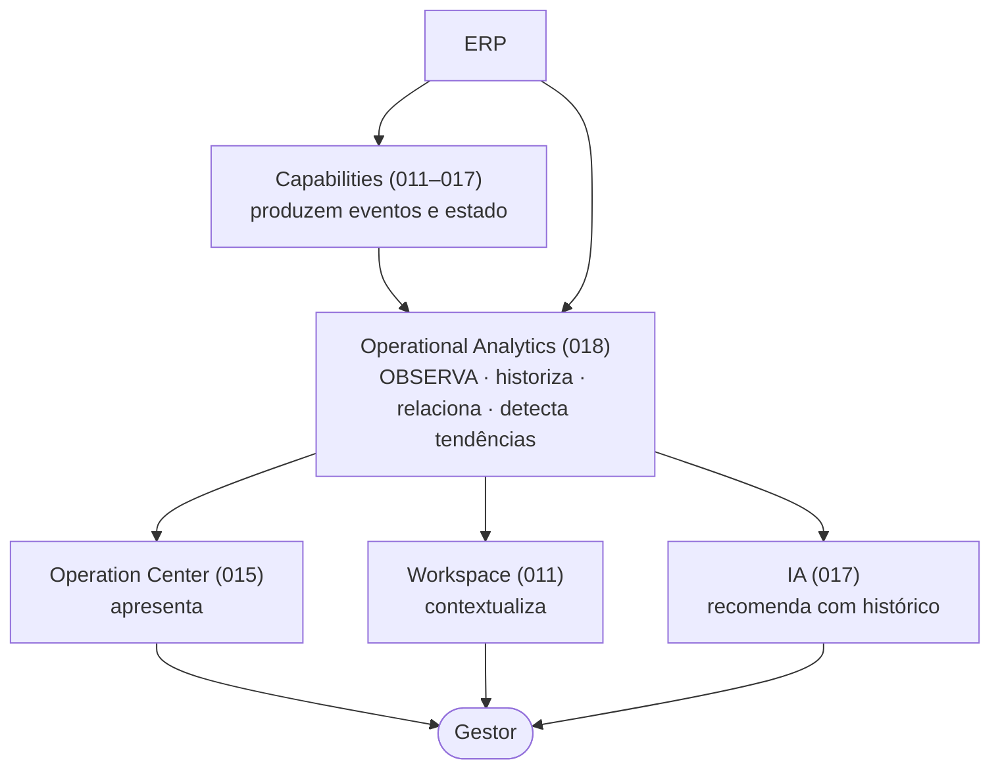

# 018 — Operational Analytics

> **Arquitetura funcional da Zion Platform.** Define o **Operational Analytics** — a **memória histórica** da plataforma: o Capability que **observa, historiza, relaciona, detecta tendências e explica a evolução** da operação. É um documento de **arquitetura funcional** — **sem implementação**. Não descreve classes, código, banco, API, interfaces nem componentes; descreve **o que o Analytics observa**, **como transforma operação em conhecimento** e **quais princípios** o governam.

> [!important] Registro oficial — não é um BI
> A Zion **não possui um módulo de BI**. Ela possui um **Operational Analytics**. O objetivo **não é mostrar gráficos** — é **transformar toda a operação da empresa em conhecimento**. Gráficos e dashboards são apenas **visualizações** de um conhecimento que já existe.

> [!important] O que o Analytics faz e não faz
> **Faz:** observa · historiza · relaciona · detecta tendências · explica a evolução · fornece contexto para todos os outros Capabilities. **Não faz:** nunca calcula custos (é do [013](./013-cost-engine.md)), nunca interpreta margem (é do [012](./012-commercial-intelligence-engine.md)), nunca mede maturidade (é do [014](./014-operational-maturity-engine.md)), **nunca toma decisões**.

> **Autoridade e escopo.** Em divergência de nomenclatura, **[000 — Business Domain](./000-business-domain.md) prevalece**. Este documento fecha a pendência **R8** da [Architecture Review 013a](./013a-architecture-review-epic2.md) (Analytics era citado como consumidor por 012/013/014/017 e não estava documentado). Não altera `000`–`017` nem o roadmap.

> **Referências:** [000 Business Domain](./000-business-domain.md) · [001 Product Master](./001-product-master.md) · [011 Product Master Workspace](./011-product-master-workspace.md) · [012 Commercial Intelligence Engine](./012-commercial-intelligence-engine.md) · [013 Cost Engine](./013-cost-engine.md) · [014 Operational Maturity Engine](./014-operational-maturity-engine.md) · [015 Operation Center](./015-operation-center.md) · [016 Implantation Journey](./016-implantation-journey.md) · [017 Zion Intelligence Operating System](./017-zion-intelligence-operating-system.md).

---

## 1. Objetivo

O **Operational Analytics** é a **memória histórica** da Zion Platform. Ele transforma tudo que a operação produz — eventos, mudanças, decisões, resultados — em **conhecimento** que dá contexto ao presente e informa o futuro.

Ele responde:
- **O que aconteceu?**
- **O que mudou?**
- **Como a operação evoluiu?**
- **Quais tendências surgiram?**
- **Quais melhorias deram resultado?**
- **Onde a operação piorou?**
- **Quais recomendações realmente funcionaram?**
- **Quanto tempo foi economizado?**
- **A IA realmente trouxe ganhos?**

> [!important] Registro oficial — os limites do Operational Analytics
> - É a **memória histórica** da plataforma.
> - **Nunca toma decisões** (decisão é do operador/gestor).
> - **Nunca calcula** (custo é do [013](./013-cost-engine.md); margem é do [012](./012-commercial-intelligence-engine.md); maturidade é do [014](./014-operational-maturity-engine.md)).
> - **Nunca substitui outros Capabilities** — ele os **observa** e lhes **devolve contexto**.

---

## 2. Filosofia

1. **Toda operação gera conhecimento.** Cada evento é matéria-prima de aprendizado — nada se perde.
2. **Tendências valem mais que números isolados.** Uma seta ("subindo/caindo") diz mais que um valor solto.
3. **Histórico vale mais que fotografia.** O que importa é a **evolução**, não o retrato de um instante.
4. **Decisões devem considerar a evolução.** O passado é insumo do presente — decide-se melhor sabendo de onde se veio.
5. **Conhecimento compartilhado.** O que o Analytics aprende **alimenta** os demais Capabilities e a IA.
6. **Contexto antes de gráficos.** Primeiro o significado ("a margem subiu porque…"), depois a visualização.

---

## 3. Arquitetura Conceitual

O Operational Analytics fica **transversal**: observa os Capabilities ao longo do tempo e devolve **contexto histórico** às camadas de trabalho e decisão.

Leitura: os Capabilities (e o ERP) **produzem** fatos; o Analytics os **observa e historiza**; o conhecimento resultante volta ao **Operation Center**, ao **Workspace** e à **IA** — e chega ao **gestor** como contexto para decidir.

---

## 4. Fontes de Dados

O Analytics **observa** (nunca é dono de) tudo que a operação produz:

| Fonte | O que observa |
|-------|---------------|
| **[Produto Mestre](./001-product-master.md)** | Evolução de conteúdo, completude, publicação. |
| **ERP** | Estoque/custo ao longo do tempo. |
| **Marketplace** | Estado dos anúncios, desempenho por canal. |
| **Pedidos** | Vendas, volume, ticket, sazonalidade. |
| **[Cost Engine (013)](./013-cost-engine.md)** | Custo consolidado e precisão ao longo do tempo. |
| **[Commercial Intelligence (012)](./012-commercial-intelligence-engine.md)** | Margem, recomendações, alertas. |
| **[Operational Maturity (014)](./014-operational-maturity-engine.md)** | Health, níveis, precisão, evolução. |
| **Workflow** | Automações executadas, tempo poupado. |
| **[Missões](./015-operation-center.md)** | Criadas, concluídas, retorno gerado. |
| **Usuários** | Atividade, carga, vazão da equipe. |
| **Eventos** | O fluxo bruto do [Event Bus](./004-event-bus.md). |
| **IA ([017](./017-zion-intelligence-operating-system.md))** | Recomendações feitas, aceitas, com que resultado. |

> [!important] Observa, não recalcula
> O Analytics **lê os números que os engines já produziram** e os **historiza**. Ele não recalcula custo/margem/maturidade — apenas registra sua **evolução** e detecta padrões.

---

## 5. Timeline Operacional

Cria-se oficialmente o conceito de **Timeline Operacional**: **toda empresa possui uma Timeline única** — a linha do tempo consolidada e histórica de toda a sua operação.

Ela registra:

| Registro | Exemplo |
|----------|---------|
| **Eventos** | "312 produtos publicados no Mercado Livre." |
| **Mudanças** | "Política de custos configurada." |
| **Evolução** | "Health da Operação 63% → 72%." |
| **Marcos** | "Certificação Prata atingida ([016](./016-implantation-journey.md))." |
| **Regressões** | "Precisão de custos caiu após mudança de fornecedor." |

> [!note] Três Timelines, um significado
> A Zion tem visões de linha do tempo em escopos diferentes: a **do produto** ([011](./011-product-master-workspace.md)), a **do cockpit** ([015](./015-operation-center.md)) e a **Timeline Operacional histórica** (018, esta) — a **memória de longo prazo** da empresa inteira. As duas primeiras são **feeds/visões**; esta é a **consolidação histórica** que permite comparar e detectar tendências.

---

## 6. Tendências

Formalizam-se as **Tendências** — a leitura de **direção** ao longo do tempo (a informação mais valiosa do Analytics).

| Tendência | Leitura |
|-----------|---------|
| **Health aumentando** | A operação está ficando mais saudável. |
| **Precisão caindo** | Os números estão ficando menos confiáveis — atenção. |
| **Margem evoluindo** | O lucro está melhorando. |
| **Retrabalho diminuindo** | Menos correções/refações. |
| **Tempo médio reduzindo** | Operação mais rápida (ex.: catálogo → publicação). |
| **Uso da IA aumentando** | A empresa está absorvendo a inteligência. |

Princípio: uma tendência **sempre vem com contexto** (desde quando, por quê) e, quando relevante, **vira sinal** (`analytics.trend_detected`) para o [015](./015-operation-center.md)/[017](./017-zion-intelligence-operating-system.md).

---

## 7. Comparações

Definem-se **Comparações** como conceito: o Analytics **nunca apresenta apenas números absolutos** — sempre com um referencial temporal ou de estado.

| Comparação | Pergunta |
|-----------|----------|
| **Hoje × Ontem** | O que mudou desde ontem? |
| **Semana / Mês / Trimestre / Ano** | Como está a janela vs. a anterior? |
| **Antes × Depois** | O que mudou após uma ação (ex.: depois de configurar custos)? |
| **Implantação × Atual** | Quanto a empresa evoluiu desde o dia 1 ([016](./016-implantation-journey.md))? |

> [!important] Nunca número solto
> "Margem de 22%" não diz nada; "margem subiu de 18% para 22% no mês, após ajustar preço de 12 produtos" **diz tudo**. O Analytics sempre entrega o **delta com contexto**.

---

## 8. Insights

Formalizam-se os **Insights** — conclusões legíveis extraídas dos dados históricos, prontas para o gestor entender **sem interpretar planilha**.

Exemplos:
- *"A IA reduziu **18 horas** de trabalho manual este mês."*
- *"O **retrabalho caiu 40%** desde a normalização dos tamanhos."*
- *"O **SEO melhorou**: produtos otimizados tiveram mais visualizações."*
- *"O catálogo **cresceu 120 produtos** no trimestre."*
- *"O **Mercado Livre perdeu desempenho** vs. o mês passado — investigar."*
- *"A **equipe evoluiu**: tempo médio por Missão caiu."*

Princípio: todo insight é **explicável** (aponta a causa/origem) e, quando exige ação, **vira Missão** no [015](./015-operation-center.md).

---

## 9. Operational Memory

Cria-se oficialmente a **Operational Memory**: a Zion **lembra o que aconteceu e com que resultado** — para não repetir erros e para reforçar o que funciona.

A Operational Memory guarda:
- **O que funcionou** (ações que geraram resultado positivo).
- **O que não funcionou** (ações sem retorno ou com regressão).
- **Quais decisões geraram resultado** (ligando decisão → efeito).
- **Quais Missões deram retorno** (impacto real vs. esperado).

> [!important] Memória que ensina
> A Operational Memory alimenta a [IA (017)](./017-zion-intelligence-operating-system.md) e o [Operational Maturity (014)](./014-operational-maturity-engine.md): recomendações futuras podem **aprender com o passado** ("Missões deste tipo costumam dar retorno neste cliente"). É a base do aprendizado por resultado — sempre **auditável** e **escopada por tenant**.

---

## 10. Operational ROI

Cria-se oficialmente o **Operational ROI** — o retorno da operação, **não apenas financeiro**. Mede o valor que a Zion (e a IA) trouxe à empresa em múltiplas dimensões.

| Dimensão de ROI | Exemplo |
|-----------------|---------|
| **Financeiro** | Margem recuperada, prejuízo evitado. |
| **Tempo economizado** | Horas poupadas por automação/IA. |
| **Retrabalho evitado** | Correções que deixaram de ser necessárias. |
| **Automações** | Fluxos que rodam sem humano. |
| **Qualidade** | Catálogo mais completo, menos pendências. |
| **Uso da IA** | Quanto da operação já é apoiada por inteligência. |

Princípio: o Operational ROI é **historizado** (`analytics.roi_updated`) e comparável no tempo — responde "a Zion valeu a pena?" com **evidência**.

---

## 11. Dashboards

Formalizam-se os **Dashboards** — que são **apenas visualizações** do conhecimento que o Analytics já produziu (nunca a fonte do conhecimento).

| Dashboard | Foco |
|-----------|------|
| **Executivo** | Visão de alto nível (ROI, maturidade, evolução). |
| **Operacional** | Fluxo do dia a dia (vazão, filas, tempo). |
| **Equipe** | Carga e produtividade dos operadores. |
| **Produto** | Evolução do catálogo/qualidade. |
| **Marketplace** | Desempenho por canal. |
| **IA** | Uso e ganho da inteligência. |
| **Gestor** | Síntese decisória (tendências + insights). |

> [!important] Dashboard não decide nem calcula
> Um dashboard **exibe** tendências, comparações e insights — ele não recalcula nem toma decisão. Respeita a regra "**apresentação ≠ cálculo**" (herança do Épico 2): o conhecimento nasce no Analytics; o dashboard só o mostra.

---

## 12. Relatórios Inteligentes

Criam-se oficialmente os **Relatórios Inteligentes**: relatórios deixam de ser **documentos de tabelas** e passam a ser **narrativas** — a Zion **conta** o que aconteceu.

Exemplo de narrativa:
> *"Nos últimos 30 dias, a margem média aumentou de 18% para 22%, principalmente porque 12 produtos abaixo do piso foram reprecificados após o custo real do ERP ser incorporado. A precisão de custos subiu de média para alta. O retrabalho de publicação caiu 40% com a normalização de tamanhos. Próximo foco recomendado: automatizar a sincronização de estoque."*

Princípios do Relatório Inteligente:
- **Narrativo** — texto que explica causa e efeito, não só números.
- **Contextual** — sempre compara com o período/estado anterior.
- **Acionável** — termina apontando o próximo foco (que vira Missão no [015](./015-operation-center.md)).

---

## 13. Eventos

O Operational Analytics participa do [Event Bus](./004-event-bus.md).

**Eventos consumidos:**

| Família | Uso |
|---------|-----|
| `produto.*` | Evolução do catálogo. |
| `cost.*` | Histórico de custo/precisão. |
| `commercial.*` | Histórico de margem/recomendações. |
| `maturity.*` | Evolução de health/nível. |
| `journey.*` | Marcos e regressões da jornada. |
| `workflow.*` | Automações e tempo poupado. |
| `ai.*` | Recomendações e resultados da IA. |

**Eventos produzidos:**

| Evento | Significado |
|--------|-------------|
| `analytics.trend_detected` | Uma tendência relevante foi identificada. |
| `analytics.report_ready` | Um Relatório Inteligente está pronto. |
| `analytics.insight_created` | Um insight foi gerado. |
| `analytics.anomaly_detected` | Uma anomalia/regressão foi detectada. |
| `analytics.roi_updated` | O Operational ROI foi atualizado. |

Princípio: todo evento é **auditável** e **sem segredo** ([008](./008-architecture-compliance.md)).

---

## 14. Integrações

O Analytics **fornece contexto histórico** aos demais — sem decidir nem recalcular:

| Consumidor | O que recebe |
|-----------|--------------|
| **[Workspace (011)](./011-product-master-workspace.md)** | Histórico do produto (evolução de preço, publicação, desempenho). |
| **[Operation Center (015)](./015-operation-center.md)** | Tendências, insights e anomalias → Missões/alertas. |
| **[Commercial Intelligence (012)](./012-commercial-intelligence-engine.md)** | Histórico de margem/venda para qualificar recomendações. |
| **[Operational Maturity (014)](./014-operational-maturity-engine.md)** | Evolução para medir progresso de maturidade. |
| **Workflow** | Dados de desempenho para acionar/ajustar automações. |
| **IA ([017](./017-zion-intelligence-operating-system.md))** | Operational Memory como base de aprendizado. |
| **Operational Performance** | Métricas de vazão/tempo *(capability de desempenho, planejado)*. |

---

## 15. Princípios

Princípios **oficiais** do Operational Analytics:

1. **Toda informação deve possuir histórico.**
2. **Toda tendência deve ser explicável.**
3. **Toda comparação deve possuir contexto.**
4. **Toda evolução deve ser mensurável.**
5. **Toda decisão futura pode utilizar conhecimento passado.**
6. **Observa, nunca decide nem calcula.**
7. **Apresentação ≠ conhecimento:** dashboards só mostram o que o Analytics já sabe.
8. **Memória escopada por tenant** ([RLS deny-by-default](./010-database-compliance.md)).

---

## 16. Critérios de Aceite

O Operational Analytics está conforme esta visão quando **todos** os critérios abaixo são verdadeiros:

- [ ] **Memória histórica, não BI:** transforma operação em conhecimento; gráficos são só visualização.
- [ ] **Observa, nunca decide/calcula/mede:** não recalcula custo (013), margem (012) nem maturidade (014); não toma decisões.
- [ ] **Timeline Operacional única:** cada empresa tem sua linha do tempo histórica (eventos, mudanças, evolução, marcos, regressões).
- [ ] **Tendências com contexto:** direção + desde-quando + porquê; viram sinal quando relevante.
- [ ] **Comparações sempre:** nunca número absoluto solto; sempre vs. período/estado.
- [ ] **Insights legíveis:** conclusões explicáveis, acionáveis (viram Missão).
- [ ] **Operational Memory:** lembra o que funcionou/não funcionou e alimenta IA/Maturidade.
- [ ] **Operational ROI multidimensional:** financeiro + tempo + retrabalho + automações + qualidade + uso da IA.
- [ ] **Dashboards só visualizam:** não calculam nem decidem.
- [ ] **Relatórios Inteligentes narrativos:** contam causa→efeito e apontam o próximo foco.
- [ ] **Eventos corretos:** consome `produto.*`/`cost.*`/`commercial.*`/`maturity.*`/`journey.*`/`workflow.*`/`ai.*` e produz os 5 eventos `analytics.*`.
- [ ] **Fornece contexto sem alterar:** entrega histórico/tendências a 011/012/014/015/017/Workflow; nunca escreve no domínio de outro.
- [ ] **Multiempresa seguro:** toda memória é escopada por tenant ([RLS deny-by-default](./010-database-compliance.md)).

---

## Seção especial — História da Operação

A Zion **conta a história** de uma empresa — transformando meses de eventos em uma narrativa que **cria contexto** para qualquer decisão.

**Exemplo — a história de um cliente ao longo do 1º semestre:**

| Mês | Capítulo | O que aconteceu |
|-----|----------|-----------------|
| **Janeiro** | Primeira integração | ERP conectado; estoque/custo reais começam a espelhar. |
| **Fevereiro** | Primeira IA | Enriquecimento do catálogo; conteúdo mais forte. |
| **Março** | Primeira automação | Sincronização/publicação começam a rodar sozinhas. |
| **Abril** | Margem aumentou | Custos reais incorporados; 12 produtos reprecificados. |
| **Maio** | Retrabalho caiu | Normalização de tamanhos reduziu falhas de publicação. |
| **Junho** | Empresa tornou-se Ouro | Maturidade *Otimizada*; decisões guiadas por margem. |

> [!important] História é contexto
> Quando o gestor abre a operação em julho, ele **não vê um número solto** — vê **de onde veio**. "A margem está em 22%" ganha sentido com "subiu porque em abril os custos reais entraram". A **História da Operação** é o que transforma dado em **entendimento**, e entendimento em **decisão melhor**.

---

## Seção especial — Operational Knowledge

O conhecimento histórico do Analytics **alimenta** os demais Capabilities — é o que torna a Zion mais inteligente com o tempo.

| Consumidor | Como o conhecimento histórico o alimenta |
|-----------|-------------------------------------------|
| **[Commercial Intelligence (012)](./012-commercial-intelligence-engine.md)** | Histórico de margem/venda torna as recomendações mais precisas ("este produto responde bem a promoção"). |
| **[Operational Maturity (014)](./014-operational-maturity-engine.md)** | A evolução medida mostra o progresso real e calibra o próximo passo. |
| **Workflow** | Padrões de desempenho definem **quando** automatizar (o que já provou dar certo). |
| **IA ([017](./017-zion-intelligence-operating-system.md))** | A **Operational Memory** vira base de aprendizado: a IA recomenda com base no que **funcionou** naquele cliente. |
| **Gestor** | Contexto e narrativa transformam relatórios em **decisões informadas**. |

> [!important] Conhecimento é ativo
> O **Operational Knowledge** é um ativo que **cresce** com a operação: quanto mais a empresa opera, mais a Zion sabe sobre ela — e melhor conduz sua evolução. É o elo entre **observar o passado** e **decidir o futuro**.

---

> **Registro oficial — as nove responsabilidades que nunca se misturam:**
> **Operational Analytics observa · Commercial Intelligence interpreta · Cost Engine calcula · Operational Maturity mede · Workflow executa · Workspace contextualiza · Operation Center apresenta · IA recomenda · Operador decide.**

> **Status:** `018` — Operational Analytics **v1.0 (arquitetura funcional)**. Documento **sem implementação**. É a **memória histórica** que **observa** os Capabilities e lhes devolve contexto; fecha a pendência R8 da [Review 013a](./013a-architecture-review-epic2.md). Alterações de escopo versionam este documento (v1.1, v2.0…) e nunca contrariam a fronteira de Fonte da Verdade de [000](./000-business-domain.md). **Próximo documento sugerido:** `019 — Workflow Engine` (o Capability que **executa** — hoje citado como executor pela IA (N3/N4, [017](./017-zion-intelligence-operating-system.md)) e como fonte/consumidor por 014/018 e ainda não documentado: define como automações são criadas, disparadas por eventos, executadas dentro de políticas, supervisionadas e revertidas — o elo "executa" da cadeia de responsabilidades).
