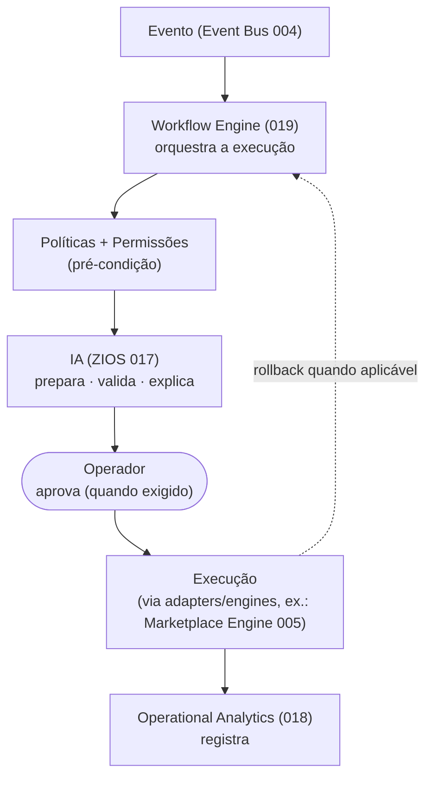
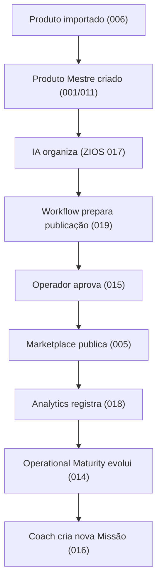

# 019 — Workflow Engine

> **Arquitetura funcional da Zion Platform.** Define o **Workflow Engine** — o **mecanismo oficial de execução** da Zion: o Capability que **transforma eventos em processos executáveis**. É um documento de **arquitetura funcional** — **sem implementação**. Não descreve classes, código, banco, API, interfaces nem componentes; descreve **como um evento vira trabalho executado**, **com que salvaguardas** e **quais princípios** o governam.

> [!important] Registro oficial — não é "um sistema de automação"
> O Workflow Engine **não é um sistema de automação** avulso. É o **mecanismo oficial de execução** da plataforma. Sua responsabilidade é **transformar eventos em processos executáveis** — e **só isso**. Ele **nunca calcula** (é do [013](./013-cost-engine.md)), **nunca interpreta** (é do [012](./012-commercial-intelligence-engine.md)), **nunca mede** (é do [014](./014-operational-maturity-engine.md)), **nunca decide** (é do operador/[ZIOS 017](./017-zion-intelligence-operating-system.md)). **Ele executa.**

> [!important] Toda execução respeita cinco salvaguardas
> **Políticas · Permissões · Autonomia · Auditoria · Reversibilidade.** Nenhuma execução acontece fora dessas cinco garantias.

> **Autoridade e escopo.** Em divergência de nomenclatura, **[000 — Business Domain](./000-business-domain.md) prevalece**. O Workflow Engine **generaliza** o legado de execução já existente — a fila `fila_otimizacao_produto` + Vercel Cron e o [Marketplace Engine (005)](./005-marketplace-engine.md) — **envelopando**-os, não reescrevendo. Não altera `000`–`018` nem o roadmap.

> **Referências:** [000 Business Domain](./000-business-domain.md) · [001 Product Master](./001-product-master.md) · [005 Marketplace Engine](./005-marketplace-engine.md) · [006 Zion Intake](./006-capability-000-zion-intake.md) · [011 Product Master Workspace](./011-product-master-workspace.md) · [012 Commercial Intelligence Engine](./012-commercial-intelligence-engine.md) · [013 Cost Engine](./013-cost-engine.md) · [014 Operational Maturity Engine](./014-operational-maturity-engine.md) · [015 Operation Center](./015-operation-center.md) · [016 Implantation Journey](./016-implantation-journey.md) · [017 Zion Intelligence Operating System](./017-zion-intelligence-operating-system.md) · [018 Operational Analytics](./018-operational-analytics.md).

---

## 1. Objetivo

O **Workflow Engine** é o Capability que **executa processos** na Zion — transformando um **evento** (algo aconteceu) em um **trabalho** que percorre etapas até um resultado, sempre dentro de políticas, permissões e auditoria.

Ele responde:
- Como um **evento vira trabalho**?
- Como um **trabalho vira execução**?
- Como a **IA participa**?
- Quando o **operador aprova**?
- Como **desfazer**?
- Como **registrar**?
- Como **aprender**?

> [!important] Registro oficial — os limites do Workflow Engine
> - **Executa processos**; nunca calcula, interpreta, mede ou decide.
> - **Só executa políticas existentes** — não cria política nem exceção.
> - **Só age com permissão e autonomia** adequadas ([017 §Autonomia](./017-zion-intelligence-operating-system.md)).
> - **Tudo é auditável e, quando possível, reversível.**

---

## 2. Filosofia

1. **Tudo começa por um evento.** Nenhuma execução nasce do nada; há sempre um fato de origem ([Event Bus](./004-event-bus.md)).
2. **Toda execução é auditável.** Quem, o quê, quando, com que resultado — sempre registrado.
3. **Toda execução pode ser interrompida.** O humano pode **pausar** a qualquer momento.
4. **Toda execução pode ser revertida quando aplicável.** Se há rollback, ele existe; se não há, a limitação é **declarada**.
5. **Nenhuma execução acontece fora de políticas.** Política e permissão são **pré-condição**, não sugestão.
6. **Segurança antes de velocidade.** Automatiza-se o que é seguro; o resto pede confirmação humana.

---

## 3. Arquitetura Conceitual

O Workflow Engine fica **entre o fato e o efeito**: recebe o evento, aplica políticas, envolve a IA e o operador conforme a autonomia, executa e informa o Analytics.

Leitura: **Evento → Workflow Engine → Políticas → IA → Operador → Execução → Analytics.** O Workflow é o **maestro** — ele não toca os instrumentos (não calcula/interpreta/decide); coordena a **execução** dentro das salvaguardas.

---

## 4. Eventos (gatilhos)

Todo Workflow é **disparado por um evento**. Famílias de gatilho:

| Família | Exemplo de trabalho disparado |
|---------|-------------------------------|
| `produto.*` | `produto_mestre.atualizado` → propagar mudança aos canais. |
| `cost.*` | `cost.updated` → reavaliar preço (via política). |
| `commercial.*` | `commercial.policy_violation` → workflow de correção de preço. |
| `journey.*` | `journey.milestone_completed` → liberar próximo passo. |
| `maturity.*` | `maturity.recommendation_created` → preparar ação de evolução. |
| `marketplace.*` | `marketplace.listing.erro` → workflow de republicação. |
| `pedido.*` | `venda.recebida` → propagar estoque/reconciliar. |
| `erp.*` | `erp.estoque.mudou` → propagar estoque aos anúncios. |
| `ai.*` | `ai.execution.requested` → executar ação preparada pela IA (N3/N4). |

Princípio: o **gatilho** define a origem; o **Workflow** define o processo; a **política** define se/como executa.

---

## 5. Workflows

Formaliza-se oficialmente o conceito de **Workflow**: um **processo composto por etapas**, disparado por um evento e conduzido até um resultado.

Cada Workflow tem:
- **Origem** (o evento que o disparou).
- **Objetivo** (o resultado pretendido).
- **Etapas** ([§6](#6-etapas)) com suas pré-condições.
- **Política aplicável** ([§7](#7-políticas)).
- **Nível de aprovação exigido** ([§9](#9-aprovações)).
- **Reversibilidade** ([§10](#10-reversibilidade)).

Cada **etapa** de um Workflow possui:

| Atributo | Significado |
|----------|-------------|
| **Objetivo** | O que a etapa faz. |
| **Responsável** | Quem/o quê executa (agente, engine, operador). |
| **Pré-condições** | O que precisa ser verdade para a etapa rodar. |
| **Resultado esperado** | O estado após a etapa. |

---

## 6. Etapas

Criam-se oficialmente os **tipos de Etapa** — os blocos de que qualquer Workflow é feito:

| Etapa | O que faz |
|-------|-----------|
| **Aguardar** | Espera uma condição/evento/tempo. |
| **Executar** | Realiza a ação (via adapter/engine). |
| **Validar** | Confere pré/pós-condições (a IA pode validar). |
| **Aprovar** | Solicita aprovação humana ([§9](#9-aprovações)). |
| **Publicar** | Caso especial de Executar em marketplace ([005](./005-marketplace-engine.md)). |
| **Reverter** | Desfaz uma etapa executada (rollback). |
| **Concluir** | Encerra o Workflow com resultado registrado. |

Princípio: as etapas são **componíveis** — Workflows diferentes reusam os mesmos blocos, o que mantém a execução **previsível e auditável**.

---

## 7. Políticas

As **Políticas** controlam os Workflows. **O Workflow nunca decide** — ele **apenas executa políticas existentes** (Política Comercial [012](./012-commercial-intelligence-engine.md), Política de Custos [013](./013-cost-engine.md), políticas de publicação/estoque, limites de autonomia [017](./017-zion-intelligence-operating-system.md)).

Como as políticas controlam:
- **Se** o Workflow pode rodar (permitido para este tenant/contexto?).
- **Como** roda (limites: teto de preço, piso de margem, rate-limit de canal).
- **Quem** precisa aprovar ([§9](#9-aprovações)).
- **Até onde** a IA pode ir sozinha (nível de autonomia [017](./017-zion-intelligence-operating-system.md)).

> [!important] Executa política, não a cria
> Se uma política não permite, o Workflow **não executa** — e registra o motivo. Se falta política, o Workflow **para e pede definição** (vira Missão), em vez de "chutar". O Workflow é o **braço**, não a **cabeça**.

---

## 8. IA

A [IA (ZIOS 017)](./017-zion-intelligence-operating-system.md) participa dos Workflows — mas **nunca substitui políticas**.

| Papel da IA | O que faz |
|-------------|-----------|
| **Preparar** | Monta a ação pronta para execução (autonomia N2). |
| **Validar** | Confere pré/pós-condições, aponta risco. |
| **Explicar** | Diz por que a etapa é necessária e qual o impacto. |
| **Sugerir** | Recomenda o próximo passo/otimização. |

> [!important] IA acelera, política limita
> A IA pode **preparar e validar** uma execução, mas **os limites são das políticas**, não da IA. Em N4 (execução automática), a IA age **dentro** das políticas; qualquer coisa fora delas **exige humano**. A regra-mãe "**nunca inventar dado**" vale aqui também.

---

## 9. Aprovações

Formalizam-se os **níveis de aprovação** — quem precisa autorizar antes de uma etapa sensível executar:

| Nível | Quem aprova | Cenário típico |
|-------|-------------|----------------|
| **Nenhuma** | — (executa direto) | Ação segura e reversível, autonomia N4 dentro da política. |
| **Operador** | O operador do cliente | Publicar um produto, ajustar preço dentro do piso. |
| **Gestor** | Gestor/responsável | Ação em massa, mudança acima de limite. |
| **Empresa** | Aprovação do cliente | Ação estratégica (ex.: entrar em novo canal). |
| **Dupla aprovação** | Dois aprovadores | Ação crítica/irreversível (ex.: exclusão em massa). |

> [!note] Aprovação por risco, não por burocracia
> O nível exigido é **função do risco/reversibilidade** da ação, definido por política — não um carimbo genérico. Ação segura flui; ação perigosa pede mais olhos.

---

## 10. Reversibilidade

Cria-se oficialmente o princípio de **Reversibilidade**: **toda execução reversível deve possuir rollback**.

- **Execução reversível** → tem uma etapa **Reverter** que desfaz o efeito (ex.: despublicar um anúncio, voltar um preço).
- **Execução irreversível** → a **limitação é registrada e declarada** antes de executar (ex.: "esta ação não pode ser desfeita — confirme").
- **Compensação** → quando não há rollback exato, há uma **ação compensatória** (ex.: não dá para "desvender", mas dá para registrar estorno).

> [!important] Reversível por padrão, irreversível com aviso
> O operador **nunca é surpreendido**: se algo não pode ser desfeito, ele sabe **antes** de confirmar. Nada destrutivo acontece por acidente ([017 §Segurança](./017-zion-intelligence-operating-system.md)).

---

## 11. Auditoria

Toda execução registra (compõe o [Intelligence Ledger 017](./017-zion-intelligence-operating-system.md) e alimenta o [Analytics 018](./018-operational-analytics.md)):

| Campo | Significado |
|-------|-------------|
| **Quem iniciou** | O evento/ator que disparou. |
| **Quem aprovou** | O aprovador (se houve). |
| **Quem executou** | O agente/engine/operador. |
| **Quando** | Timestamp de cada etapa. |
| **Resultado** | Sucesso, falha (sanitizada), revertido. |
| **Tempo** | Duração da execução. |
| **Impacto** | O efeito (ex.: 42 anúncios publicados). |

Princípio: **nenhuma execução existe fora da auditoria**; nada de segredo em log/evento ([008](./008-architecture-compliance.md)).

---

## 12. Filas

Cria-se o conceito de **Filas de execução** — como o Workflow Engine organiza o trabalho em escala (generalizando a fila legada + [Marketplace Engine 005](./005-marketplace-engine.md)):

| Fila | Função |
|------|--------|
| **Fila de execução** | Trabalhos prontos para rodar (com idempotência). |
| **Fila de aprovação** | Trabalhos aguardando autorização humana. |
| **Fila de retry** | Trabalhos que falharam e serão reprocessados (backoff). |
| **Fila de erro** | Falhas persistentes (dead-letter) para análise. |
| **Fila de compensação** | Ações compensatórias/rollback pendentes. |

Princípio: as filas são **idempotentes** e **ordenadas por chave** (ex.: por produto), herdando as garantias do [Marketplace Engine (005)](./005-marketplace-engine.md) — publicar 500 sem duplicar, sem manter a aba aberta.

---

## 13. Tratamento de Falhas

Quando algo falha, o Workflow Engine não perde o trabalho:

| Mecanismo | Quando aplica |
|-----------|---------------|
| **Retry** | Falha transitória (ex.: rate-limit 429) → backoff e reenvio. |
| **Compensação** | Etapa parcial que precisa ser desfeita/compensada. |
| **Cancelamento** | Trabalho não faz mais sentido (evento superado) → cancela e registra. |
| **Intervenção humana** | Falha persistente/decisão necessária → vira Missão no [015](./015-operation-center.md). |

Princípio: **nada se perde silenciosamente** — falha vira dead-letter **replayável** ou Missão; a idempotência garante que retry não duplica efeito.

---

## 14. Integrações

O Workflow Engine é o **executor** que os demais Capabilities acionam — sempre pelas ferramentas de cada domínio:

| Capability | Integração |
|-----------|------------|
| **[Workspace (011)](./011-product-master-workspace.md)** | Ações do produto (publicar, sincronizar) rodam como Workflow. |
| **[Operation Center (015)](./015-operation-center.md)** | Missões acionam Workflows; execuções aparecem no cockpit. |
| **[Commercial Intelligence (012)](./012-commercial-intelligence-engine.md)** | Recomendações aprovadas viram Workflows (ex.: PUT preço). |
| **[Cost Engine (013)](./013-cost-engine.md)** | Fornece o número; o Workflow **não** recalcula. |
| **[Operational Maturity (014)](./014-operational-maturity-engine.md)** | Missões de evolução viram Workflows; nível de autonomia define aprovação. |
| **[Analytics (018)](./018-operational-analytics.md)** | Recebe o registro de toda execução (tempo, impacto, resultado). |
| **[ZIOS (017)](./017-zion-intelligence-operating-system.md)** | A IA prepara/valida; a autonomia (N0–N4) define o quanto executa sozinha. |
| **[Marketplace Engine (005)](./005-marketplace-engine.md)** | O executor concreto de canal — o Workflow Engine o **orquestra**, não o substitui. |

> [!important] Orquestra a execução, não reescreve os engines
> O Workflow Engine **coordena** processos; a execução concreta em cada domínio usa o **engine/adapter** daquele domínio (ex.: publicar usa o [Marketplace Engine 005](./005-marketplace-engine.md)). Ele é a **camada de orquestração de execução**, não um substituto dos executores especializados.

---

## 15. Eventos Produzidos

O Workflow Engine emite no [Event Bus](./004-event-bus.md) (o [Analytics 018](./018-operational-analytics.md) e o [Maturity 014](./014-operational-maturity-engine.md) já consomem `workflow.*`):

| Evento | Significado |
|--------|-------------|
| `workflow.started` | Um Workflow começou. |
| `workflow.completed` | Concluído com sucesso. |
| `workflow.failed` | Falhou (após retries) → erro/dead-letter. |
| `workflow.retried` | Foi reprocessado. |
| `workflow.reverted` | Foi revertido (rollback/compensação). |
| `workflow.cancelled` | Foi cancelado (superado/abortado). |

Princípio: todo evento é **auditável** e **sem segredo**.

---

## 16. Princípios

Princípios **oficiais** do Workflow Engine:

1. **Toda execução possui origem** (um evento a disparou).
2. **Toda execução possui auditoria.**
3. **Toda execução possui contexto** (produto, cliente, política).
4. **Toda execução respeita políticas** (e permissões e autonomia).
5. **Toda execução pode ser explicada.**
6. **Toda execução pode ser interrompida.**
7. **Execução reversível tem rollback; irreversível é declarada.**
8. **Executa, nunca decide** — decisão é do operador/ZIOS.
9. **Idempotência sempre** — retry não duplica efeito.
10. **Escopado por tenant** ([RLS deny-by-default](./010-database-compliance.md)).

---

## 17. Critérios de Aceite

O Workflow Engine está conforme esta visão quando **todos** os critérios abaixo são verdadeiros:

- [ ] **Executa, não decide/calcula/interpreta/mede:** transforma eventos em processos; nunca assume o papel de outro Capability.
- [ ] **Disparado por evento:** todo Workflow tem um gatilho no Event Bus; nenhum nasce "do nada".
- [ ] **Etapas componíveis:** Aguardar/Executar/Validar/Aprovar/Publicar/Reverter/Concluir, cada uma com objetivo, responsável, pré-condições e resultado.
- [ ] **Políticas como pré-condição:** o Workflow só executa políticas existentes; falta de política para o processo (vira Missão), não improviso.
- [ ] **IA participa sem substituir política:** prepara/valida/explica/sugere; limites são das políticas e da autonomia ([017](./017-zion-intelligence-operating-system.md)).
- [ ] **Aprovações por risco:** Nenhuma/Operador/Gestor/Empresa/Dupla, definidas por política.
- [ ] **Reversibilidade:** execução reversível tem rollback/compensação; irreversível é declarada antes de confirmar.
- [ ] **Auditoria completa:** quem iniciou/aprovou/executou, quando, resultado, tempo, impacto.
- [ ] **Filas resilientes:** execução/aprovação/retry/erro/compensação; idempotentes e ordenadas por chave.
- [ ] **Falhas tratadas:** retry com backoff, compensação, cancelamento, intervenção humana; nada se perde em silêncio.
- [ ] **Eventos corretos:** consome `produto.*`/`cost.*`/`commercial.*`/`journey.*`/`maturity.*`/`marketplace.*`/`pedido.*`/`erp.*`/`ai.*` e produz os 6 eventos `workflow.*`.
- [ ] **Orquestra, não reescreve:** usa os engines/adapters de cada domínio (ex.: [Marketplace Engine 005](./005-marketplace-engine.md)); envelopa o legado, não o substitui.
- [ ] **Multiempresa seguro:** toda execução escopada por tenant ([RLS deny-by-default](./010-database-compliance.md)).

---

## Seção especial — Fluxo Completo

Uma cadeia ponta a ponta: de um produto importado a uma nova Missão — mostrando **cada Capability no seu papel**, com o Workflow Engine como executor.

**Narrativa:** um produto é **importado** ([006](./006-capability-000-zion-intake.md)) e vira **Produto Mestre** ([011](./011-product-master-workspace.md)); a **IA organiza** ([017](./017-zion-intelligence-operating-system.md)); o **Workflow prepara a publicação** — verifica política, monta a ação (N2); o **operador aprova** ([015](./015-operation-center.md)); o **Marketplace Engine publica** ([005](./005-marketplace-engine.md)); o **Analytics registra** o resultado/tempo/impacto ([018](./018-operational-analytics.md)); o **Operational Maturity evolui** o Health ([014](./014-operational-maturity-engine.md)); e o **Coach cria a próxima Missão** ([016](./016-implantation-journey.md)). O Workflow Engine **executou** — sem decidir, calcular ou medir; cada peça fez o seu papel.

---

## Seção especial — Biblioteca de Workflows

Exemplos de Workflows oficiais — **somente conceitos**, sem implementação. Cada um é um processo de etapas disparado por evento, sob política e auditoria.

| Workflow | Gatilho típico | O que executa (conceito) |
|----------|----------------|--------------------------|
| **Importação** | Catálogo recebido | Ingerir → conciliar → criar Pré-Produto → promover ([006](./006-capability-000-zion-intake.md)). |
| **Publicação** | Produto pronto/aprovado | Preparar payload → validar → publicar ([005](./005-marketplace-engine.md)) → confirmar por webhook. |
| **Atualização de preço** | `preco.definido` / recomendação comercial | Validar contra política → PUT preço no canal → registrar. |
| **Atualização de estoque** | `erp.estoque.mudou` | Propagar estoque do ERP aos anúncios (antioverselling). |
| **SEO** | Recomendação de SEO | IA gera → operador revisa → aplicar → versionar. |
| **IA (enriquecimento)** | Pré-Produto pronto | Rodar esteira A0–A12 → trava A10 → Board ([006](./006-capability-000-zion-intake.md)). |
| **Marketplace** | `marketplace.listing.erro` | Diagnosticar → corrigir → republicar (retry). |
| **ERP** | Divergência detectada | Reconciliar ERP↔Zion → registrar/alertar. |
| **Custos** | `cost.missing_input` | Solicitar custo ao operador → recalcular precisão ([013](./013-cost-engine.md)). |
| **Missões** | `maturity.mission_created` | Materializar a Missão de evolução no cockpit ([015](./015-operation-center.md)). |

> [!note] Biblioteca componível
> Todos reusam as mesmas **Etapas** ([§6](#6-etapas)) e as mesmas **salvaguardas** (políticas, aprovações, reversibilidade, auditoria). Adicionar um novo Workflow é **compor etapas** sob uma política — não reescrever o motor.

---

> **Registro oficial — as nove responsabilidades que nunca se misturam:**
> **Workflow Engine executa · Operational Analytics observa · Operational Maturity mede · Commercial Intelligence interpreta · Cost Engine calcula · Workspace contextualiza · Operation Center apresenta · ZIOS coordena · Operador decide.**

> **Status:** `019` — Workflow Engine **v1.0 (arquitetura funcional)**. Documento **sem implementação**. É o **mecanismo oficial de execução**: transforma eventos em processos executáveis sob **políticas, permissões, autonomia, auditoria e reversibilidade**; **envelopa** o legado (fila `fila_otimizacao_produto` + Vercel Cron + [Marketplace Engine 005](./005-marketplace-engine.md)) sem reescrevê-lo. Alterações de escopo versionam este documento (v1.1, v2.0…) e nunca contrariam a fronteira de Fonte da Verdade de [000](./000-business-domain.md). **Próximo documento sugerido:** `020 — Organizations` (o modelo de multiempresa da Zion: Organização → Cliente → Usuário, papéis e permissões, isolamento por tenant e [RLS](./010-database-compliance.md) — a base de governança que **todas** as capabilities, políticas, aprovações e memórias já assumem; formaliza `organizacao_id`/`cliente_id`, os papéis `equipe`/`cliente` e quem pode aprovar o quê nos Workflows).
