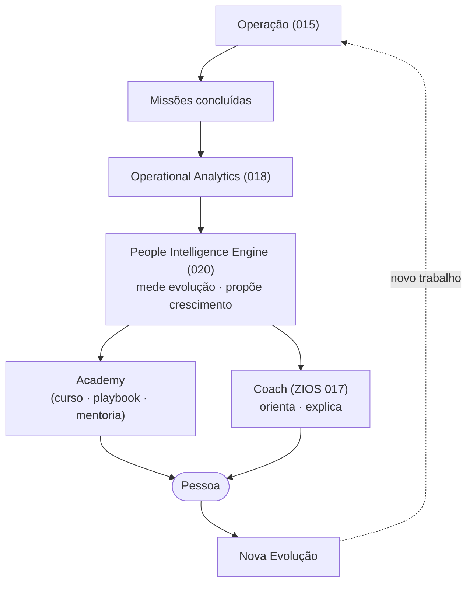
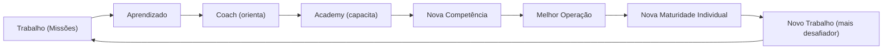

# 020 — People Intelligence Engine

> **Arquitetura funcional da Zion Platform.** Define o Capability que **acelera a evolução das pessoas** que operam no digital. É um documento de **arquitetura funcional** — **sem implementação**. Não descreve classes, código, banco, API nem componentes; descreve **como uma pessoa evolui**, **como a plataforma a apoia** e **quais princípios** o governam.

> [!important] Registro oficial — este NÃO é um módulo de RH
> **A Zion não avalia pessoas. A Zion ajuda pessoas a evoluírem.** Este Engine **mede evolução operacional, nunca valor humano**; existe para **identificar oportunidades de crescimento**, **jamais para vigiar**. **A Zion mede evolução. Nunca vigilância.**

> **Autoridade e escopo.** Em divergência de nomenclatura, **[000 — Business Domain](./000-business-domain.md) prevalece**. Este Engine herda a ética já registrada no [Painel do Gestor (015)](./015-operation-center.md) ("equilíbrio, nunca vigilância") e na filosofia da marca ([Brand DNA](../brand/000-brand-dna.md) — "o humano no comando"). Não altera `000`–`019`, a camada Product nem a camada Company.

> **Referências:** [000 Business Domain](./000-business-domain.md) · [014 Operational Maturity](./014-operational-maturity-engine.md) · [015 Operation Center](./015-operation-center.md) · [016 Implantation Journey](./016-implantation-journey.md) · [017 Zion Intelligence Operating System](./017-zion-intelligence-operating-system.md) · [018 Operational Analytics](./018-operational-analytics.md) · [019 Workflow Engine](./019-workflow-engine.md) · [company/001 Business Operating System](../company/001-business-operating-system.md) · [brand/000 Brand DNA](../brand/000-brand-dna.md).

---

## 1. Objetivo

O **People Intelligence Engine** é o Capability que **mede a evolução operacional das pessoas** e as **ajuda a crescer** — conectando a operação (Missões), a inteligência (Coach) e a educação (Academy) num ciclo de desenvolvimento contínuo.

Ele responde:
- Como uma pessoa **evolui** dentro da operação?
- Como uma empresa **desenvolve** sua equipe?
- Como **identificar oportunidades** de crescimento?
- Como transformar **conhecimento em evolução**?
- Como conectar **IA, Academy e Operação**?

> [!important] Registro oficial — o que o Engine mede e o que jamais mede
> - **Mede:** evolução operacional (conhecimento, autonomia, precisão, qualidade, colaboração, aprendizado…).
> - **Nunca mede:** valor humano, mérito pessoal, "quem é melhor que quem".
> - **Compara:** a pessoa **consigo mesma ao longo do tempo**.
> - **Nunca compara:** pessoas entre si para competição ou ranking.
>
> Assim como o [Operational Maturity Engine (014)](./014-operational-maturity-engine.md) mede a maturidade de uma **operação**, o People Intelligence mede a **evolução operacional de uma pessoa** — com a mesma ética e a mesma regra "**recomenda, nunca determina**".

---

## 2. Filosofia

1. **Toda pessoa pode evoluir.** O ponto de partida não define o teto; o Engine olha trajetória, não rótulo.
2. **Toda evolução deve ser incentivada.** O papel é apoiar o crescimento, não flagrar a falha.
3. **Nunca comparar pessoas para competição.** Comparação entre indivíduos gera medo, não desenvolvimento.
4. **Comparar apenas a pessoa consigo mesma** ao longo do tempo — "você hoje vs. você antes".
5. **O objetivo é desenvolver, nunca vigiar.** Cada medição existe para propor um próximo passo, não para julgar.
6. **A evolução é da pessoa.** Ela é dona da própria jornada; o Engine é um espelho e um guia, não um juiz.

> Esta filosofia é a aplicação, às pessoas, do que a Zion já faz com a operação: **medir para evoluir, com clareza, calma e humano no comando** ([Brand DNA](../brand/000-brand-dna.md)).

---

## 3. Arquitetura Conceitual

O People Intelligence fica **entre** o que a pessoa faz (operação/analytics) e como ela cresce (Academy/Coach) — devolvendo **evolução**, nunca veredito.

Leitura: a **pessoa opera** (Missões); o **Analytics** observa o padrão ao longo do tempo; o **People Intelligence** interpreta como **evolução** e propõe crescimento; **Academy** e **Coach** entregam o desenvolvimento; a pessoa **evolui** e volta à operação mais capaz. O Engine **nunca decide** sobre a pessoa — apenas ilumina o caminho.

---

## 4. Quem Pode Evoluir

O Engine serve a **todos os perfis** do ecossistema — cada um com uma **jornada própria**:

| Perfil | Jornada de evolução |
|--------|---------------------|
| **Operadores** | do básico ao domínio da operação (autonomia, precisão, qualidade). |
| **Gestores** | de coordenar tarefas a **desenvolver pessoas** e conduzir a operação. |
| **Clientes** | de operar no escuro a operar com inteligência ([Journey 016](./016-implantation-journey.md)). |
| **Parceiros** | de habilitado a especialista/certificado (Academy). |
| **Consultores** | de generalista a autoridade num nicho. |
| **Especialistas** | de profundo numa frente a referência que ensina. |
| **Afiliados** | de divulgador a multiplicador qualificado. |

> [!note] Jornadas diferentes, mesma ética
> Cada perfil evolui por um caminho distinto, mas **todos** sob a mesma regra: comparar com o próprio passado, medir evolução (não valor), recomendar (não determinar), respeitar a privacidade.

---

## 5. Dimensões de Evolução

A evolução operacional de uma pessoa é lida por **dimensões** — nunca por um número único de "desempenho":

| Dimensão | O que descreve |
|----------|----------------|
| **Conhecimento** | domínio dos conceitos e da operação (cresce com Academy e prática). |
| **Autonomia** | capacidade de conduzir sozinho, com segurança. |
| **Precisão** | acurácia do trabalho (menos erro, dado mais confiável). |
| **Qualidade** | excelência do resultado entregue. |
| **Consistência** | manter o padrão ao longo do tempo, não só em picos. |
| **Colaboração** | apoiar colegas, compartilhar conhecimento, elevar o time. |
| **Aprendizado** | velocidade e disposição para aprender e aplicar. |
| **Liderança** | capacidade de desenvolver e orientar outros (para quem trilha esse caminho). |

> [!important] Dimensões, não uma nota
> A evolução é um **perfil de dimensões** (como o [Operational DNA do 014](./014-operational-maturity-engine.md)) — nunca um "score de pessoa". Alguém pode ser forte em Precisão e estar crescendo em Autonomia; o Engine mostra **onde apoiar**, não "quanto a pessoa vale".

---

## 6. Indicadores

Indicadores **conceituais** de evolução — **nunca produtividade pura**:

| Indicador | O que revela |
|-----------|--------------|
| **Health de Evolução** | quão saudável está a trajetória de crescimento da pessoa. |
| **Índice de Aprendizado** | quanto a pessoa está aprendendo e aplicando. |
| **Autonomia** | evolução da capacidade de conduzir sozinho. |
| **Precisão** | melhora da acurácia ao longo do tempo. |
| **Colaboração** | contribuição para o crescimento do time. |
| **Maturidade Individual** | leitura consolidada da evolução (perfil, não ranking). |

> [!important] Nunca produtividade pura
> Medir só "quantas Missões por hora" transformaria pessoas em máquinas e incentivaria pressa em vez de qualidade. Os indicadores do People Intelligence medem **crescimento**, sempre em relação à própria trajetória — e sempre com **contexto** ([§9](#9-analytics)).

---

## 7. Coach

A [IA (ZIOS 017)](./017-zion-intelligence-operating-system.md) atua como **mentor de evolução** — **sempre orientando, nunca julgando**:

- **Sempre orientando:** aponta o próximo passo de crescimento ("você está pronto para conduzir X sozinho").
- **Nunca julgando:** não emite veredito de valor; fala de **oportunidade**, não de deficiência.
- **Sempre explicando:** diz por que sugere aquele passo e qual o ganho.
- **Sempre propondo próximos passos:** curso, playbook, uma Missão mais desafiadora, uma mentoria.

Exemplos da voz do Coach de evolução:
- *"Você melhorou muito a precisão neste mês — o próximo passo natural é ganhar autonomia em publicação. Que tal este módulo da Academy?"*
- *"Notei que você resolve bem problemas de conteúdo. Toparia mentorar um colega que está começando nisso?"*

> [!important] O Coach conversa com a pessoa, sobre a pessoa — para a pessoa
> As orientações de evolução são, por padrão, **do indivíduo para o indivíduo** — um espelho gentil que só ele controla. O que é compartilhado com o gestor segue a regra de privacidade ([§10](#10-gestores)/[§11](#11-cliente)).

---

## 8. Academy

O People Intelligence integra-se à **Academy**: toda **lacuna de evolução** vira uma **oportunidade concreta de desenvolvimento**.

| Lacuna identificada | Pode gerar |
|---------------------|-----------|
| conceito não dominado | **Curso** |
| processo pouco fluido | **Playbook** |
| habilidade a praticar | **Treinamento** |
| aprender fazendo | **Missão** (mais desafiadora, no [015](./015-operation-center.md)) |
| conhecimento tácito de um colega | **Mentoria** |

> [!important] Lacuna é oportunidade, não falha
> Uma dimensão em desenvolvimento **nunca** é tratada como deficiência a punir — é uma **oportunidade a apoiar**. O Engine converte "onde a pessoa pode crescer" em "o que a Zion oferece para ela crescer". É o [ciclo de "Empresa que Aprende" (company/001)](../company/001-business-operating-system.md) aplicado às pessoas.

---

## 9. Analytics

O [Operational Analytics (018)](./018-operational-analytics.md) alimenta o Engine com **histórico e tendência** — **nunca dados isolados**:

- **Sempre com contexto:** "a precisão subiu **depois** do curso X", não "precisão = 82".
- **Sempre trajetória:** a leitura é a **evolução no tempo** (a pessoa vs. ela mesma), não uma fotografia.
- **Sempre com precisão declarada:** medições incompletas são marcadas como parciais ([L17 das Product Laws](../product/system/002-product-laws.md)).

> [!important] Contexto protege a pessoa
> Um número isolado sobre uma pessoa é injusto e perigoso (esconde a causa, convida ao julgamento). O Engine **só** trabalha com evolução **contextualizada** — de onde veio, por quê, para onde vai. Sem contexto, não há medição de pessoa.

---

## 10. Gestores

O papel do gestor com este Engine é **desenvolver pessoas — nunca controlar**:

| ✅ O Engine ajuda o gestor a… | ❌ O Engine nunca serve para… |
|-------------------------------|-------------------------------|
| ver **oportunidades** de crescimento do time | montar **rankings** de pessoas. |
| saber **onde apoiar** cada um | comparar pessoas para pressionar. |
| distribuir desafios com justiça | expor métricas individuais publicamente. |
| reconhecer evolução real | punir com base em número. |

> [!important] Desenvolver, nunca controlar — e nunca ranking público
> O gestor vê **oportunidades de desenvolvimento**, sempre em tom de "como ajudar", nunca de "quem é pior". **Rankings públicos são proibidos.** A leitura é a mesma do [Painel do Gestor (015)](./015-operation-center.md): a Zion ilumina a operação e a evolução **para apoiar**, jamais para vigiar ou constranger.

---

## 11. Cliente

Empresas-clientes podem **acompanhar a evolução das suas equipes** — sempre **respeitando a privacidade**:

- O cliente vê a **evolução agregada** e as **oportunidades de desenvolvimento** do seu time.
- Dados individuais seguem regras de privacidade e consentimento; **nada é exposto para constranger**.
- O foco é **capacitar a equipe do cliente** (via Academy/Coach), não fiscalizá-la.
- Isolamento por tenant é absoluto: um cliente **nunca** vê pessoas de outro ([RLS 010](./010-database-compliance.md)).

> A evolução das pessoas do cliente é parte da evolução da **operação** do cliente ([Journey 016](./016-implantation-journey.md)): equipe mais capaz = operação mais madura.

---

## 12. Parceiros

Parceiros (agências, consultorias, especialistas) evoluem por uma trilha própria:

| Mecanismo | O que oferece |
|-----------|---------------|
| **Certificações** | reconhecimento formal de competência (via Academy). |
| **Academy** | trilhas de capacitação por nível e por especialidade. |
| **Especializações** | domínio de nichos (ex.: moda, calçado, um canal específico). |

> A evolução dos parceiros amplia a capacidade de entrega do **ecossistema** ([company/001](../company/001-business-operating-system.md)): parceiro mais capaz = mais clientes bem servidos.

---

## 13. IA

A IA no People Intelligence **recomenda, nunca determina** (herança direta do [ZIOS 017](./017-zion-intelligence-operating-system.md)):

- **Recomenda** próximos passos de evolução (curso, Missão, mentoria) — com justificativa.
- **Nunca determina** promoção, avaliação, mérito ou "nota" de pessoa.
- **Nunca decide** sozinha sobre a carreira ou o valor de alguém — a decisão é **humana**.
- **Explica e é auditável** — toda recomendação entra no Ledger ([017](./017-zion-intelligence-operating-system.md)); nada opaco.

> [!important] A IA sugere caminhos; pessoas decidem destinos
> A IA pode dizer "há uma oportunidade de crescimento aqui" — nunca "esta pessoa é boa/ruim". Decisões sobre pessoas são **sempre humanas**, informadas pela evolução, jamais automatizadas pelo Engine.

---

## 14. Eventos

O People Intelligence participa do [Event Bus](./004-event-bus.md).

**Eventos consumidos:**

| Origem | Exemplos |
|--------|----------|
| Operação/Missões | conclusão de Missões, resultado de trabalho ([015](./015-operation-center.md)) |
| Analytics | tendências de evolução ([018](./018-operational-analytics.md)) |
| Academy | conclusão de cursos/trilhas |
| Maturity | evolução da operação relacionada ([014](./014-operational-maturity-engine.md)) |

**Eventos produzidos:**

| Evento | Significado |
|--------|-------------|
| `people.evolution.updated` | a evolução (perfil de dimensões) de uma pessoa mudou. |
| `people.learning.completed` | uma etapa de aprendizado foi concluída. |
| `people.maturity.changed` | a maturidade individual mudou de faixa. |
| `people.coach.recommended` | o Coach gerou uma recomendação de crescimento. |
| `people.certification.earned` | uma certificação foi conquistada. |

Princípio: todo evento é **auditável**, **sem exposição indevida** de dado pessoal, e **escopado por tenant** ([010](./010-database-compliance.md)).

---

## 15. Princípios

Princípios **oficiais** do People Intelligence Engine:

1. **Mede evolução operacional, nunca valor humano.**
2. **Compara a pessoa consigo mesma**, nunca com outras.
3. **Desenvolve, nunca vigia.**
4. **Recomenda, nunca determina** (sobre pessoas, a decisão é humana).
5. **Lacuna é oportunidade, nunca falha a punir.**
6. **Nunca produtividade pura** — evolução, sempre com contexto.
7. **Rankings públicos são proibidos.**
8. **Privacidade e consentimento** governam todo dado individual.
9. **Toda recomendação explica o porquê** e é auditável.
10. **Isolamento por tenant absoluto** — ninguém vê pessoas de outro cliente.
11. **A pessoa é dona da própria jornada.**
12. **Evolução das pessoas é evolução da operação** (liga-se a [014](./014-operational-maturity-engine.md)/[016](./016-implantation-journey.md)).
13. **Toda informação serve ao desenvolvimento** — nunca ao constrangimento.

---

## 16. Critérios de Aceite

O People Intelligence Engine está conforme esta visão quando **todos** os critérios abaixo são verdadeiros:

- [ ] **Mede evolução, não valor:** o Engine lê dimensões de crescimento, nunca "nota de pessoa".
- [ ] **Comparação só consigo mesma:** nenhuma comparação entre pessoas; nenhum ranking (público ou não) para competição.
- [ ] **Desenvolve, não vigia:** toda leitura leva a uma oportunidade de crescimento (curso/Missão/mentoria).
- [ ] **IA recomenda, não determina:** nenhuma decisão automatizada sobre carreira/mérito; decisão sempre humana.
- [ ] **Contexto sempre:** nenhum dado individual isolado; evolução lida como trajetória.
- [ ] **Nunca produtividade pura:** os indicadores medem crescimento, não velocidade bruta.
- [ ] **Gestor desenvolve, não controla:** vê oportunidades; rankings públicos proibidos.
- [ ] **Privacidade respeitada:** dado individual sob consentimento; nada exposto para constranger.
- [ ] **Academy integrada:** lacunas viram cursos/playbooks/treinos/Missões/mentorias.
- [ ] **Eventos corretos:** produz `people.evolution.updated`, `people.learning.completed`, `people.maturity.changed`, `people.coach.recommended`, `people.certification.earned`; todos auditáveis.
- [ ] **Isolamento por tenant** absoluto ([RLS 010](./010-database-compliance.md)).
- [ ] **Registro ético honrado:** nada no Engine pode ser usado para vigilância, competição tóxica ou constrangimento.

---

## Seção especial — A Jornada do Carlos

Um exemplo completo — evolução real, apoiada, sem vigilância:

| Momento | O que acontece |
|---------|----------------|
| **Carlos entra na empresa** | começa como operador; o Engine estabelece seu ponto de partida (perfil de dimensões, tudo em "início"). |
| **Recebe Missões** | opera no [Centro de Operações (015)](./015-operation-center.md); no começo, tarefas mais simples e guiadas. |
| **Aprende** | o Analytics nota que a precisão dele cresce; o Coach o parabeniza e sugere o próximo passo. |
| **Faz Academy** | conclui um módulo sobre publicação; `people.learning.completed`. |
| **Melhora** | autonomia e qualidade sobem; o Engine registra a evolução (`people.evolution.updated`). |
| **Recebe novas responsabilidades** | o gestor, vendo a **oportunidade** (não um ranking), confia a Carlos Missões mais desafiadoras. |
| **Ajuda outros colegas** | a dimensão Colaboração cresce; o Coach sugere que ele mentore um novato. |
| **Torna-se referência** | Carlos conquista uma certificação (`people.certification.earned`) e vira quem ensina. |

> [!important] Carlos evoluiu; ninguém o vigiou
> Em nenhum momento Carlos foi comparado a colegas, ranqueado ou pressionado. A cada passo, o Engine mostrou **onde ele podia crescer** e a Zion **ofereceu o caminho**. Carlos se tornou mais capaz — e sentiu que a plataforma **torceu por ele**, não o vigiou.

---

## Seção especial — Evolução em vez de Vigilância

A diferença é a **intenção** — e ela muda tudo:

| Vigilância (o que a Zion **nunca** fará) | Evolução (o que a Zion faz) |
|------------------------------------------|------------------------------|
| medir para **controlar** | medir para **desenvolver** |
| comparar pessoas para **pressionar** | comparar a pessoa **consigo mesma** |
| expor números para **constranger** | mostrar oportunidades para **apoiar** |
| flagrar a **falha** | apoiar o **crescimento** |
| ranking público | jornada privada |
| a pessoa é um **recurso** | a pessoa é uma **jornada** |

> [!important] Registro oficial — compromissos permanentes
> - **A Zion nunca utilizará este Engine para incentivar competição tóxica.**
> - **A Zion nunca utilizará métricas para constranger pessoas.**
> - **Toda informação deste Engine deve servir ao desenvolvimento — nunca ao controle ou à punição.**
>
> Estes compromissos são **inegociáveis**. Um uso deste Engine para vigilância não é uma "configuração" — é uma traição da identidade da Zion ([Brand DNA](../brand/000-brand-dna.md), [Product Law L15](../product/system/002-product-laws.md)).

---

## Seção especial — O Ciclo de Evolução

A evolução de uma pessoa é um **ciclo virtuoso** — trabalho vira aprendizado, que vira competência, que melhora o trabalho:

| Etapa | O que acontece |
|-------|----------------|
| **Trabalho** | a pessoa opera Missões reais. |
| **Aprendizado** | a prática (e o Analytics) revelam onde crescer. |
| **Coach** | orienta o próximo passo, com justificativa. |
| **Academy** | entrega a capacitação. |
| **Nova Competência** | a pessoa domina algo novo. |
| **Melhor Operação** | o trabalho fica mais preciso, autônomo, colaborativo. |
| **Nova Maturidade** | o perfil de evolução sobe. |
| **Novo Trabalho** | desafios maiores — e o ciclo recomeça, num degrau acima. |

> [!important] O ciclo nunca termina — e sempre sobe
> Como a operação ([014](./014-operational-maturity-engine.md)) e a empresa ([company/001](../company/001-business-operating-system.md)), as pessoas evoluem em **espiral ascendente**: cada volta as deixa mais capazes. A Zion existe para manter essa espiral girando — **para cima**.

---

> **Registro oficial:** **O People Intelligence Engine existe para acelerar a evolução das pessoas. Ele nunca existe para vigiar pessoas. A evolução humana é um dos pilares permanentes da Zion.**

> **Status:** `020` — People Intelligence Engine **v1.0 (arquitetura funcional)**. Documento **sem implementação**. Mede a **evolução operacional das pessoas** (nunca o valor humano), conectando Operação ([015](./015-operation-center.md)), Analytics ([018](./018-operational-analytics.md)), Coach ([017](./017-zion-intelligence-operating-system.md)) e Academy num ciclo de desenvolvimento — sempre **evolução, nunca vigilância**. Alterações de escopo versionam este documento (v1.1, v2.0…) e nunca contrariam a fronteira de Fonte da Verdade de [000](./000-business-domain.md) nem a ética registrada aqui. **Próximo documento sugerido:** `docs/company/002-commercial-model.md` (o **Modelo Comercial** — como a Zion vende a transformação: aquisição e qualificação, o Comercial conduzindo Diagnóstico e Venda respeitando o [Brand DNA](../brand/000-brand-dna.md) ["vender transformação, nunca features; nunca prometer o que não se entrega"], o encaixe com Customer Success na Implantação, a Expansão pela evolução do cliente, e o papel de Parceiros e Advocacy na aquisição — materializando a etapa Lead→Venda→Expansão do [Business Operating System (company/001)](../company/001-business-operating-system.md)).
