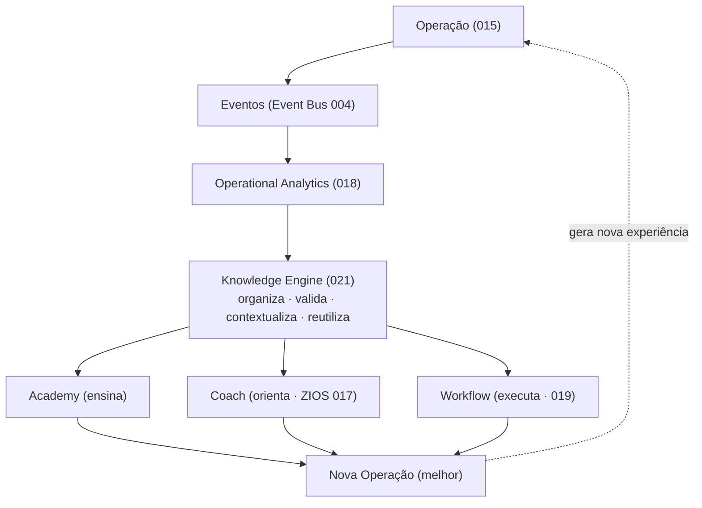
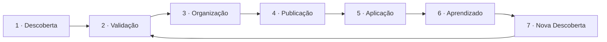
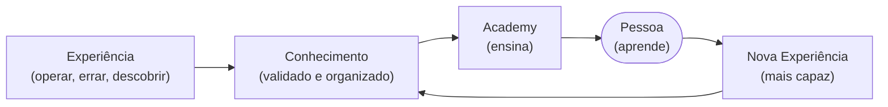
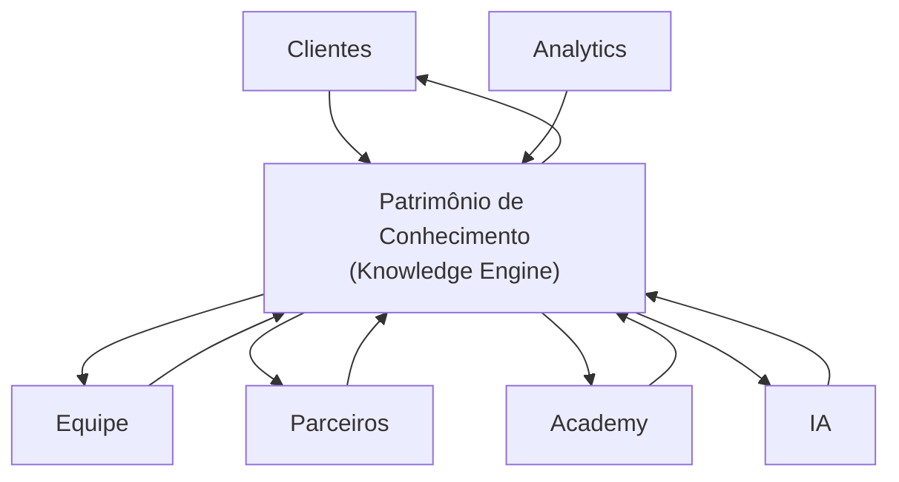

# 021 — Knowledge Engine

> **Arquitetura funcional da Zion Platform — Épico 3: Knowledge Intelligence.** Define o Capability que **transforma toda a experiência operacional da plataforma em conhecimento reutilizável**. É um documento de **arquitetura funcional** — **sem implementação**. Não descreve cursos, Academy, documentação, IA nem código; descreve **o motor que organiza conhecimento**.

> [!important] Registro oficial — dados não são conhecimento
> **Dados não são conhecimento. Experiência não é conhecimento. Conhecimento é experiência organizada, validada, contextualizada e reutilizável.** O Knowledge Engine existe para produzir **conhecimento** — não para armazenar informação.

> [!important] Fronteira de responsabilidades
> **O Knowledge Engine organiza o conhecimento. A Academy ensina. A IA utiliza. O Coach orienta. As Pessoas evoluem. Essas responsabilidades nunca devem ser misturadas.**

> **Autoridade e escopo.** Em divergência de nomenclatura, **[000 — Business Domain](./000-business-domain.md) prevalece**. Este motor é a espinha do laço "Empresa que Aprende" já registrado em [company/001](../company/001-business-operating-system.md) e da regra-mãe "nunca inventar" do [ZIOS (017)](./017-zion-intelligence-operating-system.md). Não altera `000`–`020`, o roadmap, a camada Product nem a camada Company.

> **Referências:** [014 Operational Maturity](./014-operational-maturity-engine.md) · [016 Implantation Journey](./016-implantation-journey.md) · [017 Zion Intelligence Operating System](./017-zion-intelligence-operating-system.md) · [018 Operational Analytics](./018-operational-analytics.md) · [019 Workflow Engine](./019-workflow-engine.md) · [020 People Intelligence](./020-people-intelligence-engine.md) · [company/001 Business Operating System](../company/001-business-operating-system.md) · [brand/000 Brand DNA](../brand/000-brand-dna.md).

---

## 1. Objetivo

O **Knowledge Engine** é o Capability que **transforma experiência em conhecimento** — capturando o que a operação, as pessoas, a IA e o ecossistema descobrem, e convertendo isso em um **patrimônio intelectual organizado, validado e reutilizável**.

Ele responde:
- Como a Zion **aprende**?
- Como uma **descoberta** vira conhecimento?
- Como um **erro** vira aprendizado?
- Como uma **boa prática** vira padrão?
- Como o conhecimento **evolui**?
- Como ele é **reutilizado**?

> [!important] Registro oficial — transforma, não apenas armazena
> O Knowledge Engine **nunca é um repositório**. Um repositório guarda informação; o Knowledge Engine **transforma** experiência bruta em conhecimento — organizado, validado, contextualizado e pronto para ser reusado. A diferença entre "ter dados" e "saber algo" é exatamente o trabalho deste motor.

---

## 2. Filosofia

1. **Conhecimento deve evoluir.** Nenhum conhecimento é final; ele se refina, se corrige e amadurece com o uso.
2. **Conhecimento deve ser compartilhado.** Conhecimento retido não gera valor; circula ou morre.
3. **Conhecimento precisa de contexto.** Uma prática só é útil quando se sabe **quando, onde e por que** ela vale.
4. **Conhecimento precisa ser validado.** Nem toda informação vira conhecimento; sem validação, é apenas ruído confiante.
5. **Conhecimento nunca pertence a uma pessoa — pertence ao ecossistema.** É patrimônio coletivo da Zion, dos clientes e dos parceiros, não propriedade de um indivíduo.
6. **Conhecimento cita a origem.** Toda peça de conhecimento sabe de onde veio (proveniência), como todo dado na Zion.

> Estes princípios aplicam, ao conhecimento, o que a Zion já faz com o dado: **organizar, validar, contextualizar e reutilizar — com origem e sem invenção** ([Brand DNA](../brand/000-brand-dna.md)).

---

## 3. Arquitetura Conceitual

O Knowledge Engine fica **no centro do laço de aprendizado**: recebe experiência bruta da operação/analytics, produz conhecimento e o devolve às camadas que ensinam, orientam e executam.

Leitura: a **operação** gera **eventos**; o **Analytics** observa padrões; o **Knowledge Engine** transforma esses padrões em **conhecimento validado**; **Academy** ensina, **Coach** orienta e **Workflow** aplica esse conhecimento — resultando em uma **operação melhor**, que gera nova experiência. O motor **organiza**; ele não ensina, não decide, não executa.

---

## 4. Fontes de Conhecimento

O Knowledge Engine **consome experiência** de todo o ecossistema:

| Fonte | O que fornece |
|-------|---------------|
| **Operação ([015](./015-operation-center.md))** | o que acontece de fato: Missões, correções, decisões. |
| **Analytics ([018](./018-operational-analytics.md))** | padrões, tendências, o que funcionou e o que não funcionou. |
| **People Intelligence ([020](./020-people-intelligence-engine.md))** | como as pessoas aprendem e onde estão as lacunas. |
| **IA ([017](./017-zion-intelligence-operating-system.md))** | recomendações que deram certo; padrões de raciocínio. |
| **Academy** | dúvidas, dificuldades, conteúdo que forma. |
| **Customer Success** | dores reais, playbooks de implantação, o que resolve. |
| **Parceiros** | casos de nicho, práticas de campo. |
| **Comunidade** | troca de práticas, perguntas, descobertas coletivas. |
| **Produto** | decisões de roadmap, o que mudou e por quê. |
| **Clientes** | contexto de operação real, resultados, feedback. |

> [!important] Experiência entra; conhecimento sai
> Nada dessas fontes é conhecimento por si só — é **matéria-prima**. O Knowledge Engine é o que transforma esse fluxo de experiência bruta em conhecimento **validado e contextualizado** ([§6](#6-ciclo-do-conhecimento)/[§7](#7-validação)).

---

## 5. Tipos de Conhecimento

O conhecimento é **categorizado** para ser encontrável e reutilizável:

| Tipo | O que é |
|------|---------|
| **Boas práticas** | o jeito comprovadamente melhor de fazer algo. |
| **Playbooks** | sequências de passos para situações recorrentes (ex.: implantar um cliente). |
| **Lições aprendidas** | o que um erro ou dificuldade ensinou (para não se repetir). |
| **Casos reais** | histórias concretas com contexto e resultado. |
| **Perguntas frequentes** | dúvidas recorrentes com respostas validadas. |
| **Padrões** | regularidades observadas ("produtos deste nicho respondem a X"). |
| **Processos** | fluxos operacionais estabelecidos. |
| **Decisões** | escolhas tomadas, com seu racional (jurisprudência da operação). |
| **Insights** | descobertas não óbvias extraídas de dados/experiência. |

> [!note] Cada tipo tem um uso
> Boas práticas e playbooks **guiam a ação**; lições aprendidas e decisões **evitam repetir erros**; casos e FAQs **ensinam**; padrões e insights **antecipam**. O tipo determina como Academy/Coach/Workflow o reutilizam.

---

## 6. Ciclo do Conhecimento

O conhecimento tem um **ciclo de vida** — da descoberta à nova descoberta:

| Etapa | O que acontece |
|-------|----------------|
| **Descoberta** | algo é notado (um padrão, uma prática, um erro, um insight). |
| **Validação** | verifica-se se aquilo é verdadeiro, repetível e útil ([§7](#7-validação)). |
| **Organização** | classifica-se (tipo), contextualiza-se (quando/onde vale) e conecta-se ao conhecimento existente. |
| **Publicação** | torna-se disponível para reuso (por Academy, Coach, Workflow). |
| **Aplicação** | é usado na operação real. |
| **Aprendizado** | o uso confirma, refina ou refuta o conhecimento. |
| **Nova Descoberta** | a aplicação gera novas observações — e o ciclo recomeça, num nível acima. |

> [!important] O conhecimento vive; não é congelado
> Publicar não encerra o ciclo. O uso **realimenta** o conhecimento — que evolui, é corrigido ou aposentado. Conhecimento que não é reaplicado nem revalidado **envelhece** e deve ser arquivado ([§12 eventos](#12-eventos)).

---

## 7. Validação

**Nem toda informação vira conhecimento.** A validação é o filtro que separa conhecimento de ruído confiante.

Critérios para uma informação ser promovida a conhecimento:

| Critério | Pergunta |
|----------|----------|
| **Verdadeiro** | é factualmente correto (não uma impressão)? |
| **Repetível** | vale mais de uma vez, em contextos comparáveis (não um acaso)? |
| **Contextualizado** | sabe-se **quando, onde e por que** se aplica (e quando **não**)? |
| **Com origem** | tem proveniência declarada (de onde/quem/que evidência)? |
| **Útil** | melhora uma decisão, uma operação ou um aprendizado? |
| **Não contraditório** | não conflita com conhecimento validado (ou o supera com evidência)? |

> [!important] Sem validação, não é conhecimento
> Uma opinião forte, um caso único ou uma correlação sem causa **não** são conhecimento — são candidatos. Só cruzam a linha o que passa na validação. Isto protege todo o ecossistema (Coach, Academy, IA) de propagar erro com confiança — a mesma disciplina do "**nunca inventar**".

---

## 8. Coach

O [Coach (ZIOS 017)](./017-zion-intelligence-operating-system.md) **utiliza** o conhecimento — **nunca o inventa**:

- **Sempre referencia conhecimento validado:** ao recomendar, o Coach se apoia em boas práticas/padrões/casos **já validados** pelo Knowledge Engine.
- **Nunca inventa:** se não há conhecimento validado para a situação, o Coach diz que **não sabe** (pendência), em vez de fabricar.
- **Cita a origem:** a recomendação pode apontar "baseado no padrão X / no caso Y".

> [!important] O Coach é a boca; o Knowledge Engine é a memória
> O Coach **orienta** com base no que o Knowledge Engine **organizou**. Ele não é a fonte do conhecimento — é quem o **aplica no momento certo**, sempre citando de onde veio. Assim, quanto mais a Zion aprende, mais sábio o Coach fica — sem nunca inventar.

---

## 9. Academy

A **Academy** transforma conhecimento em **aprendizagem**:

- O Knowledge Engine **fornece o conhecimento validado**; a Academy o **converte em cursos, trilhas, playbooks e mentorias**.
- Lacunas de conhecimento identificadas ([020](./020-people-intelligence-engine.md)/Academy) viram **novos conteúdos**.
- O conteúdo da Academy **cita o conhecimento-fonte** (rastreável ao Knowledge Engine).

> [!important] Organiza × ensina
> O Knowledge Engine **organiza** o conhecimento; a Academy **ensina**. São responsabilidades distintas ([registro oficial](#registro-oficial)): o motor não dá aulas, e a Academy não valida conhecimento por conta própria — ela consome o que foi validado.

---

## 10. Analytics

O [Operational Analytics (018)](./018-operational-analytics.md) é o **principal detector de conhecimento novo**:

- Identifica **padrões e tendências** que são candidatos a conhecimento ("produtos com foto humanizada convertem mais").
- Marca **anomalias** e **o que funcionou/não funcionou** — matéria-prima de lições aprendidas.
- Fornece **contexto e evidência** que a validação ([§7](#7-validação)) exige.

> [!note] Analytics vê; Knowledge Engine sabe
> O Analytics **observa** padrões ao longo do tempo; o Knowledge Engine os **valida, organiza e contextualiza** para virarem conhecimento reutilizável. Um padrão observado é uma descoberta; conhecimento é a descoberta **validada**.

---

## 11. IA

A [IA (ZIOS 017)](./017-zion-intelligence-operating-system.md) **aprende sem inventar** — o Knowledge Engine é o que torna isso possível:

- **Aprende:** reutiliza conhecimento validado (boas práticas, padrões, casos) para recomendar melhor.
- **Sem inventar:** só se apoia em conhecimento que passou na validação; falta de conhecimento vira pendência, não fabricação.
- **Reutiliza:** o mesmo conhecimento serve a muitos contextos, sem recriar do zero.
- **Cita origem:** toda aplicação de conhecimento pela IA aponta sua fonte (auditável no Ledger [017](./017-zion-intelligence-operating-system.md)).

> [!important] A IA fica mais inteligente porque a Zion aprende — não porque adivinha
> A inteligência da Zion cresce por **acúmulo de conhecimento validado**, não por chute mais sofisticado. O Knowledge Engine é o que separa "a IA aprendeu" de "a IA inventou". Sem ele, a IA repetiria erros com confiança; com ele, ela **se apoia no que a Zion realmente sabe**.

---

## 12. Eventos

O Knowledge Engine participa do [Event Bus](./004-event-bus.md).

**Eventos consumidos (matéria-prima):** sinais de Operação/Analytics/People/IA/Academy (ex.: `analytics.insight_created`, `analytics.trend_detected`, `people.learning.completed`, `workflow.completed`).

**Eventos produzidos:**

| Evento | Significado |
|--------|-------------|
| `knowledge.created` | uma nova peça de conhecimento foi validada e organizada. |
| `knowledge.updated` | um conhecimento existente evoluiu/foi refinado. |
| `knowledge.validated` | um candidato passou na validação e virou conhecimento. |
| `knowledge.archived` | um conhecimento envelheceu/foi superado e saiu de circulação. |
| `knowledge.reused` | um conhecimento foi aplicado (por Coach/Academy/Workflow). |

Princípio: todo evento é **auditável**, carrega **origem/contexto** do conhecimento e é **escopado** conforme a natureza (patrimônio coletivo vs. dado sensível de um tenant — ver [§Conhecimento Coletivo](#seção-especial--conhecimento-coletivo)).

---

## 13. Princípios

Princípios **oficiais** do Knowledge Engine:

1. **Dados/experiência não são conhecimento** — conhecimento é experiência organizada, validada, contextualizada e reutilizável.
2. **Organiza, não ensina/decide/executa** (fronteira com Academy/Coach/Workflow).
3. **Nem toda informação vira conhecimento** — a validação é obrigatória.
4. **Todo conhecimento tem contexto** (quando/onde/por que vale, e quando não).
5. **Todo conhecimento tem origem** (proveniência declarada).
6. **Conhecimento evolui** — é refinado, corrigido e arquivado; nunca congelado.
7. **Conhecimento é do ecossistema**, nunca de uma pessoa.
8. **Conhecimento é reutilizável** — organizado para ser encontrado e aplicado.
9. **A IA/o Coach nunca inventam** — só usam conhecimento validado, citando a origem.
10. **Conhecimento não reaplicado nem revalidado envelhece** e é arquivado.
11. **Contexto acima de dado bruto** — um número sem conhecimento não ensina.
12. **Privacidade respeitada** — dado sensível de um tenant não vira conhecimento coletivo sem anonimização/consentimento.

---

## 14. Critérios de Aceite

O Knowledge Engine está conforme esta visão quando **todos** os critérios abaixo são verdadeiros:

- [ ] **Transforma, não armazena:** produz conhecimento organizado/validado/contextualizado, não um repositório de informação.
- [ ] **Validação obrigatória:** nada vira conhecimento sem passar nos critérios (§7).
- [ ] **Tipos e contexto:** todo conhecimento tem tipo, contexto (quando/onde/por que) e origem.
- [ ] **Ciclo de vida:** conhecimento é criado, atualizado, reusado e arquivado (não congelado).
- [ ] **Fronteira respeitada:** organiza; não ensina (Academy), não orienta (Coach), não executa (Workflow), não decide (humano/IA).
- [ ] **Coach/IA sem invenção:** só aplicam conhecimento validado, citando origem; falta de conhecimento vira pendência.
- [ ] **Analytics alimenta:** padrões/insights viram candidatos a conhecimento, com evidência.
- [ ] **Academy consome:** conhecimento validado vira aprendizagem, rastreável à fonte.
- [ ] **Eventos corretos:** produz `knowledge.created/updated/validated/archived/reused`; todos auditáveis.
- [ ] **Patrimônio coletivo com privacidade:** conhecimento é do ecossistema; dado sensível de tenant é protegido/anonimizado ([RLS 010](./010-database-compliance.md)).

---

## Seção especial — O Ciclo do Conhecimento

Como a experiência de uma pessoa vira conhecimento e volta como capacidade:

**Narrativa:** alguém descobre algo operando (Experiência); o Knowledge Engine valida e organiza (Conhecimento); a Academy transforma em aprendizagem; a Pessoa aprende e volta à operação mais capaz — gerando nova experiência que enriquece o conhecimento. É o mesmo ciclo virtuoso do [People Intelligence (020)](./020-people-intelligence-engine.md) e do [Business Operating System (company/001)](../company/001-business-operating-system.md), agora com o **conhecimento** no centro.

---

## Seção especial — Conhecimento Coletivo

Todos alimentam **o mesmo patrimônio intelectual** da Zion:

| Quem contribui | Com o quê | E recebe de volta |
|----------------|-----------|-------------------|
| **Clientes** | contexto e resultados reais | melhores práticas e recomendações. |
| **Equipe** | dores e soluções de campo | playbooks e conhecimento consolidado. |
| **Parceiros** | casos de nicho | especialização e certificação. |
| **Academy** | dúvidas e formação | conteúdo mais preciso. |
| **Analytics** | padrões e evidências | validação e contexto. |
| **IA** | recomendações bem-sucedidas | conhecimento para recomendar melhor. |

> [!important] Patrimônio coletivo, privacidade preservada
> O conhecimento é **do ecossistema** — cresce com todos e serve a todos. Mas o **dado sensível de um cliente** nunca vira conhecimento coletivo sem **anonimização/consentimento**: aprende-se o **padrão** ("fotos humanizadas convertem mais"), nunca o **segredo** de uma empresa específica. Coletivo no aprendizado; privado no dado ([RLS 010](./010-database-compliance.md)).

---

## Seção especial — A Empresa que Aprende

> [!important] Registro oficial — a vantagem competitiva permanente
> **A maior vantagem competitiva da Zion não é tecnologia. É aprender mais rápido que o mercado.**

Tecnologia pode ser copiada; um framework, substituído; um modelo de IA, superado. O que **não** se copia é o **conhecimento acumulado** de como operações vencem no digital — validado, contextualizado, reutilizável e crescente a cada cliente.

O Knowledge Engine é o motor dessa vantagem: ele garante que **nada que a Zion aprende se perca**, que **cada cliente torne o próximo mais bem servido**, e que a inteligência da plataforma **cresça por acúmulo**, não por adivinhação. Enquanto a Zion aprender mais rápido do que o mercado, ela permanece à frente — independentemente da tecnologia que use.

**A Zion é, antes de tudo, uma empresa que aprende. O Knowledge Engine é onde esse aprendizado vira patrimônio.**

---

> **Registro oficial:** **O Knowledge Engine organiza o conhecimento. A Academy ensina. A IA utiliza. O Coach orienta. As Pessoas evoluem. Essas responsabilidades nunca devem ser misturadas. Conhecimento é experiência organizada, validada, contextualizada e reutilizável — nunca apenas informação armazenada.**

> **Status:** `021` — Knowledge Engine **v1.0 (arquitetura funcional)**. Documento **sem implementação**. Abre o **Épico 3 — Knowledge Intelligence**: transforma a experiência do ecossistema em conhecimento validado e reutilizável, alimentando Academy, Coach, Workflow e IA — sem nunca ensinar, decidir ou inventar. Alterações de escopo versionam este documento (v1.1, v2.0…) e nunca contrariam a fronteira de Fonte da Verdade de [000](./000-business-domain.md). **Próximo documento sugerido:** `docs/architecture/022-academy-engine.md` (o **Academy Engine** — o Capability que **transforma conhecimento em aprendizagem**: como o conhecimento validado do Knowledge Engine vira trilhas, cursos, playbooks, certificações e mentorias para operadores, gestores, clientes e parceiros; a integração com o [People Intelligence (020)](./020-people-intelligence-engine.md) para converter lacunas em desenvolvimento e com o Coach para o aprendizado no contexto; sempre **ensinando o que o Knowledge Engine organizou** — nunca validando conhecimento por conta própria, nunca inventando, sempre com a ética de evolução, não vigilância).
