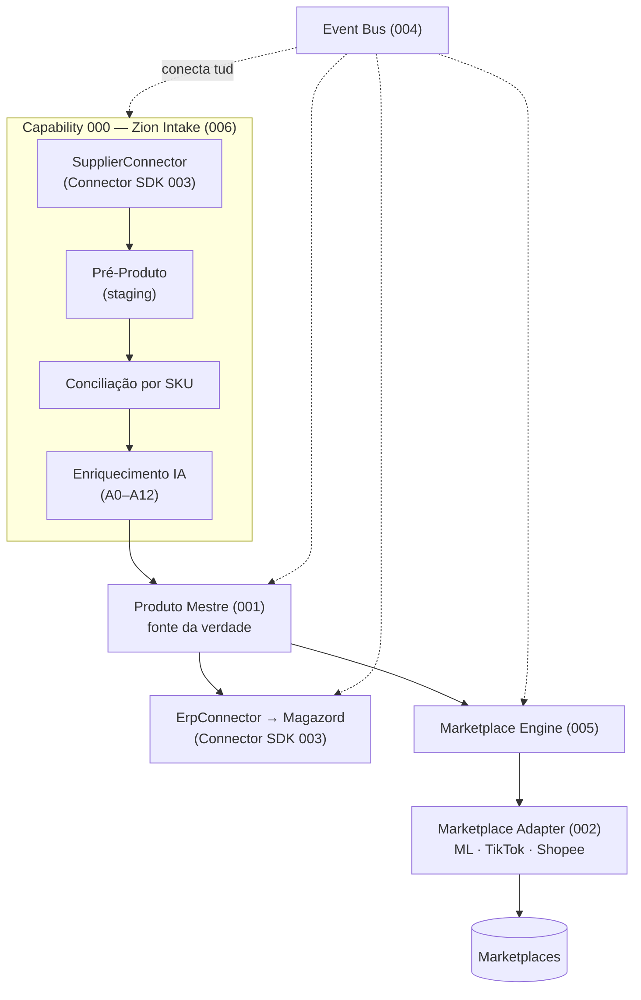

# Zion Platform — Arquitetura (fundação)

Documentação **definitiva de arquitetura** da Zion Platform. Etapa exclusivamente de arquitetura — **não há implementação** nestes documentos. Eles são a fonte da verdade de design para todas as capabilities.

## Contexto de negócio

O produto **nasce no fornecedor** e percorre:

```
Fornecedor → Catálogo/Excel/PDF/XML/Fotos/Drive/Site B2B
          → Zion Intake (Capability 000)
          → Produto Mestre (fonte da verdade do marketplace)
          → ERP (Magazord: estoque, fiscal, notas)
          → Marketplace (Mercado Livre) → futuramente TikTok Shop e Shopee
```

**Princípios fundadores:**
- **SKU do fornecedor = chave principal de conciliação.** EAN é complementar.
- **Zion é a Fonte da Verdade da operação de marketplace** (conteúdo, publicação, preço de venda, saúde do anúncio).
- **ERP (Magazord) é a fonte da verdade de estoque, fiscal e nota.** A Zion consome/propaga, não substitui.
- **Tudo é assíncrono, idempotente e auditável** (via Event Bus).
- **Toda integração externa implementa o mesmo contrato** (Connector SDK).

## Camadas e como os documentos se encaixam



## Documentos

| # | Documento | O que define |
|---|-----------|--------------|
| 001 | [Product Master](./001-product-master.md) | Modelo canônico do Zion (SKU fornecedor/ERP/marketplace, variações, imagens, SEO, categoria, status, histórico, versionamento). |
| 002 | [Marketplace Adapter](./002-marketplace-adapter.md) | Contrato de adaptador de marketplace (ML como referência; TikTok/Shopee implementam o mesmo). |
| 003 | [Connector SDK](./003-connector-sdk.md) | Interface padrão de **qualquer** integração (fornecedor, ERP, marketplace, futuras). |
| 004 | [Event Bus](./004-event-bus.md) | Backbone de eventos assíncronos, idempotentes e auditáveis. |
| 005 | [Marketplace Engine](./005-marketplace-engine.md) | Runtime que orquestra os adapters (fila, retry, rate-limit, reconciliação, fan-out multicanal). |
| 006 | [Capability 000 — Zion Intake](./006-capability-000-zion-intake.md) | A operação ponta a ponta: catálogo → pré-produto → produto mestre → conciliação → enriquecimento IA → ERP → publicação. |

## Relação de dependências (leitura sugerida)

`003 Connector SDK` é a base → `002 Marketplace Adapter` e o `ErpConnector`/`SupplierConnector` o especializam. `001 Product Master` é o dado central. `004 Event Bus` conecta os fluxos. `005 Marketplace Engine` orquestra os adapters sobre o Produto Mestre. `006 Zion Intake` compõe todos para a operação real.

## Convenções

- **Tenant/multiempresa:** todo dado é escopado por `organizacao_id` (agência) e, quando aplicável, `cliente_id` (empresa-cliente). Segurança real por RLS (padrão já adotado no Zion OS, migração 016).
- **Identificadores canônicos:** `supplier_sku` (chave 1ª de conciliação), `ean` (complementar), `erp_sku` (Magazord), `marketplace_item_id`/`marketplace_variation_id` (por canal).
- **Envelope de evento e chave de idempotência** padronizados (ver 004).
- **Estado atual × alvo:** onde citado, "estado atual" reflete o Zion OS de hoje (auditorias); "alvo" é o design desta fundação.
