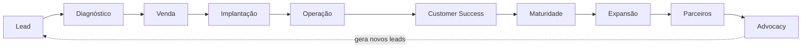
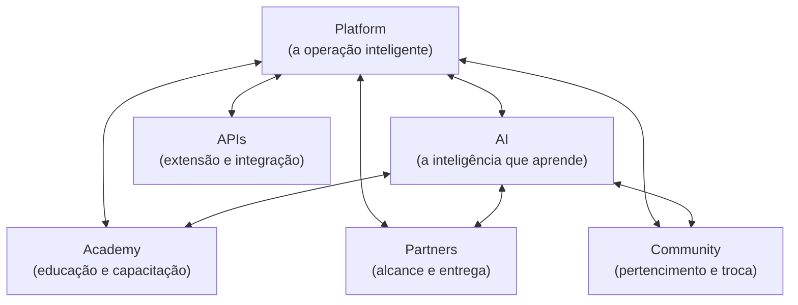
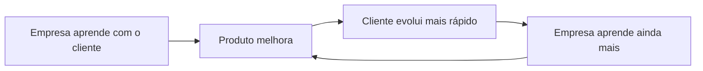
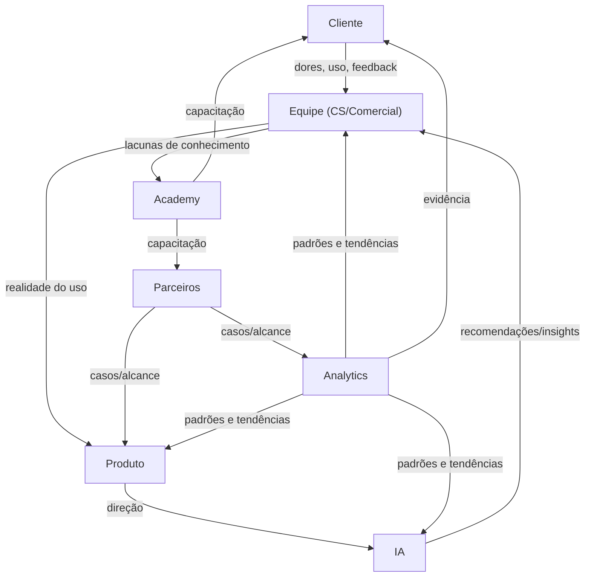
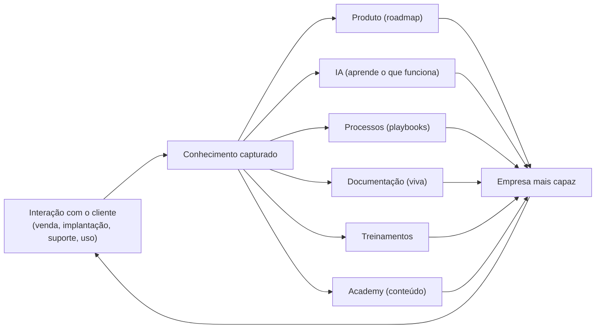

# 001 — Business Operating System

> **Como a Zion funciona como organização.** Este documento **não descreve software, funcionalidades nem telas.** Descreve **como a empresa Zion opera por dentro**: como um cliente entra e evolui, como cada área participa, como a informação circula, como as decisões são tomadas e como o conhecimento é reutilizado. Referência para Comercial, Customer Success, Produto, Engenharia, Marketing, Academy, Parceiros, Financeiro e Operações.

> [!important] Registro oficial
> **A Zion não é organizada por departamentos. Ela é organizada por fluxos de valor. Cada área existe para acelerar a evolução do cliente.**

> **Relação com as outras camadas.** Deriva da [Company Vision (000)](./000-company-vision.md) e do [Brand DNA](../brand/000-brand-dna.md). Onde cita a Plataforma, a IA, a Academy ou os Partners, o faz sob a ótica **da operação da empresa** — não da implementação técnica (essa é a camada Architecture/Product).

---

## 1. Objetivo

Definir oficialmente o **Business Operating System (BOS)** da Zion — o sistema pelo qual a empresa **transforma um lead em um cliente maduro e defensor da marca**, com todas as áreas trabalhando em torno do mesmo objetivo: **acelerar a evolução do cliente**.

> [!important] Processos conectados, não departamentos isolados
> A Zion **não cresce por departamentos isolados** que "passam a bola". Ela cresce por **processos conectados**, em que cada área recebe contexto da anterior, entrega valor à seguinte e devolve aprendizado ao todo. O BOS existe para garantir que a empresa opere como **um só organismo**, não como silos.

O BOS responde: como um cliente **entra**? como **evolui**? como cada área **participa**? como as informações **circulam**? como as decisões são **tomadas**? como os times **trabalham juntos**? como o conhecimento é **reutilizado**?

---

## 2. Filosofia

1. **Todos trabalham para o cliente.** Nenhuma área existe para si; toda função se justifica pelo valor que gera ao cliente.
2. **Toda decisão deve gerar aprendizado.** Acertos e erros voltam como conhecimento; nada se perde.
3. **Toda informação deve circular.** O que uma área descobre, as outras usam; contexto não fica preso.
4. **Todo processo pode evoluir.** Nenhum fluxo é sagrado; melhora contínua é o normal.
5. **A empresa aprende continuamente.** Cada interação torna a Zion mais capaz — no produto, na IA e nas pessoas.

Esses princípios espelham, na empresa, o que a Zion entrega ao cliente: **clareza, evolução contínua e humano no comando** ([Brand DNA](../brand/000-brand-dna.md)).

---

## 3. O Fluxo Oficial da Empresa

O fluxo de valor da Zion — do primeiro contato ao cliente defensor:

| Etapa | O que acontece | Quem conduz (apoio) |
|-------|----------------|---------------------|
| **Lead** | uma empresa descobre a Zion (marketing, indicação, advocacy). | Marketing (Comercial) |
| **Diagnóstico** | entende-se o negócio: segmento, porte, maturidade, dores. | Comercial (Produto/CS) |
| **Venda** | alinha-se a transformação esperada; começa uma parceria, não um contrato de software. | Comercial |
| **Implantação** | a empresa é ativada e conduzida do "escuro" ao operacional. | Customer Success (Produto) |
| **Operação** | o cliente opera o dia a dia com a plataforma e o time. | Cliente + Equipe |
| **Customer Success** | acompanha, remove bloqueios, conduz a evolução. | Customer Success |
| **Maturidade** | a operação vira inteligente; decisões guiadas por dado. | CS + Cliente |
| **Expansão** | mais canais, mais produtos, mais valor (upsell natural pela evolução). | Comercial + CS |
| **Parceiros** | agências/consultorias ampliam o alcance; o cliente pode virar parceiro. | Partners |
| **Advocacy** | o cliente vira defensor; sua história gera novos leads. | Marketing + CS |

> [!note] O fluxo é um ciclo, não uma linha
> A Advocacy **realimenta** o topo (novos leads). Um cliente maduro e satisfeito é o melhor canal de aquisição da Zion — por isso o sucesso do cliente é o motor do crescimento da empresa.

---

## 4. Áreas da Empresa

Cada área tem uma responsabilidade clara — e todas servem ao mesmo cliente:

| Área | Responsabilidade central |
|------|--------------------------|
| **Comercial** | entender a dor real, alinhar a transformação e iniciar a parceria; nunca vender o que não se entrega. |
| **Marketing** | levar clareza ao mercado, gerar demanda qualificada e amplificar a advocacy — na voz da marca. |
| **Produto** | traduzir a realidade do cliente em evolução da plataforma; decidir o que construir e por quê. |
| **Engenharia** | construir com qualidade, segurança e escala; tornar real o que o Produto define. |
| **Customer Success** | conduzir o cliente da implantação à maturidade; garantir que ele evolui e retém. |
| **Academy** | educar clientes, parceiros e mercado; transformar conhecimento em capacidade. |
| **Parceiros (Partners)** | ampliar o alcance via agências/consultorias; habilitar e apoiar quem opera com a Zion. |
| **Financeiro** | sustentar a operação com saúde; dar previsibilidade e responsabilidade com o recurso. |
| **Operações** | fazer a máquina funcionar: ferramentas, processos, dados e ritmo entre as áreas. |

> [!important] Toda área é uma área de cliente
> Nenhuma dessas áreas é "de suporte interno". Cada uma existe porque **acelera a evolução do cliente** — direta (CS, Produto) ou indiretamente (Financeiro, Operações). Se uma atividade não serve, no fim, à evolução do cliente, ela é candidata a ser repensada.

---

## 5. Como as Áreas Colaboram

Nenhuma área trabalha isolada. **Matriz de colaboração** (o que cada linha **entrega** às colunas):

| ↓ entrega para → | Comercial | Produto | CS | Marketing | Academy | Partners |
|------------------|:---:|:---:|:---:|:---:|:---:|:---:|
| **Comercial** | — | dores do mercado | contexto do cliente novo | casos/objeções | temas de dúvida | leads de parceria |
| **Produto** | narrativa do valor | — | melhorias/roadmap | diferenciais | conteúdo do que muda | capacidades a habilitar |
| **CS** | sinais de expansão | feedback real de uso | — | histórias de sucesso | lacunas de conhecimento | demanda por parceiros |
| **Marketing** | demanda qualificada | percepção do mercado | expectativas do lead | — | audiência/curadoria | co-marketing |
| **Academy** | argumentos educados | dúvidas recorrentes | clientes mais capazes | conteúdo/autoridade | — | parceiros certificados |
| **Partners** | alcance ampliado | casos de nicho | capacidade de entrega | prova social | multiplicadores | — |

> [!note] Handoffs carregam contexto
> Cada passagem de bastão (ex.: Comercial → CS na implantação) **carrega o contexto** já coletado (diagnóstico, expectativas). O cliente nunca "recomeça a explicar" — o que ele contou uma vez viaja com ele por toda a jornada.

---

## 6. O Cliente

O ciclo de vida completo — do primeiro contato ao defensor:

1. **Descoberta.** A empresa percebe que opera no escuro e busca clareza. (Marketing/Advocacy)
2. **Diagnóstico.** A Zion entende quem ela é e qual a transformação possível. (Comercial)
3. **Decisão.** A empresa entra numa parceria pela transformação, não por features. (Comercial)
4. **Implantação.** É conduzida do caos à operação; primeiros Quick Wins. (Customer Success)
5. **Operação.** Opera o dia a dia com clareza; a Zion vira rotina. (Cliente + Equipe)
6. **Evolução.** Sobe de maturidade; decisões passam a ser guiadas por dado. (CS)
7. **Expansão.** Mais canais/produtos; o valor cresce com a operação. (Comercial + CS)
8. **Advocacy.** Vira defensor; sua história atrai novos clientes; pode virar parceiro. (Marketing/Partners)

> [!important] O sucesso do cliente é o produto
> Para a Zion, "cliente bem-sucedido" não é consequência do negócio — **é o negócio**. Retenção, expansão e advocacy nascem de uma coisa só: **o cliente evoluiu de verdade.** Todo o BOS é desenhado para produzir essa evolução.

---

## 7. O Conhecimento

Todo conhecimento gerado pela empresa **retorna** para o organismo — nunca fica preso na cabeça de uma pessoa ou de uma área:

| O conhecimento volta para… | E melhora… |
|----------------------------|-----------|
| **Produto** | o que construir a seguir (roadmap guiado por realidade). |
| **Academy** | o que ensinar (conteúdo que resolve dúvidas reais). |
| **IA** | como recomendar melhor (aprender com o que funcionou). |
| **Marketing** | o que comunicar (casos, diferenciais, linguagem). |
| **Customer Success** | como conduzir (playbooks que aceleram a evolução). |

> [!important] Conhecimento é ativo, não subproduto
> Cada atendimento, cada implantação, cada objeção de venda **gera conhecimento** — e esse conhecimento é tratado como **ativo da empresa**, capturado e redistribuído. É o que faz a Zion ficar mais inteligente a cada cliente (ver [Empresa que Aprende](#seção-especial--empresa-que-aprende)).

---

## 8. Indicadores da Empresa

Os principais indicadores **conceituais** do BOS (sem fórmulas — a definição operacional fica com Operações/Financeiro):

| Indicador | O que revela |
|-----------|--------------|
| **Clientes ativos** | tamanho da base viva. |
| **Clientes implantados** | quantos cruzaram a linha "operando de verdade". |
| **Tempo de implantação** | quão rápido o cliente chega ao valor. |
| **Health médio** | saúde operacional média da base. |
| **Maturidade média** | quão inteligentes as operações da base estão. |
| **NPS / satisfação** | o quanto o cliente recomendaria a Zion. |
| **Retenção** | quantos permanecem (a prova de valor sustentado). |
| **Expansão** | crescimento de valor dentro da base existente. |
| **Academy** | alcance e capacitação (clientes/parceiros formados). |
| **Parceiros ativos** | força multiplicadora do ecossistema. |

> [!note] Indicadores servem à evolução, não à vaidade
> Estes indicadores existem para **guiar decisão e acelerar o cliente**, não para "parecer bem". Um número que sobe sem o cliente evoluir é um alerta, não uma conquista — coerente com a Lei da marca: **transparência, nunca vaidade**.

---

## 9. Decisões

Como a Zion decide — combinando cinco fontes, nunca uma só:

| Fonte | Papel na decisão |
|-------|------------------|
| **Dados** | o que os fatos e indicadores mostram (evidência). |
| **Experiência** | o que a equipe já aprendeu (conhecimento acumulado). |
| **Contexto** | a situação específica (segmento, momento, cliente). |
| **Produto** | o que é coerente com a plataforma e sua evolução. |
| **Cliente** | o que de fato acelera a evolução de quem servimos. |

Princípio: **decidir por evidência, não por opinião** — mas sem ignorar o contexto humano. Uma boa decisão da Zion **gera aprendizado** (registrado e redistribuído), independentemente do resultado.

---

## 10. Cultura Operacional

Como a Zion trabalha, no dia a dia:

- **Foco no cliente antes de tudo.** A pergunta que abre qualquer reunião: "isto acelera a evolução do cliente?".
- **Clareza acima de status.** Comunicação simples, direta, sem teatro corporativo.
- **Contexto compartilhado.** O que se sabe circula; ninguém opera no escuro internamente (a mesma promessa que fazemos ao cliente).
- **Calma operacional.** Ritmo sustentável; urgência real tratada com serenidade, não pânico.
- **Autonomia com responsabilidade.** As áreas decidem no seu escopo e respondem pelo resultado.
- **Aprendizado como hábito.** Retrospectivas, playbooks, documentação viva — o erro vira conhecimento, não culpa.
- **Uma só Zion.** Interno e externo coerentes: vivemos a marca que comunicamos.

> A cultura interna é o **espelho** da experiência que entregamos: se a Zion promete calma, clareza e evolução ao cliente, ela opera com calma, clareza e evolução por dentro.

---

## 11. O Ecossistema

A Zion opera como um ecossistema conectado — não como um produto isolado:

| Peça | Papel no ecossistema |
|------|----------------------|
| **Platform** | onde a operação do cliente acontece — o núcleo. |
| **Academy** | forma clientes e parceiros; transforma conhecimento em capacidade. |
| **Partners** | agências/consultorias que ampliam alcance e entrega. |
| **Community** | pertencimento, troca de práticas, advocacy. |
| **AI** | a inteligência que atravessa tudo e aprende com o ecossistema. |
| **APIs** | a porta de extensão/integração — a Zion se conecta ao mundo do cliente. |

> As peças **se alimentam**: a Academy forma parceiros; os parceiros trazem casos; os casos alimentam a IA e o Produto; a Community amplifica; as APIs estendem. O ecossistema é maior que a soma das partes.

---

## 12. Evolução

A Zion evolui num **ciclo virtuoso** entre empresa e produto:

- **O Produto melhora a Empresa:** cada capacidade nova torna a entrega mais forte, o CS mais eficaz, o comercial mais convincente.
- **A Empresa melhora o Produto:** cada atendimento, implantação e objeção volta como direção de roadmap.

> [!important] Registro
> **Produto melhora a empresa; empresa melhora o produto.** Esse laço é o motor da evolução contínua da Zion — a mesma evolução contínua que prometemos ao cliente, aplicada a nós mesmos.

---

## 13. Princípios

Princípios **oficiais** do Business Operating System:

1. **A empresa se organiza por fluxos de valor, não por departamentos.**
2. **Toda área existe para acelerar a evolução do cliente.**
3. **Nenhuma área trabalha isolada** — todo handoff carrega contexto.
4. **Toda informação circula** — contexto não fica preso.
5. **Todo conhecimento retorna** ao Produto, à IA, à Academy, ao CS e ao Marketing.
6. **Toda decisão gera aprendizado** — registrado e redistribuído.
7. **Decide-se por evidência**, com contexto humano.
8. **O sucesso do cliente é o negócio**, não um subproduto.
9. **A advocacy realimenta o crescimento** — cliente feliz é o melhor canal.
10. **Interno e externo são coerentes** — vivemos a marca que comunicamos.
11. **Calma operacional** — ritmo sustentável, urgência sem pânico.
12. **Melhora contínua é o normal** — nenhum processo é intocável.
13. **O ecossistema é maior que a plataforma** — Platform, Academy, Partners, Community, AI, APIs.
14. **Produto e empresa se melhoram mutuamente**, em ciclo.

---

## 14. Critérios de Aceite

O Business Operating System está sendo respeitado quando:

- [ ] **Toda área consegue explicar como acelera a evolução do cliente.**
- [ ] **Nenhum cliente "recomeça a explicar"** ao mudar de etapa (o contexto viaja).
- [ ] **O conhecimento de atendimentos/implantações retorna** ao Produto/IA/Academy/CS/Marketing de forma sistemática.
- [ ] **As decisões relevantes registram seu aprendizado** (não se perdem).
- [ ] **Os indicadores da empresa (§8) são acompanhados** e ligados à evolução do cliente (não à vaidade).
- [ ] **Os handoffs entre áreas carregam contexto** (matriz §5 na prática).
- [ ] **A cultura interna reflete a experiência externa** (calma, clareza, evolução).
- [ ] **O ecossistema (Platform/Academy/Partners/Community/AI/APIs) opera conectado**, não em silos.
- [ ] **A advocacy alimenta novos leads** de forma reconhecível.
- [ ] **Nenhuma atividade sobrevive sem servir, no fim, ao cliente.**

---

## Seção especial — A Jornada de um Cliente

Um exemplo completo, ligando o fluxo às áreas:

| Etapa | O que acontece | Áreas |
|-------|----------------|-------|
| **Lead** | uma loja de calçados descobre a Zion por um caso de sucesso de outra loja. | Marketing (Advocacy) |
| **Venda** | o Comercial entende a dor ("vendo sem saber se ganho") e alinha a transformação. | Comercial |
| **Implantação** | o CS conduz a ativação: conectar o ERP, importar o catálogo — os primeiros passos. | Customer Success |
| **Primeira publicação** | o primeiro produto vai ao ar; o primeiro Quick Win prova valor. | CS + Cliente |
| **Primeiras Missões** | a operação passa a ser conduzida por Missões priorizadas; o cliente ganha ritmo. | Cliente |
| **Maturidade** | custos configurados, margem confiável, decisões guiadas por dado; a operação virou inteligente. | CS |
| **Expansão** | a loja abre um segundo canal e amplia o catálogo — mais valor, naturalmente. | Comercial + CS |
| **Parceiro** | tão satisfeita e capaz que passa a indicar a Zion e a apoiar outras lojas do setor. | Partners + Marketing |

> [!important] Uma jornada, muitas mãos, um propósito
> Cada área tocou a jornada num momento — mas todas trabalharam para **a mesma coisa**: a loja sair do escuro e virar uma operação inteligente. O cliente sentiu **uma só Zion**, não uma sequência de departamentos.

---

## Seção especial — O Sistema Nervoso da Zion

Como a informação **circula** pelo organismo — o que garante que a empresa aja como um todo:

| Sinal | Vai de → para | Serve para |
|-------|---------------|-----------|
| **Feedback de uso** | Cliente → Equipe → Produto | direcionar o roadmap pela realidade. |
| **Insight da IA** | IA → Equipe → Cliente | recomendar o próximo passo. |
| **Lacuna de conhecimento** | Equipe → Academy | ensinar o que falta. |
| **Padrões** | Analytics → Produto/IA/Equipe | aprender o que funciona. |
| **Casos/alcance** | Parceiros → Produto/Marketing | ampliar e provar valor. |

> Assim como no cliente a informação **circula** para que ninguém opere no escuro, na Zion o "sistema nervoso" garante que **nenhuma área opere no escuro** — a empresa sente e reage como um organismo único.

---

## Seção especial — Empresa que Aprende

Cada interação com o cliente **gera conhecimento** — e esse conhecimento **realimenta** a empresa:

| Interação vira conhecimento que melhora… | Exemplo |
|------------------------------------------|---------|
| **Produto** | uma dor recorrente vira uma capacidade nova. |
| **IA** | uma recomendação que deu certo vira padrão de recomendação. |
| **Processos** | uma implantação difícil vira um playbook melhor. |
| **Documentação** | uma dúvida frequente vira uma seção clara. |
| **Treinamentos** | um erro comum vira um módulo de capacitação. |
| **Academy** | um caso de sucesso vira conteúdo para o mercado. |

> [!important] O que nos torna melhores a cada cliente
> A Zion não repete o mesmo esforço a cada cliente — ela **acumula**. Cada empresa que servimos nos ensina algo que torna a próxima implantação mais rápida, a próxima recomendação mais precisa e o próximo cliente mais bem servido. **A Zion é uma empresa que aprende — por isso melhora sozinha.**

---

> **Registro oficial:** **A Zion não é organizada por departamentos. Ela é organizada por fluxos de valor. Cada área existe para acelerar a evolução do cliente. Toda informação circula, todo conhecimento retorna, e a empresa aprende continuamente.**

> **Status:** `company/001` — Business Operating System **v1.0**. Deriva da [Company Vision (000)](./000-company-vision.md) e do [Brand DNA](../brand/000-brand-dna.md). Define o modelo operacional da empresa (fluxo de valor, áreas, colaboração, conhecimento, indicadores, cultura, ecossistema). **Próximo documento sugerido:** `docs/company/002-commercial-model.md` (o **Modelo Comercial** — como a Zion vende a transformação: o modelo de aquisição e qualificação, como o Comercial conduz o Diagnóstico e a Venda respeitando o Brand DNA ("vender transformação, nunca features; nunca prometer o que não se entrega"), o encaixe com Customer Success na Implantação, a lógica de Expansão pela evolução do cliente e o papel dos Parceiros e da Advocacy na aquisição — materializando a etapa Lead→Venda→Expansão deste BOS em um modelo comercial concreto).
