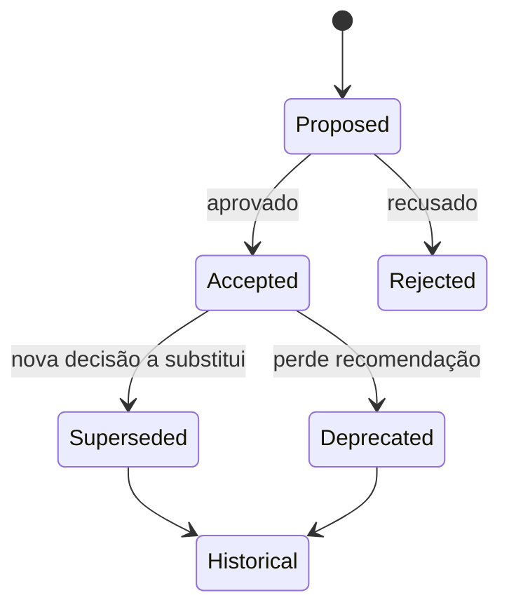
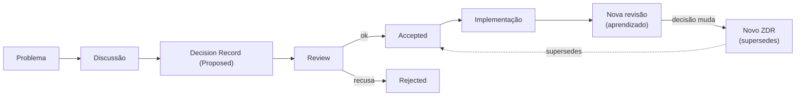
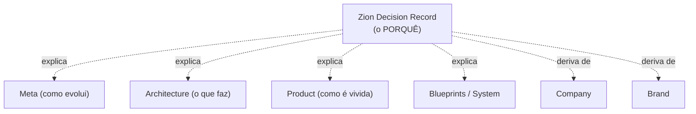

# Decisions/000 — Decision Record Methodology (Constituição dos Decision Records)

> **A Constituição dos Decision Records da Zion.** Este documento **não registra decisões específicas** — ele cria oficialmente a **metodologia para registrar decisões arquiteturais** da Zion. Toda decisão arquitetural futura deve seguir esta metodologia. Inspira-se em Architecture Decision Records (ADR), mas é **adaptada ao contexto da Zion** — não é a cópia de nenhum modelo externo.

> [!important] Registro oficial
> **Documentos descrevem a arquitetura. Decision Records descrevem por que ela é assim.** Toda decisão importante da Zion deve possuir um Decision Record. Os Decision Records **preservam o raciocínio arquitetural da empresa** — para que a arquitetura não dependa da memória das pessoas.

> **Relação com as camadas.** A camada **Decisions** (`docs/decisions/`) é regida pela [Architecture Methodology (meta/000)](../meta/000-architecture-methodology.md). Ela não descreve *o que a Zion é* nem *como evolui* — registra **por que** cada decisão foi tomada. Um Decision Record (doravante **ZDR — Zion Decision Record**) **nunca substitui** um documento de arquitetura; ele o **explica**.

---

## 1. Objetivo

Definir a metodologia oficial dos **Zion Decision Records (ZDR)** — o mecanismo pelo qual a Zion **transforma decisões arquiteturais implícitas em ativos explícitos, rastreáveis e atemporais**.

Hoje, decisões fundamentais estão **espalhadas** por dezenas de documentos (ex.: "Produto Mestre é a Fonte da Verdade", "ERP somente leitura", "a IA recomenda, o humano decide", "apresentação ≠ cálculo", "nunca criar um módulo quando um contexto resolve"). Elas são verdadeiras e vividas — mas o **raciocínio** por trás delas, as **alternativas** consideradas e as **consequências** aceitas não estão registrados num lugar único.

Esta metodologia responde:
- **Por que** registrar decisões?
- **Quando** uma decisão merece um Record?
- **Quem** pode criar? **Quem** aprova?
- **Quando** atualizar, substituir ou arquivar?

> [!important] O que um ZDR captura
> Um documento de arquitetura diz **"o Cost Engine calcula e o Analytics observa"**. Um ZDR diz **"decidimos separar cálculo de observação porque misturá-los produzia números divergentes; consideramos um engine único, mas rejeitamos por acoplamento; a consequência é uma camada a mais, aceita em nome da confiabilidade"**. O ZDR guarda o **porquê**, não o **quê**.

---

## 2. O que é uma Decisão

Nem tudo que se pensa é uma decisão. A escada do pensamento arquitetural:

| Nível | O que é | Vira ZDR? |
|-------|---------|:---------:|
| **Ideia** | uma possibilidade solta ("e se…?"). | Não |
| **Discussão** | o debate entre opções, ainda sem escolha. | Não (mas o ZDR pode citá-la) |
| **Hipótese** | uma aposta a ser testada, ainda reversível sem custo. | Não (a menos que se torne uma decisão) |
| **Decisão** | uma **escolha feita** entre alternativas, com consequências assumidas, que **direciona** a arquitetura. | **Sim** |
| **Implementação** | a materialização da decisão em software. | Não (é execução; o ZDR a precede) |

> [!important] O ZDR mora na "Decisão"
> Um ZDR só existe quando houve uma **escolha real entre alternativas**, com **consequências assumidas** e **impacto arquitetural**. Ideias, discussões e implementações **não** são ZDRs — são o antes e o depois da decisão.

---

## 3. Quando Criar um Decision Record

Cria-se um ZDR quando **todos** os critérios abaixo são verdadeiros:

| Critério | Pergunta |
|----------|----------|
| **Impacto arquitetural** | a decisão afeta responsabilidades, fronteiras, linguagem, Fonte da Verdade ou uma Product Law? |
| **Escolha entre alternativas** | havia mais de um caminho viável e um foi escolhido? |
| **Consequência assumida** | a escolha traz trade-offs que valem ser registrados? |
| **Durabilidade** | a decisão tende a valer por muito tempo (não é um ajuste passageiro)? |
| **Explicaria um "por quê" a um novo membro** | alguém, no futuro, perguntaria "por que é assim?" — e mereceria uma resposta registrada? |

Exemplos legítimos (decisões que **merecem** um ZDR, hoje espalhadas):
Produto Mestre como Fonte da Verdade · ERP somente leitura · IA recomenda / humano decide · Apresentação ≠ Cálculo · Analytics observa · Workflow executa · Knowledge organiza · Academy ensina · Coach orienta · Operational Maturity mede · Toda informação tem origem · Toda informação tem dono · Uma prioridade máxima por tela · Toda tela responde "o que fazer agora?" · Nunca criar um módulo quando um contexto resolve.

---

## 4. Quando NÃO Criar

Evitar a **inflação de ZDRs** — ADRs em excesso poluem e perdem valor. **Não** se cria um ZDR para:

| Situação | Onde vai |
|----------|----------|
| **decisões triviais** (nome de variável, detalhe de layout) | lugar nenhum / Blueprint. |
| **documentação técnica** (como algo funciona) | camada Architecture/Product. |
| **bugs** e suas correções | rastreio de bugs. |
| **tarefas** operacionais | gestão de trabalho. |
| **opiniões** sem escolha feita | não é decisão. |
| **decisão já registrada** | atualizar/superseder o ZDR existente, não duplicar. |
| **ajuste reversível sem custo** (hipótese) | testar; virar ZDR só se se firmar. |

> [!important] Regra da parcimônia
> Um ZDR é caro de manter e valioso quando raro. **Na dúvida, não crie.** Um bom conjunto de ZDRs tem **poucas decisões fortes** bem registradas — não centenas de micro-registros. (Espelha o princípio da [Metodologia (meta/000)](../meta/000-architecture-methodology.md): "criar é a última opção".)

---

## 5. Estrutura Oficial

Todo ZDR possui, **obrigatoriamente**, estes campos, nesta ordem:

| Campo | O que registra |
|-------|----------------|
| **Título** | a decisão em uma frase (`ADR-NNN — <decisão>`). |
| **Status** | o estado atual ([§6](#6-estados-oficiais)). |
| **Contexto** | a situação que exigiu a decisão (o pano de fundo). |
| **Problema** | a questão específica a resolver. |
| **Alternativas consideradas** | os caminhos viáveis avaliados (com prós/contras). |
| **Decisão** | a escolha feita, em uma frase clara. |
| **Justificativa** | por que esta alternativa venceu as outras. |
| **Consequências** | o que muda por causa dela (positivas e negativas/trade-offs). |
| **Impactos** | quem/o quê é afetado (Capabilities, telas, linguagem, outras decisões). |
| **Documentos relacionados** | os documentos que a decisão sustenta ou de que deriva. |
| **Data** | quando foi tomada. |
| **Responsável** | quem a propôs/é dono. |

> [!note] Modelo (esqueleto de referência)
> ```
> # ADR-NNN — <decisão em uma frase>
> Status: <Proposed | Accepted | Superseded por ADR-XXX | Deprecated | Rejected | Historical>
> Data: <AAAA-MM-DD>   ·   Responsável: <nome/papel>
>
> ## Contexto
> ## Problema
> ## Alternativas consideradas
> ## Decisão
> ## Justificativa
> ## Consequências (positivas / trade-offs)
> ## Impactos
> ## Documentos relacionados
> ```
> O ZDR é **curto e completo**: uma decisão, todos os campos, sem enrolação.

---

## 6. Estados Oficiais

O ciclo de vida de um ZDR:

| Estado | Significado |
|--------|-------------|
| **Proposed** | a decisão foi registrada e aguarda revisão/aprovação. Ainda não é lei. |
| **Accepted** | aprovada e vigente. É a decisão oficial em vigor. |
| **Superseded** | substituída por um ZDR mais novo (`Superseded por ADR-XXX`). Continua legível pelo valor histórico. |
| **Deprecated** | não recomendada para novo trabalho, mas ainda presente no sistema; caminho de saída indicado. |
| **Rejected** | uma alternativa que foi **considerada e recusada**. Registrada de propósito (ver [O Valor Histórico](#seção-especial--o-valor-histórico)). |
| **Historical** | mantida apenas como registro do passado; não orienta o presente, mas preserva a memória. |



> [!important] ZDR nunca é apagado
> Um ZDR **jamais é deletado** — muda de estado. Uma decisão superada ou rejeitada continua no acervo, porque **o raciocínio permanece valioso** mesmo quando a decisão não vige mais.

---

## 7. Processo de Evolução

Como uma decisão nasce, é aprovada e evolui:



| Etapa | O que acontece |
|-------|----------------|
| **Problema** | surge uma questão arquitetural real. |
| **Discussão** | as alternativas são debatidas. |
| **Decision Record (Proposed)** | a decisão e seu raciocínio são registrados. |
| **Review** | revisão de arquitetura ([meta/000 §14](../meta/000-architecture-methodology.md)) aprova ou recusa. |
| **Accepted / Rejected** | vira decisão oficial, ou fica registrada como recusada. |
| **Implementação** | a decisão vira software (fora do escopo do ZDR). |
| **Nova revisão** | o uso ensina; se a decisão precisa mudar, nasce um **novo ZDR** que **supersedes** o anterior — nunca se reescreve o antigo em silêncio. |

---

## 8. Hierarquia

> [!important] ZDRs registram o "porquê"; nunca substituem os documentos.

Um ZDR **nunca** substitui — apenas **explica** — os documentos de:

| Camada | O documento diz… | O ZDR diz… |
|--------|------------------|------------|
| **Architecture** | *o que* o Capability faz | *por que* ele existe/é assim |
| **Product** | *como* a experiência é | *por que* foi desenhada assim |
| **Meta** | *como* a arquitetura evolui | *por que* uma regra foi adotada |
| **Company** | *como* a empresa opera | *por que* o modelo é este |
| **Brand** | *quem* a Zion é | *por que* a identidade é esta |

Se um ZDR e um documento de arquitetura se contradizem, **o documento vence** (ele é a fonte do *quê*); o ZDR deve ser atualizado/superseded. O ZDR é a **memória do raciocínio**, não a autoridade sobre o conteúdo.

---

## 9. Critérios de Qualidade

Um bom ZDR é:

| Qualidade | Significa |
|-----------|-----------|
| **Claro** | qualquer pessoa entende a decisão em uma leitura. |
| **Objetivo** | uma decisão por Record; sem divagação. |
| **Justificado** | o "por quê" é explícito, não subentendido. |
| **Atemporal** | descreve o raciocínio, não uma tecnologia do momento (vale mesmo se o stack mudar). |
| **Rastreável** | aponta seus documentos relacionados e outros ZDRs (supersedes/related). |
| **Relacionado à arquitetura** | tem impacto real em responsabilidades/fronteiras/linguagem — não é trivial. |

---

## 10. Anti-padrões

ZDRs **proibidos** (rejeitar em revisão):

| Anti-padrão | Por quê |
|-------------|---------|
| **Registrar decisões triviais** | polui o acervo; ZDR perde valor. |
| **Usar ZDR como documentação técnica** | documentação vai para Architecture/Product. |
| **Criar ZDR para bugs** | bug não é decisão arquitetural. |
| **Criar ZDR para tarefas** | tarefa é execução, não decisão. |
| **Criar ZDR para opiniões** | sem escolha feita, não é decisão. |
| **Duplicar decisões** | atualizar/superseder o existente, nunca clonar. |
| **ZDR sem alternativas** | sem alternativas, não houve decisão — houve default. |
| **ZDR sem consequências** | uma decisão sem trade-offs registrados está incompleta. |
| **Apagar um ZDR** | muda-se o estado; nunca se deleta o raciocínio. |

---

## 11. Relação com a Arquitetura

Como um ZDR conversa com cada camada:



- **Deriva de** Brand/Company: muitas decisões nascem da identidade e do modelo de negócio (ex.: "transparência ≠ vigilância" vem da marca).
- **Explica** Architecture/Product/Blueprints/System/Meta: dá o raciocínio por trás do que esses documentos afirmam.
- **É governado por** Meta ([meta/000](../meta/000-architecture-methodology.md)): a Metodologia da Arquitetura define quando e como registrar; esta Constituição a operacionaliza para decisões.

> [!important] O ZDR é a cola do "porquê"
> As camadas descrevem **o quê** e **como**; o ZDR preenche o **por quê** que, hoje, mora apenas na cabeça de quem participou das discussões. Ele torna esse raciocínio um **ativo da empresa**, não um conhecimento tácito.

---

## 12. Critérios de Aceite

A metodologia de ZDRs está sendo respeitada quando:

- [ ] **Toda decisão arquitetural importante tem um ZDR** (o raciocínio não vive só na memória).
- [ ] **Cada ZDR tem todos os campos obrigatórios** (§5), incluindo alternativas e consequências.
- [ ] **Cada ZDR registra uma escolha real** entre alternativas (não um default nem uma opinião).
- [ ] **Nenhum ZDR trivial/técnico/de-bug/de-tarefa** foi criado (§10).
- [ ] **Os estados são usados corretamente** (§6); nada é apagado — apenas muda de estado.
- [ ] **Superseção é explícita** (o novo aponta o antigo e vice-versa); nada muda em silêncio.
- [ ] **ZDRs não contradizem os documentos** que explicam (em conflito, o documento vence e o ZDR é atualizado).
- [ ] **O acervo permanece enxuto** — poucas decisões fortes, bem registradas.
- [ ] **Cada ZDR é claro, objetivo, justificado, atemporal e rastreável** (§9).
- [ ] **Decisões rejeitadas foram preservadas** pelo valor histórico.

---

## Seção especial — O Conhecimento das Decisões

Uma arquitetura que só existe na **memória das pessoas** é frágil: quando elas saem, o raciocínio vai junto. O que fica é "é assim porque sempre foi" — e ninguém sabe se ainda faz sentido mudar.

Os ZDRs resolvem isso ao **externalizar o raciocínio**:
- Um novo membro entende **por que** a arquitetura é assim — sem depender de quem estava na sala.
- Uma decisão pode ser **reavaliada com contexto** ("por que decidimos isso? ainda vale?") em vez de ser mudada às cegas.
- A empresa **não repete debates já encerrados** — a decisão e seu porquê estão registrados.

> [!important] A arquitetura não pode depender de memória
> Pessoas esquecem, mudam de time, saem. Se o **porquê** da arquitetura vive só na cabeça delas, a Zion perde seu raciocínio arquitetural a cada rotatividade. Os ZDRs transformam esse conhecimento tácito em **patrimônio explícito** — é o [Knowledge Engine (021)](../architecture/021-knowledge-engine.md) aplicado às **decisões**.

---

## Seção especial — Arquitetura Explicável

Uma boa arquitetura não explica apenas **o que** existe — explica **por que** existe.

Dois sistemas podem ter as mesmas caixas e setas, mas um é **explicável** e o outro é **arbitrário**:
- No explicável, cada fronteira tem uma razão registrada ("separamos cálculo de observação **porque**…").
- No arbitrário, as fronteiras "simplesmente são" — e ninguém sabe se pode movê-las.

Uma arquitetura explicável é uma arquitetura **evoluível**: só se muda com segurança o que se entende. Os ZDRs são o que torna a arquitetura da Zion **explicável** — cada decisão importante carrega seu raciocínio, suas alternativas e seus trade-offs.

> **A pergunta que um ZDR sempre responde:** *"por que não do outro jeito?"*. Uma arquitetura que responde essa pergunta em todas as suas decisões fortes é uma arquitetura que **se entende a si mesma**.

---

## Seção especial — O Valor Histórico

**Decisões rejeitadas também têm valor** — às vezes mais que as aceitas.

Um ZDR `Rejected` ou `Superseded` registra um caminho que a Zion **considerou e não seguiu** (ou seguiu e abandonou). Isso é ouro:
- Evita **re-debater** o que já foi analisado ("já pensamos nisso — eis por que não fizemos").
- Preserva o **contexto** de por que uma alternativa boa no papel foi recusada na prática.
- Permite **reabrir com consciência**: se o contexto mudou, um ZDR rejeitado pode inspirar um novo — agora com o histórico à vista.

> [!important] Nada se apaga; tudo ensina
> Um ZDR rejeitado não é um "erro no registro" — é **memória deliberada**. A Zion aprende tanto com o que escolheu quanto com o que recusou. Por isso nenhum ZDR é deletado: o acervo de decisões é a **história do raciocínio** da empresa, e a história inclui os caminhos não tomados.

---

> **Registro oficial:** **Toda decisão importante da Zion deve possuir um Decision Record. Documentos descrevem a arquitetura; Decision Records descrevem por que ela é assim. Os Decision Records preservam o raciocínio arquitetural da empresa — para que ela nunca dependa da memória das pessoas.**

> **Status:** `decisions/000` — Decision Record Methodology **v1.0**. Constituição dos Zion Decision Records (ZDR): quando criar (e quando não), estrutura oficial, estados, processo de evolução, hierarquia, qualidade e anti-padrões. Governada pela [Architecture Methodology (meta/000)](../meta/000-architecture-methodology.md). **Próximo documento sugerido:** `docs/decisions/ADR-001-product-master-as-single-source-of-truth.md` — o **primeiro ZDR**, registrando a decisão fundadora "**Produto Mestre é a Fonte da Verdade do marketplace**": o contexto (dados espalhados, verdades divergentes), o problema (quem é dono do conteúdo/preço/estado), as alternativas consideradas (ERP como dono, cada canal como dono, sem verdade única), a decisão, a justificativa (uma verdade que abastece N canais), as consequências (ERP read-only, espelhamento, versionamento) e os documentos relacionados ([000](../architecture/000-business-domain.md)/[001](../architecture/001-product-master.md)) — materializando esta metodologia no primeiro registro real.
