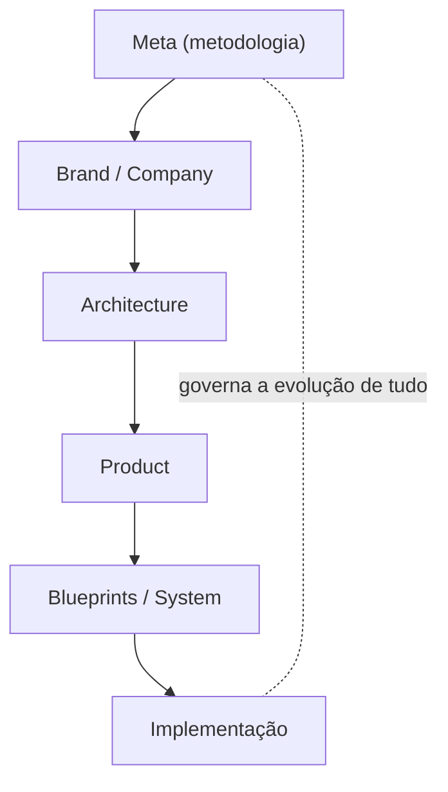
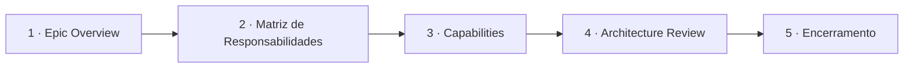

# Meta/000 — Architecture Methodology (Constituição da Arquitetura)

> **A Constituição da Arquitetura da Zion Platform.** Este documento **não descreve funcionalidades, produto, telas nem software.** Ele define **como a arquitetura e a documentação da Zion devem evoluir pelos próximos anos**. É a camada **Meta** — a que **governa todas as demais**. Toda nova documentação deve obedecê-lo.

> [!important] Registro oficial
> **A arquitetura da Zion deve permanecer simples na superfície e profunda na estrutura. Cada novo documento deve reduzir a complexidade percebida — nunca aumentá-la.** Toda decisão privilegia: clareza, simplicidade, responsabilidade única, baixo acoplamento, alta coesão, evolução contínua, reutilização, experiência do usuário e elegância arquitetural.

> **Relação com as outras camadas.** A camada **Meta** está **acima** de Architecture, Product, Blueprints, System, Company e Brand — ela não descreve *o que a Zion é*, mas *como a Zion deve ser documentada e evoluída*. Onde as [Product Laws (system/002)](../product/system/002-product-laws.md) governam a **experiência**, esta Metodologia governa a **arquitetura e a documentação**.

---

## 1. Objetivo

Definir a **metodologia oficial** de arquitetura e documentação da Zion — o conjunto de regras que garante que a plataforma cresça **coerente, elegante e sustentável** ao longo de muitos anos e centenas de documentos.

Ela responde:
- Como novos documentos **devem nascer**?
- Como novos Capabilities **devem ser criados**?
- Como **evitar duplicações**?
- Como manter a arquitetura **elegante**?
- Como garantir **evolução contínua**?
- Como **preservar a linguagem oficial**?
- Como **validar a qualidade arquitetural**?

> [!important] Autoridade
> Este documento **governa toda a documentação da Zion**. Nenhum documento novo — de qualquer camada — pode contrariar a Metodologia. Em conflito entre uma conveniência local e esta Constituição, **a Constituição vence**.

---

## 2. Filosofia

1. **Arquitetura é um organismo vivo.** Não é um monumento a ser preservado intacto; evolui, se adapta e se refina — com disciplina.
2. **Documentação é patrimônio da empresa.** Vale tanto quanto o código; é onde o conhecimento arquitetural vive e se transfere.
3. **Toda decisão privilegia a clareza.** Entre duas soluções corretas, vence a que se entende melhor.
4. **Elegância é prioridade.** A arquitetura elegante faz muito com pouco; a complexa faz pouco com muito.
5. **Simplicidade é uma obrigação, não um luxo.** Complexidade desnecessária é um defeito a ser corrigido, não uma sofisticação a ser exibida.

> A mesma filosofia que a Zion entrega ao cliente — **clareza, simplicidade, evolução** — aplica-se à forma como a Zion se documenta a si mesma ([Brand DNA](../brand/000-brand-dna.md)).

---

## 3. As Camadas Oficiais

A documentação da Zion se organiza em **sete camadas**, cada uma com um papel único:

| Camada | Pasta | Papel |
|--------|-------|-------|
| **Meta** | `docs/meta/` | governa como tudo evolui (esta camada). |
| **Architecture** | `docs/architecture/` | capacidades, responsabilidades, fronteiras, eventos, integrações — *como a Zion funciona por dentro*. |
| **Product** | `docs/product/` | experiência, UX, navegação, comportamento — *como a Zion é vivida*. |
| **Blueprints** | `docs/product/blueprints/` | especificação implementável de telas — *como se constrói*. |
| **System** | `docs/product/system/` | composição, leis de produto, design — *as regras transversais da experiência*. |
| **Company** | `docs/company/` | modelo de empresa, operação, comercial — *como a Zion funciona como negócio*. |
| **Brand** | `docs/brand/` | identidade permanente — *quem a Zion é*. |

> [!important] Cada camada tem uma pergunta
> Architecture = "como funciona?" · Product = "como é vivida?" · Blueprints = "como se constrói?" · System = "quais as regras transversais?" · Company = "como opera como negócio?" · Brand = "quem é?" · **Meta = "como tudo isso evolui?"**. Um documento que não se encaixa numa dessas perguntas provavelmente não deveria existir — ou pertence a outra camada.

---

## 4. Hierarquia dos Documentos

A ordem de autoridade entre camadas — de cima para baixo, o de cima prevalece:



| Camada | Obedece a |
|--------|-----------|
| **Meta** | — (governa a evolução; não descreve conteúdo) |
| **Brand / Company** | Meta (para evoluir); definem identidade e negócio |
| **Architecture** | Meta + Brand/Company + [Product Laws](../product/system/002-product-laws.md) |
| **Product** | + Architecture |
| **Blueprints / System** | + Product |
| **Implementação** | tudo acima |

> [!note] Meta governa a forma; as demais definem o conteúdo
> A Meta **não decide o que a Zion faz** — decide **como se documenta e se evolui a decisão**. Por isso está no topo da *governança*, ainda que Brand e Business Domain sejam as fontes da *identidade e das regras*.

---

## 5. Como Nasce um Novo Épico

Um Épico é um **bloco coerente de Capabilities** que resolve um tema maior (ex.: Inteligência Comercial, Knowledge Intelligence). Seu nascimento oficial:



| Etapa | O que produz |
|-------|--------------|
| **Epic Overview** | o propósito do Épico, o problema maior, as fronteiras e os Capabilities previstos. |
| **Matriz de Responsabilidades** | quem calcula/interpreta/apresenta/executa/mede — a separação de responsabilidades do Épico. |
| **Capabilities** | cada Capability documentado individualmente ([§6](#6-como-nasce-um-novo-capability)). |
| **Architecture Review** | uma revisão que consolida conceitos, resolve duplicações e lista reconciliações (como o [013a](../architecture/013a-architecture-review-epic2.md)). |
| **Encerramento** | o Épico é declarado consolidado; pendências viram itens de reconciliação. |

> [!important] Todo Épico termina com uma Review
> A **Architecture Review** é obrigatória: é onde se caçam conceitos repetidos, nomenclatura inconsistente, responsabilidades sobrepostas e conhecimento não documentado. Um Épico sem Review não está encerrado.

---

## 6. Como Nasce um Novo Capability

Todo Capability deve responder, explicitamente, **seis perguntas** antes de existir:

| Pergunta | Garante |
|----------|---------|
| **Por que existe?** | há uma razão real (não "seria legal"). |
| **Qual problema resolve?** | resolve algo concreto, não abstrato. |
| **Quem depende dele?** | tem consumidores reais. |
| **Quem consome?** | as saídas têm destino. |
| **Quem produz?** | as entradas têm fonte. |
| **O que nunca faz?** | a fronteira negativa é tão clara quanto a positiva. |

Além disso, todo Capability documenta: **objetivo, filosofia, arquitetura conceitual, fronteiras, eventos (consome/produz), integrações, princípios e critérios de aceite** — a estrutura já consolidada nos Capabilities 011–021.

> [!important] "O que nunca faz" é obrigatório
> A parte mais importante de um Capability é sua **fronteira negativa**. "O Cost Engine **nunca** decide" · "o Analytics **nunca** calcula" · "o People Intelligence **nunca** vigia". Sem a fronteira negativa, todo Capability tende a inchar e invadir o vizinho.

---

## 7. Critérios para Criar um Novo Capability

Um novo Capability só se justifica quando **todos** os critérios abaixo são verdadeiros:

| Critério | Significa |
|----------|-----------|
| **Responsabilidade única** | faz **uma** coisa; se faz duas, são dois Capabilities. |
| **Fronteira clara** | sabe-se exatamente o que ele faz e o que não faz. |
| **Valor arquitetural** | sua existência **simplifica** o todo (não apenas adiciona). |
| **Baixo acoplamento** | conecta-se por contratos/eventos, não por dependência interna. |
| **Alta coesão** | tudo nele serve ao mesmo propósito. |
| **Justificativa explícita** | as [seis perguntas do §6](#6-como-nasce-um-novo-capability) respondidas por escrito. |

---

## 8. Critérios para NÃO Criar um Capability

> [!important] Criar um novo Capability é sempre a **última** opção.

Antes de criar, prefira **expandir um documento existente** quando:

| Situação | Ação correta |
|----------|--------------|
| a necessidade é uma **variação** de algo existente | expandir o Capability existente. |
| a responsabilidade **se sobrepõe** a um Capability atual | esclarecer a fronteira do atual, não criar outro. |
| é apenas um **detalhe** de implementação | não é Capability; fica na camada de implementação. |
| existe por **conveniência organizacional** (não arquitetural) | não criar; organizar de outra forma. |
| não passa nas **seis perguntas** ([§6](#6-como-nasce-um-novo-capability)) | não criar. |
| aumenta a complexidade percebida sem simplificar o todo | não criar. |

> **A pergunta-teste:** *"este novo Capability torna a arquitetura mais simples de entender — ou apenas maior?"*. Se a resposta for "maior", ele não deve nascer.

---

## 9. Ownership

> [!important] Todo conceito da Zion possui **um** dono.

Nenhum conceito flutua sem responsável. O **mapa de ownership** (referência oficial — modelo; a lista viva cresce com a plataforma):

| Conceito | Documento oficial | Capability responsável | Quem apresenta | Quem altera | Quem consome |
|----------|-------------------|------------------------|----------------|-------------|--------------|
| Produto Mestre | [001](../architecture/001-product-master.md) | Product Master | Workspace | Equipe/Cliente/IA | todos |
| Custo | [013](../architecture/013-cost-engine.md) | Cost Engine | Workspace/Commercial | Cost Engine | 012/014/018 |
| Margem | [012](../architecture/012-commercial-intelligence-engine.md) | Commercial Intelligence | Workspace/Operação | Commercial | 014/018/020 |
| Health/Precisão/Maturidade | [014](../architecture/014-operational-maturity-engine.md) | Operational Maturity | telas | Maturity | todos |
| Analytics/Timeline histórica | [018](../architecture/018-operational-analytics.md) | Operational Analytics | telas | Analytics | 012/014/021 |
| Execução | [019](../architecture/019-workflow-engine.md) | Workflow Engine | Operação | Workflow | todos |
| IA/Recomendação | [017](../architecture/017-zion-intelligence-operating-system.md) | ZIOS | em todo lugar | IA propõe/humano decide | todos |
| Evolução das pessoas | [020](../architecture/020-people-intelligence-engine.md) | People Intelligence | Coach/Gestor | People Intelligence | Academy |
| Conhecimento | [021](../architecture/021-knowledge-engine.md) | Knowledge Engine | Academy/Coach | Knowledge Engine | IA/Academy |

Regra: se um conceito **não tem uma linha** neste mapa, ele **não está oficialmente definido** — e deve ser reconciliado (ver [§11](#11-evolução-arquitetural)).

---

## 10. Linguagem Oficial

Regras **inegociáveis** de nomenclatura (herdam a autoridade de [000 Business Domain](../architecture/000-business-domain.md)):

1. **Nunca criar sinônimos.** Um conceito, um nome. Não existe "tarefa" e "Missão" para a mesma coisa.
2. **Nunca renomear conceitos existentes** sem processo formal ([§11](#11-evolução-arquitetural)) — renomear quebra a rastreabilidade.
3. **Toda palavra nova deve ser justificada** — por que ela existe, o que a distingue do que já há.
4. **Em divergência de nomenclatura, 000 prevalece** — o Business Domain é a fonte da linguagem.
5. **Reconciliar variações**, não multiplicá-las (ex.: `BusinessHealthCard` → `HealthCard[scope=business]`, resolvido no [Catalog 004](../product/blueprints/004-component-catalog.md)).

> [!note] Glossário Oficial
> A Zion mantém um **Glossário Oficial** como parte da linguagem canônica — hoje distribuído em [000 Business Domain](../architecture/000-business-domain.md) (domínio) e no [Glossário da Vault](../obsidian/11 Glossário/Glossário.md) (navegação). Todo termo novo entra por lá; nenhum termo tem dois nomes. A consolidação de um Glossário Oficial único é um item de governança contínua ([meta/001, sugerido](#status)).

---

## 11. Evolução Arquitetural

Documentos evoluem por **processo**, nunca informalmente:

| Mecanismo | Quando/como |
|-----------|-------------|
| **Versionamento** | toda mudança de escopo versiona (v1.0 → v1.1 → v2.0); o status registra a versão. |
| **Reviews** | mudanças relevantes passam por Architecture Review; Épicos terminam em Review. |
| **Arquivamento** | conhecimento/documento superado é arquivado (não apagado) — preserva a história. |
| **Depreciação** | um conceito/documento marcado como *deprecated* aponta seu substituto; ninguém o usa em novo trabalho. |
| **Substituição** | um documento novo *supersedes* o antigo, com referência explícita nos dois sentidos. |
| **Compatibilidade** | mudanças preservam a linguagem e as fronteiras; quebras são explícitas e justificadas. |

> [!important] Nada muda em silêncio
> Toda evolução deixa **rastro**: versão, referência ao que substituiu, motivo. Um documento nunca "muda por baixo" de quem o consome — a mesma disciplina de **auditoria** que a Zion aplica ao dado.

---

## 12. Qualidade Arquitetural

Modelo **oficial** de avaliação — toda peça de arquitetura é medida por oito dimensões:

| Dimensão | Pergunta de avaliação |
|----------|------------------------|
| **Coesão** | tudo no documento/Capability serve ao mesmo propósito? |
| **Acoplamento** | conecta-se por contratos/eventos, com o mínimo de dependência? |
| **Legibilidade** | um novo membro entende sem precisar de tradução? |
| **Reutilização** | os conceitos/componentes são reaproveitados, não recriados? |
| **Escalabilidade** | cresce por composição, sem inchar? |
| **Experiência** | respeita a experiência do usuário e as [Product Laws](../product/system/002-product-laws.md)? |
| **Sustentabilidade** | será mantível daqui a anos, por outras pessoas? |
| **Elegância** | faz muito com pouco; parece simples? |

> Uma arquitetura de alta qualidade pontua bem em **todas** as oito — não em algumas. Elegância sem sustentabilidade é frágil; coesão sem legibilidade é inútil.

---

## 13. Product Laws Arquiteturais

Toda arquitetura da Zion **deve respeitar**, além desta Metodologia:

| Autoridade | O que impõe |
|-----------|-------------|
| **[Brand](../brand/000-brand-dna.md)** | a identidade permanente (clareza, humano no comando, evolução). |
| **[Company](../company/001-business-operating-system.md)** | o modelo de negócio (fluxos de valor, evolução do cliente). |
| **[Product Laws](../product/system/002-product-laws.md)** | as leis da experiência (nunca inventar, apresentação ≠ cálculo, transparência ≠ vigilância…). |
| **[Business Domain (000)](../architecture/000-business-domain.md)** | a linguagem oficial e a **Fonte da Verdade**. |
| **Responsabilidade Única** | cada Capability faz uma coisa. |

> [!important] A arquitetura serve à identidade, não o contrário
> Nenhuma elegância técnica justifica violar a Fonte da Verdade, uma Product Law ou a identidade da marca. A arquitetura é **meio**; a identidade e a experiência são **fim**.

---

## 14. Processo Oficial de Revisão

Todo documento novo/alterado passa por revisão antes de ser considerado oficial. **Checklist de revisão arquitetural:**

```
□ Encaixa-se numa camada oficial (§3) e responde a pergunta dela?
□ Tem responsabilidade única e fronteira clara (incl. "o que nunca faz")?
□ Responde as seis perguntas do Capability (§6), se for um?
□ Passou pelo teste "criar é a última opção" (§8)?
□ Cada conceito tem dono no mapa de ownership (§9)?
□ Respeita a linguagem oficial (§10) — sem sinônimos, sem renomear?
□ Não duplica responsabilidade de nenhum documento existente?
□ Baixo acoplamento / alta coesão (§12)?
□ Não contradiz Brand, Company, Product Laws nem Business Domain (§13)?
□ Reduz a complexidade percebida — não a aumenta?
□ Versão/status registrados; evolução rastreável (§11)?
□ Links resolvem; linguagem consistente; sem contradição com outros docs?
```

> [!important] Revisão é obrigatória
> Nenhum documento entra na base como "oficial" sem passar por este checklist. Épicos, além disso, terminam com uma **Architecture Review** dedicada.

---

## 15. Anti-padrões

Padrões **proibidos** — rejeitar em revisão:

| Anti-padrão | Por quê |
|-------------|---------|
| **Duplicar responsabilidades** | dois donos = verdades divergentes (viola Fonte da Verdade). |
| **Criar Engine sem justificativa** | as seis perguntas não respondidas; complexidade sem valor. |
| **Renomear conceitos** | quebra rastreabilidade e a linguagem oficial. |
| **Criar linguagem paralela** | fragmenta o produto; sinônimos confundem. |
| **Acoplamento desnecessário** | um Capability que conhece as entranhas de outro. |
| **Tecnologia dirigindo a arquitetura** | decidir por framework/moda, não por responsabilidade. |
| **Documentação contraditória** | dois documentos que se contradizem sobre o mesmo conceito. |
| **Capability "faz-tudo"** | responsabilidade não-única; inchaço. |
| **Documento sem "o que nunca faz"** | fronteira negativa ausente → invasão de vizinhos. |
| **Criar quando bastava expandir** | novo Capability como primeira opção, não última. |

---

## 16. Critérios de Aceite

A Metodologia está sendo respeitada quando:

- [ ] **Todo documento novo se encaixa numa camada oficial** e responde a pergunta dela.
- [ ] **Todo Capability novo respondeu as seis perguntas** e passou nos critérios (§7).
- [ ] **"Criar foi a última opção"** — expandir foi considerado primeiro (§8).
- [ ] **Todo conceito tem dono** no mapa de ownership (§9).
- [ ] **A linguagem oficial foi preservada** — sem sinônimos, sem renomeações informais (§10).
- [ ] **Nenhuma responsabilidade foi duplicada.**
- [ ] **A qualidade arquitetural (§12)** foi avaliada nas oito dimensões.
- [ ] **Nenhum anti-padrão (§15)** presente.
- [ ] **A evolução é rastreável** (versão, referências, motivo).
- [ ] **O documento reduz a complexidade percebida** — não a aumenta.
- [ ] **Nada contradiz Brand, Company, Product Laws ou Business Domain.**

---

## Seção especial — A Elegância da Arquitetura

> A melhor arquitetura **parece simples** — não porque é pobre, mas porque é **bem-resolvida**.

Elegância arquitetural não se mede por **quantidade de documentos**, mas por **quão fácil é entender o todo**. Uma arquitetura elegante tem poucas ideias fortes, bem separadas, que se compõem — não muitas ideias fracas que se sobrepõem.

Sinais de elegância:
- Um novo membro entende a plataforma **rápido**, porque cada peça tem um propósito claro.
- Adicionar algo novo é **plugar**, não **remendar**.
- Cada Capability se explica em uma frase ("o Cost Engine calcula"; "o Analytics observa").
- A complexidade **existe** (a operação é complexa), mas fica **escondida na estrutura**, não exposta na superfície.

> [!important] Mais documentos ≠ mais arquitetura
> Adicionar um Capability para "resolver mais rápido" quase sempre **piora** a arquitetura. A pergunta certa não é "o que posso criar?", mas "o que posso **não** criar e ainda resolver?". **A arquitetura mais forte da Zion será aquela que fizer o máximo com o mínimo de conceitos.**

---

## Seção especial — O Ciclo de Evolução

A arquitetura da Zion evolui em **espiral** — cada volta a torna mais capaz e mais coerente:


| Etapa | O que acontece |
|-------|----------------|
| **Visão** | uma direção estratégica (Brand/Company). |
| **Épico** | a direção vira um bloco de Capabilities. |
| **Capability** | cada peça é definida com responsabilidade única. |
| **Produto** | os Capabilities viram experiência (Product/Blueprints). |
| **Implementação** | a experiência vira software. |
| **Aprendizado** | o uso ensina (via Analytics/Knowledge Engine). |
| **Review** | o aprendizado gera revisão e reconciliação. |
| **Nova Visão** | a review realimenta a estratégia — e a espiral sobe. |

> A arquitetura nunca está "pronta" — está sempre **evoluindo com disciplina**. O que a mantém coerente ao longo das voltas é esta Metodologia.

---

## Seção especial — A Arquitetura daqui a 10 anos

Mesmo com **centenas de documentos** e tecnologia totalmente substituída, estes princípios **permanecem eternos**:

1. **Uma Fonte da Verdade por informação** — nunca dois donos.
2. **Responsabilidade única por Capability** — cada peça faz uma coisa.
3. **Fronteira negativa explícita** — todo Capability sabe o que **nunca** faz.
4. **Uma linguagem oficial** — sem sinônimos, sem renomeações informais.
5. **Baixo acoplamento, alta coesão** — composição, não emaranhado.
6. **Simples na superfície, profundo na estrutura** — complexidade escondida, não exposta.
7. **Criar é a última opção** — expandir e reusar vêm primeiro.
8. **Evolução rastreável** — nada muda em silêncio.
9. **A arquitetura serve à identidade e à experiência** — nunca o contrário.

**Como garantir coerência com centenas de documentos:** três garantias — **camadas** (cada documento tem um lugar), **ownership** (cada conceito tem um dono) e **revisão** (nada entra sem passar pelo checklist). Enquanto essas três forem honradas, o número de documentos cresce sem que a **complexidade percebida** cresça junto.

> [!important] O que nunca deve mudar
> A Zion pode trocar toda a sua tecnologia. O que **nunca** pode mudar é o **método**: manter a arquitetura simples na superfície, profunda na estrutura, com uma linguagem única e responsabilidades claras. Se a Zion perder isso, ganhará documentos e perderá arquitetura.

---

> **Registro oficial:** **A arquitetura da Zion deve permanecer simples na superfície e profunda na estrutura. Cada novo documento deve reduzir a complexidade percebida — nunca aumentá-la. Toda decisão privilegia clareza, simplicidade, responsabilidade única, baixo acoplamento, alta coesão, evolução contínua, reutilização, experiência do usuário e elegância arquitetural. Esta Metodologia governa toda a documentação da Zion.**

> **Status:** `meta/000` — Architecture Methodology **v1.0**. Constituição da Arquitetura: camadas oficiais, hierarquia, processo de Épicos e de Capabilities, critérios de criação (e de não-criação), ownership, linguagem oficial, evolução, qualidade arquitetural, revisão e anti-padrões. Governa Architecture, Product, Blueprints, System, Company e Brand. **Próximo documento sugerido:** `docs/meta/001-documentation-governance.md` (a **Governança da Documentação** — a operacionalização desta Metodologia: quem revisa e aprova cada camada, o fluxo de criação/revisão/versionamento na prática, o Glossário Oficial único e seu processo de curadoria, o índice mestre de documentos e seus status, as regras de nomenclatura de arquivos e numeração — e como manter tudo isso vivo e sem contradição à medida que a base cresce; onde a Metodologia diz *como a arquitetura evolui*, a Governança dirá *quem faz o quê, quando e como* para mantê-la).
