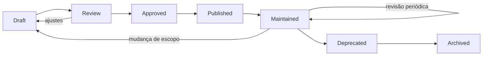
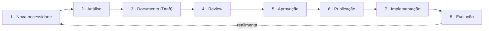
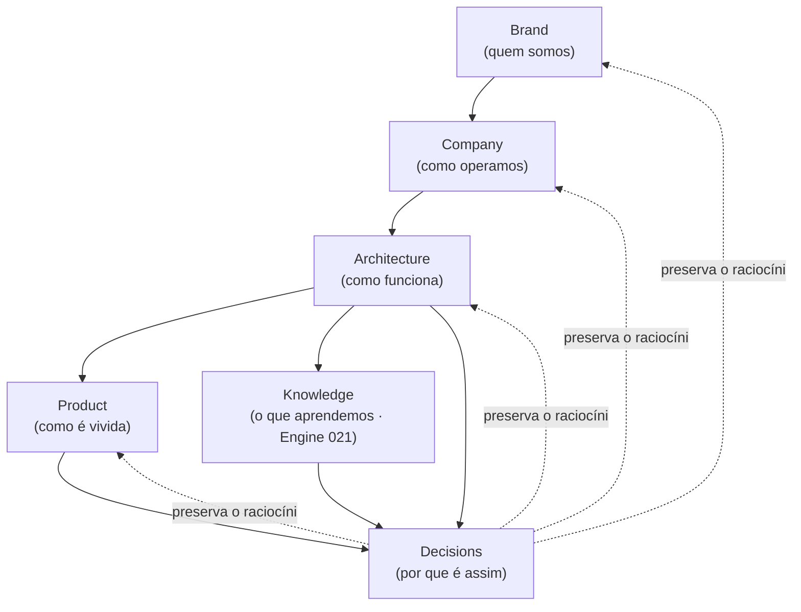

# Meta/001 — Documentation Governance

> **A Governança Oficial da Documentação da Zion.** Este documento **não descreve funcionalidades, arquitetura, produto nem telas.** Ele define **como toda a documentação da Zion é criada, revisada, aprovada, publicada, versionada e mantida** — para que dezenas (e, um dia, centenas) de documentos funcionem como **um único organismo**.

> [!important] Registro oficial
> **Toda documentação da Zion possui: dono · revisão · versão · status · histórico · propósito · fronteiras · rastreabilidade. Nenhum documento oficial poderá existir sem esses elementos.**

> **Relação com a Metodologia.** A [Architecture Methodology (meta/000)](./000-architecture-methodology.md) define **como a arquitetura evolui**. Esta Governança define **como a documentação é operada** — quem faz o quê, quando e como. Onde a Metodologia é a *constituição*, a Governança é o *regimento interno*.

---

## 1. Objetivo

Definir a **Governança Oficial da Documentação** — o conjunto de papéis, processos e regras que garante que a documentação da Zion seja **confiável, consistente e viva**, hoje e daqui a muitos anos.

Ela responde:
- **Quem** cria, revisa, aprova e mantém documentos?
- Como novos documentos **entram**?
- Como documentos **evoluem**?
- Como documentos são **aposentados**?
- Como manter **consistência** entre centenas de documentos?

> [!important] Autoridade
> Esta Governança **governa todas as camadas existentes** (Meta, Architecture, Product, Blueprints, System, Company, Brand, Decisions). Nenhuma camada está isenta do seu processo. Em conflito entre uma conveniência local e a Governança, **a Governança vence**.

---

## 2. Princípios

Princípios **oficiais** da governança documental:

1. **Documentação é patrimônio.** Vale tanto quanto o código; é o conhecimento da empresa tornado durável.
2. **Documentação precede implementação.** Entende-se e registra-se antes de construir — nunca o contrário.
3. **Toda documentação possui dono.** Sem dono, um documento apodrece; ownership é obrigatório.
4. **Toda documentação possui status.** Sabe-se sempre se um documento é rascunho, oficial ou aposentado.
5. **Toda documentação possui histórico.** Nada muda em silêncio; toda evolução deixa rastro.
6. **Toda documentação possui revisão.** Nada vira oficial sem passar por revisão.
7. **Toda documentação tem propósito e fronteiras.** Diz para que existe e o que **não** cobre.
8. **Toda documentação é rastreável.** Aponta de onde deriva e o que sustenta.
9. **Uma linguagem única.** Sem sinônimos, sem renomear conceitos ([meta/000 §10](./000-architecture-methodology.md)).
10. **A documentação é um organismo, não um arquivo.** Vive, evolui e é curada — não só "guardada".
11. **Simplicidade e clareza acima de volume.** Um documento a mais só se justifica se **reduzir** a complexidade percebida.
12. **Consistência entre camadas.** Nenhum documento contradiz outro; contradição é defeito a corrigir.
13. **A governança serve à identidade.** Respeita Brand, Company, Product Laws e Business Domain.

---

## 3. Camadas Oficiais

As **oito camadas** da documentação e como se relacionam:

| Camada | Pasta | Pergunta que responde |
|--------|-------|------------------------|
| **Meta** | `docs/meta/` | como a arquitetura e a documentação evoluem? |
| **Architecture** | `docs/architecture/` | como a Zion funciona por dentro? |
| **Product** | `docs/product/` | como a Zion é vivida? |
| **Blueprints** | `docs/product/blueprints/` | como se constrói (spec de tela)? |
| **System** | `docs/product/system/` | quais as regras transversais da experiência? |
| **Company** | `docs/company/` | como a Zion funciona como negócio? |
| **Brand** | `docs/brand/` | quem a Zion é? |
| **Decisions** | `docs/decisions/` | **por que** a arquitetura é assim? |

**Como se relacionam:** **Meta** governa a evolução de todas. **Brand/Company** definem identidade e negócio. **Architecture** define capacidades; **Product/Blueprints/System** a traduzem em experiência; **Decisions** guarda o *porquê* de tudo. A ordem de autoridade segue a [hierarquia do meta/000](./000-architecture-methodology.md): Meta → Brand/Company → Architecture → Product → Blueprints/System → Implementação, com Decisions explicando o raciocínio transversal.

> [!note] Camadas ≠ pastas técnicas
> As pastas `security/`, `staging-*`, `zion-os-audit/`, `agency-panel-separation/`, `implementation-phase-1-security/` e `obsidian/` são **documentação operacional/legada e a Vault de navegação** — não são camadas oficiais desta Governança, embora se beneficiem das mesmas boas práticas. A Governança rege as **oito camadas oficiais** acima.

---

## 4. Papéis

Responsabilidades por área — **quem cria, revisa, aprova e consulta** cada tipo de documento:

| Papel | Cria | Revisa | Aprova | Consulta |
|-------|------|--------|--------|----------|
| **Architecture** | Architecture, Decisions | todas as camadas técnicas | Architecture, Meta, Decisions | tudo |
| **Product** | Product, Blueprints, System | Product/Blueprints/System | Product, System | Architecture, Brand |
| **UX** | Blueprints, System (design) | Blueprints, System | — (co-aprova com Product) | Product, Brand |
| **Engineering** | (implementação) | Blueprints, Architecture (viabilidade) | — (aprova viabilidade) | tudo |
| **Business** | Company | Company | Company | Brand, Meta |
| **Brand** | Brand | Brand, tom de voz em qualquer doc | Brand | tudo |
| **Customer Success** | insumo p/ Company/Product | Company, Journey | — | Product, Company |
| **IA** | insumo (nunca aprova) | — | **nunca aprova** | tudo (para recomendar/citar) |

> [!important] Regras de papéis
> - **Todo documento tem um Owner** (um papel responsável) e passa por **Reviewers** e um **Approver** ([§7](#7-ownership)).
> - **A IA nunca aprova documentação** — pode ajudar a redigir e revisar, mas a aprovação é **humana** (herança da Product Law "IA recomenda, humano decide").
> - **Épicos e mudanças em constituições** (Meta, Product Laws, Brand) exigem revisão de **Architecture + Product/Business** conforme a camada.

---

## 5. Lifecycle

O ciclo de vida de todo documento:



| Estado | Significado |
|--------|-------------|
| **Draft** | em escrita; incompleto; não-oficial. |
| **Review** | em revisão pelos papéis responsáveis (volta a Draft se houver ajustes). |
| **Approved** | aprovado; cumpriu o checklist ([§13](#13-revisões)); pronto para publicar. |
| **Published** | oficial e em vigor; é a fonte da verdade daquele tema. |
| **Maintained** | publicado e sob **manutenção ativa** (revisões periódicas). |
| **Deprecated** | não recomendado para novo trabalho; aponta o substituto; ainda legível. |
| **Archived** | fora de circulação; preservado como registro histórico (nunca deletado). |

> [!important] Nada é deletado
> Um documento **jamais é apagado** — muda de estado. `Deprecated`/`Archived` preservam a história (como os [ZDRs](../decisions/000-decision-record-methodology.md)). A memória documental é patrimônio.

---

## 6. Processo Oficial

Passo a passo, da necessidade à evolução:



| Etapa | O que acontece |
|-------|----------------|
| **Nova necessidade** | surge uma lacuna real (um Épico, um Capability, uma tela, uma decisão). |
| **Análise** | verifica-se se já existe documento que resolve; "criar é a última opção" ([meta/000 §8](./000-architecture-methodology.md)). |
| **Documento** | escreve-se o Draft na camada correta, com dono, propósito e fronteiras. |
| **Review** | os papéis responsáveis revisam ([§13](#13-revisões)). |
| **Aprovação** | o Approver aprova; o status vira `Approved`. |
| **Publicação** | vira `Published` — oficial e citável. |
| **Implementação** | Blueprints/System/código materializam (quando aplicável). |
| **Evolução** | o uso ensina; mudanças versionam e realimentam o ciclo. |

---

## 7. Ownership

Todo documento carrega, no seu cabeçalho, o bloco de governança:

| Campo | O que registra |
|-------|----------------|
| **Owner** | o papel responsável pelo documento. |
| **Reviewer(s)** | quem revisa antes da aprovação. |
| **Approver** | quem dá o de-acordo final. |
| **Última revisão** | a data da última verificação. |
| **Próxima revisão** | quando deve ser revisado de novo. |
| **Status** | o estado no lifecycle ([§5](#5-lifecycle)). |
| **Versão** | a versão atual ([§8](#8-versionamento)). |

**Bloco de cabeçalho padrão (referência):**
```
─────────────────────────────────────────────
Owner:            <papel>
Reviewers:        <papéis>
Approver:         <papel>
Status:           Draft | Review | Approved | Published | Maintained | Deprecated | Archived
Versão:           vX.Y.Z
Última revisão:   AAAA-MM-DD
Próxima revisão:  AAAA-MM-DD
─────────────────────────────────────────────
```

> [!important] Sem dono, sem documento
> Um documento sem Owner **não é oficial** — é um rascunho órfão. Ownership é o que garante que alguém **responde** pela verdade e pela manutenção daquele documento.

---

## 8. Versionamento

Versão semântica adaptada à documentação (`MAJOR.MINOR.PATCH`):

| Nível | Quando usar | Exemplo |
|:-----:|-------------|---------|
| **MAJOR** (X.0.0) | mudança de escopo/estrutura ou de uma decisão fundadora; pode contradizer a versão anterior. | reescrever um Capability; mudar uma Product Law. |
| **MINOR** (x.Y.0) | acréscimo relevante que **não** quebra o existente. | nova seção, novo critério, novo exemplo. |
| **PATCH** (x.y.Z) | correção pequena, sem mudar sentido. | typo, link, ajuste de redação. |

**Como documentar mudanças:** toda alteração relevante registra **o que mudou, por quê e quando** (no status/histórico do documento). Mudanças MAJOR exigem **revisão** e, quando tocam decisões, um [ZDR](../decisions/000-decision-record-methodology.md). Um documento nunca muda de conteúdo sem mudar de versão.

> [!note] Compatibilidade
> MINOR/PATCH preservam a linguagem e as fronteiras. MAJOR pode quebrá-las — e, quando o faz, a quebra é **explícita e justificada**, com referência ao que foi superado.

---

## 9. Numeração

Padrão **oficial** para evitar conflitos (a fonte da inconsistência que já corrigimos — prototype↔blueprints, `005` duplicado):

**Regras:**
1. **Numeração por camada/pasta.** Cada pasta tem sua própria sequência `NNN-` (000, 001, …). O número é **único dentro da pasta**.
2. **Um número, um documento, por pasta.** Nunca dois `005-*` na mesma pasta.
3. **Prefixo por tipo quando fizer sentido.** Decisions usam `ADR-NNN-` para os registros e `000-` para a metodologia.
4. **Nome descritivo em kebab-case.** `NNN-<assunto-em-kebab>.md`.
5. **Números não se reaproveitam.** Um documento arquivado mantém seu número; o próximo continua a sequência.
6. **Subcamadas usam subpastas**, não "furos" na numeração da pasta-mãe (ex.: `product/blueprints/`, `product/system/`).

| Camada | Padrão | Exemplo |
|--------|--------|---------|
| **Architecture** | `NNN-<assunto>.md` | `013-cost-engine.md`, `013a-architecture-review-epic2.md` |
| **Product** | `NNN-<assunto>.md` | `004-operation-center.md` |
| **Blueprints** | `NNN-<assunto>-blueprint.md` | `002-product-workspace-blueprint.md` |
| **System** | `NNN-<assunto>.md` | `002-product-laws.md` |
| **Company** | `NNN-<assunto>.md` | `001-business-operating-system.md` |
| **Brand** | `NNN-<assunto>.md` | `000-brand-dna.md` |
| **Meta** | `NNN-<assunto>.md` | `000-architecture-methodology.md` |
| **Decisions** | `000-...` (metodologia) · `ADR-NNN-<decisão>.md` | `ADR-001-product-master-as-single-source-of-truth.md` |

> [!important] Colisão de número é um defeito de governança
> Antes de criar um documento, verifica-se o **próximo número livre da pasta**. Se um número parece "ocupado por engano", isso é um item de reconciliação — não se cria um segundo com o mesmo número (a regra que fecha a lacuna histórica).

---

## 10. Glossário

> [!important] Toda palavra oficial nasce **uma única vez**.

- Um conceito tem **um** nome canônico; sinônimos são proibidos ([meta/000 §10](./000-architecture-methodology.md)).
- A fonte da linguagem é o [Business Domain (000)](../architecture/000-business-domain.md); a navegação vive no [Glossário da Vault](../obsidian/11 Glossário/Glossário.md).

**Processo de evolução do Glossário:**
1. **Proposta:** um termo novo é proposto, justificando por que é necessário e o que o distingue.
2. **Verificação:** confirma-se que não é sinônimo de um termo existente.
3. **Aprovação:** entra no Glossário Oficial com definição, dono e documento-fonte.
4. **Renomeação (raro):** só por processo formal, com referência do nome antigo → novo (nunca em silêncio).
5. **Depreciação:** um termo superado é marcado, apontando o substituto.

> A consolidação de um **Glossário Oficial único** (unindo domínio + navegação) é um item de governança contínua — candidato ao [meta/002 Knowledge Map (sugerido)](#status).

---

## 11. Índice Mestre

Define-se o conceito de **Índice Mestre**: um **índice navegável único** de toda a documentação oficial, com o **status e a versão** de cada documento — a porta de entrada do organismo documental.

O Índice Mestre responde, num só lugar: *quais documentos existem, em que camada, em que status, em que versão, e quem é o dono?*. Ele é a visão de portfólio da documentação — o que permite enxergar lacunas, duplicações e documentos que precisam de revisão.

> [!note] Conceito registrado, artefato futuro
> Este documento **define o conceito** do Índice Mestre, mas **não o cria ainda**. Sua construção é candidata ao [meta/002 Knowledge Map (sugerido)](#status). A [Vault Obsidian](../obsidian/00 Dashboard/Home.md) já cumpre parte desse papel de navegação e pode ser a base do Índice Mestre.

---

## 12. Dependências

Como os documentos se referenciam sem virar um emaranhado:

- **Referência por link relativo.** Um documento aponta outro por link (rastreabilidade); nunca copia o conteúdo (evita duplicação).
- **Referenciar a fonte, não recontar.** Se um conceito é de outro documento, **linka-se** para ele — a explicação canônica mora numa casa só ([ownership](./000-architecture-methodology.md)).
- **Evitar ciclos.** A hierarquia de camadas ([§3](#3-camadas-oficiais)) define a direção: camadas de cima são referenciadas por camadas de baixo, não o contrário como dependência dura. Referências "para cima" são de contexto; dependências "para baixo" são de detalhe.
- **Evitar duplicações.** Se dois documentos explicam a mesma coisa, um está errado — consolida-se num dono e o outro **referencia**.
- **Links sempre resolvem.** Um link quebrado é um defeito de governança (verificável na revisão).

> [!important] Uma casa, muitas referências
> A regra "uma casa, muitas visões" da [Information Architecture](../product/002-information-architecture.md) vale também para a documentação: cada conceito é **explicado** num documento e **referenciado** pelos demais. Explicar o mesmo conceito em dois lugares é criar duas verdades.

---

## 13. Revisões

**Checklist oficial** — antes de aprovar qualquer documento, verificar:

```
□ Ownership — tem Owner, Reviewers, Approver, status e versão?
□ Linguagem — usa a linguagem oficial (sem sinônimos, sem renomear)?
□ Fronteiras — declara propósito e o que NÃO cobre ("o que nunca faz")?
□ Links — todos os links resolvem; referencia (não duplica)?
□ Responsabilidade — responsabilidade única; não invade outra camada/documento?
□ Product Laws — não viola nenhuma Lei da experiência (system/002)?
□ Brand — coerente com a identidade e o tom de voz (brand/000)?
□ Company — coerente com o modelo de negócio (company/001)?
□ Meta — segue a Metodologia da Arquitetura (meta/000)?
□ Decisions — decisões relevantes têm ou geram um ZDR (decisions/000)?
□ Numeração — número único e correto na pasta (§9)?
□ Complexidade — reduz a complexidade percebida, não aumenta?
```

> [!important] Revisão é obrigatória e humana
> Nenhum documento vira `Published` sem passar por este checklist, aprovado pelos papéis responsáveis. A IA pode ajudar a checar; a **aprovação é humana**.

---

## 14. Qualidade

Critérios objetivos de qualidade documental (o que separa um bom documento de um ruído):

| Critério | Um bom documento… |
|----------|-------------------|
| **Clareza** | é entendido em uma leitura, por quem não estava na discussão. |
| **Completude** | cobre seu propósito sem lacunas — e declara o que fica de fora. |
| **Consistência** | não contradiz nenhum outro documento oficial. |
| **Rastreabilidade** | aponta de onde deriva e o que sustenta (links). |
| **Fronteira** | diz claramente o que **não** é/faz. |
| **Atemporalidade** | descreve o essencial, não a moda técnica do momento. |
| **Manutenibilidade** | é fácil de evoluir por outra pessoa no futuro. |
| **Concisão** | é o mais curto possível **sem** perder completude. |

---

## 15. Critérios de Aceite

A Governança da Documentação está sendo respeitada quando:

- [ ] **Todo documento oficial tem** dono, revisão, versão, status, histórico, propósito, fronteiras e rastreabilidade.
- [ ] **Todo documento está numa camada oficial** e responde a pergunta dela.
- [ ] **O lifecycle é respeitado** — nada vira oficial sem review/aprovação; nada é deletado (só muda de estado).
- [ ] **A numeração é única por pasta** — sem colisões.
- [ ] **A linguagem oficial é preservada** — sem sinônimos, sem renomear informal.
- [ ] **Não há duplicação** — cada conceito tem uma casa; os demais referenciam.
- [ ] **Os links resolvem** e não há dependências cíclicas.
- [ ] **O checklist de revisão (§13)** foi aplicado antes de publicar.
- [ ] **A IA nunca aprovou** um documento; a aprovação foi humana.
- [ ] **Nenhum documento contradiz** Brand, Company, Product Laws, Business Domain ou Meta.
- [ ] **A documentação reduz a complexidade percebida** à medida que cresce.

---

## Seção especial — Documentação como Produto

A documentação da Zion **é um produto** — com usuários, ciclo de vida e qualidade próprios.

Seus **usuários** são reais: engenheiros que implementam, designers que desenham, comerciais que vendem, novos membros que aprendem, e a própria IA que consulta e cita. Um documento confuso **falha com o usuário** exatamente como uma tela confusa.

Por isso a documentação tem **ciclo de vida próprio** ([§5](#5-lifecycle)): nasce (Draft), amadurece (Review→Approved→Published), é mantida (Maintained) e aposenta com dignidade (Deprecated→Archived). Ela é **versionada**, **revisada** e **medida por qualidade** ([§14](#14-qualidade)) — como qualquer produto sério.

> [!important] Escrever documentação é fazer produto
> A mesma disciplina que a Zion aplica às suas telas — clareza, propósito, fronteira, revisão — aplica-se à sua documentação. Tratar a documentação como produto é o que a mantém **útil** em vez de virar um cemitério de arquivos.

---

## Seção especial — Conhecimento Organizacional

As camadas formam, juntas, o **patrimônio intelectual** da Zion — cada uma guardando um tipo de saber:



| Camada | Guarda o saber sobre… |
|--------|------------------------|
| **Brand** | a identidade permanente. |
| **Company** | o modelo de negócio e a operação. |
| **Architecture** | como a plataforma funciona. |
| **Product** | como a experiência é vivida. |
| **Knowledge** | o que a operação ensinou (via [021](../architecture/021-knowledge-engine.md)). |
| **Decisions** | **por que** cada coisa é assim. |

> Juntas, essas camadas fazem a Zion **saber de si mesma**: sua identidade, seu negócio, seu funcionamento, sua experiência, seu aprendizado e seu raciocínio. É o patrimônio que não se copia — e que a Governança existe para **preservar e manter vivo**.

---

## Seção especial — A Empresa que Aprende

A documentação é um **organismo vivo** — e, como tal, aprende:

- **Toda melhoria operacional retorna para a documentação.** Uma lição de implantação vira um playbook; uma decisão vira um ZDR; um padrão observado vira conhecimento ([Knowledge Engine 021](../architecture/021-knowledge-engine.md)).
- **A documentação melhora a operação**, que melhora a documentação — o mesmo laço virtuoso do [Business Operating System (company/001)](../company/001-business-operating-system.md), aplicado ao patrimônio documental.
- **Nada que a Zion aprende se perde** — porque há um lugar, um dono e um processo para registrá-lo.

> [!important] A documentação viva é a vantagem
> Uma documentação **morta** (escrita uma vez e esquecida) vira mentira com o tempo — descreve um passado que não existe mais. Uma documentação **viva** (curada, versionada, realimentada pelo aprendizado) é o que torna a Zion "a empresa que aprende mais rápido que o mercado" ([Knowledge Engine 021](../architecture/021-knowledge-engine.md)). A Governança é o que mantém a documentação **viva**.

---

> **Registro oficial:** **Toda documentação da Zion possui dono, revisão, versão, status, histórico, propósito, fronteiras e rastreabilidade. Nenhum documento oficial poderá existir sem esses elementos. A Governança da Documentação garante que todas as camadas funcionem como um único organismo vivo.**

> **Status:** `meta/001` — Documentation Governance **v1.0**. Governa a criação, revisão, aprovação, publicação, versionamento e manutenção de todas as camadas (Meta, Architecture, Product, Blueprints, System, Company, Brand, Decisions). Operacionaliza a [Architecture Methodology (meta/000)](./000-architecture-methodology.md). **Próximo documento sugerido:** `docs/meta/002-knowledge-map.md` (o **Mapa do Conhecimento** — o Índice Mestre navegável de toda a documentação: cada documento com camada, status, versão, dono e dependências; o Glossário Oficial único consolidado; o grafo de referências entre documentos; e a visão de portfólio que revela lacunas, duplicações e o que precisa de revisão — materializando o Índice Mestre [§11] e o Glossário [§10] desta Governança em um artefato vivo de navegação e curadoria, ancorado na [Vault Obsidian](../obsidian/00 Dashboard/Home.md) já existente).
