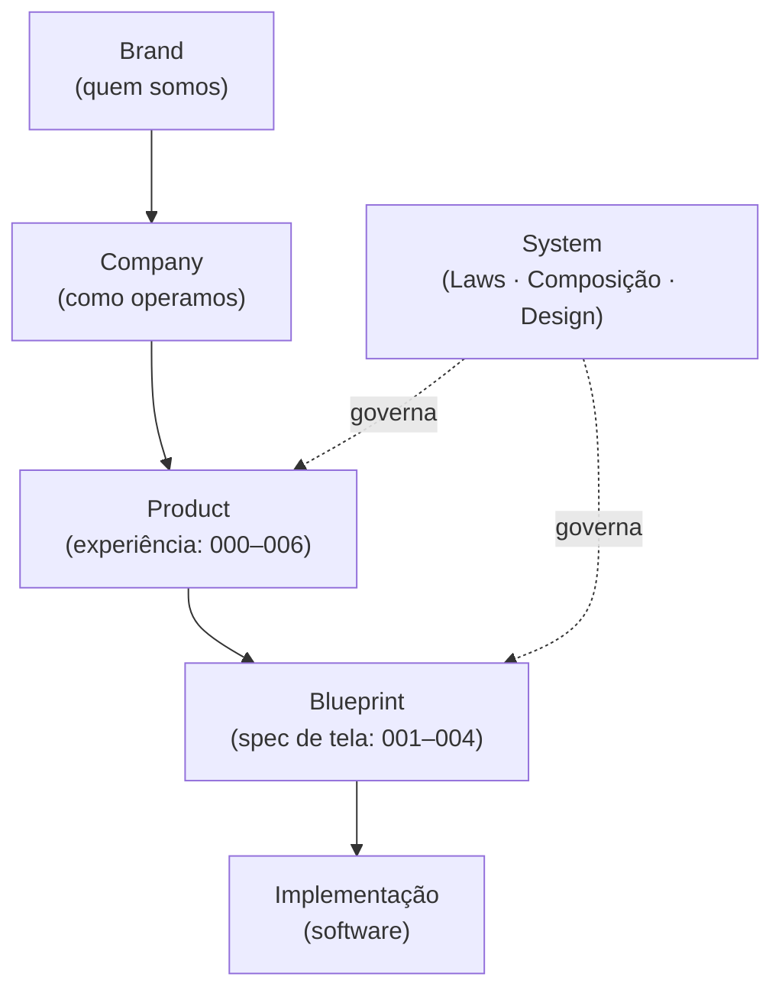
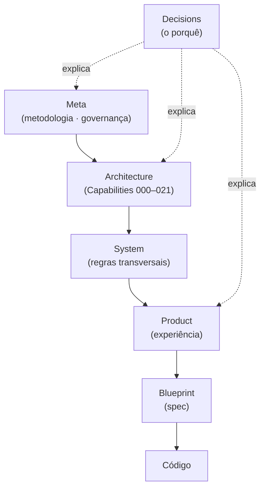
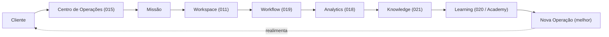
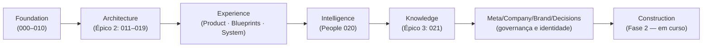

# Meta/002 — Knowledge Map (Mapa Oficial do Conhecimento)

> **O índice conceitual oficial da Zion.** Este documento **não cria arquitetura, funcionalidades nem conceitos novos** — ele **organiza todo o conhecimento já existente**. É a **porta de entrada** da documentação: seu objetivo é permitir que qualquer pessoa encontre qualquer conceito em **poucos minutos**.

> [!important] Registro oficial
> **Toda informação oficial da Zion deve ser encontrável através deste mapa. Nenhum documento oficial poderá existir sem estar registrado no Knowledge Map. O Knowledge Map é a porta de entrada para toda a documentação da Zion.**

> **Governança.** Regido pela [Documentation Governance (meta/001)](./001-documentation-governance.md) e pela [Architecture Methodology (meta/000)](./000-architecture-methodology.md). Materializa o conceito de **Índice Mestre** ([meta/001 §11](./001-documentation-governance.md)).

---

## 1. Objetivo

Ser o **índice conceitual oficial** da Zion — o mapa que conecta camadas, Capabilities, conceitos, documentos e responsabilidades num só lugar.

Ele responde:
- **Onde cada conceito nasce** e **onde é aprofundado**?
- **Onde ele aparece** e **quem é o dono**?
- **Quais documentos dependem dele**?
- **Como navegar** entre Architecture, Product, Company, Brand, Meta, Decisions e Blueprints?

> [!note] O que o mapa é e não é
> É um **guia de navegação** — reflete o que já existe. Não é fonte da verdade dos conceitos (essa é do documento-dono de cada um); é o **atalho** para chegar até eles.

---

## 2. Como Navegar

Há **seis formas** de encontrar o que se procura:

| Forma | Use quando… | Vá para |
|-------|-------------|---------|
| **Por camada** | quer entender um domínio inteiro (ex.: toda a experiência). | [§3 Mapa das Camadas](#3-mapa-das-camadas) |
| **Por Capability** | procura um motor específico (ex.: Cost Engine). | [§5 Mapa por Capability](#5-mapa-por-capability) |
| **Por conceito** | procura uma ideia (ex.: Health, Precisão). | [§4 Mapa Conceitual](#4-mapa-conceitual) |
| **Por documento** | sabe o número/nome e quer o arquivo. | [§12 Índice Mestre](#12-índice-mestre) |
| **Por responsabilidade** | quer saber quem cria/altera/apresenta algo. | [§9 Mapa de Ownership](#9-mapa-de-ownership) |
| **Por fluxo** | quer seguir o caminho do valor. | [§8 Fluxos Oficiais](#8-fluxos-oficiais) |

---

## 3. Mapa das Camadas

As **oito camadas oficiais** e o papel de cada uma:

| Camada | Pasta | Pergunta | Documentos-âncora |
|--------|-------|----------|-------------------|
| **Meta** | `docs/meta/` | como tudo evolui? | [Methodology](./000-architecture-methodology.md), [Governance](./001-documentation-governance.md), este Mapa |
| **Architecture** | `docs/architecture/` | como funciona por dentro? | [000 Business Domain](../architecture/000-business-domain.md) → [021 Knowledge Engine](../architecture/021-knowledge-engine.md) |
| **Product** | `docs/product/` | como é vivida? | [000 Vision](../product/000-product-vision.md) → [006 Client Portal](../product/006-client-portal.md) |
| **Blueprints** | `docs/product/blueprints/` | como se constrói? | [Guide](../product/blueprints/000-blueprint-guide.md), [Catalog](../product/blueprints/004-component-catalog.md) |
| **System** | `docs/product/system/` | regras transversais? | [UI Composition](../product/system/001-ui-composition-system.md), [Product Laws](../product/system/002-product-laws.md), [Design System](../product/system/003-design-system.md) |
| **Company** | `docs/company/` | como opera como negócio? | [Vision](../company/000-company-vision.md), [Business OS](../company/001-business-operating-system.md) |
| **Brand** | `docs/brand/` | quem é? | [Brand DNA](../brand/000-brand-dna.md) |
| **Decisions** | `docs/decisions/` | por que é assim? | [ZDR Methodology](../decisions/000-decision-record-methodology.md) |

Marco de conclusão da Fase 1: [FOUNDATION_COMPLETE](../FOUNDATION_COMPLETE.md).

---

## 4. Mapa Conceitual

Onde cada conceito **nasce**, é **aprofundado** e quem é seu **dono**:

| Conceito | Documento de origem | Documento principal | Relacionados | Capability dono |
|----------|---------------------|---------------------|--------------|-----------------|
| **Produto Mestre** | [arch/000](../architecture/000-business-domain.md) | [arch/001](../architecture/001-product-master.md) | [011](../architecture/011-product-master-workspace.md), [006](../architecture/006-capability-000-zion-intake.md) | Product Master |
| **ERP** | [arch/000](../architecture/000-business-domain.md) | [arch/000](../architecture/000-business-domain.md) | [013](../architecture/013-cost-engine.md), [011](../architecture/011-product-master-workspace.md) | ERP (externo, read-only) |
| **Marketplace** | [arch/000](../architecture/000-business-domain.md) | [arch/002](../architecture/002-marketplace-adapter.md) | [005](../architecture/005-marketplace-engine.md), [019](../architecture/019-workflow-engine.md) | Marketplace Adapter/Engine |
| **Produto (genérico)** | [arch/000](../architecture/000-business-domain.md) | [arch/001](../architecture/001-product-master.md) | [006](../architecture/006-capability-000-zion-intake.md) | Product Master |
| **Missões** | [arch/015](../architecture/015-operation-center.md) | [arch/015](../architecture/015-operation-center.md) | [014](../architecture/014-operational-maturity-engine.md), [prod/004](../product/004-operation-center.md) | Operation Center |
| **Health** | [arch/014](../architecture/014-operational-maturity-engine.md) | [arch/014](../architecture/014-operational-maturity-engine.md) | [011](../architecture/011-product-master-workspace.md), [015](../architecture/015-operation-center.md) | Operational Maturity |
| **Precisão** | [arch/013](../architecture/013-cost-engine.md) | [arch/014](../architecture/014-operational-maturity-engine.md) | [012](../architecture/012-commercial-intelligence-engine.md) | Operational Maturity (consolida) |
| **Operational DNA** | [arch/014](../architecture/014-operational-maturity-engine.md) | [arch/014](../architecture/014-operational-maturity-engine.md) | [016](../architecture/016-implantation-journey.md) | Operational Maturity |
| **Timeline** | [arch/004](../architecture/004-event-bus.md) | [arch/018](../architecture/018-operational-analytics.md) | [011](../architecture/011-product-master-workspace.md), [015](../architecture/015-operation-center.md) | Analytics (histórica) |
| **Analytics** | [arch/018](../architecture/018-operational-analytics.md) | [arch/018](../architecture/018-operational-analytics.md) | [012](../architecture/012-commercial-intelligence-engine.md), [014](../architecture/014-operational-maturity-engine.md) | Operational Analytics |
| **Workflow** | [arch/019](../architecture/019-workflow-engine.md) | [arch/019](../architecture/019-workflow-engine.md) | [005](../architecture/005-marketplace-engine.md), [017](../architecture/017-zion-intelligence-operating-system.md) | Workflow Engine |
| **IA / Coach** | [arch/017](../architecture/017-zion-intelligence-operating-system.md) | [arch/017](../architecture/017-zion-intelligence-operating-system.md) | [006](../architecture/006-capability-000-zion-intake.md), [016](../architecture/016-implantation-journey.md) | ZIOS |
| **Knowledge** | [arch/021](../architecture/021-knowledge-engine.md) | [arch/021](../architecture/021-knowledge-engine.md) | [018](../architecture/018-operational-analytics.md), [020](../architecture/020-people-intelligence-engine.md) | Knowledge Engine |
| **People** | [arch/020](../architecture/020-people-intelligence-engine.md) | [arch/020](../architecture/020-people-intelligence-engine.md) | [014](../architecture/014-operational-maturity-engine.md), [016](../architecture/016-implantation-journey.md) | People Intelligence |
| **Learning** | [arch/021](../architecture/021-knowledge-engine.md) | [arch/020](../architecture/020-people-intelligence-engine.md) | [company/001](../company/001-business-operating-system.md) | Knowledge/People (Academy: futuro) |
| **Academy** | [company/001](../company/001-business-operating-system.md) | [company/001](../company/001-business-operating-system.md) | [020](../architecture/020-people-intelligence-engine.md), [021](../architecture/021-knowledge-engine.md) | *Academy Engine (futuro, 022)* |
| **Community** | [company/000](../company/000-company-vision.md) | [company/001](../company/001-business-operating-system.md) | [brand/000](../brand/000-brand-dna.md) | Company (ecossistema) |

> [!note] Conceitos ainda sem Capability próprio
> **Academy**, **Community** e **Learning** hoje vivem na camada Company e nos engines 020/021; ainda **não** têm um Capability arquitetural dedicado. O `Academy Engine` é o [próximo Capability sugerido](#status) (022).

---

## 5. Mapa por Capability

Cada Capability, sua responsabilidade e seus documentos em cada camada:

| Capability | Responsabilidade (uma frase) | Architecture | Product/Blueprint | ZDR relacionado |
|-----------|-------------------------------|--------------|-------------------|-----------------|
| **Product Master** | a verdade canônica do produto | [001](../architecture/001-product-master.md) | [prod/005](../product/005-product-workspace.md) · [bp/002](../product/blueprints/002-product-workspace-blueprint.md) | ADR-001 *(sugerido)* |
| **Connector SDK** | contrato de qualquer integração | [003](../architecture/003-connector-sdk.md) | — | — |
| **Event Bus** | transporte assíncrono/idempotente | [004](../architecture/004-event-bus.md) | — | — |
| **Marketplace Engine** | orquestra a publicação nos canais | [005](../architecture/005-marketplace-engine.md) | — | — |
| **Zion Intake** | catálogo → Produto Mestre | [006](../architecture/006-capability-000-zion-intake.md) | — | — |
| **Product Master Workspace** | o ambiente do produto | [011](../architecture/011-product-master-workspace.md) | [prod/005](../product/005-product-workspace.md) · [bp/002](../product/blueprints/002-product-workspace-blueprint.md) | — |
| **Commercial Intelligence** | interpreta custo em decisão | [012](../architecture/012-commercial-intelligence-engine.md) | — | ADR *(apresentação≠cálculo, sugerido)* |
| **Cost Engine** | calcula o custo de comercialização | [013](../architecture/013-cost-engine.md) | — | — |
| **Operational Maturity** | mede maturidade/health/precisão | [014](../architecture/014-operational-maturity-engine.md) | — | — |
| **Operation Center** | o cockpit operacional | [015](../architecture/015-operation-center.md) | [prod/004](../product/004-operation-center.md) · [bp/001](../product/blueprints/001-operation-center-blueprint.md) | — |
| **Implantation Journey** | do escuro à operação inteligente | [016](../architecture/016-implantation-journey.md) | — | — |
| **ZIOS (IA)** | governa a inteligência | [017](../architecture/017-zion-intelligence-operating-system.md) | — | ADR *(IA recomenda/humano decide, sugerido)* |
| **Operational Analytics** | observa e historiza | [018](../architecture/018-operational-analytics.md) | — | — |
| **Workflow Engine** | executa processos | [019](../architecture/019-workflow-engine.md) | — | — |
| **People Intelligence** | evolução das pessoas (não vigilância) | [020](../architecture/020-people-intelligence-engine.md) | — | — |
| **Knowledge Engine** | organiza conhecimento | [021](../architecture/021-knowledge-engine.md) | — | — |
| **Client Portal** | a janela do cliente | (visão sobre 011–019) | [prod/006](../product/006-client-portal.md) · [bp/003](../product/blueprints/003-client-portal-blueprint.md) | — |

> Nota: os ZDRs listados como "sugeridos" ainda não foram escritos — são candidatos ao backfill ([Decisions](../decisions/000-decision-record-methodology.md)).

---

## 6. Mapa da Experiência

Como a identidade vira software — a cadeia da experiência:

A identidade ([Brand](../brand/000-brand-dna.md)) informa o negócio ([Company](../company/001-business-operating-system.md)); o negócio informa a experiência ([Product](../product/000-product-vision.md)); a experiência vira especificação ([Blueprints](../product/blueprints/000-blueprint-guide.md)); a especificação vira software — tudo governado pelas regras transversais do [System](../product/system/002-product-laws.md).

---

## 7. Mapa Arquitetural

Como a arquitetura desce até o código:

---

## 8. Fluxos Oficiais

O fluxo do valor — do cliente à nova operação, passando por todos os Capabilities:

O cliente entra pelo cockpit; uma Missão o leva ao Workspace; a ação é executada pelo Workflow; o Analytics observa; o Knowledge organiza o aprendizado; as pessoas evoluem (Learning); a operação melhora — e o ciclo recomeça num degrau acima.

---

## 9. Mapa de Ownership

Quem **cria**, **altera**, **apresenta** e **utiliza** cada conceito (referência; a lista canônica vive em [meta/000 §9](./000-architecture-methodology.md)):

| Conceito | Quem cria | Quem altera | Quem apresenta | Quem utiliza |
|----------|-----------|-------------|----------------|--------------|
| Produto Mestre | Intake/Workspace | Equipe/Cliente/IA | Workspace | todos |
| Custo | Cost Engine | Cost Engine | Workspace/Commercial | 012/014/018 |
| Margem | Commercial | Commercial | Workspace/Operação | 014/018/020 |
| Health/Precisão | Maturity | Maturity | telas (011/015) | todos |
| Missão | Operation Center | Operation Center (fecha por evento) | cockpit/Workspace | operador |
| Analytics/Timeline | Analytics | Analytics (histórica: imutável) | telas | 012/014/021 |
| Execução | Workflow | Workflow | Operação | todos |
| IA/Recomendação | ZIOS | IA propõe / humano decide | em todo lugar | todos |
| Evolução das pessoas | People Intelligence | People Intelligence | Coach/Gestor | Academy |
| Conhecimento | Knowledge Engine | Knowledge Engine | Academy/Coach | IA/Academy |
| Usuário/Organização | Organização (000) | Equipe (admin) | Config | todos |

---

## 10. Dependências

**Documentos centrais** (muitos dependem deles — mudá-los reverbera por toda a base):
- [arch/000 Business Domain](../architecture/000-business-domain.md) — a linguagem e a Fonte da Verdade.
- [arch/001 Product Master](../architecture/001-product-master.md) — o dado central.
- [arch/004 Event Bus](../architecture/004-event-bus.md) — o transporte que conecta tudo.
- [system/002 Product Laws](../product/system/002-product-laws.md) — a lei da experiência.
- [meta/000 Methodology](./000-architecture-methodology.md) — a lei da arquitetura.
- [brand/000 Brand DNA](../brand/000-brand-dna.md) — a identidade que informa tudo.

**Documentos periféricos** (dependem de muitos, poucos dependem deles):
- Blueprints (`bp/001–004`), telas de Product (`prod/004–006`), [013a Review](../architecture/013a-architecture-review-epic2.md).

**Documentos futuros** (referenciados mas ainda não escritos):
- `architecture/022-academy-engine` · `docs/decisions/ADR-001…` (backfill) · `meta/003-official-glossary` · o **Índice Mestre vivo**.

> [!important] Regra de dependência
> A dependência flui **para baixo** na [hierarquia](./000-architecture-methodology.md): camadas de baixo referenciam as de cima (contexto), nunca o contrário como dependência dura. Um ciclo de dependência é um defeito de governança.

---

## 11. Mapa Temporal

A evolução da Zion — a ordem em que o conhecimento foi construído:

| Fase | O que consolidou |
|------|------------------|
| **Foundation** | domínio, Produto Mestre, contratos, Event Bus, Intake (000–010). |
| **Architecture** | o Épico de Inteligência Comercial e operacional (011–019). |
| **Experience** | a camada de produto, blueprints e sistema. |
| **Intelligence** | a evolução das pessoas (020). |
| **Knowledge** | o motor de conhecimento (021). |
| **Governança/Identidade** | Meta, Company, Brand, Decisions. |
| **Construction** | **Fase 2** — transformar conceito em software ([FOUNDATION_COMPLETE](../FOUNDATION_COMPLETE.md)). |

---

## 12. Índice Mestre

Todos os documentos oficiais, por camada. **Status/Versão** conforme o próprio documento; **Owner** por camada (a atribuição formal de dono individual é item de governança — [meta/001 §7](./001-documentation-governance.md)).

### Meta — `docs/meta/`
| # | Documento | Status | Versão | Owner |
|---|-----------|--------|:------:|-------|
| 000 | [Architecture Methodology](./000-architecture-methodology.md) | Published | 1.0 | Architecture |
| 001 | [Documentation Governance](./001-documentation-governance.md) | Published | 1.0 | Architecture |
| 002 | Knowledge Map *(este)* | Published | 1.0 | Architecture |

### Architecture — `docs/architecture/`
| # | Documento | Status | Versão | Owner |
|---|-----------|--------|:------:|-------|
| 000 | [Business Domain](../architecture/000-business-domain.md) | Published | 1.0 | Architecture |
| 001 | [Product Master](../architecture/001-product-master.md) | Published | 1.0 | Architecture |
| 002 | [Marketplace Adapter](../architecture/002-marketplace-adapter.md) | Published | 1.0 | Architecture |
| 003 | [Connector SDK](../architecture/003-connector-sdk.md) | Published | 1.0 | Architecture |
| 004 | [Event Bus](../architecture/004-event-bus.md) | Published | 1.0 | Architecture |
| 005 | [Marketplace Engine](../architecture/005-marketplace-engine.md) | Published | 1.0 | Architecture |
| 006 | [Zion Intake](../architecture/006-capability-000-zion-intake.md) | Published | 1.0 | Architecture |
| 007 | [Execution Roadmap](../architecture/007-execution-roadmap.md) | Published | 1.0 | Architecture |
| 008 | [Architecture Compliance](../architecture/008-architecture-compliance.md) | Published | 1.0 | Architecture |
| 009 | [PR-001 Implementation Plan](../architecture/009-pr001-implementation-plan.md) | Published | 1.0 | Architecture |
| 010 | [Database Compliance](../architecture/010-database-compliance.md) | Published | 1.0 | Architecture |
| 011 | [Product Master Workspace](../architecture/011-product-master-workspace.md) | Published | 1.0 | Architecture |
| 012 | [Commercial Intelligence Engine](../architecture/012-commercial-intelligence-engine.md) | Published | 1.0 | Architecture |
| 013 | [Cost Engine](../architecture/013-cost-engine.md) | Published | 1.0 | Architecture |
| 013a | [Architecture Review · Épico 2](../architecture/013a-architecture-review-epic2.md) | Published | 1.0 | Architecture |
| 014 | [Operational Maturity Engine](../architecture/014-operational-maturity-engine.md) | Published | 1.0 | Architecture |
| 015 | [Operation Center](../architecture/015-operation-center.md) | Published | 1.0 | Architecture |
| 016 | [Implantation Journey](../architecture/016-implantation-journey.md) | Published | 1.0 | Architecture |
| 017 | [Zion Intelligence Operating System](../architecture/017-zion-intelligence-operating-system.md) | Published | 1.0 | Architecture |
| 018 | [Operational Analytics](../architecture/018-operational-analytics.md) | Published | 1.0 | Architecture |
| 019 | [Workflow Engine](../architecture/019-workflow-engine.md) | Published | 1.0 | Architecture |
| 020 | [People Intelligence Engine](../architecture/020-people-intelligence-engine.md) | Published | 1.0 | Architecture |
| 021 | [Knowledge Engine](../architecture/021-knowledge-engine.md) | Published | 1.0 | Architecture |

### Product — `docs/product/`
| # | Documento | Status | Versão | Owner |
|---|-----------|--------|:------:|-------|
| 000 | [Product Vision](../product/000-product-vision.md) | Published | 1.0 | Product |
| 001 | [Design Principles](../product/001-design-principles.md) | Published | 1.0 | Product/UX |
| 002 | [Information Architecture](../product/002-information-architecture.md) | Published | 1.0 | Product |
| 003 | [Navigation](../product/003-navigation.md) | Published | 1.0 | Product/UX |
| 004 | [Operation Center (Experiência)](../product/004-operation-center.md) | Published | 1.0 | Product |
| 005 | [Product Workspace (Experiência)](../product/005-product-workspace.md) | Published | 1.0 | Product |
| 006 | [Client Portal (Experiência)](../product/006-client-portal.md) | Published | 1.0 | Product |

### Blueprints — `docs/product/blueprints/`
| # | Documento | Status | Versão | Owner |
|---|-----------|--------|:------:|-------|
| 000 | [Blueprint Guide](../product/blueprints/000-blueprint-guide.md) | Published | 1.0 | Product/UX |
| 001 | [Operation Center Blueprint](../product/blueprints/001-operation-center-blueprint.md) | Draft ⚠️ | 1.0 | Product/UX |
| 002 | [Product Workspace Blueprint](../product/blueprints/002-product-workspace-blueprint.md) | Draft | 1.0 | Product/UX |
| 003 | [Client Portal Blueprint](../product/blueprints/003-client-portal-blueprint.md) | Draft | 1.0 | Product/UX |
| 004 | [Component Catalog](../product/blueprints/004-component-catalog.md) | Draft | 1.0 | Product/UX/FE |

> ⚠️ Reconciliação conhecida: o `blueprints/001` ainda traz o título antigo "Prototype/001" no H1 (resquício da consolidação prototype→blueprints). Correção pendente sob o processo de governança ([meta/001](./001-documentation-governance.md)); não afeta caminho nem links.

### System — `docs/product/system/`
| # | Documento | Status | Versão | Owner |
|---|-----------|--------|:------:|-------|
| 001 | [UI Composition System](../product/system/001-ui-composition-system.md) | Published | 1.0 | Product/UX |
| 002 | [Product Laws](../product/system/002-product-laws.md) | Published | 1.0 | Product |
| 003 | [Design System (Filosófico)](../product/system/003-design-system.md) | Published | 1.0 | Product/UX |

### Company — `docs/company/`
| # | Documento | Status | Versão | Owner |
|---|-----------|--------|:------:|-------|
| 000 | [Company Vision](../company/000-company-vision.md) | Published | 1.0 | Business |
| 001 | [Business Operating System](../company/001-business-operating-system.md) | Published | 1.0 | Business |

### Brand — `docs/brand/`
| # | Documento | Status | Versão | Owner |
|---|-----------|--------|:------:|-------|
| 000 | [Brand DNA](../brand/000-brand-dna.md) | Published | 1.0 | Brand |

### Decisions — `docs/decisions/`
| # | Documento | Status | Versão | Owner |
|---|-----------|--------|:------:|-------|
| 000 | [Decision Record Methodology](../decisions/000-decision-record-methodology.md) | Published | 1.0 | Architecture |

### Marco
| Documento | Status |
|-----------|--------|
| [FOUNDATION_COMPLETE](../FOUNDATION_COMPLETE.md) | Registro oficial — Fase 1 concluída |

**Total:** 44 documentos oficiais (23 Architecture + 7 Product + 5 Blueprints + 3 System + 2 Company + 1 Brand + 3 Meta + 1 Decisions — incluindo este) + o marco.

---

## 13. Critérios de Navegação

Como localizar **qualquer assunto** rapidamente:

1. **Sei o conceito?** → [§4 Mapa Conceitual](#4-mapa-conceitual) → documento-dono.
2. **Sei o Capability?** → [§5 Mapa por Capability](#5-mapa-por-capability).
3. **Sei o número/nome do doc?** → [§12 Índice Mestre](#12-índice-mestre).
4. **Quero "quem faz o quê"?** → [§9 Ownership](#9-mapa-de-ownership).
5. **Quero seguir o valor?** → [§8 Fluxos](#8-fluxos-oficiais).
6. **Sou novo?** → [Como estudar a Zion](#seção-especial--como-estudar-a-zion).

Regra de ouro: **três cliques até qualquer conceito** — Mapa → tabela → documento-dono.

---

## 14. Critérios de Aceite

O Knowledge Map cumpre seu papel quando:

- [ ] **Todo documento oficial está no Índice Mestre** (§12).
- [ ] **Todo conceito principal tem uma linha** no Mapa Conceitual (§4), apontando dono.
- [ ] **Todo Capability aparece** no Mapa por Capability (§5) com seus documentos.
- [ ] **Qualquer assunto é alcançável em ≤3 passos** (§13).
- [ ] **Os links resolvem** e refletem a estrutura real.
- [ ] **Documentos futuros e reconciliações** estão sinalizados (não escondidos).
- [ ] **Não cria conceito novo** — apenas organiza o existente.
- [ ] **É atualizado quando um documento nasce/muda de status** (governança viva).

---

## Seção especial — Como Estudar a Zion

Trilhas de leitura por perfil — **por onde começar**:

| Perfil | Leia primeiro (em ordem) |
|--------|--------------------------|
| **Novo desenvolvedor** | [meta/000 Methodology](./000-architecture-methodology.md) → [arch/000 Business Domain](../architecture/000-business-domain.md) → o Capability que vai tocar (011–021) → o [Blueprint](../product/blueprints/000-blueprint-guide.md) da tela → [system/002 Product Laws](../product/system/002-product-laws.md). |
| **Novo designer** | [product/001 Design Principles](../product/001-design-principles.md) → [product/002 IA](../product/002-information-architecture.md) → [product/003 Navigation](../product/003-navigation.md) → [system/001 UI Composition](../product/system/001-ui-composition-system.md) → [system/003 Design System](../product/system/003-design-system.md) → [bp/004 Catalog](../product/blueprints/004-component-catalog.md). |
| **Novo arquiteto** | [meta/000](./000-architecture-methodology.md) + [meta/001](./001-documentation-governance.md) → [arch/000](../architecture/000-business-domain.md) → Épicos (011–021) → [013a Review](../architecture/013a-architecture-review-epic2.md) → [decisions/000](../decisions/000-decision-record-methodology.md). |
| **Novo parceiro** | [brand/000 Brand DNA](../brand/000-brand-dna.md) → [company/000 Vision](../company/000-company-vision.md) → [company/001 Business OS](../company/001-business-operating-system.md). |
| **Novo gestor** | [company/001 Business OS](../company/001-business-operating-system.md) → [arch/016 Journey](../architecture/016-implantation-journey.md) → [arch/014 Maturity](../architecture/014-operational-maturity-engine.md) → [arch/020 People](../architecture/020-people-intelligence-engine.md). |
| **Novo cliente** | [brand/000 Brand DNA](../brand/000-brand-dna.md) → [product/000 Vision](../product/000-product-vision.md) → [product/006 Portal](../product/006-client-portal.md) → [arch/016 Journey](../architecture/016-implantation-journey.md). |

> Todos, sem exceção, deveriam ler o [FOUNDATION_COMPLETE](../FOUNDATION_COMPLETE.md) para entender **de onde a Zion partiu** e as [três constituições](#3-mapa-das-camadas) para entender **o que nunca muda**.

---

## Seção especial — O Cérebro da Zion

A documentação da Zion não é um conjunto de arquivos — é uma **inteligência coletiva**. **Nenhum documento existe isoladamente**: cada um referencia outros, deriva de camadas acima e sustenta camadas abaixo. O Brand informa a Company, que informa o Product, que consome a Architecture, que é governada pela Meta, que é explicada pelas Decisions.

Como um cérebro, o valor não está em cada neurônio, mas nas **conexões**: o mesmo conceito (Health, Missão, Custo) aparece em vários documentos, sempre lendo do mesmo dono, nunca duplicado. O Knowledge Map é o que torna essas conexões **visíveis** — o mapa das sinapses.

> [!important] O mapa é o que impede a fragmentação
> Sem este mapa, cada documento seria uma ilha e o conhecimento se fragmentaria à medida que a base cresce. **Com ele, os 44 documentos (e os futuros) permanecem um só organismo** — uma inteligência coletiva que sabe onde cada ideia vive e como ela se conecta às demais.

---

## Seção especial — O Mapa daqui a 10 anos

Este mapa foi desenhado para **escalar sem envelhecer**. Quando a Zion tiver centenas de documentos, ele continuará útil porque não depende de listar cada detalhe — depende de três estruturas estáveis:

1. **Camadas** — todo documento novo se encaixa numa das oito (ou numa nova, se justificada). O mapa das camadas quase não muda.
2. **Conceitos com dono** — todo conceito tem uma casa; o Mapa Conceitual cresce por linhas, não por reestruturação.
3. **Índice Mestre vivo** — a lista de documentos cresce, mas o **modo de encontrar** (por camada/conceito/capability/fluxo) permanece.

Enquanto essas três estruturas forem honradas ([meta/000](./000-architecture-methodology.md)/[meta/001](./001-documentation-governance.md)), o número de documentos cresce sem que a **dificuldade de encontrar** cresça junto. Um mapa que precisa ser reescrito a cada documento novo é um mau mapa; este foi feito para **apenas ganhar linhas**.

> Daqui a dez anos, um novo membro deve continuar encontrando qualquer conceito da Zion em poucos minutos — abrindo **este** documento primeiro.

---

> **Registro oficial:** **Toda informação oficial da Zion deve ser encontrável através deste mapa. Nenhum documento oficial poderá existir sem estar registrado no Knowledge Map. O Knowledge Map é a porta de entrada para toda a documentação da Zion.**

> **Status:** `meta/002` — Knowledge Map **v1.0**. Índice conceitual oficial: mapa das camadas, conceitual, por Capability, de ownership, de dependências, temporal, e o Índice Mestre dos 44 documentos oficiais. Materializa o Índice Mestre da [Documentation Governance (meta/001)](./001-documentation-governance.md). **Próximo documento sugerido:** `docs/meta/003-official-glossary.md` (o **Glossário Oficial único** — a definição canônica de cada termo da linguagem oficial da Zion, consolidando o que hoje está distribuído entre o [Business Domain (000)](../architecture/000-business-domain.md) e o [Glossário da Vault](../obsidian/11 Glossário/Glossário.md): um termo, uma definição, um dono, um documento-fonte — sem sinônimos, sem renomeações — encerrando a lacuna de linguagem apontada em [meta/000 §10](./000-architecture-methodology.md) e [meta/001 §10](./001-documentation-governance.md); o Knowledge Map encontra os conceitos, o Glossário os define).
