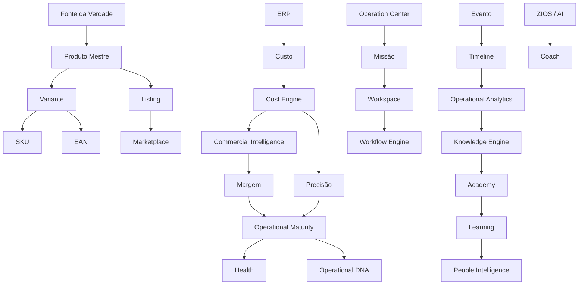

# Meta/003 — Official Glossary (Glossário Oficial da Zion)

> **A Fonte da Verdade da linguagem da Zion.** Este documento **não cria conceitos, não altera definições e não renomeia nada** — ele **consolida toda a linguagem oficial** já existente em um único lugar. É a **única fonte oficial** para a definição de termos; toda documentação futura deve usá-lo.

> [!important] Registro oficial
> **Nenhum documento oficial poderá introduzir um termo novo sem registrá-lo neste Glossário. Toda palavra oficial possui: definição · dono · origem · contexto · relacionamento. O Glossário Oficial é a Fonte da Verdade da linguagem da Zion.**

> **Governança.** Regido por [meta/000 §10](./000-architecture-methodology.md) e [meta/001 §10](./001-documentation-governance.md). Encontra-se os conceitos pelo [Knowledge Map (meta/002)](./002-knowledge-map.md); **define-se** aqui. Em divergência de nomenclatura, o [Business Domain (000)](../architecture/000-business-domain.md) prevalece como fonte do domínio; este Glossário o **consolida**, não o substitui.

---

## 1. Objetivo

Consolidar, num único documento, **a definição oficial de cada termo** da Zion — para que ninguém fale duas línguas sobre a mesma coisa, e para que qualquer pessoa (ou a própria IA) saiba **exatamente** o que cada palavra significa.

Ele responde: **qual é a definição oficial** de cada conceito · **onde nasceu** · **quem é o dono** · **onde é aprofundado** · **quais os relacionados** · **quais palavras nunca devem ser usadas como sinônimos**.

> [!important] Toda palavra oficial nasce apenas uma vez
> Um conceito tem **um** nome e **uma** definição. Este Glossário garante isso: cada termo aparece **uma única vez**, na sua categoria-casa, e é **referenciado** — nunca redefinido — pelos demais documentos.

---

## 2. Regras Oficiais

1. **Uma palavra, um significado.** Nenhum termo tem duas definições.
2. **Um conceito, um dono.** Todo termo aponta a Capability/documento responsável.
3. **Nunca criar sinônimos.** Não existem duas palavras para a mesma coisa ([§6](#6-palavras-proibidas)).
4. **Nunca reutilizar um nome para conceitos diferentes.** Um nome = um conceito, para sempre.
5. **Toda palavra nova passa por revisão.** Entra por processo ([§7](#7-evolução)), justificando por que é necessária.
6. **A definição é atemporal.** Descreve o conceito, não a tecnologia do momento.
7. **Em divergência, o dono prevalece.** A fonte da verdade de um termo é seu documento-dono; o Glossário reflete-o.

---

## 3. Estrutura de um Termo

Todo termo possui, canonicamente, **nove elementos**:

| Elemento | O que registra |
|----------|----------------|
| **Nome** | o termo oficial. |
| **Definição** | o significado, curto e atemporal. |
| **Categoria** | Domain · Business · Product · Engine · Meta. |
| **Documento de origem** | onde o termo nasceu. |
| **Documento principal** | onde é aprofundado (pode coincidir com a origem). |
| **Capability responsável** | quem é o dono. |
| **Conceitos relacionados** | termos vizinhos. |
| **Palavras proibidas** | sinônimos que **não** devem ser usados. |
| **Observações** | notas quando necessário. |

> [!note] Rendering compacto
> No [§4](#4-glossário-oficial), os termos são apresentados em **tabelas por categoria** — a forma compacta desta estrutura de 9 elementos (Categoria = a seção; Origem/Principal = os links; Observações = inline quando há). Um termo sem esses elementos **não está oficialmente definido**.

---

## 4. Glossário Oficial

Organizado por categoria. **Colunas:** Termo · Definição (curta, atemporal) · Origem/Principal · Dono · Relacionados · Não usar (sinônimos proibidos).

### 4.1 DOMAIN — a linguagem do negócio
*(fonte: [Business Domain (000)](../architecture/000-business-domain.md))*

| Termo | Definição | Origem/Principal | Dono | Relacionados | Não usar |
|-------|-----------|------------------|------|--------------|----------|
| **Organização** | O tenant raiz — a agência que opera para várias empresas-cliente. | [000](../architecture/000-business-domain.md) | Organização | Cliente, Usuário | — |
| **Cliente** | A empresa-cliente operada pela agência; unidade de isolamento multiempresa. | [000](../architecture/000-business-domain.md) | Organização | Organização, Portal | "conta" (isolado) |
| **Usuário** | Pessoa autenticada, com papel `equipe` ou `cliente`. | [000](../architecture/000-business-domain.md) | Organização | Operador, Gestor | — |
| **Origem do Produto** | De onde o produto vem (fornecedor, fabricante, importador, distribuidor, marca própria). | [000](../architecture/000-business-domain.md) | Zion Intake | Catálogo, SKU | **Fornecedor** (é um *tipo*) |
| **Catálogo** | O lote bruto recebido de uma Origem; insumo, não o produto canônico. | [000](../architecture/000-business-domain.md) | Zion Intake | Origem, Pré-Produto | — |
| **Produto Mestre** | A representação única e canônica de um produto; Fonte da Verdade do marketplace. | [000](../architecture/000-business-domain.md) / [001](../architecture/001-product-master.md) | Product Master | Variante, Listing, Workspace | "produto" (coloquial) |
| **Variante** | Cada derivação vendável do Produto Mestre (cor, tamanho…). | [001](../architecture/001-product-master.md) | Product Master | SKU, EAN | — |
| **SKU** | Código único da unidade; `sku_origem` é a chave 1ª de conciliação. | [000](../architecture/000-business-domain.md) | Product Master | EAN, Variante | — |
| **EAN** | Código de barras (GTIN); complementar ao SKU. | [000](../architecture/000-business-domain.md) | Origem | SKU | — |
| **Preço** | O preço de **venda** por canal; Fonte da Verdade = Zion. | [000](../architecture/000-business-domain.md) | Product Master | Custo, Margem | — |
| **Custo** | O custo do produto; Fonte da Verdade = ERP; espelhado read-only. | [000](../architecture/000-business-domain.md) | ERP / Cost Engine | Preço, Margem, Precisão | — |
| **Estoque** | Quantidade disponível; Fonte da Verdade = ERP; espelhado read-only. | [000](../architecture/000-business-domain.md) | ERP | Variante | — |
| **Listing** | O anúncio publicado por canal; estado real é do Marketplace. | [000](../architecture/000-business-domain.md) | Marketplace Adapter | Conta Marketplace | **Anúncio** (é UI) |
| **Conta Marketplace** | A loja conectada de um Cliente num Marketplace (OAuth, server-side). | [000](../architecture/000-business-domain.md) | Marketplace | Listing | "canal" (informal) |
| **Pedido** | Uma venda recebida de um canal. | [000](../architecture/000-business-domain.md) | Marketplace | Estoque | **Venda**, **Order** |
| **Compra** | Aquisição de produto para revenda (revenda). | [000](../architecture/000-business-domain.md) | Product Master | Catálogo, Custo | "aquisição" (é o dado técnico) |
| **Marketplace** | A plataforma de venda (ML/TikTok/Shopee); dona do estado do anúncio e dos pedidos. | [000](../architecture/000-business-domain.md) | Marketplace Adapter | Listing, Conta | "canal" (informal) |
| **ERP** | Sistema externo (Magazord); Fonte da Verdade de estoque, custo, fiscal, nota. | [000](../architecture/000-business-domain.md) | ERP (externo) | Custo, Estoque | — |
| **Evento** | Fato assíncrono, idempotente e auditável. | [000](../architecture/000-business-domain.md) / [004](../architecture/004-event-bus.md) | Event Bus | Timeline, Auditoria | — |
| **Fonte da Verdade** | O dono único e canônico de uma informação. | [000](../architecture/000-business-domain.md) | Business Domain | Origem, Dono | "master" (isolado) |
| **Origem da Informação** | Qual fonte forneceu um valor específico (proveniência) — distinta de Fonte da Verdade. | [013a](../architecture/013a-architecture-review-epic2.md) | Cost Engine / transversal | Precisão, Fonte da Verdade | — |

### 4.2 BUSINESS — a empresa e o ecossistema
*(fonte: [Company](../company/000-company-vision.md), [Brand](../brand/000-brand-dna.md))*

| Termo | Definição | Origem/Principal | Dono | Relacionados | Não usar |
|-------|-----------|------------------|------|--------------|----------|
| **Empresa (Zion)** | A empresa de tecnologia e inteligência que constrói e opera o ecossistema Zion. | [company/000](../company/000-company-vision.md) | Company | Plataforma, Ecossistema | — |
| **Parceiro** | Agência/consultoria que amplia o alcance e a entrega do ecossistema. | [company/000](../company/000-company-vision.md) | Partners | Academy, Advocacy | — |
| **Academy** | A educação da Zion — transforma conhecimento em capacidade. | [company/001](../company/001-business-operating-system.md) | *Academy Engine (futuro)* | Knowledge, People | "cursos" (é um formato) |
| **Community** | O pertencimento e a troca de práticas do ecossistema. | [company/000](../company/000-company-vision.md) | Company | Advocacy, Parceiro | — |
| **Advocacy** | O cliente que vira defensor e gera novos leads. | [company/001](../company/001-business-operating-system.md) | Company (CS/Marketing) | Community, Cliente | — |
| **Ecossistema** | Platform · Academy · Partners · Community · AI · APIs, operando conectados. | [company/000](../company/000-company-vision.md) | Company | todos | — |
| **Business Operating System** | O modelo pelo qual a empresa opera por fluxos de valor (não departamentos). | [company/001](../company/001-business-operating-system.md) | Company | Ecossistema | — |

### 4.3 PRODUCT — a experiência
*(fonte: [Product](../product/000-product-vision.md))*

| Termo | Definição | Origem/Principal | Dono | Relacionados | Não usar |
|-------|-----------|------------------|------|--------------|----------|
| **Operation Center** (Centro de Operações) | O cockpit operacional; a Home da Zion; responde "o que fazer agora?". | [015](../architecture/015-operation-center.md) / [prod/004](../product/004-operation-center.md) | Operation Center | Missão, Health, Fila | **Dashboard** |
| **Workspace** (do Produto Mestre) | O ambiente onde um produto vive e é operado. | [011](../architecture/011-product-master-workspace.md) / [prod/005](../product/005-product-workspace.md) | Product Master Workspace | Produto Mestre, Variante | **CRUD**, "formulário" |
| **Portal (do Cliente)** | A janela do cliente para o próprio negócio; mesma Zion, escopo do cliente. | [prod/006](../product/006-client-portal.md) | Client Portal | Cliente, Missão Compartilhada | — |
| **Missão** | Unidade de trabalho derivada de um fato; substitui a lista de tarefas. | [015](../architecture/015-operation-center.md) | Operation Center | Fila, Coach | **tarefa**, "to-do" |
| **Fila Inteligente** | Trabalho homogêneo agrupado e priorizado. | [015](../architecture/015-operation-center.md) | Operation Center | Missão | "lista" |
| **Health** (Health Score) | Indicador dimensional (0–100) e acionável de saúde. | [014](../architecture/014-operational-maturity-engine.md) | Operational Maturity | Precisão, Maturidade | "nota", "score" solto |
| **Precisão** | A confiança de um número derivado, conforme a qualidade das fontes. | [013](../architecture/013-cost-engine.md) | Operational Maturity | Origem da Informação, Custo | — |
| **Timeline** | O histórico narrado de eventos (produto/operação). | [018](../architecture/018-operational-analytics.md) | Operational Analytics | Evento, Versão | "log" |
| **Coach** | A IA como orientadora contextual; recomenda ações. | [016](../architecture/016-implantation-journey.md) / [017](../architecture/017-zion-intelligence-operating-system.md) | ZIOS | Recomendação, Missão | **chatbot** |
| **Recomendação** | Ação candidata da IA, com justificativa, origem e confiança. | [012](../architecture/012-commercial-intelligence-engine.md) | ZIOS / Commercial | Coach, Missão | — |
| **Design System** | O que comunica (percepção, significado); não organiza nem estiliza fora de escopo. | [system/003](../product/system/003-design-system.md) | Product | UI Composition | — |
| **UI Composition** | O que organiza os componentes na tela. | [system/001](../product/system/001-ui-composition-system.md) | Product | Design System | — |

### 4.4 ENGINE — os motores (Capabilities)
*(fonte: [Architecture](../architecture/000-business-domain.md))*

| Termo | Definição | Origem/Principal | Dono | Relacionados | Não usar |
|-------|-----------|------------------|------|--------------|----------|
| **Capability** | Unidade de capacidade da plataforma, com responsabilidade única. | [000](../architecture/000-business-domain.md) / [meta/000](./000-architecture-methodology.md) | Meta | Engine | **Módulo** |
| **Commercial Intelligence** | O motor que **interpreta** custo em decisões comerciais. | [012](../architecture/012-commercial-intelligence-engine.md) | Commercial Intelligence | Margem, Cost Engine | — |
| **Cost Engine** | O motor que **calcula** o custo de comercialização. | [013](../architecture/013-cost-engine.md) | Cost Engine | Custo, Precisão | — |
| **Operational Maturity** | O motor que **mede** a maturidade/health/precisão. | [014](../architecture/014-operational-maturity-engine.md) | Operational Maturity | Health, Operational DNA | — |
| **Operational Analytics** | O motor que **observa** e historiza. | [018](../architecture/018-operational-analytics.md) | Operational Analytics | Timeline, Insight | "BI" |
| **Workflow** | Orquestração de etapas sobre o Produto Mestre (o conceito). | [000](../architecture/000-business-domain.md) / [019](../architecture/019-workflow-engine.md) | Workflow Engine | Evento, Missão | — |
| **Workflow Engine** | O mecanismo oficial de **execução** de processos. | [019](../architecture/019-workflow-engine.md) | Workflow Engine | Workflow, Política | — |
| **People Intelligence** | O motor que mede a **evolução das pessoas** (nunca vigilância). | [020](../architecture/020-people-intelligence-engine.md) | People Intelligence | Learning, Academy | "avaliação de RH" |
| **Knowledge Engine** | O motor que **organiza** conhecimento validado e reutilizável. | [021](../architecture/021-knowledge-engine.md) | Knowledge Engine | Knowledge, Academy | "repositório" |
| **ZIOS** (Zion Intelligence Operating System) | O sistema operacional que **governa** toda a inteligência. | [017](../architecture/017-zion-intelligence-operating-system.md) | ZIOS | AI, Coach, Agente IA | — |
| **AI / Agente IA** | A inteligência da Zion (única para o usuário; agentes especialistas por dentro). | [017](../architecture/017-zion-intelligence-operating-system.md) | ZIOS | Coach, Intelligence Bus | — |
| **Intelligence Bus** | O canal pelo qual os agentes compartilham contexto. | [017](../architecture/017-zion-intelligence-operating-system.md) | ZIOS | AI, Memory Layers | — |
| **Memory Layers** | As camadas de memória da IA (Sessão→Global). | [017](../architecture/017-zion-intelligence-operating-system.md) | ZIOS | AI, Intelligence Bus | — |
| **Capability Intelligence** | O que cada Capability fornece à IA (contexto/ferramentas/eventos/regras). | [017](../architecture/017-zion-intelligence-operating-system.md) | ZIOS | Capability, AI | — |
| **Operational DNA** | O perfil de níveis por dimensão que descreve uma operação. | [014](../architecture/014-operational-maturity-engine.md) | Operational Maturity | Health, Maturidade | — |
| **Operational Knowledge** | O conhecimento que alimenta os Capabilities (via Knowledge Engine). | [018](../architecture/018-operational-analytics.md) / [021](../architecture/021-knowledge-engine.md) | Knowledge Engine | Knowledge, Academy | — |
| **Learning** | A capacitação das pessoas a partir do conhecimento. | [020](../architecture/020-people-intelligence-engine.md) / [021](../architecture/021-knowledge-engine.md) | People / Knowledge | Academy, People | — |

### 4.5 META — a governança
*(fonte: [Meta](./000-architecture-methodology.md), [Decisions](../decisions/000-decision-record-methodology.md))*

| Termo | Definição | Origem/Principal | Dono | Relacionados | Não usar |
|-------|-----------|------------------|------|--------------|----------|
| **Product Law** | Uma lei permanente da experiência, de prioridade máxima. | [system/002](../product/system/002-product-laws.md) | Product | Regra, Constituição | — |
| **Decision Record (ZDR)** | O registro do **porquê** de uma decisão arquitetural. | [decisions/000](../decisions/000-decision-record-methodology.md) | Architecture | Decisão, Meta | "ADR genérico" |
| **Blueprint** | A especificação funcional implementável de uma tela. | [blueprints/000](../product/blueprints/000-blueprint-guide.md) | Product | Component, Composition | "wireframe" (isolado) |
| **Camada** | Um dos oito domínios oficiais da documentação. | [meta/001](./001-documentation-governance.md) | Meta | Knowledge Map | — |

---

## 5. Relações

Como os termos-âncora dependem uns dos outros:

Leitura: a **Fonte da Verdade** ancora o Produto Mestre; o **ERP** ancora o custo, que sobe pela cadeia de cálculo→interpretação→medição; os **eventos** alimentam a timeline→analytics→conhecimento; o **cockpit** conduz Missão→Workspace→execução; a **IA** orienta; o **conhecimento** vira aprendizado e evolução das pessoas.

---

## 6. Palavras Proibidas

Sinônimos que **não** devem ser usados — cada substituição **respaldada** pela documentação existente:

| ❌ Nunca usar | ✅ Termo oficial | Respaldo |
|---------------|------------------|----------|
| **Dashboard** | Operation Center | [015](../architecture/015-operation-center.md) / [prod/004](../product/004-operation-center.md) ("não é dashboard, é cockpit") |
| **CRUD** / "formulário de cadastro" | Workspace | [011](../architecture/011-product-master-workspace.md) ("nunca um CRUD") |
| **Módulo** | Capability (arquitetura) / Contexto (navegação) | [meta/000](./000-architecture-methodology.md) / [prod/002](../product/002-information-architecture.md) ("navega por contexto, não módulo") |
| **Usuário final** | Operador (ou Cliente, conforme o papel) | [000](../architecture/000-business-domain.md) (papéis `equipe`/`cliente`) |
| **Anúncio** (em doc técnico) | Listing | [000](../architecture/000-business-domain.md) ("Listing oficial; UI diz Anúncio") |
| **Venda** / **Order** | Pedido | [000](../architecture/000-business-domain.md) ("Pedido oficial") |
| **Fornecedor** (como o todo) | Origem do Produto | [000](../architecture/000-business-domain.md) ("Fornecedor é um tipo") |
| **Tarefa** / **to-do** | Missão | [015](../architecture/015-operation-center.md) ("substitui a lista de tarefas") |
| **Chatbot** | Coach / IA | [017](../architecture/017-zion-intelligence-operating-system.md) ("a IA não é um chatbot") |
| **BI** (para o resumo) | Operational Analytics | [018](../architecture/018-operational-analytics.md) ("não é um BI") |
| **Repositório de conhecimento** | Knowledge Engine | [021](../architecture/021-knowledge-engine.md) ("nunca é um repositório") |
| **Vigilância** / "avaliação de pessoas" | People Intelligence / evolução | [020](../architecture/020-people-intelligence-engine.md) ("evolução, nunca vigilância") |

> [!important] Uso de sinônimos é defeito
> Estas proibições **não** são estilo — são governança de linguagem. Usar um termo proibido num documento oficial é um item a corrigir em revisão ([meta/001 §13](./001-documentation-governance.md)). A coluna "respaldo" garante que nenhuma proibição foi inventada aqui.

---

## 7. Evolução

Como a linguagem cresce **sem perder consistência** (herda [meta/000 §10](./000-architecture-methodology.md)/[meta/001 §10](./001-documentation-governance.md)):

| Ação | Processo |
|------|----------|
| **Nasce um termo** | proposta → verificação (não é sinônimo de nada?) → aprovação → registro aqui, com os 9 elementos ([§3](#3-estrutura-de-um-termo)). |
| **Altera-se um termo** | só a **definição** evolui (nunca o significado central); versiona-se o Glossário; a mudança é rastreável. |
| **Renomeia-se** (raro) | só por processo formal, com referência nome antigo → novo; **nunca** em silêncio. |
| **Deprecia-se** | um termo superado é marcado, apontando o substituto; permanece legível pelo valor histórico. |

> [!important] Um termo novo sem registro não existe oficialmente
> Se um documento usa uma palavra que não está aqui, ou ela é um sinônimo (proibido) de um termo existente, ou é um termo novo que **precisa ser registrado**. Não há terceira opção.

---

## 8. Critérios de Qualidade

Uma boa definição é:

| Critério | Significa |
|----------|-----------|
| **Curta** | uma ou duas frases; sem divagação. |
| **Clara** | entendida por quem não conhece a implementação. |
| **Atemporal** | descreve o conceito, não a tecnologia do momento. |
| **Sem tecnologia** | não menciona framework, banco, linguagem ou canal específico. |
| **Sem ambiguidade** | não permite duas leituras. |
| **Com fronteira** | quando útil, diz o que o termo **não** é (via "não usar"). |

---

## 9. Critérios de Aceite

O Glossário cumpre seu papel quando:

- [ ] **Todo termo oficial da Zion tem uma entrada** — e uma só.
- [ ] **Cada entrada tem os 9 elementos** ([§3](#3-estrutura-de-um-termo)), no formato compacto.
- [ ] **Nenhuma definição foi inventada** — todas consolidam o documento-dono.
- [ ] **Nenhum termo aparece duas vezes** com definições diferentes.
- [ ] **As palavras proibidas têm respaldo** documental ([§6](#6-palavras-proibidas)).
- [ ] **As definições são curtas, claras, atemporais e sem tecnologia** ([§8](#8-critérios-de-qualidade)).
- [ ] **Todo termo aponta seu dono e sua origem** (rastreável).
- [ ] **É atualizado quando um termo nasce, muda ou é depreciado** (governança viva).

---

## Seção especial — A Linguagem da Zion

Uma linguagem consistente é uma **vantagem competitiva**, não um detalhe editorial.

Quando todos — engenheiros, designers, comerciais, a IA e os clientes — usam **as mesmas palavras para as mesmas coisas**, a comunicação deixa de ter atrito: ninguém precisa "traduzir" o que o outro quis dizer. Um novo membro aprende **um** vocabulário e entende toda a plataforma. A IA cita conceitos sem ambiguidade. O comercial descreve o produto com as palavras do produto.

Empresas perdem tempo (e cometem erros) porque a mesma coisa tem cinco nomes e cinco donos. A Zion decidiu o contrário: **uma palavra, um significado, um dono.** Essa disciplina, aplicada por anos, compõe-se numa clareza que os concorrentes não copiam — porque clareza não se copia; **cultiva-se**.

> A linguagem é a primeira arquitetura. Antes de decidir como algo funciona, a Zion decide **como se chama** — porque nomear com precisão é a metade do pensar com precisão.

---

## Seção especial — Uma Palavra, Um Significado

Ter **um** significado por palavra **reduz erros de arquitetura** — diretamente.

Quando "Missão" e "tarefa" convivem, alguém constrói uma lista de tarefas paralela ao sistema de Missões — e a plataforma ganha dois conceitos concorrentes para a mesma coisa. Quando "Dashboard" e "Operation Center" convivem, alguém desenha um painel de números sem ação ao lado do cockpit — e a experiência se fragmenta. Cada sinônimo tolerado é uma **porta para uma duplicação** de conceito, de componente, de código.

A regra "uma palavra, um significado" é, no fundo, a regra **"um conceito, um dono"** ([meta/000](./000-architecture-methodology.md)) aplicada à linguagem. Preservar a palavra é preservar a arquitetura: **onde a linguagem se multiplica, a arquitetura se fragmenta.**

---

## Seção especial — O Glossário daqui a 10 anos

Este Glossário foi feito para **crescer sem perder consistência**. Com centenas de termos, ele continuará confiável porque não depende de volume — depende de três disciplinas estáveis:

1. **Um termo, uma entrada.** O Glossário cresce por **linhas**, nunca por reestruturação.
2. **Toda palavra passa pelo processo** ([§7](#7-evolução)) — nada entra sem verificação de sinônimo e registro.
3. **A fonte é o dono; o Glossário reflete.** As definições vivem nos documentos-dono; aqui elas se **consolidam** — então o Glossário nunca contradiz a arquitetura.

Enquanto essas disciplinas forem honradas, um novo membro, daqui a dez anos, abrirá **este** documento e saberá **exatamente** o que cada palavra da Zion significa — porque cada palavra terá sido cuidada, uma a uma, desde o início.

> Um glossário que precisa ser reescrito é um glossário que falhou. Este foi feito para **apenas ganhar termos** — e nunca perder o significado dos que já tem.

---

> **Registro oficial:** **Nenhum documento oficial poderá introduzir um termo novo sem registrá-lo neste Glossário. Toda palavra oficial possui definição, dono, origem, contexto e relacionamento. O Glossário Oficial é a Fonte da Verdade da linguagem da Zion.**

> **Status:** `meta/003` — Official Glossary **v1.0**. Consolida a linguagem oficial em ~60 termos, em cinco categorias (Domain · Business · Product · Engine · Meta), com definições, donos, origens, relações e palavras proibidas respaldadas. Fonte da Verdade da linguagem; encontrada via [Knowledge Map (meta/002)](./002-knowledge-map.md); governada por [meta/000](./000-architecture-methodology.md)/[meta/001](./001-documentation-governance.md). **Próximo documento sugerido:** `docs/meta/004-documentation-index.md` (o **Índice de Documentação** navegável e possivelmente gerável — a materialização do Índice Mestre [meta/001 §11] e do Knowledge Map como artefato de manutenção: a listagem única de todos os documentos com camada, status, versão, owner, última/próxima revisão e dependências, mantida em sincronia com os cabeçalhos de governança — o "raio-X vivo" do organismo documental, onde o Knowledge Map orienta a navegação conceitual e o Índice orienta a **operação** da base: o que existe, o que falta, o que precisa de revisão).
