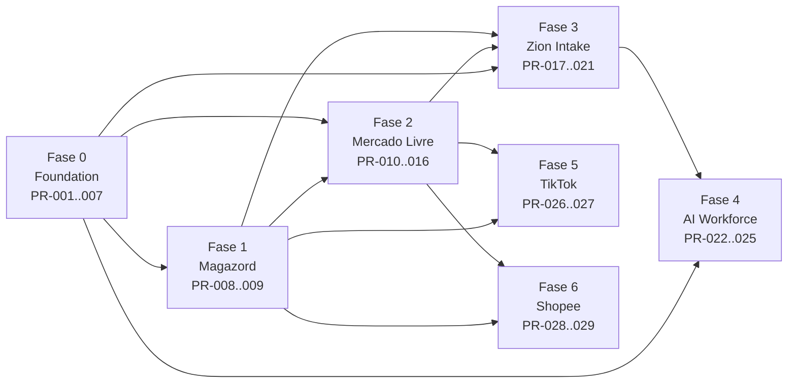

# 🗺️ Roadmap — Timeline

> Timeline oficial da Zion Platform. Fonte da verdade: [[007-execution-roadmap|007 · Execution Roadmap]]. Plano de PRs detalhado em [[PRs]].

**Sequência oficial:**
`Fase 0 Foundation → Fase 1 Magazord → Fase 2 Mercado Livre → Fase 3 Zion Intake → Fase 4 AI Workforce → Fase 5 TikTok → Fase 6 Shopee`

## Timeline

## Fases, status e dependências

| Fase | Entrega | Depende de | Status | PRs |
|------|---------|-----------|--------|-----|
| **0 · Foundation** | [[Produto Mestre]], [[004-event-bus\|Event Bus]], [[Connector SDK]], [[Marketplace Adapter]], Observabilidade | — | 🔴 não iniciado | [[PRs\|PR-001..007]] |
| **1 · Magazord** | [[ERP]]: cadastro + espelho estoque/custo | Fase 0 | 🔴 | [[PRs\|PR-008..009]] |
| **2 · Mercado Livre** | [[Marketplace Engine\|Engine]] + Adapter [[Mercado Livre\|ML]] (User Products, PUT preço/estoque, webhooks, assíncrono) | Fase 0, Fase 1 | 🔴 | [[PRs\|PR-010..016]] |
| **3 · Zion Intake** | [[Zion Intake\|Intake]]: catálogo → Pré-Produto → conciliação → promoção | Fase 0/1/2 | 🔴 | [[PRs\|PR-017..021]] |
| **4 · AI Workforce** | Esteira [[IA\|A0–A12]] + gateway + ledger + trava A10 | Fase 3, Fase 0 | 🔴 | [[PRs\|PR-022..025]] |
| **5 · TikTok Shop** | Adapter [[TikTok Shop]] + fan-out | Fase 2, Fase 1 | 🔴 | [[PRs\|PR-026..027]] |
| **6 · Shopee** | Adapter [[Shopee]] + fan-out completo | Fase 2, Fase 1 | 🔴 | [[PRs\|PR-028..029]] |

## Operação viva (precede o plano canônico)

O **Zion OS** já opera a Chinelaria com OAuth ML, esteira A0–A12, fila `fila_otimizacao_produto` + Vercel Cron e RLS por papel. O roadmap **envelopa** esse legado nos novos contratos, sem parar a operação. Próxima peça crítica: **User Products no publish do ML** (ver [[Mercado Livre]]).

> [!info] Regra de dependência
> Nenhuma capability inicia sem que **todas as suas dependências** estejam com [[Definition of Done|DoD]] cumprida. Gate de saída por fase em [[Definition of Done]].

Ver o mapa em [[Roadmap.canvas|Canvas · Roadmap]].

---
◀ [[Home]] · [[PRs]]
