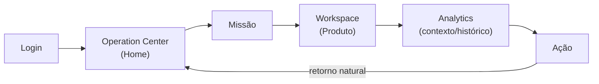
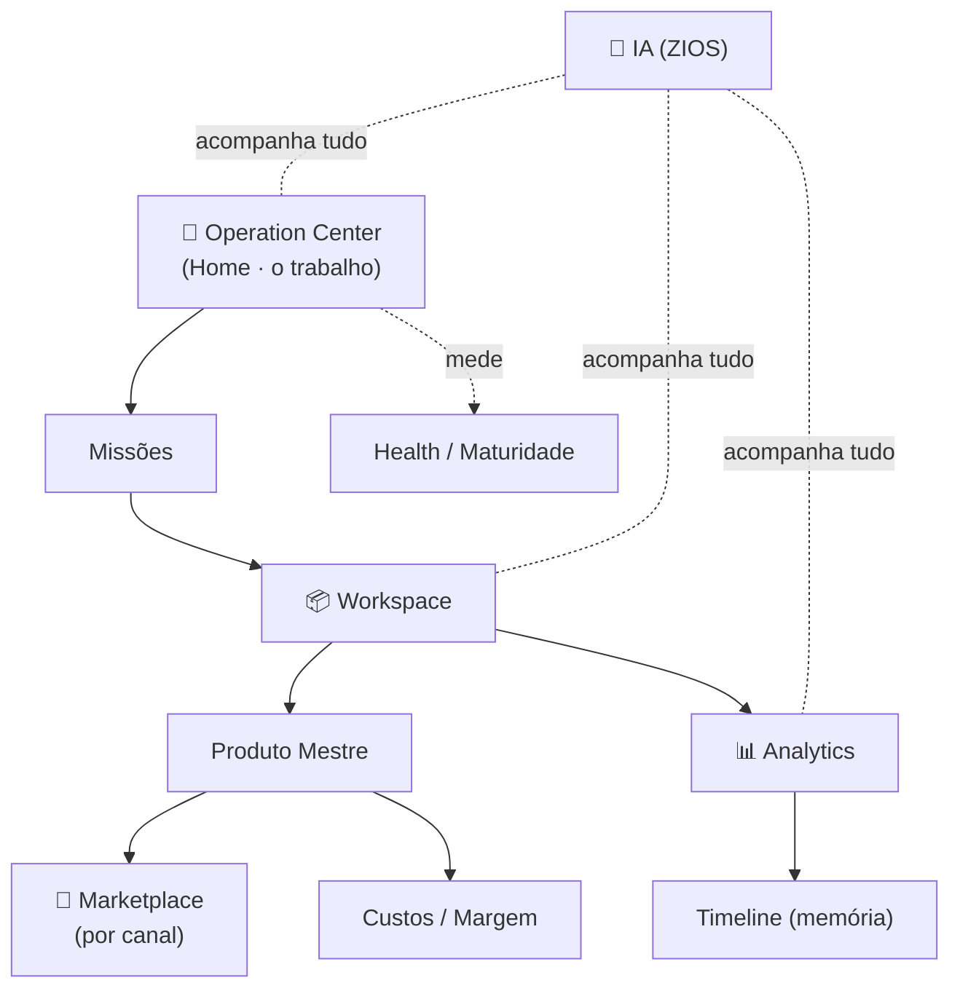

# 002 — Information Architecture

> **Arquitetura da Informação da Zion Platform.** Este documento é a **ponte entre a arquitetura técnica** (`architecture/` 000–019) **e o design das telas**. Ele responde: **onde cada informação vive**, **quem é seu dono**, **como o usuário navega** e **como centenas de funcionalidades parecem um único produto**. Referência oficial para **UX, Design, Engenharia e IA**.

> **Relação com os documentos anteriores.** Aplica a [Product Vision (product/000)](./000-product-vision.md) e os [Design Principles (product/001)](./001-design-principles.md). A arquitetura funcional é lida como contexto e **não é copiada** — aqui ela é traduzida em **casas de informação e caminhos de navegação**.

> [!important] Princípio máximo da Arquitetura da Informação
> **A Zion não organiza funcionalidades. Ela organiza contextos de trabalho.** Toda informação possui **uma casa**; toda tela apresenta **uma visão**; toda navegação **preserva o contexto** do usuário.

---

## 1. Objetivo

Definir oficialmente a **Arquitetura da Informação (AI)** da Zion — a estrutura que garante que **cada informação tenha um único lar** e que todas as telas conversem como um só produto.

> [!important] Uma casa, muitas visões
> **Toda informação possui uma casa** — um Capability que é sua origem e dono. As demais telas **não copiam** essa informação; elas apenas **apresentam visões** dela. Isso elimina duplicação, preserva a Fonte da Verdade e faz a plataforma inteira falar o mesmo idioma.

---

## 2. Filosofia

1. **Uma informação.** Cada dado existe uma vez.
2. **Uma origem.** Cada dado tem um dono claro (sua casa).
3. **Múltiplas visões.** O mesmo dado aparece onde for útil — sempre como visão, nunca como cópia.
4. **Uma navegação.** Um caminho principal por objetivo; sem labirintos.
5. **Poucos menus.** A plataforma cresce em profundidade de contexto, não em largura de menu.
6. **Muito contexto.** O usuário nunca se perde: sempre sabe onde está, de onde veio e para onde vai.

---

## 3. Modelo Mental

> [!important] O usuário nunca navega entre módulos. Ele navega entre **contextos de trabalho**.

Um sistema comum organiza-se por **módulos** ("vá ao módulo de Custos", "abra o módulo de Relatórios"). A Zion não. O usuário pensa em **onde está o trabalho**, não em qual peça técnica o executa.

| ❌ O usuário não pensa | ✅ O usuário pensa |
|------------------------|--------------------|
| "Vou ao módulo Commercial Intelligence." | "Quero entender a margem **deste produto**." |
| "Vou ao módulo Analytics." | "Como **minha operação** evoluiu?" |
| "Vou ao módulo Workflow." | "Quero **publicar** estes produtos." |

Os contextos naturais da Zion são: **Operação · Produto · Marketplace · Analytics · Cliente.** Nunca "módulos". A tecnologia por trás (os Capabilities) é **invisível** — o usuário vive nos contextos.

---

## 4. Camadas da Plataforma

A Zion se organiza em **cinco camadas** de informação — do que o usuário mais toca ao que menos toca:

| Camada | Nome | O que contém | Onde se manifesta |
|:-----:|------|--------------|-------------------|
| **1** | **Operação** | O trabalho do dia: Missões, Filas, Alertas. | Centro de Operações ([015](../architecture/015-operation-center.md)) |
| **2** | **Contexto** | O objeto de trabalho: o Produto Mestre e tudo sobre ele. | Workspace ([011](../architecture/011-product-master-workspace.md)) |
| **3** | **Execução** | O que acontece (publicação, sincronização, automação). | Workflow ([019](../architecture/019-workflow-engine.md)) |
| **4** | **Conhecimento** | A memória e a inteligência: Analytics, tendências, maturidade. | Analytics ([018](../architecture/018-operational-analytics.md)), Maturidade ([014](../architecture/014-operational-maturity-engine.md)) |
| **5** | **Configuração** | O que é raramente tocado: políticas, integrações, usuários. | Ajustes / Organização |

**Por que camadas:** o usuário passa **99% do tempo nas camadas 1 e 2** (operar e contextualizar). As camadas 3–5 existem, mas **não competem** pela atenção — são acessadas quando necessário. A hierarquia de camadas espelha a [Hierarquia da Informação do 001](./001-design-principles.md).

---

## 5. Ownership Map

Cada conceito tem **uma casa oficial** — o Capability que é sua origem e dono. Este mapa é **lei**:

```
Produto Mestre  →  Workspace (011)
Missões         →  Operation Center (015)
Custos          →  Cost Engine (013)
Margem          →  Commercial Intelligence (012)
Health          →  Operational Maturity (014)
Precisão        →  Operational Maturity (014)  [origem do número: Cost Engine 013]
Analytics       →  Operational Analytics (018)
Workflow        →  Workflow Engine (019)
IA              →  Zion Intelligence Operating System (017)
```

> [!important] A casa é única; as visitas são muitas
> Cada Capability é a **casa oficial** daquele conceito — o único lugar onde ele **nasce e é alterado**. Quando o conceito aparece em outra tela (ex.: a margem no Workspace), é uma **visita** (visão), não uma mudança de endereço. Alterar margem só acontece pela regra do dono (Commercial Intelligence, via preço/política) — nunca "na tela onde apareceu".

---

## 6. Information Map

Onde cada informação **vive** (origem) e onde **aparece** (visões):

| Informação | Casa (origem) | Aparece como visão em |
|------------|---------------|------------------------|
| **Produto** | Workspace ([011](../architecture/011-product-master-workspace.md)) | Operation Center, Analytics, Marketplace |
| **Marketplace** | Marketplace/Engine ([005](../architecture/005-marketplace-engine.md)/015) | Workspace (por canal), Operation Center |
| **Pedidos** | Marketplace (Fonte da Verdade do canal) | Operation Center (fila), Analytics |
| **Missões** | Operation Center ([015](../architecture/015-operation-center.md)) | Workspace (Missões do produto), Jornada |
| **Custos** | Cost Engine ([013](../architecture/013-cost-engine.md)) | Workspace, Commercial Intelligence, Analytics |
| **Margem** | Commercial Intelligence ([012](../architecture/012-commercial-intelligence-engine.md)) | Workspace, Operation Center, Analytics |
| **Health** | Operational Maturity ([014](../architecture/014-operational-maturity-engine.md)) | Workspace (produto), Operation Center (operação), Analytics |
| **Precisão** | Operational Maturity ([014](../architecture/014-operational-maturity-engine.md)) | Workspace, Commercial Intelligence, Analytics |
| **Analytics** | Operational Analytics ([018](../architecture/018-operational-analytics.md)) | Workspace (histórico do produto), Operation Center, Dashboards |
| **Timeline** | Depende do escopo (ver [§13](#13-timelines)) | Workspace, Operation Center |
| **IA** | ZIOS ([017](../architecture/017-zion-intelligence-operating-system.md)) | Em todo lugar, sem casa visível própria |
| **Usuários** | Organização ([000](../architecture/000-business-domain.md)) | Configuração, Equipe |
| **Organizações** | Organização ([000](../architecture/000-business-domain.md)) | Configuração |
| **Workflow** | Workflow Engine ([019](../architecture/019-workflow-engine.md)) | Operation Center (execuções), Workspace (ações) |

**Relação origem × visualização:** a **origem** é onde o dado nasce e muda; a **visualização** é qualquer lugar que o mostra. A visualização **sempre lê** da origem — nunca guarda a própria cópia. Assim, mudar o dado na casa **atualiza todas as visões** automaticamente.

---

## 7. Navigation Model

O modelo oficial de navegação — do login à ação e **de volta**:



O usuário **entra** no Centro de Operações, **pega** uma Missão, **abre** o Workspace no ponto certo, **consulta** o histórico/Analytics quando precisa, **executa** a ação e **retorna** naturalmente ao Centro de Operações — pronto para a próxima. **Nunca há beco sem saída** ([Design Principle de Navegação](./001-design-principles.md)).

---

## 8. Home da Plataforma

> [!important] A Home da Zion é o **Centro de Operações**. Nunca um dashboard genérico.

Ao entrar, o usuário **não** cai numa tela de boas-vindas nem num painel de gráficos decorativos. Ele cai no [Centro de Operações](../architecture/015-operation-center.md) — o cockpit que responde imediatamente à pergunta máxima: **"o que preciso fazer agora?"**.

**Por quê:** a Home deve ser o lugar onde o **trabalho começa**, não onde ele é admirado. Um dashboard genérico mostra números; o Centro de Operações mostra **Missões, filas e o próximo passo**. A Home da Zion é um **ponto de partida para agir**, não uma vitrine.

---

## 9. Contextos

Os **contextos de trabalho** oficiais — as "salas" onde o usuário opera:

| Contexto | O usuário está… | Casa principal |
|----------|-----------------|----------------|
| **Contexto Operação** | conduzindo o dia (Missões, filas, alertas). | Operation Center ([015](../architecture/015-operation-center.md)) |
| **Contexto Produto** | trabalhando um produto específico. | Workspace ([011](../architecture/011-product-master-workspace.md)) |
| **Contexto Marketplace** | olhando a operação por canal. | Marketplace ([005](../architecture/005-marketplace-engine.md)/015) |
| **Contexto Analytics** | entendendo a evolução/tendências. | Analytics ([018](../architecture/018-operational-analytics.md)) |
| **Contexto Cliente** | (Equipe) operando uma empresa-cliente. | Organização ([000](../architecture/000-business-domain.md)) |

**Como o usuário muda de contexto:** por **objeto**, não por menu. Clicar numa Missão o leva ao Contexto Produto; abrir "como evoluiu" o leva ao Contexto Analytics **daquele produto** (sem perder de vista qual produto). A troca de contexto **carrega o contexto junto** — nunca zera para uma tela genérica.

---

## 10. Navegação Global

Princípios da navegação de alto nível (entre contextos):

1. **Poucos menus.** Um punhado de destinos principais (os contextos), não dezenas de itens.
2. **Pouca profundidade.** Tudo importante a poucos cliques; nada enterrado em submenus de submenus.
3. **Sempre orientação.** A plataforma diz o que fazer a seguir (Missões, próximo passo).
4. **Sempre localização.** O usuário sempre sabe **onde está** (contexto e objeto atuais visíveis).
5. **Sempre retorno.** De qualquer lugar, há um caminho natural de volta ao Centro de Operações.

Princípio: crescer em **contexto**, não em **menu**. Novos Capabilities aparecem como novas **visões dentro de contextos existentes** — não como novos itens de menu ([§15](#15-escalabilidade)).

---

## 11. Navegação Local

Dentro de um contexto, a navegação é por **seções do mesmo objeto** — nunca uma troca de tela que perde o fio:

- **Dentro de um Workspace** ([011](../architecture/011-product-master-workspace.md)): navega-se entre Identidade, Conteúdo, Variantes, Preços, ERP, Marketplaces, Versões, Timeline — **sempre o mesmo produto**, sob ângulos diferentes.
- **Dentro de um Produto:** rolar/alternar seções, nunca "sair e voltar".
- **Dentro de uma Missão:** ver objetivo → contexto → ação recomendada → concluir — um fluxo linear.
- **Dentro de um Marketplace:** alternar entre canais e ver estado/publicação/problemas — **mesma operação**, por canal.

Princípio: a navegação local **mantém o objeto fixo** e muda apenas o **ângulo** — o contexto do usuário nunca é perdido.

---

## 12. IA na Navegação

> [!important] A IA nunca possui menu próprio.

A [IA](../architecture/017-zion-intelligence-operating-system.md) **não é um destino** de navegação — é um **acompanhante**:
- **Não tem menu próprio** — não existe "ir ao módulo de IA".
- **Acompanha o usuário** — está onde ele está (produto, preço, cockpit).
- **Aparece onde existe contexto** — surge junto do trabalho que pode ajudar.
- **Nunca interrompe o fluxo** — sugere ao lado da ação, sem tomar a tela (herança do [Design Principle de IA na Interface](./001-design-principles.md)).

Princípio: navegar para a IA seria contradizer "uma única inteligência". A IA não é um lugar — é uma **presença** em todos os lugares.

---

## 13. Timelines

A Zion tem **três Timelines**, cada uma com **dono e escopo próprios** — nunca duplicadas:

| Timeline | Dono | Escopo | Quando aparece | Como se relaciona |
|----------|------|--------|----------------|-------------------|
| **Timeline do Produto** | Workspace ([011](../architecture/011-product-master-workspace.md)) | A vida de **um produto**. | Dentro do Workspace. | É um **recorte** da Operacional, filtrado por produto. |
| **Timeline da Operação** | Operation Center ([015](../architecture/015-operation-center.md)) | O fluxo **do cockpit** (trabalho recente). | No Centro de Operações. | É a visão **viva/recente** dos eventos. |
| **Timeline Analítica** | Operational Analytics ([018](../architecture/018-operational-analytics.md)) | A **história de longo prazo** da empresa. | No contexto Analytics. | É a **memória consolidada** que as outras alimentam. |

> [!important] Três visões, uma verdade de eventos
> As três leem os **mesmos eventos** ([Event Bus](../architecture/004-event-bus.md)) em **escopos diferentes**: a do Produto é filtrada por objeto; a da Operação é a recente/viva; a Analítica é a histórica/consolidada. **Nenhuma duplica a outra** — são recortes de um único fluxo de fatos.

---

## 14. Visões Compartilhadas

O mesmo conceito aparece em várias telas — **sempre o mesmo, nunca duplicado**. Exemplos:

**Health** (casa: [Operational Maturity 014](../architecture/014-operational-maturity-engine.md)):
- **No Produto** (Workspace): o Health *daquele produto*.
- **Na Operação** (Operation Center): o Health *da operação inteira*.
- **No Analytics**: a *evolução* do Health no tempo.
- → **Sempre o mesmo Health** (mesmo modelo, mesmas cores, mesma leitura); muda só o **escopo/recorte**.

**Margem** (casa: [Commercial Intelligence 012](../architecture/012-commercial-intelligence-engine.md)):
- No Produto: a margem *deste item*. No Analytics: a *tendência* da margem. Na Operação: o *alerta* de margem baixa.
- → **Uma margem, três visões.**

**Missão** (casa: [Operation Center 015](../architecture/015-operation-center.md)):
- No cockpit: a fila de Missões. No Produto: as Missões *daquele produto*. Na Jornada: as Missões de *evolução*.
- → **Uma Missão, várias entradas.**

**Custo** (casa: [Cost Engine 013](../architecture/013-cost-engine.md)):
- No Produto: o custo consolidado. No Commercial: base da margem. No Analytics: histórico de custo.
- → **Um custo, reaproveitado.**

Princípio: reaproveitar a **visão**, nunca copiar o **dado**. Se dois lugares mostrassem "Healths diferentes" para a mesma coisa, a plataforma teria mentido — e quebrado a promessa de "uma verdade".

---

## 15. Escalabilidade

Como um **novo Capability** entra na Zion **sem inchar a navegação**:

- **Sem criar novos menus.** Ele entra como **nova visão dentro de um contexto existente** (ex.: um novo tipo de análise vira uma visão no contexto Analytics, não um menu novo).
- **Sem quebrar a navegação.** Segue o Navigation Model (entra pelo cockpit/objeto, tem retorno natural).
- **Sem duplicar informação.** Registra sua **casa** no Ownership Map; onde aparecer fora dela, é visão.

> [!important] Crescer por composição, não por acúmulo
> A Zion escala como a arquitetura ([ZIOS 017](../architecture/017-zion-intelligence-operating-system.md), [Adapter 002](../architecture/002-marketplace-adapter.md)): **plugando** capacidades nos contextos existentes. Cem funcionalidades cabem em cinco contextos — porque o que cresce é a **profundidade de contexto**, não a **largura de menu**.

---

## 16. Princípios

Princípios **oficiais** da Arquitetura da Informação:

1. **Toda informação possui uma casa.**
2. **Toda informação pode possuir várias visões.**
3. **Toda navegação possui retorno.**
4. **Nenhuma informação deve ser duplicada.**
5. **Todo contexto deve ser preservado** na navegação.
6. **Toda tela pertence a um fluxo** (nunca é um beco isolado).
7. **A plataforma cresce em contexto, não em menu.**
8. **A IA não é um lugar — é uma presença.**

---

## 17. Critérios de Aceite

A Arquitetura da Informação está conforme esta visão quando **todos** os critérios abaixo são verdadeiros:

- [ ] **Casa única:** todo conceito tem um Capability dono (Ownership Map); só ele altera.
- [ ] **Visões, não cópias:** onde um conceito aparece fora da casa, é visão que lê da origem — nunca duplicata.
- [ ] **Navegação por contexto:** o usuário circula entre Operação/Produto/Marketplace/Analytics/Cliente — não entre "módulos".
- [ ] **Home é o Centro de Operações:** a entrada responde "o que fazer agora?", não é dashboard genérico.
- [ ] **Modelo de navegação com retorno:** login → cockpit → Missão → Workspace → Analytics → ação → retorno; sem becos.
- [ ] **Navegação local preserva o objeto:** dentro do Workspace/Produto/Missão/Marketplace, muda o ângulo, não o objeto.
- [ ] **IA sem menu próprio:** acompanha o contexto, aparece junto da ação, não interrompe.
- [ ] **Três Timelines com dono e escopo:** Produto/Operação/Analítica, recortes de um único fluxo de eventos.
- [ ] **Visões compartilhadas consistentes:** Health/Margem/Missão/Custo iguais em toda tela; muda só o escopo.
- [ ] **Escala sem inchar menu:** novo Capability entra como visão em contexto existente, com casa registrada.
- [ ] **Contexto preservado:** trocar de contexto carrega o objeto junto; nunca zera para tela genérica.
- [ ] **Multiempresa respeitada:** contexto Cliente isola por tenant ([RLS](../architecture/010-database-compliance.md)).

---

## Seção especial — Mapa da Plataforma

A Zion representada como um **mapa conceitual** — tudo conectado, partindo do trabalho:



**Leitura do mapa:** tudo parte do **Operation Center** (o trabalho); a **Missão** leva ao **Workspace** (o produto); o produto se conecta a **Marketplace**, **Custos/Margem** e **Analytics**; o **Health** mede o conjunto; a **IA** permeia tudo, sem ser um ponto no mapa — é o ar que circula entre eles.

---

## Seção especial — Jornada de Navegação

Um fluxo completo, do login ao retorno — mostrando que o contexto **nunca se perde**.

| Passo | Onde o Alex está | O que vê | Contexto carregado |
|:----:|------------------|----------|--------------------|
| 1 | **Entra na Zion** | Login. | — |
| 2 | **Centro de Operações** (Home) | "Você tem 3 Missões prioritárias hoje." | Operação (Chinelaria) |
| 3 | **Recebe uma Missão** | *"Corrigir margem de 5 chinelos abaixo do piso."* | + a Missão e os 5 produtos |
| 4 | **Abre um Produto Mestre** (Workspace) | O produto, com custo, margem, Health, problemas. | + o produto específico |
| 5 | **Consulta Analytics** | *"A margem deste produto caiu após o custo subir no ERP em abril."* | + histórico **daquele** produto |
| 6 | **Executa uma ação** | Ajusta o preço; a Zion confirma e mostra o impacto. | + resultado da ação |
| 7 | **Retorna ao Centro de Operações** | A Missão fecha; a próxima já está lá. | volta à Operação, sem se perder |

> [!important] O fio nunca se rompe
> Em nenhum passo o Alex "voltou ao início" ou "abriu outro módulo". Ele **desceu ao detalhe** (produto → histórico → ação) e **subiu de volta** (cockpit), com o contexto **acumulando** no caminho e **preservado** no retorno. Essa continuidade é o que faz a Zion parecer **um único produto**.

---

## Seção especial — Mapa de Responsabilidades

Tabela **oficial** — referência para toda a plataforma. Define, por conceito: o Capability responsável, onde nasce, onde aparece, quem altera e quem apenas apresenta.

| Conceito | Capability Responsável | Onde nasce | Onde aparece (visões) | Quem altera | Quem apenas apresenta |
|----------|------------------------|------------|------------------------|-------------|------------------------|
| **Produto Mestre** | Workspace ([011](../architecture/011-product-master-workspace.md)) | Zion Intake → Workspace | Operation Center, Analytics, Marketplace | Equipe/Cliente/IA (via Workspace) | Operation Center, Analytics |
| **Missão** | Operation Center ([015](../architecture/015-operation-center.md)) | Eventos (Maturity/Commercial/…) | Workspace, Jornada | Operation Center (fecha por evento) | Workspace, Jornada |
| **Custo** | Cost Engine ([013](../architecture/013-cost-engine.md)) | Cost Engine (calcula) | Workspace, Commercial, Analytics | Cost Engine (recalcula) | Workspace, Commercial, Analytics |
| **Margem** | Commercial Intelligence ([012](../architecture/012-commercial-intelligence-engine.md)) | Commercial (interpreta custo) | Workspace, Operation Center, Analytics | Commercial (deriva) | Workspace, Operation, Analytics |
| **Health** | Operational Maturity ([014](../architecture/014-operational-maturity-engine.md)) | Maturity (calcula) | Workspace, Operation Center, Analytics | Maturity | Todas as telas |
| **Precisão** | Operational Maturity ([014](../architecture/014-operational-maturity-engine.md)) | Número no Cost Engine → consolidada em Maturity | Workspace, Commercial, Analytics | Maturity/Cost Engine | Demais |
| **Analytics / Tendência** | Operational Analytics ([018](../architecture/018-operational-analytics.md)) | Analytics (observa) | Workspace, Operation Center, Dashboards | Analytics (historiza) | Demais |
| **Timeline** | Escopo (011/015/018) | Event Bus | Workspace, Operation, Analytics | ninguém edita (imutável) | Todas |
| **Workflow / Execução** | Workflow Engine ([019](../architecture/019-workflow-engine.md)) | Disparado por evento | Operation Center, Workspace | Workflow Engine (executa) | Operation, Workspace |
| **IA / Recomendação** | ZIOS ([017](../architecture/017-zion-intelligence-operating-system.md)) | Agentes (recomendam) | Em todo lugar (contextual) | IA propõe; humano decide | Todas |
| **Pedido** | Marketplace (canal) | Canal (`venda.recebida`) | Operation Center, Analytics | Marketplace (dono) | Zion (apresenta) |
| **Usuário / Organização** | Organização ([000](../architecture/000-business-domain.md)) | Cadastro | Configuração, Equipe | Equipe (admin) | Demais |

---

> **Registro oficial:** **A Zion não organiza funcionalidades — organiza contextos de trabalho. Toda informação possui uma casa. Toda tela apresenta uma visão. Toda navegação deve preservar o contexto do usuário.**

> **Status:** `product/002` — Information Architecture **v1.0**. Ponte oficial entre a arquitetura técnica (`architecture/` 000–019) e o design das telas; referência para UX, Design, Engenharia e IA. O **Mapa de Responsabilidades** é referência oficial da plataforma. **Próximo documento sugerido:** `product/003-navigation.md` (o desenho concreto da navegação: a estrutura de destinos e a barra/entradas principais, os padrões de transição entre contextos, breadcrumbs/localização, atalhos, o comportamento de "voltar" e como a navegação se adapta ao papel (Equipe × Cliente) e ao dispositivo — a materialização deste modelo de informação em rotas e controles de navegação).
