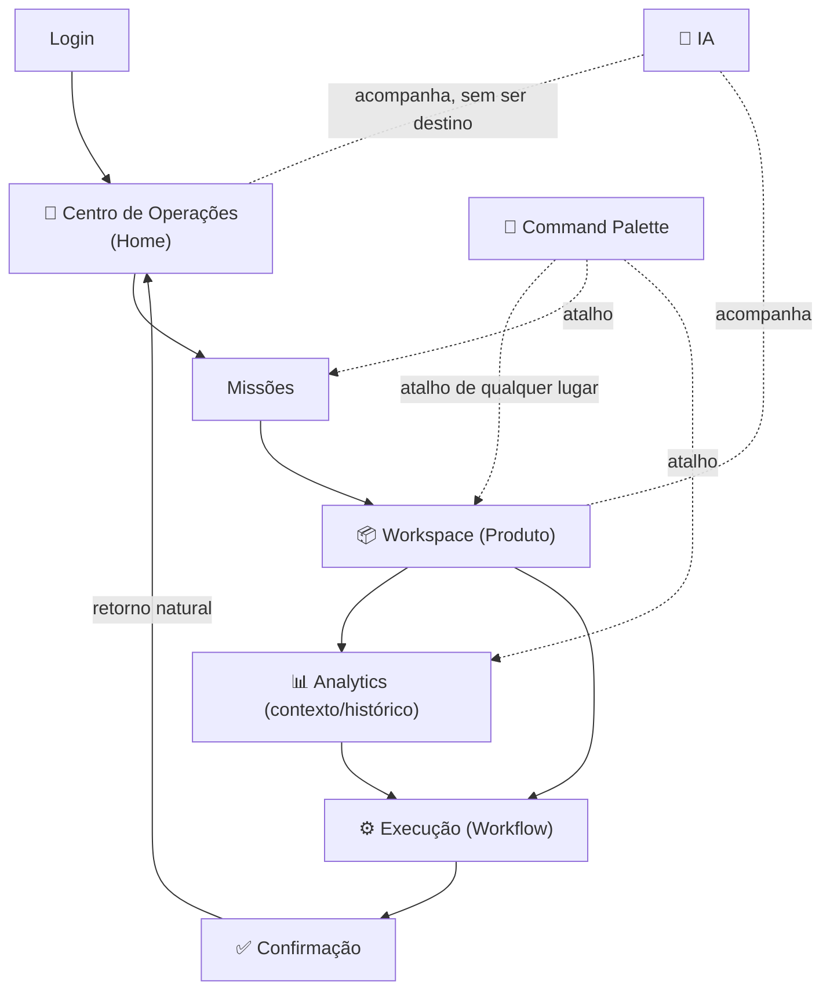

# 003 — Navigation

> **Modelo oficial de navegação da Zion Platform.** Define **como o usuário circula** pela Zion: como entra, como encontra qualquer informação, como muda de contexto e **como nunca se perde**. Materializa a [Information Architecture (product/002)](./002-information-architecture.md) em destinos, controles e caminhos.

> **Relação com os documentos anteriores.** Aplica a [Product Vision (product/000)](./000-product-vision.md), os [Design Principles (product/001)](./001-design-principles.md) e a [Information Architecture (product/002)](./002-information-architecture.md). A arquitetura funcional (`architecture/` 000–019) é contexto e **não é copiada**.

> [!important] Princípio máximo da navegação
> **O usuário nunca navega entre módulos. Ele navega entre contextos de trabalho.** A navegação existe para **levar ao trabalho**, não para expor a estrutura do sistema. A melhor navegação é a que **desaparece**.

---

## 1. Objetivo

Formalizar o **modelo de navegação oficial** da Zion — a estrutura de destinos, controles e transições que garante que qualquer usuário **chegue ao trabalho em poucos passos e volte sem se perder**, em qualquer ponto da plataforma.

---

## 2. Filosofia

1. **A navegação deve desaparecer.** Quanto menos o usuário pensa "onde clico?", melhor. O caminho certo é o óbvio.
2. **O usuário pensa no trabalho, não no sistema.** "Quero corrigir a margem deste produto" — não "vou ao módulo de precificação".
3. **Poucos destinos.** Um punhado de lugares principais; profundidade em contexto, não em menu.
4. **Muito contexto.** O usuário sempre sabe **onde está**, **de onde veio** e **para onde vai**.
5. **Sempre há um próximo passo e um retorno.** Nunca um beco sem saída ([001](./001-design-principles.md)).

---

## 3. Modelo de Navegação

O ciclo oficial — do login à ação e **de volta**:

```
Entrada
  ↓
Centro de Operações  (a Home · o trabalho do dia)
  ↓
Missões              (o que fazer agora)
  ↓
Workspace            (o objeto de trabalho: o produto)
  ↓
Execução             (a ação: publicar, ajustar, sincronizar)
  ↓
Retorno              (natural, ao Centro de Operações)
```

O usuário **desce ao detalhe** (Missão → Workspace → Execução) e **sobe de volta** (Centro de Operações), com o **contexto acumulando na descida e preservado no retorno**. Esse ciclo é a espinha de toda navegação; tudo o mais são atalhos e visões dentro dele.

---

## 4. Estrutura Global

Os **destinos principais** da Zion — poucos, estáveis, de alto nível:

| Destino | Papel | Casa (arquitetura) |
|---------|-------|--------------------|
| **Centro de Operações** | A Home. O trabalho do dia: Missões, filas, alertas. | [015](../architecture/015-operation-center.md) |
| **Produtos** | O acervo de Produtos Mestre; entrada para os Workspaces. | [011](../architecture/011-product-master-workspace.md) |
| **Analytics** | A evolução, tendências e história da operação. | [018](../architecture/018-operational-analytics.md) |
| **Organização** | (Equipe) clientes, equipe, papéis. | [000](../architecture/000-business-domain.md) |
| **Configurações** | Políticas, integrações, preferências (raramente tocado). | camada 5 ([002](./002-information-architecture.md)) |

> [!important] Cinco destinos, não cinquenta
> A Zion tem **poucos destinos globais** — deliberadamente. Custos, Margem, Health, Workflow, IA **não são destinos**: eles aparecem como **visões dentro** dos destinos (o custo no produto, o Health na operação). O que cresce é a **profundidade de contexto**, nunca a lista de destinos ([002 §Escalabilidade](./002-information-architecture.md)).

---

## 5. Barra Lateral

A barra lateral é a **navegação entre destinos globais** ([§4](#4-estrutura-global)).

| Regra | Definição |
|-------|-----------|
| **Sempre visível** | Os poucos destinos globais (Centro de Operações, Produtos, Analytics, Organização/Config conforme papel). |
| **Muda conforme o contexto** | Destaca o destino atual; pode revelar sub-navegação **do contexto** (ex.: dentro de Produtos, filtros/visões) — nunca menus de Capability. |
| **Nunca deve aparecer** | Um item por Capability (não existe "menu Cost Engine", "menu Workflow", "menu IA"). Menus técnicos são **proibidos**. |

Princípio: a barra lateral orienta **onde estou entre os contextos** — curta, estável, previsível. Ela não é um índice do sistema.

---

## 6. Barra Superior

A barra superior concentra o que é **transversal a qualquer contexto**:

| Elemento | Responsabilidade |
|----------|------------------|
| **Troca de organização/cliente** | (Equipe) alternar o tenant em operação — o contexto Cliente ([002](./002-information-architecture.md)). |
| **Busca** | Ponto de entrada do [Command Palette](#7-command-palette) — encontrar qualquer objeto. |
| **Notificações** | O que mudou e talvez exija o usuário (nunca alarmista — [001](./001-design-principles.md)). |
| **Perfil** | Conta, preferências, sair. |
| **IA** | Presença contextual (não um menu — ver [§12](#12-ia-na-navegação)); acesso ao copiloto **do contexto atual**. |

Princípio: a barra superior é **contexto-transversal** (vale em qualquer tela); a lateral é **entre-contextos**. Juntas, o usuário sempre sabe **onde está** e **o que é global**.

---

## 7. Command Palette

Cria-se oficialmente o **Command Palette** — a **busca universal** que reduz navegação a **uma tecla**.

O que o Command Palette faz:
- **Abrir Produto** — "chinelo slim" → vai ao Workspace daquele produto.
- **Abrir Missão** — pular direto para uma Missão.
- **Executar ação** — "publicar", "sincronizar ERP", "revisar preço".
- **Ir para Workspace / contexto** — saltar para qualquer contexto.
- **Encontrar qualquer objeto** — produto, cliente, pedido, canal.

> [!important] Buscar é navegar
> O Command Palette materializa o princípio **"toda informação é encontrada por busca"** ([002](./002-information-architecture.md)). Em vez de **clicar por menus** até o objeto, o usuário **digita o objeto** e chega direto. Isso permite que a plataforma cresça sem crescer em menus: novos objetos e ações ficam **pesquisáveis**, não empilhados numa árvore. É o antídoto contra a navegação profunda.

---

## 8. Navegação por Contexto

Cada **contexto de trabalho** tem sua **navegação própria** (local), coerente com o objeto:

| Contexto | Navegação interna |
|----------|-------------------|
| **Produto** | Seções do Workspace: Identidade, Conteúdo, Variantes, Preços, ERP, Marketplaces, Versões, Timeline — mesmo produto, ângulos diferentes ([011](../architecture/011-product-master-workspace.md)). |
| **Marketplace** | Alternar entre canais; ver estado/publicação/problemas por canal. |
| **Analytics** | Alternar entre visões (produto, canal, operação) e períodos; sempre com comparação. |
| **Missões** | Fluxo linear: objetivo → contexto → ação → concluir. |
| **Cliente** | (Equipe) alternar entre empresas-cliente, mantendo a mesma linguagem. |

Princípio: dentro de um contexto, a navegação **mantém o objeto fixo** e muda o **ângulo** — o contexto do usuário nunca é perdido ([002 §Navegação Local](./002-information-architecture.md)).

---

## 9. Deep Links

Registra-se oficialmente: **todo link abre exatamente no ponto de trabalho e preserva o estado.**

- **Toda Missão abre no ponto exato.** *"Corrigir margem do produto X"* abre o Workspace de X, na seção de preço, com a recomendação já visível — não na home de Produtos.
- **Todo link preserva contexto.** Compartilhar/retomar um link recoloca o usuário **onde o trabalho está**, com o objeto e o estado carregados.
- **Nunca perder o estado.** Voltar, recarregar ou abrir de fora não zera o contexto acumulado.

Princípio: um deep link é um **atalho para o trabalho**, não para uma tela genérica. Ele encurta o [Modelo de Navegação](#3-modelo-de-navegação) direto ao ponto.

---

## 10. Breadcrumbs

Breadcrumbs servem à **orientação** ("onde estou e como subo"), não à decoração.

| Usar breadcrumbs | Não usar breadcrumbs |
|------------------|----------------------|
| Quando há **profundidade de contexto** (ex.: Cliente → Produto → Variante) e o usuário precisa **subir de nível**. | No **Centro de Operações** (é a raiz — não há acima). |
| Quando o caminho tem valor de **localização** (mostra a hierarquia real). | Em fluxos **lineares** (Missão), onde "voltar/concluir" basta. |
| Para dar **retorno rápido** a um nível intermediário. | Quando duplicaria a barra lateral/superior sem agregar. |

Princípio: breadcrumb é **mapa de retorno**, não enfeite. Se não ajuda a se localizar ou voltar, não entra.

---

## 11. Navegação por Papel

Cada **papel** tem uma **entrada diferente** — mas **a linguagem permanece igual** ([000](./000-product-vision.md)).

| Papel | Entrada / foco | Observação |
|-------|----------------|------------|
| **Equipe** | Visão multi-cliente; opera várias empresas. | Vê o contexto Cliente e pode alternar tenants. |
| **Cliente** | Direto na operação da **sua** empresa (Portal). | Nunca vê outros tenants ([RLS](../architecture/010-database-compliance.md)). |
| **Administrador** | Entrada com acesso a Organização/Configurações. | Governança e usuários. |
| **Gestor** | Foco em visão executiva (Analytics, Health, ROI). | Decide; aprova o que a política exige ([019](../architecture/019-workflow-engine.md)). |
| **Operador** | Direto no Centro de Operações e Missões. | O dia a dia da execução. |

> [!important] Mesma casa, portas diferentes
> Os papéis entram por **portas diferentes** e veem **escopos diferentes**, mas todos falam **o mesmo idioma Zion** — mesmos conceitos, mesma navegação, mesma consistência ([001](./001-design-principles.md)). Um operador que vira gestor **não reaprende** a plataforma.

---

## 12. IA na Navegação

> [!important] A IA nunca possui menu. Nunca vira destino.

- **Nunca tem menu próprio** — não existe "ir ao módulo de IA".
- **Nunca é destino** — não se "navega para a IA".
- **Sempre acompanha o contexto** — está onde o usuário está.
- **Sempre aparece próxima da ação** — a recomendação vem com o botão de agir, sem interromper.

Princípio: a IA é **presença**, não **lugar** ([002 §12](./002-information-architecture.md)). Transformá-la em destino contradiria "uma única inteligência" e a faria parecer "mais um módulo".

---

## 13. Mobile

No celular, a navegação **prioriza o essencial** — o operador em movimento:

1. **Priorizar Missões.** A entrada é "o que fazer agora?" — a lista de Missões, direto.
2. **Ações rápidas.** Aprovar, corrigir, publicar em poucos toques.
3. **Busca em destaque.** O Command Palette (busca) é o atalho central — buscar em vez de navegar.
4. **Navegação simplificada.** Menos destinos visíveis; profundidade sob demanda; o retorno sempre óbvio.

Princípio: o mobile não é a plataforma inteira encolhida — é a **camada de Operação** ([002](./002-information-architecture.md)) no bolso: Missões, ação e busca.

---

## 14. Estados de Navegação

A navegação **se adapta ao estado** da operação — a mesma estrutura, ênfases diferentes:

| Estado | Como a navegação se adapta |
|--------|----------------------------|
| **Primeiro acesso** | A entrada guia o primeiro passo (Zion Coach); poucos destinos, muita orientação ([016](../architecture/016-implantation-journey.md)). |
| **Sem Missões** | O Centro de Operações comunica "operação em dia" — vazio calmo, não tela morta ([001](./001-design-principles.md)). |
| **Operação saudável** | Foco em evolução/oportunidades; Missões de crescimento em destaque. |
| **Operação crítica** | O urgente sobe ao topo (prejuízo, ruptura, erro); o cockpit prioriza a correção. |
| **Empresa nova** | Navegação enxuta; contextos avançados (Analytics profundo) aparecem à medida que amadurece. |
| **Empresa madura** | Todos os contextos ativos; atalhos e automação em evidência. |

Princípio: a navegação **respira com a operação** — mostra o que importa **agora**, sem mudar o mapa mental.

---

## 15. Escalabilidade

Como um **novo Capability** entra na navegação **sem inchá-la**:

- **Sem criar novos menus.** Ele entra como **visão dentro de um contexto** (ex.: uma nova análise vira uma visão em Analytics; um novo canal vira uma aba em Marketplace).
- **Sem quebrar a estrutura.** Segue o [Modelo de Navegação](#3-modelo-de-navegação): entra pelo cockpit/objeto, tem retorno natural, é pesquisável.
- **Sempre encontrável pela busca.** O Command Palette indexa o novo objeto/ação — descoberta sem menu.

Princípio: a Zion cresce **por composição** ([002](./002-information-architecture.md)/[017](../architecture/017-zion-intelligence-operating-system.md)). Se um recurso novo "precisa de um menu", provavelmente está sendo modelado como módulo — e não deveria.

---

## 16. Princípios

Princípios **oficiais** da navegação:

1. **Toda navegação preserva contexto.**
2. **Toda ação importante está a poucos cliques.**
3. **Todo retorno é natural.**
4. **Toda informação é encontrada por busca** (Command Palette).
5. **Nenhum menu cresce indefinidamente.**
6. **A Home é sempre o Centro de Operações.**
7. **A IA nunca vira menu nem destino.**
8. **Navega-se por contexto, nunca por módulo.**

---

## 17. Critérios de Aceite

A navegação está conforme esta visão quando **todos** os critérios abaixo são verdadeiros:

- [ ] **Home fixa:** ao entrar, o usuário cai no Centro de Operações.
- [ ] **Poucos destinos globais:** a barra lateral tem um punhado de contextos, nenhum menu por Capability.
- [ ] **Ciclo com retorno:** login → cockpit → Missão → Workspace → Execução → retorno; sem becos.
- [ ] **Command Palette:** qualquer objeto/ação é alcançável por busca.
- [ ] **Deep links preservam estado:** toda Missão/link abre no ponto exato, com contexto carregado.
- [ ] **Navegação local mantém o objeto:** dentro de um contexto, muda o ângulo, não o objeto.
- [ ] **Breadcrumbs só onde orientam:** presentes na profundidade, ausentes na raiz e em fluxos lineares.
- [ ] **Papéis com entradas próprias, idioma único:** Equipe/Cliente/Admin/Gestor/Operador entram diferente, navegam igual.
- [ ] **IA sem menu:** acompanha o contexto, aparece junto da ação, nunca é destino.
- [ ] **Mobile prioriza Missões/ação/busca.**
- [ ] **Navegação adapta-se ao estado** (primeiro acesso, sem Missões, crítico, maduro) sem mudar o mapa mental.
- [ ] **Escala sem menu:** novo Capability entra como visão em contexto e fica pesquisável.
- [ ] **Multiempresa isolada:** troca de cliente respeita o tenant ([RLS](../architecture/010-database-compliance.md)).

---

## Seção especial — Mapa Oficial de Navegação

O fluxo canônico da Zion, com os atalhos que o encurtam:



**Leitura:** o caminho principal é a **coluna central** (Login → Centro de Operações → Missões → Workspace → Execução → retorno). O **Command Palette** é o **atalho universal** que salta direto ao objeto. A **IA** acompanha os nós — nunca é um nó de destino.

---

## Seção especial — Exemplo Completo (a Jornada do Alex)

| Passo | Ação do Alex | Como a navegação se comporta |
|:----:|--------------|------------------------------|
| 1 | **Entra na Zion** | Cai no **Centro de Operações** (Home) — "3 Missões prioritárias hoje". |
| 2 | **Recebe uma Missão** | *"Corrigir margem de 5 chinelos abaixo do piso."* Um clique. |
| 3 | **Abre o Produto Mestre** | O deep link da Missão abre o **Workspace** no ponto certo (seção de preço), recomendação da IA já visível. |
| 4 | **Consulta Analytics** | Dentro do mesmo contexto, vê "a margem caiu após o custo subir em abril" — **sem perder o produto**. |
| 5 | **Executa um Workflow** | Ajusta o preço; o **Workflow Engine** executa (dentro da política); a Zion mostra o progresso. |
| 6 | **Recebe confirmação** | "Pronto — preço atualizado no Mercado Livre. Margem volta ao piso." Impacto visível. |
| 7 | **Volta ao Centro de Operações** | **Retorno natural**; a Missão fecha; a próxima já está lá. |

> [!important] O contexto acumula e nunca se rompe
> Em nenhum passo o Alex "abriu outro módulo" ou "voltou ao início". Ele **desceu** (Missão → Workspace → Analytics → Execução) e **subiu** (cockpit), com o contexto **acumulando** e **preservado** no retorno. Ele navegou pelo **trabalho**, não pelo **sistema** — e nunca precisou pensar na navegação.

---

## Seção especial — Regras de Ouro

Lista **oficial** — inegociável:

1. **A Home sempre é o Centro de Operações.**
2. **Toda Missão leva ao contexto correto** (deep link ao ponto de trabalho).
3. **A IA nunca vira menu nem destino.**
4. **Toda informação pode ser encontrada pela busca** (Command Palette).
5. **Toda navegação preserva o estado do usuário.**
6. **Nunca criar um menu para um Capability.**
7. **Sempre navegar por contexto**, nunca por módulo.
8. **Todo caminho tem retorno natural** — nenhum beco sem saída.
9. **Poucos destinos globais; profundidade em contexto.**
10. **Mesma linguagem para todos os papéis.**

---

> **Registro oficial:** **O usuário nunca navega entre módulos. Ele navega entre contextos de trabalho.**

> **Status:** `product/003` — Navigation **v1.0**. Modelo oficial de navegação: materializa a [Information Architecture (product/002)](./002-information-architecture.md) em destinos, controles (barra lateral/superior, Command Palette), deep links, papéis e estados. As **Regras de Ouro** e o **Mapa Oficial de Navegação** são referência da plataforma. **Próximo documento sugerido:** `product/004-operation-center.md` (o desenho de produto da Home — o Centro de Operações como experiência: a composição do cockpit, os widgets de trabalho, como Missões/Filas/Alertas se organizam na tela, o comportamento do estado vazio e do estado crítico, e como a IA e o Health aparecem ali — o primeiro contexto detalhado, já que é a porta de entrada de toda a plataforma).
