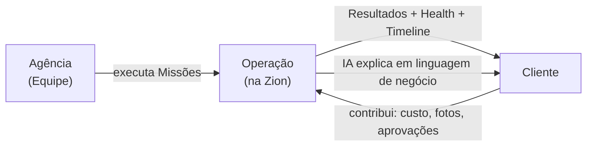

# 006 — Client Portal (Experiência)

> **Desenho de produto do Portal do Cliente.** Este documento define a experiência da **empresa-cliente** dentro da Zion. **Não é um sistema separado**: o Portal é a **mesma Zion** — mesmo Design System, mesmo idioma, mesma navegação, mesmo conceito. **A única diferença é o contexto.** Usa apenas **diagramas Mermaid e wireframes ASCII** (sem Figma, sem componentes, sem código).

> **Relação com os documentos anteriores.** Aplica a [Product Vision (000)](./000-product-vision.md), os [Design Principles (001)](./001-design-principles.md), a [Information Architecture (002)](./002-information-architecture.md), a [Navigation (003)](./003-navigation.md), o [Operation Center (004)](./004-operation-center.md) e o [Product Workspace (005)](./005-product-workspace.md). A arquitetura funcional é contexto e **não é copiada**.

> [!important] Registro oficial
> **O cliente não acessa um painel. Ele acompanha a evolução da própria empresa.** O Portal existe para dar **transparência** e **gerar confiança** — não para "usar um software".

---

## 1. Objetivo

Formalizar o **Portal do Cliente** — a experiência pela qual a empresa-cliente **acompanha, participa e confia** na operação conduzida pela agência na Zion.

> [!important] Registro oficial
> **O cliente não acessa um painel — ele acompanha a evolução da própria empresa.** O Portal não é "a versão reduzida do sistema"; é a **janela do cliente para o próprio negócio**, com o mesmo idioma Zion, apenas um **escopo diferente** ([003 §11](./003-navigation.md)).

---

## 2. Filosofia

**O Portal não existe para controlar. Existe para dar transparência, gerar confiança e aproximar cliente e equipe.**

| ❌ O que o Portal **não** é | ✅ O que o Portal **é** |
|-----------------------------|-------------------------|
| Uma ferramenta de fiscalização da agência. | Uma janela de transparência sobre o próprio negócio. |
| Um relatório enviado de vez em quando. | Um acompanhamento vivo da evolução. |
| Um sistema à parte para o cliente "mexer". | A mesma Zion, no contexto do cliente. |
| Um lugar de reclamação. | Um espaço de colaboração cliente↔equipe. |

Princípio: o Portal transforma a relação agência↔cliente de "caixa-preta com relatório mensal" em **parceria transparente** — o cliente **entende o trabalho** e, por isso, **confia** nele.

---

## 3. Estrutura Geral

O Portal segue a mesma [Hierarquia da Informação do 001](./001-design-principles.md): a empresa e sua saúde primeiro, o resultado e o trabalho no corpo, o histórico ao fim.

```
+--------------------------------------------------------------+
|  HEADER · Minha Empresa · busca · notificações · perfil      |
+--------------------------------------------------------------+
|  🏢 MINHA EMPRESA · Health Geral 77 🟡 · Maturidade: Prata   |
+-----------------------------+--------------------------------+
|  ❤️ HEALTH                  | 🤖 COACH (linguagem de negócio)|
|  Comercial · Operação · IA  | "Sua empresa evoluiu 5% no mês"|
+-----------------------------+--------------------------------+
|  📈 RESULTADOS              | 🎯 MISSÕES (que dependem de você)|
|  publicados · IA · margem   | "Informar custo de 3 produtos" |
+-----------------------------+--------------------------------+
|  👥 MINHA EQUIPE            | 🕑 TIMELINE (marcos)           |
|  consultor · especialistas  | "12 produtos publicados"       |
+--------------------------------------------------------------+
|  📊 ANALYTICS · "o tempo de publicação caiu 40%"             |
+--------------------------------------------------------------+
```

| Área | Papel |
|------|-------|
| **Minha Empresa** | A visão-síntese do próprio negócio (a primeira coisa vista). |
| **Health** | A saúde da operação do cliente, em linguagem clara. |
| **Coach** | A IA falando de negócio (evolução, oportunidades, pendências). |
| **Resultados** | O que a Zion + a agência entregaram (narrativa). |
| **Missões** | O que **depende do cliente**. |
| **Minha Equipe** | Quem, na agência, cuida da operação. |
| **Timeline** | Os marcos relevantes (sem tecnês). |
| **Analytics** | O conhecimento resumido da evolução. |

---

## 4. Minha Empresa

A **primeira informação** que o cliente vê — a síntese do próprio negócio. Ele enxerga **sua empresa, não módulos** ([002 §Modelo Mental](./002-information-architecture.md)).

| Mostra | Leitura para o cliente |
|--------|------------------------|
| **Health Geral** | "Minha operação está saudável?" |
| **Maturidade** | "Em que nível minha empresa está?" (Bronze→Elite, [016](../architecture/016-implantation-journey.md)) |
| **Produtos** | Quantos, quão completos. |
| **Marketplaces** | Onde estou vendendo e como. |
| **IA** | Quanto a inteligência já me ajuda. |
| **Missões** | O que precisa de mim. |
| **Analytics** | Como evoluí. |

> [!important] A empresa, não o sistema
> O cliente não vê "Cost Engine", "Workflow", "ZIOS". Ele vê **a saúde do seu negócio, seus resultados e o que precisa fazer**. A tecnologia é invisível; o que aparece é **a empresa dele**.

---

## 5. Resultados

Os **resultados reais** — sempre como **narrativa**, nunca só gráficos ([001 §Narrativas](./001-design-principles.md)):

| Resultado | Como aparece |
|-----------|--------------|
| **Produtos publicados** | "142 produtos no ar em 3 canais." |
| **Tempo economizado** | "A automação poupou ~34 horas este mês." |
| **Uso da IA** | "A IA enriqueceu 120 produtos e otimizou 88 títulos." |
| **Margem média** | "Sua margem média subiu de 16% para 19%." |
| **Pendências resolvidas** | "27 pendências resolvidas — catálogo mais completo." |
| **Missões concluídas** | "41 Missões concluídas no mês." |

> [!important] Resultado é história, não gráfico
> Um número ("34 horas") sem história não gera confiança. "A automação poupou 34 horas que sua equipe usou para vender" — isso gera. Todo resultado no Portal **conta o que significa para o negócio**.

---

## 6. Missões Compartilhadas

**Nem todas as Missões pertencem à agência — algumas dependem do cliente.** O Portal mostra ao cliente **o que só ele pode fazer**:

| Missão do cliente | Exemplo |
|-------------------|---------|
| **Informar custo** | "Informe o custo de 3 produtos para calcularmos sua margem real." |
| **Enviar imagens** | "Envie fotos melhores para publicarmos com qualidade." |
| **Aprovar descrição** | "Revise e aprove a descrição deste produto." |
| **Validar categoria** | "Confirme a categoria correta deste item." |
| **Confirmar preço** | "Aprove o preço sugerido para publicação." |

Cada Missão do cliente explica:

| Campo | Responde |
|-------|----------|
| **Por que existe** | O motivo (ex.: "sem o custo, não sabemos sua margem"). |
| **Quem solicitou** | Quem, na equipe, pediu (rosto humano, não sistema). |
| **Qual impacto** | O que se destrava (ex.: "com isto, publicamos 12 produtos"). |
| **Prazo** | Quando é ideal responder. |

Princípio: a Missão compartilhada transforma o cliente de **espectador** em **participante** — ele contribui com o que só ele tem (custo, fotos, aprovação), e vê o impacto disso.

---

## 7. Transparência da Operação

Cria-se oficialmente a **Transparência da Operação** — o cliente enxerga **como o trabalho anda**, sem vigiar ninguém:

| O cliente vê | Não é… |
|--------------|--------|
| **Quem está trabalhando** na sua conta. | …monitoramento de comportamento. |
| **Qual Missão está sendo executada** agora. | …fiscalização de produtividade individual. |
| **Tempo estimado** para o próximo resultado. | …cobrança de relógio. |
| **Próximo passo** da operação. | …controle. |

> [!important] Transparência, não vigilância
> A transparência existe para **gerar confiança** ("vejo que minha conta está sendo cuidada"), não para vigiar pessoas. O cliente acompanha o **trabalho** e o **progresso** — nunca o comportamento individual de um operador. É o mesmo princípio do [Painel do Gestor (004)](./004-operation-center.md): a Zion ilumina a **operação**, jamais transforma pessoas em alvo.

---

## 8. Minha Equipe

O cliente vê **quem, na agência, cuida da sua operação** — dando rosto humano à parceria:

| Papel | Responsabilidade |
|-------|------------------|
| **Consultor** | O ponto focal; entende o negócio do cliente. |
| **Especialista Marketplace** | Cuida da publicação e da saúde nos canais. |
| **Especialista Conteúdo** | Título, descrição, ficha, imagens. |
| **Especialista SEO** | Visibilidade e ranqueamento. |
| **Customer Success** | Garante que o cliente evolui e está satisfeito. |

Princípio: mostrar a equipe **humaniza** a relação — o cliente sabe **com quem conta**, não fala com um sistema anônimo. Reforça confiança e parceria.

---

## 9. IA Coach

A versão do [Coach](../architecture/016-implantation-journey.md) voltada ao **cliente** — **sempre em linguagem de negócio, nunca técnica**:

| O Coach comunica | Exemplo (linguagem de negócio) |
|------------------|--------------------------------|
| **Evolução** | "Sua empresa evoluiu 5% em saúde este mês." |
| **Oportunidades** | "3 produtos têm espaço para vender mais — vale revisar o preço." |
| **Pendências** | "Faltam custos de 3 produtos para sabermos seu lucro real." |
| **Riscos** | "8 anúncios estão com problema e podem estar perdendo venda." |

| ❌ Técnico (nunca) | ✅ Negócio (sempre) |
|---------------------|----------------------|
| "SIZE_GRID inválido em 8 listings." | "8 anúncios estão fora do ar por um detalhe de tamanho — já estamos resolvendo." |
| "Precisão de custo: baixa." | "Ainda faltam alguns custos para seu lucro ficar 100% confiável." |

Princípio: para o cliente, a IA fala como um **consultor de negócios**, não como um engenheiro.

---

## 10. Timeline

A Timeline do cliente mostra **apenas eventos relevantes ao negócio** — **sem excesso de detalhe técnico**:

```
🕑  Esta semana · 12 produtos publicados no Mercado Livre
    3 dias       · campanha de verão iniciada
    5 dias       · categoria de 4 produtos ajustada
    1 semana     · você informou o custo de 8 produtos
    1 semana     · 15 Missões concluídas
```

Registra: produtos publicados, campanhas iniciadas, categorias alteradas, custos informados, Missões concluídas — **os marcos que o cliente entende e valoriza**. O detalhe técnico (eventos de sistema, retries) fica na operação da Equipe, não no Portal.

---

## 11. Analytics

O Portal mostra **conhecimento, nunca BI completo** — o cliente quer **entender**, não explorar planilhas:

| Mostra (conhecimento) | Não mostra |
|-----------------------|------------|
| "Sua operação está mais saudável (77, +5)." | Painéis extensos e filtros. |
| "O tempo de publicação caiu 40%." | Exploração livre de dados. |
| "A IA economizou 34 horas." | Relatórios técnicos. |
| "Sua margem evoluiu de 16% para 19%." | Dashboards de BI. |

Princípio: cada número vem com **contexto e significado de negócio** ([001](./001-design-principles.md)). O cliente sai sabendo **como está evoluindo** — não com uma tabela para decifrar.

---

## 12. Aprovações

O cliente aprova o que é **decisão dele** — com histórico registrado:

| Aprova | Observação |
|--------|-----------|
| **Conteúdo** | Descrição, ficha. |
| **SEO** | Título/keyword propostos. |
| **Campanhas** | Promoções/ações. |
| **Imagens** | Fotos e artes. |
| **Descrições** | Texto do anúncio. |
| **Preços** | Quando configurado que o cliente aprova preço. |

> [!important] Toda aprovação tem histórico
> Cada aprovação registra **quem aprovou, o quê, quando** — no [Intelligence Ledger](../architecture/017-zion-intelligence-operating-system.md)/Timeline. Isso protege ambos os lados (cliente e agência) e torna a colaboração **auditável**. Aprovar no Portal é rápido (poucos cliques, contexto ao lado) e nunca é um beco: aprovar/editar/pedir ajuste.

---

## 13. Conversas

Cria-se oficialmente a **Conversa em contexto** — **nunca um chat genérico**. Toda comunicação **pertence a um objeto**:

| A conversa pertence a… | Exemplo |
|------------------------|---------|
| **Produto** | "Sobre o Chinelo Slim: pode enviar uma foto melhor?" |
| **Missão** | Discussão dentro da Missão "Aprovar descrição". |
| **Campanha** | Alinhamento sobre a promoção de verão. |
| **Marketplace** | Sobre um problema num canal específico. |
| **Workflow** | Sobre uma execução em andamento. |

**Vantagens da conversa contextual:**
- **Nada se perde** — a conversa fica **junto do trabalho** a que se refere.
- **Sem "de qual produto você fala?"** — o contexto já está ali.
- **Histórico útil** — qualquer um da equipe entende, mesmo entrando depois.
- **Menos ruído** — não há um chat solto onde tudo se mistura.

Princípio: conversar na Zion é **comentar sobre algo**, não trocar mensagens no vácuo. O contexto vem junto.

---

## 14. Navegação

Como o cliente circula (mesmo [Modelo de Navegação 003](./003-navigation.md), escopo reduzido):

- **Entrada:** cai em **Minha Empresa** — a síntese do próprio negócio.
- **Missões:** o que depende dele, em destaque; um clique abre a Missão no contexto certo.
- **Produto:** pode abrir um produto (visão do cliente do [Workspace 005](./005-product-workspace.md)) para aprovar/comentar.
- **Analytics / Timeline:** conhecimento e marcos, a um clique.
- **Retorno:** **natural** a Minha Empresa após a ação.

Princípio: poucos destinos, muito contexto, retorno sempre óbvio — e **nunca** vê outro cliente ([RLS](../architecture/010-database-compliance.md)).

---

## 15. Princípios

Princípios **oficiais** do Portal do Cliente:

1. **O cliente nunca vê outro cliente** (isolamento por tenant).
2. **Toda informação possui contexto.**
3. **Toda aprovação possui histórico.**
4. **Toda conversa pertence a um contexto.**
5. **Toda IA explica** (em linguagem de negócio).
6. **Toda ação gera confiança.**
7. **Transparência, nunca vigilância.**
8. **O Portal mostra evolução, não software.**

---

## 16. Critérios de Aceite

O Portal do Cliente está conforme esta visão quando **todos** os critérios abaixo são verdadeiros:

- [ ] **Mesma Zion, contexto do cliente:** mesmo Design System/idioma/navegação; muda o escopo, não a linguagem.
- [ ] **Entra em "Minha Empresa":** o cliente vê o próprio negócio (Health, maturidade, resultados), não módulos.
- [ ] **Resultados como narrativa:** todo número vem com significado de negócio.
- [ ] **Missões compartilhadas:** o que depende do cliente aparece com por quê/quem/impacto/prazo.
- [ ] **Transparência sem vigilância:** vê o trabalho e o progresso, nunca o comportamento individual.
- [ ] **Minha Equipe visível:** o cliente sabe com quem conta na agência.
- [ ] **Coach em linguagem de negócio:** nunca tecnês; evolução/oportunidade/pendência/risco.
- [ ] **Timeline de marcos:** só o relevante ao negócio, sem detalhe técnico.
- [ ] **Analytics = conhecimento:** entendimento resumido, não BI completo.
- [ ] **Aprovações com histórico:** conteúdo/SEO/imagens/campanhas/preço (quando configurado), auditáveis.
- [ ] **Conversas em contexto:** toda mensagem pertence a produto/missão/campanha/canal/workflow; nunca chat genérico.
- [ ] **Isolamento por tenant:** o cliente nunca vê outro cliente ([RLS](../architecture/010-database-compliance.md)).
- [ ] **Navegação com retorno:** entra, age, volta a Minha Empresa; sem becos.

---

## Seção especial — Um mês na vida do Alex

Como o Portal faz o cliente **acompanhar e confiar** (Alex = cliente, Chinelaria):

| Momento | O que acontece no Portal |
|---------|--------------------------|
| **Alex entra** | Cai em **Minha Empresa**: Health 72 🟡, Maturidade Prata, "3 coisas dependem de você". |
| **Recebe uma solicitação** | Missão do cliente: *"Informe o custo de 3 produtos — sem isso não sabemos sua margem real."* (pedida pela consultora). |
| **Informa um custo** | Preenche os 3 custos; o Coach: *"Ótimo! Agora seu lucro ficará confiável."* |
| **Aprova um conteúdo** | Revisa a descrição de um chinelo e aprova; fica registrado. |
| **Acompanha a publicação** | Vê "publicando → ativo" — 12 produtos no ar, sem precisar perguntar à equipe. |
| **Recebe o resumo semanal** | O Coach: *"Esta semana: 12 publicados, margem +2%, 34h economizadas pela IA."* |
| **Percebe melhora no Health** | O Health sobe para 77; a maturidade se aproxima de Ouro. |
| **A IA explica os resultados** | *"Sua margem melhorou porque incorporamos seus custos reais e ajustamos 5 preços."* |

> [!important] Confiança nasce do entendimento
> Ao fim do mês, Alex **confia** na agência — não por fé, mas porque **entende o trabalho**: viu as Missões, contribuiu com o que era dele, acompanhou os resultados e a IA explicou tudo em linguagem que ele compreende. **O Portal não mostrou software; mostrou a empresa dele evoluindo.**

---

## Seção especial — Transparência Operacional

Como a Zion **fortalece a relação agência↔cliente** — colaboração, nunca vigilância:



| O cliente vê | Para… |
|--------------|-------|
| **Missões** (da agência e as dele) | saber o que está sendo feito e o que depende dele. |
| **Responsáveis** | saber com quem conta. |
| **Próximos passos** | entender para onde a operação vai. |
| **Resultados** | ver o valor entregue. |

> [!important] Colaboração, não fiscalização
> A transparência transforma a relação: o cliente **participa** (Missões compartilhadas), **entende** (Coach + resultados) e **confia** (histórico + responsáveis). A agência ganha um cliente **engajado** em vez de desconfiado. A Zion é o **ambiente de trabalho compartilhado** onde os dois lados colaboram — nunca uma ferramenta de um lado vigiar o outro.

---

## Seção especial — Os Dez Mandamentos do Portal

Lista **oficial** — inegociável para o Portal do Cliente:

1. **O cliente acompanha, não fiscaliza.**
2. **Toda informação gera confiança.**
3. **Toda aprovação possui contexto.**
4. **Toda conversa possui histórico.**
5. **Toda IA fala linguagem de negócio.**
6. **Toda tela transmite tranquilidade.**
7. **Toda melhoria é explicada.**
8. **Toda evolução é comemorada** (marcos, certificações, conquistas).
9. **Toda relação fortalece a parceria.**
10. **O cliente nunca vê outro cliente.**

---

> **Registro oficial:** **O Portal do Cliente não existe para mostrar software — existe para mostrar evolução. A Zion aproxima empresas, equipes e tecnologia em um único ambiente de trabalho compartilhado.**

> **Status:** `product/006` — Client Portal (Experiência) **v1.0**. Desenho de produto do terceiro ambiente: a janela do cliente para o próprio negócio — mesma Zion, contexto do cliente. Transparência sem vigilância, Missões compartilhadas, Coach em linguagem de negócio, aprovações e conversas em contexto, isolamento por tenant. Fecha a trilha dos ambientes principais de trabalho ([Cockpit 004](./004-operation-center.md) → [Workspace 005](./005-product-workspace.md) → Portal 006). **Próximo documento sugerido:** `product/007-design-system.md` (o sistema de design que unifica tudo: os tokens (cor, tipografia, espaçamento, elevação), os padrões de componente (Missão Card, Health Card, Coach Card, estados, badges de origem/precisão), o sistema de cores de Health/Precisão (🟢🟡🔴) acessível, o tom visual e as regras que garantem que Cockpit, Workspace e Portal pareçam — de fato — o mesmo produto).
