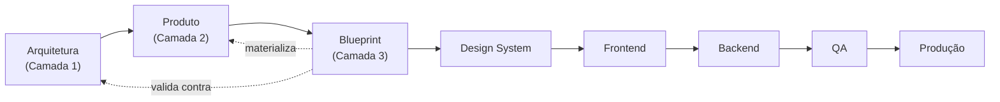
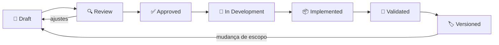

# Blueprints/000 — Blueprint Guide (Constituição dos Blueprints)

> **Constituição Oficial dos Blueprints da Zion Platform.** Este documento define **como todos os Blueprints futuros devem ser escritos**. Ele é a **terceira camada** da documentação da Zion — a que une Arquitetura + Produto e serve de **contrato de implementação** entre Produto, UX, UI, Frontend, Backend, QA e IA.

> [!important] Registro oficial
> **Os Blueprints representam a ponte definitiva entre Arquitetura, Produto, Design e Engenharia. Eles são a Fonte da Verdade para a implementação da Zion.**

> **As três camadas da documentação Zion:**
> - **Camada 1 — Arquitetura** (`docs/architecture/`): capacidades, responsabilidades, fronteiras, regras de negócio, eventos, integrações.
> - **Camada 2 — Produto** (`docs/product/`): experiência, UX, navegação, comportamento, linguagem, contexto.
> - **Camada 3 — Blueprints** (`docs/product/blueprints/`): a especificação **pronta para implementar** — une as duas anteriores.

---

## 1. Objetivo

Definir o **propósito e o padrão** dos Blueprints. Um Blueprint transforma o **o quê** (Produto) e o **porquê/regras** (Arquitetura) em um **como se comporta** implementável — de modo que qualquer time construa a mesma coisa, sem reinterpretar conceitos.

Esta Constituição garante que **todo Blueprint da Zion tenha a mesma forma, o mesmo rigor e a mesma rastreabilidade** — para que a plataforma inteira seja construída como um só produto.

---

## 2. O que é um Blueprint

> [!important] Definição oficial
> **Um Blueprint é uma especificação funcional pronta para implementação.** Ele descreve **como uma tela/fluxo funciona**, com detalhe suficiente para Design e Engenharia construírem sem interpretar conceitos.

Um Blueprint **não é**:
- **Não é Arquitetura** — não define capacidades, fronteiras nem regras de negócio (isso é Camada 1).
- **Não é UX conceitual** — não filosofa sobre experiência (isso é Camada 2).
- **Não é Design System** — não define cor, tipografia, tokens, medidas (isso é `product/007`).
- **Não é código** — não contém React, Tailwind, hooks, SQL, endpoints.

Um Blueprint é o **meio-termo executável**: concreto o bastante para implementar, abstrato o bastante para não amarrar a tecnologia.

---

## 3. O que um Blueprint responde

- **Como esta tela/fluxo funciona?**
- **Quais componentes existem?**
- **Quais estados existem?**
- **Como o usuário interage?** (clique, hover, scroll, tempo real, feedback)
- **Quais eventos acontecem?** (consumidos e disparados)
- **Quais comportamentos são esperados** em cada situação?
- **De onde vêm os dados** de cada componente?
- **Quando algo aparece, muda ou desaparece?**

---

## 4. O que um Blueprint NÃO responde

Deliberadamente **fora de escopo** (para não amarrar decisões de engenharia):

- **Banco de dados** (schema, tabelas, migrações).
- **API** (endpoints, contratos HTTP, payloads).
- **Hooks / estado global** (Redux, Zustand, Context…).
- **React** (JSX, componentes implementados).
- **Tailwind / CSS** (classes, estilos).
- **Infraestrutura** (deploy, filas, cache).

> [!note] Fronteira clara
> O Blueprint diz *"existe um `MissionCard` com estados X e eventos Y"*. **Como** isso vira componente React, **qual** endpoint alimenta e **qual** tabela persiste é decisão de Engenharia + Design System — nunca do Blueprint.

---

## 5. Estrutura Oficial

**Todo Blueprint deve conter, nesta ordem**, as seguintes seções (padrão obrigatório):

| # | Seção | O que traz |
|---|-------|-----------|
| 1 | **Cabeçalho Oficial** | Metadados ([§6](#6-cabeçalho-oficial)). |
| 2 | **Objetivo** | Propósito, quem usa, quando, o que espera. |
| 3 | **Objetivos do Usuário** | As perguntas que a tela responde. |
| 4 | **Wireframe ASCII** | O layout de referência ([§10](#10-wireframes)). |
| 5 | **Anatomia** | Cada região: objetivo, dados, prioridade, ações. |
| 6 | **Componentes** | Catálogo no padrão do [§7](#7-componentes). |
| 7 | **Fluxos** | Diagramas Mermaid ([§9](#9-fluxos)). |
| 8 | **Estados** | Todos os estados do [§8](#8-estados). |
| 9 | **Interações** | Clique, hover, scroll, loading, tempo real, feedback. |
| 10 | **Checklist para Desenvolvimento** | Verificação pré-implementação. |
| 11 | **Critérios de Aceite** | Objetivos e verificáveis ([§11](#11-critérios-de-aceite)). |
| 12 | **Mapa de Componentes** | Tabela: componente · responsabilidade · dados · ações · estados · eventos. |
| 13 | **Preparação para Implementação** | Inventário de componentes/estados/props/eventos/dependências (sem código). |
| 14 | **Resumo Executivo** | Síntese ao final (na entrega). |

Seções especiais adicionais (cenários, manifestos temáticos) são permitidas **depois** das obrigatórias.

---

## 6. Cabeçalho Oficial

Todo Blueprint abre com um bloco de **metadados padronizado**:

```
─────────────────────────────────────────────
Status:                Draft | Review | Approved | In Development
                       | Implemented | Validated | Versioned
Owner:                 <nome/papel responsável>
Documento relacionado: <architecture/NNN> (Capability)
Capability:            <ex.: Operation Center (015)>
Experiência relacionada: <product/NNN>
Prioridade:            Alta | Média | Baixa
Complexidade:          Alta | Média | Baixa
Última revisão:        <AAAA-MM-DD>
Versão:                <v1.0>
─────────────────────────────────────────────
```

Princípio: o cabeçalho torna o Blueprint **rastreável** — quem o dono é, o que ele consome (Arquitetura/Produto), em que estágio está e quando mudou.

---

## 7. Componentes

Todo componente descrito em um Blueprint deve trazer **oito atributos**:

| Atributo | O que responde |
|----------|----------------|
| **Nome** | `PascalCase` (ex.: `MissionCard`). |
| **Objetivo** | Para que serve, em uma frase. |
| **Responsabilidade** | O que ele faz (e o que **não** faz). |
| **Origem dos dados** | Qual Capability alimenta ([§12](#12-relação-com-arquitetura)). |
| **Estados** | Todos os estados possíveis ([§8](#8-estados)). |
| **Eventos** | Consumidos (tempo real) e disparados (intenção de UI). |
| **Ações** | O que o usuário pode fazer. |
| **Dependências** | De que outros componentes/Capabilities depende. |

Princípio: um componente sem esses oito atributos **não está especificado** — está apenas mencionado.

---

## 8. Estados

Todo Blueprint deve descrever, para cada componente/tela relevante, **no mínimo** estes estados:

| Estado | Quando |
|--------|--------|
| **Loading** | Dados carregando (skeleton, nunca tela branca). |
| **Empty** | Sem dados — comunica próximo passo/calma, nunca tela morta. |
| **Error** | Falha — explica, não culpa, oferece solução ([001](../001-design-principles.md)). |
| **Healthy** | Estado saudável/nominal. |
| **Critical** | Estado que exige atenção urgente. |
| **Disabled** | Ação/área indisponível (com motivo visível). |
| **Permission denied** | Papel sem acesso (escopo/RLS) — explica, não expõe o que não pode ver. |

Estados adicionais específicos da tela (ex.: `IN_PROGRESS`, `DISMISSED`) são bem-vindos, mas os sete acima são **obrigatórios de considerar**.

---

## 9. Fluxos

Todo Blueprint deve conter **fluxos em Mermaid** — o comportamento em movimento, não só o estático.

Padrão:
- **Fluxo principal** (o caminho feliz da tela/jornada).
- **Fluxo de tempo real** (como eventos atualizam a tela).
- **Fluxos de exceção** quando relevantes (erro, permissão, vazio).


Princípio: se o comportamento tem sequência, ele vira **diagrama** — texto corrido esconde a ordem e as ramificações.

---

## 10. Wireframes

> [!important] Somente ASCII. Nunca imagens.

Todo wireframe de Blueprint é **ASCII**, embutido no próprio documento. Por quê:

1. **Versionável em Git** — muda com diff legível; imagem é binário opaco.
2. **Sem dependência de ferramenta** — qualquer um lê/edita em qualquer editor.
3. **Foco em estrutura, não em estética** — o Blueprint especifica **layout e hierarquia**, não pixels (isso é Design System/Figma, outra fase).
4. **Rápido de escrever e revisar** — encoraja iteração.
5. **Vive junto do texto** — o wireframe e sua explicação nunca se separam.

O ASCII define **regiões, ordem e prioridade** — não cores, fontes nem medidas.

---

## 11. Critérios de Aceite

Todo Blueprint **termina com critérios objetivos e verificáveis** (checkbox), cobrindo: comportamento esperado, estados, interações, tempo real, permissões/tenant, regras de UX e princípios. Um critério deve ser **testável** ("Missões acima da dobra, ordenadas por prioridade") — nunca subjetivo ("a tela deve ser bonita").

---

## 12. Relação com Arquitetura

O Blueprint **consome** a Arquitetura (Camada 1) — **nunca a substitui nem a altera**:

- **Origem de dados:** cada componente aponta o **Capability dono** (ex.: Health ← Maturity 014).
- **Eventos:** os eventos de domínio consumidos/disparados vêm do [Event Bus (004)](../../architecture/004-event-bus.md) e das capabilities.
- **Fronteiras:** o Blueprint **respeita** a Fonte da Verdade ([000](../../architecture/000-business-domain.md)) — não inventa que a tela "calcula custo" se isso é do Cost Engine.
- **Isolamento:** todo Blueprint assume [RLS deny-by-default (010)](../../architecture/010-database-compliance.md).

> [!important] Nunca substitui, nunca altera
> Se um Blueprint precisar de algo que a Arquitetura não define, isso é sinal de **lacuna na Camada 1** — que se resolve **lá**, não improvisando no Blueprint.

---

## 13. Relação com Produto

O Blueprint **materializa** a experiência (Camada 2):
- Aplica os [Design Principles (001)](../001-design-principles.md) (ação antes de informação, contexto, IA contextual).
- Segue a [Information Architecture (002)](../002-information-architecture.md) (uma casa, muitas visões) e a [Navigation (003)](../003-navigation.md) (deep links, retorno, sem becos).
- Concretiza os documentos de experiência (ex.: [Operation Center 004](../004-operation-center.md), [Workspace 005](../005-product-workspace.md), [Portal 006](../006-client-portal.md)) em telas implementáveis.

O Produto diz **como deve ser sentido**; o Blueprint diz **como deve se comportar** para que seja sentido assim.

---

## 14. Relação com Engenharia

O Blueprint **reduz interpretação** — dá a Design e Engenharia um alvo único e explícito, cortando idas-e-voltas de "o que você quis dizer com isso?".

> [!important] Registro oficial
> **Nenhuma implementação deve começar sem Blueprint aprovado.** O Blueprint é o **de-para** que evita retrabalho: sem ele, cada dev interpreta os conceitos à sua maneira e a plataforma perde consistência.

O que o Blueprint entrega à Engenharia: componentes, estados, eventos, dados de origem, comportamento em tempo real, critérios de aceite — **tudo menos as decisões técnicas** (que ficam com a Engenharia).

---

## 15. Processo Oficial

A cadeia de produção de uma tela na Zion:



Leitura: **Arquitetura → Produto → Blueprint → Design System → Frontend → Backend → QA → Produção.** O Blueprint é o **ponto de convergência** onde as duas primeiras camadas viram um contrato executável; dele em diante, o trabalho é de construção.

---

## 16. Definition of Ready (DoR)

Um Blueprint está **pronto para ser desenvolvido** quando:

```
□ Cabeçalho Oficial completo (owner, capability, experiência, status, versão)?
□ Objetivo e Objetivos do Usuário claros?
□ Wireframe ASCII presente e legível?
□ Anatomia de cada região descrita?
□ Todos os componentes no padrão dos 8 atributos (§7)?
□ Estados obrigatórios (§8) cobertos?
□ Fluxos Mermaid (principal + tempo real) presentes?
□ Interações descritas (clique/hover/scroll/loading/tempo real/feedback)?
□ Origem de dados de cada componente aponta um Capability real?
□ Eventos consumidos/disparados listados?
□ Regras de UX e permissões/tenant consideradas?
□ Critérios de Aceite objetivos e testáveis?
□ Revisado por Product, UX, Arquitetura e Engenharia (§Checklist para Revisão)?
```

---

## 17. Definition of Done (DoD)

Um Blueprint pode ser considerado **concluído** quando:

```
□ Aprovado pelos quatro revisores (Product, UX, Arquitetura, Engenharia)?
□ Sem lacunas de dados (todo componente tem origem)?
□ Sem contradição com Arquitetura (fronteiras/eventos batem)?
□ Sem contradição com Produto (princípios/navegação respeitados)?
□ Estados e erros cobertos (nada "sem tratamento")?
□ Critérios de Aceite verificáveis?
□ Versão e data registradas no cabeçalho?
□ Rastreável (aponta seus documentos de origem)?
□ Status = Approved (pronto para entrar em desenvolvimento)?
```

> [!note] DoD do Blueprint ≠ DoD da implementação
> Aqui, "Done" significa **o documento está pronto para guiar a construção** — não que a tela está pronta. A implementação tem seu próprio [Definition of Done de engenharia](../../architecture/007-execution-roadmap.md).

---

## 18. Princípios

Princípios **oficiais** dos Blueprints:

1. **Um Blueprint descreve comportamento, nunca implementação.**
2. **Todo Blueprint reduz ambiguidade** (esse é seu único propósito).
3. **Todo Blueprint possui contexto** (aponta Arquitetura + Produto de origem).
4. **Todo Blueprint é rastreável** (cabeçalho, versão, documentos-fonte).
5. **Todo Blueprint é versionado** (muda com registro, nunca em silêncio).
6. **Todo Blueprint respeita a Fonte da Verdade** (não inventa responsabilidade de Capability).
7. **Todo componente é especificado** (8 atributos), não apenas citado.
8. **Nenhuma implementação começa sem Blueprint aprovado.**

---

## Seção especial — Blueprint Lifecycle

O ciclo de vida oficial de um Blueprint:



| Estágio | Significado |
|---------|-------------|
| **Draft** | Em escrita; incompleto. |
| **Review** | Em revisão pelos quatro papéis (volta a Draft se houver ajustes). |
| **Approved** | Passou na revisão; DoR cumprida; pode entrar em desenvolvimento. |
| **In Development** | Engenharia construindo a partir dele. |
| **Implemented** | Tela construída conforme o Blueprint. |
| **Validated** | Tela verificada contra os Critérios de Aceite. |
| **Versioned** | Congelado como versão; mudanças futuras abrem novo Draft (v1.1, v2.0). |

Princípio: o Blueprint **evolui com registro** — nunca "muda por baixo" de quem já o está implementando.

---

## Seção especial — Checklist para Revisão

Checklist **completo** para os quatro papéis revisarem um Blueprint **antes** da implementação:

**Product**
```
□ O Blueprint responde "o que o usuário faz aqui"?
□ Os Objetivos do Usuário estão claros e priorizados?
□ Cada tela responde "o que preciso fazer agora?"?
□ Toda informação leva a uma ação?
□ Os cenários (novo/saudável/crítico/vazio) fazem sentido de negócio?
```

**UX**
```
□ Hierarquia da informação respeitada (ação → contexto → detalhe)?
□ Estados vazio/erro/loading tratados com humanidade?
□ IA contextual, nunca chatbot, nunca cobrindo o trabalho?
□ Navegação com retorno; sem becos; deep links preservam contexto?
□ Princípios de Atenção respeitados (1 prioridade máx, ≤3 alertas)?
□ Acessibilidade considerada (cor+texto, teclado)?
```

**Arquitetura**
```
□ Cada componente aponta o Capability dono correto?
□ Eventos consumidos/disparados existem na arquitetura (000–019)?
□ A Fonte da Verdade é respeitada (a tela não "calcula/decide" o que não é dela)?
□ Isolamento por tenant (RLS) assumido em todos os dados?
□ Nenhuma lacuna que exija mudança na Camada 1 sem registro?
```

**Engenharia**
```
□ Componentes, estados e eventos são implementáveis e completos?
□ A "Preparação para Implementação" identifica tudo sem prescrever tecnologia?
□ Tempo real está especificado (o que atualiza, como, sem deslocar cliques)?
□ Complexidade e dependências estão claras (estimável)?
□ Critérios de Aceite são testáveis por QA?
```

> [!important] Regra da revisão
> Um Blueprint só passa a **Approved** com o **de-acordo dos quatro papéis**. Se um deles reprova, volta a **Draft** — nunca se implementa um Blueprint "aprovado pela metade".

---

## Seção especial — Manifesto dos Blueprints

> **Blueprints existem para eliminar interpretação.**
>
> Onde há interpretação, há divergência: dois desenvolvedores, duas telas; dois entendimentos, dois retrabalhos. O Blueprint troca "eu achei que era assim" por "está escrito aqui".
>
> **Quanto melhor o Blueprint, menor o retrabalho.** Cada ambiguidade resolvida no documento é uma ida-e-volta que não acontece no código. O tempo investido em clareza volta multiplicado em velocidade de construção.
>
> **Toda implementação começa com entendimento — nunca com código.** Escrever antes de construir não é burocracia; é o ato de **pensar em voz alta com o time inteiro** antes que a primeira linha custe caro.
>
> Um Blueprint não descreve o que a tela **é**. Descreve como ela **se comporta** — e, por isso, une quem imagina, quem desenha e quem constrói em torno de uma única verdade.
>
> **Escreva o comportamento. Depois construa. Nunca o contrário.**

---

> **Registro oficial:** **Os Blueprints representam a ponte definitiva entre Arquitetura, Produto, Design e Engenharia. Eles são a Fonte da Verdade para a implementação da Zion.**

> **Status:** `product/blueprints/000` — Blueprint Guide **v1.0**. Constituição que rege **todos** os Blueprints da Zion: estrutura obrigatória, cabeçalho, componentes (8 atributos), estados, fluxos, wireframes ASCII, lifecycle, DoR/DoD e revisão pelos quatro papéis. **Próximo documento sugerido:** `product/blueprints/002-product-workspace-blueprint.md` (o Blueprint do Workspace do Produto Mestre, escrito **segundo esta Constituição** — cabeçalho oficial, wireframe ASCII das seções, catálogo de componentes no padrão dos 8 atributos, estados do produto, fluxos de edição/publicação, Mapa de Componentes e Preparação para Implementação; par direto do Blueprint da Home). *Nota de organização: os Blueprints vivem exclusivamente em `docs/product/blueprints/`; o Blueprint da Home está em `blueprints/001-operation-center-blueprint.md`.*
