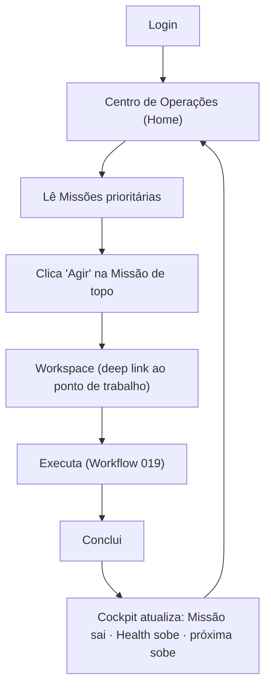
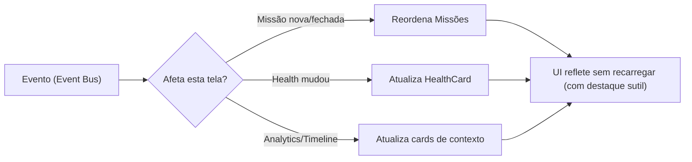

# Prototype/001 — Operation Center Blueprint

> **Product Blueprint — especificação funcional da tela.** Este documento **não é arquitetura, não é UX conceitual, não é Design System.** É a **base direta para implementação** do **Centro de Operações** (a Home da Zion), detalhada o suficiente para que **Product Designer, UX Designer, Frontend, Backend e IA** a construam **sem reinterpretar conceitos**.

> [!important] Regra de processo
> **Este documento representa a especificação funcional da tela. Nenhuma implementação deve começar antes que este Blueprint esteja validado.**

> **Base (contexto, não copiado):** [product/000 Vision](../000-product-vision.md) · [product/001 Design Principles](../001-design-principles.md) · [product/002 Information Architecture](../002-information-architecture.md) · [product/003 Navigation](../003-navigation.md) · [product/004 Operation Center](../004-operation-center.md) · arquitetura [015 Operation Center](../../architecture/015-operation-center.md) e demais (000–019).

> **Convenções deste Blueprint:** wireframes em ASCII; fluxos em Mermaid; nomes de componentes em `PascalCase`; estados em `MAIÚSCULAS`; eventos em `dot.case` (alinhados ao [Event Bus 004](../../architecture/004-event-bus.md)). Nenhuma cor/tipografia/medida em px é fixada aqui (isso é do Design System, `product/007`).

---

## 1. Objetivo

Especificar a tela do **Centro de Operações** — o **cockpit operacional** que é a Home da Zion.

| Dimensão | Definição |
|----------|-----------|
| **Propósito** | Responder continuamente **"o que preciso fazer agora?"** e conduzir o trabalho do dia. |
| **Quem utiliza** | Operador, Gestor (visão adicional), Cliente (visão reduzida). Papéis em [003 §11](../003-navigation.md). |
| **Quando utiliza** | No **início** de toda sessão (é a Home) e ao **retornar** após cada Missão/ação. |
| **O que espera encontrar** | As Missões prioritárias, a saúde da operação, a orientação da IA e as filas de trabalho — tudo acionável. |

> [!important] Não é dashboard
> A tela **conduz trabalho**, não exibe métricas para admirar. Todo elemento leva a uma ação ([001 regra de ouro](../001-design-principles.md)).

---

## 2. Objetivos do Usuário

As perguntas que **esta tela responde** (em ordem de prioridade):

1. **O que preciso fazer agora?** → Missões prioritárias.
2. **Existe algo urgente?** → Alertas críticos / Missão de topo.
3. **Minha operação está saudável?** → Health.
4. **Quem/o que precisa da minha atenção?** → Filas + Missões.
5. **A IA recomenda algo?** → Coach.
6. **O que aconteceu recentemente?** → Timeline.
7. **(Gestor) Minha equipe está equilibrada?** → Painel do Gestor.

---

## 3. Estrutura Visual

Wireframe ASCII de referência (desktop, papel **Operador**):

```
┌──────────────────────────────────────────────────────────────────────────────┐
│ TOPBAR  [Zion]   Chinelaria ▼   [ 🔎 Buscar (⌘K) ]        🔔3   🤖   AA ▼      │
├───────────┬──────────────────────────────────────────────────────────────────┤
│ SIDEBAR   │  MAIN                                                              │
│           │                                                                    │
│ 🎯 Centro │  ┌── 🎯 MISSÕES PRIORITÁRIAS ─────────────────────────────────┐   │
│    Oper.  │  │ ▸ [🔴 ALTA] Corrigir margem de 5 chinelos   ~10min  [ Agir ]│   │
│ 📦 Produ- │  │   "Abaixo do piso após custo subir no ERP." · por quê? ▾   │   │
│    tos    │  │ ▸ [🟠 MÉD ] Aprovar 42 produtos prontos      ~2min  [ Agir ]│   │
│ 📊 Analy- │  │ ▸ [🟡 BAI ] Otimizar SEO de 8 itens          ~15min [ Agir ]│   │
│    tics   │  └────────────────────────────────────────────────────────────┘   │
│ 🏢 Org.   │  ┌── ❤️ HEALTH ───────────────┐ ┌── 🤖 IA COACH ──────────────┐  │
│ ⚙️ Config │  │ Geral        77 🟡          │ │ "Hoje recomendo revisar o   │  │
│           │  │ Comercial    55 🔴  → ação  │ │  preço de 5 produtos —      │  │
│           │  │ Operação     82 🟢          │ │  ~10 min, +8 no Health."    │  │
│           │  │ (clicável por dimensão)     │ │ [ Ver Missão ]  [ Dispensar ]│ │
│           │  └────────────────────────────┘ └─────────────────────────────┘  │
│           │  ┌── 🕑 TIMELINE ─────────────┐ ┌── 📊 ANALYTICS (resumo) ─────┐ │
│           │  │ há 20min · 42 publicados   │ │ ▲ Margem +2% (30d)          │ │
│           │  │ ontem   · IA otimizou títu.│ │ ▲ Publicação -40% de tempo  │ │
│           │  │ [ ver tudo ]               │ │ [ abrir Analytics ]         │ │
│           │  └────────────────────────────┘ └─────────────────────────────┘ │
│           │  ┌── 📥 FILAS INTELIGENTES ───────────────────────────────────┐  │
│           │  │ Publicações(12) · Aprovação(42) · Custos(5) · Problemas(8) │  │
│           │  │ SEO(19) · Pendências(23)                          [lote ▸] │  │
│           │  └────────────────────────────────────────────────────────────┘  │
└───────────┴──────────────────────────────────────────────────────────────────┘
```

Regiões: **TopBar**, **Sidebar**, **Main** (Missões → Health + Coach → Timeline + Analytics → Filas). Não há rodapé funcional (evita competir com a ação); avisos legais/versão, se necessários, ficam no menu de perfil.

---

## 4. Anatomia da Tela

| Região | Objetivo | Informações exibidas | Prioridade | Ações possíveis |
|--------|----------|----------------------|:----------:|-----------------|
| **TopBar** | Contexto transversal | tenant atual, busca (⌘K), notificações, IA, perfil | Fixa | trocar cliente, buscar, abrir notificações/IA/perfil |
| **Sidebar** | Navegação entre destinos globais | Centro de Operações, Produtos, Analytics, Organização, Config | Fixa | navegar entre contextos (nunca menu por Capability) |
| **Missões Prioritárias** | Conduzir o trabalho | lista ordenada de `MissionCard` | **Máxima (acima da dobra)** | Agir, ver "por quê", expandir |
| **Health** | Medir a operação, acionável | 4 dimensões (Geral/Comercial/Operação/Equipe) | Alta | clicar dimensão → Missão/Fila |
| **IA Coach** | Orientar | recomendação do dia | Alta (ao lado, sem cobrir Missões) | Ver Missão, Dispensar, Por quê |
| **Timeline** | Contextualizar (recente) | narrativa dos últimos eventos | Média | ver tudo, clicar evento → contexto |
| **Analytics (resumo)** | Sinalizar tendência | 2–4 deltas com contexto | Média | abrir contexto Analytics |
| **Filas Inteligentes** | Trabalho em lote | contadores por fila | Média | abrir fila, ação em lote |

---

## 5. Componentes

Catálogo de componentes da tela. Cada um: **Nome · Objetivo · Conteúdo · Ações · Estados · Dependências**.

### 5.1 `MissionCard`
- **Objetivo:** apresentar uma Missão e conduzir à ação.
- **Conteúdo:** badge de prioridade (🔴/🟠/🟡), título, tempo estimado, "por quê" (expansível), ação recomendada.
- **Ações:** `Agir` (deep link ao ponto de trabalho), `ExpandirPorQue`, `(opcional) Adiar`.
- **Estados:** `DEFAULT`, `HOVER`, `EXPANDED`, `IN_PROGRESS`, `BLOCKED`, `DONE` (transiciona para saída).
- **Dependências:** Operation Center ([015](../../architecture/015-operation-center.md)); prioridade calculada por Maturity/Commercial.

### 5.2 `HealthCard`
- **Objetivo:** mostrar a saúde da operação, acionável por dimensão.
- **Conteúdo:** Health Geral + dimensões (Comercial/Operação/Equipe), cada uma com valor 0–100, cor 🟢🟡🔴, delta e microcausa.
- **Ações:** `AbrirDimensao` (→ Missão/Fila que corrige).
- **Estados:** `LOADING`, `DEFAULT`, `DIMENSION_CRITICAL` (destaque), `EMPTY` (empresa nova).
- **Dependências:** Operational Maturity ([014](../../architecture/014-operational-maturity-engine.md)) — a tela **apresenta**, não calcula.

### 5.3 `CoachCard`
- **Objetivo:** trazer a recomendação contextual da IA.
- **Conteúdo:** mensagem (linguagem clara), ganho estimado, confiança, ação.
- **Ações:** `VerMissao`, `Dispensar`, `PorQue`.
- **Estados:** `VISIBLE`, `DISMISSED`, `NONE` (sem recomendação → colapsa; não deixa buraco).
- **Dependências:** ZIOS ([017](../../architecture/017-zion-intelligence-operating-system.md)). **Nunca cobre Missões** (ver [§13](#13-regras-de-ux)).

### 5.4 `AnalyticsCard`
- **Objetivo:** sinalizar o que mudou/merece atenção (resumo, não BI).
- **Conteúdo:** 2–4 deltas com contexto (▲/▼ + causa curta).
- **Ações:** `AbrirAnalytics` (contexto completo).
- **Estados:** `LOADING`, `DEFAULT`, `ATTENTION` (anomalia em destaque), `EMPTY` (sem histórico ainda).
- **Dependências:** Operational Analytics ([018](../../architecture/018-operational-analytics.md)).

### 5.5 `TimelineCard`
- **Objetivo:** contar a narrativa recente da operação.
- **Conteúdo:** últimos N eventos em linguagem humana, com hora relativa.
- **Ações:** `VerTudo`, `AbrirEvento` (→ contexto).
- **Estados:** `LOADING`, `DEFAULT`, `EMPTY`.
- **Dependências:** Event Bus ([004](../../architecture/004-event-bus.md)) / Timeline da Operação ([002 §13](../002-information-architecture.md)).

### 5.6 `QueueCard` (item de fila)
- **Objetivo:** resumir uma fila e permitir lote.
- **Conteúdo:** nome, contador, prioridade agregada, tempo estimado.
- **Ações:** `AbrirFila`, `AcaoEmLote` (respeitando travas de qualidade / A10).
- **Estados:** `DEFAULT`, `EMPTY` (fila zerada → recolhe), `URGENT` (destaque).
- **Dependências:** Operation Center ([015](../../architecture/015-operation-center.md)) / Workflow Engine ([019](../../architecture/019-workflow-engine.md)).

### 5.7 `TeamCard` (Painel do Gestor)
- **Objetivo:** dar ao gestor a leitura de carga/equilíbrio (não vigilância).
- **Conteúdo:** membros, carga, capacidade livre, tempo médio, Health da Equipe, qualidade, uso de IA.
- **Ações:** `Redistribuir`, `Aliviar`, `AbrirMembro`.
- **Estados:** `DEFAULT`, `OVERLOAD_ALERT`, `EMPTY`.
- **Dependências:** Operation Center ([015](../../architecture/015-operation-center.md)); visível **só** para papel Gestor/Admin.

### 5.8 Componentes de suporte
`TopBar`, `Sidebar`, `TenantSwitcher`, `CommandPalette` ([003 §7](../003-navigation.md)), `NotificationTray`, `PriorityBadge`, `HealthMeter`, `EmptyState`, `LoadingSkeleton`, `OriginBadge` (origem do dado), `PrecisionBadge` (alta/média/baixa).

---

## 6. Fluxos

### 6.1 Fluxo principal (Missão → ação → retorno)



### 6.2 Fluxo de atualização em tempo real



---

## 7. Estados da Tela

Wireframes por estado (o **mapa não muda**; muda a **ênfase** — [003 §14](../003-navigation.md)).

**Primeiro acesso / Empresa nova**
```
┌── MAIN ───────────────────────────────────────────────┐
│ 🤖 "Bem-vindo! Vamos ativar sua operação."            │
│ ┌ PRÓXIMO PASSO ─────────────────────────────────────┐ │
│ │ 1) Conectar seu ERP        [ Conectar ]            │ │
│ │ 2) Importar seu catálogo   [ Importar ]           │ │
│ └────────────────────────────────────────────────────┘ │
│ Health: — (ainda medindo)   Analytics: — (sem histórico)│
└───────────────────────────────────────────────────────┘
```

**Empresa saudável**
```
🎯 Missões: crescimento/otimização no topo (tom calmo)
❤️ Health: majoritariamente 🟢   🤖 Coach: oportunidades
```

**Empresa crítica**
```
┌── 🔴 ATENÇÃO ──────────────────────────────────────────┐
│ Missão crítica no topo: "12 produtos em prejuízo"     │
│ Health Comercial 41 🔴 (destaque)   Filas: Problemas(8)│
│ (o restante recolhe; só o urgente ganha peso)         │
└───────────────────────────────────────────────────────┘
```

**Sem Missões (vazio calmo)**
```
┌── MAIN ───────────────────────────────────────────────┐
│           ✅ Operação em dia                          │
│   "Nenhuma Missão pendente. Bom trabalho!"            │
│   🤖 Coach: "Quer aproveitar para otimizar SEO?"      │
└───────────────────────────────────────────────────────┘
```

**Operação intensa**
```
🎯 Missões: muitas → mostra top 3 + "ver todas (18)"
📥 Filas com contadores altos; ação em lote em evidência
(Princípio de Atenção: nunca >1 prioridade máxima, ≤3 alertas)
```

---

## 8. Interações

| Interação | Comportamento esperado |
|-----------|------------------------|
| **Clique em `Agir`** | Deep link ao Workspace no ponto exato ([003 §9](../003-navigation.md)); estado da Missão → `IN_PROGRESS`. |
| **Clique em dimensão de Health** | Abre a Missão/Fila que corrige aquela dimensão. |
| **Hover em `MissionCard`** | Revela ações secundárias (adiar, por quê); sem ruído visual excessivo. |
| **Expandir "por quê"** | Mostra justificativa + origem/precisão; não navega. |
| **Scroll** | Missões acima da dobra sempre; demais cards abaixo (revelação progressiva). |
| **Loading** | `LoadingSkeleton` por card (nunca tela branca); cada card carrega independente. |
| **Atualização em tempo real** | Cards refletem eventos sem recarregar; mudança sinalizada com destaque sutil (nunca "pula" sob o cursor). |
| **Feedback** | Toda ação gera resposta imediata (confirmação/progresso); automações aparecem ([001 §9](../001-design-principles.md)). |
| **Command Palette (⌘K)** | Abre busca universal de qualquer lugar. |
| **Dispensar Coach** | `CoachCard` → `DISMISSED`; não reaparece na sessão para a mesma recomendação. |

---

## 9. Coach IA

| Aspecto | Definição |
|---------|-----------|
| **Posição** | Ao lado do Health (coluna direita superior); **nunca sobre** as Missões. |
| **Mensagens** | 1 recomendação principal por vez, com ganho estimado e confiança. |
| **Tom** | Didático, calmo, direto ([001 §Linguagem](../001-design-principles.md)); linguagem de negócio para Cliente. |
| **Ações** | `Ver Missão`, `Dispensar`, `Por quê`. |
| **Exemplos** | "Recomendo aprovar 42 produtos prontos (~2 min)." · "Risco: 8 anúncios com erro de tamanho." · "Você economizará ~2h." |
| **Quando aparece** | Quando há uma recomendação relevante ao contexto atual. |
| **Quando desaparece** | Ao ser dispensada, ou quando não há recomendação (`NONE` → colapsa, sem deixar buraco). |
| **Quando permanece** | Enquanto a recomendação seguir válida e não dispensada; **reforça** a Missão urgente, nunca compete. |

---

## 10. Painel do Gestor

Segunda visão da tela, disponível ao papel **Gestor/Admin** (toggle "Minha visão / Equipe").

```
┌── PAINEL DO GESTOR · Chinelaria (hoje) ───────────────────────────┐
│ EQUIPE            CARGA                 CAPACIDADE                 │
│ 4 online·1 aus.   Ana ▓▓▓▓░  Bruno ▓▓▓▓▓▓ 🔴   3 livres          │
├───────────────────────────────────────────────────────────────────┤
│ Missões atrasadas: 2   Tempo médio: 11min   IA utilizada: 68%     │
│ Produtividade: saudável   Qualidade: 96%   Health Equipe: 82 🟢   │
│ → Bruno sobrecarregado                             [ Aliviar ]     │
└───────────────────────────────────────────────────────────────────┘
```

| Indicador | Uso (gestão, não vigilância) |
|-----------|------------------------------|
| Equipe / Carga / Capacidade | equilibrar distribuição. |
| Missões atrasadas / Tempo médio | achar gargalos de **processo**. |
| Produtividade / Qualidade / Health Equipe | apoiar e desenvolver. |
| IA utilizada | medir adoção da inteligência. |

> [!important] Gestão, nunca vigilância
> O painel mede a **operação** para equilibrá-la e desenvolver pessoas. "Sobrecarregado" = *aliviar*, não *cobrar*. **Nunca** é ferramenta de monitoramento individual ([004 §Painel do Gestor](../004-operation-center.md)).

---

## 11. Mobile

Adaptação para telas pequenas (a tela é a **camada de Operação no bolso** — [003 §13](../003-navigation.md)):

| Elemento | Comportamento mobile |
|----------|----------------------|
| **Permanece** | Missões prioritárias (foco total), busca (⌘K → ícone), Coach (colapsável), notificações. |
| **Muda** | Sidebar → menu inferior/hambúrguer com poucos destinos; cards empilham em coluna única; ações principais viram botões grandes (toque). |
| **Desaparece / recolhe** | Painel do Gestor completo (vira resumo + "ver no desktop"); Analytics vira 1–2 deltas; Timeline colapsada. |

Ordem mobile: **Missões → Coach → Health → Filas → (resumo) Analytics/Timeline.** Prioriza **Missões, ação rápida e busca**.

---

## 12. Jornada Completa

| Passo | Tela | Estado |
|:----:|------|--------|
| 1 | Alex faz **login** | cai no Centro de Operações |
| 2 | Vê **3 Missões**; topo: "corrigir margem de 5 chinelos" | `MissionCard DEFAULT` |
| 3 | Clica **Agir** → abre o **Produto** (Workspace) no ponto certo | Missão `IN_PROGRESS` |
| 4 | **Executa** (ajusta preço, publica) | Workflow roda |
| 5 | O **Coach explica**: "margem volta ao piso; +8 no Health" | `CoachCard VISIBLE` |
| 6 | O **Health melhora** (Comercial 55→63) | `HealthCard` atualiza |
| 7 | **Analytics registra** / Timeline narra | cards de contexto atualizam |
| 8 | **Retorna** ao cockpit; Missão sai; próxima sobe | tela reordena em tempo real |

---

## 13. Regras de UX (obrigatórias)

1. **Nunca mais de uma prioridade máxima** por vez.
2. **Missões acima da dobra** — sempre a primeira coisa vista.
3. **Coach nunca cobre Missões** — vive ao lado, colapsa quando `NONE`.
4. **Health sempre clicável** — dimensão fraca leva à ação.
5. **Timeline sempre contextual** (narrativa), nunca log cru.
6. **Analytics sempre resumido** — BI completo fica no contexto Analytics.
7. **≤3 alertas críticos simultâneos** — acima disso, agrupar.
8. **Nenhum card sem ação** — regra de ouro ([001](../001-design-principles.md)).
9. **Vazio comunica calma** ("operação em dia"), nunca tela morta.
10. **Atualização em tempo real não desloca o que o usuário está prestes a clicar.**

---

## 14. Checklist para Desenvolvimento

```
□ Missões renderizam ordenadas por prioridade (impacto×urgência×esforço×deps)?
□ Cada MissionCard tem: prioridade, título, tempo, "por quê", ação?
□ "Agir" leva por deep link ao ponto exato do Workspace?
□ HealthCard: 4 dimensões, cada uma clicável → Missão/Fila?
□ CoachCard: 1 recomendação, ganho+confiança, ações; colapsa em NONE; nunca cobre Missões?
□ AnalyticsCard: 2–4 deltas com contexto; abre Analytics completo?
□ TimelineCard: narrativa recente, "ver tudo", evento → contexto?
□ QueueCard: contador, prioridade, ação em lote (respeita A10)?
□ TeamCard: só para Gestor/Admin; enquadramento de equilíbrio?
□ Estados cobertos: FIRST_ACCESS, NEW, HEALTHY, CRITICAL, NO_MISSIONS, INTENSE?
□ Loading por card (skeleton), nunca tela branca?
□ Tempo real: atualiza sem recarregar, sem deslocar o alvo do clique?
□ Command Palette (⌘K) disponível de qualquer lugar?
□ Mobile: Missões/ação/busca priorizadas; painel gestor vira resumo?
□ Isolamento por tenant (RLS) em todos os dados?
□ Origem e precisão visíveis onde há número derivado?
□ Nenhum card sem ação; nenhuma métrica sem contexto?
□ Princípios de Atenção: ≤1 prioridade máxima, ≤3 alertas críticos?
```

---

## 15. Critérios de Aceite

- [ ] **Home oficial:** login leva ao Centro de Operações; retorno pós-ação volta aqui.
- [ ] **Missões acima da dobra**, ordenadas, com prioridade explicável.
- [ ] **`Agir` = deep link** ao ponto de trabalho; Missão vira `IN_PROGRESS`.
- [ ] **Health com 4 dimensões acionáveis**; nenhuma exibida como número solto.
- [ ] **Coach ao lado, colapsável, nunca sobre Missões**; ações Ver/Dispensar/Por quê.
- [ ] **Analytics resumido** e **Timeline narrativa**, ambos clicáveis para contexto.
- [ ] **Filas com contador + ação em lote** respeitando travas (A10).
- [ ] **Painel do Gestor** só para Gestor/Admin, com enquadramento de equilíbrio.
- [ ] **Seis estados** implementados com a ênfase correta (mapa constante).
- [ ] **Tempo real** sem recarregar e sem deslocar o alvo do clique.
- [ ] **Mobile** prioriza Missões/ação/busca; painel gestor resumido.
- [ ] **Multiempresa isolado** ([RLS](../../architecture/010-database-compliance.md)); cliente nunca vê outro cliente.
- [ ] **Regras de UX e Princípios de Atenção** todos satisfeitos.
- [ ] **Checklist de Desenvolvimento** 100% marcado.

---

## Seção especial — Mapa de Componentes

Tabela de referência: **Componente · Responsabilidade · Origem dos Dados · Ações · Estados · Eventos**.

| Componente | Responsabilidade | Origem dos Dados | Ações | Estados | Eventos (consome/emite) |
|-----------|------------------|------------------|-------|---------|--------------------------|
| `MissionCard` | Conduzir uma Missão | Operation Center ([015](../../architecture/015-operation-center.md)) | Agir, PorQue, Adiar | DEFAULT·HOVER·EXPANDED·IN_PROGRESS·BLOCKED·DONE | consome `maturity.mission_created`, `*.recommendation_created`; emite `ui.mission.opened` |
| `HealthCard` | Saúde acionável | Maturity ([014](../../architecture/014-operational-maturity-engine.md)) | AbrirDimensao | LOADING·DEFAULT·DIMENSION_CRITICAL·EMPTY | consome `maturity.health_changed`, `maturity.score_changed` |
| `CoachCard` | Recomendação IA | ZIOS ([017](../../architecture/017-zion-intelligence-operating-system.md)) | VerMissao, Dispensar, PorQue | VISIBLE·DISMISSED·NONE | consome `ai.recommendation.created` |
| `AnalyticsCard` | Sinalizar tendência | Analytics ([018](../../architecture/018-operational-analytics.md)) | AbrirAnalytics | LOADING·DEFAULT·ATTENTION·EMPTY | consome `analytics.trend_detected`, `analytics.anomaly_detected` |
| `TimelineCard` | Narrativa recente | Event Bus ([004](../../architecture/004-event-bus.md)) | VerTudo, AbrirEvento | LOADING·DEFAULT·EMPTY | consome eventos de domínio (`produto.*`, `marketplace.*`…) |
| `QueueCard` | Trabalho em lote | Operation Center / Workflow ([019](../../architecture/019-workflow-engine.md)) | AbrirFila, AcaoEmLote | DEFAULT·EMPTY·URGENT | emite `ui.queue.batch_requested` → `workflow.*` |
| `TeamCard` | Equilíbrio da equipe | Operation Center ([015](../../architecture/015-operation-center.md)) | Redistribuir, Aliviar, AbrirMembro | DEFAULT·OVERLOAD_ALERT·EMPTY | consome métricas de equipe/execução |
| `TenantSwitcher` | Trocar cliente (Equipe) | Organização ([000](../../architecture/000-business-domain.md)) | TrocarTenant | DEFAULT·SWITCHING | emite `ui.tenant.changed` |
| `CommandPalette` | Busca universal | índice por tenant | Buscar, Executar, Navegar | CLOSED·OPEN·RESULTS·EMPTY | emite `ui.navigate`, `ui.action` |

> Nota: eventos `ui.*` são internos de interface (não são do Event Bus de domínio); os `*.` de domínio vêm da arquitetura (000–019). A UI **consome** eventos de domínio (tempo real) e **solicita** ações que os Capabilities executam.

---

## Seção especial — Cenários

Cenários completos por situação e papel.

**Empresa nova (Operador):** cai em onboarding — "conectar ERP / importar catálogo"; Health/Analytics vazios; Coach guia (Zion Coach, [016](../../architecture/016-implantation-journey.md)). Objetivo: primeiro Quick Win.

**Empresa saudável (Operador):** Missões de crescimento no topo; Health majoritariamente 🟢; Coach sugere oportunidades; tom calmo.

**Empresa em crise (Operador):** Missão crítica única no topo ("12 produtos em prejuízo"); Health Comercial 🔴 em destaque; fila Problemas em evidência; demais cards recolhem; ≤3 alertas.

**Empresa sem Missões (Operador):** vazio calmo — "Operação em dia ✅"; Coach oferece otimização opcional; nada de tela morta.

**Gestor:** alterna para o Painel do Gestor; vê carga/capacidade/qualidade/uso de IA; foco em equilibrar e desenvolver; nunca vigiar.

**Operador:** visão padrão descrita no [§3](#3-estrutura-visual); foco absoluto em "o que fazer agora".

**Cliente:** **não usa esta tela** — usa o [Portal do Cliente (product/006)](../006-client-portal.md), com escopo reduzido (Health, Missões que o afetam, Resultados, Analytics). Aqui registrado para evitar que se implemente a versão de cliente sobre este Blueprint.

---

## Seção especial — Preparação para React

Sem escrever código — apenas o **inventário para implementação** (o *como* é do Design System `product/007` e da engenharia).

**Componentes que deverão existir:**
`OperationCenterPage` (container) · `TopBar` · `Sidebar` · `TenantSwitcher` · `CommandPalette` · `NotificationTray` · `MissionList` + `MissionCard` · `HealthCard` + `HealthMeter` · `CoachCard` · `AnalyticsCard` · `TimelineCard` · `QueueList` + `QueueCard` · `TeamPanel` + `TeamCard` · `EmptyState` · `LoadingSkeleton` · `PriorityBadge` · `OriginBadge` · `PrecisionBadge`.

**Estados (por área, conceituais — não implementação):**
- Página: `role` (operador/gestor/admin/cliente-n/a), `tenant`, `viewMode` (minha-visão/equipe), `connectionStatus` (tempo real).
- `MissionCard`: `priority`, `status`, `estimatedTime`, `reasonExpanded`.
- `HealthCard`: `dimensions[]` (value, trend, cause), `criticalDimension?`.
- `CoachCard`: `recommendation?`, `visibility` (VISIBLE/DISMISSED/NONE), `confidence`.
- `AnalyticsCard`: `deltas[]`, `attention?`.
- Genéricos: `LOADING`, `EMPTY`, `ERROR`.

**Propriedades (inputs conceituais que cada componente recebe):**
- `MissionCard`: `{ id, priority, title, reason, estimatedTime, action }`.
- `HealthCard`: `{ overall, dimensions:[{key,value,trend,cause,ctaTarget}] }`.
- `CoachCard`: `{ message, expectedGain, confidence, actions:[...] }`.
- `AnalyticsCard`: `{ deltas:[{label,direction,value,context,target}] }`.
- `QueueCard`: `{ key, label, count, priority, estimatedTime, batchable }`.
- `TeamCard`: `{ members:[...], capacity, avgTime, aiUsage, quality, teamHealth }`.

**Eventos (que a UI escuta ou dispara):**
- **Escuta (tempo real, domínio):** `maturity.*`, `commercial.*`, `cost.*`, `analytics.*`, `workflow.*`, `ai.recommendation.created`, `produto.*`, `marketplace.*`.
- **Dispara (intenção de UI):** `ui.mission.opened`, `ui.queue.batch_requested`, `ui.tenant.changed`, `ui.navigate`, `ui.action`, `ui.coach.dismissed`.

**Dependências (de onde vêm os dados):**
- Missões/Filas → Operation Center ([015](../../architecture/015-operation-center.md)) · Health/Precisão → Maturity ([014](../../architecture/014-operational-maturity-engine.md)) · Coach → ZIOS ([017](../../architecture/017-zion-intelligence-operating-system.md)) · Analytics/Timeline → Analytics ([018](../../architecture/018-operational-analytics.md))/Event Bus ([004](../../architecture/004-event-bus.md)) · Execução em lote → Workflow ([019](../../architecture/019-workflow-engine.md)) · Tenant/papéis → Organização ([000](../../architecture/000-business-domain.md)) + [RLS 010](../../architecture/010-database-compliance.md).

> [!note] Fronteira
> Este inventário **identifica**; ele **não** define props em TypeScript, hooks, estado global, nem estilos. Isso é decisão de engenharia + Design System — deliberadamente fora deste Blueprint.

---

> **Registro oficial:** **Este documento representa a especificação funcional da tela do Centro de Operações. Nenhuma implementação deve começar antes que este Blueprint esteja validado.**

> **Status:** `product/blueprints/001` — Operation Center Blueprint **v1.0**. Base direta para implementação da Home. **Próximo documento sugerido:** `product/blueprints/002-product-workspace-blueprint.md` (o Blueprint do Workspace do Produto Mestre — mesma profundidade: wireframe ASCII detalhado das seções (Header/Identidade/Conteúdo/Comercial/ERP/Marketplaces/Timeline/Coach), catálogo de componentes com estados/eventos, estados do produto (novo/incompleto/saudável/publicado/crítico), fluxos de edição/publicação, o Mapa de Componentes e a Preparação para React — o par de implementação desta Home, já que a maioria das Missões abre um Workspace).
