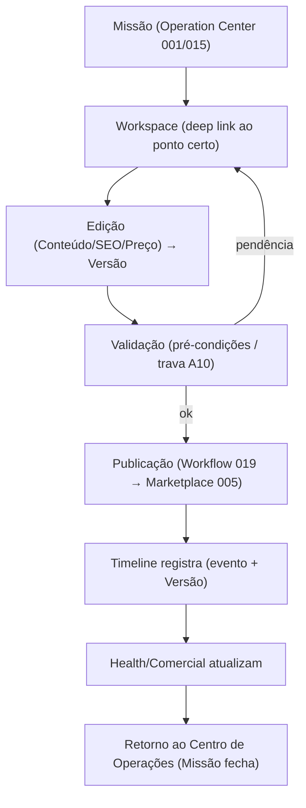
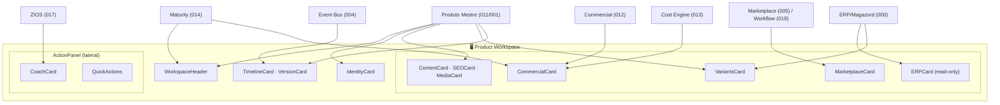

# Blueprints/002 — Product Workspace Blueprint

```
─────────────────────────────────────────────
Status:                  Draft
Owner:                   Product / UX
Documento relacionado:   architecture/011-product-master-workspace.md
Capability:              Product Master Workspace (011)
Experiência relacionada: product/005-product-workspace.md
Prioridade:              Alta
Complexidade:            Alta
Última revisão:          2026-07-14
Versão:                  v1.0
─────────────────────────────────────────────
```

> **Product Blueprint — especificação funcional da tela.** Segue integralmente a [Constituição dos Blueprints (000)](./000-blueprint-guide.md). Materializa a experiência de [Product Workspace (product/005)](../005-product-workspace.md) e a capability [011](../../architecture/011-product-master-workspace.md) em uma tela **implementável sem reinterpretar** documentos de arquitetura ou produto.

> [!important] Registro oficial
> **O Workspace é o principal ambiente de trabalho da Zion. Toda operação relacionada a um Produto Mestre acontece aqui. Nenhum desenvolvedor deve implementar esta tela antes da aprovação deste Blueprint.**

> **Base (contexto, não copiado):** [product/005 Workspace](../005-product-workspace.md) · [blueprints/000 Guide](./000-blueprint-guide.md) · [blueprints/001 Operation Center](./001-operation-center-blueprint.md) · arquitetura [011](../../architecture/011-product-master-workspace.md) · [012](../../architecture/012-commercial-intelligence-engine.md) · [013](../../architecture/013-cost-engine.md) · [014](../../architecture/014-operational-maturity-engine.md) · [015](../../architecture/015-operation-center.md).

> **Convenções:** wireframes ASCII; fluxos Mermaid; componentes `PascalCase`; estados `MAIÚSCULAS`; eventos de domínio `dot.case` ([Event Bus 004](../../architecture/004-event-bus.md)); eventos de interface `ui.*`. Nenhuma cor/tipografia/medida em px (isso é do Design System, `product/007`).

---

## 1. Objetivo

Especificar a tela do **Workspace do Produto Mestre** — o **ambiente onde um produto vive** e é operado do início ao fim do ciclo de vida.

| Dimensão | Definição |
|----------|-----------|
| **Propósito** | Dar ao operador **todo o contexto e todas as ações** de um produto numa única tela; responder "o que fazer agora **neste produto**?". |
| **Quem utiliza** | Operador (principal), Gestor, Agente IA (enriquecimento). O Cliente usa a visão do [Portal (006)](../006-client-portal.md), não esta tela. |
| **Quando utiliza** | Ao abrir um produto — tipicamente por uma **Missão** do [Centro de Operações (001)](./001-operation-center-blueprint.md) (deep link), por busca (⌘K) ou pela lista de Produtos. |
| **O que espera encontrar** | Identidade, situação (Health), conteúdo, comercial, ERP, marketplaces, IA, variantes, versões e timeline — tudo numa tela, tudo acionável. |

> [!important] Não é CRUD
> Abrir um produto abre um **ambiente operacional**, não um formulário. "Editar" é **uma** das ações, nunca a moldura ([005](../005-product-workspace.md)).

---

## 2. Objetivos do Usuário

As perguntas que **esta tela responde** (prioridade decrescente):

1. **Onde estou?** → Header + breadcrumb (qual produto, qual cliente).
2. **Qual é a situação deste produto?** → Health + Status + Resumo.
3. **O que precisa ser feito?** → Coach + pendências + Missão de origem.
4. **Qual o impacto das minhas decisões?** → feedback pós-ação (Health/Comercial atualizam).
5. **O ERP está sincronizado?** → ERPCard (última sincronização).
6. **Existe algum problema comercial?** → CommercialCard (margem/piso).
7. **Existe pendência de Marketplace?** → MarketplaceCard (erros por canal).
8. **O que a IA recomenda?** → CoachCard.
9. **Qual a próxima ação?** → QuickActions / ação recomendada.

---

## 3. Wireframe ASCII

Layout de referência (desktop, papel **Operador**). Hierarquia: identidade/situação no topo → contexto no corpo → histórico ao fim; **painel lateral** persistente para Coach/ações.

```
┌──────────────────────────────────────────────────────────────────────────────────────┐
│ TOPBAR  [Zion]  Chinelaria ▼   Produtos › Chinelo Slim        🔎(⌘K)  🔔  🤖  AA ▼     │
├──────────────────────────────────────────────────────────────────────┬───────────────┤
│ WORKSPACE HEADER                                                      │  PAINEL       │
│ Chinelo Slim Feminino     SKU CHNL-SLIM-001   Calçados›Chinelos       │  LATERAL      │
│ [🟡 Health 72]  [Status: Publicado]   Modo: User Products             │               │
│ [ Publicar ] [ Executar IA ] [ Comparar Versões ] [ ⋯ ]              │ ┌─ 🤖 COACH ─┐ │
├──────────────────────────────────────────────────────────────────────┤ │ "Título    │ │
│ IDENTIDADE   Marca: Grendene · Origem: Fabricante · Catálogo #A-12    │ │ fraco p/   │ │
│ EAN 7890...  ERP SKU MGZ-5567   Relacionados: [Slim Masc] [Kit Verão] │ │ busca."    │ │
├───────────────────────────────────┬──────────────────────────────────┤ │ +ranking   │ │
│ 📝 CONTEÚDO                        │ 💰 COMERCIAL                     │ │ conf: alta │ │
│ Título ▸ "Chinelo Slim..." [IA▾]  │ Preço R$ 39,90                   │ │[ Aplicar ] │ │
│ Descrição ▸ ...        [editar]    │ Margem 12% 🔴 ↓-6% (custo↑ ERP)  │ │[ Por quê ] │ │
│ Atributos ▸ 8/10  ⚠️ 2 faltando   │ "Abaixo do piso de 18%."         │ ├────────────┤ │
│ SEO ▸ kw:"chinelo slim" [otimizar]│ Competitividade: +8% vs mediana  │ │ ⚡ AÇÕES   │ │
│ 🖼️ MÍDIAS ▸ capa+4  [gerar IA]     │ [ Revisar preço ] [ Por quê? ]   │ │ RÁPIDAS    │ │
├───────────────────────────────────┼──────────────────────────────────┤ │ Publicar   │ │
│ 🏭 ERP (somente leitura)          │ 🛒 MARKETPLACES                  │ │ Sincr. ERP │ │
│ Estoque 142 · Custo R$ 31,20      │ ML     🟢 Ativo   MLB123         │ │ Abrir Miss.│ │
│ Fiscal NCM 6402 · sync há 6min    │ Shopee 🔴 Erro (tamanho) [corr.] │ │ Duplicar   │ │
│ [origem: ERP]  [ Sincronizar ]    │ TikTok ⚪ Não publicado [public.] │ │ Arquivar   │ │
├───────────────────────────────────┴──────────────────────────────────┤ └────────────┘ │
│ 🎚️ VARIANTES  38 · 39 · 40 · 41 (4)   [comparar] ⚠️ tamanhos a normalizar             │
├───────────────────────────────────────────────────────────────────────────────────────┤
│ 🕑 TIMELINE   hoje 14:20 preço ajustado (V8) · ontem IA otimizou título · 3d publicado │
└───────────────────────────────────────────────────────────────────────────────────────┘
```

Sem footer funcional (não competir com a ação); avisos legais/versão-do-app ficam no menu de perfil. O **VersionCard** e o **ApprovalCard** aparecem contextualmente (comparar versões / produto aguardando aprovação).

---

## 4. Anatomia

| Região | Objetivo | Informações | Prioridade | Ações |
|--------|----------|-------------|:---------:|-------|
| **TopBar** | contexto transversal + localização (breadcrumb) | tenant, caminho, busca, IA, perfil | Fixa | buscar, trocar tenant, perfil |
| **WorkspaceHeader** | identidade + situação + ações principais | nome, SKU, categoria, status, Health, modo de operação | **Máxima** | Publicar, Executar IA, Comparar Versões, ⋯ |
| **IdentityCard** | procedência e chaves | marca, origem, catálogo, EAN, ERP SKU, relacionados | Alta | abrir relacionado, ver origem |
| **ContentCard** | o que o comprador vê | título, descrição, atributos, SEO, mídias | Alta | editar, aplicar sugestão IA |
| **CommercialCard** | situação de lucro (apresentação) | preço, margem, rentabilidade, competitividade | Alta | Revisar preço, Por quê |
| **ERPCard** | dados do ERP (read-only) | estoque, custo, fiscal, fornecedor, sync | Média | Sincronizar ERP |
| **MarketplaceCard** | situação por canal | estado, publicação, erros, performance | Alta | Publicar, Corrigir |
| **VariantsCard** | derivações vendáveis | grade, estoque/preço, diferenças | Média | comparar, ação em lote |
| **TimelineCard** | a vida do produto | eventos narrados, versões | Baixa | ver tudo, abrir evento |
| **Painel lateral** | IA + ações rápidas, persistente | Coach + QuickActions | Alta (ao lado, sem cobrir conteúdo) | ações do Coach e rápidas |

---

## 5. Catálogo de Componentes

Cada componente no padrão oficial de **8 atributos** ([000 §7](./000-blueprint-guide.md)).

### 5.1 `WorkspaceHeader`
- **Objetivo:** identidade + situação + ações principais, sempre visível.
- **Responsabilidade:** apresentar nome/SKU/categoria/status/Health/modo; expor ações principais. Não edita conteúdo diretamente.
- **Origem dos dados:** Produto Mestre ([011](../../architecture/011-product-master-workspace.md)); Health de Maturity ([014](../../architecture/014-operational-maturity-engine.md)).
- **Estados:** `LOADING`, `DEFAULT`, `CRITICAL` (Health 🔴 / prejuízo), `BLOCKED`, `ARCHIVED`.
- **Eventos:** consome `produto_mestre.atualizado`, `maturity.health_changed`; emite `ui.workspace.action` (publicar/ia/comparar).
- **Ações:** Publicar, Executar IA, Comparar Versões, ⋯ (Duplicar/Arquivar).
- **Dependências:** `StatusChip`, `HealthCard` (resumo), `QuickActions`.

### 5.2 `IdentityCard`
- **Objetivo:** procedência e chaves de conciliação.
- **Responsabilidade:** exibir marca/origem/catálogo/EAN/ERP SKU/relacionados; nunca "inventar" procedência.
- **Origem dos dados:** Produto Mestre + Origem do Produto ([000](../../architecture/000-business-domain.md)).
- **Estados:** `LOADING`, `DEFAULT`, `EMPTY` (chaves faltando → destaque), `PERMISSION_DENIED`.
- **Eventos:** consome `produto_mestre.atualizado`; emite `ui.navigate` (abrir relacionado).
- **Ações:** abrir produto relacionado, ver origem.
- **Dependências:** `OriginBadge`.

### 5.3 `HealthCard`
- **Objetivo:** saúde do **produto**, por dimensão, acionável.
- **Responsabilidade:** apresentar dimensões (Identidade, Conteúdo, SEO, Comercial, Marketplaces, ERP, IA, Publicação); **não calcula**.
- **Origem dos dados:** Operational Maturity ([014](../../architecture/014-operational-maturity-engine.md)).
- **Estados:** `LOADING`, `DEFAULT`, `DIMENSION_CRITICAL`, `EMPTY` (produto novo).
- **Eventos:** consome `maturity.health_changed`, `maturity.score_changed`.
- **Ações:** `AbrirDimensao` (→ seção/ação que corrige).
- **Dependências:** `PrecisionBadge` (onde o número depende de precisão).

### 5.4 `CoachCard`
- **Objetivo:** recomendação da IA **especialista do produto**.
- **Responsabilidade:** sugerir/explicar/corrigir/apontar oportunidade; nunca chatbot; nunca cobre o conteúdo.
- **Origem dos dados:** ZIOS ([017](../../architecture/017-zion-intelligence-operating-system.md)).
- **Estados:** `VISIBLE`, `DISMISSED`, `NONE` (colapsa), `APPLYING`.
- **Eventos:** consome `ai.recommendation.created`; emite `ui.coach.apply`, `ui.coach.dismissed`.
- **Ações:** Aplicar, Por quê, Dispensar.
- **Dependências:** `PrecisionBadge` (confiança), painel lateral.

### 5.5 `CommercialCard`
- **Objetivo:** situação de lucro, com contexto.
- **Responsabilidade:** **apresentar** preço/margem/rentabilidade/competitividade; **nunca recalcula** (é de [012](../../architecture/012-commercial-intelligence-engine.md)/[013](../../architecture/013-cost-engine.md)).
- **Origem dos dados:** Commercial Intelligence ([012](../../architecture/012-commercial-intelligence-engine.md)); custo/precisão de Cost Engine ([013](../../architecture/013-cost-engine.md)).
- **Estados:** `LOADING`, `HEALTHY`, `CRITICAL` (abaixo do piso/prejuízo), `PARTIAL` (precisão baixa), `EMPTY` (sem custo).
- **Eventos:** consome `commercial.margin_changed`, `cost.updated`, `cost.precision_changed`.
- **Ações:** Revisar preço (→ edição/Missão), Por quê.
- **Dependências:** `PrecisionBadge` (obrigatório), `OriginBadge`.

### 5.6 `ERPCard`
- **Objetivo:** dados do ERP, **somente leitura**.
- **Responsabilidade:** exibir estoque/custo/fiscal/fornecedor/sync; deixar **explícito** que é read-only e que o ERP é dono.
- **Origem dos dados:** ERP/Magazord ([000](../../architecture/000-business-domain.md)) via espelho.
- **Estados:** `LOADING`, `SYNCED`, `STALE` (sync antigo), `DIVERGENT` (divergência ERP↔Zion), `ERROR`.
- **Eventos:** consome `erp.estoque.mudou`, `erp.custo.mudou`; emite `ui.erp.sync_requested`.
- **Ações:** Sincronizar ERP (solicita atualização do espelho; **não escreve no ERP**).
- **Dependências:** `OriginBadge` (obrigatório: "ERP").

### 5.7 `MarketplaceCard`
- **Objetivo:** situação do produto por canal, sem sair da tela.
- **Responsabilidade:** exibir estado/publicação/erros/performance por canal; oferecer correção no lugar.
- **Origem dos dados:** Marketplace ([005](../../architecture/005-marketplace-engine.md))/Operation Center ([015](../../architecture/015-operation-center.md)).
- **Estados:** `LOADING`, `ACTIVE`, `ERROR` (por canal), `NOT_PUBLISHED`, `PUBLISHING`, `PAUSED`.
- **Eventos:** consome `marketplace.listing.estado`, `venda.recebida`; emite `ui.marketplace.publish`, `ui.marketplace.fix`.
- **Ações:** Publicar, Corrigir e republicar (→ Workflow [019](../../architecture/019-workflow-engine.md)).
- **Dependências:** `StatusChip` por canal.

### 5.8 `ContentCard`
- **Objetivo:** o conteúdo do produto em blocos (não formulário gigante).
- **Responsabilidade:** título/descrição/bullets/características; destacar campos obrigatórios faltando.
- **Origem dos dados:** Produto Mestre ([011](../../architecture/011-product-master-workspace.md)).
- **Estados:** `LOADING`, `DEFAULT`, `INCOMPLETE` (⚠️ pendências), `EDITING`, `SAVED` (gera Versão), `PERMISSION_DENIED`.
- **Eventos:** emite `ui.content.edit`, `ui.content.applyAI`; consome `produto_mestre.atualizado`.
- **Ações:** editar bloco, aplicar sugestão da IA.
- **Dependências:** `SEOCard`, `MediaCard`, revelação progressiva.

### 5.9 `MediaCard`
- **Objetivo:** ativos visuais (capa/secundárias/detalhe/medidas/humanizada).
- **Responsabilidade:** exibir e gerenciar mídias; origem (origem/IA/upload) visível.
- **Origem dos dados:** Produto Mestre (imagens).
- **Estados:** `LOADING`, `DEFAULT`, `EMPTY` (sem capa → destaque), `UPLOADING`, `GENERATING` (IA).
- **Eventos:** emite `ui.media.upload`, `ui.media.generateAI`.
- **Ações:** subir imagem, gerar/melhorar por IA, reordenar.
- **Dependências:** `OriginBadge`.

### 5.10 `SEOCard`
- **Objetivo:** inteligência de busca do anúncio.
- **Responsabilidade:** keyword principal/secundárias/título otimizado/termos a evitar.
- **Origem dos dados:** Produto Mestre (SEO, agentes A2/A3).
- **Estados:** `LOADING`, `DEFAULT`, `WEAK` (sem keyword → sugere), `EDITING`.
- **Eventos:** emite `ui.seo.optimize` (→ IA).
- **Ações:** otimizar (IA), editar.
- **Dependências:** `CoachCard` (sugestão).

### 5.11 `VariantsCard`
- **Objetivo:** navegar/comparar variantes; ver estoque e preço.
- **Responsabilidade:** grade de variantes; destacar diferenças e pendências (ex.: tamanho não normalizado).
- **Origem dos dados:** Produto Mestre (variantes) + ERP (espelho estoque/custo).
- **Estados:** `LOADING`, `DEFAULT`, `COMPARE`, `DIRTY_SIZES` (⚠️ normalizar), `EMPTY`.
- **Eventos:** emite `ui.variants.compare`, `ui.variants.bulkEdit`.
- **Ações:** comparar lado a lado, ação em lote.
- **Dependências:** `ERPCard` (dados de estoque por variante).

### 5.12 `TimelineCard`
- **Objetivo:** a vida do produto (narrativa).
- **Responsabilidade:** eventos em ordem, com autor e Versão; imutável.
- **Origem dos dados:** Event Bus ([004](../../architecture/004-event-bus.md)) / Timeline do Produto ([002 §13](../002-information-architecture.md)).
- **Estados:** `LOADING`, `DEFAULT`, `EMPTY`.
- **Eventos:** consome eventos de domínio do produto; emite `ui.timeline.openEvent`.
- **Ações:** ver tudo, abrir evento, abrir versão.
- **Dependências:** `VersionCard`.

### 5.13 `ApprovalCard`
- **Objetivo:** conduzir a aprovação (trava A10) quando o produto aguarda.
- **Responsabilidade:** apresentar o que aprovar/editar/rejeitar; individual ou massa.
- **Origem dos dados:** Board de qualidade / Intake ([006](../../architecture/006-capability-000-zion-intake.md)).
- **Estados:** `PENDING`, `APPROVED`, `REJECTED`, `NOT_APPLICABLE` (não aparece).
- **Eventos:** emite `ui.approval.decide`; consome `ai.recommendation.created`.
- **Ações:** Aprovar, Editar, Rejeitar.
- **Dependências:** `CoachCard`, `ContentCard`.

### 5.14 `VersionCard`
- **Objetivo:** comparar versões (diff) e reverter.
- **Responsabilidade:** mostrar o que mudou, quem, quando; permitir undo.
- **Origem dos dados:** Versionamento do Produto Mestre ([001](../../architecture/001-product-master.md)).
- **Estados:** `LOADING`, `DIFF`, `REVERTING`, `EMPTY`.
- **Eventos:** emite `ui.version.compare`, `ui.version.revert`.
- **Ações:** comparar, reverter.
- **Dependências:** `TimelineCard`.

### 5.15 Componentes de apoio
- **`OriginBadge`** — *(obrigatório onde há dado de origem)* rótulo da fonte (ERP/IA/Estimativa/Operador/Template…). Estados: `DEFAULT`.
- **`PrecisionBadge`** — *(obrigatório onde há número derivado)* confiança (alta/média/baixa). Estados: `HIGH`/`MEDIUM`/`LOW`.
- **`StatusChip`** — estado do produto/canal (rascunho/publicado/erro/pausado). Estados por valor.
- **`ActionPanel`** — contêiner do painel lateral (Coach + QuickActions), persistente.
- **`QuickActions`** — atalhos: Publicar, Sincronizar ERP, Abrir Missão, Duplicar, Arquivar, Reprocessar. Estados: `DEFAULT`, `DISABLED` (com motivo).

---

## 6. Estados (wireframes por estado)

Os **sete estados obrigatórios** ([000 §8](./000-blueprint-guide.md)) mapeados aos estados do produto.

**Produto novo (≈ Empty/first)**
```
WorkspaceHeader: Health — (medindo) · Status: Rascunho
🤖 Coach: "Vamos completar este produto. Comece pelo essencial."
Conteúdo: ⚠️ Título, descrição e 6 atributos obrigatórios faltando  [ Executar IA ]
Comercial: — (sem custo)   ERP: aguardando sincronização
```

**Produto incompleto (Empty parcial)**
```
Health 44 🔴 → dimensões fracas: Conteúdo, SEO
Conteúdo: ⚠️ 2 atributos faltando   SEO: sem keyword  [ otimizar ]
Coach: "Faltam 2 atributos para publicar. Posso sugerir?"
```

**Produto saudável (Healthy)**
```
Health 88 🟢   Comercial: margem 22% 🟢
Coach: oportunidade — "preço abaixo da mediana, avaliar aumento"
tom calmo; foco em otimização
```

**Produto publicado (Healthy + canais)**
```
Status: Publicado   MarketplaceCard: ML 🟢 Ativo · Shopee 🟢 Ativo
foco em monitoramento; Timeline mostra publicação recente
```

**Produto crítico (Critical)**
```
┌ 🔴 ATENÇÃO ─────────────────────────────────────────────┐
│ Margem 8% 🔴 — PREJUÍZO (custo subiu no ERP)            │
│ Shopee 🔴 Erro de publicação                            │
│ Coach: "Aja agora: revisar preço e corrigir Shopee."    │
└─────────────────────────────────────────────────────────┘
```

**Produto bloqueado (Disabled/BLOCKED)**
```
Banner: "Este produto está bloqueado para edição
 (aguardando aprovação no Board / trava A10)."
ContentCard: leitura; ApprovalCard: PENDING [ Aprovar ][ Editar ][ Rejeitar ]
QuickActions de publicação: DISABLED (motivo visível)
```

**Sem permissão (Permission denied)**
```
"Você não tem acesso a este produto (outro cliente)."
Nada do produto é exibido; oferece voltar ao Centro de Operações.
(RLS deny-by-default — 010; nunca revela dados de outro tenant)
```

Estados transversais: `LOADING` (skeleton por card), `ERROR` (card explica + tenta de novo).

---

## 7. Interações

| Interação | Comportamento |
|-----------|---------------|
| **Clique em ação do Header** | Publicar/IA/Comparar → dispara Workflow ou abre painel; feedback imediato. |
| **Clique em dimensão de Health** | rola/abre a seção que corrige (Conteúdo, Comercial, Marketplace…). |
| **Hover em card** | revela ações secundárias (editar, por quê) sem ruído. |
| **Editar bloco de Conteúdo** | inline/painel; ao salvar → cria **Versão** + evento; Timeline recebe entrada. |
| **Aplicar sugestão do Coach** | `CoachCard APPLYING` → aplica → Versão → confirma impacto; reversível. |
| **Loading** | `LoadingSkeleton` por card; cada card carrega independente; nunca tela branca. |
| **Refresh (tempo real)** | eventos de domínio atualizam cards sem recarregar; mudança sinalizada com destaque sutil; **nunca desloca o alvo do clique**. |
| **Comparação de variantes** | `VariantsCard COMPARE` — lado a lado, diferenças destacadas. |
| **Comparação de versões** | `VersionCard DIFF` — old→new por campo, com autor/data. |
| **Aprovação** | `ApprovalCard` — Aprovar/Editar/Rejeitar; individual/massa; registra decisão. |
| **Publicação** | confirma; `MarketplaceCard PUBLISHING → ACTIVE` via webhook; progresso visível. |
| **Rollback** | `VersionCard REVERTING` — confirma (ação reversível declarada); volta à versão anterior; Timeline registra. |

---

## 8. Coach

| Aspecto | Definição |
|---------|-----------|
| **Posição** | Painel lateral direito, topo (`ActionPanel`); **nunca cobre o Conteúdo** nem as seções. |
| **Mensagens** | 1 recomendação principal por vez, contextual **a este produto**: melhorar título, gerar SEO, corrigir categoria, gerar atributos, apontar problema/oportunidade. |
| **Ações** | `Aplicar`, `Por quê`, `Dispensar`. Ao aplicar, gera Versão (revisável). |
| **Prioridades** | reforça a Missão de origem; se o produto está crítico, o Coach foca na correção (não abre frente paralela). |
| **Explicações** | "por quê" + **confiança** (`PrecisionBadge`) + origem; nunca oculta incerteza. |
| **Limites** | **nunca chatbot**; nunca inventa dado (falta = "⚠️ informação necessária"); nunca executa sem confirmação; nunca cobre o trabalho. |

---

## 9. Fluxos

### 9.1 Missão → Workspace → Publicação → Retorno



### 9.2 Erro de Marketplace → correção → republicação


---

## 10. Preparação para Implementação

Inventário (sem código; o *como* é do Design System `product/007` + Engenharia).

**Componentes React futuros:**
`ProductWorkspacePage` (container) · `WorkspaceHeader` · `IdentityCard` · `HealthCard` · `CoachCard` · `CommercialCard` · `ERPCard` · `MarketplaceCard` · `ContentCard` · `MediaCard` · `SEOCard` · `VariantsCard` · `TimelineCard` · `ApprovalCard` · `VersionCard` · `ActionPanel` · `QuickActions` · `OriginBadge` · `PrecisionBadge` · `StatusChip` · `EmptyState` · `LoadingSkeleton`.

**Estados locais (conceituais):**
- Página: `productId`, `role`, `tenant`, `productStatus` (rascunho/incompleto/saudável/publicado/crítico/bloqueado), `permission`, `connectionStatus` (tempo real), `originMissionId?`.
- `ContentCard`: `editingBlock?`, `pendingFields[]`, `dirty`.
- `CommercialCard`: `margin`, `trend`, `precision`, `belowFloor`.
- `MarketplaceCard`: `channels[]` (state, lastPublish, error?).
- `VariantsCard`: `mode` (DEFAULT/COMPARE), `dirtySizes`.
- `VersionCard`: `mode` (DIFF/REVERTING), `versions[]`.
- `CoachCard`: `recommendation?`, `visibility`, `confidence`.

**Eventos de UI (dispara):**
`ui.workspace.action`, `ui.content.edit`, `ui.content.applyAI`, `ui.seo.optimize`, `ui.media.upload`, `ui.media.generateAI`, `ui.erp.sync_requested`, `ui.marketplace.publish`, `ui.marketplace.fix`, `ui.variants.compare`, `ui.variants.bulkEdit`, `ui.version.compare`, `ui.version.revert`, `ui.approval.decide`, `ui.coach.apply`, `ui.coach.dismissed`, `ui.navigate`.

**Eventos de domínio consumidos (tempo real):**
`produto_mestre.atualizado`, `variante.atualizada`, `preco.definido`, `maturity.health_changed`, `maturity.score_changed`, `commercial.margin_changed`, `cost.updated`, `cost.precision_changed`, `erp.estoque.mudou`, `erp.custo.mudou`, `marketplace.listing.estado`, `venda.recebida`, `ai.recommendation.created`, `workflow.completed`, `workflow.failed`.

**Eventos produzidos (intenção → Capabilities executam):**
a UI **solicita**; a produção real de eventos de domínio é dos Capabilities (ex.: `ui.marketplace.publish` → Workflow [019](../../architecture/019-workflow-engine.md) → `workflow.started`/`listing.publicar.solicitado`). A UI não emite eventos de domínio diretamente.

**Dependências (origem dos dados):**
Produto/Conteúdo/Variantes/Versões → Produto Mestre ([011](../../architecture/011-product-master-workspace.md)/[001](../../architecture/001-product-master.md)) · Health/Precisão → Maturity ([014](../../architecture/014-operational-maturity-engine.md)) · Margem → Commercial ([012](../../architecture/012-commercial-intelligence-engine.md)) · Custo → Cost Engine ([013](../../architecture/013-cost-engine.md)) · ERP → Magazord/espelho ([000](../../architecture/000-business-domain.md)) · Marketplaces/Publicação → Marketplace Engine ([005](../../architecture/005-marketplace-engine.md))/Workflow ([019](../../architecture/019-workflow-engine.md)) · Coach → ZIOS ([017](../../architecture/017-zion-intelligence-operating-system.md)) · Timeline → Event Bus ([004](../../architecture/004-event-bus.md)) · Tenant/permissão → Organização ([000](../../architecture/000-business-domain.md)) + [RLS 010](../../architecture/010-database-compliance.md).

> [!note] Fronteira
> Este inventário **identifica**; não define props em TypeScript, hooks, estado global nem estilos (Engenharia + Design System).

---

## 11. Checklist para Desenvolvimento

```
□ Abrir por Missão (deep link) leva à seção/ponto certo do produto?
□ WorkspaceHeader fixo com nome/SKU/categoria/status/Health/modo/ações?
□ Todas as seções coexistem numa tela (sem trocar de tela)?
□ ContentCard em blocos (não formulário gigante); pendências em destaque?
□ CommercialCard apenas apresenta (nunca recalcula margem)?  ← crítico
□ ERPCard somente leitura, com OriginBadge "ERP" e "sync há X"?  ← crítico
□ MarketplaceCard: estado/erro/correção por canal, sem sair da tela?
□ VariantsCard: comparar + destacar diferenças + tamanhos a normalizar?
□ CoachCard no painel lateral, nunca cobre Conteúdo; Aplicar/PorQue/Dispensar?
□ OriginBadge presente em todo dado de origem?  ← obrigatório
□ PrecisionBadge presente em todo número derivado?  ← obrigatório
□ Toda edição gera Versão + evento + entrada na Timeline?
□ VersionCard: diff + revert (reversível declarado)?
□ ApprovalCard aparece quando PENDING (trava A10); publicação DISABLED se bloqueado?
□ Sete estados cobertos (novo/incompleto/saudável/publicado/crítico/bloqueado/sem-permissão)?
□ LOADING por card (skeleton); ERROR explica e re-tenta?
□ Tempo real atualiza sem recarregar e sem deslocar o alvo do clique?
□ Isolamento por tenant (RLS) em todos os dados; sem-permissão nunca revela dado?
□ Nenhum card sem ação; nenhuma métrica sem contexto (Design Principles 001)?
```

---

## 12. Critérios de Aceite

- [ ] **Ambiente, não CRUD:** abrir um produto abre contexto+ação+histórico, não formulário.
- [ ] **Tudo numa tela:** identidade/conteúdo/comercial/ERP/marketplaces/IA/variantes/versões/timeline coexistem.
- [ ] **Header fixo e acionável** (nome/SKU/categoria/status/Health/modo/ações).
- [ ] **CommercialCard só apresenta** — nunca recalcula margem/custo.
- [ ] **ERPCard read-only e declarado** — OriginBadge "ERP"; única ação é Sincronizar (não escreve no ERP).
- [ ] **MarketplaceCard por canal**, com correção no lugar → Workflow.
- [ ] **VariantsCard** compara e sinaliza tamanhos a normalizar.
- [ ] **CoachCard** contextual, no painel lateral, nunca cobre conteúdo, revisável.
- [ ] **OriginBadge e PrecisionBadge obrigatórios** onde aplicável.
- [ ] **Toda edição versiona** (Versão + evento + Timeline); rollback reversível.
- [ ] **ApprovalCard/trava A10** bloqueia publicação quando pendente.
- [ ] **Sete estados** implementados com a ênfase correta.
- [ ] **Tempo real** sem recarregar e sem deslocar cliques.
- [ ] **Multiempresa isolado** ([RLS 010](../../architecture/010-database-compliance.md)); sem-permissão nunca revela dado.
- [ ] **Checklist de Desenvolvimento** 100% marcado.

---

## Seção especial — Mapa Visual do Workspace

Composição completa da tela e suas origens de dados:



---

## Seção especial — Uma tarde na vida do Alex

| Momento | O que acontece na tela |
|---------|------------------------|
| **Recebe uma Missão** | No cockpit: *"Melhorar o Chinelo Slim — SEO fraco e margem no limite."* Clica. |
| **Abre o Workspace** | Deep link ao produto, no ponto certo: Coach já aponta o título fraco; `CommercialCard CRITICAL`. |
| **Analisa o produto** | Vê Health 72 🟡, ERP sincronizado, Shopee 🔴 com erro de tamanho. |
| **Corrige o SEO** | Aceita a sugestão do Coach (título otimizado) → `ContentCard SAVED` → **Versão V8**. |
| **Atualiza as imagens** | `MediaCard`: sobe capa melhor (ou gera por IA); reflete na hora. |
| **A IA explica** | *"Título deve melhorar o ranqueamento; margem volta ao piso ao ajustar o preço."* (confiança alta). |
| **Marketplace aprova** | Corrige o tamanho da Shopee → republica → `MarketplaceCard PUBLISHING → ACTIVE` (webhook). |
| **Timeline registra** | "SEO otimizado (V8) · preço ajustado · republicado na Shopee." |
| **Health melhora** | SEO 70→88, Comercial 55→64 — visível no Header. |
| **Centro de Operações atualiza** | A Missão fecha; o cockpit reordena; a próxima sobe. |

> [!important] Uma tela, um fluxo, um produto
> Alex **operou o produto** — entendeu a situação, agiu com a IA ao lado, viu o impacto e a Missão fechar — **sem abrir outra tela nem "salvar um formulário"**.

---

## Seção especial — Notas para Engenharia

Recomendações **inegociáveis** para a implementação (derivadas das fronteiras de arquitetura):

1. **Nunca recalcular margem/custo na UI.** `CommercialCard` **apresenta** o que [012](../../architecture/012-commercial-intelligence-engine.md)/[013](../../architecture/013-cost-engine.md) produziram. Recalcular na tela **viola** a separação de responsabilidades e produz números divergentes.
2. **ERP sempre read-only.** Nenhum campo de estoque/custo/fiscal é editável ([000](../../architecture/000-business-domain.md)). A única ação é solicitar sincronização — que **não escreve** no ERP.
3. **Coach nunca cobre o Conteúdo.** Vive no painel lateral; é presença, não modal que interrompe.
4. **Timeline sempre incremental.** Novos eventos anexam; nunca reescreve o histórico (imutável). Consumir via tempo real, sem recarregar tudo.
5. **`OriginBadge` obrigatório** em todo dado com origem (ERP/IA/Estimativa/Operador/Template).
6. **`PrecisionBadge` obrigatório** em todo número derivado (margem/custo/health). Precisão nunca é maquiada.
7. **Toda edição gera Versão + evento.** Salvar não é só persistir — é versionar e emitir; a UI reflete a nova Versão na Timeline.
8. **Publicação/correção passam pelo Workflow ([019](../../architecture/019-workflow-engine.md)).** A UI **solicita**; ela não publica direto no canal.
9. **Tempo real não desloca o alvo do clique.** Ao chegar um evento, atualizar com destaque sutil; nunca "pular" conteúdo sob o cursor.
10. **RLS deny-by-default.** Sem permissão, a tela **não busca nem revela** dado do produto; oferece retorno.

---

> **Registro oficial:** **O Workspace é o principal ambiente de trabalho da Zion. Toda operação relacionada a um Produto Mestre acontece aqui. Nenhum desenvolvedor deve implementar esta tela antes da aprovação deste Blueprint.**

> **Status:** `product/blueprints/002` — Product Workspace Blueprint **v1.0 (Draft)**. Segue a [Constituição dos Blueprints (000)](./000-blueprint-guide.md); materializa [product/005](../005-product-workspace.md) e a capability [011](../../architecture/011-product-master-workspace.md). **Próximo documento sugerido:** `product/blueprints/003-client-portal-blueprint.md` (o Blueprint do Portal do Cliente — mesma profundidade e Constituição: wireframe ASCII de "Minha Empresa"/Resultados/Missões Compartilhadas/Coach de negócio/Timeline/Analytics, catálogo de componentes no padrão dos 8 atributos, estados (novo/saudável/pendências do cliente/sem-permissão), fluxos de aprovação e conversa em contexto, Mapa de Componentes e Preparação para Implementação — a versão do cliente dos ambientes já especificados).
