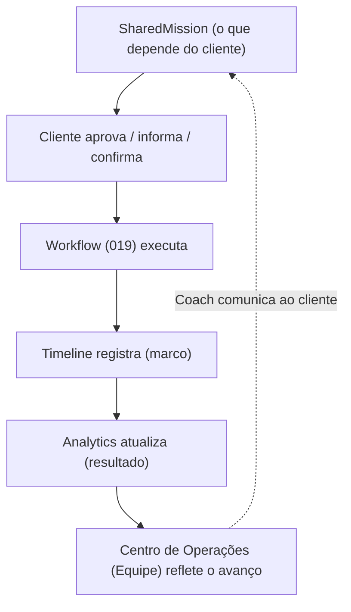
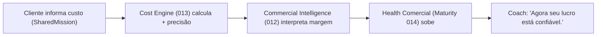
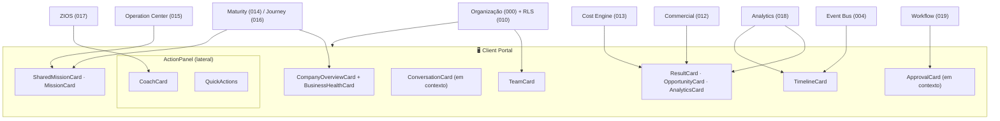

# Blueprints/003 — Client Portal Blueprint

```
─────────────────────────────────────────────
Status:                  Draft
Owner:                   Product / UX
Documento relacionado:   architecture/000-business-domain.md (Cliente/Organização)
Capability:              Portal do Cliente (visão do tenant Cliente sobre 011–019)
Experiência relacionada: product/006-client-portal.md
Prioridade:              Alta
Complexidade:            Média-Alta
Última revisão:          2026-07-14
Versão:                  v1.0
─────────────────────────────────────────────
```

> **Product Blueprint — especificação funcional da tela.** Segue integralmente a [Constituição dos Blueprints (000)](./000-blueprint-guide.md). Materializa a experiência de [Client Portal (product/006)](../006-client-portal.md) numa tela **implementável sem reinterpretar** documentos de arquitetura ou produto.

> [!important] Registro oficial
> **O Portal do Cliente é um ambiente de colaboração. Nunca um ambiente de fiscalização.** O objetivo não é mostrar um sistema — é **gerar confiança**: o cliente entende o que está acontecendo, quem está trabalhando, quais resultados são produzidos, o que depende dele e como a empresa evolui.

> **Base (contexto, não copiado):** [product/006 Portal](../006-client-portal.md) · [blueprints/000 Guide](./000-blueprint-guide.md) · [blueprints/001 Operation Center](./001-operation-center-blueprint.md) · [blueprints/002 Product Workspace](./002-product-workspace-blueprint.md) · arquitetura 000–019.

> **Convenções:** wireframes ASCII; fluxos Mermaid; componentes `PascalCase`; estados `MAIÚSCULAS`; eventos de domínio `dot.case` ([Event Bus 004](../../architecture/004-event-bus.md)); eventos de interface `ui.*`. Nenhuma cor/tipografia/medida em px (Design System, `product/007`).

---

## 1. Objetivo

Especificar a tela do **Portal do Cliente** — a **janela da empresa-cliente para o próprio negócio** dentro da Zion. Mesma plataforma, mesmo Design System, mesmo idioma; muda o **contexto** (escopo do cliente) e o **tom** (linguagem de negócio).

| Dimensão | Definição |
|----------|-----------|
| **Propósito** | Dar transparência e **gerar confiança**: o cliente acompanha a evolução da própria empresa e participa do que depende dele. |
| **Quem utiliza** | O **Cliente** (empresa-cliente, via Portal), nos papéis dele (ex.: dono, gestor da empresa-cliente). **Não** é a tela da Equipe (essa é [001](./001-operation-center-blueprint.md)). |
| **Quando utiliza** | Ao acompanhar o negócio, responder a Missões Compartilhadas, aprovar itens, conversar com a agência. |
| **O que espera encontrar** | A saúde do próprio negócio, o que mudou, o que depende dele, os resultados, quem cuida da conta — tudo em **linguagem de negócio**. |

> [!important] Escopo reduzido, mesmo idioma
> O Portal **nunca** mostra outro cliente ([RLS 010](../../architecture/010-database-compliance.md)); nunca expõe a operação interna da Equipe. Mostra **a empresa do cliente** — não módulos, não tecnologia ([006](../006-client-portal.md)).

---

## 2. Objetivos do Usuário

As perguntas que **esta tela responde** (prioridade decrescente):

1. **Como minha empresa está?** → CompanyOverviewCard + BusinessHealthCard.
2. **O que mudou hoje?** → Timeline + Coach.
3. **Existe alguma pendência (minha)?** → SharedMissionCard.
4. **O que preciso aprovar?** → ApprovalCard.
5. **Quais resultados tivemos?** → ResultCard.
6. **Quem está trabalhando?** → TeamCard (transparência).
7. **Como a IA está ajudando?** → Coach + AnalyticsCard (uso da IA).
8. **O que melhorou?** → AnalyticsCard (evolução).
9. **Qual o próximo passo?** → Coach / SharedMission de topo.

---

## 3. Wireframe ASCII

Layout de referência (desktop, papel **Cliente**). Hierarquia: minha empresa/saúde no topo → o que depende de mim + resultados no corpo → equipe/timeline/analytics → painel lateral com Coach.

```
┌──────────────────────────────────────────────────────────────────────────────────────┐
│ TOPBAR  [Zion]  Chinelaria Leilane Neves      🔎(⌘K)   🔔2   🤖   AA ▼                 │
├──────────────────────────────────────────────────────────────────────┬───────────────┤
│ 🏢 MINHA EMPRESA                                                      │  PAINEL       │
│ Health 77 🟡 (↑+5 no mês) · Maturidade: Prata · rumo a Ouro          │  LATERAL      │
│ 142 produtos · 3 canais · IA ativa · 3 pendências suas               │               │
├───────────────────────────────────┬──────────────────────────────────┤ ┌─ 🤖 COACH ─┐ │
│ 🎯 O QUE DEPENDE DE VOCÊ (3)      │ 📈 RESULTADOS (este mês)         │ │ "Sua empr. │ │
│ ▸ Informar custo de 3 produtos    │ ✔ 142 publicados                 │ │ evoluiu 5%.│ │
│   "Sem isso não sabemos sua margem"│ ✔ 34h economizadas pela IA       │ │ Faltam 3   │ │
│   pedido por: Ana (Consultora)     │ ✔ margem 16% → 19%               │ │ custos p/  │ │
│   [ Informar ]                     │ ✔ 27 pendências resolvidas       │ │ lucro real.│ │
│ ▸ Aprovar descrição (Chinelo Slim)│ [ ver resultados ]               │ │[ Ver o quê]│ │
│ ▸ Confirmar preço (Kit Verão)     │                                  │ │[ Por quê ] │ │
├───────────────────────────────────┼──────────────────────────────────┤ ├────────────┤ │
│ 👥 MINHA EQUIPE                    │ 📊 ANALYTICS (conhecimento)      │ │ ⚡ ATALHOS │ │
│ Ana — Consultora                   │ ▲ operação mais saudável (+5)    │ │ Aprovações │ │
│ Bruno — Especialista Marketplace   │ ▲ tempo de publicação -40%       │ │ Pendências │ │
│ Clara — Conteúdo/SEO               │ ▲ margem +3pp                    │ │ Conversas  │ │
│ Diego — Customer Success           │ [ entender minha evolução ]      │ │ Resultados │ │
├───────────────────────────────────┴──────────────────────────────────┤ └────────────┘ │
│ 🕑 TIMELINE (marcos)  esta semana: 12 publicados · campanha de verão iniciada          │
│                       você informou 8 custos · certificação Prata atingida             │
└───────────────────────────────────────────────────────────────────────────────────────┘
```

`ConversationCard` (conversas em contexto) e `ApprovalCard` aparecem **contextualmente** — ao abrir uma Missão Compartilhada, um produto ou uma campanha. Sem footer funcional; legais/versão no menu de perfil.

---

## 4. Anatomia

| Região | Objetivo | Informações | Prioridade | Ações |
|--------|----------|-------------|:---------:|-------|
| **TopBar** | contexto (a própria empresa) | nome da empresa, busca, notificações, IA, perfil | Fixa | buscar, notificações, perfil |
| **CompanyOverviewCard** | síntese do negócio | Health, maturidade, produtos, canais, pendências | **Máxima** | ver detalhe de cada bloco |
| **SharedMissionCard** (lista) | o que depende do cliente | Missões do cliente com por quê/quem/impacto/prazo | Alta | Informar/Aprovar/Confirmar |
| **ResultCard** (grupo) | resultados reais (narrativa) | publicados, tempo, margem, pendências resolvidas | Alta | ver resultados |
| **TeamCard** | quem cuida da conta | consultor + especialistas + CS | Média | ver responsável/conversar |
| **AnalyticsCard** | conhecimento (evolução) | tendências com significado de negócio | Média | entender evolução |
| **TimelineCard** | marcos do negócio | eventos relevantes (sem tecnês) | Baixa | ver tudo |
| **Painel lateral** | Coach + atalhos | recomendação de negócio + QuickActions | Alta (ao lado) | ações do Coach/atalhos |

---

## 5. Catálogo de Componentes

Cada componente no padrão oficial de **8 atributos** ([000 §7](./000-blueprint-guide.md)).

### 5.1 `CompanyOverviewCard`
- **Objetivo:** a síntese do negócio do cliente — a primeira coisa vista.
- **Responsabilidade:** apresentar Health/maturidade/produtos/canais/pendências da **própria** empresa; nunca módulos, nunca tecnologia.
- **Origem dos dados:** Operational Maturity ([014](../../architecture/014-operational-maturity-engine.md)) + Produto Mestre (contagens) + Journey ([016](../../architecture/016-implantation-journey.md), maturidade/certificação).
- **Estados:** `LOADING`, `DEFAULT`, `NEW` (empresa nova/onboarding), `PERMISSION_DENIED`.
- **Eventos:** consome `maturity.health_changed`, `maturity.level_changed`, `journey.milestone_completed`.
- **Ações:** abrir detalhe (Health, resultados, pendências).
- **Dependências:** `BusinessHealthCard`.

### 5.2 `BusinessHealthCard`
- **Objetivo:** a saúde do negócio em linguagem clara, acionável.
- **Responsabilidade:** apresentar Health da Operação/Comercial em termos de negócio; **não calcula**.
- **Origem dos dados:** Operational Maturity ([014](../../architecture/014-operational-maturity-engine.md)).
- **Estados:** `LOADING`, `HEALTHY`, `ATTENTION`, `CRITICAL`, `EMPTY` (medindo).
- **Eventos:** consome `maturity.health_changed`, `maturity.score_changed`.
- **Ações:** ver o que puxa a saúde (leva a resultado/pendência).
- **Dependências:** `PrecisionBadge` (onde o número depende de precisão).

### 5.3 `CoachCard`
- **Objetivo:** a IA como **consultora de negócios** do cliente.
- **Responsabilidade:** comunicar evolução/oportunidade/pendência/risco em **linguagem de negócio** — nunca técnica, nunca chatbot.
- **Origem dos dados:** ZIOS ([017](../../architecture/017-zion-intelligence-operating-system.md)).
- **Estados:** `VISIBLE`, `DISMISSED`, `NONE` (colapsa).
- **Eventos:** consome `ai.recommendation.created`, `maturity.*`, `commercial.*`; emite `ui.coach.act`, `ui.coach.dismissed`.
- **Ações:** Ver o quê, Por quê, Dispensar.
- **Dependências:** painel lateral (`ActionPanel`).

### 5.4 `MissionCard` (informativa)
- **Objetivo:** mostrar Missões que **afetam** o cliente (executadas pela agência).
- **Responsabilidade:** dar transparência do trabalho em andamento; **não** é acionável pelo cliente (é da Equipe).
- **Origem dos dados:** Operation Center ([015](../../architecture/015-operation-center.md)).
- **Estados:** `LOADING`, `IN_PROGRESS`, `DONE`, `EMPTY`.
- **Eventos:** consome `maturity.mission_created`, `workflow.*`.
- **Ações:** ver detalhe (leitura), conversar (contexto).
- **Dependências:** `ConversationCard`.

### 5.5 `SharedMissionCard`
- **Objetivo:** o que **depende do cliente** — a participação dele.
- **Responsabilidade:** apresentar a Missão do cliente com **por quê / quem pediu / impacto / prazo** e a ação (informar/aprovar/confirmar).
- **Origem dos dados:** Operation Center ([015](../../architecture/015-operation-center.md)) — Missões de tipo "cliente".
- **Estados:** `PENDING`, `SUBMITTED`, `DONE`, `OVERDUE`, `EMPTY`.
- **Eventos:** consome `maturity.mission_created`; emite `ui.sharedMission.submit`.
- **Ações:** Informar custo, Enviar imagens, Aprovar, Confirmar preço.
- **Dependências:** `ApprovalCard` (quando é aprovação), `ConversationCard`.

### 5.6 `TeamCard`
- **Objetivo:** dar rosto à agência — quem cuida da conta.
- **Responsabilidade:** listar consultor + especialistas + CS com responsabilidades; **transparência, não vigilância**.
- **Origem dos dados:** Organização ([000](../../architecture/000-business-domain.md)) — equipe atribuída ao cliente.
- **Estados:** `LOADING`, `DEFAULT`, `EMPTY`.
- **Eventos:** emite `ui.team.openConversation`.
- **Ações:** ver responsável, conversar (contexto).
- **Dependências:** `ConversationCard`.

### 5.7 `ConversationCard`
- **Objetivo:** comunicação **em contexto** — nunca chat genérico.
- **Responsabilidade:** vincular toda conversa a um objeto (produto/missão/campanha/marketplace/workflow); manter histórico.
- **Origem dos dados:** camada de colaboração (comentários por objeto) + Intelligence Ledger ([017](../../architecture/017-zion-intelligence-operating-system.md)) para rastreio.
- **Estados:** `LOADING`, `DEFAULT`, `EMPTY`, `SENDING`, `PERMISSION_DENIED`.
- **Eventos:** emite `ui.conversation.send`; consome atualizações da thread.
- **Ações:** comentar, anexar, mencionar.
- **Dependências:** o objeto de contexto (produto/missão/…).

### 5.8 `ApprovalCard`
- **Objetivo:** conduzir aprovações do cliente com histórico.
- **Responsabilidade:** apresentar o que aprovar (conteúdo/SEO/imagens/campanha/descrição/preço quando configurado); registrar quem/quando.
- **Origem dos dados:** item em aprovação (produto/campanha) + Board ([006 Intake](../../architecture/006-capability-000-zion-intake.md)).
- **Estados:** `PENDING`, `APPROVED`, `EDIT_REQUESTED`, `REJECTED`, `NOT_APPLICABLE`.
- **Eventos:** emite `ui.approval.decide`.
- **Ações:** Aprovar, Pedir ajuste, Rejeitar.
- **Dependências:** `ConversationCard`, histórico auditável.

### 5.9 `ResultCard`
- **Objetivo:** resultado real como **narrativa** (não gráfico solto).
- **Responsabilidade:** apresentar publicados/tempo economizado/margem/pendências resolvidas com significado de negócio.
- **Origem dos dados:** Operational Analytics ([018](../../architecture/018-operational-analytics.md)).
- **Estados:** `LOADING`, `DEFAULT`, `EMPTY` (sem histórico ainda).
- **Eventos:** consome `analytics.roi_updated`, `analytics.insight_created`.
- **Ações:** ver detalhe.
- **Dependências:** `AnalyticsCard`.

### 5.10 `OpportunityCard`
- **Objetivo:** oportunidades de crescimento em linguagem de negócio.
- **Responsabilidade:** apresentar onde há ganho (produto com potencial, preço abaixo do mercado) — **apresenta**, não calcula.
- **Origem dos dados:** Commercial Intelligence ([012](../../architecture/012-commercial-intelligence-engine.md)) / Analytics ([018](../../architecture/018-operational-analytics.md)).
- **Estados:** `LOADING`, `DEFAULT`, `EMPTY`.
- **Eventos:** consome `commercial.recommendation_created`, `analytics.trend_detected`.
- **Ações:** ver oportunidade, conversar com a equipe.
- **Dependências:** `PrecisionBadge`.

### 5.11 `AnalyticsCard`
- **Objetivo:** conhecimento resumido (evolução) — nunca BI completo.
- **Responsabilidade:** tendências com contexto e significado; nunca planilha/filtros.
- **Origem dos dados:** Operational Analytics ([018](../../architecture/018-operational-analytics.md)).
- **Estados:** `LOADING`, `DEFAULT`, `ATTENTION`, `EMPTY`.
- **Eventos:** consome `analytics.trend_detected`, `analytics.report_ready`.
- **Ações:** entender evolução (abre visão explicada, não BI).
- **Dependências:** —.

### 5.12 `TimelineCard`
- **Objetivo:** marcos do negócio (sem detalhe técnico).
- **Responsabilidade:** eventos relevantes ao cliente (publicações, campanhas, custos informados, certificações, Missões concluídas).
- **Origem dos dados:** Event Bus ([004](../../architecture/004-event-bus.md)) filtrado para marcos de negócio.
- **Estados:** `LOADING`, `DEFAULT`, `EMPTY`.
- **Eventos:** consome eventos de marco (`journey.*`, `marketplace.*` relevantes).
- **Ações:** ver tudo, abrir marco.
- **Dependências:** —.

### 5.13 Componentes de apoio
- **`OriginBadge`** — *(obrigatório onde há dado de origem)* fonte do dado (ERP/IA/Estimativa…), em linguagem simples.
- **`PrecisionBadge`** — *(obrigatório onde há número derivado)* confiança (ex.: "estimativa" / "confirmado").
- **`ActionPanel`** — painel lateral persistente (Coach + QuickActions).
- **`QuickActions`** — atalhos do cliente: Aprovações, Pendências, Conversas, Resultados. Estados: `DEFAULT`, `DISABLED` (com motivo).

---

## 6. Estados (wireframes por estado)

Os **sete estados obrigatórios** ([000 §8](./000-blueprint-guide.md)).

**Primeiro acesso**
```
🤖 "Bem-vindo à Zion! Vamos ativar sua operação com a {agência}."
CompanyOverview: Health — (medindo) · Maturidade: iniciando
O QUE DEPENDE DE VOCÊ: "Conecte-se com a equipe / envie seu catálogo"
```

**Empresa nova**
```
Health baixo (ainda ativando); Resultados/Analytics: — (sem histórico)
Coach: "Assim que os primeiros produtos forem ao ar, você verá resultados aqui."
```

**Empresa saudável**
```
Health 🟢 · Maturidade Ouro; Resultados fortes; Coach: oportunidades
tom de comemoração ("+5 no mês", "certificação atingida")
```

**Empresa com pendências (foco do dia a dia)**
```
┌ 🎯 O QUE DEPENDE DE VOCÊ (3) ───────────────────────────┐
│ ▸ Informar custo de 3 produtos   (Ana)   [ Informar ]  │
│ ▸ Aprovar descrição              (Clara) [ Aprovar ]   │
│ ▸ Confirmar preço                (Bruno) [ Confirmar ] │
└─────────────────────────────────────────────────────────┘
Coach: "3 pendências rápidas destravam a publicação de 12 produtos."
```

**Empresa crítica**
```
┌ ⚠️ ATENÇÃO ─────────────────────────────────────────────┐
│ "8 anúncios estão fora do ar por um detalhe de tamanho —│
│  a equipe já está resolvendo."   Responsável: Bruno     │
│ Health Comercial em queda; margem sob risco             │
└─────────────────────────────────────────────────────────┘
(linguagem calma, não alarmista; foco em "já cuidando")
```

**Sem Missões (nada depende do cliente)**
```
✅ "Tudo em dia do seu lado!"
"A equipe segue trabalhando. Aproveite para ver seus resultados."
Coach: oportunidade opcional
```

**Sem permissão**
```
"Você não tem acesso a este item."
Nunca revela dado de outro cliente/da operação interna da Equipe.
Oferece voltar a Minha Empresa. (RLS deny-by-default — 010)
```

Transversais: `LOADING` (skeleton por card), `ERROR` (explica, não culpa, re-tenta).

---

## 7. Interações

| Interação | Comportamento |
|-----------|---------------|
| **Clique em bloco do Overview** | abre detalhe (Health, resultados, pendências) — sem sair do contexto da empresa. |
| **Hover em card** | revela ação secundária (ver, conversar) sem ruído. |
| **Aprovação** | `ApprovalCard` → Aprovar/Pedir ajuste/Rejeitar → **registra histórico** (quem/quando) → confirma impacto. |
| **Conversa** | `ConversationCard` sempre **dentro de um objeto**; enviar anexa à thread do contexto; histórico preservado. |
| **Download** | baixar um resultado/relatório/arquivo (com confirmação; nunca expõe dado de outro cliente). |
| **Histórico** | abrir o histórico de aprovações/conversas de um item (auditável). |
| **Timeline** | ver marcos; abrir um marco leva ao contexto (produto/campanha). |
| **Analytics** | "entender evolução" abre visão **explicada** (narrativa), não BI. |
| **Coach** | Ver o quê / Por quê / Dispensar; recomendação em linguagem de negócio. |
| **Loading / tempo real** | skeleton por card; eventos atualizam sem recarregar; nunca desloca o alvo do clique. |

---

## 8. Coach

| Aspecto | Definição |
|---------|-----------|
| **Posição** | Painel lateral direito (`ActionPanel`); nunca cobre o conteúdo. |
| **Mensagens** | evolução ("sua empresa evoluiu 5%"), oportunidade, pendência, risco — 1 principal por vez. |
| **Tom** | didático, calmo, de parceiro; comemora conquistas. |
| **Linguagem** | **de negócio, nunca técnica** (❌ "SIZE_GRID inválido" → ✅ "8 anúncios fora do ar por um detalhe de tamanho — já resolvendo"). |
| **Prioridades** | o que **destrava resultado** e o que **depende do cliente** vêm primeiro. |
| **Limites** | **nunca chatbot**; nunca tecnês; nunca inventa dado; nunca expõe operação interna/outro cliente; sempre explicável. |

---

## 9. Fluxos

### 9.1 Missão Compartilhada → aprovação do cliente → resultado



### 9.2 Cliente informa custo → cadeia de valor até o Coach



---

## Seção especial — Transparência

Como o cliente **acompanha a operação** — colaboração, **nunca vigilância** ([006 §7](../006-client-portal.md)):

| O cliente vê | Para… | Nunca é… |
|--------------|-------|----------|
| **Equipe** (quem cuida da conta) | saber com quem conta | …monitorar pessoas. |
| **Próximos passos** da operação | entender para onde vai | …cobrar relógio. |
| **Responsáveis** por cada frente | saber a quem falar | …avaliar produtividade individual. |
| **Resultados** produzidos | ver o valor entregue | …auditar comportamento. |

> [!important] Transparência, não vigilância
> O cliente acompanha **trabalho e progresso** — jamais o comportamento individual de um operador. A transparência gera **confiança** e engajamento; é o mesmo princípio ético do [Painel do Gestor (001 §Painel do Gestor)](./001-operation-center-blueprint.md). Este é um **ambiente de colaboração**.

---

## Seção especial — Conversas

Toda comunicação **pertence a um contexto** — **nunca chat genérico** ([006 §13](../006-client-portal.md)):

| A conversa pertence a… | Exemplo |
|------------------------|---------|
| **Produto** | "Sobre o Chinelo Slim: pode enviar uma foto melhor?" |
| **Missão** | discussão dentro da SharedMission "Aprovar descrição". |
| **Campanha** | alinhamento sobre a promoção de verão. |
| **Marketplace** | sobre um problema num canal. |
| **Workflow** | sobre uma execução em andamento. |

Vantagens (implementação): o `ConversationCard` **sempre recebe um `contextRef`** (tipo + id do objeto); não existe conversa "solta". Assim: nada se perde, o contexto vem junto, o histórico é útil e auditável, e há menos ruído.

---

## 10. Preparação para Implementação

Inventário (sem código; o *como* é do Design System `product/007` + Engenharia).

**Componentes React futuros:**
`ClientPortalPage` (container) · `CompanyOverviewCard` · `BusinessHealthCard` · `CoachCard` · `MissionCard` · `SharedMissionCard` · `TeamCard` · `ConversationCard` · `ApprovalCard` · `ResultCard` · `OpportunityCard` · `AnalyticsCard` · `TimelineCard` · `ActionPanel` · `QuickActions` · `OriginBadge` · `PrecisionBadge` · `EmptyState` · `LoadingSkeleton`.

**Estados locais (conceituais):**
- Página: `tenant` (a própria empresa), `role` (cliente-dono/gestor), `permission`, `onboarding?`, `connectionStatus`.
- `SharedMissionCard`: `type` (custo/imagem/aprovação/preço), `status` (PENDING/SUBMITTED/DONE/OVERDUE), `requestedBy`, `dueDate`.
- `ApprovalCard`: `item`, `decision?`, `history[]`.
- `ConversationCard`: `contextRef` (tipo+id), `thread[]`, `sending`.
- `ResultCard/AnalyticsCard`: `insights[]`, `deltas[]`, `roi?`.
- `CoachCard`: `recommendation?`, `visibility`.

**Eventos de UI (dispara):**
`ui.sharedMission.submit`, `ui.approval.decide`, `ui.conversation.send`, `ui.team.openConversation`, `ui.coach.act`, `ui.coach.dismissed`, `ui.result.open`, `ui.analytics.open`, `ui.download`, `ui.navigate`.

**Eventos de domínio consumidos (tempo real):**
`maturity.health_changed`, `maturity.score_changed`, `maturity.level_changed`, `maturity.mission_created`, `journey.milestone_completed`, `journey.health_changed`, `commercial.margin_changed`, `commercial.recommendation_created`, `cost.updated`, `cost.precision_changed`, `analytics.roi_updated`, `analytics.insight_created`, `analytics.trend_detected`, `marketplace.listing.estado`, `workflow.completed`, `ai.recommendation.created`.

**Dependências (origem dos dados):**
Overview/Health/Maturidade → Maturity ([014](../../architecture/014-operational-maturity-engine.md))/Journey ([016](../../architecture/016-implantation-journey.md)) · SharedMissions/Missions → Operation Center ([015](../../architecture/015-operation-center.md)) · Resultados/Analytics → Analytics ([018](../../architecture/018-operational-analytics.md)) · Oportunidades/Margem → Commercial ([012](../../architecture/012-commercial-intelligence-engine.md)) · Custo/precisão → Cost Engine ([013](../../architecture/013-cost-engine.md)) · Coach → ZIOS ([017](../../architecture/017-zion-intelligence-operating-system.md)) · Timeline → Event Bus ([004](../../architecture/004-event-bus.md)) · Equipe/tenant/permissão → Organização ([000](../../architecture/000-business-domain.md)) + [RLS 010](../../architecture/010-database-compliance.md) · Execução (aprovações) → Workflow ([019](../../architecture/019-workflow-engine.md)).

> [!note] Fronteira
> Este inventário **identifica**; não define props em TypeScript, hooks, estado global nem estilos (Engenharia + Design System).

---

## 11. Checklist para Desenvolvimento

```
□ Entra em "Minha Empresa" (a própria empresa, nunca módulos)?
□ CompanyOverviewCard: Health/maturidade/produtos/canais/pendências do próprio tenant?
□ SharedMissionCard: por quê / quem pediu / impacto / prazo + ação (informar/aprovar/confirmar)?
□ ResultCard/AnalyticsCard: narrativa com significado de negócio (nunca BI cru)?
□ TeamCard: quem cuida da conta (transparência, não vigilância)?
□ ConversationCard SEMPRE com contextRef (nunca chat genérico)?
□ ApprovalCard registra histórico (quem/quando) auditável?
□ CoachCard em LINGUAGEM DE NEGÓCIO (nunca técnica), no painel lateral, colapsa em NONE?
□ OriginBadge presente em todo dado de origem?  ← obrigatório
□ PrecisionBadge presente em todo número derivado?  ← obrigatório
□ Timeline apenas com marcos relevantes ao negócio (sem tecnês)?
□ Sete estados cobertos (primeiro acesso/nova/saudável/pendências/crítica/sem-missões/sem-permissão)?
□ Isolamento por tenant: NUNCA mostra outro cliente nem a operação interna da Equipe?  ← crítico
□ LOADING por card; ERROR explica sem culpar e re-tenta?
□ Tempo real atualiza sem recarregar e sem deslocar o alvo do clique?
□ Tom calmo; evolução comemorada; nunca alarmista (Design Principles 001)?
```

---

## 12. Critérios de Aceite

- [ ] **Ambiente de colaboração, não fiscalização:** o Portal gera confiança; nunca vigia.
- [ ] **Entra em "Minha Empresa":** o cliente vê o próprio negócio, não módulos.
- [ ] **Missões Compartilhadas completas:** por quê/quem/impacto/prazo + ação.
- [ ] **Resultados como narrativa;** Analytics é conhecimento, não BI.
- [ ] **Transparência sem vigilância:** vê equipe/próximos passos/resultados, nunca comportamento individual.
- [ ] **Conversas sempre em contexto** (`contextRef`); nunca chat genérico.
- [ ] **Aprovações com histórico** auditável.
- [ ] **Coach em linguagem de negócio;** nunca técnico, nunca chatbot.
- [ ] **OriginBadge e PrecisionBadge obrigatórios** onde aplicável.
- [ ] **Timeline só de marcos** relevantes ao negócio.
- [ ] **Sete estados** implementados; tom calmo, evolução comemorada.
- [ ] **Isolamento por tenant:** nunca mostra outro cliente nem a operação interna da Equipe ([RLS 010](../../architecture/010-database-compliance.md)).
- [ ] **Tempo real** sem recarregar e sem deslocar cliques.
- [ ] **Checklist de Desenvolvimento** 100% marcado.

---

## Seção especial — Um mês na vida do Alex

| Momento | O que acontece no Portal |
|---------|--------------------------|
| **Alex acompanha** | Entra em "Minha Empresa": Health 72 🟡, Maturidade Prata, "3 coisas dependem de você". |
| **Recebe Missões** | `SharedMissionCard`: *"Informe o custo de 3 produtos — sem isso não sabemos sua margem"* (pedido pela Ana). |
| **Informa custos** | Preenche os 3; dispara o [fluxo 9.2](#9-fluxos); o Coach: *"Agora seu lucro está confiável."* |
| **Aprova campanhas** | `ApprovalCard`: aprova a campanha de verão e uma descrição; fica registrado no histórico. |
| **Conversa com a equipe** | `ConversationCard` dentro do produto: pede uma foto melhor à Clara; tudo no contexto. |
| **Recebe recomendações** | O Coach aponta 3 produtos com potencial de aumento de preço. |
| **Percebe melhora** | `ResultCard`: 12 publicados, margem 16%→19%, 34h economizadas; Health sobe para 77; caminho para Ouro. |

> [!important] Confiança nasce do entendimento
> Ao fim do mês, Alex **confia** na agência porque **entende o trabalho**: viu as pendências, contribuiu com o que era dele, aprovou o que era decisão dele, conversou no contexto e a IA explicou tudo em linguagem que ele compreende. O Portal **mostrou a empresa dele evoluindo — não um software.**

---

## Seção especial — Mapa Visual

Composição completa do Portal e origens de dados:



---

## Seção especial — Notas para Engenharia

Recomendações **inegociáveis**:

1. **Nunca mostrar outro cliente.** Todo dado é escopado por tenant ([RLS 010](../../architecture/010-database-compliance.md)); `PERMISSION_DENIED` **não busca nem revela** nada. Nem a operação interna da Equipe aparece.
2. **Toda aprovação gera histórico.** `ApprovalCard` registra quem/quando/o quê (auditável) — protege cliente e agência.
3. **Coach sempre em linguagem de negócio.** Traduzir qualquer tecnês antes de exibir; nunca mostrar códigos/erros crus ao cliente.
4. **Timeline apenas com eventos relevantes ao negócio.** Filtrar eventos técnicos (retries, sync internos); mostrar marcos.
5. **`OriginBadge` obrigatório** em todo dado com origem — em linguagem simples ("informado por você", "do seu ERP", "estimado").
6. **`PrecisionBadge` obrigatório** em todo número derivado — o cliente precisa saber quando algo é "estimado" vs "confirmado".
7. **Conversa sempre com `contextRef`.** Não implementar chat global; toda thread pertence a um objeto.
8. **Resultados são narrativa.** O backend deve fornecer o **texto explicativo** (do Analytics 018), não só números para a UI montar.
9. **Tom calmo por padrão.** Estados críticos comunicam "já cuidando"; nunca alarmista.
10. **Tempo real não desloca o alvo do clique.**

> [!important] Colaboração, nunca fiscalização
> Toda decisão de implementação do Portal deve reforçar **confiança e parceria**. Se um recurso puder ser lido como "o cliente vigiando a equipe" ou "a agência controlando o cliente", ele contradiz o propósito do Portal e **não deve ser construído assim**.

---

> **Registro oficial:** **O Portal do Cliente é um ambiente de colaboração. Nunca um ambiente de fiscalização. Ele não existe para mostrar software — existe para mostrar evolução e gerar confiança.**

> **Status:** `product/blueprints/003` — Client Portal Blueprint **v1.0 (Draft)**. Segue a [Constituição dos Blueprints (000)](./000-blueprint-guide.md); materializa [product/006](../006-client-portal.md). Fecha a trilha dos ambientes principais em Blueprint ([001 Operation Center](./001-operation-center-blueprint.md) → [002 Workspace](./002-product-workspace-blueprint.md) → 003 Portal). **Próximo documento sugerido:** `product/blueprints/004-component-catalog.md` (o Catálogo de Componentes unificado — consolidar os componentes recorrentes já nomeados nos três Blueprints — `CoachCard`, `HealthCard`/`BusinessHealthCard`, `TimelineCard`, `MissionCard`/`SharedMissionCard`, `ApprovalCard`, `OriginBadge`, `PrecisionBadge`, `StatusChip`, `ActionPanel`, `QuickActions`, `EmptyState`, `LoadingSkeleton` — numa referência única de contratos de componente (variações por contexto, estados canônicos, props conceituais e eventos), a ponte definitiva para o Design System `product/007`).
