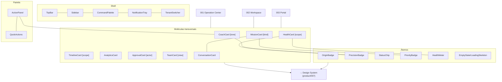

# Blueprints/004 — Component Catalog

```
─────────────────────────────────────────────
Status:                  Draft
Owner:                   Product / UX / Frontend
Documento relacionado:   blueprints/000-blueprint-guide.md
Capability:              transversal (materializa componentes de 001/002/003)
Experiência relacionada: product/001-design-principles.md
Prioridade:              Alta
Complexidade:            Média
Última revisão:          2026-07-14
Versão:                  v1.0
─────────────────────────────────────────────
```

> **Catálogo de Componentes — referência transversal.** Consolida, num único lugar, os componentes que se repetem nos Blueprints de tela ([001 Operation Center](./001-operation-center-blueprint.md), [002 Product Workspace](./002-product-workspace-blueprint.md), [003 Client Portal](./003-client-portal-blueprint.md)). Segue o **espírito e o padrão de componente** da [Constituição dos Blueprints (000)](./000-blueprint-guide.md) — não descreve uma tela, e sim **contratos de componente** reutilizáveis.

> [!important] O que este documento é (e não é)
> - **É** a Fonte da Verdade de **quais componentes existem, o que fazem, seus estados canônicos e suas variações por contexto** — a ponte para o Design System (`product/007`).
> - **Não é** um Blueprint de tela (não tem wireframe único/anatomia de uma tela) — é uma referência que os Blueprints de tela **consomem**.
> - **Não é** Design System — não define cor, tipografia, tokens, medidas, nem código. Isso é `product/007` + Engenharia.
> - **Não inventa componentes** — apenas consolida os já nomeados em 001/002/003.

> **Convenções:** componentes `PascalCase`; estados `MAIÚSCULAS`; eventos de domínio `dot.case`; eventos de interface `ui.*`. Cada componente segue os **8 atributos** de [000 §7](./000-blueprint-guide.md).

---

## 1. Objetivo

Dar a Design e Engenharia **um contrato único por componente**, de modo que o **mesmo componente pareça e se comporte igual em toda a Zion** — no cockpit, no workspace e no portal. Isso concretiza dois princípios já oficiais:
- **Consistência** ([001 Design Principles §10](../001-design-principles.md)) — Health/Missões/Timeline iguais em todo lugar.
- **Uma casa, muitas visões** ([002 Information Architecture](../002-information-architecture.md)) — o mesmo dado, o mesmo componente, escopos diferentes.

Sem este catálogo, cada Blueprint reinventaria variações do "mesmo" card — e a plataforma perderia a unidade.

---

## 2. Escopo e Método

O catálogo consolida os componentes de **001/002/003** em três decisões:

1. **Um contrato por componente** (8 atributos) — mesmo que apareça em telas diferentes.
2. **Variações por contexto** declaradas via **`variant`** (ex.: `CoachCard[tone=business]`) — nunca componentes duplicados.
3. **Estados canônicos compartilhados** ([§4](#4-estados-canônicos)) — o vocabulário de estados é o mesmo em todos.

> [!note] Regra de variação
> Quando dois Blueprints usam "o mesmo" componente com pequenas diferenças, é **uma variação (`variant`/`scope`/`tone`)**, não um componente novo. Um componente novo só se justifica quando **responsabilidade e origem de dados** diferem de fato.

---

## 3. Taxonomia

| Camada | O que é | Componentes |
|--------|---------|-------------|
| **Átomos** | peças mínimas, sem lógica de domínio | `OriginBadge`, `PrecisionBadge`, `StatusChip`, `PriorityBadge`, `HealthMeter`, `EmptyState`, `LoadingSkeleton` |
| **Moléculas (Cards)** | cards com propósito e origem de dados | `CoachCard`, `HealthCard`, `MissionCard`, `TimelineCard`, `AnalyticsCard`, `ApprovalCard`, `TeamCard`, `ResultCard`, `OpportunityCard`, `ConversationCard`, `VersionCard`, `CommercialCard`, `ERPCard`, `MarketplaceCard`, `ContentCard`, `MediaCard`, `SEOCard`, `VariantsCard`, `IdentityCard`, `CompanyOverviewCard` |
| **Organismos / Painéis** | composições e áreas persistentes | `ActionPanel`, `QuickActions`, `WorkspaceHeader` |
| **Shell** | moldura global da aplicação | `TopBar`, `Sidebar`, `TenantSwitcher`, `CommandPalette`, `NotificationTray` |

Este catálogo detalha os **transversais** (usados em ≥2 Blueprints). Os **específicos de uma tela** (ex.: `ERPCard`, `VariantsCard`, `CompanyOverviewCard`) permanecem especificados no seu Blueprint de origem e são apenas **listados** aqui na matriz ([§9](#9-matriz-componente--blueprint)).

---

## 4. Estados Canônicos

Vocabulário **único** de estados (todo componente considera os aplicáveis — [000 §8](./000-blueprint-guide.md)):

| Estado | Significado | Regra |
|--------|-------------|-------|
| `LOADING` | dados carregando | `LoadingSkeleton` por card; nunca tela branca. |
| `EMPTY` | sem dados | comunica próximo passo/calma; nunca tela morta. |
| `ERROR` | falha | explica, não culpa, re-tenta ([001](../001-design-principles.md)). |
| `DEFAULT` | nominal/saudável | — |
| `CRITICAL` | exige atenção urgente | destaque; nunca mais de 1 prioridade máxima por tela. |
| `DISABLED` | ação indisponível | sempre com **motivo visível**. |
| `PERMISSION_DENIED` | papel/tenant sem acesso | **não busca nem revela** dado; oferece retorno ([RLS 010](../../architecture/010-database-compliance.md)). |

Estados específicos (ex.: `PENDING`, `DIFF`, `PUBLISHING`, `DISMISSED`, `NONE`) são declarados no componente e **não** substituem os canônicos.

---

## 5. Catálogo — Átomos

### `OriginBadge` **(obrigatório onde há dado de origem)**
- **Objetivo:** declarar a **fonte** de um dado (proveniência).
- **Responsabilidade:** exibir a origem; nunca alterar o dado.
- **Origem dos dados:** o metadado de origem do valor (ERP/IA/Estimativa/Operador/Template/Integração/Política — [013a §Origem da Informação](../../architecture/013a-architecture-review-epic2.md)).
- **Estados:** `DEFAULT`.
- **Eventos:** —.
- **Ações:** (opcional) tooltip "de onde vem".
- **Dependências:** —.
- **Variantes:** `tone=technical` (cockpit/workspace: "ERP", "IA") · `tone=business` (portal: "do seu ERP", "informado por você", "estimado").

### `PrecisionBadge` **(obrigatório onde há número derivado)**
- **Objetivo:** declarar a **confiança** de um número calculado.
- **Responsabilidade:** exibir precisão (alta/média/baixa); nunca maquiar.
- **Origem dos dados:** precisão do Cost Engine ([013](../../architecture/013-cost-engine.md)) / consolidada em Maturity ([014](../../architecture/014-operational-maturity-engine.md)).
- **Estados:** `HIGH`, `MEDIUM`, `LOW`.
- **Eventos:** consome `cost.precision_changed`.
- **Ações:** tooltip "por que esta confiança".
- **Variantes:** `tone=technical` (alta/média/baixa) · `tone=business` (confirmado/estimado).

### `StatusChip`
- **Objetivo:** estado de um produto/canal/item.
- **Responsabilidade:** traduzir um estado em rótulo+cor+ícone (nunca cor sozinha — [001 Acessibilidade](../001-design-principles.md)).
- **Origem dos dados:** o estado do objeto (produto/listing/missão).
- **Estados (por valor):** ex. `DRAFT`, `PUBLISHED`, `ERROR`, `PAUSED`, `NOT_PUBLISHED`, `BLOCKED`.
- **Eventos:** —.
- **Variantes:** `context=product|channel|mission`.

### `PriorityBadge`
- **Objetivo:** prioridade de uma Missão/alerta.
- **Responsabilidade:** exibir 🔴 Alta / 🟠 Média / 🟡 Baixa (texto+ícone).
- **Origem dos dados:** prioridade calculada (impacto×urgência×esforço — [015](../../architecture/015-operation-center.md)/[014](../../architecture/014-operational-maturity-engine.md)).
- **Estados:** `HIGH`, `MEDIUM`, `LOW`.
- **Eventos:** —.

### `HealthMeter`
- **Objetivo:** representação 0–100 de uma dimensão de saúde.
- **Responsabilidade:** exibir valor + faixa (🟢🟡🔴) + delta; **não calcula**.
- **Origem dos dados:** Operational Maturity ([014](../../architecture/014-operational-maturity-engine.md)).
- **Estados:** `HEALTHY`, `ATTENTION`, `CRITICAL`, `EMPTY`.
- **Eventos:** consome `maturity.health_changed`.
- **Dependências:** usado por `HealthCard`.

### `EmptyState` / `LoadingSkeleton`
- **Objetivo:** materializar os estados `EMPTY` e `LOADING` de forma consistente.
- **Responsabilidade:** `EmptyState` comunica próximo passo/calma; `LoadingSkeleton` sinaliza carregamento por card.
- **Origem dos dados:** —.
- **Estados:** próprio.
- **Ações:** `EmptyState` pode oferecer a ação inicial (ex.: "importar catálogo").

---

## 6. Catálogo — Moléculas transversais

### `CoachCard` — a IA na interface
- **Objetivo:** trazer a recomendação contextual da IA, acionável.
- **Responsabilidade:** sugerir/explicar; **nunca chatbot**, **nunca cobre o trabalho**, sempre opcional.
- **Origem dos dados:** ZIOS ([017](../../architecture/017-zion-intelligence-operating-system.md)).
- **Estados:** `VISIBLE`, `DISMISSED`, `NONE` (colapsa), `APPLYING`.
- **Eventos:** consome `ai.recommendation.created`; emite `ui.coach.apply|act|dismissed`.
- **Ações:** Aplicar/Ver o quê, Por quê, Dispensar.
- **Dependências:** `PrecisionBadge` (confiança), `ActionPanel`.
- **Variantes:**
  - `tone=technical` (001 cockpit / 002 workspace) — linguagem operacional.
  - `tone=business` (003 portal) — **linguagem de negócio, nunca técnica** (traduz o tecnês antes de exibir).
  - `placement=sidebar` (padrão) — nunca modal que interrompe.

### `HealthCard` — saúde acionável **(resolve HealthCard × BusinessHealthCard)**
- **Objetivo:** apresentar saúde por dimensão, clicável.
- **Responsabilidade:** exibir dimensões; **não calcula**; dimensão fraca → ação.
- **Origem dos dados:** Operational Maturity ([014](../../architecture/014-operational-maturity-engine.md)).
- **Estados:** `LOADING`, `DEFAULT`, `DIMENSION_CRITICAL`, `EMPTY`.
- **Eventos:** consome `maturity.health_changed`, `maturity.score_changed`.
- **Ações:** `AbrirDimensao` (→ Missão/Fila/seção).
- **Dependências:** `HealthMeter`, `PrecisionBadge`.
- **Variantes (`scope`):**
  - `scope=operation` (001) — Health da Operação.
  - `scope=product` (002) — Health do Produto.
  - `scope=business` (003, **antes `BusinessHealthCard`**) — Health do negócio, `tone=business`.
  - `scope=commercial` — recorte comercial.

> [!important] Reconciliação de nome
> **`BusinessHealthCard` (003) é `HealthCard[scope=business, tone=business]`.** Não é um componente separado — é uma variação. O Design System (007) implementa **um** `HealthCard` com variações.

### `MissionCard` — família de Missão **(resolve MissionCard × SharedMissionCard)**
- **Objetivo:** apresentar uma Missão e (quando aplicável) conduzir à ação.
- **Responsabilidade:** título, prioridade, tempo, "por quê", ação.
- **Origem dos dados:** Operation Center ([015](../../architecture/015-operation-center.md)).
- **Estados:** `DEFAULT`, `IN_PROGRESS`, `BLOCKED`, `DONE`, `EMPTY`; (compartilhada) `PENDING`, `SUBMITTED`, `OVERDUE`.
- **Eventos:** consome `maturity.mission_created`, `workflow.*`; emite `ui.mission.*`.
- **Ações:** Agir (operador) · Informar/Aprovar/Confirmar (cliente) · ver detalhe (leitura).
- **Dependências:** `PriorityBadge`, `ConversationCard`.
- **Variantes (`kind`):**
  - `kind=actionable` (001) — o operador executa.
  - `kind=informative` (003) — o cliente **vê** o trabalho da agência (não age).
  - `kind=shared` (003, **antes `SharedMissionCard`**) — **depende do cliente** (com `requestedBy`, `dueDate`, `impact`).

> [!important] Reconciliação de nome
> **`SharedMissionCard` (003) é `MissionCard[kind=shared]`.** Mesma família, escopo de ação diferente.

### `TimelineCard` — narrativa de eventos
- **Objetivo:** contar a história (recente ou de longo prazo) em linguagem humana.
- **Responsabilidade:** eventos narrados, com autor/versão quando aplicável; imutável.
- **Origem dos dados:** Event Bus ([004](../../architecture/004-event-bus.md)) / Analytics ([018](../../architecture/018-operational-analytics.md)).
- **Estados:** `LOADING`, `DEFAULT`, `EMPTY`.
- **Eventos:** consome eventos de domínio; emite `ui.timeline.openEvent`.
- **Ações:** ver tudo, abrir evento/versão.
- **Variantes (`scope`):** `operation` (001, recente) · `product` (002, vida do produto) · `business` (003, marcos, `tone=business`, sem tecnês).

### `AnalyticsCard` — conhecimento resumido
- **Objetivo:** sinalizar tendência/o que merece atenção — **nunca BI completo**.
- **Responsabilidade:** deltas com contexto; abrir o contexto Analytics.
- **Origem dos dados:** Operational Analytics ([018](../../architecture/018-operational-analytics.md)).
- **Estados:** `LOADING`, `DEFAULT`, `ATTENTION`, `EMPTY`.
- **Eventos:** consome `analytics.trend_detected`, `analytics.anomaly_detected`, `analytics.report_ready`.
- **Ações:** abrir Analytics/entender evolução.
- **Variantes:** `tone=technical` (001) · `tone=business` (003, narrativa de negócio).

### `ApprovalCard` — aprovar com histórico
- **Objetivo:** conduzir uma aprovação e registrar a decisão.
- **Responsabilidade:** apresentar o item, permitir Aprovar/Editar/Rejeitar; **histórico auditável**.
- **Origem dos dados:** Board/Intake ([006](../../architecture/006-capability-000-zion-intake.md)) — trava A10; ou item do cliente.
- **Estados:** `PENDING`, `APPROVED`, `EDIT_REQUESTED`, `REJECTED`, `NOT_APPLICABLE`.
- **Eventos:** emite `ui.approval.decide`.
- **Ações:** Aprovar, Pedir ajuste/Editar, Rejeitar.
- **Dependências:** `ConversationCard`.
- **Variantes:** `actor=team` (002, trava A10) · `actor=client` (003, aprovações do cliente).

### `TeamCard` — pessoas
- **Objetivo:** dar leitura da equipe.
- **Responsabilidade:** **transparência/equilíbrio, nunca vigilância**.
- **Origem dos dados:** Organização ([000](../../architecture/000-business-domain.md)).
- **Estados:** `LOADING`, `DEFAULT`, `OVERLOAD_ALERT` (gestor), `EMPTY`.
- **Eventos:** emite `ui.team.*`.
- **Ações:** ver membro, redistribuir/aliviar (gestor), conversar (cliente).
- **Variantes:** `view=manager` (001, carga/capacidade) · `view=client` (003, "quem cuida da minha conta").

### `ResultCard` / `OpportunityCard` / `ConversationCard` / `VersionCard`
- **`ResultCard`** (003) — resultado como **narrativa** de negócio; origem Analytics ([018](../../architecture/018-operational-analytics.md)); estados `LOADING/DEFAULT/EMPTY`.
- **`OpportunityCard`** (003) — oportunidade de crescimento; origem Commercial ([012](../../architecture/012-commercial-intelligence-engine.md))/Analytics; `PrecisionBadge` obrigatório.
- **`ConversationCard`** (003) — conversa **sempre com `contextRef`** (produto/missão/campanha/marketplace/workflow); **nunca chat genérico**; histórico preservado; estados `LOADING/DEFAULT/EMPTY/SENDING/PERMISSION_DENIED`.
- **`VersionCard`** (002) — diff de versões + revert (reversível declarado); origem Versionamento ([001](../../architecture/001-product-master.md)).

---

## 7. Catálogo — Organismos / Painéis

### `ActionPanel`
- **Objetivo:** painel lateral persistente (Coach + ações).
- **Responsabilidade:** hospedar `CoachCard` + `QuickActions`; nunca cobrir o conteúdo principal.
- **Origem dos dados:** composição.
- **Estados:** `DEFAULT`, `COLLAPSED`.
- **Usado em:** 002, 003 (e recomendável no 001 como coluna direita).

### `QuickActions`
- **Objetivo:** atalhos contextuais.
- **Responsabilidade:** expor as ações mais frequentes do contexto; `DISABLED` com motivo.
- **Origem dos dados:** o contexto (produto/empresa).
- **Estados:** `DEFAULT`, `DISABLED`.
- **Variantes:** por contexto (workspace: Publicar/Sincronizar/Abrir Missão; portal: Aprovações/Pendências/Conversas/Resultados).

### `WorkspaceHeader`
- **Objetivo:** cabeçalho de contexto de um objeto (produto).
- **Responsabilidade:** identidade + situação + ações principais.
- **Origem dos dados:** o objeto + Health.
- **Estados:** `LOADING`, `DEFAULT`, `CRITICAL`, `BLOCKED`, `ARCHIVED`.
- **Nota:** específico do Workspace (002); listado aqui por ser um organismo de referência (um "ObjectHeader" genérico pode emergir no 007).

---

## 8. Catálogo — Shell

| Componente | Objetivo | Origem | Estados | Blueprints |
|-----------|----------|--------|---------|-----------|
| `TopBar` | contexto transversal (tenant, busca, IA, perfil) | Organização ([000](../../architecture/000-business-domain.md)) | `DEFAULT` | 001/002/003 |
| `Sidebar` | navegação entre destinos globais (nunca menu por Capability) | Navegação ([003](../003-navigation.md)) | `DEFAULT`, `COLLAPSED` | 001/002 |
| `TenantSwitcher` | trocar cliente (só Equipe) | Organização + [RLS 010](../../architecture/010-database-compliance.md) | `DEFAULT`, `SWITCHING` | 001/002 |
| `CommandPalette` | busca universal (⌘K) | índice por tenant | `CLOSED`, `OPEN`, `RESULTS`, `EMPTY` | 001/002/003 |
| `NotificationTray` | o que mudou / talvez exija você | Event Bus ([004](../../architecture/004-event-bus.md)) | `DEFAULT`, `EMPTY` | 001/002/003 |

Princípio de shell: **poucos destinos, muita busca** ([003](../003-navigation.md)); a IA nunca é um item de menu.

---

## 9. Matriz Componente × Blueprint

| Componente | 001 Operation Center | 002 Workspace | 003 Portal |
|-----------|:---:|:---:|:---:|
| `CoachCard` | ✅ técnico | ✅ técnico | ✅ negócio |
| `HealthCard` | ✅ operation | ✅ product | ✅ business |
| `MissionCard` | ✅ actionable | — | ✅ informative + shared |
| `TimelineCard` | ✅ operation | ✅ product | ✅ business |
| `AnalyticsCard` | ✅ | — | ✅ negócio |
| `ApprovalCard` | — | ✅ (A10) | ✅ (cliente) |
| `TeamCard` | ✅ (gestor) | — | ✅ (cliente) |
| `ActionPanel` / `QuickActions` | ◻ recomendado | ✅ | ✅ |
| `OriginBadge` / `PrecisionBadge` | ✅ | ✅ | ✅ |
| `StatusChip` / `PriorityBadge` / `HealthMeter` | ✅ | ✅ | ✅ |
| `CommandPalette` / `TopBar` / `NotificationTray` | ✅ | ✅ | ✅ |
| `Sidebar` / `TenantSwitcher` | ✅ | ✅ | — (cliente) |
| `QueueCard` | ✅ | — | — |
| Específicos de tela | `TeamPanel` | `ERPCard`, `CommercialCard`, `MarketplaceCard`, `ContentCard`, `MediaCard`, `SEOCard`, `VariantsCard`, `VersionCard`, `IdentityCard`, `WorkspaceHeader` | `CompanyOverviewCard`, `SharedMissionCard`→`MissionCard[kind=shared]`, `ResultCard`, `OpportunityCard`, `ConversationCard` |

---

## 10. Reconciliação de Nomenclatura

Decisões oficiais (para o Design System não duplicar):

| Nos Blueprints | Componente canônico | Como |
|----------------|---------------------|------|
| `BusinessHealthCard` (003) | **`HealthCard`** | `scope=business, tone=business` |
| `SharedMissionCard` (003) | **`MissionCard`** | `kind=shared` |
| `MissionCard` informativa (003) | **`MissionCard`** | `kind=informative` |
| `TeamPanel` (001) / `TeamCard` (003) | **`TeamCard`** | `view=manager` / `view=client` |
| `CoachCard` técnico × de negócio | **`CoachCard`** | `tone=technical|business` |

> [!important] Um componente, variações declaradas
> O Design System (007) implementa **um** componente por linha acima, com as variações via prop. Nunca dois componentes para a mesma responsabilidade.

---

## 11. Preparação para o Design System (007)

O que este catálogo **entrega** ao 007 e o que **deixa** para ele.

**Entrega (definido aqui):**
- A **lista canônica** de componentes (átomos/moléculas/organismos/shell).
- Por componente: **responsabilidade, origem de dados, estados canônicos, variações (`variant`/`scope`/`tone`/`kind`), eventos, ações, dependências**.
- As **reconciliações de nome** ([§10](#10-reconciliação-de-nomenclatura)).
- **Props conceituais** (não-tipadas) por componente — ex.: `HealthCard{ scope, dimensions[], overall, tone }`; `MissionCard{ kind, priority, title, reason, estimatedTime, requestedBy?, dueDate? }`; `CoachCard{ tone, recommendation?, confidence, actions[] }`; `Badge{ kind: origin|precision, value, tone }`.

**Deixa para o 007 + Engenharia (fora daqui):**
- Tokens (cor, tipografia, espaçamento, elevação, raios).
- Anatomia visual/px, responsividade fina, animação.
- Implementação (React/props tipadas, hooks, composição de código).
- Acessibilidade concreta (contraste medido, foco, ARIA) — os **princípios** já vêm de [001](../001-design-principles.md).

---

## 12. Checklist para Desenvolvimento

```
□ Cada componente transversal tem um contrato único (8 atributos)?
□ Variações declaradas por prop (variant/scope/tone/kind), nunca componentes duplicados?
□ Estados canônicos (§4) considerados em cada componente?
□ HealthCard unifica operation/product/business/commercial (sem BusinessHealthCard separado)?
□ MissionCard cobre actionable/informative/shared (sem SharedMissionCard separado)?
□ CoachCard tem tone=technical|business; negócio nunca mostra tecnês?
□ OriginBadge/PrecisionBadge obrigatórios onde há origem/número derivado?
□ ConversationCard sempre com contextRef (nunca chat genérico)?
□ ApprovalCard registra histórico (actor=team|client)?
□ TeamCard nunca é vigilância (view=manager|client)?
□ Shell: poucos destinos, CommandPalette presente, IA nunca é menu?
□ Matriz Componente × Blueprint (§9) bate com 001/002/003?
□ Nada de token/cor/px definido aqui (é do 007)?
```

---

## 13. Critérios de Aceite

- [ ] **Contrato único por componente transversal**, com os 8 atributos.
- [ ] **Variações por prop** — nenhum componente duplicado para a mesma responsabilidade.
- [ ] **Estados canônicos** aplicados de forma consistente.
- [ ] **Reconciliações resolvidas:** `HealthCard` (não `BusinessHealthCard`), `MissionCard[kind]` (não `SharedMissionCard`), `TeamCard[view]`, `CoachCard[tone]`.
- [ ] **Badges obrigatórios** (Origin/Precision) documentados onde aplicável.
- [ ] **Matriz Componente × Blueprint** consistente com 001/002/003.
- [ ] **Fronteira com o Design System** clara (nada de tokens/cor/px/código aqui).
- [ ] **Rastreável:** cada componente aponta origem de dados (Capability) e Blueprints de uso.
- [ ] **Sem novos conceitos:** apenas consolidação do que já existe nos Blueprints.

---

## Seção especial — Mapa de Componentes (visão única)



---

## Seção especial — Notas para Engenharia

1. **Um componente, variações por prop.** Nunca crie `BusinessHealthCard` ou `SharedMissionCard` como componentes separados — são `HealthCard[scope]`/`MissionCard[kind]`.
2. **`tone` decide a linguagem.** `tone=business` **traduz** qualquer tecnês antes de renderizar (Coach, badges, timeline no portal).
3. **Estados canônicos são compartilhados.** Reaproveite `LoadingSkeleton`/`EmptyState`/`ERROR` — não reinvente por card.
4. **Badges de proveniência/precisão são transversais e obrigatórios** onde há origem/número derivado — implemente uma vez, use em todo lugar.
5. **`ConversationCard` sempre recebe `contextRef`** — não existe chat global.
6. **`ApprovalCard` sempre grava histórico** (actor + decisão + timestamp), auditável.
7. **Nenhuma cor/px/token aqui.** Este catálogo é contrato de comportamento; a aparência é do Design System (007).
8. **A matriz (§9) é o mapa de reuso** — antes de criar um componente novo num Blueprint, verifique se é uma variação de um existente.

---

> **Registro oficial:** **O Catálogo de Componentes é a Fonte da Verdade dos contratos de componente da Zion — a ponte entre os Blueprints de tela e o Design System. Um componente, uma responsabilidade, variações declaradas.**

> **Status:** `product/blueprints/004` — Component Catalog **v1.0 (Draft)**. Consolida os componentes de [001](./001-operation-center-blueprint.md)/[002](./002-product-workspace-blueprint.md)/[003](./003-client-portal-blueprint.md) sob a [Constituição (000)](./000-blueprint-guide.md), resolve as divergências de nomenclatura e prepara o terreno para o Design System. **Próximo documento sugerido:** `product/007-design-system.md` (o Design System da Zion — os **tokens** (cor, tipografia, espaçamento, elevação), a materialização visual dos componentes deste catálogo, o sistema de cores de Health/Precisão/Prioridade acessível (cor+texto+ícone), estados visuais canônicos e as regras que garantem que cockpit, workspace e portal pareçam — de fato — o mesmo produto; este Catálogo entrega o **o quê/comportamento**, e o `007` entrega o **como/aparência**).
