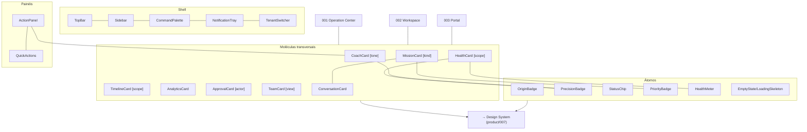

# Blueprints/004 — Component Catalog

```
─────────────────────────────────────────────
Status:                  Draft
Owner:                   Product / UX / Frontend
Documento relacionado:   blueprints/000-blueprint-guide.md
Capability:              transversal (materializa componentes de 001/002/003)
Experiência relacionada: product/001-design-principles.md
Prioridade:              Alta
Complexidade:            Média
Última revisão:          2026-07-14
Versão:                  v1.0
─────────────────────────────────────────────
```

> **Catálogo de Componentes — referência transversal.** Consolida, num único lugar, os componentes que se repetem nos Blueprints de tela ([001 Operation Center](./001-operation-center-blueprint.md), [002 Product Workspace](./002-product-workspace-blueprint.md), [003 Client Portal](./003-client-portal-blueprint.md)). Segue o **espírito e o padrão de componente** da [Constituição dos Blueprints (000)](./000-blueprint-guide.md) — não descreve uma tela, e sim **contratos de componente** reutilizáveis.

> [!important] O que este documento é (e não é)
> - **É** a Fonte da Verdade de **quais componentes existem, o que fazem, seus estados canônicos e suas variações por contexto** — a ponte para o Design System (`product/007`).
> - **Não é** um Blueprint de tela (não tem wireframe único/anatomia de uma tela) — é uma referência que os Blueprints de tela **consomem**.
> - **Não é** Design System — não define cor, tipografia, tokens, medidas, nem código. Isso é `product/007` + Engenharia.
> - **Não inventa componentes** — apenas consolida os já nomeados em 001/002/003.

> **Convenções:** componentes `PascalCase`; estados `MAIÚSCULAS`; eventos de domínio `dot.case`; eventos de interface `ui.*`. Cada componente segue os **8 atributos** de [000 §7](./000-blueprint-guide.md).

---

## 1. Objetivo

Dar a Design e Engenharia **um contrato único por componente**, de modo que o **mesmo componente pareça e se comporte igual em toda a Zion** — no cockpit, no workspace e no portal. Isso concretiza dois princípios já oficiais:
- **Consistência** ([001 Design Principles §10](../001-design-principles.md)) — Health/Missões/Timeline iguais em todo lugar.
- **Uma casa, muitas visões** ([002 Information Architecture](../002-information-architecture.md)) — o mesmo dado, o mesmo componente, escopos diferentes.

Sem este catálogo, cada Blueprint reinventaria variações do "mesmo" card — e a plataforma perderia a unidade.

---

## 2. Escopo e Método

O catálogo consolida os componentes de **001/002/003** em três decisões:

1. **Um contrato por componente** (8 atributos) — mesmo que apareça em telas diferentes.
2. **Variações por contexto** declaradas via **`variant`** (ex.: `CoachCard[tone=business]`) — nunca componentes duplicados.
3. **Estados canônicos compartilhados** ([§4](#4-estados-canônicos)) — o vocabulário de estados é o mesmo em todos.

> [!note] Regra de variação
> Quando dois Blueprints usam "o mesmo" componente com pequenas diferenças, é **uma variação (`variant`/`scope`/`tone`)**, não um componente novo. Um componente novo só se justifica quando **responsabilidade e origem de dados** diferem de fato.

---

## 3. Taxonomia

| Camada | O que é | Componentes |
|--------|---------|-------------|
| **Interaction Controls** | componentes **universais** que capturam a **intenção humana**. Sem domínio, sem origem de dados. Contratos em **[§14](#14-catálogo--interaction-controls)**. | `Button`, `IconButton`, `Input`, `TextArea`, `Select`, `Checkbox`, `Switch` |
| **Átomos** (Semantic Atoms) | componentes mínimos que **apresentam significado do domínio Zion** | `OriginBadge`, `PrecisionBadge`, `StatusChip`, `PriorityBadge`, `HealthMeter`, `EmptyState`, `LoadingSkeleton` |
| **Moléculas (Cards)** | cards com propósito e origem de dados | `CoachCard`, `HealthCard`, `MissionCard`, `TimelineCard`, `AnalyticsCard`, `ApprovalCard`, `TeamCard`, `ResultCard`, `OpportunityCard`, `ConversationCard`, `VersionCard`, `CommercialCard`, `ERPCard`, `MarketplaceCard`, `ContentCard`, `MediaCard`, `SEOCard`, `VariantsCard`, `IdentityCard`, `CompanyOverviewCard` |
| **Organismos / Painéis** | composições e áreas persistentes | `ActionPanel`, `QuickActions`, `WorkspaceHeader` |
| **Shell** | moldura global da aplicação | `TopBar`, `Sidebar`, `TenantSwitcher`, `CommandPalette`, `NotificationTray` |

**Hierarquia oficial** — do mais primitivo ao mais composto:

```
Interaction Controls   →   Semantic Atoms   →   Molecules   →   Organisms   →   Shell
   capturam intenção        apresentam           compõem        persistem      emolduram
                            significado
```

Este catálogo detalha os **transversais** (usados em ≥2 Blueprints). Os **específicos de uma tela** (ex.: `ERPCard`, `VariantsCard`, `CompanyOverviewCard`) permanecem especificados no seu Blueprint de origem e são apenas **listados** aqui na matriz ([§9](#9-matriz-componente--blueprint)).

### 3.1 Definições Oficiais

> **Átomos (Semantic Atoms)**
> *"Átomos são componentes mínimos responsáveis por apresentar significado do domínio Zion. Eles nunca capturam intenção do usuário. Eles apenas apresentam informações produzidas pela plataforma."*

> **Interaction Controls**
> *"Interaction Controls são componentes universais responsáveis por capturar intenção humana. Nunca carregam significado de domínio. Nunca produzem informação da plataforma. São reutilizáveis por qualquer produto. Apenas transformam intenção do usuário em interação."*

> [!important] Princípio permanente do Component Catalog
> **Interaction Controls representam a parte universal da plataforma.**
> **Semantic Atoms representam a identidade da Zion.**
> **Os primeiros capturam intenção.**
> **Os segundos apresentam significado.**
>
> Esta é a fronteira mais importante do catálogo: ela torna visível, na própria árvore de componentes, a linha que governa toda a arquitetura — **a plataforma apresenta a verdade; o humano decide** ([L06](../system/002-product-laws.md) · [L07](../system/002-product-laws.md) · [L16](../system/002-product-laws.md)).

### 3.2 Como classificar um novo componente

**Teste obrigatório antes da criação de qualquer novo componente.**

```
                    ┌─────────────────────────────────────────┐
                    │  1. O componente captura intenção       │
                    │     humana?                             │
                    └─────────────────────────────────────────┘
                            │                     │
                          SIM                    NÃO
                            │                     │
                            ▼                     ▼
                 ┌──────────────────┐   ┌─────────────────────────────────┐
                 │ INTERACTION      │   │ 2. O componente apresenta uma   │
                 │ CONTROL          │   │    verdade produzida pela       │
                 └──────────────────┘   │    plataforma?                  │
                                        └─────────────────────────────────┘
                                                │                 │
                                              SIM                NÃO
                                                │                 │
                                                ▼                 ▼
                                     ┌──────────────────┐  ┌──────────────────────┐
                                     │ SEMANTIC ATOM    │  │ O componente         │
                                     └──────────────────┘  │ PROVAVELMENTE NÃO    │
                                                           │ DEVE EXISTIR         │
                                                           └──────────────────────┘
```

| Passo | Pergunta | Resposta | Classificação |
|:--:|---|:--:|---|
| **1** | O componente **captura intenção humana**? | **SIM** | → **Interaction Control** |
| | | NÃO | → siga para o passo 2 |
| **2** | O componente **apresenta uma verdade produzida pela plataforma**? | **SIM** | → **Semantic Atom** |
| | | NÃO | → **o componente provavelmente não deve existir** |

**Teste auxiliar (objetivo):** um componente que declara **"Origem dos dados"** apontando para uma Capability é **semântico**. Um que declara `—` e captura intenção é **Interaction Control**. Se não declara origem **e** não captura intenção, ele não tem responsabilidade — e cai no terceiro ramo.

> [!important] Criar é sempre a última opção
> O terceiro ramo do teste não é um acidente: é a defesa contra a **inflação da biblioteca**. Herda a [Architecture Methodology (meta/000 §8)](../../meta/000-architecture-methodology.md) — *"criar é sempre a última opção; expandir e reusar vêm primeiro"* — e a Lei [L3](../system/002-product-laws.md) (*"nenhum componente novo sem necessidade"*). Antes de criar, verifique se **é variação de um existente** ([§2](#2-escopo-e-método), [§10](#10-reconciliação-de-nomenclatura)).

---

## 4. Estados Canônicos

Vocabulário **único** de estados (todo componente considera os aplicáveis — [000 §8](./000-blueprint-guide.md)):

| Estado | Significado | Regra |
|--------|-------------|-------|
| `LOADING` | dados carregando | `LoadingSkeleton` por card; nunca tela branca. |
| `EMPTY` | sem dados | comunica próximo passo/calma; nunca tela morta. |
| `ERROR` | falha | explica, não culpa, re-tenta ([001](../001-design-principles.md)). |
| `DEFAULT` | nominal/saudável | — |
| `CRITICAL` | exige atenção urgente | destaque; nunca mais de 1 prioridade máxima por tela. |
| `DISABLED` | ação indisponível | sempre com **motivo visível**. |
| `PERMISSION_DENIED` | papel/tenant sem acesso | **não busca nem revela** dado; oferece retorno ([RLS 010](../../architecture/010-database-compliance.md)). |

Estados específicos (ex.: `PENDING`, `DIFF`, `PUBLISHING`, `DISMISSED`, `NONE`) são declarados no componente e **não** substituem os canônicos.

---

## 5. Catálogo — Átomos

### `OriginBadge` **(obrigatório onde há dado de origem)**
- **Objetivo:** declarar a **fonte** de um dado (proveniência).
- **Responsabilidade:** exibir a origem; nunca alterar o dado.
- **Origem dos dados:** o metadado de origem do valor (ERP/IA/Estimativa/Operador/Template/Integração/Política — [013a §Origem da Informação](../../architecture/013a-architecture-review-epic2.md)).
- **Estados:** `DEFAULT`.
- **Eventos:** —.
- **Ações:** (opcional) tooltip "de onde vem".
- **Dependências:** —.
- **Variantes:** `tone=technical` (cockpit/workspace: "ERP", "IA") · `tone=business` (portal: "do seu ERP", "informado por você", "estimado").

### `PrecisionBadge` **(obrigatório onde há número derivado)**
- **Objetivo:** declarar a **confiança** de um número calculado.
- **Responsabilidade:** exibir precisão (alta/média/baixa); nunca maquiar.
- **Origem dos dados:** precisão do Cost Engine ([013](../../architecture/013-cost-engine.md)) / consolidada em Maturity ([014](../../architecture/014-operational-maturity-engine.md)).
- **Estados:** `HIGH`, `MEDIUM`, `LOW`.
- **Eventos:** consome `cost.precision_changed`.
- **Ações:** tooltip "por que esta confiança".
- **Variantes:** `tone=technical` (alta/média/baixa) · `tone=business` (confirmado/estimado).

### `StatusChip`
- **Objetivo:** estado de um produto/canal/item.
- **Responsabilidade:** traduzir um estado em rótulo+cor+ícone (nunca cor sozinha — [001 Acessibilidade](../001-design-principles.md)).
- **Origem dos dados:** o estado do objeto (produto/listing/missão).
- **Estados (por valor):** ex. `DRAFT`, `PUBLISHED`, `ERROR`, `PAUSED`, `NOT_PUBLISHED`, `BLOCKED`.
- **Eventos:** —.
- **Variantes:** `context=product|channel|mission`.

### `PriorityBadge`
- **Objetivo:** prioridade de uma Missão/alerta.
- **Responsabilidade:** exibir 🔴 Alta / 🟠 Média / 🟡 Baixa (texto+ícone).
- **Origem dos dados:** prioridade calculada (impacto×urgência×esforço — [015](../../architecture/015-operation-center.md)/[014](../../architecture/014-operational-maturity-engine.md)).
- **Estados:** `HIGH`, `MEDIUM`, `LOW`.
- **Eventos:** —.

### `HealthMeter`
- **Objetivo:** representação 0–100 de uma dimensão de saúde.
- **Responsabilidade:** exibir valor + faixa (🟢🟡🔴) + delta; **não calcula**.
- **Origem dos dados:** Operational Maturity ([014](../../architecture/014-operational-maturity-engine.md)).
- **Estados:** `HEALTHY`, `ATTENTION`, `CRITICAL`, `EMPTY`.
- **Eventos:** consome `maturity.health_changed`.
- **Dependências:** usado por `HealthCard`.

### `EmptyState` / `LoadingSkeleton`
- **Objetivo:** materializar os estados `EMPTY` e `LOADING` de forma consistente.
- **Responsabilidade:** `EmptyState` comunica próximo passo/calma; `LoadingSkeleton` sinaliza carregamento por card.
- **Origem dos dados:** —.
- **Estados:** próprio.
- **Ações:** `EmptyState` pode oferecer a ação inicial (ex.: "importar catálogo").

---

## 6. Catálogo — Moléculas transversais

### `CoachCard` — a IA na interface
- **Objetivo:** trazer a recomendação contextual da IA, acionável.
- **Responsabilidade:** sugerir/explicar; **nunca chatbot**, **nunca cobre o trabalho**, sempre opcional.
- **Origem dos dados:** ZIOS ([017](../../architecture/017-zion-intelligence-operating-system.md)).
- **Estados:** `VISIBLE`, `DISMISSED`, `NONE` (colapsa), `APPLYING`.
- **Eventos:** consome `ai.recommendation.created`; emite `ui.coach.apply|act|dismissed`.
- **Ações:** Aplicar/Ver o quê, Por quê, Dispensar.
- **Dependências:** `PrecisionBadge` (confiança), `ActionPanel`.
- **Variantes:**
  - `tone=technical` (001 cockpit / 002 workspace) — linguagem operacional.
  - `tone=business` (003 portal) — **linguagem de negócio, nunca técnica** (traduz o tecnês antes de exibir).
  - `placement=sidebar` (padrão) — nunca modal que interrompe.

### `HealthCard` — saúde acionável **(resolve HealthCard × BusinessHealthCard)**
- **Objetivo:** apresentar saúde por dimensão, clicável.
- **Responsabilidade:** exibir dimensões; **não calcula**; dimensão fraca → ação.
- **Origem dos dados:** Operational Maturity ([014](../../architecture/014-operational-maturity-engine.md)).
- **Estados:** `LOADING`, `DEFAULT`, `DIMENSION_CRITICAL`, `EMPTY`.
- **Eventos:** consome `maturity.health_changed`, `maturity.score_changed`.
- **Ações:** `AbrirDimensao` (→ Missão/Fila/seção).
- **Dependências:** `HealthMeter`, `PrecisionBadge`.
- **Variantes (`scope`):**
  - `scope=operation` (001) — Health da Operação.
  - `scope=product` (002) — Health do Produto.
  - `scope=business` (003, **antes `BusinessHealthCard`**) — Health do negócio, `tone=business`.
  - `scope=commercial` — recorte comercial.

> [!important] Reconciliação de nome
> **`BusinessHealthCard` (003) é `HealthCard[scope=business, tone=business]`.** Não é um componente separado — é uma variação. O Design System (007) implementa **um** `HealthCard` com variações.

### `MissionCard` — família de Missão **(resolve MissionCard × SharedMissionCard)**
- **Objetivo:** apresentar uma Missão e (quando aplicável) conduzir à ação.
- **Responsabilidade:** título, prioridade, tempo, "por quê", ação.
- **Origem dos dados:** Operation Center ([015](../../architecture/015-operation-center.md)).
- **Estados:** `DEFAULT`, `IN_PROGRESS`, `BLOCKED`, `DONE`, `EMPTY`; (compartilhada) `PENDING`, `SUBMITTED`, `OVERDUE`.
- **Eventos:** consome `maturity.mission_created`, `workflow.*`; emite `ui.mission.*`.
- **Ações:** Agir (operador) · Informar/Aprovar/Confirmar (cliente) · ver detalhe (leitura).
- **Dependências:** `PriorityBadge`, `ConversationCard`.
- **Variantes (`kind`):**
  - `kind=actionable` (001) — o operador executa.
  - `kind=informative` (003) — o cliente **vê** o trabalho da agência (não age).
  - `kind=shared` (003, **antes `SharedMissionCard`**) — **depende do cliente** (com `requestedBy`, `dueDate`, `impact`).

> [!important] Reconciliação de nome
> **`SharedMissionCard` (003) é `MissionCard[kind=shared]`.** Mesma família, escopo de ação diferente.

### `TimelineCard` — narrativa de eventos
- **Objetivo:** contar a história (recente ou de longo prazo) em linguagem humana.
- **Responsabilidade:** eventos narrados, com autor/versão quando aplicável; imutável.
- **Origem dos dados:** Event Bus ([004](../../architecture/004-event-bus.md)) / Analytics ([018](../../architecture/018-operational-analytics.md)).
- **Estados:** `LOADING`, `DEFAULT`, `EMPTY`.
- **Eventos:** consome eventos de domínio; emite `ui.timeline.openEvent`.
- **Ações:** ver tudo, abrir evento/versão.
- **Variantes (`scope`):** `operation` (001, recente) · `product` (002, vida do produto) · `business` (003, marcos, `tone=business`, sem tecnês).

### `AnalyticsCard` — conhecimento resumido
- **Objetivo:** sinalizar tendência/o que merece atenção — **nunca BI completo**.
- **Responsabilidade:** deltas com contexto; abrir o contexto Analytics.
- **Origem dos dados:** Operational Analytics ([018](../../architecture/018-operational-analytics.md)).
- **Estados:** `LOADING`, `DEFAULT`, `ATTENTION`, `EMPTY`.
- **Eventos:** consome `analytics.trend_detected`, `analytics.anomaly_detected`, `analytics.report_ready`.
- **Ações:** abrir Analytics/entender evolução.
- **Variantes:** `tone=technical` (001) · `tone=business` (003, narrativa de negócio).

### `ApprovalCard` — aprovar com histórico
- **Objetivo:** conduzir uma aprovação e registrar a decisão.
- **Responsabilidade:** apresentar o item, permitir Aprovar/Editar/Rejeitar; **histórico auditável**.
- **Origem dos dados:** Board/Intake ([006](../../architecture/006-capability-000-zion-intake.md)) — trava A10; ou item do cliente.
- **Estados:** `PENDING`, `APPROVED`, `EDIT_REQUESTED`, `REJECTED`, `NOT_APPLICABLE`.
- **Eventos:** emite `ui.approval.decide`.
- **Ações:** Aprovar, Pedir ajuste/Editar, Rejeitar.
- **Dependências:** `ConversationCard`.
- **Variantes:** `actor=team` (002, trava A10) · `actor=client` (003, aprovações do cliente).

### `TeamCard` — pessoas
- **Objetivo:** dar leitura da equipe.
- **Responsabilidade:** **transparência/equilíbrio, nunca vigilância**.
- **Origem dos dados:** Organização ([000](../../architecture/000-business-domain.md)).
- **Estados:** `LOADING`, `DEFAULT`, `OVERLOAD_ALERT` (gestor), `EMPTY`.
- **Eventos:** emite `ui.team.*`.
- **Ações:** ver membro, redistribuir/aliviar (gestor), conversar (cliente).
- **Variantes:** `view=manager` (001, carga/capacidade) · `view=client` (003, "quem cuida da minha conta").

### `ResultCard` / `OpportunityCard` / `ConversationCard` / `VersionCard`
- **`ResultCard`** (003) — resultado como **narrativa** de negócio; origem Analytics ([018](../../architecture/018-operational-analytics.md)); estados `LOADING/DEFAULT/EMPTY`.
- **`OpportunityCard`** (003) — oportunidade de crescimento; origem Commercial ([012](../../architecture/012-commercial-intelligence-engine.md))/Analytics; `PrecisionBadge` obrigatório.
- **`ConversationCard`** (003) — conversa **sempre com `contextRef`** (produto/missão/campanha/marketplace/workflow); **nunca chat genérico**; histórico preservado; estados `LOADING/DEFAULT/EMPTY/SENDING/PERMISSION_DENIED`.
- **`VersionCard`** (002) — diff de versões + revert (reversível declarado); origem Versionamento ([001](../../architecture/001-product-master.md)).

---

## 7. Catálogo — Organismos / Painéis

### `ActionPanel`
- **Objetivo:** painel lateral persistente (Coach + ações).
- **Responsabilidade:** hospedar `CoachCard` + `QuickActions`; nunca cobrir o conteúdo principal.
- **Origem dos dados:** composição.
- **Estados:** `DEFAULT`, `COLLAPSED`.
- **Usado em:** 002, 003 (e recomendável no 001 como coluna direita).

### `QuickActions`
- **Objetivo:** atalhos contextuais.
- **Responsabilidade:** expor as ações mais frequentes do contexto; `DISABLED` com motivo.
- **Origem dos dados:** o contexto (produto/empresa).
- **Estados:** `DEFAULT`, `DISABLED`.
- **Variantes:** por contexto (workspace: Publicar/Sincronizar/Abrir Missão; portal: Aprovações/Pendências/Conversas/Resultados).

### `WorkspaceHeader`
- **Objetivo:** cabeçalho de contexto de um objeto (produto).
- **Responsabilidade:** identidade + situação + ações principais.
- **Origem dos dados:** o objeto + Health.
- **Estados:** `LOADING`, `DEFAULT`, `CRITICAL`, `BLOCKED`, `ARCHIVED`.
- **Nota:** específico do Workspace (002); listado aqui por ser um organismo de referência (um "ObjectHeader" genérico pode emergir no 007).

---

## 8. Catálogo — Shell

| Componente | Objetivo | Origem | Estados | Blueprints |
|-----------|----------|--------|---------|-----------|
| `TopBar` | contexto transversal (tenant, busca, IA, perfil) | Organização ([000](../../architecture/000-business-domain.md)) | `DEFAULT` | 001/002/003 |
| `Sidebar` | navegação entre destinos globais (nunca menu por Capability) | Navegação ([003](../003-navigation.md)) | `DEFAULT`, `COLLAPSED` | 001/002 |
| `TenantSwitcher` | trocar cliente (só Equipe) | Organização + [RLS 010](../../architecture/010-database-compliance.md) | `DEFAULT`, `SWITCHING` | 001/002 |
| `CommandPalette` | busca universal (⌘K) | índice por tenant | `CLOSED`, `OPEN`, `RESULTS`, `EMPTY` | 001/002/003 |
| `NotificationTray` | o que mudou / talvez exija você | Event Bus ([004](../../architecture/004-event-bus.md)) | `DEFAULT`, `EMPTY` | 001/002/003 |

Princípio de shell: **poucos destinos, muita busca** ([003](../003-navigation.md)); a IA nunca é um item de menu.

---

## 9. Matriz Componente × Blueprint

| Componente | 001 Operation Center | 002 Workspace | 003 Portal |
|-----------|:---:|:---:|:---:|
| `CoachCard` | ✅ técnico | ✅ técnico | ✅ negócio |
| `HealthCard` | ✅ operation | ✅ product | ✅ business |
| `MissionCard` | ✅ actionable | — | ✅ informative + shared |
| `TimelineCard` | ✅ operation | ✅ product | ✅ business |
| `AnalyticsCard` | ✅ | — | ✅ negócio |
| `ApprovalCard` | — | ✅ (A10) | ✅ (cliente) |
| `TeamCard` | ✅ (gestor) | — | ✅ (cliente) |
| `ActionPanel` / `QuickActions` | ◻ recomendado | ✅ | ✅ |
| `OriginBadge` / `PrecisionBadge` | ✅ | ✅ | ✅ |
| `StatusChip` / `PriorityBadge` / `HealthMeter` | ✅ | ✅ | ✅ |
| `CommandPalette` / `TopBar` / `NotificationTray` | ✅ | ✅ | ✅ |
| `Sidebar` / `TenantSwitcher` | ✅ | ✅ | — (cliente) |
| `QueueCard` | ✅ | — | — |
| **Interaction Controls** ([§14](#14-catálogo--interaction-controls)) | | | |
| `Button` / `IconButton` | ✅ | ✅ | ✅ |
| `Input` / `Select` | ✅ (⌘K, filtros) | ✅ (edição) | ◻ conforme tela |
| `TextArea` | — | ✅ (descrição) | ✅ (conversas) |
| `Checkbox` | ✅ (lote) | ◻ | — |
| `Switch` | ◻ (config) | ◻ (políticas) | — |
| Específicos de tela | `TeamPanel` | `ERPCard`, `CommercialCard`, `MarketplaceCard`, `ContentCard`, `MediaCard`, `SEOCard`, `VariantsCard`, `VersionCard`, `IdentityCard`, `WorkspaceHeader` | `CompanyOverviewCard`, `SharedMissionCard`→`MissionCard[kind=shared]`, `ResultCard`, `OpportunityCard`, `ConversationCard` |

---

## 10. Reconciliação de Nomenclatura

Decisões oficiais (para o Design System não duplicar):

| Nos Blueprints | Componente canônico | Como |
|----------------|---------------------|------|
| `BusinessHealthCard` (003) | **`HealthCard`** | `scope=business, tone=business` |
| `SharedMissionCard` (003) | **`MissionCard`** | `kind=shared` |
| `MissionCard` informativa (003) | **`MissionCard`** | `kind=informative` |
| `TeamPanel` (001) / `TeamCard` (003) | **`TeamCard`** | `view=manager` / `view=client` |
| `CoachCard` técnico × de negócio | **`CoachCard`** | `tone=technical|business` |

> [!important] Um componente, variações declaradas
> O Design System (007) implementa **um** componente por linha acima, com as variações via prop. Nunca dois componentes para a mesma responsabilidade.

---

## 11. Preparação para o Design System (007)

O que este catálogo **entrega** ao 007 e o que **deixa** para ele.

**Entrega (definido aqui):**
- A **lista canônica** de componentes (átomos/moléculas/organismos/shell).
- Por componente: **responsabilidade, origem de dados, estados canônicos, variações (`variant`/`scope`/`tone`/`kind`), eventos, ações, dependências**.
- As **reconciliações de nome** ([§10](#10-reconciliação-de-nomenclatura)).
- **Props conceituais** (não-tipadas) por componente — ex.: `HealthCard{ scope, dimensions[], overall, tone }`; `MissionCard{ kind, priority, title, reason, estimatedTime, requestedBy?, dueDate? }`; `CoachCard{ tone, recommendation?, confidence, actions[] }`; `Badge{ kind: origin|precision, value, tone }`.

**Deixa para o 007 + Engenharia (fora daqui):**
- Tokens (cor, tipografia, espaçamento, elevação, raios).
- Anatomia visual/px, responsividade fina, animação.
- Implementação (React/props tipadas, hooks, composição de código).
- Acessibilidade concreta (contraste medido, foco, ARIA) — os **princípios** já vêm de [001](../001-design-principles.md).

---

## 12. Checklist para Desenvolvimento

```
□ Cada componente transversal tem um contrato único (8 atributos)?
□ Variações declaradas por prop (variant/scope/tone/kind), nunca componentes duplicados?
□ Estados canônicos (§4) considerados em cada componente?
□ HealthCard unifica operation/product/business/commercial (sem BusinessHealthCard separado)?
□ MissionCard cobre actionable/informative/shared (sem SharedMissionCard separado)?
□ CoachCard tem tone=technical|business; negócio nunca mostra tecnês?
□ OriginBadge/PrecisionBadge obrigatórios onde há origem/número derivado?
□ ConversationCard sempre com contextRef (nunca chat genérico)?
□ ApprovalCard registra histórico (actor=team|client)?
□ TeamCard nunca é vigilância (view=manager|client)?
□ Shell: poucos destinos, CommandPalette presente, IA nunca é menu?
□ Matriz Componente × Blueprint (§9) bate com 001/002/003?
□ Nada de token/cor/px definido aqui (é do 007)?
```

---

## 13. Critérios de Aceite

- [ ] **Contrato único por componente transversal**, com os 8 atributos.
- [ ] **Variações por prop** — nenhum componente duplicado para a mesma responsabilidade.
- [ ] **Estados canônicos** aplicados de forma consistente.
- [ ] **Reconciliações resolvidas:** `HealthCard` (não `BusinessHealthCard`), `MissionCard[kind]` (não `SharedMissionCard`), `TeamCard[view]`, `CoachCard[tone]`.
- [ ] **Badges obrigatórios** (Origin/Precision) documentados onde aplicável.
- [ ] **Matriz Componente × Blueprint** consistente com 001/002/003.
- [ ] **Fronteira com o Design System** clara (nada de tokens/cor/px/código aqui).
- [ ] **Rastreável:** cada componente aponta origem de dados (Capability) e Blueprints de uso.
- [ ] **Sem novos conceitos:** apenas consolidação do que já existe nos Blueprints.

---

## 14. Catálogo — Interaction Controls

> **A camada mais primitiva** ([§3](#3-taxonomia)). Componentes **universais**: capturam intenção humana, **nunca** carregam domínio, **nunca** declaram Origem dos dados. Consomem exclusivamente `interaction.*`, `state.*`, `border.focus`, `radius.sm`, `text.on-accent` e `type.label` ([system/004](../system/004-design-tokens.md)) — **jamais** `health.*`, `priority.*`, `origin.*`, `precision.*` ou `feedback.*`.

> [!note] Por que esta seção é a §14 e não a §5
> A hierarquia coloca Interaction Controls **antes** dos Átomos ([§3](#3-taxonomia)) — mas as seções §4–§13 são **citadas por número em outros documentos** (`system/001` → *004 §9/§10*; `system/004`, estabilizado → *Catalog §4/§5*). Renumerar tornaria esses textos factualmente errados e exigiria editar documentos fora do escopo desta evolução. **A ordem física do arquivo não é a hierarquia; a hierarquia está declarada na [§3](#3-taxonomia).**

### 14.1 `Button`
- **Objetivo:** capturar a decisão do usuário de executar uma ação.
- **Responsabilidade:** apresentar uma ação disponível e transformar o clique em intenção. **Nunca** decide o que a ação faz.
- **Comportamento:** ao ser acionado, emite a intenção ao componente hospedeiro e devolve feedback imediato ([L14](../system/002-product-laws.md)). Ação irreversível **declara-se** antes de confirmar. Enquanto processa, assume `LOADING` e bloqueia reentrada.
- **Estados:** `DEFAULT`, `HOVER`, `FOCUS`, `PRESSED`, `LOADING`, `DISABLED` (**sempre com motivo visível** — [§4](#4-estados-canônicos)).
- **Variantes:** `variant = primary | secondary | ghost | link`
  - `primary` — a **única** ação principal do contexto (no máximo uma por card).
  - `secondary` — ações de apoio.
  - `ghost` — ações discretas que não competem (ex.: "Dispensar" do `CoachCard`).
  - `link` — navegação para contexto (ex.: "ver tudo" do `TimelineCard`).
- **Eventos:** emite a intenção do hospedeiro (`ui.*`). **Não** consome eventos de domínio.
- **Acessibilidade:** foco de teclado obrigatório com anel visível (`state.focus.ring`, `a11y.focus.ring` 2+2); alvo ≥ **44×44** (`a11y.target.min`); acionável por `Enter`/`Space`; `DISABLED` comunica o motivo por texto, nunca só por opacidade; rótulo é verbo de ação, nunca "OK"/"Clique aqui".
- **Dependências:** nenhuma. *(Pode hospedar um ícone — quando o ícone é o único conteúdo, use `IconButton`.)*
- **O que nunca faz:** nunca calcula · nunca decide regra de negócio · nunca carrega token de domínio · nunca nomeia domínio (`ApproveButton` é proibido: é `Button[primary]` **dentro** do `ApprovalCard`) · nunca esconde ação em menu secundário · nunca executa irreversível sem declarar.
- **Exemplos de uso:** `MissionCard` "Agir" (`primary`) · `CoachCard` "Ver Missão" (`secondary`) + "Dispensar" (`ghost`) · `EmptyState[not-started]` "Importar catálogo" (`primary`) · `ApprovalCard` Aprovar/Editar/Rejeitar · `TimelineCard` "ver tudo" (`link`).
- **Exemplos incorretos:** dois `primary` no mesmo card (viola "uma prioridade máxima") · `DISABLED` sem motivo · botão que apaga em massa sem aviso ([L14](../system/002-product-laws.md)) · rótulo "OK" · botão colorido por `health.critical`.

### 14.2 `IconButton`
- **Objetivo:** capturar uma ação cujo significado é **inequívoco por ícone**, onde não cabe rótulo.
- **Responsabilidade:** oferecer ação compacta em áreas de alta densidade (Shell). **Nunca** substitui `Button` por economia de espaço em conteúdo.
- **Comportamento:** idêntico ao `Button`; o rótulo textual migra para `aria-label` + tooltip.
- **Estados:** `DEFAULT`, `HOVER`, `FOCUS`, `PRESSED`, `LOADING`, `DISABLED` (com motivo).
- **Variantes:** nenhuma. *(Se precisar de ênfase, o caso é `Button`.)*
- **Eventos:** emite a intenção do hospedeiro (`ui.*`).
- **Acessibilidade:** **`aria-label` obrigatório** — sem ele o botão é mudo para leitor de tela; tooltip no hover/focus; alvo ≥ 44×44 mesmo com ícone de 16–20; foco visível.
- **Dependências:** o conjunto oficial de ícones ([system/004 §11](../system/004-design-tokens.md)).
- **O que nunca faz:** nunca existe sem `aria-label` · nunca usa ícone ambíguo · nunca carrega domínio · nunca é a ação principal de um card (essa é `Button[primary]`, com rótulo).
- **Exemplos de uso:** `TopBar` (notificações, IA, perfil) · `NotificationTray` (fechar) · `ActionPanel` (colapsar) · `Sidebar` (recolher).
- **Exemplos incorretos:** ícone sem rótulo acessível · "Agir" reduzido a um ícone · alvo de 20×20.

### 14.3 `Input`
- **Objetivo:** capturar um valor curto digitado pelo usuário.
- **Responsabilidade:** receber texto e devolvê-lo ao hospedeiro. **Nunca** valida regra de negócio (isso é do Capability); pode sinalizar formato inválido.
- **Comportamento:** aceita entrada, sinaliza `ERROR` com mensagem que **explica e não culpa** ([L14](../system/002-product-laws.md)); o hospedeiro decide quando persistir (gerando Versão/evento — [L10](../system/002-product-laws.md)).
- **Estados:** `DEFAULT`, `FOCUS`, `FILLED`, `ERROR`, `DISABLED` (com motivo), `READ_ONLY`.
- **Variantes:** nenhuma. *(Um campo de valor monetário/numérico é o mesmo `Input`; formatação é do hospedeiro.)*
- **Eventos:** emite mudança de valor ao hospedeiro. **Não** consome eventos de domínio.
- **Acessibilidade:** **rótulo persistente** (nunca só *placeholder*); erro associado por `aria-describedby` e anunciado; foco visível; `READ_ONLY` distinto de `DISABLED`.
- **Dependências:** nenhuma.
- **O que nunca faz:** nunca **inventa valor** ([L05](../system/002-product-laws.md) — ausência é pendência, jamais preenchimento automático silencioso) · nunca calcula ([L06](../system/002-product-laws.md)) · nunca usa placeholder como rótulo · nunca exibe origem/precisão (isso é `OriginBadge`/`PrecisionBadge` **ao lado**).
- **Exemplos de uso:** `CommandPalette` (⌘K) · `ContentCard[EDITING]` (título) · `CommercialCard` (preço).
- **Exemplos incorretos:** placeholder "Preço" sem rótulo · preencher um EAN plausível para "completar" · o campo calcular a margem.

### 14.4 `TextArea`
- **Objetivo:** capturar um texto longo, de múltiplas linhas.
- **Responsabilidade:** receber conteúdo extenso com espaço de leitura adequado.
- **Comportamento:** cresce com o conteúdo até um teto; preserva quebras; o hospedeiro decide a persistência.
- **Estados:** `DEFAULT`, `FOCUS`, `FILLED`, `ERROR`, `DISABLED` (com motivo), `READ_ONLY`.
- **Variantes:** nenhuma.
- **Eventos:** emite mudança de valor ao hospedeiro.
- **Acessibilidade:** rótulo persistente; medida de linha confortável ([system/004 §6](../system/004-design-tokens.md)); contador de limite anunciado quando existir; foco visível.
- **Dependências:** nenhuma.
- **O que nunca faz:** nunca gera conteúdo sozinho (sugestão de IA chega **pelo hospedeiro**, revisável — [L07](../system/002-product-laws.md)) · nunca aplica sugestão sem confirmação humana · nunca carrega domínio.
- **Exemplos de uso:** `ContentCard` (descrição do produto) · `ConversationCard` (mensagem).
- **Exemplos incorretos:** a IA sobrescrever a descrição sem revisão · caixa de 2 linhas para uma descrição longa.

### 14.5 `Select`
- **Objetivo:** capturar **uma escolha** dentro de um conjunto conhecido e fechado.
- **Responsabilidade:** apresentar opções válidas e devolver a escolhida.
- **Comportamento:** abre a lista, permite escolha, fecha. Conjunto vazio comunica o porquê (nunca lista morta).
- **Estados:** `DEFAULT`, `FOCUS`, `OPEN`, `SELECTED`, `EMPTY`, `ERROR`, `DISABLED` (com motivo).
- **Variantes:** nenhuma. *(Busca dentro da lista é comportamento, não variante.)*
- **Eventos:** emite a escolha ao hospedeiro.
- **Acessibilidade:** navegável por teclado (setas, `Enter`, `Esc`); estado expandido anunciado (`aria-expanded`); rótulo persistente; opção selecionada anunciada.
- **Dependências:** nenhuma.
- **O que nunca faz:** nunca inventa opções · nunca esconde o total quando trunca · nunca substitui navegação (destino é `Button[link]`) · nunca carrega domínio.
- **Exemplos de uso:** `CommercialCard` (política de preço) · `VariantsCard` (atributo) · filtros de lista.
- **Exemplos incorretos:** `Select` com 2 opções booleanas (é `Switch`) · lista truncada em silêncio.

### 14.6 `Checkbox`
- **Objetivo:** capturar **seleção múltipla** ou um consentimento binário explícito.
- **Responsabilidade:** marcar/desmarcar itens; sustentar a **ação em lote**.
- **Comportamento:** alterna marcado/desmarcado; suporta `INDETERMINATE` para seleção parcial de um grupo. **A ação só ocorre no `Button` que a confirma** — marcar nunca executa.
- **Estados:** `DEFAULT`, `CHECKED`, `INDETERMINATE`, `FOCUS`, `DISABLED` (com motivo), `ERROR`.
- **Variantes:** nenhuma.
- **Eventos:** emite a mudança de seleção ao hospedeiro.
- **Acessibilidade:** rótulo clicável associado; `Space` alterna; estado anunciado; `INDETERMINATE` com semântica `aria-checked="mixed"`; alvo ≥ 44×44.
- **Dependências:** nenhuma.
- **O que nunca faz:** **nunca executa ao marcar** (marcar ≠ agir — [L14](../system/002-product-laws.md)) · nunca contorna trava de qualidade (a A10 é do [Workflow (019)](../../architecture/019-workflow-engine.md)) · nunca vem pré-marcado em ação irreversível · nunca carrega domínio.
- **Exemplos de uso:** `QueueCard` — selecionar 42 produtos para "Aprovar em lote".
- **Exemplos incorretos:** marcar dispara a publicação · "selecionar todos" pré-marcado numa rejeição em massa.

### 14.7 `Switch`
- **Objetivo:** capturar a decisão de **ligar ou desligar** um comportamento contínuo.
- **Responsabilidade:** expressar um estado binário **que vale a partir de agora**.
- **Comportamento:** alterna e **aplica imediatamente** (difere do `Checkbox`, que aguarda confirmação). Efeito relevante é confirmado; reversão sempre disponível ([L16](../system/002-product-laws.md)).
- **Estados:** `ON`, `OFF`, `FOCUS`, `DISABLED` (com motivo), `PENDING` (aplicando).
- **Variantes:** nenhuma. *(Ver [§14.8](#148-controles-oficialmente-rejeitados) sobre `Toggle`.)*
- **Eventos:** emite a mudança ao hospedeiro, que a converte em política/autonomia.
- **Acessibilidade:** `role="switch"` com `aria-checked`; rótulo diz o **comportamento**, não o estado ("Publicação automática", não "Ligado"); estado nunca depende só de cor ([L02](../system/002-product-laws.md)); alvo ≥ 44×44.
- **Dependências:** nenhuma.
- **O que nunca faz:** nunca liga automação sem política ([L11](../system/002-product-laws.md)) · nunca é irreversível · nunca eleva autonomia de IA sem confirmação explícita ([L07](../system/002-product-laws.md)/[L16](../system/002-product-laws.md)) · nunca carrega domínio.
- **Exemplos de uso:** Configurações (política de preço) · autonomia da IA N0–N4 ([ZIOS 017](../../architecture/017-zion-intelligence-operating-system.md)) · regras do [Workflow (019)](../../architecture/019-workflow-engine.md).
- **Exemplos incorretos:** ligar automação de preço sem regra de margem · switch sem rótulo do comportamento · elevar a IA a N4 sem confirmar.

### 14.8 Controles oficialmente **rejeitados**

Registro permanente. Rejeição é decisão de arquitetura — reabrir exige processo, não preferência.

| Controle | Veredito | Motivação arquitetural |
|---|:--:|---|
| **`SplitButton`** | ❌ **rejeitado** | **Zero evidência** em Product/Blueprints. Esconde ações num menu secundário: colide com [L14](../system/002-product-laws.md) (*"toda ação tem consequência conhecida"*) e com *"uma decisão por vez"* ([DS 003 §7](../system/003-design-system.md)). É um padrão de **densidade**; a Zion otimiza para **clareza**. |
| **`Radio`** | ❌ **rejeitado** | Zero evidência. `Select` já cobre escolha única dentro de conjunto fechado. Criá-lo seria inflar a biblioteca por simetria — não por necessidade ([L3](../system/002-product-laws.md)). |
| **`Toggle`** | ❌ **rejeitado como componente** | Mesma responsabilidade de `Switch` (ligar/desligar) → seria **duplicata** (Anti-Lei [§10](#10-reconciliação-de-nomenclatura) · [L12](../system/002-product-laws.md)/[L20](../system/002-product-laws.md)). **Se um caso real aparecer, nasce como variante futura de `Switch`** (`Switch[variant=…]`), nunca como componente próprio. |
| **`GhostButton`** | ❌ **não é componente** | É **`Button[variant=ghost]`** ([§2](#2-escopo-e-método)). |
| **`LinkButton`** | ❌ **não é componente** | É **`Button[variant=link]`** ([§2](#2-escopo-e-método)). |

> [!note] O "toggle Minha visão / Equipe"
> O [Blueprint 001 §10](./001-operation-center-blueprint.md) menciona um *"toggle Minha visão / Equipe"*. Ele **não é booleano** — é um seletor de visão com dois rótulos. Resolve-se com **dois `Button[variant=secondary]`**. Um controle segmentado só se justificaria diante de um **segundo** caso real — *criar é a última opção*.

> [!important] Nenhum controle carrega domínio
> `ApproveButton`, `PublishButton`, `HealthSwitch` e afins são **proibidos**. Um botão que aprova é `Button[variant=primary]` **dentro** do `ApprovalCard`: o domínio vive no hospedeiro, o controle permanece universal. É o que mantém os Interaction Controls reutilizáveis por qualquer produto — e a identidade da Zion concentrada onde ela pertence.

---

## 15. Decisão Arquitetural — por que Interaction Controls nasceu

**Contexto.** Durante a construção da **Zion Design Library** (Sprint 2 — Atoms), ao concluir os 7 Átomos oficiais e preparar as Molecules, identificou-se que **`MissionCard` não podia ser construído**: sua ação "Agir" não tinha componente. A auditoria seguinte revelou que **nenhum controle de interação existia na documentação da Zion** — a palavra "Button" aparecia **zero vezes** em todo o corpo documental. As menções encontradas eram prosa (*"botão de agir"*), nome de evento (`cost.missing_input`) ou SQL (`select`).

**A lacuna.** Havia um vão estrutural **entre os Design Tokens e os Semantic Atoms**. A camada de tokens **já sabia** que controles existiam — `radius.sm` é descrito como *"inputs, botões pequenos · controles"*, `type.label` como *"rótulos, botões, badges"*, e existem `interaction.*`, `state.hover/pressed/focus/disabled`, `a11y.focus.ring` e `a11y.target.min` (44×44). O [system/004](../system/004-design-tokens.md) provisionava um andar que o Catálogo nunca construiu.

**Por que passou despercebido.** Os Blueprints foram escritos **de cima para baixo**, a partir do *significado* (Missão, Health, Precisão, Origem). A camada mais primitiva — a mecânica universal — foi assumida como óbvia e, por isso, nunca especificada. Some-se a isso que o [Workspace (005)](../005-product-workspace.md) **rejeita ativamente** a linguagem de formulário (*"nunca um formulário"*, *"nunca um CRUD"*) — rejeição correta da **moldura**, que acabou levando junto o vocabulário dos **controles**.

**A decisão.** Em vez de acrescentar componentes soltos aos Átomos — o que teria contaminado a categoria com peças sem domínio —, criou-se a categoria **Interaction Controls**, tornando explícita a fronteira que já governava a arquitetura sem ter expressão estrutural: **a plataforma apresenta a verdade; o humano decide**. A definição de Átomos foi corrigida no mesmo ato, porque dizia *"sem lógica de domínio"* enquanto **5 dos 7 declaravam Origem dos dados** apontando para uma Capability.

> [!important] A arquitetura evoluiu antes da implementação
> **Nenhum componente foi construído antes desta evolução.** A lacuna foi identificada na construção, mas **não foi remendada na construção**: parou-se a Sprint, analisou-se a taxonomia, evoluiu-se o Catálogo — e só então se autorizou a implementação. Improvisar um botão teria funcionado; teria também custado a fronteira que hoje separa a identidade da Zion daquilo que qualquer produto tem.
>
> Este registro existe para preservar o **raciocínio**, não apenas o resultado. Quem ler o catálogo daqui a dez anos precisa saber que a categoria não nasceu de gosto — nasceu de uma lacuna real, medida, entre os Tokens e os Átomos.

---

## Seção especial — Mapa de Componentes (visão única)



---

## Seção especial — Notas para Engenharia

1. **Um componente, variações por prop.** Nunca crie `BusinessHealthCard` ou `SharedMissionCard` como componentes separados — são `HealthCard[scope]`/`MissionCard[kind]`.
2. **`tone` decide a linguagem.** `tone=business` **traduz** qualquer tecnês antes de renderizar (Coach, badges, timeline no portal).
3. **Estados canônicos são compartilhados.** Reaproveite `LoadingSkeleton`/`EmptyState`/`ERROR` — não reinvente por card.
4. **Badges de proveniência/precisão são transversais e obrigatórios** onde há origem/número derivado — implemente uma vez, use em todo lugar.
5. **`ConversationCard` sempre recebe `contextRef`** — não existe chat global.
6. **`ApprovalCard` sempre grava histórico** (actor + decisão + timestamp), auditável.
7. **Nenhuma cor/px/token aqui.** Este catálogo é contrato de comportamento; a aparência é do Design System (007).
8. **A matriz (§9) é o mapa de reuso** — antes de criar um componente novo num Blueprint, verifique se é uma variação de um existente.

---

> **Registro oficial:** **O Catálogo de Componentes é a Fonte da Verdade dos contratos de componente da Zion — a ponte entre os Blueprints de tela e o Design System. Um componente, uma responsabilidade, variações declaradas.**

> **v1.1 — evolução arquitetural: Interaction Controls.** Aditiva. Introduz a categoria **Interaction Controls** ([§3](#3-taxonomia)) com 7 contratos completos ([§14](#14-catálogo--interaction-controls)), as **definições oficiais** de Semantic Atoms e Interaction Controls ([§3.1](#31-definições-oficiais)), o **teste obrigatório de classificação** ([§3.2](#32-como-classificar-um-novo-componente)), o registro dos **controles rejeitados** ([§14.8](#148-controles-oficialmente-rejeitados)) e a **Decisão Arquitetural** que preserva o raciocínio ([§15](#15-decisão-arquitetural--por-que-interaction-controls-nasceu)). **Nenhum contrato existente foi alterado; nenhum componente mudou de responsabilidade.** Única correção não-aditiva, aprovada: a definição de Átomos em [§3](#3-taxonomia) dizia *"sem lógica de domínio"* — falso, pois 5 dos 7 declaram Origem dos dados; passa a *"apresentam significado do domínio Zion"*.

> **Status:** `product/blueprints/004` — Component Catalog **v1.1**. Consolida os componentes de [001](./001-operation-center-blueprint.md)/[002](./002-product-workspace-blueprint.md)/[003](./003-client-portal-blueprint.md) sob a [Constituição (000)](./000-blueprint-guide.md), resolve as divergências de nomenclatura e prepara o terreno para o Design System. **Próximo documento sugerido:** `product/007-design-system.md` (o Design System da Zion — os **tokens** (cor, tipografia, espaçamento, elevação), a materialização visual dos componentes deste catálogo, o sistema de cores de Health/Precisão/Prioridade acessível (cor+texto+ícone), estados visuais canônicos e as regras que garantem que cockpit, workspace e portal pareçam — de fato — o mesmo produto; este Catálogo entrega o **o quê/comportamento**, e o `007` entrega o **como/aparência**).
