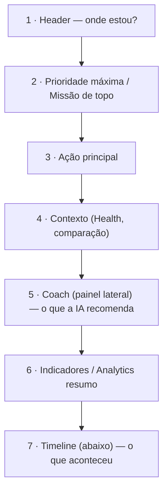
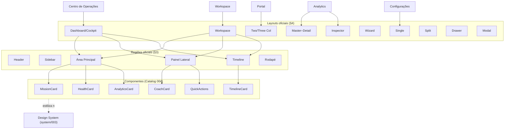

# System/001 — UI Composition System

> **Contrato oficial de composição da UI da Zion.** Define **como os componentes são organizados** nas telas — as regiões, os layouts, as regras de posicionamento e a hierarquia. **Não é um Design System:** não define aparência, cor, tipografia, tamanho nem código.

> [!important] Registro oficial — organiza × estiliza
> **O UI Composition System organiza. O Design System estiliza. Essas responsabilidades nunca devem ser misturadas.** Este documento garante que **toda tela da Zion pareça parte do mesmo produto** pela forma como monta os componentes — não pela cor deles.

> **Local:** `docs/product/system/` reúne os documentos de **sistema** (composição, leis, design), distintos dos docs de **experiência** (`docs/product/000–006`). Consome o [Component Catalog (blueprints/004)](../blueprints/004-component-catalog.md) e os Blueprints de tela.

> **Base (contexto, não copiado):** [001 Design Principles](../001-design-principles.md) · [002 Information Architecture](../002-information-architecture.md) · [003 Navigation](../003-navigation.md) · [004 Operation Center](../004-operation-center.md) · [005 Product Workspace](../005-product-workspace.md) · [006 Client Portal](../006-client-portal.md) · [blueprints/000 Guide](../blueprints/000-blueprint-guide.md) · [001](../blueprints/001-operation-center-blueprint.md)/[002](../blueprints/002-product-workspace-blueprint.md)/[003](../blueprints/003-client-portal-blueprint.md)/[004 Catalog](../blueprints/004-component-catalog.md).

---

## 1. Objetivo

Definir oficialmente o **UI Composition System (UICS)** — a camada responsável por **como os componentes convivem numa tela**: quais regiões existem, quais layouts são permitidos, onde cada componente mora e em que ordem o olho os encontra.

> [!important] Responsabilidade
> O UICS é responsável **pela organização dos componentes**, nunca pela aparência. Ele responde "**como** montar esta tela", não "**como ela se parece**" (isso é o Design System, `system/003`).

Sem o UICS, cada tela resolveria "onde fica o Coach?" ou "Missões ou Analytics primeiro?" à sua maneira — e a plataforma teria dez layouts para o mesmo problema.

---

## 2. Filosofia

1. **Contexto antes de conteúdo.** Primeiro o usuário sabe **onde está**; depois vê o conteúdo.
2. **Ação antes de informação.** A ação principal aparece antes de qualquer número ([001](../001-design-principles.md)).
3. **Consistência antes de criatividade.** A mesma situação usa o mesmo layout — sempre. Originalidade por tela é um bug, não um recurso.
4. **Composição antes de personalização.** Monta-se com peças e layouts oficiais; personalização é exceção governada, não ponto de partida.
5. **Poucas decisões por tela.** Layout, regiões e posições já são decididos aqui — o time de tela **compõe**, não reinventa.

---

## 3. Anatomia Oficial das Telas

As **regiões oficiais** — toda tela da Zion se organiza a partir delas:

| Região | Responsabilidade | Regra |
|--------|------------------|-------|
| **Header** | contexto transversal + localização (tenant, busca, IA, perfil, breadcrumb) | fixo no topo; nunca vira menu de Capability. |
| **Sidebar** | navegação entre **destinos globais** (poucos) | curta e estável; nunca um item por Capability ([003](../003-navigation.md)). |
| **Área Principal** | o **trabalho**: a ação e o conteúdo do contexto | ocupa o centro; recebe o que responde "o que fazer agora?". |
| **Painel Lateral** | **Coach + Quick Actions**, persistente | à direita; **nunca cobre** a Área Principal. |
| **Timeline** | narrativa/histórico do contexto | **sempre abaixo** da Área Principal (rodapé do conteúdo). |
| **Rodapé** | avisos legais/versão (quando existir) | **não-funcional**; nunca compete com a ação; pode não existir. |

> [!important] Regiões são fixas; conteúdo varia
> As regiões **não mudam de lugar** entre telas. O que muda é **o que** cada região recebe. Isso é o que faz o cockpit, o workspace e o portal serem reconhecidamente "a mesma Zion".

---

## 4. Layouts Oficiais

Os layouts permitidos. **Criar um novo layout exige aprovação** ([Notas para Engenharia](#seção-especial--notas-para-engenharia)).

**Single Column** — foco único (onboarding, wizard step, vazio calmo)
```
┌──────────────────────────┐
│ Header                   │
├──────────────────────────┤
│                          │
│      [ conteúdo único ]  │
│                          │
└──────────────────────────┘
```

**Two Columns** — conteúdo + apoio (Portal, listas + detalhe leve)
```
┌──────────────────────────┐
│ Header                   │
├─────────────┬────────────┤
│ Principal   │ Apoio      │
│             │            │
└─────────────┴────────────┘
```

**Three Columns** — nav + conteúdo + painel lateral (Cockpit desktop)
```
┌──────────────────────────────────┐
│ Header                           │
├──────┬──────────────────┬────────┤
│ Side │ Área Principal   │ Painel │
│ bar  │                  │ (Coach)│
└──────┴──────────────────┴────────┘
```

**Master–Detail** — lista → item (Produtos → Workspace; Missões → detalhe)
```
┌──────────────────────────────────┐
│ Header                           │
├───────────┬──────────────────────┤
│ Lista     │ Detalhe do item      │
│ (master)  │ (detail)             │
└───────────┴──────────────────────┘
```

**Workspace** — objeto único, multi-seção + painel lateral (Product Workspace)
```
┌──────────────────────────────────────────┐
│ Header (WorkspaceHeader)                  │
├───────────────────────────────┬──────────┤
│ Seções do objeto (grid)       │ Painel   │
│ [Conteúdo][Comercial]         │ Lateral  │
│ [ERP][Marketplace][Variantes] │ (Coach + │
├───────────────────────────────┤ Actions) │
│ Timeline                      │          │
└───────────────────────────────┴──────────┘
```

**Dashboard/Cockpit** — trabalho priorizado (Operation Center)
```
┌──────────────────────────────────────────┐
│ Header                                    │
├──────┬───────────────────────────┬────────┤
│ Side │ Missões (topo) · Health   │ Coach  │
│ bar  │ Filas · Analytics resumo  │ Actions│
├──────┴───────────────────────────┴────────┤
│ Timeline                                   │
└────────────────────────────────────────────┘
```

**Inspector** — conteúdo + inspetor contextual (comparar versões, detalhe lateral)
```
┌──────────────────────────────────┐
│ Header                           │
├────────────────────┬─────────────┤
│ Conteúdo           │ Inspector   │
│                    │ (contextual)│
└────────────────────┴─────────────┘
```

**Wizard** — passos guiados (onboarding, ações multi-etapa)
```
┌──────────────────────────────────┐
│ Header  ●─●─○─○  (progresso)     │
├──────────────────────────────────┤
│      [ passo atual, foco único ] │
│      [ Voltar ]      [ Avançar ] │
└──────────────────────────────────┘
```

**Drawer** — painel deslizante lateral (ações rápidas, edição leve, filtros)
```
┌───────────────────────────┬──────┐
│ Tela (permanece visível)  │ ▓▓▓▓ │  ← drawer entra pela direita
│                           │ ▓▓▓▓ │     (contexto preservado atrás)
└───────────────────────────┴──────┘
```

**Modal** — confirmação/decisão bloqueante e **curta** (irreversíveis, confirmação)
```
        ┌──────────────────────┐
   ░░░░░│  Confirmar ação?     │░░░░░
   ░░░░░│  [ Cancelar ][ OK ]  │░░░░░
        └──────────────────────┘
```

**Split View** — dois contextos lado a lado (comparação, antes×depois)
```
┌──────────────────────────────────┐
│ Header                           │
├────────────────┬─────────────────┤
│ Contexto A     │ Contexto B      │
└────────────────┴─────────────────┘
```

> [!note] Uso do Modal/Drawer
> **Modal** só para decisões **curtas e bloqueantes** (confirmar irreversível). **Nunca** para conteúdo de trabalho, e **nunca** para o Coach. **Drawer** preserva o contexto atrás — bom para ações rápidas sem perder o lugar.

---

## 5. Regras de Posicionamento

Regras **oficiais** (inegociáveis):

1. **Coach sempre no Painel Lateral.** Nunca em modal, nunca no meio do conteúdo.
2. **Timeline sempre abaixo** da Área Principal. Nunca acima do conteúdo.
3. **Health sempre acima da dobra.** A saúde nunca é escondida.
4. **Quick Actions ao lado do Coach** (no Painel Lateral).
5. **Missões sempre primeiro** na Área Principal (topo).
6. **Analytics nunca acima das Missões.** Contexto/tendência vem depois do trabalho.
7. **Ação principal no topo do conteúdo**, antes de qualquer indicador.
8. **Sidebar à esquerda, Painel Lateral à direita** — nunca invertidos entre telas.

> [!important] Posição é contrato, não preferência
> Um operador que aprendeu "o Coach fica à direita" **nunca reaprende**. Mover uma região quebra o reconhecimento e a promessa de "uma única Zion".

---

## 6. Hierarquia Visual

A ordem **fixa** de prioridade na Área Principal (do topo para baixo):

```
1. Prioridade máxima   → o alerta/Missão nº 1 (no máximo UMA)
2. Ação principal      → o que fazer agora (botão/decisão central)
3. Contexto            → o que dá sentido à ação (comparação, estado)
4. Indicadores         → Health, tendências, sinais de apoio
5. Histórico           → Timeline (abaixo)
6. Detalhes            → aprofundamento sob demanda
```

Essa hierarquia é a mesma em todas as telas ([001 §Hierarquia](../001-design-principles.md)) — reduz carga cognitiva porque o olho **sempre encontra a decisão antes do detalhe**.

---

## 7. Composição de Componentes

**Combinações oficiais** (componentes que coexistem bem):

| Contexto | Composição recomendada |
|----------|------------------------|
| Cockpit | `MissionCard` + `HealthCard` + `CoachCard` + `AnalyticsCard` + `TimelineCard` + `QueueCard` |
| Workspace | `WorkspaceHeader` + `ContentCard`/`CommercialCard`/`ERPCard`/`MarketplaceCard` + `CoachCard` + `TimelineCard` |
| Portal | `CompanyOverviewCard` + `MissionCard[kind=shared]` + `ResultCard` + `CoachCard[tone=business]` + `TeamCard` |

**Combinações proibidas:**

| Proibido | Por quê |
|----------|---------|
| `CoachCard` dentro de `Modal` | Coach nunca interrompe ([§5](#5-regras-de-posicionamento)). |
| Duas `TimelineCard` na mesma tela | histórico é único por contexto; duplicar confunde. |
| `AnalyticsCard` acima de `MissionCard` | viola a hierarquia (ação antes de informação). |
| Dois `HealthCard` do mesmo `scope` | um Health por escopo; use variações, não duplicatas ([004 §10](../blueprints/004-component-catalog.md)). |
| `MissionCard[kind=actionable]` no Portal | o cliente não executa Missões da Equipe (usa `informative`/`shared`). |
| Qualquer card **sem ação** | regra de ouro: informação leva a ação ([001](../001-design-principles.md)). |

---

## 8. Composição por Contexto

Composições **oficiais** por contexto ([002 IA](../002-information-architecture.md)):

| Contexto | Layout | Regiões-chave | Referência |
|----------|--------|---------------|------------|
| **Centro de Operações** | Dashboard/Cockpit (3 col) | Missões→Health→Filas na Principal; Coach+Actions no Painel; Timeline abaixo | [blueprints/001](../blueprints/001-operation-center-blueprint.md) |
| **Workspace** | Workspace (seções + painel) | seções do produto na Principal; Coach+Actions no Painel; Timeline abaixo | [blueprints/002](../blueprints/002-product-workspace-blueprint.md) |
| **Portal do Cliente** | Two/Three Columns (`tone=business`) | Minha Empresa→Missões Compartilhadas→Resultados; Coach de negócio no Painel | [blueprints/003](../blueprints/003-client-portal-blueprint.md) |
| **Analytics** | Master–Detail / Inspector | lista de visões → detalhe explicado (narrativa, não BI cru) | [018](../../architecture/018-operational-analytics.md) |
| **Configurações** | Single/Two Columns | formulários de política/integração; baixa frequência, sem cockpit | camada 5 ([002](../002-information-architecture.md)) |

> [!note] Contextos avançados reutilizam layouts
> Analytics e Configurações **não inventam** layout — reusam Master–Detail/Inspector/Single/Two. Novo contexto = layout existente + composição, não um layout novo.

---

## 9. Responsividade Conceitual

Como a **composição** muda por tamanho de tela — **sem CSS** (o *como* é do Design System):

| Alvo | O que acontece com a composição |
|------|--------------------------------|
| **Desktop** | 3 colunas plenas (Sidebar + Principal + Painel Lateral); tudo visível. |
| **Notebook** | Painel Lateral pode **colapsar** para um botão (Coach sob demanda); Sidebar estreita. |
| **Tablet** | 2 colunas; Painel Lateral vira **Drawer**; Sidebar vira menu; Principal ganha largura. |
| **Mobile** | 1 coluna; ordem: **Missões → Coach (colapsável) → Health → Filas → resumo**; Timeline colapsada; Painel/Sidebar viram gestos/menus ([003 §13](../003-navigation.md)). |

Princípio: ao encolher, **a hierarquia é preservada** — o que estava "acima da dobra" continua primeiro; nada da hierarquia é reordenado, apenas empilhado.

---

## 10. Fluxo Visual

O caminho natural do olhar em uma tela Zion:



O olho entra pelo **contexto (Header)**, encontra o **trabalho (Missão/ação)**, confirma pelo **Health**, consulta o **Coach** ao lado e só então desce a **tendências/histórico**. Toda tela reproduz esse fluxo — é o "ritmo Zion".

---

## 11. Anti-padrões

Proibições **explícitas** (rejeitar em revisão):

| Anti-padrão | Correção |
|-------------|----------|
| **Coach em modal** | Coach vive no Painel Lateral, nunca interrompe. |
| **Timeline acima do conteúdo** | Timeline sempre abaixo da Área Principal. |
| **Health escondido** | Health sempre acima da dobra, acionável. |
| **Mais de uma prioridade máxima** | no máximo **uma** por tela; o resto desce. |
| **Mais de três alertas críticos** | acima disso, **agrupar** ("8 problemas — ver todos"). |
| **Componentes duplicados** | um por responsabilidade; use variações ([004](../blueprints/004-component-catalog.md)). |
| **Layout novo para problema já resolvido** | reusar um dos layouts oficiais ([§4](#4-layouts-oficiais)). |
| **Métrica/gráfico sem ação ou contexto** | todo dado leva a ação e vem com contexto ([001](../001-design-principles.md)). |
| **Inverter Sidebar/Painel entre telas** | posições são fixas em toda a plataforma. |

---

## 12. Princípios de Consistência

Princípios **oficiais**:

1. **Toda tela parece Zion** — mesmas regiões, mesmas posições.
2. **Toda tela tem o mesmo idioma** — mesmos componentes, mesmos significados ([004](../blueprints/004-component-catalog.md)).
3. **Toda tela tem o mesmo ritmo** — a mesma hierarquia e o mesmo fluxo visual.
4. **Toda tela responde à mesma pergunta** — "o que preciso fazer agora?" ([001](../001-design-principles.md)).
5. **A composição é reutilizada** — contextos novos reusam layouts existentes.

---

## 13. Checklist para Nova Tela

```
□ Usa apenas as regiões oficiais (Header/Sidebar/Principal/Painel/Timeline/Rodapé)?
□ Usa um dos layouts oficiais (§4)? (nenhum layout novo sem aprovação)
□ Missões/ação principal no topo da Área Principal?
□ Health acima da dobra e acionável?
□ Coach no Painel Lateral (nunca modal, nunca cobre conteúdo)?
□ Quick Actions ao lado do Coach?
□ Timeline abaixo da Área Principal?
□ Analytics nunca acima das Missões?
□ No máximo UMA prioridade máxima e ≤3 alertas críticos?
□ Nenhum componente duplicado (usa variações do Catálogo 004)?
□ Nenhuma combinação proibida (§7)?
□ Hierarquia visual respeitada (§6)?
□ Responsividade preserva a hierarquia (§9)?
□ Nenhuma cor/tipografia/px definida aqui (é do Design System)?
□ A tela responde "o que preciso fazer agora?"?
```

---

## 14. Critérios de Aceite

- [ ] **Só regiões oficiais** — nenhuma região inventada.
- [ ] **Só layouts oficiais** — layout novo exige aprovação.
- [ ] **Regras de posicionamento** todas satisfeitas (Coach direita, Timeline abaixo, Health acima, Missões primeiro, Analytics depois).
- [ ] **Hierarquia visual** fixa respeitada.
- [ ] **Sem anti-padrões** (§11) e **sem combinações proibidas** (§7).
- [ ] **Sem componentes duplicados** — variações do [Catálogo (004)](../blueprints/004-component-catalog.md).
- [ ] **Responsividade preserva a hierarquia** (§9).
- [ ] **Fronteira com o Design System** clara — nada de cor/tipografia/px/código.
- [ ] **Consistência:** a tela é reconhecidamente Zion (mesmas regiões/ritmo/idioma).
- [ ] **Checklist de Nova Tela** 100% marcado.

---

## Seção especial — Receita para construir uma tela

Passo a passo **oficial** para montar qualquer tela Zion:

1. **Definir o objetivo.** Qual a **única** pergunta que a tela responde? (sempre uma variação de "o que fazer agora?").
2. **Escolher o layout.** Um dos oficiais ([§4](#4-layouts-oficiais)) — o que melhor serve o objetivo (cockpit → Dashboard; objeto → Workspace; cliente → Two/Three Columns).
3. **Selecionar os componentes.** Do [Catálogo (004)](../blueprints/004-component-catalog.md); reutilizar, nunca criar novo para resolver layout.
4. **Organizar a hierarquia.** Prioridade máxima → ação → contexto → indicadores → histórico ([§6](#6-hierarquia-visual)).
5. **Adicionar o Coach.** No Painel Lateral, com o `tone` do contexto (técnico/negócio); nunca cobre o conteúdo.
6. **Adicionar a Timeline.** Abaixo da Área Principal, no `scope` do contexto.
7. **Validar a consistência.** Rodar o [Checklist (§13)](#13-checklist-para-nova-tela) e os anti-padrões; a tela precisa "parecer Zion".

> [!note] A receita é a mesma; o prato muda
> Cockpit, Workspace e Portal seguem **os mesmos 7 passos** — mudam os componentes e o layout escolhido, não o método. Isso é o que os torna irmãos.

---

## Seção especial — Mapa Oficial de Composição

Como layouts, regiões e componentes se relacionam:



Leitura: um **contexto** escolhe um **layout**; o layout organiza as **regiões**; as regiões recebem **componentes** do Catálogo; o Design System, por fim, **estiliza** (fora daqui).

---

## Seção especial — Notas para Engenharia

Recomendações **inegociáveis**:

1. **Nunca mover o Coach de posição.** Painel Lateral, sempre. Não virar modal/inline.
2. **Nunca duplicar a Timeline.** Uma por contexto; se precisar de "duas visões", são recortes (`scope`), não dois componentes.
3. **Nunca criar um layout novo sem aprovação.** Os oficiais ([§4](#4-layouts-oficiais)) cobrem os casos; um layout novo é uma decisão de sistema.
4. **Nunca criar um componente para resolver um problema de layout.** Se algo "não cabe", é o layout/hierarquia que se ajusta, não um componente novo.
5. **Sempre reutilizar componentes existentes.** Antes de criar, consultar a matriz do [Catálogo (004 §9)](../blueprints/004-component-catalog.md).
6. **Regiões e posições são contrato, não sugestão.** Sidebar à esquerda, Painel à direita, Timeline abaixo, Health acima — em toda tela.
7. **Composição aqui; aparência no Design System.** Não misturar tokens/cor/px nesta camada.
8. **Responsividade preserva a hierarquia.** Ao empilhar, manter a ordem (Missões primeiro), nunca reordenar por conveniência de layout.

---

> **Registro oficial:** **O UI Composition System é responsável por garantir que toda tela da Zion pareça parte do mesmo produto. Ele organiza; o Design System estiliza. Essas responsabilidades nunca devem ser misturadas.**

> **Status:** `system/001` — UI Composition System **v1.0**. Contrato de composição: regiões oficiais, layouts oficiais, regras de posicionamento, hierarquia, composições por contexto, anti-padrões e a receita de tela. Consome o [Component Catalog (blueprints/004)](../blueprints/004-component-catalog.md); é consumido pelos Blueprints de tela. **Próximo documento sugerido:** `docs/product/system/002-product-laws.md` (as **Leis do Produto** — o conjunto inegociável de regras que atravessam toda a Zion e prevalecem sobre qualquer tela/decisão: "toda informação leva a uma ação", "a IA recomenda, o humano decide", "nunca inventar dado", "apresentação ≠ cálculo", "uma prioridade máxima", "transparência nunca é vigilância", "toda alteração é auditável"; a constituição comportamental que UICS, Blueprints e Design System obedecem). *Nota: os documentos de sistema seguem em `docs/product/system/`; o Design System correspondente será `system/003-design-system.md`.*
