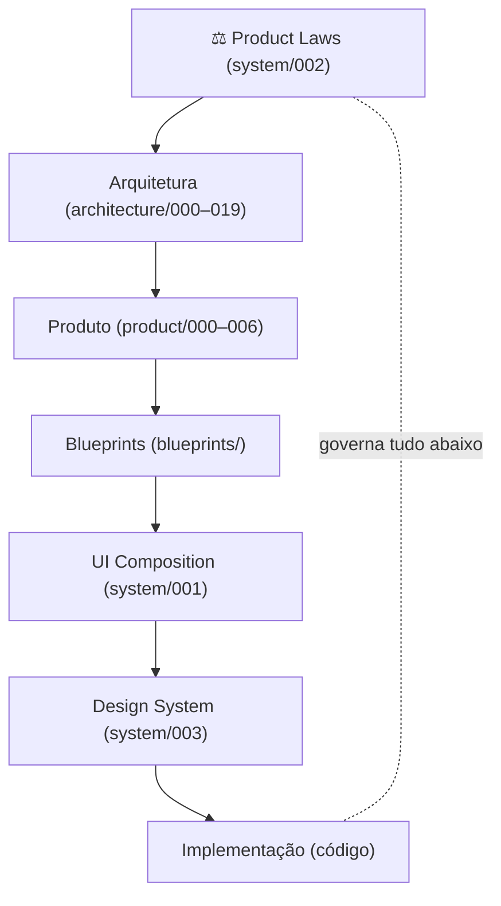
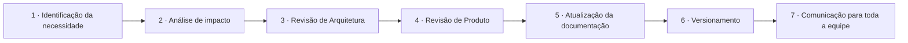

# System/002 — Product Laws (Constituição do Produto)

> **Autoridade máxima da experiência do produto Zion.** Este documento define as **Leis Oficiais do Produto** — regras **permanentes** que prevalecem sobre qualquer decisão local de UX, Design, Frontend, Engenharia, Blueprint ou nova funcionalidade. **Nenhuma tela, componente ou decisão pode violar uma Product Law.**

> [!important] Registro oficial
> **As Product Laws são a autoridade máxima da experiência do produto. Qualquer documento de Produto, Blueprint, Design ou Interface deve obedecer às Product Laws.** Elas não descrevem funcionalidades — descrevem a **identidade permanente** da Zion. Quem lê este documento entende **como a Zion pensa**, sem conhecer a implementação técnica.

> **Base (contexto, não copiado):** [000 Vision](../000-product-vision.md) · [001 Design Principles](../001-design-principles.md) · [002 Information Architecture](../002-information-architecture.md) · [003 Navigation](../003-navigation.md) · [004 Operation Center](../004-operation-center.md) · [005 Workspace](../005-product-workspace.md) · [006 Portal](../006-client-portal.md) · [blueprints/000 Guide](../blueprints/000-blueprint-guide.md) · [blueprints/004 Catalog](../blueprints/004-component-catalog.md) · [system/001 UI Composition](./001-ui-composition-system.md) · arquitetura 000–019.

---

## 1. Objetivo

Definir oficialmente as **Product Laws** — a constituição comportamental da Zion. Elas respondem:
- **Quais regras nunca podem ser quebradas?**
- **Quais princípios têm prioridade máxima?**
- **Como impedir que a Zion perca sua identidade ao crescer?**

> [!important] Permanência e precedência
> - **Permanentes:** as Leis não são features; não "saem de moda". Evoluem só por processo formal ([§Processo de Evolução](#seção-especial--processo-de-evolução-das-product-laws)).
> - **Precedência:** em qualquer conflito entre uma Lei e uma decisão local (uma tela, um componente, um prazo), **a Lei vence**. Uma exceção local nunca revoga uma Lei.

---

## 2. Filosofia

> **Produtos evoluem. As Leis permanecem.**

A implementação da Zion mudará muitas vezes — telas, frameworks, modelos de IA, canais, ERPs. As Leis são o que **não muda**: a espinha de identidade que faz a Zion de daqui a dez anos ser reconhecidamente **a mesma Zion**.

As Leis protegem quatro coisas:

| Protege | Contra |
|---------|--------|
| **Consistência** | telas diferentes para o mesmo problema. |
| **Clareza** | complexidade e ambiguidade. |
| **Confiança** | dado inventado, decisão opaca, vigilância. |
| **Identidade** | a diluição do produto ao crescer. |

---

## 3. Hierarquia das Decisões

A ordem oficial de autoridade — de cima para baixo, o de cima **sempre** prevalece:



| Camada | Autoridade sobre | Deve obedecer |
|--------|------------------|---------------|
| **Product Laws** | tudo | — (topo) |
| **Arquitetura** | responsabilidades, fronteiras, eventos | Product Laws |
| **Produto** | experiência, UX, navegação | Laws + Arquitetura |
| **Blueprints** | especificação de tela | + Produto |
| **UI Composition** | organização dos componentes | + Blueprints |
| **Design System** | aparência (tokens/estilo) | + UI Composition |
| **Implementação** | código | tudo acima |

> [!important] A regra de leitura da hierarquia
> Uma decisão só é válida se **não contradiz nenhuma camada acima dela**. Uma escolha de implementação nunca justifica violar uma Lei; uma tela nunca justifica violar a Arquitetura.

---

## 4. Leis Fundamentais

As **20 Leis** oficiais. Cada uma: **Descrição · Motivação · Exemplo correto · Exemplo incorreto · Impacto · Classificação** ([taxonomia L1–L4](#seção-especial--classificação-das-leis)).

---

### L01 — Toda tela responde "o que preciso fazer agora?" · **L1**
- **Descrição:** cada tela tem de tornar óbvia a próxima ação do usuário.
- **Motivação:** a Zion conduz trabalho, não exibe dados; sem próximo passo, a tela falhou seu propósito.
- **Correto:** o cockpit abre com Missões priorizadas e o botão de agir.
- **Incorreto:** uma tela que só mostra gráficos, sem nenhuma ação.
- **Impacto:** define o cockpit como Home e a moldura de toda tela.

### L02 — Toda informação possui contexto · **L1**
- **Descrição:** nenhum número/estado aparece sozinho; sempre com comparação, tendência ou significado.
- **Motivação:** dado sem contexto não permite decidir — decora.
- **Correto:** "Margem 18% ↑+2% (30d) · acima da meta".
- **Incorreto:** "Margem 18%".
- **Impacto:** governa toda apresentação de métrica.

### L03 — Toda informação possui uma Fonte da Verdade (um único dono) · **L1**
- **Descrição:** cada informação tem **um** dono canônico; ninguém mais a escreve.
- **Motivação:** múltiplos donos = verdades divergentes (o problema original que a Zion resolve).
- **Correto:** custo/estoque são do ERP; a Zion espelha (read-only).
- **Incorreto:** a tela "edita" estoque diretamente.
- **Impacto:** base de toda a arquitetura ([000](../../architecture/000-business-domain.md)).

### L04 — Toda informação declara sua origem · **L2**
- **Descrição:** todo valor mostra **de onde veio** (ERP/IA/estimativa/operador/template/integração/política).
- **Motivação:** confiança exige proveniência; o usuário precisa saber o quão firme é o chão.
- **Correto:** `OriginBadge` "do seu ERP" / "estimado".
- **Incorreto:** um custo sem indicar se é real ou chutado.
- **Impacto:** `OriginBadge` obrigatório onde há dado de origem.

### L05 — Nenhum dado é inventado · **L1**
- **Descrição:** falta de dado vira **"⚠️ informação necessária"**, nunca um valor fabricado.
- **Motivação:** um número inventado corrói toda a confiança do sistema.
- **Correto:** produto sem EAN mostra pendência.
- **Incorreto:** a IA "preenche" um EAN plausível.
- **Impacto:** regra-mãe da IA e dos engines (custo/margem).

### L06 — Apresentação nunca calcula; cálculo nunca apresenta · **L1**
- **Descrição:** telas apresentam; engines calculam; interpretação e decisão são camadas distintas.
- **Motivação:** misturar as duas produz números divergentes e responsabilidade difusa.
- **Correto:** a tela mostra a margem que o Commercial Intelligence calculou.
- **Incorreto:** a UI recalcula a margem "pra ir mais rápido".
- **Impacto:** separação Cost Engine × Commercial × Maturity × telas.

### L07 — A IA recomenda; o humano decide · **L1**
- **Descrição:** nenhuma IA executa decisão sem autorização humana (salvo autonomia explicitamente concedida e reversível).
- **Motivação:** a IA amplia a capacidade da empresa; não a comanda.
- **Correto:** o Coach sugere "revisar preço" com um botão; o operador confirma.
- **Incorreto:** a IA muda o preço sozinha e avisa depois.
- **Impacto:** governa toda participação de IA na plataforma.

### L08 — Toda recomendação explica o motivo (e a confiança) · **L2**
- **Descrição:** toda sugestão traz por quê, ganho esperado, origem e confiança.
- **Motivação:** recomendação sem justificativa é palpite; a Zion não dá palpites.
- **Correto:** "recomendo X porque Y; confiança alta".
- **Incorreto:** "faça X" sem explicação.
- **Impacto:** contrato do `CoachCard`.

### L09 — Toda recomendação pode ser recusada · **L2**
- **Descrição:** a IA nunca bloqueia; o usuário pode seguir sem ela.
- **Motivação:** manter o humano no controle e a IA opcional.
- **Correto:** "Dispensar" sempre disponível.
- **Incorreto:** um fluxo que só avança "aceitando a IA".
- **Impacto:** a IA acompanha, não obriga.

### L10 — Toda alteração relevante é auditável e versionada · **L1**
- **Descrição:** o que muda gera evento + histórico (quem, quando, old→new); reversível quando aplicável.
- **Motivação:** confiança e responsabilidade exigem rastro; nada acontece "no escuro".
- **Correto:** editar um título gera Versão + entrada na Timeline.
- **Incorreto:** uma mudança que não deixa rastro.
- **Impacto:** Event Bus + Versionamento + Ledger.

### L11 — Toda automação obedece a políticas · **L2**
- **Descrição:** o que roda sozinho age **dentro** de políticas explícitas; sem política, para e pergunta.
- **Motivação:** automação sem limite é risco; política é o freio.
- **Correto:** publicar em lote respeita piso/limites configurados.
- **Incorreto:** automatizar preço sem regra de margem.
- **Impacto:** Workflow Engine executa política, não improviso.

### L12 — Nenhuma tela contradiz outra · **L2**
- **Descrição:** o mesmo conceito se comporta e se apresenta igual em toda a plataforma.
- **Motivação:** contradição quebra "uma única Zion" e força reaprendizado.
- **Correto:** Health é igual no cockpit, no workspace e no portal (muda o escopo).
- **Incorreto:** dois "Healths" com escalas/cores diferentes.
- **Impacto:** Component Catalog + UI Composition.

### L13 — Toda tela tem um objetivo único · **L2**
- **Descrição:** cada tela existe para resolver **uma** coisa; sem "tela que faz tudo".
- **Motivação:** foco reduz carga cognitiva e evita becos.
- **Correto:** o Workspace opera **um** produto.
- **Incorreto:** uma tela que mistura config, relatório e operação.
- **Impacto:** disciplina de escopo por tela.

### L14 — Toda ação tem consequência conhecida · **L1**
- **Descrição:** o usuário sabe o efeito antes de confirmar; irreversível é **declarado**; reversível tem rollback.
- **Motivação:** nada destrutivo por acidente; segurança e calma.
- **Correto:** "esta ação não pode ser desfeita — confirme".
- **Incorreto:** um botão que apaga em massa sem aviso.
- **Impacto:** confirmações, reversibilidade, feedback.

### L15 — Transparência nunca é vigilância · **L1**
- **Descrição:** a Zion ilumina a **operação** (trabalho, progresso), nunca o comportamento individual de pessoas.
- **Motivação:** dignidade de quem opera; confiança na relação agência↔cliente↔equipe.
- **Correto:** "Bruno sobrecarregado → aliviar".
- **Incorreto:** ranquear pessoas por produtividade para punir.
- **Impacto:** Painel do Gestor e Portal são colaboração, não fiscalização.

### L16 — O humano permanece no controle · **L1**
- **Descrição:** o usuário pode intervir, pausar e reverter a qualquer momento.
- **Motivação:** a plataforma serve o humano, nunca o contrário.
- **Correto:** rebaixar a autonomia da IA quando quiser.
- **Incorreto:** um processo que não pode ser interrompido.
- **Impacto:** autonomia progressiva e reversível.

### L17 — Todo número derivado carrega sua precisão · **L2**
- **Descrição:** valores calculados (custo, margem, health) exibem sua **confiança**; precisão nunca é maquiada.
- **Motivação:** decidir sobre um número frágil sem saber que é frágil gera erro caro.
- **Correto:** `PrecisionBadge` "estimativa" numa margem incompleta.
- **Incorreto:** mostrar margem "exata" sobre custo faltante.
- **Impacto:** `PrecisionBadge` obrigatório; recomendações parciais marcadas.

### L18 — Isolamento por tenant é absoluto · **L1**
- **Descrição:** um cliente **nunca** vê outro cliente; um papel só vê o que lhe cabe (deny-by-default).
- **Motivação:** privacidade e segurança multiempresa são inegociáveis.
- **Correto:** `PERMISSION_DENIED` não busca nem revela dado.
- **Incorreto:** um vazamento de dado entre tenants "por engano".
- **Impacto:** RLS em todas as origens e telas.

### L19 — A plataforma cresce em contexto, não em menu · **L3**
- **Descrição:** novas capacidades entram como **visões dentro de contextos existentes**; nunca um menu por Capability.
- **Motivação:** evitar o arquipélago de módulos que a Zion veio substituir.
- **Correto:** uma nova análise vira uma visão em Analytics.
- **Incorreto:** um "menu Cost Engine".
- **Impacto:** navegação e escalabilidade ([003](../003-navigation.md)).

### L20 — Nenhuma funcionalidade cria uma nova linguagem · **L2**
- **Descrição:** toda feature nova reutiliza os conceitos, componentes e padrões existentes.
- **Motivação:** cada dialeto novo fragmenta o produto e confunde o usuário.
- **Correto:** um recurso novo usa `MissionCard`/`HealthCard` existentes.
- **Incorreto:** inventar um "card de tarefa" paralelo à Missão.
- **Impacto:** Catálogo + Composition governam o crescimento.

---

## 5. Leis da IA

Derivam de L05/L07/L08/L09/L10 — consolidadas para a IA:

| Lei | Descrição | Classe |
|-----|-----------|:-----:|
| **A IA recomenda** | propõe ações; nunca é a decisão final (salvo autonomia autorizada/reversível). | L1 |
| **A IA explica** | toda saída traz motivo, ganho, origem e confiança. | L2 |
| **A IA nunca inventa** | falta de dado = pendência, jamais valor fabricado. | L1 |
| **A IA respeita o contexto** | fala do objeto/tela atual; no Portal, linguagem de negócio. | L2 |
| **A IA respeita políticas** | age dentro dos limites (comercial, custo, autonomia). | L2 |
| **A IA preserva a auditoria** | toda recomendação/execução entra no Ledger. | L1 |
| **A IA é uma só** | o usuário vê "a Zion", não agentes distintos. | L2 |

---

## 6. Leis da Interface

Derivam de L01/L02/L12/L14 e do [UI Composition (001)](./001-ui-composition-system.md):

| Lei | Descrição | Classe |
|-----|-----------|:-----:|
| **Nenhuma tela sem ação** | todo elemento leva a um próximo passo. | L1 |
| **Nenhuma tela sem contexto** | nada de dado órfão. | L1 |
| **Nenhuma Timeline duplicada** | uma por contexto; variações são `scope`. | L2 |
| **Coach nunca em modal** | vive no Painel Lateral; nunca interrompe. | L2 |
| **Health sempre visível** | acima da dobra, acionável. | L2 |
| **Uma prioridade máxima por tela** | ≤1 "faça isto primeiro"; ≤3 alertas críticos. | L2 |
| **Posições são fixas** | Sidebar à esquerda, Painel à direita, Timeline abaixo. | L2 |

---

## 7. Leis dos Dados

Derivam de L03/L04/L05/L10/L17/L18:

| Lei | Descrição | Classe |
|-----|-----------|:-----:|
| **Fonte da Verdade** | cada dado tem um único dono canônico. | L1 |
| **Origem** | todo valor declara sua fonte. | L2 |
| **Precisão** | todo número derivado declara sua confiança. | L2 |
| **Auditoria** | toda alteração gera evento + histórico. | L1 |
| **Rastreabilidade** | é possível reconstruir de onde veio e quem mudou. | L2 |
| **Isolamento** | dado escopado por tenant, deny-by-default. | L1 |

---

## 8. Leis da Experiência

Derivam de L12/L13/L19/L20 — garantem "uma única Zion":

| Lei | Descrição | Classe |
|-----|-----------|:-----:|
| **Uma única linguagem** | os mesmos conceitos em toda a plataforma. | L2 |
| **Mesmo ritmo** | a mesma hierarquia visual e fluxo do olhar. | L2 |
| **Mesmo comportamento** | o mesmo componente age igual em todo lugar. | L2 |
| **Mesmo fluxo mental** | toda tela responde "o que fazer agora?". | L1 |

---

## 9. Leis da Evolução

Como novas funcionalidades entram sem diluir o produto:

| Lei | Descrição | Classe |
|-----|-----------|:-----:|
| **Nenhuma feature cria nova linguagem** | reutiliza conceitos/componentes existentes. | L2 |
| **Nenhum componente novo sem necessidade** | antes, verificar se é variação de um existente ([004](../blueprints/004-component-catalog.md)). | L3 |
| **Nenhum layout novo sem aprovação** | os layouts oficiais cobrem os casos ([001](./001-ui-composition-system.md)). | L3 |
| **Toda evolução preserva as Leis L1** | crescer nunca justifica quebrar uma Lei Fundamental. | L1 |

---

## 10. Anti-Leis (decisões proibidas)

Padrões **explicitamente banidos** — rejeitar em qualquer revisão:

| Anti-Lei | Viola |
|----------|-------|
| **Duplicar componentes** para a mesma responsabilidade | L12/L20 |
| **Dashboards sem ação** (números para admirar) | L01 |
| **IA que decide sozinha** (sem autorização/reversão) | L07/L16 |
| **Números sem origem** | L04 |
| **Módulos isolados** (arquipélago) | L19 |
| **Telas sem propósito** | L13 |
| **Dado inventado** para "preencher a lacuna" | L05 |
| **Recalcular na UI** o que é de um engine | L06 |
| **Vigiar pessoas** sob o nome de transparência | L15 |
| **Exceção local** que quebra uma Lei "só neste caso" | todas |

---

## 11. Checklist (toda funcionalidade deve passar)

```
□ A tela responde "o que preciso fazer agora?" (L01)?
□ Toda informação tem contexto (L02) e origem (L04)?
□ Todo dado tem Fonte da Verdade única (L03); nada inventado (L05)?
□ A UI apresenta sem calcular (L06)?
□ A IA recomenda, explica, pode ser recusada; o humano decide (L07/L08/L09)?
□ Toda alteração é auditável/versionada (L10)?
□ Automação respeita políticas (L11)?
□ Nada contradiz outra tela; nenhuma linguagem nova (L12/L20)?
□ A tela tem objetivo único (L13)?
□ Toda ação tem consequência conhecida/reversível-ou-declarada (L14)?
□ Transparência sem vigilância (L15); humano no controle (L16)?
□ Número derivado com precisão (L17)?
□ Isolamento por tenant absoluto (L18)?
□ Cresce em contexto, não em menu (L19)?
□ Sem nenhuma Anti-Lei (§10)?
□ Nenhuma exceção local que quebre uma Lei?
```

---

## 12. Critérios de Aceite

- [ ] **A funcionalidade não viola nenhuma Lei L1** (sob nenhuma hipótese).
- [ ] **Passa o Checklist (§11)** integralmente.
- [ ] **Nenhuma Anti-Lei (§10)** presente.
- [ ] **Respeita a Hierarquia das Decisões (§3)** — não contradiz nenhuma camada acima.
- [ ] **Cada Lei aplicada é rastreável** ao seu número (L01–L20).
- [ ] **Conflitos foram resolvidos por revisão** ([§Conflitos](#seção-especial--conflitos-entre-leis)), nunca por exceção local.
- [ ] **A documentação foi atualizada** se alguma Lei evoluiu ([§Processo](#seção-especial--processo-de-evolução-das-product-laws)).

---

## Seção especial — A Constituição da Zion

> A Zion viverá muitos anos. Suas telas mudarão. Seus frameworks serão substituídos. Seus modelos de IA, seus canais, seus bancos de dados — tudo pode ser trocado.
>
> Estas Leis são o que **não muda**.
>
> Elas não descrevem o que a Zion **faz**; descrevem **como a Zion pensa**. Uma pessoa que nunca viu uma linha do código da Zion, ao ler estas Leis, entende o produto: que ele conduz trabalho, que fala uma verdade só, que a inteligência recomenda mas o humano decide, que nada é inventado, que nada acontece no escuro, que ninguém é vigiado.
>
> Uma feature bonita que quebra uma Lei **não é uma feature Zion**. Um atalho técnico que viola uma Lei **não é uma solução** — é uma dívida contra a identidade do produto.
>
> Enquanto estas Leis forem respeitadas, a Zion de daqui a dez anos será, inconfundivelmente, **a mesma Zion**.

---

## Seção especial — Quando uma Lei entra em conflito (com uma decisão local)

**Sempre vence: a Product Law.**

Nenhuma conveniência de UX, Design, Frontend, Engenharia ou prazo justifica violar uma Lei. Quando uma decisão local parece exigir a quebra de uma Lei, isso é sinal de que **a decisão está errada** — não de que a Lei precisa de exceção. A saída é **repensar a decisão**, não abrir um buraco na constituição. (Conflitos **entre duas Leis** têm regra própria — ver [§Conflitos entre Leis](#seção-especial--conflitos-entre-leis).)

---

## Seção especial — As Leis devem sobreviver ao tempo

Uma Product Law é **atemporal e independente de tecnologia**. Ela deve continuar válida mesmo que **toda a implementação da Zion seja substituída**.

Uma Lei **nunca** depende de: React · Next.js · Tailwind · Supabase · PostgreSQL · OpenAI · Claude · Gemini · um marketplace específico · um ERP específico · uma interface específica.

| ❌ Não é Lei (depende de tecnologia/tela) | ✅ É Lei (atemporal) |
|-------------------------------------------|----------------------|
| "O Coach usa um card à direita com sombra." | "A IA recomenda; o humano decide." |
| "A margem é calculada no Cost Engine em TypeScript." | "Apresentação nunca calcula; cálculo nunca apresenta." |
| "O botão de publicar é azul." | "Toda ação tem consequência conhecida." |

Uma Lei descreve **o que a Zion é** — não **como ela está construída hoje**.

---

## Seção especial — Critérios para criação de uma nova Lei

Antes de adicionar uma Product Law, ela deve responder **sim** a **todas**:

```
□ Continuará válida daqui a 10 anos?
□ Protege a identidade da Zion?
□ Reduz ambiguidades?
□ Evita decisões conflitantes?
□ Pode ser aplicada em qualquer tela?
□ Pode ser ensinada a um novo membro da equipe?
□ Vale para toda a plataforma?
```

> [!important] Teste do "não"
> Se **qualquer** resposta for "não", isso **não é uma Product Law** — é uma decisão local de design ou implementação, e pertence a outro documento (UI Composition, Design System, ou o Blueprint da tela).

---

## Seção especial — Classificação das Leis

Toda Lei tem uma **classe oficial**, que define **como ela pode evoluir**:

| Classe | Nome | Pode mudar? | Quando usar |
|:-----:|------|-------------|-------------|
| **L1** | **Lei Fundamental** | **Nunca** — inviolável em qualquer hipótese. | identidade e confiança essenciais (Fonte da Verdade, humano no controle, não inventar, isolamento, auditoria). |
| **L2** | **Lei Estrutural** | só por **revisão arquitetural** formal. | regras que estruturam a experiência/dados (origem, precisão, consistência, IA explicável). |
| **L3** | **Lei Operacional** | por **aprovação de Produto**. | regras de operação/evolução (crescer em contexto, componente novo só se necessário). |
| **L4** | **Diretriz** | conforme a **maturidade** da plataforma. | orientações que se afinam com o tempo (defaults, ênfases). |

Regra: quanto **mais baixo** o número (L1), **mais rígida** a Lei. Uma L1 nunca é rebaixada para "resolver um caso".

---

## Seção especial — Conflitos entre Leis

Quando **duas Product Laws** entram em conflito, a ordem oficial de prioridade é:

1. **Experiência do usuário** > conveniências técnicas.
2. **Fonte da Verdade** > conveniência visual.
3. **Auditabilidade** > automação.
4. **Clareza** > densidade de informação.
5. **Consistência** > personalizações locais.
6. **Segurança** > velocidade.

> [!important] Conflito gera revisão, nunca exceção
> Um conflito entre Leis é um sinal de que a arquitetura precisa de um ajuste — deve **gerar revisão arquitetural**, jamais uma exceção local. A resolução vira parte da documentação (e pode originar uma nova Lei ou a reclassificação de uma existente).

---

## Seção especial — Processo de Evolução das Product Laws

**Nenhuma Product Law pode ser alterada informalmente.** Toda mudança segue obrigatoriamente:



| Etapa | Garante |
|-------|---------|
| Identificação | que há uma necessidade real (não conveniência). |
| Análise de impacto | mapear o que a mudança afeta (telas, engines, Leis vizinhas). |
| Revisão de Arquitetura | que a Lei nova/alterada não contradiz a Camada 1. |
| Revisão de Produto | que preserva a identidade e a experiência. |
| Atualização da doc | que a fonte da verdade das Leis fica correta. |
| Versionamento | rastro (v1.0 → v1.1 → v2.0). |
| Comunicação | que toda a equipe opera sob a mesma constituição. |

> [!important] Governança oficial
> As Product Laws fazem parte da **governança oficial da Zion**. Alterá-las é um ato de constituição, não uma edição de texto. Mudanças em L1/L2 exigem **revisão arquitetural**; L3/L4, aprovação de Produto.

---

> **Registro oficial:** **As Product Laws são a autoridade máxima da experiência do produto Zion. Qualquer documento de Produto, Blueprint, Design ou Interface deve obedecer às Product Laws. Elas descrevem a identidade permanente do produto — não suas funcionalidades.**

> **Status:** `system/002` — Product Laws **v1.0**. Constituição do Produto: 20 Leis Fundamentais (L01–L20) + Leis temáticas (IA, Interface, Dados, Experiência, Evolução) + Anti-Leis, com taxonomia L1–L4, resolução de conflitos e processo formal de evolução. Prevalece sobre Arquitetura, Produto, Blueprints, UI Composition, Design System e Implementação ([§3](#3-hierarquia-das-decisões)). **Próximo documento sugerido:** `docs/product/system/003-design-system.md` (o Design System da Zion — a **aparência** que obedece a estas Leis: tokens de cor/tipografia/espaçamento/elevação, o sistema visual de Health/Precisão/Prioridade **acessível** (cor+texto+ícone, cumprindo L02/L17), os estados visuais canônicos e as regras que estilizam — sem nunca reorganizar (isso é do [UI Composition 001](./001-ui-composition-system.md)) nem violar uma Product Law; o `003` estiliza o que o `001` organiza e o `002` governa).
